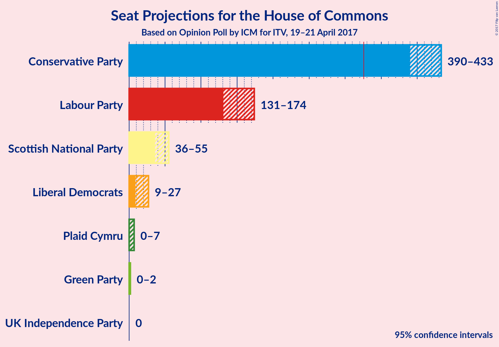
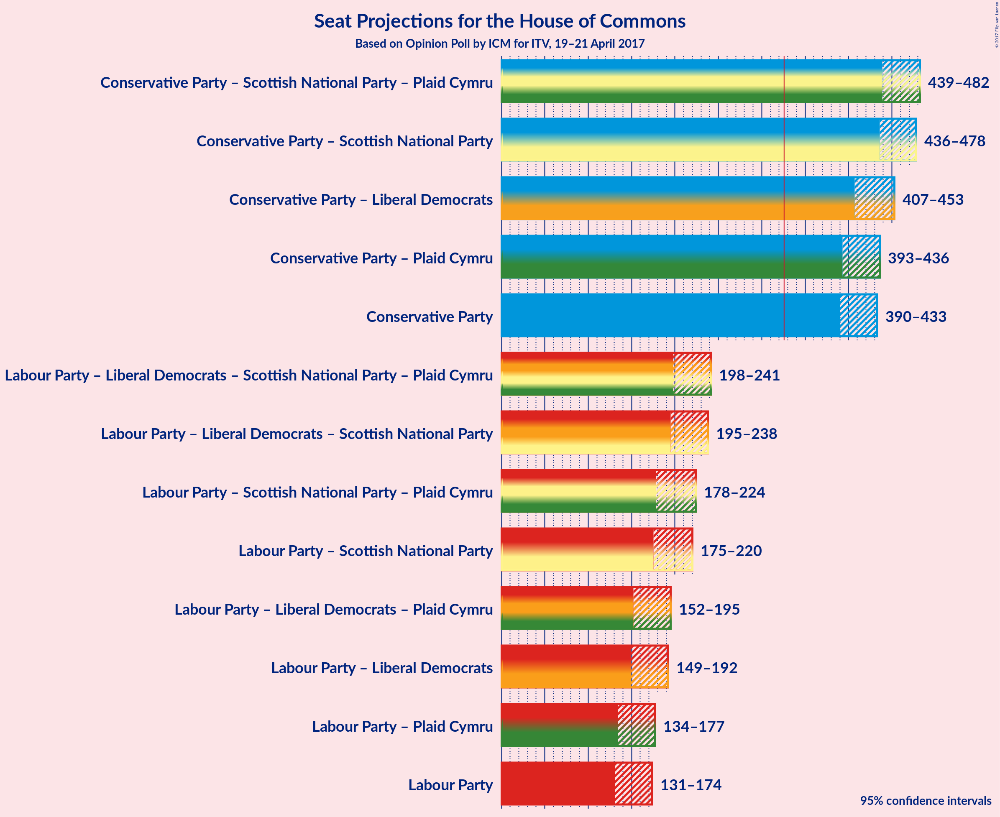

# Opinion Poll by ICM for ITV, 19–21 April 2017

<a href="#voting-intentions">Voting Intentions</a> | <a href="#seats">Seats</a> | <a href="#coalitions">Coalitions</a> | <a href="#technical-information">Technical Information</a>

## Voting Intentions

### Confidence Intervals

| Party | Last Result | Poll Result | 80% Confidence Interval | 90% Confidence Interval | 95% Confidence Interval | 99% Confidence Interval |
|:-----:|:-----------:|:-----------:|:-----------------------:|:-----------------------:|:-----------------------:|:-----------------------:|
| Conservative Party | 36.9% | 49.5% | 47.7–51.0% |47.2–51.5% |46.8–51.9% |46.0–52.7% |
| Labour Party | 30.4% | 25.0% | 23.5–26.4% |23.2–26.9% |22.8–27.2% |22.2–27.9% |
| Liberal Democrats | 7.9% | 9.9% | 8.9–10.9% |8.7–11.2% |8.4–11.5% |8.0–12.0% |
| UK Independence Party | 12.6% | 7.7% | 6.9–8.7% |6.7–8.9% |6.5–9.2% |6.1–9.7% |
| Scottish National Party | 4.7% | 3.9% | 3.3–4.6% |3.2–4.8% |3.0–5.0% |2.8–5.4% |
| Green Party | 3.8% | 3.4% | 2.8–4.0% |2.7–4.2% |2.5–4.4% |2.3–4.8% |
| Plaid Cymru | 0.6% | 0.5% | 0.4–0.9% |0.3–1.0% |0.3–1.1% |0.2–1.2% |

*Note:* The poll result column reflects the actual value used in the calculations. Published results may vary slightly, and in addition be rounded to fewer digits.

## Seats

### Confidence Intervals

| Party | Last Result | Median | 80% Confidence Interval | 90% Confidence Interval | 95% Confidence Interval | 99% Confidence Interval |
|:-----:|:-----------:|:------:|:-----------------------:|:-----------------------:|:-----------------------:|:-----------------------:|
| <a href="#conservative-party">Conservative Party</a> | 331 | 413 | 399–425 |394–430 |390–433 |384–439 |
| <a href="#labour-party">Labour Party</a> | 232 | 151 | 139–164 |135–169 |131–174 |126–180 |
| <a href="#liberal-democrats">Liberal Democrats</a> | 8 | 18 | 12–24 |10–26 |9–27 |7–29 |
| <a href="#uk-independence-party">UK Independence Party</a> | 1 | 0 | 0 |0 |0 |0 |
| <a href="#scottish-national-party">Scottish National Party</a> | 56 | 45 | 40–53 |39–54 |36–55 |33–56 |
| <a href="#green-party">Green Party</a> | 1 | 1 | 1 |0–2 |0–2 |0–2 |
| <a href="#plaid-cymru">Plaid Cymru</a> | 3 | 4 | 1–5 |0–6 |0–7 |0–8 |

### Conservative Party

| Number of Seats | Probability | Accumulated |
|:---------------:|:-----------:|:-----------:|
| 377 | 0% | 100% |
| 378 | 0% | 99.9% |
| 379 | 0% | 99.9% |
| 380 | 0.1% | 99.9% |
| 381 | 0.1% | 99.8% |
| 382 | 0.1% | 99.7% |
| 383 | 0.1% | 99.6% |
| 384 | 0.2% | 99.5% |
| 385 | 0.2% | 99.4% |
| 386 | 0.3% | 99.2% |
| 387 | 0.4% | 98.9% |
| 388 | 0.6% | 98.5% |
| 389 | 0.4% | 98% |
| 390 | 0.3% | 98% |
| 391 | 0.2% | 97% |
| 392 | 1.0% | 97% |
| 393 | 0.9% | 96% |
| 394 | 0.4% | 95% |
| 395 | 0.7% | 95% |
| 396 | 0.5% | 94% |
| 397 | 1.1% | 94% |
| 398 | 1.1% | 92% |
| 399 | 1.4% | 91% |
| 400 | 0.9% | 90% |
| 401 | 1.2% | 89% |
| 402 | 3% | 88% |
| 403 | 2% | 85% |
| 404 | 3% | 83% |
| 405 | 2% | 80% |
| 406 | 3% | 78% |
| 407 | 2% | 74% |
| 408 | 4% | 72% |
| 409 | 4% | 68% |
| 410 | 2% | 64% |
| 411 | 3% | 62% |
| 412 | 5% | 59% |
| 413 | 6% | 54% |
| 414 | 4% | 48% |
| 415 | 3% | 44% |
| 416 | 5% | 40% |
| 417 | 4% | 36% |
| 418 | 2% | 31% |
| 419 | 3% | 29% |
| 420 | 3% | 26% |
| 421 | 3% | 23% |
| 422 | 2% | 19% |
| 423 | 3% | 17% |
| 424 | 2% | 14% |
| 425 | 2% | 12% |
| 426 | 2% | 9% |
| 427 | 1.1% | 8% |
| 428 | 0.5% | 7% |
| 429 | 0.7% | 6% |
| 430 | 0.9% | 5% |
| 431 | 1.0% | 4% |
| 432 | 0.6% | 3% |
| 433 | 0.8% | 3% |
| 434 | 0.4% | 2% |
| 435 | 0.4% | 2% |
| 436 | 0.2% | 1.2% |
| 437 | 0.1% | 1.0% |
| 438 | 0.2% | 0.8% |
| 439 | 0.2% | 0.7% |
| 440 | 0.1% | 0.4% |
| 441 | 0.1% | 0.3% |
| 442 | 0.1% | 0.3% |
| 443 | 0% | 0.2% |
| 444 | 0% | 0.1% |
| 445 | 0% | 0.1% |
| 446 | 0% | 0.1% |
| 447 | 0% | 0% |

### Labour Party

| Number of Seats | Probability | Accumulated |
|:---------------:|:-----------:|:-----------:|
| 118 | 0% | 100% |
| 119 | 0% | 99.9% |
| 120 | 0% | 99.9% |
| 121 | 0% | 99.9% |
| 122 | 0% | 99.8% |
| 123 | 0% | 99.8% |
| 124 | 0.1% | 99.8% |
| 125 | 0.2% | 99.7% |
| 126 | 0.2% | 99.5% |
| 127 | 0.3% | 99.3% |
| 128 | 0.4% | 99.0% |
| 129 | 0.5% | 98.6% |
| 130 | 0.6% | 98% |
| 131 | 0.5% | 98% |
| 132 | 0.4% | 97% |
| 133 | 0.3% | 97% |
| 134 | 0.5% | 96% |
| 135 | 1.1% | 96% |
| 136 | 1.2% | 95% |
| 137 | 1.2% | 93% |
| 138 | 2% | 92% |
| 139 | 2% | 90% |
| 140 | 3% | 89% |
| 141 | 3% | 85% |
| 142 | 2% | 82% |
| 143 | 3% | 80% |
| 144 | 3% | 78% |
| 145 | 3% | 74% |
| 146 | 4% | 71% |
| 147 | 3% | 67% |
| 148 | 5% | 64% |
| 149 | 4% | 59% |
| 150 | 4% | 55% |
| 151 | 5% | 51% |
| 152 | 3% | 46% |
| 153 | 5% | 43% |
| 154 | 4% | 38% |
| 155 | 3% | 34% |
| 156 | 3% | 31% |
| 157 | 3% | 28% |
| 158 | 2% | 25% |
| 159 | 6% | 23% |
| 160 | 2% | 17% |
| 161 | 1.2% | 14% |
| 162 | 0.4% | 13% |
| 163 | 0.6% | 13% |
| 164 | 2% | 12% |
| 165 | 1.2% | 10% |
| 166 | 1.1% | 9% |
| 167 | 1.5% | 8% |
| 168 | 0.8% | 6% |
| 169 | 0.3% | 5% |
| 170 | 0.7% | 5% |
| 171 | 0.3% | 4% |
| 172 | 0.4% | 4% |
| 173 | 0.9% | 4% |
| 174 | 0.5% | 3% |
| 175 | 0.6% | 2% |
| 176 | 0.5% | 2% |
| 177 | 0.3% | 1.1% |
| 178 | 0.1% | 0.9% |
| 179 | 0.2% | 0.7% |
| 180 | 0.2% | 0.6% |
| 181 | 0.1% | 0.4% |
| 182 | 0.1% | 0.3% |
| 183 | 0.1% | 0.2% |
| 184 | 0.1% | 0.2% |
| 185 | 0% | 0.1% |
| 186 | 0% | 0.1% |
| 187 | 0% | 0% |

### Liberal Democrats

| Number of Seats | Probability | Accumulated |
|:---------------:|:-----------:|:-----------:|
| 6 | 0.2% | 100% |
| 7 | 0.3% | 99.7% |
| 8 | 0.9% | 99.4% |
| 9 | 2% | 98.5% |
| 10 | 2% | 97% |
| 11 | 4% | 95% |
| 12 | 4% | 91% |
| 13 | 3% | 87% |
| 14 | 7% | 84% |
| 15 | 6% | 77% |
| 16 | 7% | 71% |
| 17 | 11% | 64% |
| 18 | 7% | 53% |
| 19 | 8% | 46% |
| 20 | 11% | 38% |
| 21 | 6% | 27% |
| 22 | 3% | 21% |
| 23 | 7% | 18% |
| 24 | 3% | 11% |
| 25 | 3% | 8% |
| 26 | 1.1% | 5% |
| 27 | 3% | 4% |
| 28 | 0.5% | 1.3% |
| 29 | 0.4% | 0.8% |
| 30 | 0.2% | 0.4% |
| 31 | 0.1% | 0.2% |
| 32 | 0% | 0.1% |
| 33 | 0% | 0% |

### UK Independence Party

| Number of Seats | Probability | Accumulated |
|:---------------:|:-----------:|:-----------:|
| 0 | 100% | 100% |
| 1 | 0% | 0% |

### Scottish National Party

| Number of Seats | Probability | Accumulated |
|:---------------:|:-----------:|:-----------:|
| 25 | 0% | 100% |
| 26 | 0% | 99.9% |
| 27 | 0% | 99.9% |
| 28 | 0% | 99.9% |
| 29 | 0% | 99.9% |
| 30 | 0% | 99.9% |
| 31 | 0% | 99.9% |
| 32 | 0.1% | 99.8% |
| 33 | 0.6% | 99.7% |
| 34 | 0.5% | 99.1% |
| 35 | 0.6% | 98.7% |
| 36 | 0.7% | 98% |
| 37 | 1.0% | 97% |
| 38 | 1.0% | 96% |
| 39 | 3% | 95% |
| 40 | 5% | 93% |
| 41 | 3% | 87% |
| 42 | 3% | 84% |
| 43 | 15% | 81% |
| 44 | 3% | 67% |
| 45 | 16% | 63% |
| 46 | 7% | 48% |
| 47 | 7% | 40% |
| 48 | 6% | 33% |
| 49 | 5% | 27% |
| 50 | 4% | 22% |
| 51 | 4% | 18% |
| 52 | 3% | 14% |
| 53 | 3% | 11% |
| 54 | 5% | 8% |
| 55 | 1.5% | 3% |
| 56 | 2% | 2% |
| 57 | 0% | 0% |

### Green Party

| Number of Seats | Probability | Accumulated |
|:---------------:|:-----------:|:-----------:|
| 0 | 8% | 100% |
| 1 | 83% | 92% |
| 2 | 9% | 9% |
| 3 | 0% | 0% |

### Plaid Cymru

| Number of Seats | Probability | Accumulated |
|:---------------:|:-----------:|:-----------:|
| 0 | 7% | 100% |
| 1 | 12% | 93% |
| 2 | 0.3% | 80% |
| 3 | 25% | 80% |
| 4 | 44% | 55% |
| 5 | 3% | 11% |
| 6 | 4% | 8% |
| 7 | 3% | 4% |
| 8 | 1.0% | 1.1% |
| 9 | 0.1% | 0.2% |
| 10 | 0% | 0.1% |
| 11 | 0.1% | 0.1% |
| 12 | 0% | 0% |

## Coalitions

### Confidence Intervals

| Coalition | Last Result | Median | 80% Confidence Interval | 90% Confidence Interval | 95% Confidence Interval | 99% Confidence Interval |
|:---------:|:-----------:|:------:|:-----------------------:|:-----------------------:|:-----------------------:|:-----------------------:|
| Conservative Party – Scottish National Party – Plaid Cymru | 390 | 462 | 449–475 | 444–478 | 439–482 | 432–488 |
| Conservative Party – Scottish National Party | 387 | 459 | 445–471 | 440–475 | 436–478 | 429–485 |
| Conservative Party – Liberal Democrats | 339 | 431 | 416–446 | 411–449 | 407–453 | 399–460 |
| Conservative Party – Plaid Cymru | 334 | 417 | 403–429 | 397–433 | 393–436 | 387–443 |
| Conservative Party | 331 | 413 | 399–425 | 394–430 | 390–433 | 384–439 |
| Labour Party – Liberal Democrats – Scottish National Party – Plaid Cymru | 299 | 218 | 206–232 | 201–237 | 198–241 | 192–247 |
| Labour Party – Liberal Democrats – Scottish National Party | 296 | 214 | 202–228 | 198–234 | 195–238 | 188–244 |
| Labour Party – Scottish National Party – Plaid Cymru | 291 | 200 | 185–215 | 182–220 | 178–224 | 171–232 |
| Labour Party – Scottish National Party | 288 | 196 | 182–212 | 179–217 | 175–220 | 168–228 |
| Labour Party – Liberal Democrats – Plaid Cymru | 243 | 172 | 160–186 | 156–191 | 152–195 | 146–202 |
| Labour Party – Liberal Democrats | 240 | 169 | 156–182 | 153–187 | 149–192 | 143–199 |
| Labour Party – Plaid Cymru | 235 | 154 | 142–168 | 138–173 | 134–177 | 128–183 |
| Labour Party | 232 | 151 | 139–164 | 135–169 | 131–174 | 126–180 |

### Conservative Party – Scottish National Party – Plaid Cymru

| Number of Seats | Probability | Accumulated |
|:---------------:|:-----------:|:-----------:|
| 424 | 0% | 100% |
| 425 | 0% | 99.9% |
| 426 | 0% | 99.9% |
| 427 | 0% | 99.9% |
| 428 | 0.1% | 99.9% |
| 429 | 0% | 99.8% |
| 430 | 0.1% | 99.8% |
| 431 | 0.1% | 99.7% |
| 432 | 0.2% | 99.6% |
| 433 | 0.1% | 99.4% |
| 434 | 0.2% | 99.3% |
| 435 | 0.3% | 99.1% |
| 436 | 0.2% | 98.8% |
| 437 | 0.3% | 98.6% |
| 438 | 0.7% | 98% |
| 439 | 0.3% | 98% |
| 440 | 0.4% | 97% |
| 441 | 0.7% | 97% |
| 442 | 0.5% | 96% |
| 443 | 0.6% | 96% |
| 444 | 0.5% | 95% |
| 445 | 0.9% | 95% |
| 446 | 1.4% | 94% |
| 447 | 0.8% | 92% |
| 448 | 0.9% | 92% |
| 449 | 1.3% | 91% |
| 450 | 3% | 89% |
| 451 | 2% | 87% |
| 452 | 1.5% | 85% |
| 453 | 2% | 83% |
| 454 | 2% | 81% |
| 455 | 4% | 79% |
| 456 | 3% | 75% |
| 457 | 2% | 72% |
| 458 | 3% | 70% |
| 459 | 3% | 67% |
| 460 | 7% | 64% |
| 461 | 3% | 58% |
| 462 | 5% | 55% |
| 463 | 4% | 49% |
| 464 | 4% | 45% |
| 465 | 4% | 42% |
| 466 | 6% | 38% |
| 467 | 3% | 32% |
| 468 | 3% | 29% |
| 469 | 3% | 26% |
| 470 | 3% | 23% |
| 471 | 3% | 20% |
| 472 | 3% | 17% |
| 473 | 1.4% | 14% |
| 474 | 2% | 12% |
| 475 | 2% | 10% |
| 476 | 2% | 9% |
| 477 | 1.2% | 7% |
| 478 | 1.0% | 6% |
| 479 | 0.9% | 5% |
| 480 | 0.7% | 4% |
| 481 | 0.5% | 3% |
| 482 | 0.7% | 3% |
| 483 | 0.4% | 2% |
| 484 | 0.3% | 2% |
| 485 | 0.2% | 1.4% |
| 486 | 0.3% | 1.2% |
| 487 | 0.3% | 0.8% |
| 488 | 0.1% | 0.6% |
| 489 | 0.1% | 0.4% |
| 490 | 0.1% | 0.3% |
| 491 | 0.1% | 0.2% |
| 492 | 0% | 0.2% |
| 493 | 0% | 0.1% |
| 494 | 0% | 0.1% |
| 495 | 0% | 0.1% |
| 496 | 0% | 0% |

### Conservative Party – Scottish National Party

| Number of Seats | Probability | Accumulated |
|:---------------:|:-----------:|:-----------:|
| 421 | 0% | 100% |
| 422 | 0% | 99.9% |
| 423 | 0% | 99.9% |
| 424 | 0.1% | 99.9% |
| 425 | 0% | 99.8% |
| 426 | 0.1% | 99.8% |
| 427 | 0.1% | 99.7% |
| 428 | 0.2% | 99.7% |
| 429 | 0.1% | 99.5% |
| 430 | 0.1% | 99.4% |
| 431 | 0.3% | 99.3% |
| 432 | 0.3% | 99.0% |
| 433 | 0.1% | 98.7% |
| 434 | 0.6% | 98.6% |
| 435 | 0.4% | 98% |
| 436 | 0.4% | 98% |
| 437 | 0.7% | 97% |
| 438 | 0.5% | 96% |
| 439 | 0.5% | 96% |
| 440 | 0.5% | 95% |
| 441 | 0.8% | 95% |
| 442 | 0.9% | 94% |
| 443 | 2% | 93% |
| 444 | 0.7% | 92% |
| 445 | 1.0% | 91% |
| 446 | 1.2% | 90% |
| 447 | 2% | 89% |
| 448 | 2% | 86% |
| 449 | 1.4% | 85% |
| 450 | 2% | 83% |
| 451 | 4% | 81% |
| 452 | 4% | 77% |
| 453 | 2% | 73% |
| 454 | 2% | 71% |
| 455 | 3% | 69% |
| 456 | 4% | 66% |
| 457 | 6% | 62% |
| 458 | 4% | 56% |
| 459 | 4% | 53% |
| 460 | 4% | 48% |
| 461 | 3% | 45% |
| 462 | 5% | 42% |
| 463 | 5% | 37% |
| 464 | 3% | 32% |
| 465 | 4% | 28% |
| 466 | 3% | 24% |
| 467 | 3% | 22% |
| 468 | 4% | 19% |
| 469 | 1.2% | 15% |
| 470 | 2% | 13% |
| 471 | 2% | 12% |
| 472 | 1.2% | 10% |
| 473 | 2% | 9% |
| 474 | 1.1% | 7% |
| 475 | 1.3% | 6% |
| 476 | 0.9% | 4% |
| 477 | 0.5% | 4% |
| 478 | 0.6% | 3% |
| 479 | 0.6% | 2% |
| 480 | 0.3% | 2% |
| 481 | 0.4% | 2% |
| 482 | 0.2% | 1.2% |
| 483 | 0.3% | 1.0% |
| 484 | 0.2% | 0.7% |
| 485 | 0.2% | 0.6% |
| 486 | 0.1% | 0.4% |
| 487 | 0.1% | 0.3% |
| 488 | 0.1% | 0.2% |
| 489 | 0% | 0.1% |
| 490 | 0% | 0.1% |
| 491 | 0% | 0.1% |
| 492 | 0% | 0.1% |
| 493 | 0% | 0% |

### Conservative Party – Liberal Democrats

| Number of Seats | Probability | Accumulated |
|:---------------:|:-----------:|:-----------:|
| 392 | 0% | 100% |
| 393 | 0% | 99.9% |
| 394 | 0% | 99.9% |
| 395 | 0.1% | 99.9% |
| 396 | 0% | 99.8% |
| 397 | 0.1% | 99.8% |
| 398 | 0.1% | 99.7% |
| 399 | 0.2% | 99.6% |
| 400 | 0.1% | 99.4% |
| 401 | 0.3% | 99.3% |
| 402 | 0.2% | 99.0% |
| 403 | 0.1% | 98.9% |
| 404 | 0.3% | 98.7% |
| 405 | 0.4% | 98% |
| 406 | 0.3% | 98% |
| 407 | 0.3% | 98% |
| 408 | 0.3% | 97% |
| 409 | 1.3% | 97% |
| 410 | 0.6% | 96% |
| 411 | 0.6% | 95% |
| 412 | 0.7% | 95% |
| 413 | 0.8% | 94% |
| 414 | 2% | 93% |
| 415 | 1.2% | 92% |
| 416 | 1.0% | 90% |
| 417 | 0.9% | 89% |
| 418 | 1.0% | 88% |
| 419 | 3% | 87% |
| 420 | 3% | 85% |
| 421 | 2% | 82% |
| 422 | 1.3% | 79% |
| 423 | 3% | 78% |
| 424 | 2% | 75% |
| 425 | 4% | 73% |
| 426 | 3% | 69% |
| 427 | 4% | 67% |
| 428 | 4% | 63% |
| 429 | 4% | 59% |
| 430 | 4% | 56% |
| 431 | 3% | 52% |
| 432 | 5% | 50% |
| 433 | 4% | 44% |
| 434 | 3% | 40% |
| 435 | 3% | 38% |
| 436 | 6% | 35% |
| 437 | 2% | 29% |
| 438 | 3% | 27% |
| 439 | 3% | 24% |
| 440 | 2% | 21% |
| 441 | 2% | 19% |
| 442 | 2% | 17% |
| 443 | 3% | 15% |
| 444 | 1.5% | 12% |
| 445 | 0.8% | 11% |
| 446 | 2% | 10% |
| 447 | 2% | 8% |
| 448 | 0.7% | 6% |
| 449 | 0.7% | 5% |
| 450 | 0.9% | 5% |
| 451 | 0.3% | 4% |
| 452 | 0.6% | 3% |
| 453 | 0.7% | 3% |
| 454 | 0.3% | 2% |
| 455 | 0.4% | 2% |
| 456 | 0.3% | 1.3% |
| 457 | 0.2% | 1.0% |
| 458 | 0.2% | 0.8% |
| 459 | 0.1% | 0.7% |
| 460 | 0.1% | 0.5% |
| 461 | 0.1% | 0.4% |
| 462 | 0.1% | 0.3% |
| 463 | 0% | 0.2% |
| 464 | 0% | 0.2% |
| 465 | 0% | 0.1% |
| 466 | 0% | 0.1% |
| 467 | 0% | 0.1% |
| 468 | 0% | 0.1% |
| 469 | 0% | 0% |

### Conservative Party – Plaid Cymru

| Number of Seats | Probability | Accumulated |
|:---------------:|:-----------:|:-----------:|
| 380 | 0% | 100% |
| 381 | 0% | 99.9% |
| 382 | 0% | 99.9% |
| 383 | 0% | 99.9% |
| 384 | 0.1% | 99.8% |
| 385 | 0.1% | 99.7% |
| 386 | 0.1% | 99.6% |
| 387 | 0.1% | 99.5% |
| 388 | 0.2% | 99.4% |
| 389 | 0.2% | 99.2% |
| 390 | 0.3% | 99.0% |
| 391 | 0.4% | 98.7% |
| 392 | 0.4% | 98% |
| 393 | 0.5% | 98% |
| 394 | 0.3% | 97% |
| 395 | 0.4% | 97% |
| 396 | 0.9% | 97% |
| 397 | 0.9% | 96% |
| 398 | 0.5% | 95% |
| 399 | 0.5% | 94% |
| 400 | 1.4% | 94% |
| 401 | 0.9% | 93% |
| 402 | 1.3% | 92% |
| 403 | 0.7% | 90% |
| 404 | 1.3% | 90% |
| 405 | 2% | 88% |
| 406 | 3% | 86% |
| 407 | 2% | 84% |
| 408 | 3% | 82% |
| 409 | 2% | 79% |
| 410 | 4% | 76% |
| 411 | 4% | 73% |
| 412 | 3% | 69% |
| 413 | 2% | 65% |
| 414 | 3% | 63% |
| 415 | 6% | 61% |
| 416 | 4% | 55% |
| 417 | 6% | 51% |
| 418 | 3% | 45% |
| 419 | 5% | 42% |
| 420 | 4% | 37% |
| 421 | 5% | 33% |
| 422 | 3% | 28% |
| 423 | 2% | 26% |
| 424 | 3% | 24% |
| 425 | 3% | 21% |
| 426 | 3% | 18% |
| 427 | 2% | 15% |
| 428 | 2% | 13% |
| 429 | 2% | 10% |
| 430 | 1.4% | 8% |
| 431 | 1.0% | 7% |
| 432 | 0.7% | 6% |
| 433 | 0.7% | 5% |
| 434 | 0.7% | 5% |
| 435 | 0.9% | 4% |
| 436 | 0.6% | 3% |
| 437 | 0.6% | 2% |
| 438 | 0.3% | 2% |
| 439 | 0.3% | 1.5% |
| 440 | 0.2% | 1.1% |
| 441 | 0.1% | 0.9% |
| 442 | 0.2% | 0.8% |
| 443 | 0.2% | 0.5% |
| 444 | 0.1% | 0.3% |
| 445 | 0.1% | 0.3% |
| 446 | 0% | 0.2% |
| 447 | 0% | 0.2% |
| 448 | 0% | 0.1% |
| 449 | 0% | 0.1% |
| 450 | 0% | 0.1% |
| 451 | 0% | 0% |

### Conservative Party

| Number of Seats | Probability | Accumulated |
|:---------------:|:-----------:|:-----------:|
| 377 | 0% | 100% |
| 378 | 0% | 99.9% |
| 379 | 0% | 99.9% |
| 380 | 0.1% | 99.9% |
| 381 | 0.1% | 99.8% |
| 382 | 0.1% | 99.7% |
| 383 | 0.1% | 99.6% |
| 384 | 0.2% | 99.5% |
| 385 | 0.2% | 99.4% |
| 386 | 0.3% | 99.2% |
| 387 | 0.4% | 98.9% |
| 388 | 0.6% | 98.5% |
| 389 | 0.4% | 98% |
| 390 | 0.3% | 98% |
| 391 | 0.2% | 97% |
| 392 | 1.0% | 97% |
| 393 | 0.9% | 96% |
| 394 | 0.4% | 95% |
| 395 | 0.7% | 95% |
| 396 | 0.5% | 94% |
| 397 | 1.1% | 94% |
| 398 | 1.1% | 92% |
| 399 | 1.4% | 91% |
| 400 | 0.9% | 90% |
| 401 | 1.2% | 89% |
| 402 | 3% | 88% |
| 403 | 2% | 85% |
| 404 | 3% | 83% |
| 405 | 2% | 80% |
| 406 | 3% | 78% |
| 407 | 2% | 74% |
| 408 | 4% | 72% |
| 409 | 4% | 68% |
| 410 | 2% | 64% |
| 411 | 3% | 62% |
| 412 | 5% | 59% |
| 413 | 6% | 54% |
| 414 | 4% | 48% |
| 415 | 3% | 44% |
| 416 | 5% | 40% |
| 417 | 4% | 36% |
| 418 | 2% | 31% |
| 419 | 3% | 29% |
| 420 | 3% | 26% |
| 421 | 3% | 23% |
| 422 | 2% | 19% |
| 423 | 3% | 17% |
| 424 | 2% | 14% |
| 425 | 2% | 12% |
| 426 | 2% | 9% |
| 427 | 1.1% | 8% |
| 428 | 0.5% | 7% |
| 429 | 0.7% | 6% |
| 430 | 0.9% | 5% |
| 431 | 1.0% | 4% |
| 432 | 0.6% | 3% |
| 433 | 0.8% | 3% |
| 434 | 0.4% | 2% |
| 435 | 0.4% | 2% |
| 436 | 0.2% | 1.2% |
| 437 | 0.1% | 1.0% |
| 438 | 0.2% | 0.8% |
| 439 | 0.2% | 0.7% |
| 440 | 0.1% | 0.4% |
| 441 | 0.1% | 0.3% |
| 442 | 0.1% | 0.3% |
| 443 | 0% | 0.2% |
| 444 | 0% | 0.1% |
| 445 | 0% | 0.1% |
| 446 | 0% | 0.1% |
| 447 | 0% | 0% |

### Labour Party – Liberal Democrats – Scottish National Party – Plaid Cymru

| Number of Seats | Probability | Accumulated |
|:---------------:|:-----------:|:-----------:|
| 185 | 0% | 100% |
| 186 | 0% | 99.9% |
| 187 | 0% | 99.9% |
| 188 | 0% | 99.9% |
| 189 | 0.1% | 99.8% |
| 190 | 0.1% | 99.8% |
| 191 | 0.1% | 99.7% |
| 192 | 0.2% | 99.5% |
| 193 | 0.1% | 99.3% |
| 194 | 0.2% | 99.2% |
| 195 | 0.2% | 99.0% |
| 196 | 0.4% | 98.7% |
| 197 | 0.4% | 98% |
| 198 | 0.8% | 98% |
| 199 | 0.7% | 97% |
| 200 | 0.9% | 96% |
| 201 | 0.8% | 95% |
| 202 | 0.6% | 95% |
| 203 | 0.6% | 94% |
| 204 | 1.1% | 93% |
| 205 | 2% | 92% |
| 206 | 2% | 90% |
| 207 | 3% | 88% |
| 208 | 3% | 86% |
| 209 | 3% | 83% |
| 210 | 3% | 80% |
| 211 | 4% | 77% |
| 212 | 2% | 74% |
| 213 | 3% | 71% |
| 214 | 4% | 68% |
| 215 | 5% | 64% |
| 216 | 3% | 59% |
| 217 | 5% | 56% |
| 218 | 6% | 52% |
| 219 | 4% | 46% |
| 220 | 4% | 42% |
| 221 | 2% | 38% |
| 222 | 3% | 36% |
| 223 | 5% | 32% |
| 224 | 2% | 28% |
| 225 | 3% | 26% |
| 226 | 2% | 22% |
| 227 | 3% | 20% |
| 228 | 2% | 17% |
| 229 | 3% | 15% |
| 230 | 1.2% | 12% |
| 231 | 0.9% | 11% |
| 232 | 1.3% | 10% |
| 233 | 1.2% | 9% |
| 234 | 1.2% | 8% |
| 235 | 0.5% | 6% |
| 236 | 0.7% | 6% |
| 237 | 0.4% | 5% |
| 238 | 0.9% | 5% |
| 239 | 1.0% | 4% |
| 240 | 0.2% | 3% |
| 241 | 0.4% | 3% |
| 242 | 0.3% | 2% |
| 243 | 0.6% | 2% |
| 244 | 0.4% | 1.5% |
| 245 | 0.3% | 1.1% |
| 246 | 0.2% | 0.8% |
| 247 | 0.2% | 0.7% |
| 248 | 0.1% | 0.5% |
| 249 | 0.1% | 0.4% |
| 250 | 0.1% | 0.3% |
| 251 | 0.1% | 0.2% |
| 252 | 0% | 0.1% |
| 253 | 0% | 0.1% |
| 254 | 0% | 0.1% |
| 255 | 0% | 0% |

### Labour Party – Liberal Democrats – Scottish National Party

| Number of Seats | Probability | Accumulated |
|:---------------:|:-----------:|:-----------:|
| 181 | 0% | 100% |
| 182 | 0% | 99.9% |
| 183 | 0% | 99.9% |
| 184 | 0% | 99.9% |
| 185 | 0.1% | 99.8% |
| 186 | 0.1% | 99.8% |
| 187 | 0.1% | 99.7% |
| 188 | 0.2% | 99.6% |
| 189 | 0.2% | 99.4% |
| 190 | 0.1% | 99.2% |
| 191 | 0.3% | 99.1% |
| 192 | 0.3% | 98.9% |
| 193 | 0.3% | 98.5% |
| 194 | 0.6% | 98% |
| 195 | 0.8% | 98% |
| 196 | 0.8% | 97% |
| 197 | 0.8% | 96% |
| 198 | 0.6% | 95% |
| 199 | 0.6% | 95% |
| 200 | 1.0% | 94% |
| 201 | 2% | 93% |
| 202 | 2% | 91% |
| 203 | 2% | 90% |
| 204 | 2% | 87% |
| 205 | 3% | 85% |
| 206 | 3% | 82% |
| 207 | 3% | 79% |
| 208 | 2% | 76% |
| 209 | 3% | 74% |
| 210 | 5% | 72% |
| 211 | 4% | 67% |
| 212 | 5% | 63% |
| 213 | 3% | 58% |
| 214 | 6% | 55% |
| 215 | 4% | 49% |
| 216 | 6% | 45% |
| 217 | 3% | 39% |
| 218 | 2% | 37% |
| 219 | 3% | 35% |
| 220 | 4% | 32% |
| 221 | 4% | 27% |
| 222 | 2% | 23% |
| 223 | 3% | 22% |
| 224 | 2% | 18% |
| 225 | 3% | 16% |
| 226 | 2% | 14% |
| 227 | 1.3% | 12% |
| 228 | 0.7% | 10% |
| 229 | 1.3% | 10% |
| 230 | 0.9% | 8% |
| 231 | 1.3% | 7% |
| 232 | 0.5% | 6% |
| 233 | 0.5% | 6% |
| 234 | 0.9% | 5% |
| 235 | 0.9% | 4% |
| 236 | 0.4% | 3% |
| 237 | 0.3% | 3% |
| 238 | 0.5% | 3% |
| 239 | 0.4% | 2% |
| 240 | 0.4% | 2% |
| 241 | 0.3% | 1.3% |
| 242 | 0.2% | 1.0% |
| 243 | 0.2% | 0.8% |
| 244 | 0.1% | 0.6% |
| 245 | 0.1% | 0.5% |
| 246 | 0.1% | 0.4% |
| 247 | 0.1% | 0.3% |
| 248 | 0% | 0.2% |
| 249 | 0% | 0.1% |
| 250 | 0% | 0.1% |
| 251 | 0% | 0.1% |
| 252 | 0% | 0% |

### Labour Party – Scottish National Party – Plaid Cymru

| Number of Seats | Probability | Accumulated |
|:---------------:|:-----------:|:-----------:|
| 163 | 0% | 100% |
| 164 | 0% | 99.9% |
| 165 | 0% | 99.9% |
| 166 | 0% | 99.9% |
| 167 | 0% | 99.9% |
| 168 | 0.1% | 99.8% |
| 169 | 0.1% | 99.8% |
| 170 | 0.1% | 99.7% |
| 171 | 0.1% | 99.6% |
| 172 | 0.2% | 99.5% |
| 173 | 0.2% | 99.3% |
| 174 | 0.2% | 99.1% |
| 175 | 0.4% | 98.9% |
| 176 | 0.3% | 98.6% |
| 177 | 0.4% | 98% |
| 178 | 0.7% | 98% |
| 179 | 0.6% | 97% |
| 180 | 0.5% | 97% |
| 181 | 0.8% | 96% |
| 182 | 0.7% | 95% |
| 183 | 0.8% | 95% |
| 184 | 2% | 94% |
| 185 | 2% | 91% |
| 186 | 0.7% | 90% |
| 187 | 1.4% | 89% |
| 188 | 3% | 88% |
| 189 | 2% | 85% |
| 190 | 2% | 83% |
| 191 | 2% | 81% |
| 192 | 3% | 78% |
| 193 | 3% | 76% |
| 194 | 2% | 73% |
| 195 | 6% | 71% |
| 196 | 3% | 65% |
| 197 | 2% | 62% |
| 198 | 4% | 60% |
| 199 | 5% | 56% |
| 200 | 2% | 50% |
| 201 | 4% | 48% |
| 202 | 3% | 44% |
| 203 | 4% | 41% |
| 204 | 4% | 37% |
| 205 | 3% | 33% |
| 206 | 4% | 31% |
| 207 | 2% | 27% |
| 208 | 3% | 25% |
| 209 | 1.3% | 22% |
| 210 | 2% | 21% |
| 211 | 3% | 18% |
| 212 | 3% | 15% |
| 213 | 1.0% | 13% |
| 214 | 1.0% | 12% |
| 215 | 0.9% | 11% |
| 216 | 1.2% | 10% |
| 217 | 1.5% | 8% |
| 218 | 0.9% | 7% |
| 219 | 0.7% | 6% |
| 220 | 0.6% | 5% |
| 221 | 0.6% | 5% |
| 222 | 1.3% | 4% |
| 223 | 0.3% | 3% |
| 224 | 0.3% | 3% |
| 225 | 0.3% | 2% |
| 226 | 0.3% | 2% |
| 227 | 0.3% | 2% |
| 228 | 0.1% | 1.3% |
| 229 | 0.2% | 1.1% |
| 230 | 0.3% | 1.0% |
| 231 | 0.1% | 0.7% |
| 232 | 0.2% | 0.6% |
| 233 | 0.1% | 0.4% |
| 234 | 0.1% | 0.3% |
| 235 | 0% | 0.2% |
| 236 | 0.1% | 0.2% |
| 237 | 0% | 0.1% |
| 238 | 0% | 0.1% |
| 239 | 0% | 0.1% |
| 240 | 0% | 0% |

### Labour Party – Scottish National Party

| Number of Seats | Probability | Accumulated |
|:---------------:|:-----------:|:-----------:|
| 160 | 0% | 100% |
| 161 | 0% | 99.9% |
| 162 | 0% | 99.9% |
| 163 | 0% | 99.9% |
| 164 | 0.1% | 99.9% |
| 165 | 0.1% | 99.8% |
| 166 | 0.1% | 99.7% |
| 167 | 0.1% | 99.7% |
| 168 | 0.1% | 99.6% |
| 169 | 0.2% | 99.5% |
| 170 | 0.2% | 99.3% |
| 171 | 0.2% | 99.1% |
| 172 | 0.2% | 98.8% |
| 173 | 0.4% | 98.6% |
| 174 | 0.6% | 98% |
| 175 | 0.3% | 98% |
| 176 | 0.5% | 97% |
| 177 | 0.7% | 97% |
| 178 | 0.7% | 96% |
| 179 | 1.0% | 95% |
| 180 | 2% | 94% |
| 181 | 1.4% | 92% |
| 182 | 1.2% | 91% |
| 183 | 1.1% | 90% |
| 184 | 2% | 89% |
| 185 | 2% | 87% |
| 186 | 2% | 84% |
| 187 | 2% | 83% |
| 188 | 3% | 80% |
| 189 | 3% | 77% |
| 190 | 3% | 75% |
| 191 | 4% | 72% |
| 192 | 3% | 68% |
| 193 | 2% | 65% |
| 194 | 3% | 63% |
| 195 | 6% | 60% |
| 196 | 4% | 54% |
| 197 | 2% | 50% |
| 198 | 5% | 47% |
| 199 | 3% | 42% |
| 200 | 3% | 39% |
| 201 | 3% | 36% |
| 202 | 4% | 32% |
| 203 | 2% | 29% |
| 204 | 3% | 27% |
| 205 | 2% | 23% |
| 206 | 1.5% | 21% |
| 207 | 3% | 20% |
| 208 | 2% | 17% |
| 209 | 3% | 15% |
| 210 | 0.9% | 12% |
| 211 | 1.3% | 11% |
| 212 | 2% | 10% |
| 213 | 0.8% | 9% |
| 214 | 1.0% | 8% |
| 215 | 1.1% | 7% |
| 216 | 0.6% | 6% |
| 217 | 0.4% | 5% |
| 218 | 1.1% | 5% |
| 219 | 0.7% | 4% |
| 220 | 0.4% | 3% |
| 221 | 0.4% | 2% |
| 222 | 0.3% | 2% |
| 223 | 0.4% | 2% |
| 224 | 0.2% | 1.4% |
| 225 | 0.1% | 1.2% |
| 226 | 0.3% | 1.1% |
| 227 | 0.1% | 0.8% |
| 228 | 0.2% | 0.7% |
| 229 | 0.1% | 0.5% |
| 230 | 0.1% | 0.3% |
| 231 | 0.1% | 0.3% |
| 232 | 0% | 0.2% |
| 233 | 0.1% | 0.1% |
| 234 | 0% | 0.1% |
| 235 | 0% | 0.1% |
| 236 | 0% | 0% |

### Labour Party – Liberal Democrats – Plaid Cymru

| Number of Seats | Probability | Accumulated |
|:---------------:|:-----------:|:-----------:|
| 139 | 0% | 100% |
| 140 | 0% | 99.9% |
| 141 | 0% | 99.9% |
| 142 | 0% | 99.9% |
| 143 | 0.1% | 99.9% |
| 144 | 0.1% | 99.8% |
| 145 | 0.1% | 99.7% |
| 146 | 0.2% | 99.6% |
| 147 | 0.2% | 99.4% |
| 148 | 0.2% | 99.2% |
| 149 | 0.3% | 99.0% |
| 150 | 0.3% | 98.7% |
| 151 | 0.3% | 98% |
| 152 | 0.6% | 98% |
| 153 | 0.6% | 97% |
| 154 | 0.5% | 97% |
| 155 | 0.9% | 96% |
| 156 | 1.0% | 95% |
| 157 | 1.3% | 94% |
| 158 | 2% | 93% |
| 159 | 1.4% | 91% |
| 160 | 2% | 90% |
| 161 | 2% | 88% |
| 162 | 0.9% | 86% |
| 163 | 4% | 85% |
| 164 | 3% | 82% |
| 165 | 3% | 78% |
| 166 | 4% | 75% |
| 167 | 4% | 72% |
| 168 | 5% | 68% |
| 169 | 4% | 63% |
| 170 | 3% | 59% |
| 171 | 3% | 55% |
| 172 | 5% | 52% |
| 173 | 3% | 47% |
| 174 | 5% | 44% |
| 175 | 4% | 38% |
| 176 | 3% | 34% |
| 177 | 3% | 32% |
| 178 | 2% | 29% |
| 179 | 4% | 27% |
| 180 | 4% | 23% |
| 181 | 2% | 19% |
| 182 | 1.4% | 17% |
| 183 | 2% | 15% |
| 184 | 2% | 14% |
| 185 | 1.2% | 11% |
| 186 | 1.0% | 10% |
| 187 | 0.6% | 9% |
| 188 | 2% | 8% |
| 189 | 0.9% | 7% |
| 190 | 0.7% | 6% |
| 191 | 0.5% | 5% |
| 192 | 0.5% | 5% |
| 193 | 0.5% | 4% |
| 194 | 0.7% | 4% |
| 195 | 0.4% | 3% |
| 196 | 0.5% | 2% |
| 197 | 0.6% | 2% |
| 198 | 0.1% | 1.4% |
| 199 | 0.3% | 1.3% |
| 200 | 0.3% | 1.0% |
| 201 | 0.1% | 0.7% |
| 202 | 0.1% | 0.6% |
| 203 | 0.2% | 0.5% |
| 204 | 0.1% | 0.3% |
| 205 | 0.1% | 0.3% |
| 206 | 0% | 0.2% |
| 207 | 0.1% | 0.2% |
| 208 | 0% | 0.1% |
| 209 | 0% | 0.1% |
| 210 | 0% | 0.1% |
| 211 | 0% | 0% |

### Labour Party – Liberal Democrats

| Number of Seats | Probability | Accumulated |
|:---------------:|:-----------:|:-----------:|
| 136 | 0% | 100% |
| 137 | 0% | 99.9% |
| 138 | 0% | 99.9% |
| 139 | 0% | 99.9% |
| 140 | 0.1% | 99.8% |
| 141 | 0.1% | 99.8% |
| 142 | 0.1% | 99.7% |
| 143 | 0.2% | 99.6% |
| 144 | 0.2% | 99.4% |
| 145 | 0.4% | 99.2% |
| 146 | 0.3% | 98.8% |
| 147 | 0.3% | 98.5% |
| 148 | 0.5% | 98% |
| 149 | 0.6% | 98% |
| 150 | 0.5% | 97% |
| 151 | 0.7% | 97% |
| 152 | 0.9% | 96% |
| 153 | 0.9% | 95% |
| 154 | 1.2% | 94% |
| 155 | 2% | 93% |
| 156 | 2% | 91% |
| 157 | 1.5% | 89% |
| 158 | 1.5% | 88% |
| 159 | 3% | 86% |
| 160 | 4% | 83% |
| 161 | 2% | 79% |
| 162 | 2% | 77% |
| 163 | 3% | 74% |
| 164 | 4% | 72% |
| 165 | 6% | 68% |
| 166 | 4% | 62% |
| 167 | 4% | 58% |
| 168 | 4% | 55% |
| 169 | 5% | 50% |
| 170 | 3% | 45% |
| 171 | 7% | 43% |
| 172 | 3% | 36% |
| 173 | 3% | 33% |
| 174 | 2% | 30% |
| 175 | 3% | 28% |
| 176 | 4% | 25% |
| 177 | 2% | 21% |
| 178 | 3% | 19% |
| 179 | 1.3% | 16% |
| 180 | 2% | 15% |
| 181 | 3% | 13% |
| 182 | 1.3% | 11% |
| 183 | 0.7% | 9% |
| 184 | 0.9% | 9% |
| 185 | 1.4% | 8% |
| 186 | 0.9% | 6% |
| 187 | 0.5% | 5% |
| 188 | 0.6% | 5% |
| 189 | 0.5% | 4% |
| 190 | 0.7% | 4% |
| 191 | 0.4% | 3% |
| 192 | 0.4% | 3% |
| 193 | 0.7% | 2% |
| 194 | 0.2% | 2% |
| 195 | 0.2% | 1.4% |
| 196 | 0.3% | 1.2% |
| 197 | 0.2% | 0.9% |
| 198 | 0.1% | 0.7% |
| 199 | 0.2% | 0.6% |
| 200 | 0.1% | 0.4% |
| 201 | 0.1% | 0.3% |
| 202 | 0% | 0.2% |
| 203 | 0.1% | 0.2% |
| 204 | 0% | 0.1% |
| 205 | 0% | 0.1% |
| 206 | 0% | 0.1% |
| 207 | 0% | 0.1% |
| 208 | 0% | 0% |

### Labour Party – Plaid Cymru

| Number of Seats | Probability | Accumulated |
|:---------------:|:-----------:|:-----------:|
| 121 | 0% | 100% |
| 122 | 0% | 99.9% |
| 123 | 0% | 99.9% |
| 124 | 0% | 99.9% |
| 125 | 0% | 99.9% |
| 126 | 0.1% | 99.8% |
| 127 | 0.1% | 99.8% |
| 128 | 0.2% | 99.7% |
| 129 | 0.2% | 99.5% |
| 130 | 0.2% | 99.3% |
| 131 | 0.3% | 99.1% |
| 132 | 0.5% | 98.8% |
| 133 | 0.5% | 98% |
| 134 | 0.5% | 98% |
| 135 | 0.5% | 97% |
| 136 | 0.4% | 97% |
| 137 | 0.6% | 96% |
| 138 | 0.8% | 96% |
| 139 | 1.1% | 95% |
| 140 | 1.2% | 94% |
| 141 | 2% | 93% |
| 142 | 2% | 91% |
| 143 | 3% | 89% |
| 144 | 3% | 87% |
| 145 | 4% | 84% |
| 146 | 3% | 80% |
| 147 | 2% | 78% |
| 148 | 3% | 75% |
| 149 | 3% | 72% |
| 150 | 4% | 69% |
| 151 | 3% | 65% |
| 152 | 5% | 61% |
| 153 | 3% | 56% |
| 154 | 6% | 53% |
| 155 | 4% | 47% |
| 156 | 5% | 44% |
| 157 | 3% | 38% |
| 158 | 2% | 35% |
| 159 | 3% | 33% |
| 160 | 5% | 30% |
| 161 | 3% | 25% |
| 162 | 2% | 22% |
| 163 | 4% | 20% |
| 164 | 2% | 16% |
| 165 | 1.1% | 14% |
| 166 | 0.4% | 13% |
| 167 | 2% | 12% |
| 168 | 1.0% | 10% |
| 169 | 2% | 9% |
| 170 | 1.2% | 8% |
| 171 | 0.9% | 7% |
| 172 | 0.5% | 6% |
| 173 | 0.4% | 5% |
| 174 | 0.8% | 5% |
| 175 | 0.2% | 4% |
| 176 | 0.5% | 4% |
| 177 | 0.8% | 3% |
| 178 | 0.5% | 2% |
| 179 | 0.7% | 2% |
| 180 | 0.3% | 1.2% |
| 181 | 0.2% | 0.9% |
| 182 | 0.1% | 0.8% |
| 183 | 0.2% | 0.6% |
| 184 | 0.1% | 0.5% |
| 185 | 0.1% | 0.3% |
| 186 | 0.1% | 0.3% |
| 187 | 0% | 0.2% |
| 188 | 0.1% | 0.1% |
| 189 | 0% | 0.1% |
| 190 | 0% | 0% |

### Labour Party

| Number of Seats | Probability | Accumulated |
|:---------------:|:-----------:|:-----------:|
| 118 | 0% | 100% |
| 119 | 0% | 99.9% |
| 120 | 0% | 99.9% |
| 121 | 0% | 99.9% |
| 122 | 0% | 99.8% |
| 123 | 0% | 99.8% |
| 124 | 0.1% | 99.8% |
| 125 | 0.2% | 99.7% |
| 126 | 0.2% | 99.5% |
| 127 | 0.3% | 99.3% |
| 128 | 0.4% | 99.0% |
| 129 | 0.5% | 98.6% |
| 130 | 0.6% | 98% |
| 131 | 0.5% | 98% |
| 132 | 0.4% | 97% |
| 133 | 0.3% | 97% |
| 134 | 0.5% | 96% |
| 135 | 1.1% | 96% |
| 136 | 1.2% | 95% |
| 137 | 1.2% | 93% |
| 138 | 2% | 92% |
| 139 | 2% | 90% |
| 140 | 3% | 89% |
| 141 | 3% | 85% |
| 142 | 2% | 82% |
| 143 | 3% | 80% |
| 144 | 3% | 78% |
| 145 | 3% | 74% |
| 146 | 4% | 71% |
| 147 | 3% | 67% |
| 148 | 5% | 64% |
| 149 | 4% | 59% |
| 150 | 4% | 55% |
| 151 | 5% | 51% |
| 152 | 3% | 46% |
| 153 | 5% | 43% |
| 154 | 4% | 38% |
| 155 | 3% | 34% |
| 156 | 3% | 31% |
| 157 | 3% | 28% |
| 158 | 2% | 25% |
| 159 | 6% | 23% |
| 160 | 2% | 17% |
| 161 | 1.2% | 14% |
| 162 | 0.4% | 13% |
| 163 | 0.6% | 13% |
| 164 | 2% | 12% |
| 165 | 1.2% | 10% |
| 166 | 1.1% | 9% |
| 167 | 1.5% | 8% |
| 168 | 0.8% | 6% |
| 169 | 0.3% | 5% |
| 170 | 0.7% | 5% |
| 171 | 0.3% | 4% |
| 172 | 0.4% | 4% |
| 173 | 0.9% | 4% |
| 174 | 0.5% | 3% |
| 175 | 0.6% | 2% |
| 176 | 0.5% | 2% |
| 177 | 0.3% | 1.1% |
| 178 | 0.1% | 0.9% |
| 179 | 0.2% | 0.7% |
| 180 | 0.2% | 0.6% |
| 181 | 0.1% | 0.4% |
| 182 | 0.1% | 0.3% |
| 183 | 0.1% | 0.2% |
| 184 | 0.1% | 0.2% |
| 185 | 0% | 0.1% |
| 186 | 0% | 0.1% |
| 187 | 0% | 0% |

## Technical Information

### Opinion Poll

+ **Pollster:** ICM
+ **Media:** ITV
+ **Fieldwork period:** 19–21 April 2017

### Calculations

+ **Sample size:** 1486
+ **Simulations done:** 4,194,304
+ **Error estimate:** 0.88%

