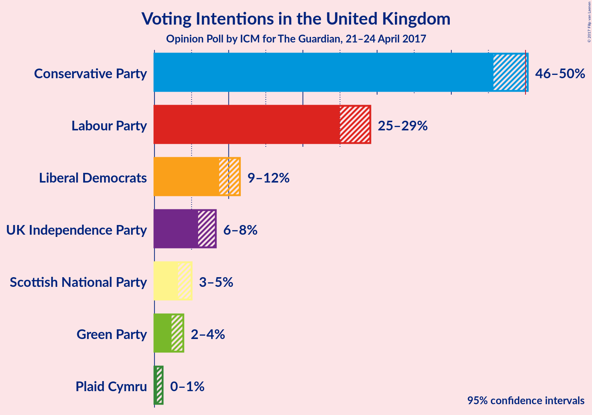
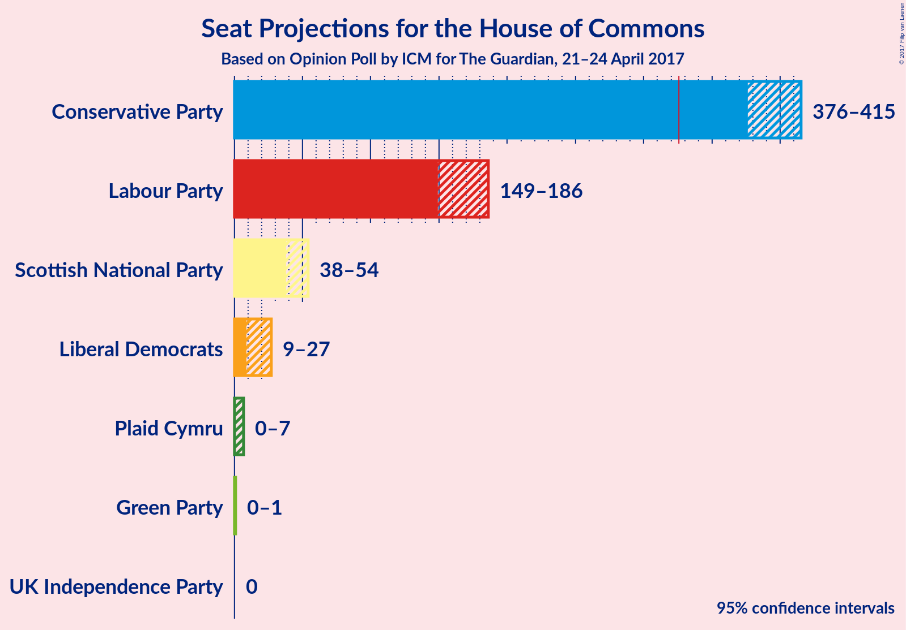
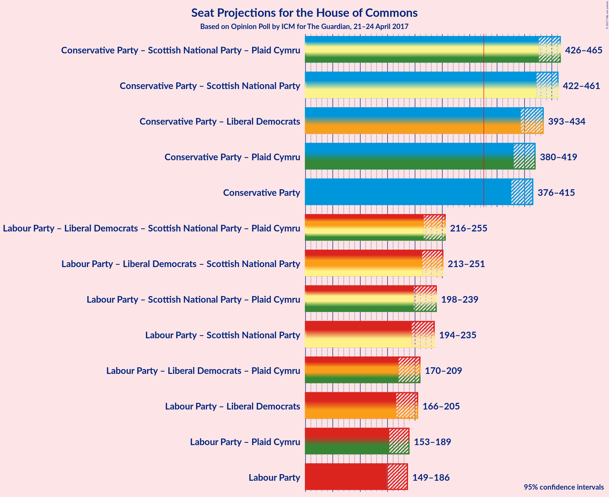

# Opinion Poll by ICM for The Guardian, 21–24 April 2017

<a href="#voting-intentions">Voting Intentions</a> | <a href="#seats">Seats</a> | <a href="#coalitions">Coalitions</a> | <a href="#technical-information">Technical Information</a>

## Voting Intentions

### Confidence Intervals

| Party | Last Result | Poll Result | 80% Confidence Interval | 90% Confidence Interval | 95% Confidence Interval | 99% Confidence Interval |
|:-----:|:-----------:|:-----------:|:-----------------------:|:-----------------------:|:-----------------------:|:-----------------------:|
| Conservative Party | 36.9% | 48.2% | 46.5–49.5% |46.0–49.9% |45.7–50.3% |44.9–51.0% |
| Labour Party | 30.4% | 27.1% | 25.7–28.4% |25.3–28.7% |25.0–29.1% |24.4–29.8% |
| Liberal Democrats | 7.9% | 10.1% | 9.2–11.0% |8.9–11.3% |8.7–11.5% |8.3–12.0% |
| UK Independence Party | 12.6% | 7.0% | 6.3–7.8% |6.1–8.0% |5.9–8.3% |5.6–8.7% |
| Scottish National Party | 4.7% | 4.0% | 3.4–4.6% |3.3–4.8% |3.2–5.0% |2.9–5.3% |
| Green Party | 3.8% | 3.0% | 2.5–3.6% |2.4–3.7% |2.3–3.9% |2.1–4.2% |
| Plaid Cymru | 0.6% | 0.6% | 0.4–0.9% |0.4–1.0% |0.3–1.1% |0.3–1.3% |

*Note:* The poll result column reflects the actual value used in the calculations. Published results may vary slightly, and in addition be rounded to fewer digits.

## Seats

### Confidence Intervals

| Party | Last Result | Median | 80% Confidence Interval | 90% Confidence Interval | 95% Confidence Interval | 99% Confidence Interval |
|:-----:|:-----------:|:------:|:-----------------------:|:-----------------------:|:-----------------------:|:-----------------------:|
| <a href="#conservative-party">Conservative Party</a> | 331 | 394 | 381–408 |379–412 |376–415 |370–420 |
| <a href="#labour-party">Labour Party</a> | 232 | 170 | 155–182 |152–184 |149–186 |144–192 |
| <a href="#liberal-democrats">Liberal Democrats</a> | 8 | 17 | 12–23 |11–25 |9–27 |7–29 |
| <a href="#uk-independence-party">UK Independence Party</a> | 1 | 0 | 0 |0 |0 |0 |
| <a href="#scottish-national-party">Scottish National Party</a> | 56 | 47 | 42–53 |40–54 |38–54 |34–56 |
| <a href="#green-party">Green Party</a> | 1 | 1 | 0–1 |0–1 |0–1 |0–1 |
| <a href="#plaid-cymru">Plaid Cymru</a> | 3 | 4 | 3–4 |1–6 |0–7 |0–8 |

### Conservative Party

| Number of Seats | Probability | Accumulated |
|:---------------:|:-----------:|:-----------:|
| 362 | 0% | 100% |
| 363 | 0% | 99.9% |
| 364 | 0% | 99.9% |
| 365 | 0% | 99.9% |
| 366 | 0% | 99.9% |
| 367 | 0% | 99.8% |
| 368 | 0.1% | 99.8% |
| 369 | 0.1% | 99.7% |
| 370 | 0.2% | 99.6% |
| 371 | 0.1% | 99.5% |
| 372 | 0.2% | 99.4% |
| 373 | 0.2% | 99.1% |
| 374 | 0.4% | 98.9% |
| 375 | 0.5% | 98% |
| 376 | 0.6% | 98% |
| 377 | 1.1% | 97% |
| 378 | 1.0% | 96% |
| 379 | 2% | 95% |
| 380 | 2% | 93% |
| 381 | 3% | 91% |
| 382 | 2% | 89% |
| 383 | 2% | 87% |
| 384 | 2% | 85% |
| 385 | 3% | 83% |
| 386 | 4% | 80% |
| 387 | 3% | 75% |
| 388 | 4% | 72% |
| 389 | 3% | 68% |
| 390 | 5% | 65% |
| 391 | 3% | 60% |
| 392 | 3% | 57% |
| 393 | 3% | 53% |
| 394 | 2% | 51% |
| 395 | 3% | 48% |
| 396 | 3% | 45% |
| 397 | 4% | 43% |
| 398 | 2% | 39% |
| 399 | 3% | 37% |
| 400 | 2% | 33% |
| 401 | 2% | 31% |
| 402 | 3% | 29% |
| 403 | 2% | 26% |
| 404 | 2% | 24% |
| 405 | 5% | 21% |
| 406 | 2% | 16% |
| 407 | 2% | 14% |
| 408 | 2% | 12% |
| 409 | 2% | 9% |
| 410 | 1.3% | 8% |
| 411 | 1.3% | 7% |
| 412 | 0.7% | 5% |
| 413 | 1.1% | 5% |
| 414 | 0.7% | 4% |
| 415 | 0.8% | 3% |
| 416 | 0.6% | 2% |
| 417 | 0.4% | 1.4% |
| 418 | 0.2% | 1.0% |
| 419 | 0.2% | 0.8% |
| 420 | 0.1% | 0.6% |
| 421 | 0.1% | 0.5% |
| 422 | 0.1% | 0.3% |
| 423 | 0.1% | 0.2% |
| 424 | 0.1% | 0.2% |
| 425 | 0% | 0.1% |
| 426 | 0% | 0.1% |
| 427 | 0% | 0% |

### Labour Party

| Number of Seats | Probability | Accumulated |
|:---------------:|:-----------:|:-----------:|
| 138 | 0% | 100% |
| 139 | 0% | 99.9% |
| 140 | 0% | 99.9% |
| 141 | 0.1% | 99.8% |
| 142 | 0.1% | 99.8% |
| 143 | 0.1% | 99.7% |
| 144 | 0.2% | 99.5% |
| 145 | 0.2% | 99.3% |
| 146 | 0.3% | 99.1% |
| 147 | 0.4% | 98.9% |
| 148 | 0.5% | 98% |
| 149 | 0.8% | 98% |
| 150 | 1.0% | 97% |
| 151 | 0.9% | 96% |
| 152 | 1.0% | 95% |
| 153 | 1.1% | 94% |
| 154 | 2% | 93% |
| 155 | 3% | 92% |
| 156 | 1.5% | 89% |
| 157 | 2% | 88% |
| 158 | 4% | 85% |
| 159 | 5% | 82% |
| 160 | 3% | 77% |
| 161 | 1.1% | 74% |
| 162 | 1.3% | 73% |
| 163 | 5% | 71% |
| 164 | 2% | 66% |
| 165 | 2% | 64% |
| 166 | 3% | 62% |
| 167 | 4% | 59% |
| 168 | 4% | 56% |
| 169 | 1.4% | 52% |
| 170 | 3% | 50% |
| 171 | 1.4% | 47% |
| 172 | 4% | 45% |
| 173 | 4% | 42% |
| 174 | 6% | 38% |
| 175 | 5% | 33% |
| 176 | 3% | 28% |
| 177 | 3% | 24% |
| 178 | 2% | 21% |
| 179 | 2% | 18% |
| 180 | 3% | 16% |
| 181 | 3% | 13% |
| 182 | 3% | 10% |
| 183 | 2% | 7% |
| 184 | 2% | 5% |
| 185 | 1.1% | 4% |
| 186 | 0.6% | 3% |
| 187 | 0.5% | 2% |
| 188 | 0.4% | 2% |
| 189 | 0.4% | 1.3% |
| 190 | 0.2% | 0.9% |
| 191 | 0.2% | 0.7% |
| 192 | 0.1% | 0.5% |
| 193 | 0.1% | 0.4% |
| 194 | 0.1% | 0.3% |
| 195 | 0.1% | 0.3% |
| 196 | 0.1% | 0.2% |
| 197 | 0% | 0.2% |
| 198 | 0% | 0.1% |
| 199 | 0% | 0.1% |
| 200 | 0% | 0.1% |
| 201 | 0% | 0% |

### Liberal Democrats

| Number of Seats | Probability | Accumulated |
|:---------------:|:-----------:|:-----------:|
| 6 | 0.1% | 100% |
| 7 | 0.5% | 99.8% |
| 8 | 0.8% | 99.4% |
| 9 | 2% | 98.6% |
| 10 | 1.1% | 97% |
| 11 | 3% | 96% |
| 12 | 3% | 93% |
| 13 | 6% | 89% |
| 14 | 5% | 83% |
| 15 | 6% | 78% |
| 16 | 10% | 72% |
| 17 | 13% | 62% |
| 18 | 8% | 49% |
| 19 | 11% | 41% |
| 20 | 11% | 30% |
| 21 | 4% | 19% |
| 22 | 3% | 15% |
| 23 | 2% | 12% |
| 24 | 4% | 10% |
| 25 | 1.5% | 6% |
| 26 | 1.0% | 5% |
| 27 | 2% | 4% |
| 28 | 0.7% | 2% |
| 29 | 0.9% | 1.4% |
| 30 | 0.3% | 0.5% |
| 31 | 0.1% | 0.2% |
| 32 | 0% | 0.1% |
| 33 | 0% | 0% |

### UK Independence Party

| Number of Seats | Probability | Accumulated |
|:---------------:|:-----------:|:-----------:|
| 0 | 100% | 100% |
| 1 | 0% | 0% |

### Scottish National Party

| Number of Seats | Probability | Accumulated |
|:---------------:|:-----------:|:-----------:|
| 26 | 0% | 100% |
| 27 | 0% | 99.9% |
| 28 | 0% | 99.9% |
| 29 | 0% | 99.9% |
| 30 | 0% | 99.9% |
| 31 | 0% | 99.9% |
| 32 | 0.1% | 99.9% |
| 33 | 0.1% | 99.8% |
| 34 | 0.2% | 99.7% |
| 35 | 0.2% | 99.5% |
| 36 | 0.6% | 99.3% |
| 37 | 0.9% | 98.7% |
| 38 | 0.7% | 98% |
| 39 | 0.8% | 97% |
| 40 | 3% | 96% |
| 41 | 2% | 94% |
| 42 | 5% | 92% |
| 43 | 13% | 87% |
| 44 | 6% | 74% |
| 45 | 9% | 67% |
| 46 | 7% | 58% |
| 47 | 11% | 52% |
| 48 | 9% | 40% |
| 49 | 8% | 31% |
| 50 | 5% | 23% |
| 51 | 5% | 19% |
| 52 | 3% | 14% |
| 53 | 6% | 11% |
| 54 | 3% | 6% |
| 55 | 2% | 2% |
| 56 | 0.9% | 0.9% |
| 57 | 0% | 0% |

### Green Party

| Number of Seats | Probability | Accumulated |
|:---------------:|:-----------:|:-----------:|
| 0 | 18% | 100% |
| 1 | 82% | 82% |
| 2 | 0.2% | 0.2% |
| 3 | 0% | 0% |

### Plaid Cymru

| Number of Seats | Probability | Accumulated |
|:---------------:|:-----------:|:-----------:|
| 0 | 4% | 100% |
| 1 | 6% | 96% |
| 2 | 0.2% | 91% |
| 3 | 19% | 90% |
| 4 | 61% | 71% |
| 5 | 3% | 10% |
| 6 | 2% | 7% |
| 7 | 4% | 5% |
| 8 | 0.5% | 0.5% |
| 9 | 0% | 0.1% |
| 10 | 0% | 0% |

## Coalitions

### Confidence Intervals

| Coalition | Last Result | Median | 80% Confidence Interval | 90% Confidence Interval | 95% Confidence Interval | 99% Confidence Interval |
|:---------:|:-----------:|:------:|:-----------------------:|:-----------------------:|:-----------------------:|:-----------------------:|
| Conservative Party – Scottish National Party – Plaid Cymru | 390 | 445 | 431–459 | 428–462 | 426–465 | 420–471 |
| Conservative Party – Scottish National Party | 387 | 441 | 428–455 | 425–459 | 422–461 | 416–467 |
| Conservative Party – Liberal Democrats | 339 | 411 | 398–427 | 395–430 | 393–434 | 387–440 |
| Conservative Party – Plaid Cymru | 334 | 398 | 385–412 | 382–416 | 380–419 | 374–424 |
| Conservative Party | 331 | 394 | 381–408 | 379–412 | 376–415 | 370–420 |
| Labour Party – Liberal Democrats – Scottish National Party – Plaid Cymru | 299 | 237 | 223–250 | 219–252 | 216–255 | 211–261 |
| Labour Party – Liberal Democrats – Scottish National Party | 296 | 234 | 219–246 | 216–249 | 213–251 | 207–257 |
| Labour Party – Scottish National Party – Plaid Cymru | 291 | 220 | 204–233 | 201–236 | 198–239 | 192–244 |
| Labour Party – Scottish National Party | 288 | 216 | 200–229 | 197–232 | 194–235 | 188–240 |
| Labour Party – Liberal Democrats – Plaid Cymru | 243 | 191 | 176–204 | 173–207 | 170–209 | 164–215 |
| Labour Party – Liberal Democrats | 240 | 186 | 173–200 | 169–203 | 166–205 | 160–211 |
| Labour Party – Plaid Cymru | 235 | 173 | 159–185 | 156–187 | 153–189 | 148–196 |
| Labour Party | 232 | 170 | 155–182 | 152–184 | 149–186 | 144–192 |

### Conservative Party – Scottish National Party – Plaid Cymru

| Number of Seats | Probability | Accumulated |
|:---------------:|:-----------:|:-----------:|
| 410 | 0% | 100% |
| 411 | 0% | 99.9% |
| 412 | 0% | 99.9% |
| 413 | 0% | 99.9% |
| 414 | 0% | 99.9% |
| 415 | 0% | 99.9% |
| 416 | 0.1% | 99.8% |
| 417 | 0.1% | 99.8% |
| 418 | 0.1% | 99.7% |
| 419 | 0.1% | 99.6% |
| 420 | 0.1% | 99.5% |
| 421 | 0.2% | 99.4% |
| 422 | 0.4% | 99.3% |
| 423 | 0.4% | 98.9% |
| 424 | 0.4% | 98% |
| 425 | 0.4% | 98% |
| 426 | 1.2% | 98% |
| 427 | 1.1% | 97% |
| 428 | 1.1% | 95% |
| 429 | 2% | 94% |
| 430 | 1.0% | 93% |
| 431 | 2% | 92% |
| 432 | 2% | 89% |
| 433 | 3% | 87% |
| 434 | 2% | 85% |
| 435 | 2% | 82% |
| 436 | 3% | 80% |
| 437 | 3% | 77% |
| 438 | 3% | 73% |
| 439 | 3% | 70% |
| 440 | 3% | 67% |
| 441 | 5% | 64% |
| 442 | 4% | 59% |
| 443 | 2% | 55% |
| 444 | 2% | 53% |
| 445 | 4% | 51% |
| 446 | 4% | 47% |
| 447 | 2% | 43% |
| 448 | 3% | 41% |
| 449 | 3% | 38% |
| 450 | 3% | 35% |
| 451 | 3% | 32% |
| 452 | 3% | 29% |
| 453 | 3% | 27% |
| 454 | 2% | 24% |
| 455 | 4% | 21% |
| 456 | 3% | 17% |
| 457 | 1.2% | 14% |
| 458 | 2% | 13% |
| 459 | 1.3% | 10% |
| 460 | 2% | 9% |
| 461 | 1.0% | 7% |
| 462 | 1.0% | 6% |
| 463 | 0.9% | 5% |
| 464 | 0.8% | 4% |
| 465 | 0.8% | 3% |
| 466 | 0.6% | 2% |
| 467 | 0.4% | 2% |
| 468 | 0.3% | 1.4% |
| 469 | 0.2% | 1.1% |
| 470 | 0.3% | 0.8% |
| 471 | 0.2% | 0.6% |
| 472 | 0.1% | 0.4% |
| 473 | 0.1% | 0.3% |
| 474 | 0.1% | 0.2% |
| 475 | 0% | 0.1% |
| 476 | 0% | 0.1% |
| 477 | 0% | 0.1% |
| 478 | 0% | 0% |

### Conservative Party – Scottish National Party

| Number of Seats | Probability | Accumulated |
|:---------------:|:-----------:|:-----------:|
| 407 | 0% | 100% |
| 408 | 0% | 99.9% |
| 409 | 0% | 99.9% |
| 410 | 0% | 99.9% |
| 411 | 0% | 99.9% |
| 412 | 0% | 99.9% |
| 413 | 0.1% | 99.8% |
| 414 | 0.1% | 99.7% |
| 415 | 0.1% | 99.7% |
| 416 | 0.1% | 99.6% |
| 417 | 0.1% | 99.5% |
| 418 | 0.2% | 99.4% |
| 419 | 0.4% | 99.1% |
| 420 | 0.4% | 98.7% |
| 421 | 0.5% | 98% |
| 422 | 0.9% | 98% |
| 423 | 0.9% | 97% |
| 424 | 1.0% | 96% |
| 425 | 2% | 95% |
| 426 | 1.2% | 93% |
| 427 | 2% | 92% |
| 428 | 2% | 90% |
| 429 | 3% | 88% |
| 430 | 2% | 85% |
| 431 | 2% | 83% |
| 432 | 3% | 81% |
| 433 | 3% | 78% |
| 434 | 3% | 75% |
| 435 | 4% | 72% |
| 436 | 3% | 68% |
| 437 | 3% | 65% |
| 438 | 6% | 61% |
| 439 | 2% | 56% |
| 440 | 3% | 53% |
| 441 | 4% | 50% |
| 442 | 3% | 47% |
| 443 | 2% | 44% |
| 444 | 4% | 42% |
| 445 | 3% | 38% |
| 446 | 3% | 35% |
| 447 | 3% | 32% |
| 448 | 2% | 29% |
| 449 | 2% | 27% |
| 450 | 3% | 25% |
| 451 | 3% | 22% |
| 452 | 3% | 19% |
| 453 | 2% | 15% |
| 454 | 3% | 14% |
| 455 | 2% | 11% |
| 456 | 2% | 9% |
| 457 | 1.2% | 7% |
| 458 | 1.0% | 6% |
| 459 | 1.1% | 5% |
| 460 | 0.6% | 4% |
| 461 | 1.0% | 3% |
| 462 | 0.6% | 2% |
| 463 | 0.3% | 2% |
| 464 | 0.3% | 1.4% |
| 465 | 0.2% | 1.1% |
| 466 | 0.3% | 0.9% |
| 467 | 0.2% | 0.6% |
| 468 | 0.1% | 0.4% |
| 469 | 0.1% | 0.3% |
| 470 | 0.1% | 0.2% |
| 471 | 0% | 0.1% |
| 472 | 0% | 0.1% |
| 473 | 0% | 0.1% |
| 474 | 0% | 0% |

### Conservative Party – Liberal Democrats

| Number of Seats | Probability | Accumulated |
|:---------------:|:-----------:|:-----------:|
| 379 | 0% | 100% |
| 380 | 0% | 99.9% |
| 381 | 0% | 99.9% |
| 382 | 0% | 99.9% |
| 383 | 0.1% | 99.9% |
| 384 | 0.1% | 99.8% |
| 385 | 0.1% | 99.7% |
| 386 | 0.1% | 99.7% |
| 387 | 0.1% | 99.6% |
| 388 | 0.2% | 99.5% |
| 389 | 0.2% | 99.3% |
| 390 | 0.4% | 99.0% |
| 391 | 0.6% | 98.7% |
| 392 | 0.5% | 98% |
| 393 | 0.8% | 98% |
| 394 | 0.7% | 97% |
| 395 | 1.2% | 96% |
| 396 | 2% | 95% |
| 397 | 1.4% | 93% |
| 398 | 3% | 92% |
| 399 | 2% | 89% |
| 400 | 2% | 87% |
| 401 | 3% | 85% |
| 402 | 2% | 82% |
| 403 | 3% | 80% |
| 404 | 3% | 76% |
| 405 | 4% | 73% |
| 406 | 3% | 69% |
| 407 | 4% | 66% |
| 408 | 4% | 62% |
| 409 | 3% | 59% |
| 410 | 3% | 56% |
| 411 | 4% | 53% |
| 412 | 3% | 50% |
| 413 | 3% | 46% |
| 414 | 2% | 44% |
| 415 | 3% | 42% |
| 416 | 2% | 38% |
| 417 | 4% | 36% |
| 418 | 2% | 32% |
| 419 | 2% | 30% |
| 420 | 2% | 28% |
| 421 | 3% | 26% |
| 422 | 3% | 23% |
| 423 | 3% | 19% |
| 424 | 1.4% | 17% |
| 425 | 3% | 15% |
| 426 | 1.5% | 12% |
| 427 | 2% | 11% |
| 428 | 1.4% | 9% |
| 429 | 2% | 8% |
| 430 | 1.1% | 6% |
| 431 | 0.8% | 5% |
| 432 | 0.7% | 4% |
| 433 | 0.6% | 3% |
| 434 | 0.6% | 3% |
| 435 | 0.5% | 2% |
| 436 | 0.3% | 2% |
| 437 | 0.4% | 1.3% |
| 438 | 0.2% | 0.9% |
| 439 | 0.2% | 0.7% |
| 440 | 0.1% | 0.5% |
| 441 | 0.1% | 0.4% |
| 442 | 0.1% | 0.3% |
| 443 | 0% | 0.2% |
| 444 | 0.1% | 0.2% |
| 445 | 0% | 0.1% |
| 446 | 0% | 0.1% |
| 447 | 0% | 0.1% |
| 448 | 0% | 0% |

### Conservative Party – Plaid Cymru

| Number of Seats | Probability | Accumulated |
|:---------------:|:-----------:|:-----------:|
| 366 | 0% | 100% |
| 367 | 0% | 99.9% |
| 368 | 0% | 99.9% |
| 369 | 0% | 99.9% |
| 370 | 0% | 99.8% |
| 371 | 0% | 99.8% |
| 372 | 0.1% | 99.7% |
| 373 | 0.1% | 99.7% |
| 374 | 0.1% | 99.6% |
| 375 | 0.1% | 99.4% |
| 376 | 0.2% | 99.3% |
| 377 | 0.4% | 99.1% |
| 378 | 0.5% | 98.7% |
| 379 | 0.6% | 98% |
| 380 | 0.5% | 98% |
| 381 | 1.2% | 97% |
| 382 | 1.2% | 96% |
| 383 | 2% | 95% |
| 384 | 2% | 93% |
| 385 | 2% | 90% |
| 386 | 2% | 89% |
| 387 | 2% | 86% |
| 388 | 3% | 84% |
| 389 | 3% | 81% |
| 390 | 4% | 78% |
| 391 | 3% | 74% |
| 392 | 5% | 71% |
| 393 | 3% | 67% |
| 394 | 4% | 64% |
| 395 | 5% | 59% |
| 396 | 2% | 55% |
| 397 | 3% | 53% |
| 398 | 2% | 50% |
| 399 | 2% | 48% |
| 400 | 3% | 46% |
| 401 | 4% | 43% |
| 402 | 3% | 39% |
| 403 | 4% | 36% |
| 404 | 2% | 33% |
| 405 | 2% | 31% |
| 406 | 4% | 28% |
| 407 | 2% | 25% |
| 408 | 3% | 22% |
| 409 | 4% | 19% |
| 410 | 2% | 16% |
| 411 | 2% | 13% |
| 412 | 2% | 11% |
| 413 | 2% | 9% |
| 414 | 1.1% | 7% |
| 415 | 0.9% | 6% |
| 416 | 0.9% | 5% |
| 417 | 1.0% | 4% |
| 418 | 0.7% | 3% |
| 419 | 0.6% | 3% |
| 420 | 0.6% | 2% |
| 421 | 0.4% | 1.4% |
| 422 | 0.2% | 1.0% |
| 423 | 0.2% | 0.8% |
| 424 | 0.2% | 0.6% |
| 425 | 0.1% | 0.4% |
| 426 | 0.1% | 0.3% |
| 427 | 0.1% | 0.2% |
| 428 | 0% | 0.1% |
| 429 | 0% | 0.1% |
| 430 | 0% | 0.1% |
| 431 | 0% | 0% |

### Conservative Party

| Number of Seats | Probability | Accumulated |
|:---------------:|:-----------:|:-----------:|
| 362 | 0% | 100% |
| 363 | 0% | 99.9% |
| 364 | 0% | 99.9% |
| 365 | 0% | 99.9% |
| 366 | 0% | 99.9% |
| 367 | 0% | 99.8% |
| 368 | 0.1% | 99.8% |
| 369 | 0.1% | 99.7% |
| 370 | 0.2% | 99.6% |
| 371 | 0.1% | 99.5% |
| 372 | 0.2% | 99.4% |
| 373 | 0.2% | 99.1% |
| 374 | 0.4% | 98.9% |
| 375 | 0.5% | 98% |
| 376 | 0.6% | 98% |
| 377 | 1.1% | 97% |
| 378 | 1.0% | 96% |
| 379 | 2% | 95% |
| 380 | 2% | 93% |
| 381 | 3% | 91% |
| 382 | 2% | 89% |
| 383 | 2% | 87% |
| 384 | 2% | 85% |
| 385 | 3% | 83% |
| 386 | 4% | 80% |
| 387 | 3% | 75% |
| 388 | 4% | 72% |
| 389 | 3% | 68% |
| 390 | 5% | 65% |
| 391 | 3% | 60% |
| 392 | 3% | 57% |
| 393 | 3% | 53% |
| 394 | 2% | 51% |
| 395 | 3% | 48% |
| 396 | 3% | 45% |
| 397 | 4% | 43% |
| 398 | 2% | 39% |
| 399 | 3% | 37% |
| 400 | 2% | 33% |
| 401 | 2% | 31% |
| 402 | 3% | 29% |
| 403 | 2% | 26% |
| 404 | 2% | 24% |
| 405 | 5% | 21% |
| 406 | 2% | 16% |
| 407 | 2% | 14% |
| 408 | 2% | 12% |
| 409 | 2% | 9% |
| 410 | 1.3% | 8% |
| 411 | 1.3% | 7% |
| 412 | 0.7% | 5% |
| 413 | 1.1% | 5% |
| 414 | 0.7% | 4% |
| 415 | 0.8% | 3% |
| 416 | 0.6% | 2% |
| 417 | 0.4% | 1.4% |
| 418 | 0.2% | 1.0% |
| 419 | 0.2% | 0.8% |
| 420 | 0.1% | 0.6% |
| 421 | 0.1% | 0.5% |
| 422 | 0.1% | 0.3% |
| 423 | 0.1% | 0.2% |
| 424 | 0.1% | 0.2% |
| 425 | 0% | 0.1% |
| 426 | 0% | 0.1% |
| 427 | 0% | 0% |

### Labour Party – Liberal Democrats – Scottish National Party – Plaid Cymru

| Number of Seats | Probability | Accumulated |
|:---------------:|:-----------:|:-----------:|
| 205 | 0% | 100% |
| 206 | 0% | 99.9% |
| 207 | 0.1% | 99.9% |
| 208 | 0.1% | 99.9% |
| 209 | 0.1% | 99.8% |
| 210 | 0.1% | 99.7% |
| 211 | 0.1% | 99.6% |
| 212 | 0.2% | 99.5% |
| 213 | 0.2% | 99.2% |
| 214 | 0.4% | 99.0% |
| 215 | 0.4% | 98.7% |
| 216 | 0.9% | 98% |
| 217 | 0.7% | 97% |
| 218 | 1.1% | 97% |
| 219 | 0.7% | 96% |
| 220 | 1.2% | 95% |
| 221 | 1.0% | 94% |
| 222 | 2% | 93% |
| 223 | 2% | 91% |
| 224 | 2% | 89% |
| 225 | 2% | 87% |
| 226 | 5% | 84% |
| 227 | 3% | 80% |
| 228 | 2% | 77% |
| 229 | 2% | 74% |
| 230 | 3% | 72% |
| 231 | 2% | 69% |
| 232 | 4% | 67% |
| 233 | 2% | 64% |
| 234 | 4% | 61% |
| 235 | 3% | 58% |
| 236 | 3% | 55% |
| 237 | 2% | 52% |
| 238 | 2% | 50% |
| 239 | 3% | 47% |
| 240 | 2% | 44% |
| 241 | 6% | 42% |
| 242 | 3% | 35% |
| 243 | 5% | 33% |
| 244 | 3% | 28% |
| 245 | 4% | 25% |
| 246 | 3% | 21% |
| 247 | 2% | 18% |
| 248 | 2% | 15% |
| 249 | 2% | 13% |
| 250 | 2% | 11% |
| 251 | 2% | 9% |
| 252 | 2% | 7% |
| 253 | 1.1% | 5% |
| 254 | 1.1% | 4% |
| 255 | 0.6% | 3% |
| 256 | 0.5% | 2% |
| 257 | 0.4% | 2% |
| 258 | 0.2% | 1.1% |
| 259 | 0.2% | 0.9% |
| 260 | 0.1% | 0.6% |
| 261 | 0.2% | 0.5% |
| 262 | 0.1% | 0.4% |
| 263 | 0.1% | 0.3% |
| 264 | 0% | 0.2% |
| 265 | 0% | 0.2% |
| 266 | 0% | 0.1% |
| 267 | 0% | 0.1% |
| 268 | 0% | 0.1% |
| 269 | 0% | 0.1% |
| 270 | 0% | 0% |

### Labour Party – Liberal Democrats – Scottish National Party

| Number of Seats | Probability | Accumulated |
|:---------------:|:-----------:|:-----------:|
| 201 | 0% | 100% |
| 202 | 0% | 99.9% |
| 203 | 0% | 99.9% |
| 204 | 0.1% | 99.9% |
| 205 | 0.1% | 99.8% |
| 206 | 0.1% | 99.7% |
| 207 | 0.2% | 99.6% |
| 208 | 0.2% | 99.5% |
| 209 | 0.1% | 99.2% |
| 210 | 0.4% | 99.1% |
| 211 | 0.4% | 98.7% |
| 212 | 0.7% | 98% |
| 213 | 0.6% | 98% |
| 214 | 1.0% | 97% |
| 215 | 0.8% | 96% |
| 216 | 1.1% | 95% |
| 217 | 0.9% | 94% |
| 218 | 2% | 93% |
| 219 | 2% | 91% |
| 220 | 2% | 89% |
| 221 | 2% | 87% |
| 222 | 4% | 85% |
| 223 | 3% | 81% |
| 224 | 3% | 78% |
| 225 | 3% | 76% |
| 226 | 3% | 73% |
| 227 | 2% | 70% |
| 228 | 4% | 68% |
| 229 | 3% | 64% |
| 230 | 3% | 61% |
| 231 | 3% | 58% |
| 232 | 2% | 55% |
| 233 | 2% | 52% |
| 234 | 2% | 50% |
| 235 | 2% | 48% |
| 236 | 3% | 46% |
| 237 | 5% | 42% |
| 238 | 3% | 37% |
| 239 | 5% | 34% |
| 240 | 3% | 29% |
| 241 | 4% | 26% |
| 242 | 3% | 22% |
| 243 | 3% | 20% |
| 244 | 2% | 16% |
| 245 | 2% | 14% |
| 246 | 2% | 12% |
| 247 | 3% | 10% |
| 248 | 2% | 7% |
| 249 | 1.3% | 5% |
| 250 | 1.2% | 4% |
| 251 | 0.5% | 3% |
| 252 | 0.6% | 2% |
| 253 | 0.5% | 2% |
| 254 | 0.3% | 1.3% |
| 255 | 0.2% | 1.0% |
| 256 | 0.1% | 0.7% |
| 257 | 0.2% | 0.6% |
| 258 | 0.1% | 0.4% |
| 259 | 0.1% | 0.3% |
| 260 | 0% | 0.3% |
| 261 | 0% | 0.2% |
| 262 | 0% | 0.2% |
| 263 | 0% | 0.1% |
| 264 | 0% | 0.1% |
| 265 | 0% | 0.1% |
| 266 | 0% | 0.1% |
| 267 | 0% | 0% |

### Labour Party – Scottish National Party – Plaid Cymru

| Number of Seats | Probability | Accumulated |
|:---------------:|:-----------:|:-----------:|
| 185 | 0% | 100% |
| 186 | 0% | 99.9% |
| 187 | 0% | 99.9% |
| 188 | 0.1% | 99.9% |
| 189 | 0.1% | 99.8% |
| 190 | 0.1% | 99.7% |
| 191 | 0.1% | 99.7% |
| 192 | 0.2% | 99.5% |
| 193 | 0.1% | 99.3% |
| 194 | 0.3% | 99.1% |
| 195 | 0.4% | 98.8% |
| 196 | 0.4% | 98% |
| 197 | 0.5% | 98% |
| 198 | 0.7% | 98% |
| 199 | 0.7% | 97% |
| 200 | 0.7% | 96% |
| 201 | 1.0% | 95% |
| 202 | 2% | 94% |
| 203 | 1.4% | 93% |
| 204 | 2% | 91% |
| 205 | 2% | 89% |
| 206 | 3% | 88% |
| 207 | 1.1% | 85% |
| 208 | 3% | 84% |
| 209 | 3% | 81% |
| 210 | 3% | 78% |
| 211 | 2% | 75% |
| 212 | 3% | 73% |
| 213 | 2% | 70% |
| 214 | 4% | 68% |
| 215 | 2% | 64% |
| 216 | 3% | 62% |
| 217 | 2% | 59% |
| 218 | 3% | 57% |
| 219 | 3% | 54% |
| 220 | 4% | 51% |
| 221 | 3% | 47% |
| 222 | 3% | 44% |
| 223 | 3% | 42% |
| 224 | 4% | 39% |
| 225 | 3% | 35% |
| 226 | 5% | 32% |
| 227 | 3% | 27% |
| 228 | 3% | 24% |
| 229 | 2% | 21% |
| 230 | 3% | 18% |
| 231 | 2% | 15% |
| 232 | 2% | 13% |
| 233 | 3% | 11% |
| 234 | 2% | 9% |
| 235 | 2% | 7% |
| 236 | 1.3% | 5% |
| 237 | 0.6% | 4% |
| 238 | 0.9% | 3% |
| 239 | 0.6% | 3% |
| 240 | 0.6% | 2% |
| 241 | 0.4% | 1.4% |
| 242 | 0.2% | 1.0% |
| 243 | 0.2% | 0.8% |
| 244 | 0.1% | 0.6% |
| 245 | 0.1% | 0.4% |
| 246 | 0.1% | 0.4% |
| 247 | 0.1% | 0.3% |
| 248 | 0.1% | 0.2% |
| 249 | 0% | 0.1% |
| 250 | 0% | 0.1% |
| 251 | 0% | 0.1% |
| 252 | 0% | 0.1% |
| 253 | 0% | 0% |

### Labour Party – Scottish National Party

| Number of Seats | Probability | Accumulated |
|:---------------:|:-----------:|:-----------:|
| 181 | 0% | 100% |
| 182 | 0% | 99.9% |
| 183 | 0% | 99.9% |
| 184 | 0.1% | 99.9% |
| 185 | 0.1% | 99.8% |
| 186 | 0.1% | 99.7% |
| 187 | 0.1% | 99.7% |
| 188 | 0.2% | 99.5% |
| 189 | 0.2% | 99.4% |
| 190 | 0.2% | 99.2% |
| 191 | 0.4% | 99.0% |
| 192 | 0.3% | 98.5% |
| 193 | 0.6% | 98% |
| 194 | 0.6% | 98% |
| 195 | 0.7% | 97% |
| 196 | 0.5% | 96% |
| 197 | 0.9% | 96% |
| 198 | 2% | 95% |
| 199 | 1.2% | 93% |
| 200 | 2% | 92% |
| 201 | 2% | 90% |
| 202 | 3% | 88% |
| 203 | 0.9% | 85% |
| 204 | 2% | 84% |
| 205 | 3% | 82% |
| 206 | 3% | 79% |
| 207 | 2% | 76% |
| 208 | 3% | 74% |
| 209 | 2% | 71% |
| 210 | 3% | 69% |
| 211 | 3% | 65% |
| 212 | 3% | 63% |
| 213 | 2% | 59% |
| 214 | 2% | 57% |
| 215 | 3% | 55% |
| 216 | 3% | 52% |
| 217 | 3% | 48% |
| 218 | 3% | 45% |
| 219 | 3% | 42% |
| 220 | 4% | 39% |
| 221 | 2% | 36% |
| 222 | 4% | 33% |
| 223 | 5% | 29% |
| 224 | 3% | 24% |
| 225 | 2% | 21% |
| 226 | 4% | 20% |
| 227 | 2% | 16% |
| 228 | 2% | 14% |
| 229 | 2% | 12% |
| 230 | 2% | 9% |
| 231 | 1.5% | 7% |
| 232 | 1.5% | 6% |
| 233 | 0.7% | 5% |
| 234 | 0.9% | 4% |
| 235 | 0.8% | 3% |
| 236 | 0.5% | 2% |
| 237 | 0.4% | 2% |
| 238 | 0.4% | 1.2% |
| 239 | 0.2% | 0.8% |
| 240 | 0.1% | 0.6% |
| 241 | 0.1% | 0.5% |
| 242 | 0.1% | 0.4% |
| 243 | 0% | 0.3% |
| 244 | 0.1% | 0.2% |
| 245 | 0% | 0.2% |
| 246 | 0% | 0.1% |
| 247 | 0% | 0.1% |
| 248 | 0% | 0.1% |
| 249 | 0% | 0.1% |
| 250 | 0% | 0% |

### Labour Party – Liberal Democrats – Plaid Cymru

| Number of Seats | Probability | Accumulated |
|:---------------:|:-----------:|:-----------:|
| 158 | 0% | 100% |
| 159 | 0% | 99.9% |
| 160 | 0% | 99.9% |
| 161 | 0.1% | 99.9% |
| 162 | 0.1% | 99.8% |
| 163 | 0.1% | 99.7% |
| 164 | 0.2% | 99.6% |
| 165 | 0.2% | 99.4% |
| 166 | 0.3% | 99.2% |
| 167 | 0.3% | 98.9% |
| 168 | 0.2% | 98.7% |
| 169 | 0.6% | 98% |
| 170 | 0.7% | 98% |
| 171 | 0.9% | 97% |
| 172 | 1.0% | 96% |
| 173 | 0.9% | 95% |
| 174 | 1.2% | 94% |
| 175 | 2% | 93% |
| 176 | 1.3% | 91% |
| 177 | 3% | 90% |
| 178 | 2% | 87% |
| 179 | 3% | 85% |
| 180 | 3% | 82% |
| 181 | 3% | 79% |
| 182 | 2% | 75% |
| 183 | 3% | 74% |
| 184 | 3% | 71% |
| 185 | 3% | 68% |
| 186 | 2% | 65% |
| 187 | 5% | 63% |
| 188 | 2% | 59% |
| 189 | 3% | 57% |
| 190 | 4% | 54% |
| 191 | 3% | 50% |
| 192 | 2% | 47% |
| 193 | 5% | 45% |
| 194 | 4% | 40% |
| 195 | 3% | 36% |
| 196 | 4% | 33% |
| 197 | 3% | 29% |
| 198 | 2% | 25% |
| 199 | 3% | 23% |
| 200 | 2% | 19% |
| 201 | 2% | 17% |
| 202 | 3% | 15% |
| 203 | 2% | 12% |
| 204 | 2% | 10% |
| 205 | 1.2% | 8% |
| 206 | 2% | 7% |
| 207 | 1.2% | 5% |
| 208 | 0.9% | 4% |
| 209 | 0.9% | 3% |
| 210 | 0.5% | 2% |
| 211 | 0.4% | 2% |
| 212 | 0.4% | 1.3% |
| 213 | 0.3% | 0.9% |
| 214 | 0.1% | 0.7% |
| 215 | 0.1% | 0.6% |
| 216 | 0.1% | 0.5% |
| 217 | 0.1% | 0.3% |
| 218 | 0.1% | 0.3% |
| 219 | 0% | 0.2% |
| 220 | 0% | 0.2% |
| 221 | 0% | 0.1% |
| 222 | 0% | 0.1% |
| 223 | 0% | 0.1% |
| 224 | 0% | 0.1% |
| 225 | 0% | 0% |

### Labour Party – Liberal Democrats

| Number of Seats | Probability | Accumulated |
|:---------------:|:-----------:|:-----------:|
| 155 | 0% | 100% |
| 156 | 0% | 99.9% |
| 157 | 0.1% | 99.9% |
| 158 | 0.1% | 99.8% |
| 159 | 0.1% | 99.8% |
| 160 | 0.2% | 99.7% |
| 161 | 0.2% | 99.5% |
| 162 | 0.2% | 99.2% |
| 163 | 0.3% | 99.0% |
| 164 | 0.4% | 98.7% |
| 165 | 0.6% | 98% |
| 166 | 0.6% | 98% |
| 167 | 0.8% | 97% |
| 168 | 1.0% | 96% |
| 169 | 0.9% | 95% |
| 170 | 0.9% | 94% |
| 171 | 2% | 93% |
| 172 | 1.0% | 91% |
| 173 | 2% | 90% |
| 174 | 1.4% | 88% |
| 175 | 3% | 87% |
| 176 | 4% | 84% |
| 177 | 3% | 79% |
| 178 | 2% | 77% |
| 179 | 3% | 74% |
| 180 | 3% | 71% |
| 181 | 3% | 68% |
| 182 | 2% | 65% |
| 183 | 4% | 64% |
| 184 | 2% | 60% |
| 185 | 3% | 57% |
| 186 | 4% | 54% |
| 187 | 2% | 50% |
| 188 | 2% | 47% |
| 189 | 4% | 46% |
| 190 | 6% | 42% |
| 191 | 2% | 36% |
| 192 | 4% | 34% |
| 193 | 3% | 30% |
| 194 | 3% | 27% |
| 195 | 3% | 24% |
| 196 | 3% | 21% |
| 197 | 2% | 18% |
| 198 | 3% | 16% |
| 199 | 2% | 13% |
| 200 | 2% | 11% |
| 201 | 1.1% | 9% |
| 202 | 2% | 7% |
| 203 | 1.1% | 6% |
| 204 | 1.2% | 5% |
| 205 | 1.1% | 4% |
| 206 | 0.4% | 2% |
| 207 | 0.4% | 2% |
| 208 | 0.4% | 2% |
| 209 | 0.4% | 1.2% |
| 210 | 0.2% | 0.8% |
| 211 | 0.1% | 0.6% |
| 212 | 0.1% | 0.5% |
| 213 | 0.1% | 0.4% |
| 214 | 0.1% | 0.3% |
| 215 | 0.1% | 0.2% |
| 216 | 0% | 0.2% |
| 217 | 0% | 0.1% |
| 218 | 0% | 0.1% |
| 219 | 0% | 0.1% |
| 220 | 0% | 0.1% |
| 221 | 0% | 0.1% |
| 222 | 0% | 0% |

### Labour Party – Plaid Cymru

| Number of Seats | Probability | Accumulated |
|:---------------:|:-----------:|:-----------:|
| 142 | 0% | 100% |
| 143 | 0% | 99.9% |
| 144 | 0.1% | 99.9% |
| 145 | 0.1% | 99.8% |
| 146 | 0.1% | 99.7% |
| 147 | 0.1% | 99.6% |
| 148 | 0.2% | 99.5% |
| 149 | 0.3% | 99.3% |
| 150 | 0.3% | 99.0% |
| 151 | 0.5% | 98.8% |
| 152 | 0.5% | 98% |
| 153 | 0.7% | 98% |
| 154 | 1.2% | 97% |
| 155 | 0.5% | 96% |
| 156 | 1.2% | 95% |
| 157 | 1.1% | 94% |
| 158 | 2% | 93% |
| 159 | 3% | 91% |
| 160 | 2% | 88% |
| 161 | 3% | 87% |
| 162 | 3% | 83% |
| 163 | 4% | 80% |
| 164 | 2% | 76% |
| 165 | 2% | 74% |
| 166 | 2% | 72% |
| 167 | 5% | 71% |
| 168 | 2% | 65% |
| 169 | 2% | 64% |
| 170 | 3% | 62% |
| 171 | 4% | 59% |
| 172 | 4% | 55% |
| 173 | 2% | 51% |
| 174 | 3% | 49% |
| 175 | 2% | 47% |
| 176 | 4% | 45% |
| 177 | 5% | 41% |
| 178 | 5% | 36% |
| 179 | 5% | 31% |
| 180 | 3% | 26% |
| 181 | 3% | 23% |
| 182 | 2% | 20% |
| 183 | 2% | 17% |
| 184 | 2% | 15% |
| 185 | 3% | 13% |
| 186 | 3% | 10% |
| 187 | 2% | 7% |
| 188 | 1.2% | 5% |
| 189 | 0.9% | 3% |
| 190 | 0.5% | 2% |
| 191 | 0.5% | 2% |
| 192 | 0.4% | 1.4% |
| 193 | 0.3% | 1.1% |
| 194 | 0.1% | 0.8% |
| 195 | 0.1% | 0.7% |
| 196 | 0.1% | 0.5% |
| 197 | 0.1% | 0.4% |
| 198 | 0.1% | 0.3% |
| 199 | 0.1% | 0.2% |
| 200 | 0% | 0.2% |
| 201 | 0% | 0.1% |
| 202 | 0% | 0.1% |
| 203 | 0% | 0.1% |
| 204 | 0% | 0.1% |
| 205 | 0% | 0% |

### Labour Party

| Number of Seats | Probability | Accumulated |
|:---------------:|:-----------:|:-----------:|
| 138 | 0% | 100% |
| 139 | 0% | 99.9% |
| 140 | 0% | 99.9% |
| 141 | 0.1% | 99.8% |
| 142 | 0.1% | 99.8% |
| 143 | 0.1% | 99.7% |
| 144 | 0.2% | 99.5% |
| 145 | 0.2% | 99.3% |
| 146 | 0.3% | 99.1% |
| 147 | 0.4% | 98.9% |
| 148 | 0.5% | 98% |
| 149 | 0.8% | 98% |
| 150 | 1.0% | 97% |
| 151 | 0.9% | 96% |
| 152 | 1.0% | 95% |
| 153 | 1.1% | 94% |
| 154 | 2% | 93% |
| 155 | 3% | 92% |
| 156 | 1.5% | 89% |
| 157 | 2% | 88% |
| 158 | 4% | 85% |
| 159 | 5% | 82% |
| 160 | 3% | 77% |
| 161 | 1.1% | 74% |
| 162 | 1.3% | 73% |
| 163 | 5% | 71% |
| 164 | 2% | 66% |
| 165 | 2% | 64% |
| 166 | 3% | 62% |
| 167 | 4% | 59% |
| 168 | 4% | 56% |
| 169 | 1.4% | 52% |
| 170 | 3% | 50% |
| 171 | 1.4% | 47% |
| 172 | 4% | 45% |
| 173 | 4% | 42% |
| 174 | 6% | 38% |
| 175 | 5% | 33% |
| 176 | 3% | 28% |
| 177 | 3% | 24% |
| 178 | 2% | 21% |
| 179 | 2% | 18% |
| 180 | 3% | 16% |
| 181 | 3% | 13% |
| 182 | 3% | 10% |
| 183 | 2% | 7% |
| 184 | 2% | 5% |
| 185 | 1.1% | 4% |
| 186 | 0.6% | 3% |
| 187 | 0.5% | 2% |
| 188 | 0.4% | 2% |
| 189 | 0.4% | 1.3% |
| 190 | 0.2% | 0.9% |
| 191 | 0.2% | 0.7% |
| 192 | 0.1% | 0.5% |
| 193 | 0.1% | 0.4% |
| 194 | 0.1% | 0.3% |
| 195 | 0.1% | 0.3% |
| 196 | 0.1% | 0.2% |
| 197 | 0% | 0.2% |
| 198 | 0% | 0.1% |
| 199 | 0% | 0.1% |
| 200 | 0% | 0.1% |
| 201 | 0% | 0% |

## Technical Information

### Opinion Poll

+ **Pollster:** ICM
+ **Media:** The Guardian
+ **Fieldwork period:** 21–24 April 2017

### Calculations

+ **Sample size:** 1797
+ **Simulations done:** 4,194,304
+ **Error estimate:** 0.49%

