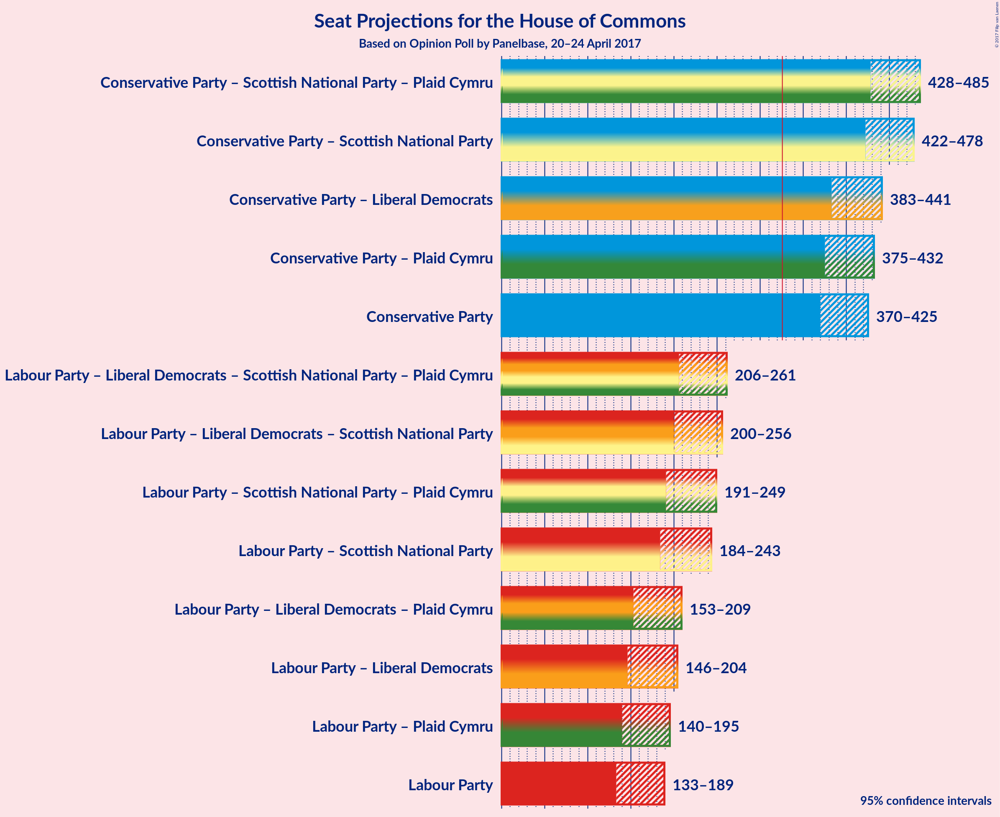

# Opinion Poll by Panelbase, 20–24 April 2017

<a href="#voting-intentions">Voting Intentions</a> | <a href="#seats">Seats</a> | <a href="#coalitions">Coalitions</a> | <a href="#technical-information">Technical Information</a>

## Voting Intentions

### Confidence Intervals

| Party | Last Result | Poll Result | 80% Confidence Interval | 90% Confidence Interval | 95% Confidence Interval | 99% Confidence Interval |
|:-----:|:-----------:|:-----------:|:-----------------------:|:-----------------------:|:-----------------------:|:-----------------------:|
| Conservative Party | 36.9% | 49.4% | 46.8–51.6% |46.1–52.2% |45.5–52.8% |44.4–54.0% |
| Labour Party | 30.4% | 26.7% | 24.6–28.8% |24.0–29.4% |23.5–29.9% |22.5–31.0% |
| Liberal Democrats | 7.9% | 9.9% | 8.5–11.4% |8.2–11.8% |7.9–12.2% |7.3–13.0% |
| Scottish National Party | 4.7% | 5.2% | 4.2–6.3% |3.9–6.7% |3.7–7.0% |3.3–7.6% |
| UK Independence Party | 12.6% | 5.0% | 4.1–6.2% |3.8–6.5% |3.6–6.8% |3.2–7.5% |
| Green Party | 3.8% | 2.9% | 2.2–3.9% |2.1–4.2% |1.9–4.4% |1.6–4.9% |
| Plaid Cymru | 0.6% | 0.8% | 0.5–1.5% |0.4–1.6% |0.4–1.8% |0.3–2.2% |

*Note:* The poll result column reflects the actual value used in the calculations. Published results may vary slightly, and in addition be rounded to fewer digits.

## Seats

### Confidence Intervals

| Party | Last Result | Median | 80% Confidence Interval | 90% Confidence Interval | 95% Confidence Interval | 99% Confidence Interval |
|:-----:|:-----------:|:------:|:-----------------------:|:-----------------------:|:-----------------------:|:-----------------------:|
| <a href="#conservative-party">Conservative Party</a> | 331 | N/A | 380–418 |374–421 |370–425 |360–434 |
| <a href="#labour-party">Labour Party</a> | 232 | N/A | 141–180 |138–183 |133–189 |123–199 |
| <a href="#liberal-democrats">Liberal Democrats</a> | 8 | N/A | 6–23 |5–26 |4–28 |4–31 |
| <a href="#scottish-national-party">Scottish National Party</a> | 56 | N/A | 47–58 |45–59 |43–59 |40–59 |
| <a href="#uk-independence-party">UK Independence Party</a> | 1 | N/A | 0 |0 |0 |0 |
| <a href="#green-party">Green Party</a> | 1 | N/A | 0–1 |0–1 |0–2 |0–2 |
| <a href="#plaid-cymru">Plaid Cymru</a> | 3 | N/A | 4–8 |3–11 |1–12 |0–13 |

## Coalitions

### Confidence Intervals

| Coalition | Last Result | Median | 80% Confidence Interval | 90% Confidence Interval | 95% Confidence Interval | 99% Confidence Interval |
|:---------:|:-----------:|:------:|:-----------------------:|:-----------------------:|:-----------------------:|:-----------------------:|
| Conservative Party – Scottish National Party – Plaid Cymru | 390 | N/A | 437–477 | 432–481 | 428–485 | 417–495 |
| Conservative Party – Scottish National Party | 387 | N/A | 432–471 | 427–475 | 422–478 | 412–487 |
| Conservative Party – Liberal Democrats | 339 | N/A | 392–433 | 387–437 | 383–441 | 372–451 |
| Conservative Party – Plaid Cymru | 334 | N/A | 384–423 | 380–428 | 375–432 | 364–442 |
| Conservative Party | 331 | N/A | 380–418 | 374–421 | 370–425 | 360–434 |
| Labour Party – Liberal Democrats – Scottish National Party – Plaid Cymru | 299 | N/A | 214–252 | 210–257 | 206–261 | 198–271 |
| Labour Party – Liberal Democrats – Scottish National Party | 296 | N/A | 209–247 | 204–252 | 200–256 | 190–267 |
| Labour Party – Scottish National Party – Plaid Cymru | 291 | N/A | 199–239 | 194–244 | 191–249 | 181–259 |
| Labour Party – Scottish National Party | 288 | N/A | 193–234 | 189–239 | 184–243 | 174–255 |
| Labour Party – Liberal Democrats – Plaid Cymru | 243 | N/A | 160–199 | 156–204 | 153–209 | 144–219 |
| Labour Party – Liberal Democrats | 240 | N/A | 154–194 | 150–199 | 146–204 | 136–214 |
| Labour Party – Plaid Cymru | 235 | N/A | 146–185 | 143–189 | 140–195 | 132–204 |
| Labour Party | 232 | N/A | 141–180 | 138–183 | 133–189 | 123–199 |

## Technical Information

### Opinion Poll

+ **Pollster:** Panelbase
+ **Media:** —
+ **Fieldwork period:** 20–24 April 2017

### Calculations

+ **Sample size:** 718
+ **Simulations done:** 2,097,152
+ **Error estimate:** 1.63%

