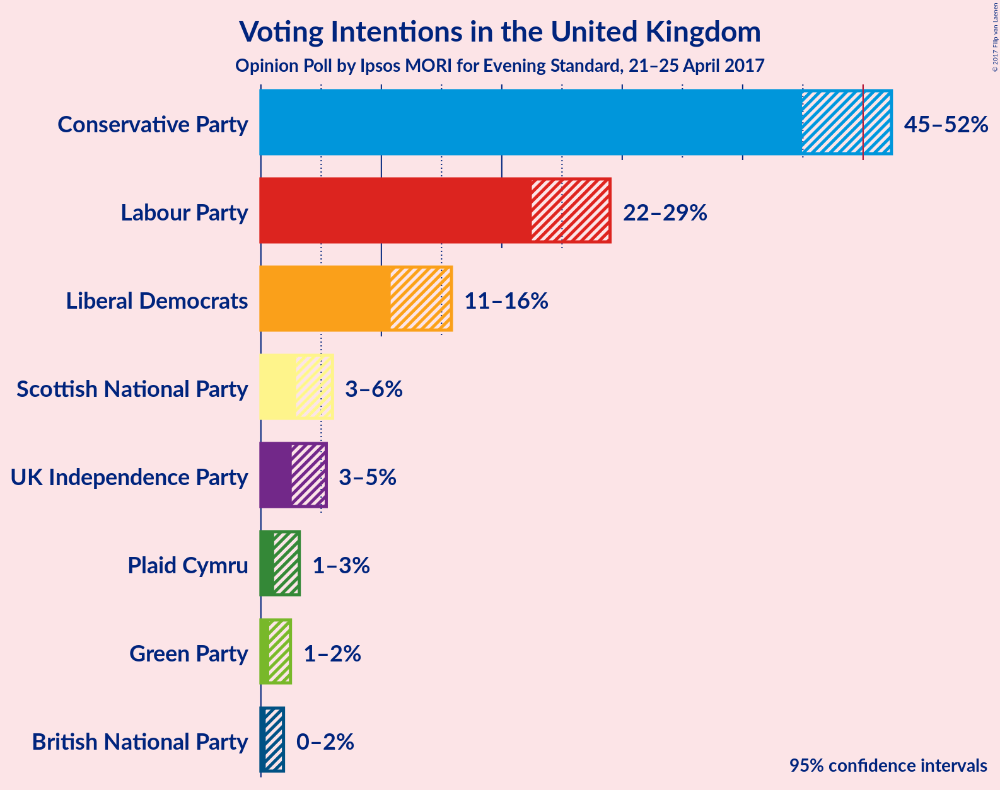
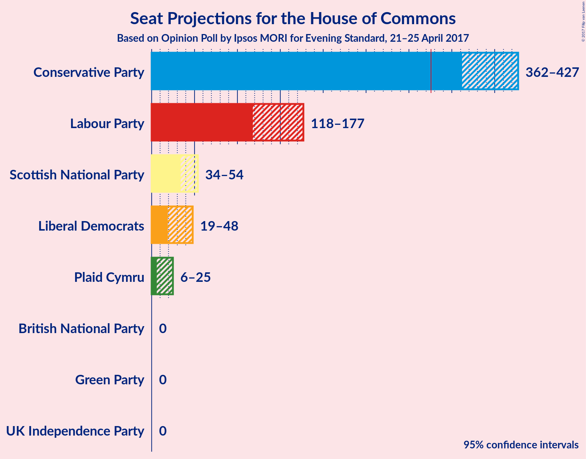
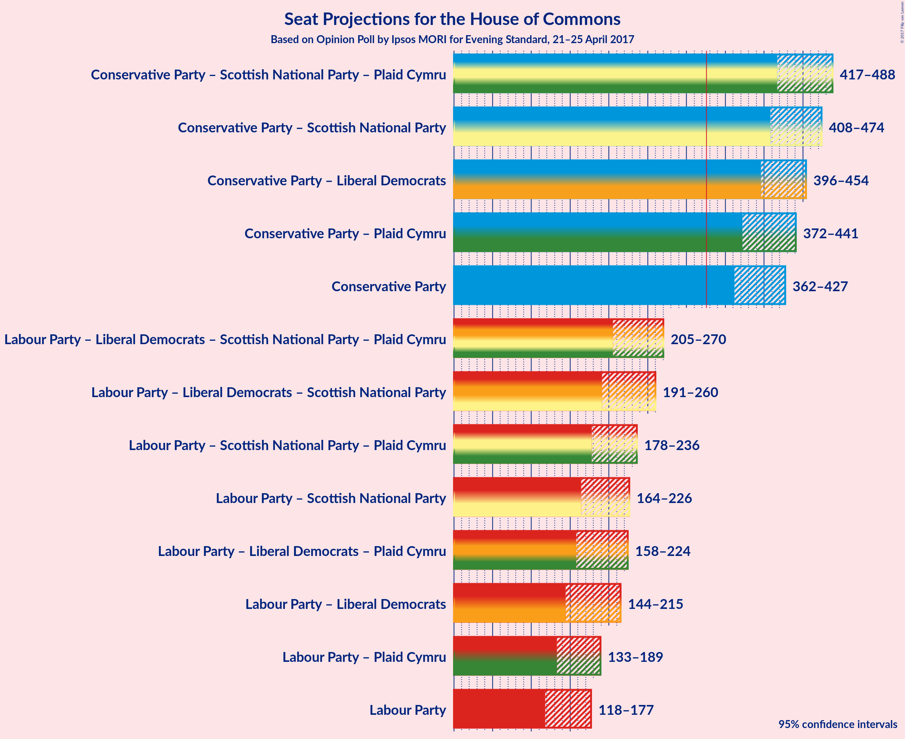

# Opinion Poll by Ipsos MORI for Evening Standard, 21–25 April 2017

<a href="#voting-intentions">Voting Intentions</a> | <a href="#seats">Seats</a> | <a href="#coalitions">Coalitions</a> | <a href="#technical-information">Technical Information</a>

## Voting Intentions

### Confidence Intervals

| Party | Last Result | Poll Result | 80% Confidence Interval | 90% Confidence Interval | 95% Confidence Interval | 99% Confidence Interval |
|:-----:|:-----------:|:-----------:|:-----------------------:|:-----------------------:|:-----------------------:|:-----------------------:|
| Conservative Party | 36.9% | 49.0% | 46.2–51.1% |45.5–51.8% |44.9–52.4% |43.8–53.5% |
| Labour Party | 30.4% | 25.8% | 23.6–27.8% |23.0–28.5% |22.5–29.0% |21.6–30.1% |
| Liberal Democrats | 7.9% | 13.2% | 11.6–14.9% |11.1–15.4% |10.8–15.8% |10.1–16.7% |
| Scottish National Party | 4.7% | 4.2% | 3.3–5.3% |3.1–5.6% |2.9–5.9% |2.6–6.5% |
| UK Independence Party | 12.6% | 3.8% | 3.0–4.8% |2.7–5.2% |2.6–5.4% |2.2–6.0% |
| Plaid Cymru | 0.6% | 1.9% | 1.4–2.7% |1.2–3.0% |1.1–3.2% |0.9–3.6% |
| Green Party | 3.8% | 1.3% | 0.9–2.0% |0.8–2.3% |0.7–2.5% |0.5–2.9% |
| British National Party | 0.0% | 0.9% | 0.5–1.5% |0.5–1.7% |0.4–1.9% |0.3–2.2% |

*Note:* The poll result column reflects the actual value used in the calculations. Published results may vary slightly, and in addition be rounded to fewer digits.

## Seats

### Confidence Intervals

| Party | Last Result | Median | 80% Confidence Interval | 90% Confidence Interval | 95% Confidence Interval | 99% Confidence Interval |
|:-----:|:-----------:|:------:|:-----------------------:|:-----------------------:|:-----------------------:|:-----------------------:|
| <a href="#conservative-party">Conservative Party</a> | 331 | N/A | 373–419 |367–422 |362–427 |352–438 |
| <a href="#labour-party">Labour Party</a> | 232 | N/A | 129–169 |122–175 |118–177 |110–189 |
| <a href="#liberal-democrats">Liberal Democrats</a> | 8 | N/A | 22–44 |20–45 |19–48 |13–50 |
| <a href="#scottish-national-party">Scottish National Party</a> | 56 | N/A | 40–51 |37–54 |34–54 |26–57 |
| <a href="#uk-independence-party">UK Independence Party</a> | 1 | N/A | 0 |0 |0 |0 |
| <a href="#plaid-cymru">Plaid Cymru</a> | 3 | N/A | 8–18 |7–21 |6–25 |4–26 |
| <a href="#green-party">Green Party</a> | 1 | N/A | 0 |0 |0 |0–1 |
| <a href="#british-national-party">British National Party</a> | 0 | N/A | 0 |0 |0 |0 |

## Coalitions

### Confidence Intervals

| Coalition | Last Result | Median | 80% Confidence Interval | 90% Confidence Interval | 95% Confidence Interval | 99% Confidence Interval |
|:---------:|:-----------:|:------:|:-----------------------:|:-----------------------:|:-----------------------:|:-----------------------:|
| Conservative Party – Scottish National Party – Plaid Cymru | 390 | N/A | 431–476 | 422–483 | 417–488 | 406–495 |
| Conservative Party – Scottish National Party | 387 | N/A | 418–463 | 413–467 | 408–474 | 396–480 |
| Conservative Party – Liberal Democrats | 339 | N/A | 406–446 | 398–449 | 396–454 | 388–465 |
| Conservative Party – Plaid Cymru | 334 | N/A | 384–433 | 377–436 | 372–441 | 362–453 |
| Conservative Party | 331 | N/A | 373–419 | 367–422 | 362–427 | 352–438 |
| Labour Party – Liberal Democrats – Scottish National Party – Plaid Cymru | 299 | N/A | 213–259 | 210–265 | 205–270 | 194–280 |
| Labour Party – Liberal Democrats – Scottish National Party | 296 | N/A | 199–248 | 196–255 | 191–260 | 179–270 |
| Labour Party – Scottish National Party – Plaid Cymru | 291 | N/A | 186–226 | 183–234 | 178–236 | 167–244 |
| Labour Party – Scottish National Party | 288 | N/A | 172–214 | 168–221 | 164–226 | 152–235 |
| Labour Party – Liberal Democrats – Plaid Cymru | 243 | N/A | 169–214 | 165–219 | 158–224 | 152–236 |
| Labour Party – Liberal Democrats | 240 | N/A | 156–201 | 149–209 | 144–215 | 137–226 |
| Labour Party – Plaid Cymru | 235 | N/A | 143–181 | 136–186 | 133–189 | 126–201 |
| Labour Party | 232 | N/A | 129–169 | 122–175 | 118–177 | 110–189 |

## Technical Information

### Opinion Poll

+ **Pollster:** Ipsos MORI
+ **Media:** Evening Standard
+ **Fieldwork period:** 21–25 April 2017

### Calculations

+ **Sample size:** 690
+ **Simulations done:** 1,048,576
+ **Error estimate:** 1.19%

