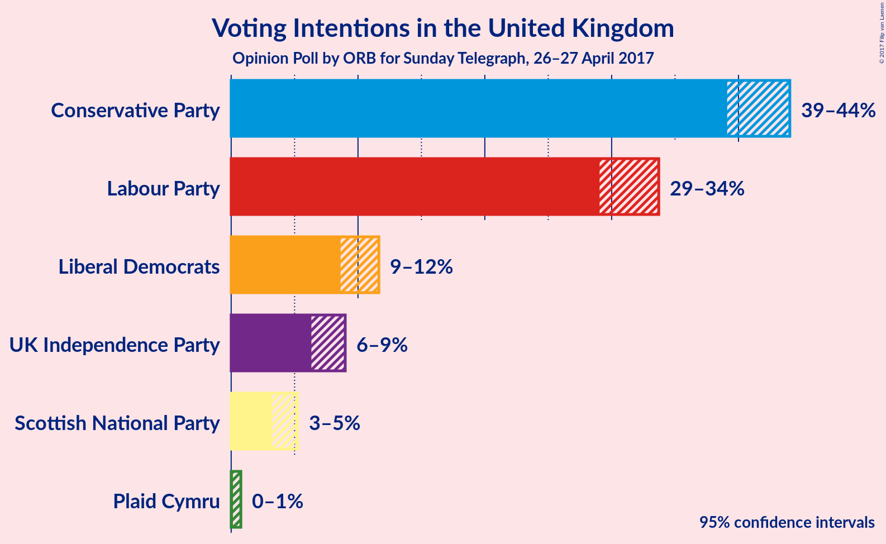
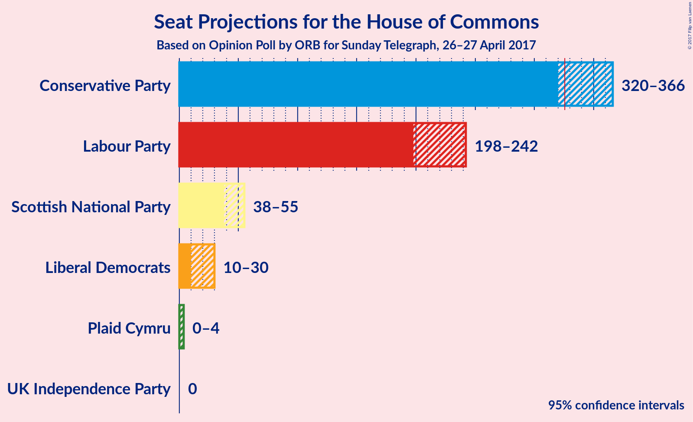
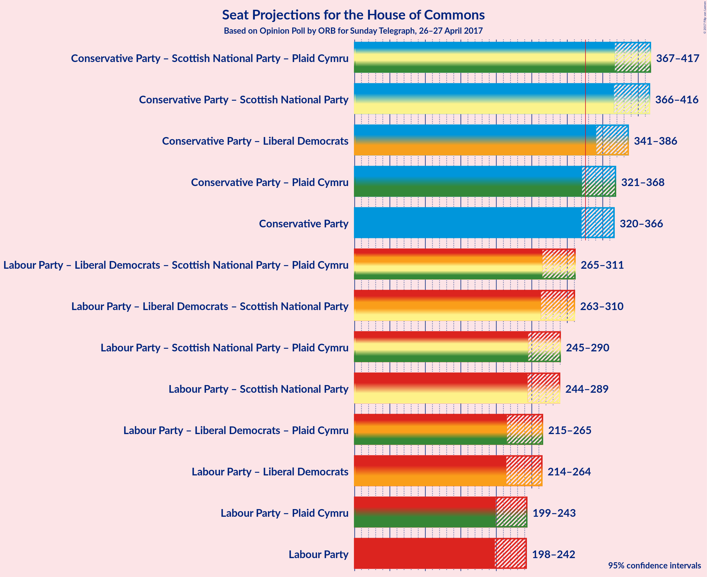

# Opinion Poll by ORB for Sunday Telegraph, 26–27 April 2017

<a href="#voting-intentions">Voting Intentions</a> | <a href="#seats">Seats</a> | <a href="#coalitions">Coalitions</a> | <a href="#technical-information">Technical Information</a>

## Voting Intentions

### Confidence Intervals

| Party | Last Result | Poll Result | 80% Confidence Interval | 90% Confidence Interval | 95% Confidence Interval | 99% Confidence Interval |
|:-----:|:-----------:|:-----------:|:-----------------------:|:-----------------------:|:-----------------------:|:-----------------------:|
| Conservative Party | 36.9% | 43.8% | 40.0–43.2% |39.5–43.7% |39.1–44.0% |38.3–44.8% |
| Labour Party | 30.4% | 33.0% | 29.8–32.9% |29.4–33.3% |29.1–33.7% |28.3–34.5% |
| Liberal Democrats | 7.9% | 10.6% | 9.1–11.1% |8.8–11.4% |8.6–11.6% |8.2–12.2% |
| UK Independence Party | 12.6% | 8.0% | 6.8–8.5% |6.5–8.8% |6.3–9.0% |6.0–9.5% |
| Scottish National Party | 4.7% | 4.3% | 3.5–4.8% |3.4–5.0% |3.2–5.2% |3.0–5.6% |
| Plaid Cymru | 0.6% | 0.3% | 0.2–0.6% |0.2–0.7% |0.1–0.8% |0.1–0.9% |

*Note:* The poll result column reflects the actual value used in the calculations. Published results may vary slightly, and in addition be rounded to fewer digits.

## Seats

### Confidence Intervals

| Party | Last Result | Median | 80% Confidence Interval | 90% Confidence Interval | 95% Confidence Interval | 99% Confidence Interval |
|:-----:|:-----------:|:------:|:-----------------------:|:-----------------------:|:-----------------------:|:-----------------------:|
| <a href="#conservative-party">Conservative Party</a> | 331 | 344 | 329–358 |325–363 |320–366 |312–374 |
| <a href="#labour-party">Labour Party</a> | 232 | 218 | 204–232 |201–237 |198–242 |190–250 |
| <a href="#liberal-democrats">Liberal Democrats</a> | 8 | 20 | 12–27 |11–29 |10–30 |8–34 |
| <a href="#uk-independence-party">UK Independence Party</a> | 1 | 0 | 0 |0 |0 |0 |
| <a href="#scottish-national-party">Scottish National Party</a> | 56 | 49 | 41–53 |39–54 |38–55 |25–57 |
| <a href="#plaid-cymru">Plaid Cymru</a> | 3 | 0 | 0–3 |0–4 |0–4 |0–4 |

### Conservative Party

| Number of Seats | Probability | Accumulated |
|:---------------:|:-----------:|:-----------:|
| 305 | 0% | 100% |
| 306 | 0% | 99.9% |
| 307 | 0% | 99.9% |
| 308 | 0.1% | 99.9% |
| 309 | 0.1% | 99.9% |
| 310 | 0.1% | 99.8% |
| 311 | 0.1% | 99.6% |
| 312 | 0.2% | 99.5% |
| 313 | 0.2% | 99.3% |
| 314 | 0.2% | 99.2% |
| 315 | 0.2% | 99.0% |
| 316 | 0.2% | 98.7% |
| 317 | 0.3% | 98.6% |
| 318 | 0.2% | 98% |
| 319 | 0.3% | 98% |
| 320 | 0.4% | 98% |
| 321 | 0.3% | 97% |
| 322 | 0.5% | 97% |
| 323 | 0.5% | 96% |
| 324 | 0.6% | 96% |
| 325 | 0.9% | 95% |
| 326 | 0.8% | 94% |
| 327 | 1.1% | 94% |
| 328 | 1.2% | 93% |
| 329 | 1.5% | 91% |
| 330 | 1.5% | 90% |
| 331 | 2% | 88% |
| 332 | 2% | 87% |
| 333 | 2% | 85% |
| 334 | 2% | 83% |
| 335 | 2% | 81% |
| 336 | 2% | 79% |
| 337 | 3% | 77% |
| 338 | 2% | 74% |
| 339 | 3% | 71% |
| 340 | 3% | 68% |
| 341 | 4% | 65% |
| 342 | 4% | 61% |
| 343 | 4% | 57% |
| 344 | 5% | 53% |
| 345 | 4% | 48% |
| 346 | 5% | 44% |
| 347 | 5% | 39% |
| 348 | 5% | 34% |
| 349 | 4% | 29% |
| 350 | 3% | 25% |
| 351 | 3% | 22% |
| 352 | 2% | 19% |
| 353 | 2% | 17% |
| 354 | 1.3% | 15% |
| 355 | 1.2% | 14% |
| 356 | 2% | 13% |
| 357 | 1.3% | 11% |
| 358 | 0.8% | 10% |
| 359 | 1.2% | 9% |
| 360 | 0.7% | 8% |
| 361 | 1.0% | 7% |
| 362 | 0.9% | 6% |
| 363 | 1.1% | 6% |
| 364 | 0.7% | 4% |
| 365 | 0.6% | 4% |
| 366 | 0.7% | 3% |
| 367 | 0.4% | 2% |
| 368 | 0.3% | 2% |
| 369 | 0.2% | 2% |
| 370 | 0.4% | 1.3% |
| 371 | 0.1% | 0.9% |
| 372 | 0.2% | 0.8% |
| 373 | 0.1% | 0.6% |
| 374 | 0.1% | 0.5% |
| 375 | 0.1% | 0.4% |
| 376 | 0.1% | 0.3% |
| 377 | 0% | 0.2% |
| 378 | 0% | 0.2% |
| 379 | 0% | 0.1% |
| 380 | 0% | 0.1% |
| 381 | 0% | 0.1% |
| 382 | 0% | 0% |

### Labour Party

| Number of Seats | Probability | Accumulated |
|:---------------:|:-----------:|:-----------:|
| 183 | 0% | 100% |
| 184 | 0% | 99.9% |
| 185 | 0% | 99.9% |
| 186 | 0% | 99.9% |
| 187 | 0.1% | 99.8% |
| 188 | 0.1% | 99.7% |
| 189 | 0.1% | 99.6% |
| 190 | 0.1% | 99.5% |
| 191 | 0.2% | 99.4% |
| 192 | 0.1% | 99.2% |
| 193 | 0.2% | 99.1% |
| 194 | 0.3% | 98.9% |
| 195 | 0.4% | 98.6% |
| 196 | 0.3% | 98% |
| 197 | 0.4% | 98% |
| 198 | 0.6% | 98% |
| 199 | 0.7% | 97% |
| 200 | 1.1% | 96% |
| 201 | 2% | 95% |
| 202 | 2% | 94% |
| 203 | 1.3% | 92% |
| 204 | 1.4% | 91% |
| 205 | 0.7% | 89% |
| 206 | 0.9% | 89% |
| 207 | 0.9% | 88% |
| 208 | 1.2% | 87% |
| 209 | 2% | 86% |
| 210 | 3% | 84% |
| 211 | 3% | 81% |
| 212 | 3% | 78% |
| 213 | 4% | 75% |
| 214 | 4% | 71% |
| 215 | 4% | 68% |
| 216 | 6% | 64% |
| 217 | 5% | 58% |
| 218 | 5% | 53% |
| 219 | 6% | 48% |
| 220 | 5% | 41% |
| 221 | 4% | 36% |
| 222 | 3% | 32% |
| 223 | 3% | 30% |
| 224 | 3% | 27% |
| 225 | 2% | 24% |
| 226 | 2% | 22% |
| 227 | 2% | 20% |
| 228 | 2% | 18% |
| 229 | 2% | 16% |
| 230 | 1.2% | 14% |
| 231 | 2% | 13% |
| 232 | 1.4% | 11% |
| 233 | 2% | 10% |
| 234 | 1.0% | 8% |
| 235 | 0.8% | 7% |
| 236 | 0.9% | 6% |
| 237 | 0.7% | 5% |
| 238 | 0.8% | 5% |
| 239 | 0.4% | 4% |
| 240 | 0.4% | 3% |
| 241 | 0.4% | 3% |
| 242 | 0.3% | 3% |
| 243 | 0.3% | 2% |
| 244 | 0.3% | 2% |
| 245 | 0.3% | 2% |
| 246 | 0.3% | 1.4% |
| 247 | 0.2% | 1.1% |
| 248 | 0.2% | 0.9% |
| 249 | 0.2% | 0.7% |
| 250 | 0.1% | 0.6% |
| 251 | 0.1% | 0.4% |
| 252 | 0.1% | 0.4% |
| 253 | 0.1% | 0.3% |
| 254 | 0% | 0.2% |
| 255 | 0% | 0.2% |
| 256 | 0% | 0.2% |
| 257 | 0% | 0.1% |
| 258 | 0% | 0.1% |
| 259 | 0% | 0.1% |
| 260 | 0% | 0.1% |
| 261 | 0% | 0.1% |
| 262 | 0% | 0.1% |
| 263 | 0% | 0% |

### Liberal Democrats

| Number of Seats | Probability | Accumulated |
|:---------------:|:-----------:|:-----------:|
| 6 | 0.1% | 100% |
| 7 | 0.2% | 99.8% |
| 8 | 0.6% | 99.7% |
| 9 | 2% | 99.1% |
| 10 | 2% | 98% |
| 11 | 4% | 95% |
| 12 | 2% | 91% |
| 13 | 3% | 89% |
| 14 | 5% | 86% |
| 15 | 6% | 81% |
| 16 | 5% | 75% |
| 17 | 6% | 70% |
| 18 | 6% | 65% |
| 19 | 7% | 58% |
| 20 | 6% | 51% |
| 21 | 7% | 45% |
| 22 | 7% | 38% |
| 23 | 6% | 32% |
| 24 | 4% | 26% |
| 25 | 7% | 21% |
| 26 | 4% | 15% |
| 27 | 4% | 11% |
| 28 | 1.5% | 7% |
| 29 | 3% | 5% |
| 30 | 1.0% | 3% |
| 31 | 0.5% | 1.5% |
| 32 | 0.3% | 1.0% |
| 33 | 0.1% | 0.7% |
| 34 | 0.1% | 0.6% |
| 35 | 0.1% | 0.5% |
| 36 | 0.1% | 0.3% |
| 37 | 0.1% | 0.3% |
| 38 | 0.1% | 0.2% |
| 39 | 0.1% | 0.1% |
| 40 | 0% | 0.1% |
| 41 | 0% | 0% |

### UK Independence Party

| Number of Seats | Probability | Accumulated |
|:---------------:|:-----------:|:-----------:|
| 0 | 100% | 100% |
| 1 | 0% | 0% |

### Scottish National Party

| Number of Seats | Probability | Accumulated |
|:---------------:|:-----------:|:-----------:|
| 14 | 0% | 100% |
| 15 | 0% | 99.9% |
| 16 | 0% | 99.9% |
| 17 | 0% | 99.9% |
| 18 | 0% | 99.9% |
| 19 | 0% | 99.9% |
| 20 | 0% | 99.8% |
| 21 | 0% | 99.8% |
| 22 | 0% | 99.8% |
| 23 | 0.1% | 99.8% |
| 24 | 0.1% | 99.7% |
| 25 | 0.2% | 99.6% |
| 26 | 0% | 99.5% |
| 27 | 0.1% | 99.4% |
| 28 | 0.2% | 99.4% |
| 29 | 0.3% | 99.2% |
| 30 | 0.2% | 98.8% |
| 31 | 0.1% | 98.6% |
| 32 | 0.1% | 98% |
| 33 | 0.1% | 98% |
| 34 | 0% | 98% |
| 35 | 0.4% | 98% |
| 36 | 0.2% | 98% |
| 37 | 0.2% | 98% |
| 38 | 1.0% | 98% |
| 39 | 2% | 97% |
| 40 | 2% | 94% |
| 41 | 3% | 92% |
| 42 | 3% | 89% |
| 43 | 2% | 86% |
| 44 | 4% | 84% |
| 45 | 5% | 80% |
| 46 | 7% | 75% |
| 47 | 6% | 69% |
| 48 | 8% | 63% |
| 49 | 13% | 55% |
| 50 | 14% | 42% |
| 51 | 3% | 27% |
| 52 | 3% | 24% |
| 53 | 13% | 21% |
| 54 | 4% | 8% |
| 55 | 2% | 4% |
| 56 | 0.9% | 2% |
| 57 | 0.4% | 0.8% |
| 58 | 0.3% | 0.4% |
| 59 | 0% | 0% |

### Plaid Cymru

| Number of Seats | Probability | Accumulated |
|:---------------:|:-----------:|:-----------:|
| 0 | 51% | 100% |
| 1 | 5% | 49% |
| 2 | 7% | 45% |
| 3 | 29% | 38% |
| 4 | 8% | 9% |
| 5 | 0.3% | 0.4% |
| 6 | 0% | 0.1% |
| 7 | 0% | 0.1% |
| 8 | 0% | 0% |

## Coalitions

### Confidence Intervals

| Coalition | Last Result | Median | 80% Confidence Interval | 90% Confidence Interval | 95% Confidence Interval | 99% Confidence Interval |
|:---------:|:-----------:|:------:|:-----------------------:|:-----------------------:|:-----------------------:|:-----------------------:|
| Conservative Party – Scottish National Party – Plaid Cymru | 390 | 393 | 377–408 | 372–413 | 367–417 | 356–424 |
| Conservative Party – Scottish National Party | 387 | 392 | 376–407 | 370–412 | 366–416 | 355–423 |
| Conservative Party – Liberal Democrats | 339 | 363 | 349–377 | 345–382 | 341–386 | 333–393 |
| Conservative Party – Plaid Cymru | 334 | 346 | 331–359 | 326–364 | 321–368 | 313–375 |
| Conservative Party | 331 | 344 | 329–358 | 325–363 | 320–366 | 312–374 |
| Labour Party – Liberal Democrats – Scottish National Party – Plaid Cymru | 299 | 287 | 273–302 | 268–306 | 265–311 | 257–319 |
| Labour Party – Liberal Democrats – Scottish National Party | 296 | 285 | 272–300 | 267–305 | 263–310 | 256–318 |
| Labour Party – Scottish National Party – Plaid Cymru | 291 | 268 | 254–282 | 249–286 | 245–290 | 238–298 |
| Labour Party – Scottish National Party | 288 | 266 | 253–280 | 248–285 | 244–289 | 237–296 |
| Labour Party – Liberal Democrats – Plaid Cymru | 243 | 239 | 224–255 | 219–261 | 215–265 | 208–276 |
| Labour Party – Liberal Democrats | 240 | 238 | 223–254 | 218–259 | 214–264 | 207–275 |
| Labour Party – Plaid Cymru | 235 | 219 | 206–233 | 202–238 | 199–243 | 191–251 |
| Labour Party | 232 | 218 | 204–232 | 201–237 | 198–242 | 190–250 |

### Conservative Party – Scottish National Party – Plaid Cymru

| Number of Seats | Probability | Accumulated |
|:---------------:|:-----------:|:-----------:|
| 344 | 0% | 100% |
| 345 | 0% | 99.9% |
| 346 | 0% | 99.9% |
| 347 | 0% | 99.9% |
| 348 | 0% | 99.9% |
| 349 | 0% | 99.9% |
| 350 | 0% | 99.9% |
| 351 | 0% | 99.8% |
| 352 | 0% | 99.8% |
| 353 | 0.1% | 99.8% |
| 354 | 0.1% | 99.7% |
| 355 | 0.1% | 99.7% |
| 356 | 0.1% | 99.6% |
| 357 | 0.1% | 99.5% |
| 358 | 0.1% | 99.4% |
| 359 | 0.1% | 99.3% |
| 360 | 0.2% | 99.1% |
| 361 | 0.2% | 99.0% |
| 362 | 0.2% | 98.8% |
| 363 | 0.2% | 98.6% |
| 364 | 0.3% | 98% |
| 365 | 0.2% | 98% |
| 366 | 0.3% | 98% |
| 367 | 0.3% | 98% |
| 368 | 0.4% | 97% |
| 369 | 0.5% | 97% |
| 370 | 0.6% | 96% |
| 371 | 0.5% | 96% |
| 372 | 0.7% | 95% |
| 373 | 0.7% | 95% |
| 374 | 1.0% | 94% |
| 375 | 1.0% | 93% |
| 376 | 1.0% | 92% |
| 377 | 1.4% | 91% |
| 378 | 1.2% | 89% |
| 379 | 2% | 88% |
| 380 | 0.9% | 86% |
| 381 | 1.5% | 86% |
| 382 | 2% | 84% |
| 383 | 1.4% | 82% |
| 384 | 2% | 80% |
| 385 | 2% | 78% |
| 386 | 3% | 76% |
| 387 | 3% | 73% |
| 388 | 3% | 70% |
| 389 | 4% | 67% |
| 390 | 3% | 63% |
| 391 | 4% | 60% |
| 392 | 3% | 56% |
| 393 | 4% | 53% |
| 394 | 3% | 50% |
| 395 | 4% | 46% |
| 396 | 3% | 42% |
| 397 | 4% | 39% |
| 398 | 3% | 35% |
| 399 | 4% | 32% |
| 400 | 2% | 28% |
| 401 | 4% | 26% |
| 402 | 2% | 22% |
| 403 | 2% | 20% |
| 404 | 2% | 17% |
| 405 | 2% | 15% |
| 406 | 1.5% | 14% |
| 407 | 1.4% | 12% |
| 408 | 1.4% | 11% |
| 409 | 0.8% | 9% |
| 410 | 1.2% | 8% |
| 411 | 0.8% | 7% |
| 412 | 0.8% | 6% |
| 413 | 0.6% | 6% |
| 414 | 0.8% | 5% |
| 415 | 0.5% | 4% |
| 416 | 0.7% | 4% |
| 417 | 0.6% | 3% |
| 418 | 0.5% | 2% |
| 419 | 0.3% | 2% |
| 420 | 0.3% | 2% |
| 421 | 0.3% | 1.2% |
| 422 | 0.1% | 0.9% |
| 423 | 0.1% | 0.7% |
| 424 | 0.1% | 0.6% |
| 425 | 0.1% | 0.5% |
| 426 | 0.1% | 0.4% |
| 427 | 0.1% | 0.3% |
| 428 | 0.1% | 0.2% |
| 429 | 0.1% | 0.2% |
| 430 | 0% | 0.1% |
| 431 | 0% | 0.1% |
| 432 | 0% | 0.1% |
| 433 | 0% | 0% |

### Conservative Party – Scottish National Party

| Number of Seats | Probability | Accumulated |
|:---------------:|:-----------:|:-----------:|
| 343 | 0% | 100% |
| 344 | 0% | 99.9% |
| 345 | 0% | 99.9% |
| 346 | 0% | 99.9% |
| 347 | 0% | 99.9% |
| 348 | 0% | 99.9% |
| 349 | 0% | 99.9% |
| 350 | 0% | 99.8% |
| 351 | 0% | 99.8% |
| 352 | 0.1% | 99.8% |
| 353 | 0.1% | 99.7% |
| 354 | 0.1% | 99.7% |
| 355 | 0.1% | 99.6% |
| 356 | 0.1% | 99.4% |
| 357 | 0.1% | 99.4% |
| 358 | 0.1% | 99.2% |
| 359 | 0.2% | 99.1% |
| 360 | 0.2% | 98.9% |
| 361 | 0.2% | 98.7% |
| 362 | 0.2% | 98% |
| 363 | 0.1% | 98% |
| 364 | 0.4% | 98% |
| 365 | 0.3% | 98% |
| 366 | 0.5% | 98% |
| 367 | 0.3% | 97% |
| 368 | 0.4% | 97% |
| 369 | 0.6% | 96% |
| 370 | 0.8% | 96% |
| 371 | 0.8% | 95% |
| 372 | 0.6% | 94% |
| 373 | 0.9% | 94% |
| 374 | 1.2% | 93% |
| 375 | 1.1% | 91% |
| 376 | 1.2% | 90% |
| 377 | 1.3% | 89% |
| 378 | 1.2% | 88% |
| 379 | 2% | 87% |
| 380 | 1.0% | 85% |
| 381 | 2% | 84% |
| 382 | 3% | 82% |
| 383 | 2% | 79% |
| 384 | 3% | 78% |
| 385 | 2% | 75% |
| 386 | 4% | 73% |
| 387 | 3% | 69% |
| 388 | 3% | 66% |
| 389 | 4% | 62% |
| 390 | 3% | 58% |
| 391 | 4% | 55% |
| 392 | 3% | 51% |
| 393 | 3% | 48% |
| 394 | 4% | 45% |
| 395 | 4% | 41% |
| 396 | 4% | 37% |
| 397 | 4% | 34% |
| 398 | 3% | 30% |
| 399 | 3% | 27% |
| 400 | 2% | 24% |
| 401 | 4% | 22% |
| 402 | 2% | 18% |
| 403 | 2% | 16% |
| 404 | 2% | 14% |
| 405 | 1.2% | 13% |
| 406 | 1.4% | 12% |
| 407 | 1.3% | 10% |
| 408 | 1.2% | 9% |
| 409 | 0.7% | 8% |
| 410 | 0.9% | 7% |
| 411 | 1.0% | 6% |
| 412 | 0.6% | 5% |
| 413 | 0.6% | 4% |
| 414 | 0.6% | 4% |
| 415 | 0.6% | 3% |
| 416 | 0.7% | 3% |
| 417 | 0.3% | 2% |
| 418 | 0.4% | 2% |
| 419 | 0.2% | 1.3% |
| 420 | 0.2% | 1.0% |
| 421 | 0.2% | 0.9% |
| 422 | 0.1% | 0.7% |
| 423 | 0.1% | 0.6% |
| 424 | 0.1% | 0.4% |
| 425 | 0.1% | 0.4% |
| 426 | 0.1% | 0.3% |
| 427 | 0.1% | 0.2% |
| 428 | 0% | 0.2% |
| 429 | 0% | 0.1% |
| 430 | 0% | 0.1% |
| 431 | 0% | 0.1% |
| 432 | 0% | 0% |

### Conservative Party – Liberal Democrats

| Number of Seats | Probability | Accumulated |
|:---------------:|:-----------:|:-----------:|
| 328 | 0% | 100% |
| 329 | 0% | 99.9% |
| 330 | 0.1% | 99.9% |
| 331 | 0.1% | 99.8% |
| 332 | 0.1% | 99.7% |
| 333 | 0.1% | 99.6% |
| 334 | 0.2% | 99.5% |
| 335 | 0.2% | 99.3% |
| 336 | 0.3% | 99.1% |
| 337 | 0.2% | 98.9% |
| 338 | 0.3% | 98.6% |
| 339 | 0.2% | 98% |
| 340 | 0.5% | 98% |
| 341 | 0.6% | 98% |
| 342 | 0.5% | 97% |
| 343 | 0.4% | 97% |
| 344 | 0.8% | 96% |
| 345 | 0.7% | 95% |
| 346 | 1.4% | 95% |
| 347 | 0.7% | 93% |
| 348 | 1.2% | 93% |
| 349 | 2% | 92% |
| 350 | 1.4% | 90% |
| 351 | 2% | 89% |
| 352 | 2% | 87% |
| 353 | 2% | 85% |
| 354 | 2% | 84% |
| 355 | 3% | 82% |
| 356 | 2% | 79% |
| 357 | 3% | 77% |
| 358 | 3% | 74% |
| 359 | 3% | 71% |
| 360 | 3% | 67% |
| 361 | 4% | 64% |
| 362 | 5% | 60% |
| 363 | 5% | 54% |
| 364 | 4% | 49% |
| 365 | 5% | 45% |
| 366 | 4% | 40% |
| 367 | 5% | 36% |
| 368 | 4% | 31% |
| 369 | 4% | 28% |
| 370 | 3% | 24% |
| 371 | 2% | 21% |
| 372 | 2% | 19% |
| 373 | 2% | 17% |
| 374 | 2% | 15% |
| 375 | 2% | 13% |
| 376 | 0.8% | 11% |
| 377 | 2% | 11% |
| 378 | 1.0% | 9% |
| 379 | 0.9% | 8% |
| 380 | 1.0% | 7% |
| 381 | 1.1% | 6% |
| 382 | 0.6% | 5% |
| 383 | 0.8% | 4% |
| 384 | 0.7% | 4% |
| 385 | 0.4% | 3% |
| 386 | 0.6% | 3% |
| 387 | 0.3% | 2% |
| 388 | 0.3% | 2% |
| 389 | 0.3% | 1.3% |
| 390 | 0.2% | 1.0% |
| 391 | 0.1% | 0.8% |
| 392 | 0.1% | 0.7% |
| 393 | 0.1% | 0.5% |
| 394 | 0.1% | 0.4% |
| 395 | 0.1% | 0.3% |
| 396 | 0% | 0.2% |
| 397 | 0% | 0.2% |
| 398 | 0% | 0.1% |
| 399 | 0% | 0.1% |
| 400 | 0% | 0.1% |
| 401 | 0% | 0% |

### Conservative Party – Plaid Cymru

| Number of Seats | Probability | Accumulated |
|:---------------:|:-----------:|:-----------:|
| 307 | 0% | 100% |
| 308 | 0% | 99.9% |
| 309 | 0.1% | 99.9% |
| 310 | 0.1% | 99.9% |
| 311 | 0.1% | 99.8% |
| 312 | 0.2% | 99.7% |
| 313 | 0.2% | 99.5% |
| 314 | 0.2% | 99.4% |
| 315 | 0.2% | 99.2% |
| 316 | 0.2% | 99.0% |
| 317 | 0.2% | 98.8% |
| 318 | 0.2% | 98.6% |
| 319 | 0.3% | 98% |
| 320 | 0.3% | 98% |
| 321 | 0.3% | 98% |
| 322 | 0.4% | 97% |
| 323 | 0.4% | 97% |
| 324 | 0.4% | 97% |
| 325 | 0.7% | 96% |
| 326 | 0.7% | 95% |
| 327 | 0.9% | 95% |
| 328 | 0.9% | 94% |
| 329 | 1.1% | 93% |
| 330 | 2% | 92% |
| 331 | 1.5% | 90% |
| 332 | 2% | 89% |
| 333 | 2% | 87% |
| 334 | 2% | 86% |
| 335 | 2% | 83% |
| 336 | 2% | 81% |
| 337 | 2% | 79% |
| 338 | 3% | 77% |
| 339 | 3% | 74% |
| 340 | 3% | 72% |
| 341 | 3% | 69% |
| 342 | 4% | 66% |
| 343 | 3% | 62% |
| 344 | 4% | 59% |
| 345 | 3% | 55% |
| 346 | 5% | 52% |
| 347 | 5% | 46% |
| 348 | 5% | 42% |
| 349 | 5% | 36% |
| 350 | 4% | 31% |
| 351 | 3% | 27% |
| 352 | 3% | 24% |
| 353 | 3% | 21% |
| 354 | 2% | 18% |
| 355 | 1.5% | 16% |
| 356 | 2% | 15% |
| 357 | 1.3% | 13% |
| 358 | 0.9% | 12% |
| 359 | 1.4% | 11% |
| 360 | 1.0% | 10% |
| 361 | 0.7% | 9% |
| 362 | 0.7% | 8% |
| 363 | 1.1% | 7% |
| 364 | 1.1% | 6% |
| 365 | 0.8% | 5% |
| 366 | 1.0% | 4% |
| 367 | 0.6% | 3% |
| 368 | 0.5% | 3% |
| 369 | 0.4% | 2% |
| 370 | 0.4% | 2% |
| 371 | 0.2% | 1.4% |
| 372 | 0.2% | 1.1% |
| 373 | 0.2% | 0.9% |
| 374 | 0.1% | 0.7% |
| 375 | 0.1% | 0.5% |
| 376 | 0.1% | 0.4% |
| 377 | 0.1% | 0.3% |
| 378 | 0.1% | 0.2% |
| 379 | 0% | 0.2% |
| 380 | 0% | 0.1% |
| 381 | 0% | 0.1% |
| 382 | 0% | 0.1% |
| 383 | 0% | 0.1% |
| 384 | 0% | 0% |

### Conservative Party

| Number of Seats | Probability | Accumulated |
|:---------------:|:-----------:|:-----------:|
| 305 | 0% | 100% |
| 306 | 0% | 99.9% |
| 307 | 0% | 99.9% |
| 308 | 0.1% | 99.9% |
| 309 | 0.1% | 99.9% |
| 310 | 0.1% | 99.8% |
| 311 | 0.1% | 99.6% |
| 312 | 0.2% | 99.5% |
| 313 | 0.2% | 99.3% |
| 314 | 0.2% | 99.2% |
| 315 | 0.2% | 99.0% |
| 316 | 0.2% | 98.7% |
| 317 | 0.3% | 98.6% |
| 318 | 0.2% | 98% |
| 319 | 0.3% | 98% |
| 320 | 0.4% | 98% |
| 321 | 0.3% | 97% |
| 322 | 0.5% | 97% |
| 323 | 0.5% | 96% |
| 324 | 0.6% | 96% |
| 325 | 0.9% | 95% |
| 326 | 0.8% | 94% |
| 327 | 1.1% | 94% |
| 328 | 1.2% | 93% |
| 329 | 1.5% | 91% |
| 330 | 1.5% | 90% |
| 331 | 2% | 88% |
| 332 | 2% | 87% |
| 333 | 2% | 85% |
| 334 | 2% | 83% |
| 335 | 2% | 81% |
| 336 | 2% | 79% |
| 337 | 3% | 77% |
| 338 | 2% | 74% |
| 339 | 3% | 71% |
| 340 | 3% | 68% |
| 341 | 4% | 65% |
| 342 | 4% | 61% |
| 343 | 4% | 57% |
| 344 | 5% | 53% |
| 345 | 4% | 48% |
| 346 | 5% | 44% |
| 347 | 5% | 39% |
| 348 | 5% | 34% |
| 349 | 4% | 29% |
| 350 | 3% | 25% |
| 351 | 3% | 22% |
| 352 | 2% | 19% |
| 353 | 2% | 17% |
| 354 | 1.3% | 15% |
| 355 | 1.2% | 14% |
| 356 | 2% | 13% |
| 357 | 1.3% | 11% |
| 358 | 0.8% | 10% |
| 359 | 1.2% | 9% |
| 360 | 0.7% | 8% |
| 361 | 1.0% | 7% |
| 362 | 0.9% | 6% |
| 363 | 1.1% | 6% |
| 364 | 0.7% | 4% |
| 365 | 0.6% | 4% |
| 366 | 0.7% | 3% |
| 367 | 0.4% | 2% |
| 368 | 0.3% | 2% |
| 369 | 0.2% | 2% |
| 370 | 0.4% | 1.3% |
| 371 | 0.1% | 0.9% |
| 372 | 0.2% | 0.8% |
| 373 | 0.1% | 0.6% |
| 374 | 0.1% | 0.5% |
| 375 | 0.1% | 0.4% |
| 376 | 0.1% | 0.3% |
| 377 | 0% | 0.2% |
| 378 | 0% | 0.2% |
| 379 | 0% | 0.1% |
| 380 | 0% | 0.1% |
| 381 | 0% | 0.1% |
| 382 | 0% | 0% |

### Labour Party – Liberal Democrats – Scottish National Party – Plaid Cymru

| Number of Seats | Probability | Accumulated |
|:---------------:|:-----------:|:-----------:|
| 250 | 0% | 100% |
| 251 | 0% | 99.9% |
| 252 | 0% | 99.9% |
| 253 | 0% | 99.9% |
| 254 | 0% | 99.8% |
| 255 | 0.1% | 99.8% |
| 256 | 0.1% | 99.7% |
| 257 | 0.1% | 99.6% |
| 258 | 0.1% | 99.5% |
| 259 | 0.2% | 99.4% |
| 260 | 0.1% | 99.2% |
| 261 | 0.4% | 99.1% |
| 262 | 0.2% | 98.7% |
| 263 | 0.3% | 98% |
| 264 | 0.4% | 98% |
| 265 | 0.7% | 98% |
| 266 | 0.6% | 97% |
| 267 | 0.7% | 96% |
| 268 | 1.1% | 96% |
| 269 | 0.9% | 94% |
| 270 | 1.0% | 94% |
| 271 | 0.7% | 93% |
| 272 | 1.2% | 92% |
| 273 | 0.8% | 91% |
| 274 | 1.3% | 90% |
| 275 | 2% | 89% |
| 276 | 1.2% | 87% |
| 277 | 1.3% | 86% |
| 278 | 2% | 85% |
| 279 | 2% | 83% |
| 280 | 3% | 81% |
| 281 | 3% | 78% |
| 282 | 4% | 75% |
| 283 | 5% | 71% |
| 284 | 5% | 66% |
| 285 | 5% | 61% |
| 286 | 4% | 56% |
| 287 | 5% | 52% |
| 288 | 4% | 47% |
| 289 | 4% | 43% |
| 290 | 4% | 39% |
| 291 | 3% | 35% |
| 292 | 3% | 32% |
| 293 | 2% | 29% |
| 294 | 3% | 26% |
| 295 | 2% | 23% |
| 296 | 2% | 21% |
| 297 | 2% | 19% |
| 298 | 2% | 17% |
| 299 | 2% | 15% |
| 300 | 2% | 13% |
| 301 | 1.5% | 12% |
| 302 | 1.5% | 10% |
| 303 | 1.2% | 9% |
| 304 | 1.1% | 7% |
| 305 | 0.8% | 6% |
| 306 | 0.9% | 6% |
| 307 | 0.6% | 5% |
| 308 | 0.5% | 4% |
| 309 | 0.5% | 4% |
| 310 | 0.3% | 3% |
| 311 | 0.4% | 3% |
| 312 | 0.3% | 2% |
| 313 | 0.2% | 2% |
| 314 | 0.3% | 2% |
| 315 | 0.2% | 1.4% |
| 316 | 0.2% | 1.3% |
| 317 | 0.2% | 1.0% |
| 318 | 0.2% | 0.8% |
| 319 | 0.2% | 0.7% |
| 320 | 0.1% | 0.5% |
| 321 | 0.1% | 0.4% |
| 322 | 0.1% | 0.2% |
| 323 | 0.1% | 0.1% |
| 324 | 0% | 0.1% |
| 325 | 0% | 0.1% |
| 326 | 0% | 0.1% |
| 327 | 0% | 0% |

### Labour Party – Liberal Democrats – Scottish National Party

| Number of Seats | Probability | Accumulated |
|:---------------:|:-----------:|:-----------:|
| 248 | 0% | 100% |
| 249 | 0% | 99.9% |
| 250 | 0% | 99.9% |
| 251 | 0% | 99.9% |
| 252 | 0% | 99.9% |
| 253 | 0.1% | 99.8% |
| 254 | 0.1% | 99.8% |
| 255 | 0.1% | 99.7% |
| 256 | 0.1% | 99.6% |
| 257 | 0.1% | 99.5% |
| 258 | 0.2% | 99.3% |
| 259 | 0.2% | 99.1% |
| 260 | 0.2% | 98.9% |
| 261 | 0.4% | 98.6% |
| 262 | 0.4% | 98% |
| 263 | 0.5% | 98% |
| 264 | 0.6% | 97% |
| 265 | 1.0% | 97% |
| 266 | 0.8% | 96% |
| 267 | 1.1% | 95% |
| 268 | 1.1% | 94% |
| 269 | 0.7% | 93% |
| 270 | 0.7% | 92% |
| 271 | 1.0% | 91% |
| 272 | 1.4% | 90% |
| 273 | 0.9% | 89% |
| 274 | 1.3% | 88% |
| 275 | 2% | 87% |
| 276 | 1.5% | 85% |
| 277 | 2% | 84% |
| 278 | 3% | 82% |
| 279 | 3% | 79% |
| 280 | 3% | 76% |
| 281 | 4% | 73% |
| 282 | 5% | 69% |
| 283 | 5% | 64% |
| 284 | 5% | 58% |
| 285 | 5% | 54% |
| 286 | 3% | 48% |
| 287 | 4% | 45% |
| 288 | 3% | 41% |
| 289 | 4% | 38% |
| 290 | 3% | 34% |
| 291 | 3% | 31% |
| 292 | 3% | 28% |
| 293 | 3% | 26% |
| 294 | 2% | 23% |
| 295 | 2% | 21% |
| 296 | 2% | 19% |
| 297 | 2% | 17% |
| 298 | 2% | 14% |
| 299 | 2% | 13% |
| 300 | 1.5% | 11% |
| 301 | 2% | 10% |
| 302 | 1.1% | 8% |
| 303 | 0.9% | 7% |
| 304 | 0.9% | 6% |
| 305 | 0.7% | 5% |
| 306 | 0.7% | 5% |
| 307 | 0.4% | 4% |
| 308 | 0.4% | 3% |
| 309 | 0.4% | 3% |
| 310 | 0.3% | 3% |
| 311 | 0.3% | 2% |
| 312 | 0.3% | 2% |
| 313 | 0.2% | 2% |
| 314 | 0.2% | 1.4% |
| 315 | 0.2% | 1.2% |
| 316 | 0.2% | 1.0% |
| 317 | 0.2% | 0.8% |
| 318 | 0.2% | 0.6% |
| 319 | 0.2% | 0.5% |
| 320 | 0.1% | 0.3% |
| 321 | 0.1% | 0.2% |
| 322 | 0.1% | 0.1% |
| 323 | 0% | 0.1% |
| 324 | 0% | 0.1% |
| 325 | 0% | 0% |

### Labour Party – Scottish National Party – Plaid Cymru

| Number of Seats | Probability | Accumulated |
|:---------------:|:-----------:|:-----------:|
| 231 | 0% | 100% |
| 232 | 0% | 99.9% |
| 233 | 0% | 99.9% |
| 234 | 0% | 99.9% |
| 235 | 0% | 99.8% |
| 236 | 0.1% | 99.8% |
| 237 | 0.1% | 99.7% |
| 238 | 0.1% | 99.6% |
| 239 | 0.1% | 99.5% |
| 240 | 0.1% | 99.3% |
| 241 | 0.2% | 99.2% |
| 242 | 0.3% | 99.0% |
| 243 | 0.3% | 98.7% |
| 244 | 0.3% | 98% |
| 245 | 0.6% | 98% |
| 246 | 0.4% | 97% |
| 247 | 0.7% | 97% |
| 248 | 0.8% | 96% |
| 249 | 0.6% | 96% |
| 250 | 1.1% | 95% |
| 251 | 1.0% | 94% |
| 252 | 0.9% | 93% |
| 253 | 1.0% | 92% |
| 254 | 2% | 91% |
| 255 | 0.8% | 89% |
| 256 | 2% | 89% |
| 257 | 2% | 87% |
| 258 | 2% | 85% |
| 259 | 2% | 83% |
| 260 | 2% | 81% |
| 261 | 3% | 79% |
| 262 | 4% | 76% |
| 263 | 4% | 72% |
| 264 | 5% | 69% |
| 265 | 4% | 64% |
| 266 | 5% | 60% |
| 267 | 4% | 55% |
| 268 | 5% | 51% |
| 269 | 5% | 46% |
| 270 | 4% | 40% |
| 271 | 3% | 36% |
| 272 | 3% | 33% |
| 273 | 3% | 29% |
| 274 | 3% | 26% |
| 275 | 2% | 23% |
| 276 | 3% | 21% |
| 277 | 2% | 18% |
| 278 | 2% | 16% |
| 279 | 2% | 15% |
| 280 | 2% | 13% |
| 281 | 1.4% | 11% |
| 282 | 2% | 10% |
| 283 | 1.2% | 8% |
| 284 | 0.7% | 7% |
| 285 | 1.4% | 7% |
| 286 | 0.7% | 5% |
| 287 | 0.8% | 5% |
| 288 | 0.4% | 4% |
| 289 | 0.5% | 3% |
| 290 | 0.6% | 3% |
| 291 | 0.5% | 2% |
| 292 | 0.2% | 2% |
| 293 | 0.3% | 2% |
| 294 | 0.2% | 1.4% |
| 295 | 0.3% | 1.1% |
| 296 | 0.2% | 0.9% |
| 297 | 0.2% | 0.7% |
| 298 | 0.1% | 0.5% |
| 299 | 0.1% | 0.4% |
| 300 | 0.1% | 0.3% |
| 301 | 0.1% | 0.2% |
| 302 | 0% | 0.1% |
| 303 | 0% | 0.1% |
| 304 | 0% | 0% |

### Labour Party – Scottish National Party

| Number of Seats | Probability | Accumulated |
|:---------------:|:-----------:|:-----------:|
| 229 | 0% | 100% |
| 230 | 0% | 99.9% |
| 231 | 0% | 99.9% |
| 232 | 0.1% | 99.9% |
| 233 | 0.1% | 99.8% |
| 234 | 0.1% | 99.8% |
| 235 | 0.1% | 99.7% |
| 236 | 0.1% | 99.7% |
| 237 | 0.1% | 99.6% |
| 238 | 0.2% | 99.4% |
| 239 | 0.2% | 99.2% |
| 240 | 0.2% | 99.1% |
| 241 | 0.2% | 98.9% |
| 242 | 0.4% | 98.7% |
| 243 | 0.5% | 98% |
| 244 | 0.6% | 98% |
| 245 | 0.7% | 97% |
| 246 | 0.5% | 97% |
| 247 | 0.8% | 96% |
| 248 | 1.0% | 95% |
| 249 | 0.8% | 94% |
| 250 | 0.9% | 94% |
| 251 | 1.5% | 93% |
| 252 | 0.8% | 91% |
| 253 | 1.3% | 90% |
| 254 | 2% | 89% |
| 255 | 1.5% | 87% |
| 256 | 2% | 86% |
| 257 | 2% | 84% |
| 258 | 3% | 82% |
| 259 | 2% | 79% |
| 260 | 3% | 77% |
| 261 | 3% | 74% |
| 262 | 5% | 71% |
| 263 | 3% | 66% |
| 264 | 5% | 63% |
| 265 | 4% | 58% |
| 266 | 5% | 54% |
| 267 | 4% | 48% |
| 268 | 4% | 44% |
| 269 | 5% | 40% |
| 270 | 4% | 35% |
| 271 | 3% | 31% |
| 272 | 3% | 28% |
| 273 | 2% | 25% |
| 274 | 3% | 23% |
| 275 | 2% | 20% |
| 276 | 3% | 18% |
| 277 | 2% | 15% |
| 278 | 1.1% | 14% |
| 279 | 2% | 13% |
| 280 | 2% | 11% |
| 281 | 1.3% | 9% |
| 282 | 1.2% | 8% |
| 283 | 0.8% | 7% |
| 284 | 0.8% | 6% |
| 285 | 1.1% | 5% |
| 286 | 0.5% | 4% |
| 287 | 0.5% | 4% |
| 288 | 0.5% | 3% |
| 289 | 0.4% | 3% |
| 290 | 0.3% | 2% |
| 291 | 0.4% | 2% |
| 292 | 0.2% | 2% |
| 293 | 0.3% | 1.3% |
| 294 | 0.2% | 1.1% |
| 295 | 0.2% | 0.9% |
| 296 | 0.1% | 0.6% |
| 297 | 0.1% | 0.5% |
| 298 | 0.1% | 0.4% |
| 299 | 0.1% | 0.2% |
| 300 | 0% | 0.2% |
| 301 | 0% | 0.1% |
| 302 | 0% | 0.1% |
| 303 | 0% | 0% |

### Labour Party – Liberal Democrats – Plaid Cymru

| Number of Seats | Probability | Accumulated |
|:---------------:|:-----------:|:-----------:|
| 200 | 0% | 100% |
| 201 | 0% | 99.9% |
| 202 | 0% | 99.9% |
| 203 | 0% | 99.9% |
| 204 | 0.1% | 99.8% |
| 205 | 0.1% | 99.8% |
| 206 | 0.1% | 99.7% |
| 207 | 0.1% | 99.6% |
| 208 | 0.1% | 99.6% |
| 209 | 0.1% | 99.4% |
| 210 | 0.2% | 99.3% |
| 211 | 0.2% | 99.1% |
| 212 | 0.2% | 99.0% |
| 213 | 0.4% | 98.7% |
| 214 | 0.3% | 98% |
| 215 | 0.7% | 98% |
| 216 | 0.6% | 97% |
| 217 | 0.6% | 97% |
| 218 | 0.6% | 96% |
| 219 | 0.6% | 96% |
| 220 | 1.0% | 95% |
| 221 | 0.9% | 94% |
| 222 | 0.7% | 93% |
| 223 | 1.2% | 92% |
| 224 | 1.3% | 91% |
| 225 | 1.4% | 90% |
| 226 | 1.2% | 88% |
| 227 | 2% | 87% |
| 228 | 2% | 86% |
| 229 | 2% | 84% |
| 230 | 4% | 82% |
| 231 | 2% | 78% |
| 232 | 3% | 76% |
| 233 | 3% | 73% |
| 234 | 4% | 70% |
| 235 | 4% | 66% |
| 236 | 4% | 63% |
| 237 | 4% | 59% |
| 238 | 3% | 55% |
| 239 | 3% | 52% |
| 240 | 4% | 49% |
| 241 | 3% | 45% |
| 242 | 4% | 42% |
| 243 | 3% | 38% |
| 244 | 3% | 34% |
| 245 | 4% | 31% |
| 246 | 2% | 27% |
| 247 | 3% | 25% |
| 248 | 2% | 22% |
| 249 | 3% | 21% |
| 250 | 2% | 18% |
| 251 | 1.0% | 16% |
| 252 | 2% | 15% |
| 253 | 1.2% | 13% |
| 254 | 1.3% | 12% |
| 255 | 1.2% | 11% |
| 256 | 1.1% | 10% |
| 257 | 1.2% | 9% |
| 258 | 0.9% | 7% |
| 259 | 0.6% | 6% |
| 260 | 0.8% | 6% |
| 261 | 0.8% | 5% |
| 262 | 0.6% | 4% |
| 263 | 0.4% | 4% |
| 264 | 0.3% | 3% |
| 265 | 0.5% | 3% |
| 266 | 0.3% | 2% |
| 267 | 0.4% | 2% |
| 268 | 0.1% | 2% |
| 269 | 0.2% | 2% |
| 270 | 0.2% | 2% |
| 271 | 0.2% | 1.3% |
| 272 | 0.2% | 1.1% |
| 273 | 0.1% | 0.9% |
| 274 | 0.1% | 0.8% |
| 275 | 0.1% | 0.6% |
| 276 | 0.1% | 0.6% |
| 277 | 0.1% | 0.4% |
| 278 | 0.1% | 0.3% |
| 279 | 0.1% | 0.3% |
| 280 | 0% | 0.2% |
| 281 | 0% | 0.2% |
| 282 | 0% | 0.2% |
| 283 | 0% | 0.1% |
| 284 | 0% | 0.1% |
| 285 | 0% | 0.1% |
| 286 | 0% | 0.1% |
| 287 | 0% | 0.1% |
| 288 | 0% | 0.1% |
| 289 | 0% | 0% |

### Labour Party – Liberal Democrats

| Number of Seats | Probability | Accumulated |
|:---------------:|:-----------:|:-----------:|
| 199 | 0% | 100% |
| 200 | 0% | 99.9% |
| 201 | 0% | 99.9% |
| 202 | 0.1% | 99.9% |
| 203 | 0.1% | 99.8% |
| 204 | 0.1% | 99.8% |
| 205 | 0.1% | 99.7% |
| 206 | 0.1% | 99.6% |
| 207 | 0.1% | 99.5% |
| 208 | 0.1% | 99.4% |
| 209 | 0.1% | 99.3% |
| 210 | 0.3% | 99.1% |
| 211 | 0.3% | 98.8% |
| 212 | 0.3% | 98% |
| 213 | 0.5% | 98% |
| 214 | 0.6% | 98% |
| 215 | 0.7% | 97% |
| 216 | 0.5% | 96% |
| 217 | 0.8% | 96% |
| 218 | 0.6% | 95% |
| 219 | 0.8% | 94% |
| 220 | 0.8% | 94% |
| 221 | 1.2% | 93% |
| 222 | 0.8% | 92% |
| 223 | 1.4% | 91% |
| 224 | 1.4% | 89% |
| 225 | 1.5% | 88% |
| 226 | 2% | 86% |
| 227 | 2% | 85% |
| 228 | 2% | 83% |
| 229 | 2% | 80% |
| 230 | 4% | 78% |
| 231 | 2% | 74% |
| 232 | 4% | 72% |
| 233 | 3% | 68% |
| 234 | 4% | 65% |
| 235 | 3% | 61% |
| 236 | 4% | 58% |
| 237 | 3% | 54% |
| 238 | 4% | 50% |
| 239 | 3% | 47% |
| 240 | 4% | 44% |
| 241 | 3% | 40% |
| 242 | 4% | 37% |
| 243 | 3% | 33% |
| 244 | 3% | 30% |
| 245 | 3% | 27% |
| 246 | 2% | 24% |
| 247 | 2% | 22% |
| 248 | 1.4% | 20% |
| 249 | 2% | 18% |
| 250 | 1.5% | 16% |
| 251 | 0.9% | 14% |
| 252 | 2% | 14% |
| 253 | 1.2% | 12% |
| 254 | 1.4% | 11% |
| 255 | 1.0% | 9% |
| 256 | 1.0% | 8% |
| 257 | 1.0% | 7% |
| 258 | 0.7% | 6% |
| 259 | 0.7% | 5% |
| 260 | 0.5% | 5% |
| 261 | 0.6% | 4% |
| 262 | 0.5% | 4% |
| 263 | 0.4% | 3% |
| 264 | 0.3% | 3% |
| 265 | 0.3% | 2% |
| 266 | 0.2% | 2% |
| 267 | 0.3% | 2% |
| 268 | 0.2% | 2% |
| 269 | 0.2% | 1.4% |
| 270 | 0.2% | 1.2% |
| 271 | 0.2% | 1.0% |
| 272 | 0.1% | 0.9% |
| 273 | 0.1% | 0.7% |
| 274 | 0.1% | 0.6% |
| 275 | 0.1% | 0.5% |
| 276 | 0.1% | 0.4% |
| 277 | 0.1% | 0.3% |
| 278 | 0.1% | 0.3% |
| 279 | 0% | 0.2% |
| 280 | 0% | 0.2% |
| 281 | 0% | 0.2% |
| 282 | 0% | 0.1% |
| 283 | 0% | 0.1% |
| 284 | 0% | 0.1% |
| 285 | 0% | 0.1% |
| 286 | 0% | 0.1% |
| 287 | 0% | 0.1% |
| 288 | 0% | 0% |

### Labour Party – Plaid Cymru

| Number of Seats | Probability | Accumulated |
|:---------------:|:-----------:|:-----------:|
| 184 | 0% | 100% |
| 185 | 0% | 99.9% |
| 186 | 0% | 99.9% |
| 187 | 0% | 99.9% |
| 188 | 0.1% | 99.8% |
| 189 | 0.1% | 99.8% |
| 190 | 0.1% | 99.7% |
| 191 | 0.2% | 99.6% |
| 192 | 0.1% | 99.4% |
| 193 | 0.2% | 99.3% |
| 194 | 0.2% | 99.2% |
| 195 | 0.4% | 99.0% |
| 196 | 0.2% | 98.6% |
| 197 | 0.3% | 98% |
| 198 | 0.4% | 98% |
| 199 | 0.4% | 98% |
| 200 | 0.7% | 97% |
| 201 | 0.9% | 97% |
| 202 | 1.4% | 96% |
| 203 | 1.3% | 94% |
| 204 | 2% | 93% |
| 205 | 1.0% | 91% |
| 206 | 1.2% | 90% |
| 207 | 0.8% | 89% |
| 208 | 0.7% | 88% |
| 209 | 1.0% | 88% |
| 210 | 2% | 87% |
| 211 | 2% | 85% |
| 212 | 2% | 83% |
| 213 | 3% | 81% |
| 214 | 4% | 77% |
| 215 | 4% | 73% |
| 216 | 4% | 70% |
| 217 | 4% | 66% |
| 218 | 7% | 62% |
| 219 | 6% | 55% |
| 220 | 7% | 49% |
| 221 | 5% | 42% |
| 222 | 4% | 37% |
| 223 | 3% | 33% |
| 224 | 3% | 30% |
| 225 | 2% | 27% |
| 226 | 2% | 25% |
| 227 | 3% | 23% |
| 228 | 3% | 20% |
| 229 | 2% | 18% |
| 230 | 1.5% | 16% |
| 231 | 2% | 15% |
| 232 | 2% | 13% |
| 233 | 2% | 11% |
| 234 | 1.3% | 10% |
| 235 | 0.9% | 9% |
| 236 | 1.0% | 8% |
| 237 | 0.8% | 7% |
| 238 | 1.1% | 6% |
| 239 | 0.6% | 5% |
| 240 | 0.5% | 4% |
| 241 | 0.5% | 4% |
| 242 | 0.5% | 3% |
| 243 | 0.3% | 3% |
| 244 | 0.3% | 2% |
| 245 | 0.3% | 2% |
| 246 | 0.3% | 2% |
| 247 | 0.3% | 1.4% |
| 248 | 0.2% | 1.2% |
| 249 | 0.2% | 1.0% |
| 250 | 0.2% | 0.8% |
| 251 | 0.1% | 0.6% |
| 252 | 0.1% | 0.5% |
| 253 | 0.1% | 0.4% |
| 254 | 0.1% | 0.3% |
| 255 | 0% | 0.2% |
| 256 | 0% | 0.2% |
| 257 | 0% | 0.2% |
| 258 | 0% | 0.2% |
| 259 | 0% | 0.1% |
| 260 | 0% | 0.1% |
| 261 | 0% | 0.1% |
| 262 | 0% | 0.1% |
| 263 | 0% | 0.1% |
| 264 | 0% | 0% |

### Labour Party

| Number of Seats | Probability | Accumulated |
|:---------------:|:-----------:|:-----------:|
| 183 | 0% | 100% |
| 184 | 0% | 99.9% |
| 185 | 0% | 99.9% |
| 186 | 0% | 99.9% |
| 187 | 0.1% | 99.8% |
| 188 | 0.1% | 99.7% |
| 189 | 0.1% | 99.6% |
| 190 | 0.1% | 99.5% |
| 191 | 0.2% | 99.4% |
| 192 | 0.1% | 99.2% |
| 193 | 0.2% | 99.1% |
| 194 | 0.3% | 98.9% |
| 195 | 0.4% | 98.6% |
| 196 | 0.3% | 98% |
| 197 | 0.4% | 98% |
| 198 | 0.6% | 98% |
| 199 | 0.7% | 97% |
| 200 | 1.1% | 96% |
| 201 | 2% | 95% |
| 202 | 2% | 94% |
| 203 | 1.3% | 92% |
| 204 | 1.4% | 91% |
| 205 | 0.7% | 89% |
| 206 | 0.9% | 89% |
| 207 | 0.9% | 88% |
| 208 | 1.2% | 87% |
| 209 | 2% | 86% |
| 210 | 3% | 84% |
| 211 | 3% | 81% |
| 212 | 3% | 78% |
| 213 | 4% | 75% |
| 214 | 4% | 71% |
| 215 | 4% | 68% |
| 216 | 6% | 64% |
| 217 | 5% | 58% |
| 218 | 5% | 53% |
| 219 | 6% | 48% |
| 220 | 5% | 41% |
| 221 | 4% | 36% |
| 222 | 3% | 32% |
| 223 | 3% | 30% |
| 224 | 3% | 27% |
| 225 | 2% | 24% |
| 226 | 2% | 22% |
| 227 | 2% | 20% |
| 228 | 2% | 18% |
| 229 | 2% | 16% |
| 230 | 1.2% | 14% |
| 231 | 2% | 13% |
| 232 | 1.4% | 11% |
| 233 | 2% | 10% |
| 234 | 1.0% | 8% |
| 235 | 0.8% | 7% |
| 236 | 0.9% | 6% |
| 237 | 0.7% | 5% |
| 238 | 0.8% | 5% |
| 239 | 0.4% | 4% |
| 240 | 0.4% | 3% |
| 241 | 0.4% | 3% |
| 242 | 0.3% | 3% |
| 243 | 0.3% | 2% |
| 244 | 0.3% | 2% |
| 245 | 0.3% | 2% |
| 246 | 0.3% | 1.4% |
| 247 | 0.2% | 1.1% |
| 248 | 0.2% | 0.9% |
| 249 | 0.2% | 0.7% |
| 250 | 0.1% | 0.6% |
| 251 | 0.1% | 0.4% |
| 252 | 0.1% | 0.4% |
| 253 | 0.1% | 0.3% |
| 254 | 0% | 0.2% |
| 255 | 0% | 0.2% |
| 256 | 0% | 0.2% |
| 257 | 0% | 0.1% |
| 258 | 0% | 0.1% |
| 259 | 0% | 0.1% |
| 260 | 0% | 0.1% |
| 261 | 0% | 0.1% |
| 262 | 0% | 0.1% |
| 263 | 0% | 0% |

## Technical Information

### Opinion Poll

+ **Pollster:** ORB
+ **Media:** Sunday Telegraph
+ **Fieldwork period:** 26–27 April 2017

### Calculations

+ **Sample size:** 1457
+ **Simulations done:** 2,097,152
+ **Error estimate:** 0.43%

