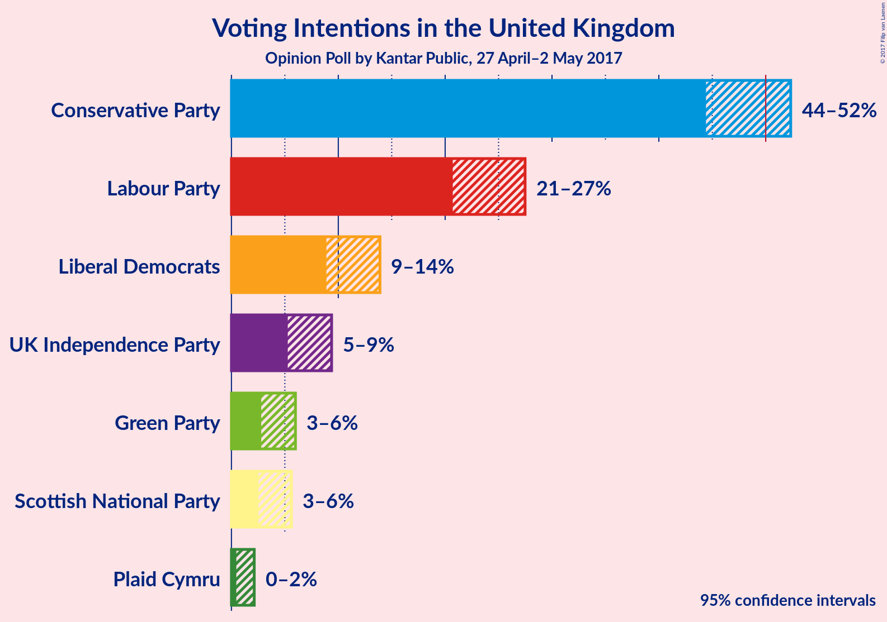
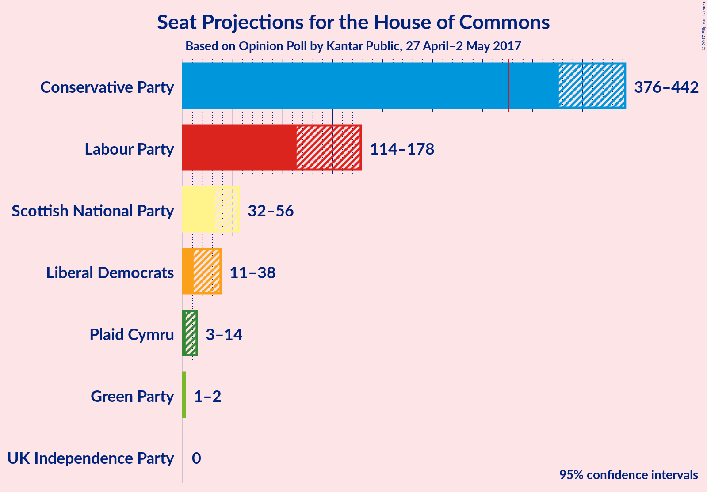
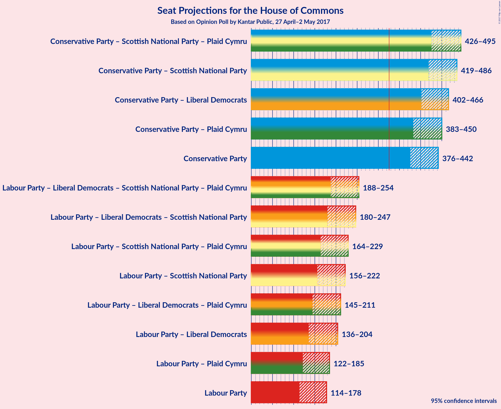

# Opinion Poll by Kantar Public, 27 April–2 May 2017

<a href="#voting-intentions">Voting Intentions</a> | <a href="#seats">Seats</a> | <a href="#coalitions">Coalitions</a> | <a href="#technical-information">Technical Information</a>

## Voting Intentions

### Confidence Intervals

| Party | Last Result | Poll Result | 80% Confidence Interval | 90% Confidence Interval | 95% Confidence Interval | 99% Confidence Interval |
|:-----:|:-----------:|:-----------:|:-----------------------:|:-----------------------:|:-----------------------:|:-----------------------:|
| Conservative Party | 36.9% | 48.7% | 45.8–51.0% |45.0–51.7% |44.4–52.3% |43.2–53.6% |
| Labour Party | 30.4% | 24.1% | 21.8–26.3% |21.2–26.9% |20.7–27.5% |19.7–28.6% |
| Liberal Democrats | 7.9% | 11.2% | 9.7–12.9% |9.2–13.5% |8.9–13.9% |8.2–14.8% |
| UK Independence Party | 12.6% | 7.1% | 5.9–8.6% |5.5–9.0% |5.3–9.4% |4.8–10.1% |
| Green Party | 3.8% | 4.1% | 3.2–5.3% |3.0–5.7% |2.8–6.0% |2.4–6.6% |
| Scottish National Party | 4.7% | 3.8% | 2.9–5.0% |2.7–5.3% |2.5–5.6% |2.2–6.2% |
| Plaid Cymru | 0.6% | 1.0% | 0.6–1.7% |0.5–1.9% |0.5–2.1% |0.3–2.5% |

*Note:* The poll result column reflects the actual value used in the calculations. Published results may vary slightly, and in addition be rounded to fewer digits.

## Seats

### Confidence Intervals

| Party | Last Result | Median | 80% Confidence Interval | 90% Confidence Interval | 95% Confidence Interval | 99% Confidence Interval |
|:-----:|:-----------:|:------:|:-----------------------:|:-----------------------:|:-----------------------:|:-----------------------:|
| <a href="#conservative-party">Conservative Party</a> | 331 | 410 | 388–433 |380–438 |376–442 |364–453 |
| <a href="#labour-party">Labour Party</a> | 232 | 143 | 123–167 |118–174 |114–178 |104–190 |
| <a href="#liberal-democrats">Liberal Democrats</a> | 8 | 24 | 16–32 |13–35 |11–38 |8–45 |
| <a href="#uk-independence-party">UK Independence Party</a> | 1 | 0 | 0 |0 |0 |0 |
| <a href="#green-party">Green Party</a> | 1 | 2 | 1–2 |1–2 |1–2 |0–2 |
| <a href="#scottish-national-party">Scottish National Party</a> | 56 | 44 | 36–52 |33–54 |32–56 |16–57 |
| <a href="#plaid-cymru">Plaid Cymru</a> | 3 | 7 | 4–12 |3–13 |3–14 |1–18 |

### Conservative Party

| Number of Seats | Probability | Accumulated |
|:---------------:|:-----------:|:-----------:|
| 351 | 0% | 100% |
| 352 | 0% | 99.9% |
| 353 | 0% | 99.9% |
| 354 | 0% | 99.9% |
| 355 | 0% | 99.9% |
| 356 | 0% | 99.9% |
| 357 | 0% | 99.9% |
| 358 | 0% | 99.8% |
| 359 | 0% | 99.8% |
| 360 | 0% | 99.8% |
| 361 | 0.1% | 99.8% |
| 362 | 0% | 99.7% |
| 363 | 0.1% | 99.7% |
| 364 | 0.1% | 99.6% |
| 365 | 0.1% | 99.5% |
| 366 | 0% | 99.4% |
| 367 | 0.1% | 99.4% |
| 368 | 0.1% | 99.3% |
| 369 | 0.1% | 99.2% |
| 370 | 0.1% | 99.1% |
| 371 | 0.2% | 99.0% |
| 372 | 0.2% | 98.8% |
| 373 | 0.4% | 98.6% |
| 374 | 0.1% | 98% |
| 375 | 0.3% | 98% |
| 376 | 0.3% | 98% |
| 377 | 0.3% | 97% |
| 378 | 0.6% | 97% |
| 379 | 0.3% | 97% |
| 380 | 1.4% | 96% |
| 381 | 0.5% | 95% |
| 382 | 0.6% | 94% |
| 383 | 0.8% | 94% |
| 384 | 0.3% | 93% |
| 385 | 0.8% | 93% |
| 386 | 1.2% | 92% |
| 387 | 0.5% | 91% |
| 388 | 0.6% | 90% |
| 389 | 2% | 90% |
| 390 | 0.7% | 87% |
| 391 | 0.6% | 87% |
| 392 | 0.6% | 86% |
| 393 | 0.7% | 85% |
| 394 | 1.3% | 85% |
| 395 | 2% | 83% |
| 396 | 2% | 82% |
| 397 | 0.9% | 80% |
| 398 | 0.7% | 79% |
| 399 | 0.7% | 79% |
| 400 | 1.1% | 78% |
| 401 | 2% | 77% |
| 402 | 2% | 75% |
| 403 | 2% | 72% |
| 404 | 2% | 71% |
| 405 | 3% | 68% |
| 406 | 2% | 66% |
| 407 | 3% | 63% |
| 408 | 3% | 60% |
| 409 | 2% | 58% |
| 410 | 5% | 55% |
| 411 | 2% | 50% |
| 412 | 2% | 48% |
| 413 | 1.2% | 45% |
| 414 | 2% | 44% |
| 415 | 3% | 42% |
| 416 | 4% | 39% |
| 417 | 1.5% | 36% |
| 418 | 2% | 34% |
| 419 | 2% | 32% |
| 420 | 3% | 30% |
| 421 | 2% | 28% |
| 422 | 2% | 26% |
| 423 | 2% | 24% |
| 424 | 1.0% | 22% |
| 425 | 0.8% | 21% |
| 426 | 2% | 20% |
| 427 | 1.5% | 19% |
| 428 | 2% | 17% |
| 429 | 1.4% | 16% |
| 430 | 1.1% | 14% |
| 431 | 2% | 13% |
| 432 | 0.4% | 11% |
| 433 | 2% | 11% |
| 434 | 2% | 9% |
| 435 | 0.9% | 7% |
| 436 | 0.6% | 7% |
| 437 | 0.2% | 6% |
| 438 | 0.7% | 6% |
| 439 | 0.9% | 5% |
| 440 | 0.6% | 4% |
| 441 | 0.6% | 3% |
| 442 | 0.4% | 3% |
| 443 | 0.4% | 2% |
| 444 | 0.3% | 2% |
| 445 | 0.2% | 2% |
| 446 | 0.3% | 2% |
| 447 | 0.2% | 1.3% |
| 448 | 0.1% | 1.2% |
| 449 | 0.3% | 1.1% |
| 450 | 0.2% | 0.8% |
| 451 | 0% | 0.6% |
| 452 | 0.1% | 0.6% |
| 453 | 0.1% | 0.5% |
| 454 | 0.1% | 0.4% |
| 455 | 0% | 0.3% |
| 456 | 0% | 0.3% |
| 457 | 0% | 0.2% |
| 458 | 0% | 0.2% |
| 459 | 0% | 0.2% |
| 460 | 0% | 0.1% |
| 461 | 0% | 0.1% |
| 462 | 0% | 0.1% |
| 463 | 0% | 0% |

### Labour Party

| Number of Seats | Probability | Accumulated |
|:---------------:|:-----------:|:-----------:|
| 95 | 0% | 100% |
| 96 | 0% | 99.9% |
| 97 | 0% | 99.9% |
| 98 | 0% | 99.9% |
| 99 | 0% | 99.9% |
| 100 | 0% | 99.8% |
| 101 | 0.1% | 99.8% |
| 102 | 0.1% | 99.7% |
| 103 | 0.1% | 99.6% |
| 104 | 0.1% | 99.5% |
| 105 | 0.1% | 99.4% |
| 106 | 0.2% | 99.3% |
| 107 | 0.2% | 99.2% |
| 108 | 0.1% | 99.0% |
| 109 | 0.2% | 98.9% |
| 110 | 0.2% | 98.7% |
| 111 | 0.2% | 98% |
| 112 | 0.2% | 98% |
| 113 | 0.3% | 98% |
| 114 | 0.5% | 98% |
| 115 | 0.4% | 97% |
| 116 | 0.6% | 97% |
| 117 | 0.5% | 96% |
| 118 | 1.0% | 96% |
| 119 | 0.7% | 95% |
| 120 | 0.6% | 94% |
| 121 | 1.3% | 93% |
| 122 | 1.1% | 92% |
| 123 | 2% | 91% |
| 124 | 2% | 89% |
| 125 | 2% | 87% |
| 126 | 1.1% | 86% |
| 127 | 1.3% | 84% |
| 128 | 1.5% | 83% |
| 129 | 2% | 82% |
| 130 | 1.4% | 80% |
| 131 | 1.0% | 78% |
| 132 | 2% | 78% |
| 133 | 1.2% | 76% |
| 134 | 2% | 74% |
| 135 | 2% | 73% |
| 136 | 2% | 71% |
| 137 | 4% | 69% |
| 138 | 2% | 65% |
| 139 | 2% | 63% |
| 140 | 2% | 60% |
| 141 | 3% | 58% |
| 142 | 3% | 55% |
| 143 | 5% | 52% |
| 144 | 3% | 48% |
| 145 | 2% | 45% |
| 146 | 4% | 43% |
| 147 | 3% | 38% |
| 148 | 2% | 35% |
| 149 | 3% | 33% |
| 150 | 0.8% | 30% |
| 151 | 2% | 29% |
| 152 | 2% | 28% |
| 153 | 2% | 26% |
| 154 | 1.4% | 23% |
| 155 | 1.3% | 22% |
| 156 | 2% | 20% |
| 157 | 1.4% | 19% |
| 158 | 0.5% | 17% |
| 159 | 0.9% | 17% |
| 160 | 0.9% | 16% |
| 161 | 1.0% | 15% |
| 162 | 0.8% | 14% |
| 163 | 0.8% | 13% |
| 164 | 0.5% | 12% |
| 165 | 0.9% | 12% |
| 166 | 0.6% | 11% |
| 167 | 0.8% | 10% |
| 168 | 1.1% | 10% |
| 169 | 0.6% | 9% |
| 170 | 1.1% | 8% |
| 171 | 0.6% | 7% |
| 172 | 0.5% | 6% |
| 173 | 0.8% | 6% |
| 174 | 0.9% | 5% |
| 175 | 0.6% | 4% |
| 176 | 0.5% | 4% |
| 177 | 0.3% | 3% |
| 178 | 0.6% | 3% |
| 179 | 0.4% | 2% |
| 180 | 0.2% | 2% |
| 181 | 0.2% | 2% |
| 182 | 0.2% | 1.3% |
| 183 | 0.1% | 1.2% |
| 184 | 0.1% | 1.1% |
| 185 | 0.1% | 1.0% |
| 186 | 0.1% | 0.9% |
| 187 | 0.1% | 0.8% |
| 188 | 0.1% | 0.7% |
| 189 | 0.1% | 0.6% |
| 190 | 0.1% | 0.5% |
| 191 | 0% | 0.5% |
| 192 | 0% | 0.4% |
| 193 | 0.1% | 0.4% |
| 194 | 0% | 0.3% |
| 195 | 0% | 0.3% |
| 196 | 0% | 0.2% |
| 197 | 0% | 0.2% |
| 198 | 0% | 0.2% |
| 199 | 0% | 0.2% |
| 200 | 0% | 0.1% |
| 201 | 0% | 0.1% |
| 202 | 0% | 0.1% |
| 203 | 0% | 0.1% |
| 204 | 0% | 0.1% |
| 205 | 0% | 0.1% |
| 206 | 0% | 0.1% |
| 207 | 0% | 0.1% |
| 208 | 0% | 0% |

### Liberal Democrats

| Number of Seats | Probability | Accumulated |
|:---------------:|:-----------:|:-----------:|
| 5 | 0.1% | 100% |
| 6 | 0.1% | 99.8% |
| 7 | 0.2% | 99.8% |
| 8 | 0.5% | 99.6% |
| 9 | 0.5% | 99.1% |
| 10 | 0.6% | 98.6% |
| 11 | 0.9% | 98% |
| 12 | 1.0% | 97% |
| 13 | 1.4% | 96% |
| 14 | 2% | 95% |
| 15 | 2% | 93% |
| 16 | 3% | 91% |
| 17 | 4% | 88% |
| 18 | 4% | 84% |
| 19 | 5% | 80% |
| 20 | 4% | 75% |
| 21 | 4% | 72% |
| 22 | 7% | 68% |
| 23 | 7% | 61% |
| 24 | 4% | 53% |
| 25 | 4% | 49% |
| 26 | 6% | 45% |
| 27 | 8% | 39% |
| 28 | 4% | 30% |
| 29 | 4% | 26% |
| 30 | 4% | 22% |
| 31 | 4% | 18% |
| 32 | 4% | 14% |
| 33 | 3% | 10% |
| 34 | 2% | 7% |
| 35 | 0.9% | 5% |
| 36 | 1.1% | 5% |
| 37 | 0.6% | 3% |
| 38 | 0.8% | 3% |
| 39 | 0.3% | 2% |
| 40 | 0.2% | 2% |
| 41 | 0.4% | 2% |
| 42 | 0.3% | 1.2% |
| 43 | 0.3% | 0.9% |
| 44 | 0.2% | 0.7% |
| 45 | 0.2% | 0.5% |
| 46 | 0% | 0.3% |
| 47 | 0.1% | 0.2% |
| 48 | 0% | 0.2% |
| 49 | 0% | 0.1% |
| 50 | 0% | 0.1% |
| 51 | 0% | 0% |

### UK Independence Party

| Number of Seats | Probability | Accumulated |
|:---------------:|:-----------:|:-----------:|
| 0 | 100% | 100% |
| 1 | 0% | 0% |

### Green Party

| Number of Seats | Probability | Accumulated |
|:---------------:|:-----------:|:-----------:|
| 0 | 2% | 100% |
| 1 | 44% | 98% |
| 2 | 54% | 54% |
| 3 | 0% | 0% |

### Scottish National Party

| Number of Seats | Probability | Accumulated |
|:---------------:|:-----------:|:-----------:|
| 4 | 0% | 100% |
| 5 | 0% | 99.9% |
| 6 | 0% | 99.9% |
| 7 | 0% | 99.9% |
| 8 | 0.1% | 99.8% |
| 9 | 0% | 99.8% |
| 10 | 0% | 99.8% |
| 11 | 0% | 99.8% |
| 12 | 0.1% | 99.8% |
| 13 | 0.1% | 99.7% |
| 14 | 0% | 99.6% |
| 15 | 0% | 99.6% |
| 16 | 0.2% | 99.5% |
| 17 | 0% | 99.4% |
| 18 | 0% | 99.4% |
| 19 | 0.1% | 99.3% |
| 20 | 0.1% | 99.3% |
| 21 | 0.2% | 99.2% |
| 22 | 0% | 99.0% |
| 23 | 0.1% | 99.0% |
| 24 | 0.1% | 98.9% |
| 25 | 0.2% | 98.8% |
| 26 | 0.1% | 98.6% |
| 27 | 0.1% | 98% |
| 28 | 0% | 98% |
| 29 | 0.1% | 98% |
| 30 | 0.2% | 98% |
| 31 | 0.4% | 98% |
| 32 | 1.3% | 98% |
| 33 | 3% | 96% |
| 34 | 1.0% | 94% |
| 35 | 2% | 93% |
| 36 | 1.2% | 90% |
| 37 | 2% | 89% |
| 38 | 2% | 87% |
| 39 | 4% | 86% |
| 40 | 5% | 82% |
| 41 | 2% | 77% |
| 42 | 3% | 75% |
| 43 | 20% | 72% |
| 44 | 5% | 52% |
| 45 | 6% | 47% |
| 46 | 5% | 41% |
| 47 | 4% | 37% |
| 48 | 5% | 32% |
| 49 | 5% | 27% |
| 50 | 3% | 22% |
| 51 | 8% | 19% |
| 52 | 2% | 11% |
| 53 | 1.5% | 9% |
| 54 | 4% | 8% |
| 55 | 1.0% | 4% |
| 56 | 2% | 3% |
| 57 | 0.5% | 0.9% |
| 58 | 0.3% | 0.4% |
| 59 | 0.1% | 0.1% |
| 60 | 0% | 0% |

### Plaid Cymru

| Number of Seats | Probability | Accumulated |
|:---------------:|:-----------:|:-----------:|
| 0 | 0.5% | 100% |
| 1 | 1.2% | 99.5% |
| 2 | 0.2% | 98% |
| 3 | 3% | 98% |
| 4 | 20% | 95% |
| 5 | 3% | 74% |
| 6 | 15% | 71% |
| 7 | 13% | 56% |
| 8 | 13% | 43% |
| 9 | 3% | 30% |
| 10 | 4% | 26% |
| 11 | 9% | 22% |
| 12 | 7% | 13% |
| 13 | 3% | 6% |
| 14 | 1.4% | 3% |
| 15 | 0.5% | 2% |
| 16 | 0.2% | 1.2% |
| 17 | 0.4% | 1.0% |
| 18 | 0.2% | 0.5% |
| 19 | 0.1% | 0.3% |
| 20 | 0% | 0.2% |
| 21 | 0.1% | 0.2% |
| 22 | 0% | 0.1% |
| 23 | 0% | 0.1% |
| 24 | 0% | 0% |

## Coalitions

### Confidence Intervals

| Coalition | Last Result | Median | 80% Confidence Interval | 90% Confidence Interval | 95% Confidence Interval | 99% Confidence Interval |
|:---------:|:-----------:|:------:|:-----------------------:|:-----------------------:|:-----------------------:|:-----------------------:|
| Conservative Party – Scottish National Party – Plaid Cymru | 390 | 464 | 437–484 | 432–490 | 426–495 | 413–505 |
| Conservative Party – Scottish National Party | 387 | 456 | 431–477 | 425–482 | 419–486 | 407–496 |
| Conservative Party – Liberal Democrats | 339 | 436 | 412–456 | 407–462 | 402–466 | 391–476 |
| Conservative Party – Plaid Cymru | 334 | 418 | 393–441 | 387–445 | 383–450 | 371–462 |
| Conservative Party | 331 | 410 | 388–433 | 380–438 | 376–442 | 364–453 |
| Labour Party – Liberal Democrats – Scottish National Party – Plaid Cymru | 299 | 220 | 197–243 | 192–250 | 188–254 | 178–266 |
| Labour Party – Liberal Democrats – Scottish National Party | 296 | 212 | 189–237 | 185–243 | 180–247 | 169–260 |
| Labour Party – Scottish National Party – Plaid Cymru | 291 | 195 | 174–218 | 168–224 | 164–229 | 155–239 |
| Labour Party – Scottish National Party | 288 | 188 | 166–212 | 160–218 | 156–222 | 146–233 |
| Labour Party – Liberal Democrats – Plaid Cymru | 243 | 175 | 153–199 | 148–206 | 145–211 | 135–224 |
| Labour Party – Liberal Democrats | 240 | 167 | 146–194 | 140–199 | 136–204 | 125–218 |
| Labour Party – Plaid Cymru | 235 | 150 | 131–174 | 127–179 | 122–185 | 113–197 |
| Labour Party | 232 | 143 | 123–167 | 118–174 | 114–178 | 104–190 |

### Conservative Party – Scottish National Party – Plaid Cymru

| Number of Seats | Probability | Accumulated |
|:---------------:|:-----------:|:-----------:|
| 396 | 0% | 100% |
| 397 | 0% | 99.9% |
| 398 | 0% | 99.9% |
| 399 | 0% | 99.9% |
| 400 | 0% | 99.9% |
| 401 | 0% | 99.9% |
| 402 | 0% | 99.9% |
| 403 | 0% | 99.8% |
| 404 | 0% | 99.8% |
| 405 | 0% | 99.8% |
| 406 | 0% | 99.8% |
| 407 | 0% | 99.8% |
| 408 | 0% | 99.7% |
| 409 | 0% | 99.7% |
| 410 | 0% | 99.7% |
| 411 | 0.1% | 99.6% |
| 412 | 0% | 99.6% |
| 413 | 0% | 99.5% |
| 414 | 0.1% | 99.5% |
| 415 | 0.1% | 99.4% |
| 416 | 0.1% | 99.4% |
| 417 | 0.1% | 99.2% |
| 418 | 0.2% | 99.1% |
| 419 | 0.2% | 98.9% |
| 420 | 0.1% | 98.8% |
| 421 | 0.2% | 98.7% |
| 422 | 0.2% | 98% |
| 423 | 0.1% | 98% |
| 424 | 0.2% | 98% |
| 425 | 0.2% | 98% |
| 426 | 0.3% | 98% |
| 427 | 0.5% | 97% |
| 428 | 0.2% | 97% |
| 429 | 0.2% | 97% |
| 430 | 0.1% | 97% |
| 431 | 0.9% | 96% |
| 432 | 1.2% | 95% |
| 433 | 0.8% | 94% |
| 434 | 1.0% | 93% |
| 435 | 1.2% | 92% |
| 436 | 0.9% | 91% |
| 437 | 0.7% | 90% |
| 438 | 0.7% | 90% |
| 439 | 0.3% | 89% |
| 440 | 0.8% | 89% |
| 441 | 0.5% | 88% |
| 442 | 0.7% | 87% |
| 443 | 0.3% | 86% |
| 444 | 1.3% | 86% |
| 445 | 0.9% | 85% |
| 446 | 2% | 84% |
| 447 | 1.0% | 82% |
| 448 | 0.6% | 81% |
| 449 | 1.3% | 81% |
| 450 | 2% | 80% |
| 451 | 1.0% | 78% |
| 452 | 0.8% | 77% |
| 453 | 1.3% | 76% |
| 454 | 1.3% | 75% |
| 455 | 2% | 74% |
| 456 | 3% | 71% |
| 457 | 3% | 68% |
| 458 | 4% | 65% |
| 459 | 2% | 61% |
| 460 | 2% | 59% |
| 461 | 2% | 57% |
| 462 | 1.4% | 56% |
| 463 | 4% | 54% |
| 464 | 4% | 50% |
| 465 | 4% | 46% |
| 466 | 2% | 42% |
| 467 | 2% | 40% |
| 468 | 4% | 38% |
| 469 | 1.2% | 34% |
| 470 | 2% | 33% |
| 471 | 1.5% | 31% |
| 472 | 1.2% | 30% |
| 473 | 2% | 29% |
| 474 | 2% | 27% |
| 475 | 1.2% | 25% |
| 476 | 2% | 24% |
| 477 | 2% | 22% |
| 478 | 0.9% | 20% |
| 479 | 0.9% | 19% |
| 480 | 1.1% | 18% |
| 481 | 2% | 17% |
| 482 | 1.5% | 15% |
| 483 | 3% | 14% |
| 484 | 2% | 11% |
| 485 | 1.3% | 10% |
| 486 | 0.7% | 8% |
| 487 | 0.8% | 8% |
| 488 | 0.7% | 7% |
| 489 | 0.7% | 6% |
| 490 | 0.4% | 5% |
| 491 | 0.8% | 5% |
| 492 | 0.8% | 4% |
| 493 | 0.4% | 3% |
| 494 | 0.4% | 3% |
| 495 | 0.3% | 3% |
| 496 | 0.3% | 2% |
| 497 | 0.2% | 2% |
| 498 | 0.3% | 2% |
| 499 | 0.3% | 1.5% |
| 500 | 0.2% | 1.2% |
| 501 | 0.1% | 1.0% |
| 502 | 0.2% | 0.9% |
| 503 | 0.1% | 0.8% |
| 504 | 0.1% | 0.6% |
| 505 | 0.1% | 0.5% |
| 506 | 0.1% | 0.5% |
| 507 | 0% | 0.4% |
| 508 | 0.1% | 0.4% |
| 509 | 0.1% | 0.3% |
| 510 | 0% | 0.2% |
| 511 | 0% | 0.1% |
| 512 | 0% | 0.1% |
| 513 | 0% | 0.1% |
| 514 | 0% | 0.1% |
| 515 | 0% | 0.1% |
| 516 | 0% | 0% |

### Conservative Party – Scottish National Party

| Number of Seats | Probability | Accumulated |
|:---------------:|:-----------:|:-----------:|
| 389 | 0% | 100% |
| 390 | 0% | 99.9% |
| 391 | 0% | 99.9% |
| 392 | 0% | 99.9% |
| 393 | 0% | 99.9% |
| 394 | 0% | 99.9% |
| 395 | 0% | 99.9% |
| 396 | 0% | 99.9% |
| 397 | 0% | 99.9% |
| 398 | 0% | 99.8% |
| 399 | 0% | 99.8% |
| 400 | 0% | 99.8% |
| 401 | 0% | 99.8% |
| 402 | 0% | 99.7% |
| 403 | 0% | 99.7% |
| 404 | 0% | 99.7% |
| 405 | 0.1% | 99.6% |
| 406 | 0.1% | 99.6% |
| 407 | 0.1% | 99.5% |
| 408 | 0.1% | 99.4% |
| 409 | 0.1% | 99.4% |
| 410 | 0.1% | 99.3% |
| 411 | 0.1% | 99.2% |
| 412 | 0.1% | 99.1% |
| 413 | 0.1% | 99.0% |
| 414 | 0.1% | 98.8% |
| 415 | 0.3% | 98.7% |
| 416 | 0.2% | 98% |
| 417 | 0.4% | 98% |
| 418 | 0.2% | 98% |
| 419 | 0.3% | 98% |
| 420 | 0.2% | 97% |
| 421 | 0.2% | 97% |
| 422 | 0.4% | 97% |
| 423 | 0.5% | 97% |
| 424 | 0.7% | 96% |
| 425 | 1.0% | 95% |
| 426 | 0.7% | 94% |
| 427 | 0.7% | 94% |
| 428 | 0.7% | 93% |
| 429 | 0.9% | 92% |
| 430 | 0.4% | 91% |
| 431 | 1.0% | 91% |
| 432 | 1.0% | 90% |
| 433 | 0.7% | 89% |
| 434 | 1.0% | 88% |
| 435 | 0.6% | 87% |
| 436 | 1.0% | 87% |
| 437 | 0.4% | 86% |
| 438 | 1.0% | 85% |
| 439 | 0.7% | 84% |
| 440 | 2% | 84% |
| 441 | 1.0% | 82% |
| 442 | 1.4% | 81% |
| 443 | 2% | 80% |
| 444 | 2% | 78% |
| 445 | 2% | 76% |
| 446 | 2% | 75% |
| 447 | 2% | 73% |
| 448 | 2% | 72% |
| 449 | 2% | 70% |
| 450 | 3% | 67% |
| 451 | 3% | 64% |
| 452 | 2% | 61% |
| 453 | 3% | 59% |
| 454 | 2% | 56% |
| 455 | 3% | 54% |
| 456 | 3% | 51% |
| 457 | 3% | 49% |
| 458 | 0.9% | 45% |
| 459 | 3% | 45% |
| 460 | 4% | 41% |
| 461 | 4% | 37% |
| 462 | 2% | 33% |
| 463 | 1.3% | 31% |
| 464 | 1.4% | 30% |
| 465 | 2% | 28% |
| 466 | 3% | 27% |
| 467 | 0.8% | 24% |
| 468 | 2% | 23% |
| 469 | 1.4% | 22% |
| 470 | 1.4% | 20% |
| 471 | 1.1% | 19% |
| 472 | 1.2% | 18% |
| 473 | 3% | 17% |
| 474 | 2% | 14% |
| 475 | 0.8% | 12% |
| 476 | 1.2% | 12% |
| 477 | 2% | 10% |
| 478 | 0.6% | 8% |
| 479 | 0.5% | 8% |
| 480 | 0.5% | 7% |
| 481 | 1.0% | 7% |
| 482 | 0.6% | 6% |
| 483 | 0.8% | 5% |
| 484 | 0.6% | 4% |
| 485 | 0.8% | 3% |
| 486 | 0.5% | 3% |
| 487 | 0.1% | 2% |
| 488 | 0.3% | 2% |
| 489 | 0.1% | 2% |
| 490 | 0.1% | 2% |
| 491 | 0.3% | 1.4% |
| 492 | 0.3% | 1.2% |
| 493 | 0.2% | 0.9% |
| 494 | 0.1% | 0.7% |
| 495 | 0.1% | 0.6% |
| 496 | 0.1% | 0.5% |
| 497 | 0.1% | 0.4% |
| 498 | 0.1% | 0.3% |
| 499 | 0% | 0.2% |
| 500 | 0% | 0.2% |
| 501 | 0% | 0.2% |
| 502 | 0% | 0.2% |
| 503 | 0% | 0.1% |
| 504 | 0% | 0.1% |
| 505 | 0% | 0.1% |
| 506 | 0% | 0% |

### Conservative Party – Liberal Democrats

| Number of Seats | Probability | Accumulated |
|:---------------:|:-----------:|:-----------:|
| 379 | 0% | 100% |
| 380 | 0% | 99.9% |
| 381 | 0% | 99.9% |
| 382 | 0% | 99.9% |
| 383 | 0% | 99.9% |
| 384 | 0% | 99.9% |
| 385 | 0% | 99.9% |
| 386 | 0% | 99.8% |
| 387 | 0% | 99.8% |
| 388 | 0.1% | 99.8% |
| 389 | 0% | 99.7% |
| 390 | 0.1% | 99.7% |
| 391 | 0.1% | 99.6% |
| 392 | 0.1% | 99.5% |
| 393 | 0.1% | 99.3% |
| 394 | 0.1% | 99.3% |
| 395 | 0.1% | 99.2% |
| 396 | 0.2% | 99.0% |
| 397 | 0.2% | 98.9% |
| 398 | 0.1% | 98.6% |
| 399 | 0.3% | 98% |
| 400 | 0.1% | 98% |
| 401 | 0.4% | 98% |
| 402 | 0.3% | 98% |
| 403 | 0.6% | 97% |
| 404 | 0.3% | 97% |
| 405 | 0.5% | 96% |
| 406 | 0.6% | 96% |
| 407 | 1.2% | 95% |
| 408 | 0.9% | 94% |
| 409 | 0.6% | 93% |
| 410 | 0.9% | 93% |
| 411 | 0.7% | 92% |
| 412 | 1.4% | 91% |
| 413 | 0.6% | 90% |
| 414 | 2% | 89% |
| 415 | 1.2% | 88% |
| 416 | 0.7% | 86% |
| 417 | 0.3% | 86% |
| 418 | 0.9% | 85% |
| 419 | 1.0% | 85% |
| 420 | 1.1% | 84% |
| 421 | 1.2% | 83% |
| 422 | 2% | 81% |
| 423 | 2% | 79% |
| 424 | 1.2% | 77% |
| 425 | 1.1% | 75% |
| 426 | 1.2% | 74% |
| 427 | 3% | 73% |
| 428 | 3% | 70% |
| 429 | 3% | 68% |
| 430 | 3% | 65% |
| 431 | 2% | 62% |
| 432 | 2% | 60% |
| 433 | 3% | 58% |
| 434 | 3% | 55% |
| 435 | 2% | 52% |
| 436 | 3% | 51% |
| 437 | 5% | 48% |
| 438 | 2% | 43% |
| 439 | 1.1% | 41% |
| 440 | 3% | 40% |
| 441 | 1.5% | 38% |
| 442 | 3% | 36% |
| 443 | 2% | 33% |
| 444 | 2% | 32% |
| 445 | 4% | 30% |
| 446 | 2% | 26% |
| 447 | 2% | 24% |
| 448 | 2% | 23% |
| 449 | 0.9% | 21% |
| 450 | 2% | 20% |
| 451 | 2% | 18% |
| 452 | 1.2% | 16% |
| 453 | 2% | 15% |
| 454 | 1.0% | 14% |
| 455 | 2% | 13% |
| 456 | 1.1% | 11% |
| 457 | 2% | 10% |
| 458 | 0.4% | 8% |
| 459 | 0.8% | 8% |
| 460 | 0.8% | 7% |
| 461 | 1.0% | 6% |
| 462 | 0.7% | 5% |
| 463 | 0.5% | 5% |
| 464 | 0.7% | 4% |
| 465 | 0.6% | 3% |
| 466 | 0.3% | 3% |
| 467 | 0.4% | 2% |
| 468 | 0.2% | 2% |
| 469 | 0.3% | 2% |
| 470 | 0.2% | 2% |
| 471 | 0.3% | 1.4% |
| 472 | 0.2% | 1.1% |
| 473 | 0.1% | 0.9% |
| 474 | 0.2% | 0.8% |
| 475 | 0.1% | 0.6% |
| 476 | 0.1% | 0.5% |
| 477 | 0.1% | 0.4% |
| 478 | 0% | 0.3% |
| 479 | 0% | 0.3% |
| 480 | 0.1% | 0.2% |
| 481 | 0% | 0.2% |
| 482 | 0% | 0.2% |
| 483 | 0% | 0.1% |
| 484 | 0% | 0.1% |
| 485 | 0% | 0.1% |
| 486 | 0% | 0.1% |
| 487 | 0% | 0.1% |
| 488 | 0% | 0% |

### Conservative Party – Plaid Cymru

| Number of Seats | Probability | Accumulated |
|:---------------:|:-----------:|:-----------:|
| 357 | 0% | 100% |
| 358 | 0% | 99.9% |
| 359 | 0% | 99.9% |
| 360 | 0% | 99.9% |
| 361 | 0% | 99.9% |
| 362 | 0% | 99.9% |
| 363 | 0% | 99.9% |
| 364 | 0% | 99.8% |
| 365 | 0% | 99.8% |
| 366 | 0% | 99.8% |
| 367 | 0.1% | 99.8% |
| 368 | 0.1% | 99.7% |
| 369 | 0% | 99.6% |
| 370 | 0% | 99.6% |
| 371 | 0.1% | 99.5% |
| 372 | 0.1% | 99.4% |
| 373 | 0% | 99.3% |
| 374 | 0.1% | 99.3% |
| 375 | 0.1% | 99.2% |
| 376 | 0.1% | 99.1% |
| 377 | 0.2% | 99.0% |
| 378 | 0.1% | 98.9% |
| 379 | 0.3% | 98.7% |
| 380 | 0.2% | 98% |
| 381 | 0.2% | 98% |
| 382 | 0.2% | 98% |
| 383 | 0.4% | 98% |
| 384 | 0.8% | 97% |
| 385 | 0.7% | 97% |
| 386 | 0.7% | 96% |
| 387 | 0.4% | 95% |
| 388 | 0.6% | 95% |
| 389 | 0.7% | 94% |
| 390 | 1.1% | 94% |
| 391 | 0.5% | 93% |
| 392 | 1.0% | 92% |
| 393 | 1.3% | 91% |
| 394 | 1.3% | 90% |
| 395 | 0.6% | 88% |
| 396 | 0.9% | 88% |
| 397 | 0.8% | 87% |
| 398 | 0.6% | 86% |
| 399 | 1.3% | 85% |
| 400 | 1.1% | 84% |
| 401 | 0.9% | 83% |
| 402 | 0.6% | 82% |
| 403 | 0.6% | 82% |
| 404 | 0.7% | 81% |
| 405 | 0.9% | 80% |
| 406 | 1.3% | 79% |
| 407 | 1.3% | 78% |
| 408 | 1.0% | 77% |
| 409 | 1.4% | 76% |
| 410 | 2% | 74% |
| 411 | 0.9% | 73% |
| 412 | 3% | 72% |
| 413 | 3% | 69% |
| 414 | 5% | 66% |
| 415 | 4% | 61% |
| 416 | 2% | 57% |
| 417 | 3% | 55% |
| 418 | 2% | 52% |
| 419 | 3% | 50% |
| 420 | 4% | 47% |
| 421 | 3% | 43% |
| 422 | 3% | 41% |
| 423 | 2% | 37% |
| 424 | 1.1% | 36% |
| 425 | 2% | 35% |
| 426 | 3% | 33% |
| 427 | 1.4% | 30% |
| 428 | 1.0% | 28% |
| 429 | 1.4% | 27% |
| 430 | 0.9% | 26% |
| 431 | 1.5% | 25% |
| 432 | 1.2% | 24% |
| 433 | 1.2% | 22% |
| 434 | 1.2% | 21% |
| 435 | 3% | 20% |
| 436 | 1.3% | 17% |
| 437 | 2% | 16% |
| 438 | 0.6% | 15% |
| 439 | 0.6% | 14% |
| 440 | 2% | 13% |
| 441 | 3% | 11% |
| 442 | 2% | 8% |
| 443 | 0.7% | 7% |
| 444 | 0.8% | 6% |
| 445 | 0.5% | 5% |
| 446 | 0.3% | 5% |
| 447 | 0.3% | 4% |
| 448 | 0.4% | 4% |
| 449 | 1.1% | 4% |
| 450 | 0.2% | 3% |
| 451 | 0.2% | 2% |
| 452 | 0.3% | 2% |
| 453 | 0.1% | 2% |
| 454 | 0.1% | 2% |
| 455 | 0.1% | 2% |
| 456 | 0.2% | 1.5% |
| 457 | 0.2% | 1.3% |
| 458 | 0.1% | 1.1% |
| 459 | 0.2% | 1.0% |
| 460 | 0.2% | 0.8% |
| 461 | 0.1% | 0.6% |
| 462 | 0.1% | 0.5% |
| 463 | 0.1% | 0.4% |
| 464 | 0.1% | 0.4% |
| 465 | 0.1% | 0.3% |
| 466 | 0% | 0.2% |
| 467 | 0% | 0.2% |
| 468 | 0% | 0.1% |
| 469 | 0% | 0.1% |
| 470 | 0% | 0.1% |
| 471 | 0% | 0.1% |
| 472 | 0% | 0.1% |
| 473 | 0% | 0% |

### Conservative Party

| Number of Seats | Probability | Accumulated |
|:---------------:|:-----------:|:-----------:|
| 351 | 0% | 100% |
| 352 | 0% | 99.9% |
| 353 | 0% | 99.9% |
| 354 | 0% | 99.9% |
| 355 | 0% | 99.9% |
| 356 | 0% | 99.9% |
| 357 | 0% | 99.9% |
| 358 | 0% | 99.8% |
| 359 | 0% | 99.8% |
| 360 | 0% | 99.8% |
| 361 | 0.1% | 99.8% |
| 362 | 0% | 99.7% |
| 363 | 0.1% | 99.7% |
| 364 | 0.1% | 99.6% |
| 365 | 0.1% | 99.5% |
| 366 | 0% | 99.4% |
| 367 | 0.1% | 99.4% |
| 368 | 0.1% | 99.3% |
| 369 | 0.1% | 99.2% |
| 370 | 0.1% | 99.1% |
| 371 | 0.2% | 99.0% |
| 372 | 0.2% | 98.8% |
| 373 | 0.4% | 98.6% |
| 374 | 0.1% | 98% |
| 375 | 0.3% | 98% |
| 376 | 0.3% | 98% |
| 377 | 0.3% | 97% |
| 378 | 0.6% | 97% |
| 379 | 0.3% | 97% |
| 380 | 1.4% | 96% |
| 381 | 0.5% | 95% |
| 382 | 0.6% | 94% |
| 383 | 0.8% | 94% |
| 384 | 0.3% | 93% |
| 385 | 0.8% | 93% |
| 386 | 1.2% | 92% |
| 387 | 0.5% | 91% |
| 388 | 0.6% | 90% |
| 389 | 2% | 90% |
| 390 | 0.7% | 87% |
| 391 | 0.6% | 87% |
| 392 | 0.6% | 86% |
| 393 | 0.7% | 85% |
| 394 | 1.3% | 85% |
| 395 | 2% | 83% |
| 396 | 2% | 82% |
| 397 | 0.9% | 80% |
| 398 | 0.7% | 79% |
| 399 | 0.7% | 79% |
| 400 | 1.1% | 78% |
| 401 | 2% | 77% |
| 402 | 2% | 75% |
| 403 | 2% | 72% |
| 404 | 2% | 71% |
| 405 | 3% | 68% |
| 406 | 2% | 66% |
| 407 | 3% | 63% |
| 408 | 3% | 60% |
| 409 | 2% | 58% |
| 410 | 5% | 55% |
| 411 | 2% | 50% |
| 412 | 2% | 48% |
| 413 | 1.2% | 45% |
| 414 | 2% | 44% |
| 415 | 3% | 42% |
| 416 | 4% | 39% |
| 417 | 1.5% | 36% |
| 418 | 2% | 34% |
| 419 | 2% | 32% |
| 420 | 3% | 30% |
| 421 | 2% | 28% |
| 422 | 2% | 26% |
| 423 | 2% | 24% |
| 424 | 1.0% | 22% |
| 425 | 0.8% | 21% |
| 426 | 2% | 20% |
| 427 | 1.5% | 19% |
| 428 | 2% | 17% |
| 429 | 1.4% | 16% |
| 430 | 1.1% | 14% |
| 431 | 2% | 13% |
| 432 | 0.4% | 11% |
| 433 | 2% | 11% |
| 434 | 2% | 9% |
| 435 | 0.9% | 7% |
| 436 | 0.6% | 7% |
| 437 | 0.2% | 6% |
| 438 | 0.7% | 6% |
| 439 | 0.9% | 5% |
| 440 | 0.6% | 4% |
| 441 | 0.6% | 3% |
| 442 | 0.4% | 3% |
| 443 | 0.4% | 2% |
| 444 | 0.3% | 2% |
| 445 | 0.2% | 2% |
| 446 | 0.3% | 2% |
| 447 | 0.2% | 1.3% |
| 448 | 0.1% | 1.2% |
| 449 | 0.3% | 1.1% |
| 450 | 0.2% | 0.8% |
| 451 | 0% | 0.6% |
| 452 | 0.1% | 0.6% |
| 453 | 0.1% | 0.5% |
| 454 | 0.1% | 0.4% |
| 455 | 0% | 0.3% |
| 456 | 0% | 0.3% |
| 457 | 0% | 0.2% |
| 458 | 0% | 0.2% |
| 459 | 0% | 0.2% |
| 460 | 0% | 0.1% |
| 461 | 0% | 0.1% |
| 462 | 0% | 0.1% |
| 463 | 0% | 0% |

### Labour Party – Liberal Democrats – Scottish National Party – Plaid Cymru

| Number of Seats | Probability | Accumulated |
|:---------------:|:-----------:|:-----------:|
| 168 | 0% | 100% |
| 169 | 0% | 99.9% |
| 170 | 0% | 99.9% |
| 171 | 0% | 99.9% |
| 172 | 0% | 99.9% |
| 173 | 0% | 99.8% |
| 174 | 0% | 99.8% |
| 175 | 0% | 99.8% |
| 176 | 0.1% | 99.7% |
| 177 | 0.2% | 99.7% |
| 178 | 0% | 99.5% |
| 179 | 0.1% | 99.5% |
| 180 | 0.1% | 99.4% |
| 181 | 0.3% | 99.3% |
| 182 | 0.1% | 99.0% |
| 183 | 0.2% | 98.9% |
| 184 | 0.2% | 98.7% |
| 185 | 0.2% | 98% |
| 186 | 0.3% | 98% |
| 187 | 0.4% | 98% |
| 188 | 0.2% | 98% |
| 189 | 0.5% | 97% |
| 190 | 0.6% | 97% |
| 191 | 1.1% | 96% |
| 192 | 0.5% | 95% |
| 193 | 0.5% | 95% |
| 194 | 0.6% | 94% |
| 195 | 0.6% | 94% |
| 196 | 2% | 93% |
| 197 | 1.2% | 91% |
| 198 | 1.0% | 90% |
| 199 | 1.5% | 89% |
| 200 | 1.3% | 87% |
| 201 | 0.7% | 86% |
| 202 | 2% | 85% |
| 203 | 2% | 83% |
| 204 | 2% | 82% |
| 205 | 0.8% | 80% |
| 206 | 0.9% | 79% |
| 207 | 1.2% | 78% |
| 208 | 2% | 77% |
| 209 | 2% | 75% |
| 210 | 2% | 73% |
| 211 | 2% | 71% |
| 212 | 2% | 69% |
| 213 | 2% | 67% |
| 214 | 2% | 65% |
| 215 | 4% | 63% |
| 216 | 2% | 59% |
| 217 | 1.2% | 57% |
| 218 | 1.5% | 56% |
| 219 | 3% | 54% |
| 220 | 5% | 51% |
| 221 | 4% | 47% |
| 222 | 1.4% | 43% |
| 223 | 4% | 41% |
| 224 | 2% | 38% |
| 225 | 3% | 36% |
| 226 | 3% | 33% |
| 227 | 2% | 31% |
| 228 | 2% | 29% |
| 229 | 3% | 27% |
| 230 | 1.2% | 24% |
| 231 | 0.8% | 23% |
| 232 | 0.6% | 22% |
| 233 | 0.6% | 21% |
| 234 | 1.1% | 20% |
| 235 | 2% | 19% |
| 236 | 2% | 17% |
| 237 | 1.0% | 16% |
| 238 | 0.5% | 15% |
| 239 | 0.6% | 14% |
| 240 | 0.4% | 14% |
| 241 | 1.4% | 13% |
| 242 | 2% | 12% |
| 243 | 0.4% | 10% |
| 244 | 1.2% | 10% |
| 245 | 0.5% | 8% |
| 246 | 0.5% | 8% |
| 247 | 0.3% | 7% |
| 248 | 0.9% | 7% |
| 249 | 0.6% | 6% |
| 250 | 0.8% | 6% |
| 251 | 1.2% | 5% |
| 252 | 0.4% | 4% |
| 253 | 0.4% | 3% |
| 254 | 0.4% | 3% |
| 255 | 0.3% | 2% |
| 256 | 0.2% | 2% |
| 257 | 0.2% | 2% |
| 258 | 0.4% | 2% |
| 259 | 0.2% | 1.3% |
| 260 | 0.1% | 1.1% |
| 261 | 0.1% | 1.0% |
| 262 | 0.1% | 0.9% |
| 263 | 0.1% | 0.8% |
| 264 | 0.1% | 0.7% |
| 265 | 0% | 0.6% |
| 266 | 0.1% | 0.6% |
| 267 | 0.1% | 0.5% |
| 268 | 0.1% | 0.4% |
| 269 | 0% | 0.3% |
| 270 | 0.1% | 0.3% |
| 271 | 0% | 0.2% |
| 272 | 0% | 0.2% |
| 273 | 0% | 0.2% |
| 274 | 0% | 0.1% |
| 275 | 0% | 0.1% |
| 276 | 0% | 0.1% |
| 277 | 0% | 0.1% |
| 278 | 0% | 0.1% |
| 279 | 0% | 0.1% |
| 280 | 0% | 0.1% |
| 281 | 0% | 0% |

### Labour Party – Liberal Democrats – Scottish National Party

| Number of Seats | Probability | Accumulated |
|:---------------:|:-----------:|:-----------:|
| 158 | 0% | 100% |
| 159 | 0% | 99.9% |
| 160 | 0% | 99.9% |
| 161 | 0% | 99.9% |
| 162 | 0% | 99.9% |
| 163 | 0% | 99.9% |
| 164 | 0% | 99.8% |
| 165 | 0.1% | 99.8% |
| 166 | 0.1% | 99.7% |
| 167 | 0.1% | 99.7% |
| 168 | 0.1% | 99.6% |
| 169 | 0.1% | 99.5% |
| 170 | 0.2% | 99.4% |
| 171 | 0.2% | 99.3% |
| 172 | 0.2% | 99.1% |
| 173 | 0.2% | 98.9% |
| 174 | 0.2% | 98.8% |
| 175 | 0.2% | 98.6% |
| 176 | 0.2% | 98% |
| 177 | 0.1% | 98% |
| 178 | 0.3% | 98% |
| 179 | 0.2% | 98% |
| 180 | 0.2% | 98% |
| 181 | 0.7% | 97% |
| 182 | 0.7% | 97% |
| 183 | 0.2% | 96% |
| 184 | 0.4% | 96% |
| 185 | 0.6% | 95% |
| 186 | 0.5% | 95% |
| 187 | 1.0% | 94% |
| 188 | 1.1% | 93% |
| 189 | 2% | 92% |
| 190 | 2% | 90% |
| 191 | 1.2% | 87% |
| 192 | 0.5% | 86% |
| 193 | 1.2% | 86% |
| 194 | 1.2% | 85% |
| 195 | 2% | 83% |
| 196 | 2% | 81% |
| 197 | 1.0% | 79% |
| 198 | 0.9% | 78% |
| 199 | 1.2% | 77% |
| 200 | 1.4% | 76% |
| 201 | 1.2% | 74% |
| 202 | 1.0% | 73% |
| 203 | 1.1% | 72% |
| 204 | 2% | 71% |
| 205 | 3% | 69% |
| 206 | 2% | 66% |
| 207 | 2% | 65% |
| 208 | 3% | 63% |
| 209 | 3% | 61% |
| 210 | 2% | 58% |
| 211 | 5% | 56% |
| 212 | 2% | 52% |
| 213 | 4% | 49% |
| 214 | 2% | 46% |
| 215 | 3% | 43% |
| 216 | 4% | 40% |
| 217 | 4% | 37% |
| 218 | 3% | 33% |
| 219 | 1.4% | 30% |
| 220 | 2% | 28% |
| 221 | 2% | 26% |
| 222 | 1.2% | 25% |
| 223 | 0.8% | 24% |
| 224 | 2% | 23% |
| 225 | 0.7% | 21% |
| 226 | 0.7% | 20% |
| 227 | 0.8% | 19% |
| 228 | 0.5% | 19% |
| 229 | 0.5% | 18% |
| 230 | 1.4% | 18% |
| 231 | 1.0% | 16% |
| 232 | 1.1% | 15% |
| 233 | 0.6% | 14% |
| 234 | 0.7% | 14% |
| 235 | 0.9% | 13% |
| 236 | 0.8% | 12% |
| 237 | 2% | 11% |
| 238 | 1.0% | 10% |
| 239 | 0.8% | 9% |
| 240 | 1.2% | 8% |
| 241 | 0.4% | 7% |
| 242 | 0.6% | 6% |
| 243 | 0.6% | 6% |
| 244 | 0.6% | 5% |
| 245 | 0.6% | 4% |
| 246 | 0.9% | 4% |
| 247 | 0.6% | 3% |
| 248 | 0.2% | 2% |
| 249 | 0.2% | 2% |
| 250 | 0.2% | 2% |
| 251 | 0.3% | 2% |
| 252 | 0.2% | 1.4% |
| 253 | 0.2% | 1.2% |
| 254 | 0.1% | 1.1% |
| 255 | 0.1% | 0.9% |
| 256 | 0.1% | 0.8% |
| 257 | 0.1% | 0.8% |
| 258 | 0.1% | 0.7% |
| 259 | 0.1% | 0.6% |
| 260 | 0.1% | 0.5% |
| 261 | 0% | 0.5% |
| 262 | 0.1% | 0.4% |
| 263 | 0.1% | 0.4% |
| 264 | 0.1% | 0.3% |
| 265 | 0% | 0.2% |
| 266 | 0% | 0.2% |
| 267 | 0% | 0.2% |
| 268 | 0% | 0.1% |
| 269 | 0% | 0.1% |
| 270 | 0% | 0.1% |
| 271 | 0% | 0.1% |
| 272 | 0% | 0.1% |
| 273 | 0% | 0.1% |
| 274 | 0% | 0% |

### Labour Party – Scottish National Party – Plaid Cymru

| Number of Seats | Probability | Accumulated |
|:---------------:|:-----------:|:-----------:|
| 144 | 0% | 100% |
| 145 | 0% | 99.9% |
| 146 | 0% | 99.9% |
| 147 | 0% | 99.9% |
| 148 | 0% | 99.9% |
| 149 | 0% | 99.9% |
| 150 | 0% | 99.8% |
| 151 | 0% | 99.8% |
| 152 | 0.1% | 99.7% |
| 153 | 0% | 99.7% |
| 154 | 0.1% | 99.6% |
| 155 | 0.1% | 99.5% |
| 156 | 0.1% | 99.4% |
| 157 | 0.2% | 99.3% |
| 158 | 0.1% | 99.2% |
| 159 | 0.3% | 99.0% |
| 160 | 0.2% | 98.8% |
| 161 | 0.4% | 98.5% |
| 162 | 0.2% | 98% |
| 163 | 0.4% | 98% |
| 164 | 0.2% | 98% |
| 165 | 0.4% | 97% |
| 166 | 1.0% | 97% |
| 167 | 0.3% | 96% |
| 168 | 0.9% | 96% |
| 169 | 0.5% | 95% |
| 170 | 0.9% | 94% |
| 171 | 1.2% | 93% |
| 172 | 0.3% | 92% |
| 173 | 1.5% | 92% |
| 174 | 1.2% | 91% |
| 175 | 0.7% | 89% |
| 176 | 2% | 89% |
| 177 | 1.4% | 87% |
| 178 | 1.2% | 85% |
| 179 | 1.1% | 84% |
| 180 | 2% | 83% |
| 181 | 2% | 82% |
| 182 | 2% | 80% |
| 183 | 2% | 78% |
| 184 | 2% | 76% |
| 185 | 3% | 75% |
| 186 | 3% | 72% |
| 187 | 2% | 69% |
| 188 | 2% | 67% |
| 189 | 3% | 66% |
| 190 | 2% | 63% |
| 191 | 2% | 61% |
| 192 | 2% | 59% |
| 193 | 3% | 57% |
| 194 | 4% | 54% |
| 195 | 2% | 51% |
| 196 | 2% | 49% |
| 197 | 4% | 47% |
| 198 | 2% | 43% |
| 199 | 2% | 41% |
| 200 | 2% | 39% |
| 201 | 4% | 37% |
| 202 | 2% | 33% |
| 203 | 2% | 31% |
| 204 | 2% | 29% |
| 205 | 1.2% | 27% |
| 206 | 1.3% | 25% |
| 207 | 3% | 24% |
| 208 | 1.2% | 21% |
| 209 | 2% | 20% |
| 210 | 0.9% | 18% |
| 211 | 1.5% | 17% |
| 212 | 0.9% | 16% |
| 213 | 0.3% | 15% |
| 214 | 0.6% | 14% |
| 215 | 0.9% | 14% |
| 216 | 0.7% | 13% |
| 217 | 1.3% | 12% |
| 218 | 0.9% | 11% |
| 219 | 1.2% | 10% |
| 220 | 1.1% | 9% |
| 221 | 0.7% | 8% |
| 222 | 0.6% | 7% |
| 223 | 1.2% | 6% |
| 224 | 0.7% | 5% |
| 225 | 0.5% | 4% |
| 226 | 0.5% | 4% |
| 227 | 0.3% | 3% |
| 228 | 0.7% | 3% |
| 229 | 0.3% | 3% |
| 230 | 0.3% | 2% |
| 231 | 0.2% | 2% |
| 232 | 0.2% | 2% |
| 233 | 0.2% | 1.5% |
| 234 | 0.2% | 1.3% |
| 235 | 0.2% | 1.1% |
| 236 | 0.1% | 0.9% |
| 237 | 0.1% | 0.8% |
| 238 | 0.1% | 0.7% |
| 239 | 0.1% | 0.6% |
| 240 | 0.1% | 0.5% |
| 241 | 0.1% | 0.4% |
| 242 | 0% | 0.3% |
| 243 | 0.1% | 0.3% |
| 244 | 0% | 0.2% |
| 245 | 0% | 0.2% |
| 246 | 0% | 0.2% |
| 247 | 0% | 0.1% |
| 248 | 0% | 0.1% |
| 249 | 0% | 0.1% |
| 250 | 0% | 0.1% |
| 251 | 0% | 0.1% |
| 252 | 0% | 0.1% |
| 253 | 0% | 0% |

### Labour Party – Scottish National Party

| Number of Seats | Probability | Accumulated |
|:---------------:|:-----------:|:-----------:|
| 135 | 0% | 100% |
| 136 | 0% | 99.9% |
| 137 | 0% | 99.9% |
| 138 | 0% | 99.9% |
| 139 | 0% | 99.9% |
| 140 | 0% | 99.8% |
| 141 | 0.1% | 99.8% |
| 142 | 0.1% | 99.8% |
| 143 | 0% | 99.7% |
| 144 | 0.1% | 99.7% |
| 145 | 0.1% | 99.6% |
| 146 | 0.1% | 99.5% |
| 147 | 0.2% | 99.4% |
| 148 | 0.1% | 99.3% |
| 149 | 0.1% | 99.2% |
| 150 | 0.2% | 99.0% |
| 151 | 0.2% | 98.8% |
| 152 | 0.2% | 98.6% |
| 153 | 0.2% | 98% |
| 154 | 0.3% | 98% |
| 155 | 0.3% | 98% |
| 156 | 0.5% | 98% |
| 157 | 0.3% | 97% |
| 158 | 0.6% | 97% |
| 159 | 0.4% | 96% |
| 160 | 0.8% | 96% |
| 161 | 0.6% | 95% |
| 162 | 1.0% | 94% |
| 163 | 0.6% | 93% |
| 164 | 0.8% | 93% |
| 165 | 0.9% | 92% |
| 166 | 1.1% | 91% |
| 167 | 2% | 90% |
| 168 | 2% | 88% |
| 169 | 1.2% | 86% |
| 170 | 1.1% | 85% |
| 171 | 0.5% | 84% |
| 172 | 1.3% | 83% |
| 173 | 2% | 82% |
| 174 | 3% | 80% |
| 175 | 1.3% | 78% |
| 176 | 2% | 76% |
| 177 | 1.2% | 74% |
| 178 | 2% | 73% |
| 179 | 2% | 71% |
| 180 | 2% | 69% |
| 181 | 2% | 67% |
| 182 | 2% | 65% |
| 183 | 2% | 63% |
| 184 | 2% | 61% |
| 185 | 3% | 59% |
| 186 | 4% | 56% |
| 187 | 2% | 52% |
| 188 | 2% | 50% |
| 189 | 4% | 48% |
| 190 | 3% | 45% |
| 191 | 2% | 41% |
| 192 | 2% | 39% |
| 193 | 3% | 37% |
| 194 | 2% | 34% |
| 195 | 1.2% | 32% |
| 196 | 3% | 31% |
| 197 | 2% | 28% |
| 198 | 1.5% | 26% |
| 199 | 2% | 25% |
| 200 | 2% | 23% |
| 201 | 1.4% | 21% |
| 202 | 0.8% | 20% |
| 203 | 2% | 19% |
| 204 | 0.8% | 17% |
| 205 | 0.9% | 16% |
| 206 | 0.7% | 15% |
| 207 | 1.3% | 15% |
| 208 | 0.6% | 13% |
| 209 | 0.8% | 13% |
| 210 | 0.8% | 12% |
| 211 | 1.0% | 11% |
| 212 | 1.1% | 10% |
| 213 | 0.6% | 9% |
| 214 | 1.0% | 8% |
| 215 | 0.7% | 8% |
| 216 | 0.7% | 7% |
| 217 | 0.6% | 6% |
| 218 | 0.7% | 5% |
| 219 | 0.9% | 5% |
| 220 | 0.7% | 4% |
| 221 | 0.7% | 3% |
| 222 | 0.3% | 3% |
| 223 | 0.2% | 2% |
| 224 | 0.3% | 2% |
| 225 | 0.1% | 2% |
| 226 | 0.3% | 2% |
| 227 | 0.2% | 1.3% |
| 228 | 0.2% | 1.2% |
| 229 | 0.1% | 1.0% |
| 230 | 0.2% | 0.9% |
| 231 | 0.1% | 0.8% |
| 232 | 0.1% | 0.7% |
| 233 | 0.1% | 0.6% |
| 234 | 0.1% | 0.4% |
| 235 | 0.1% | 0.4% |
| 236 | 0.1% | 0.3% |
| 237 | 0% | 0.2% |
| 238 | 0% | 0.2% |
| 239 | 0% | 0.2% |
| 240 | 0% | 0.2% |
| 241 | 0% | 0.1% |
| 242 | 0% | 0.1% |
| 243 | 0% | 0.1% |
| 244 | 0% | 0.1% |
| 245 | 0% | 0.1% |
| 246 | 0% | 0.1% |
| 247 | 0% | 0% |

### Labour Party – Liberal Democrats – Plaid Cymru

| Number of Seats | Probability | Accumulated |
|:---------------:|:-----------:|:-----------:|
| 125 | 0% | 100% |
| 126 | 0% | 99.9% |
| 127 | 0% | 99.9% |
| 128 | 0% | 99.9% |
| 129 | 0% | 99.9% |
| 130 | 0% | 99.8% |
| 131 | 0% | 99.8% |
| 132 | 0% | 99.8% |
| 133 | 0.1% | 99.7% |
| 134 | 0.1% | 99.6% |
| 135 | 0.1% | 99.5% |
| 136 | 0.1% | 99.4% |
| 137 | 0.1% | 99.3% |
| 138 | 0.3% | 99.2% |
| 139 | 0.3% | 98.9% |
| 140 | 0.1% | 98.6% |
| 141 | 0.2% | 98% |
| 142 | 0.3% | 98% |
| 143 | 0.1% | 98% |
| 144 | 0.4% | 98% |
| 145 | 0.7% | 98% |
| 146 | 0.5% | 97% |
| 147 | 1.0% | 96% |
| 148 | 0.6% | 95% |
| 149 | 0.9% | 95% |
| 150 | 0.6% | 94% |
| 151 | 0.5% | 93% |
| 152 | 0.7% | 93% |
| 153 | 2% | 92% |
| 154 | 1.0% | 90% |
| 155 | 1.1% | 89% |
| 156 | 0.9% | 88% |
| 157 | 2% | 87% |
| 158 | 2% | 85% |
| 159 | 1.1% | 83% |
| 160 | 1.4% | 82% |
| 161 | 1.0% | 80% |
| 162 | 2% | 79% |
| 163 | 1.0% | 77% |
| 164 | 2% | 76% |
| 165 | 1.2% | 74% |
| 166 | 2% | 73% |
| 167 | 2% | 71% |
| 168 | 2% | 69% |
| 169 | 3% | 67% |
| 170 | 4% | 64% |
| 171 | 3% | 60% |
| 172 | 2% | 57% |
| 173 | 2% | 55% |
| 174 | 2% | 53% |
| 175 | 3% | 51% |
| 176 | 4% | 48% |
| 177 | 3% | 45% |
| 178 | 2% | 42% |
| 179 | 3% | 40% |
| 180 | 3% | 37% |
| 181 | 3% | 34% |
| 182 | 2% | 31% |
| 183 | 1.0% | 29% |
| 184 | 2% | 28% |
| 185 | 1.4% | 26% |
| 186 | 2% | 24% |
| 187 | 2% | 22% |
| 188 | 1.0% | 21% |
| 189 | 1.2% | 20% |
| 190 | 1.0% | 19% |
| 191 | 2% | 18% |
| 192 | 0.7% | 16% |
| 193 | 0.6% | 15% |
| 194 | 0.6% | 15% |
| 195 | 0.9% | 14% |
| 196 | 0.9% | 13% |
| 197 | 0.6% | 12% |
| 198 | 1.2% | 12% |
| 199 | 1.1% | 10% |
| 200 | 0.3% | 9% |
| 201 | 0.7% | 9% |
| 202 | 0.6% | 8% |
| 203 | 0.9% | 8% |
| 204 | 0.6% | 7% |
| 205 | 0.6% | 6% |
| 206 | 1.1% | 6% |
| 207 | 0.9% | 4% |
| 208 | 0.3% | 4% |
| 209 | 0.3% | 3% |
| 210 | 0.2% | 3% |
| 211 | 0.2% | 3% |
| 212 | 0.3% | 2% |
| 213 | 0.3% | 2% |
| 214 | 0.3% | 2% |
| 215 | 0.2% | 2% |
| 216 | 0.2% | 1.5% |
| 217 | 0.1% | 1.2% |
| 218 | 0.1% | 1.1% |
| 219 | 0.1% | 1.0% |
| 220 | 0.1% | 0.9% |
| 221 | 0.1% | 0.8% |
| 222 | 0.1% | 0.7% |
| 223 | 0.1% | 0.6% |
| 224 | 0.1% | 0.6% |
| 225 | 0.1% | 0.5% |
| 226 | 0% | 0.4% |
| 227 | 0% | 0.4% |
| 228 | 0% | 0.3% |
| 229 | 0% | 0.3% |
| 230 | 0% | 0.3% |
| 231 | 0% | 0.2% |
| 232 | 0% | 0.2% |
| 233 | 0% | 0.2% |
| 234 | 0% | 0.2% |
| 235 | 0% | 0.1% |
| 236 | 0% | 0.1% |
| 237 | 0% | 0.1% |
| 238 | 0% | 0.1% |
| 239 | 0% | 0.1% |
| 240 | 0% | 0.1% |
| 241 | 0% | 0.1% |
| 242 | 0% | 0.1% |
| 243 | 0% | 0% |

### Labour Party – Liberal Democrats

| Number of Seats | Probability | Accumulated |
|:---------------:|:-----------:|:-----------:|
| 115 | 0% | 100% |
| 116 | 0% | 99.9% |
| 117 | 0% | 99.9% |
| 118 | 0% | 99.9% |
| 119 | 0% | 99.9% |
| 120 | 0% | 99.9% |
| 121 | 0.1% | 99.8% |
| 122 | 0.1% | 99.8% |
| 123 | 0.1% | 99.7% |
| 124 | 0.1% | 99.6% |
| 125 | 0.1% | 99.5% |
| 126 | 0.1% | 99.5% |
| 127 | 0.1% | 99.4% |
| 128 | 0.2% | 99.3% |
| 129 | 0.1% | 99.1% |
| 130 | 0.2% | 99.0% |
| 131 | 0.2% | 98.8% |
| 132 | 0.3% | 98.6% |
| 133 | 0.2% | 98% |
| 134 | 0.3% | 98% |
| 135 | 0.3% | 98% |
| 136 | 0.4% | 98% |
| 137 | 0.3% | 97% |
| 138 | 0.6% | 97% |
| 139 | 0.7% | 96% |
| 140 | 0.8% | 96% |
| 141 | 0.5% | 95% |
| 142 | 0.8% | 94% |
| 143 | 0.8% | 93% |
| 144 | 0.7% | 93% |
| 145 | 1.3% | 92% |
| 146 | 1.3% | 91% |
| 147 | 3% | 89% |
| 148 | 1.3% | 87% |
| 149 | 1.3% | 85% |
| 150 | 2% | 84% |
| 151 | 1.2% | 82% |
| 152 | 0.7% | 81% |
| 153 | 1.2% | 81% |
| 154 | 2% | 79% |
| 155 | 2% | 77% |
| 156 | 2% | 75% |
| 157 | 2% | 74% |
| 158 | 1.2% | 72% |
| 159 | 2% | 71% |
| 160 | 1.4% | 69% |
| 161 | 2% | 68% |
| 162 | 4% | 66% |
| 163 | 2% | 63% |
| 164 | 2% | 60% |
| 165 | 3% | 59% |
| 166 | 3% | 56% |
| 167 | 3% | 53% |
| 168 | 4% | 50% |
| 169 | 1.4% | 46% |
| 170 | 3% | 44% |
| 171 | 2% | 42% |
| 172 | 4% | 39% |
| 173 | 2% | 35% |
| 174 | 2% | 33% |
| 175 | 3% | 30% |
| 176 | 2% | 28% |
| 177 | 1.1% | 26% |
| 178 | 1.2% | 25% |
| 179 | 1.1% | 24% |
| 180 | 2% | 22% |
| 181 | 1.4% | 21% |
| 182 | 0.8% | 20% |
| 183 | 0.5% | 19% |
| 184 | 1.2% | 18% |
| 185 | 1.2% | 17% |
| 186 | 1.1% | 16% |
| 187 | 1.1% | 15% |
| 188 | 0.6% | 14% |
| 189 | 0.5% | 13% |
| 190 | 0.7% | 13% |
| 191 | 0.6% | 12% |
| 192 | 0.5% | 11% |
| 193 | 0.6% | 11% |
| 194 | 1.3% | 10% |
| 195 | 0.9% | 9% |
| 196 | 0.7% | 8% |
| 197 | 1.1% | 7% |
| 198 | 0.4% | 6% |
| 199 | 1.3% | 6% |
| 200 | 0.9% | 4% |
| 201 | 0.1% | 4% |
| 202 | 0.2% | 3% |
| 203 | 0.5% | 3% |
| 204 | 0.3% | 3% |
| 205 | 0.2% | 2% |
| 206 | 0.3% | 2% |
| 207 | 0.1% | 2% |
| 208 | 0.2% | 2% |
| 209 | 0.2% | 2% |
| 210 | 0.2% | 2% |
| 211 | 0.1% | 1.3% |
| 212 | 0.2% | 1.2% |
| 213 | 0.2% | 1.0% |
| 214 | 0.1% | 0.9% |
| 215 | 0.1% | 0.7% |
| 216 | 0% | 0.6% |
| 217 | 0.1% | 0.6% |
| 218 | 0% | 0.5% |
| 219 | 0% | 0.5% |
| 220 | 0.1% | 0.4% |
| 221 | 0% | 0.4% |
| 222 | 0% | 0.3% |
| 223 | 0% | 0.3% |
| 224 | 0% | 0.3% |
| 225 | 0% | 0.2% |
| 226 | 0% | 0.2% |
| 227 | 0% | 0.2% |
| 228 | 0% | 0.2% |
| 229 | 0% | 0.2% |
| 230 | 0% | 0.1% |
| 231 | 0% | 0.1% |
| 232 | 0% | 0.1% |
| 233 | 0% | 0.1% |
| 234 | 0% | 0.1% |
| 235 | 0% | 0.1% |
| 236 | 0% | 0% |

### Labour Party – Plaid Cymru

| Number of Seats | Probability | Accumulated |
|:---------------:|:-----------:|:-----------:|
| 104 | 0% | 100% |
| 105 | 0% | 99.9% |
| 106 | 0% | 99.9% |
| 107 | 0% | 99.9% |
| 108 | 0% | 99.9% |
| 109 | 0% | 99.8% |
| 110 | 0% | 99.8% |
| 111 | 0% | 99.8% |
| 112 | 0.1% | 99.7% |
| 113 | 0.2% | 99.6% |
| 114 | 0.1% | 99.4% |
| 115 | 0.1% | 99.3% |
| 116 | 0.1% | 99.2% |
| 117 | 0.2% | 99.1% |
| 118 | 0.1% | 98.9% |
| 119 | 0.3% | 98.7% |
| 120 | 0.3% | 98% |
| 121 | 0.6% | 98% |
| 122 | 0.4% | 98% |
| 123 | 0.5% | 97% |
| 124 | 0.7% | 97% |
| 125 | 0.5% | 96% |
| 126 | 0.2% | 95% |
| 127 | 0.7% | 95% |
| 128 | 1.2% | 95% |
| 129 | 0.7% | 93% |
| 130 | 2% | 93% |
| 131 | 2% | 90% |
| 132 | 1.5% | 89% |
| 133 | 1.2% | 87% |
| 134 | 1.2% | 86% |
| 135 | 2% | 85% |
| 136 | 2% | 83% |
| 137 | 0.9% | 82% |
| 138 | 1.1% | 81% |
| 139 | 1.1% | 80% |
| 140 | 2% | 78% |
| 141 | 3% | 76% |
| 142 | 2% | 74% |
| 143 | 3% | 72% |
| 144 | 3% | 69% |
| 145 | 2% | 66% |
| 146 | 2% | 64% |
| 147 | 1.1% | 61% |
| 148 | 3% | 60% |
| 149 | 4% | 57% |
| 150 | 6% | 54% |
| 151 | 4% | 48% |
| 152 | 2% | 44% |
| 153 | 2% | 42% |
| 154 | 4% | 40% |
| 155 | 2% | 37% |
| 156 | 1.3% | 34% |
| 157 | 2% | 33% |
| 158 | 2% | 31% |
| 159 | 4% | 29% |
| 160 | 2% | 25% |
| 161 | 2% | 23% |
| 162 | 0.9% | 21% |
| 163 | 1.3% | 20% |
| 164 | 1.4% | 19% |
| 165 | 0.7% | 17% |
| 166 | 2% | 17% |
| 167 | 0.7% | 15% |
| 168 | 0.7% | 14% |
| 169 | 0.7% | 14% |
| 170 | 0.6% | 13% |
| 171 | 0.6% | 12% |
| 172 | 0.7% | 12% |
| 173 | 0.5% | 11% |
| 174 | 1.5% | 11% |
| 175 | 1.2% | 9% |
| 176 | 0.4% | 8% |
| 177 | 0.8% | 8% |
| 178 | 1.2% | 7% |
| 179 | 0.7% | 5% |
| 180 | 0.4% | 5% |
| 181 | 0.4% | 4% |
| 182 | 0.7% | 4% |
| 183 | 0.3% | 3% |
| 184 | 0.4% | 3% |
| 185 | 0.6% | 3% |
| 186 | 0.4% | 2% |
| 187 | 0.2% | 2% |
| 188 | 0.1% | 1.4% |
| 189 | 0.1% | 1.2% |
| 190 | 0.1% | 1.1% |
| 191 | 0.1% | 0.9% |
| 192 | 0.1% | 0.8% |
| 193 | 0.1% | 0.8% |
| 194 | 0.1% | 0.7% |
| 195 | 0.1% | 0.6% |
| 196 | 0% | 0.6% |
| 197 | 0.1% | 0.5% |
| 198 | 0.1% | 0.4% |
| 199 | 0.1% | 0.4% |
| 200 | 0% | 0.3% |
| 201 | 0% | 0.3% |
| 202 | 0% | 0.3% |
| 203 | 0% | 0.2% |
| 204 | 0% | 0.2% |
| 205 | 0% | 0.2% |
| 206 | 0% | 0.1% |
| 207 | 0% | 0.1% |
| 208 | 0% | 0.1% |
| 209 | 0% | 0.1% |
| 210 | 0% | 0.1% |
| 211 | 0% | 0.1% |
| 212 | 0% | 0.1% |
| 213 | 0% | 0.1% |
| 214 | 0% | 0% |

### Labour Party

| Number of Seats | Probability | Accumulated |
|:---------------:|:-----------:|:-----------:|
| 95 | 0% | 100% |
| 96 | 0% | 99.9% |
| 97 | 0% | 99.9% |
| 98 | 0% | 99.9% |
| 99 | 0% | 99.9% |
| 100 | 0% | 99.8% |
| 101 | 0.1% | 99.8% |
| 102 | 0.1% | 99.7% |
| 103 | 0.1% | 99.6% |
| 104 | 0.1% | 99.5% |
| 105 | 0.1% | 99.4% |
| 106 | 0.2% | 99.3% |
| 107 | 0.2% | 99.2% |
| 108 | 0.1% | 99.0% |
| 109 | 0.2% | 98.9% |
| 110 | 0.2% | 98.7% |
| 111 | 0.2% | 98% |
| 112 | 0.2% | 98% |
| 113 | 0.3% | 98% |
| 114 | 0.5% | 98% |
| 115 | 0.4% | 97% |
| 116 | 0.6% | 97% |
| 117 | 0.5% | 96% |
| 118 | 1.0% | 96% |
| 119 | 0.7% | 95% |
| 120 | 0.6% | 94% |
| 121 | 1.3% | 93% |
| 122 | 1.1% | 92% |
| 123 | 2% | 91% |
| 124 | 2% | 89% |
| 125 | 2% | 87% |
| 126 | 1.1% | 86% |
| 127 | 1.3% | 84% |
| 128 | 1.5% | 83% |
| 129 | 2% | 82% |
| 130 | 1.4% | 80% |
| 131 | 1.0% | 78% |
| 132 | 2% | 78% |
| 133 | 1.2% | 76% |
| 134 | 2% | 74% |
| 135 | 2% | 73% |
| 136 | 2% | 71% |
| 137 | 4% | 69% |
| 138 | 2% | 65% |
| 139 | 2% | 63% |
| 140 | 2% | 60% |
| 141 | 3% | 58% |
| 142 | 3% | 55% |
| 143 | 5% | 52% |
| 144 | 3% | 48% |
| 145 | 2% | 45% |
| 146 | 4% | 43% |
| 147 | 3% | 38% |
| 148 | 2% | 35% |
| 149 | 3% | 33% |
| 150 | 0.8% | 30% |
| 151 | 2% | 29% |
| 152 | 2% | 28% |
| 153 | 2% | 26% |
| 154 | 1.4% | 23% |
| 155 | 1.3% | 22% |
| 156 | 2% | 20% |
| 157 | 1.4% | 19% |
| 158 | 0.5% | 17% |
| 159 | 0.9% | 17% |
| 160 | 0.9% | 16% |
| 161 | 1.0% | 15% |
| 162 | 0.8% | 14% |
| 163 | 0.8% | 13% |
| 164 | 0.5% | 12% |
| 165 | 0.9% | 12% |
| 166 | 0.6% | 11% |
| 167 | 0.8% | 10% |
| 168 | 1.1% | 10% |
| 169 | 0.6% | 9% |
| 170 | 1.1% | 8% |
| 171 | 0.6% | 7% |
| 172 | 0.5% | 6% |
| 173 | 0.8% | 6% |
| 174 | 0.9% | 5% |
| 175 | 0.6% | 4% |
| 176 | 0.5% | 4% |
| 177 | 0.3% | 3% |
| 178 | 0.6% | 3% |
| 179 | 0.4% | 2% |
| 180 | 0.2% | 2% |
| 181 | 0.2% | 2% |
| 182 | 0.2% | 1.3% |
| 183 | 0.1% | 1.2% |
| 184 | 0.1% | 1.1% |
| 185 | 0.1% | 1.0% |
| 186 | 0.1% | 0.9% |
| 187 | 0.1% | 0.8% |
| 188 | 0.1% | 0.7% |
| 189 | 0.1% | 0.6% |
| 190 | 0.1% | 0.5% |
| 191 | 0% | 0.5% |
| 192 | 0% | 0.4% |
| 193 | 0.1% | 0.4% |
| 194 | 0% | 0.3% |
| 195 | 0% | 0.3% |
| 196 | 0% | 0.2% |
| 197 | 0% | 0.2% |
| 198 | 0% | 0.2% |
| 199 | 0% | 0.2% |
| 200 | 0% | 0.1% |
| 201 | 0% | 0.1% |
| 202 | 0% | 0.1% |
| 203 | 0% | 0.1% |
| 204 | 0% | 0.1% |
| 205 | 0% | 0.1% |
| 206 | 0% | 0.1% |
| 207 | 0% | 0.1% |
| 208 | 0% | 0% |

## Technical Information

### Opinion Poll

+ **Pollster:** Kantar Public
+ **Media:** —
+ **Fieldwork period:** 27 April–2 May 2017

### Calculations

+ **Sample size:** 606
+ **Simulations done:** 2,097,152
+ **Error estimate:** 0.96%

