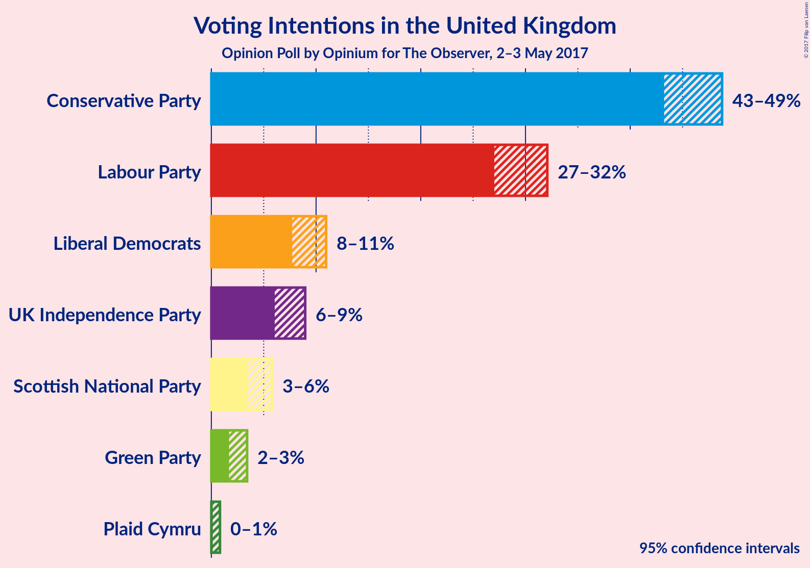
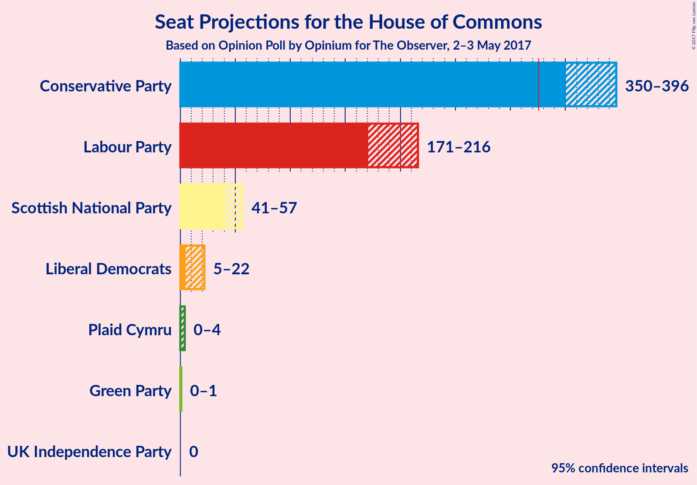
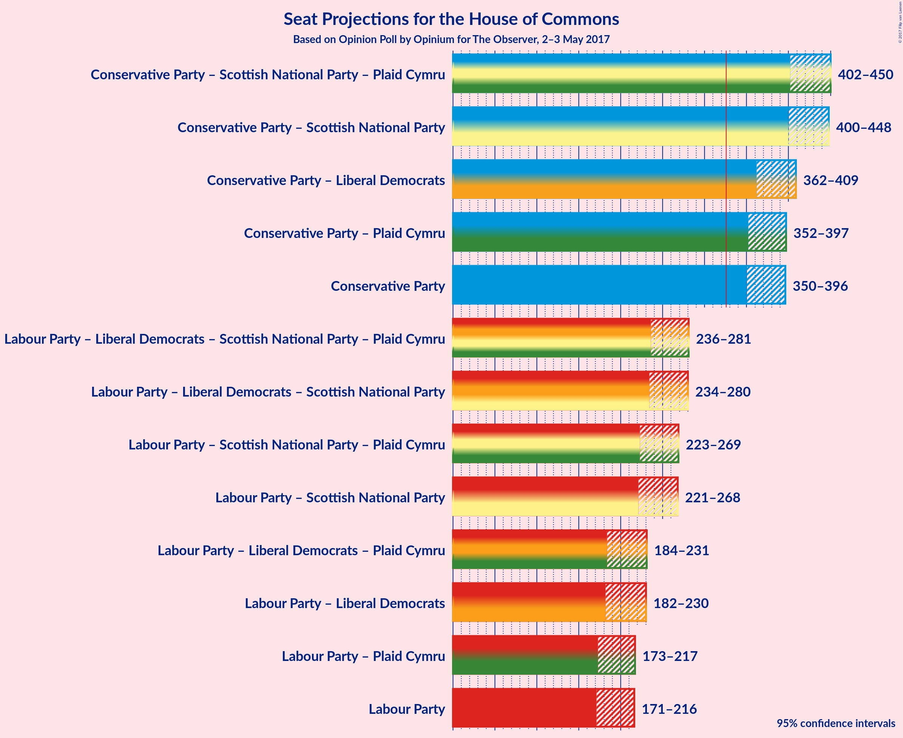

# Opinion Poll by Opinium for The Observer, 2–3 May 2017

<a href="#voting-intentions">Voting Intentions</a> | <a href="#seats">Seats</a> | <a href="#coalitions">Coalitions</a> | <a href="#technical-information">Technical Information</a>

## Voting Intentions

### Confidence Intervals

| Party | Last Result | Poll Result | 80% Confidence Interval | 90% Confidence Interval | 95% Confidence Interval | 99% Confidence Interval |
|:-----:|:-----------:|:-----------:|:-----------------------:|:-----------------------:|:-----------------------:|:-----------------------:|
| Conservative Party | 36.9% | 46.3% | 44.2–47.8% |43.7–48.3% |43.2–48.8% |42.4–49.6% |
| Labour Party | 30.4% | 29.7% | 27.9–31.2% |27.4–31.7% |27.0–32.1% |26.3–32.9% |
| Liberal Democrats | 7.9% | 9.3% | 8.2–10.3% |8.0–10.7% |7.7–11.0% |7.3–11.5% |
| UK Independence Party | 12.6% | 7.4% | 6.5–8.4% |6.2–8.7% |6.1–9.0% |5.7–9.5% |
| Scottish National Party | 4.7% | 4.5% | 3.8–5.3% |3.6–5.6% |3.5–5.8% |3.2–6.2% |
| Green Party | 3.8% | 2.4% | 1.9–3.1% |1.8–3.2% |1.7–3.4% |1.5–3.8% |
| Plaid Cymru | 0.6% | 0.3% | 0.2–0.6% |0.2–0.7% |0.1–0.8% |0.1–1.0% |

*Note:* The poll result column reflects the actual value used in the calculations. Published results may vary slightly, and in addition be rounded to fewer digits.

## Seats

### Confidence Intervals

| Party | Last Result | Median | 80% Confidence Interval | 90% Confidence Interval | 95% Confidence Interval | 99% Confidence Interval |
|:-----:|:-----------:|:------:|:-----------------------:|:-----------------------:|:-----------------------:|:-----------------------:|
| <a href="#conservative-party">Conservative Party</a> | 331 | 376 | 360–388 |353–391 |350–396 |345–406 |
| <a href="#labour-party">Labour Party</a> | 232 | 190 | 179–206 |176–213 |171–216 |161–221 |
| <a href="#liberal-democrats">Liberal Democrats</a> | 8 | 12 | 7–18 |6–20 |5–22 |4–26 |
| <a href="#uk-independence-party">UK Independence Party</a> | 1 | 0 | 0 |0 |0 |0 |
| <a href="#scottish-national-party">Scottish National Party</a> | 56 | 53 | 45–56 |43–56 |41–57 |38–58 |
| <a href="#green-party">Green Party</a> | 1 | 0 | 0–1 |0–1 |0–1 |0–1 |
| <a href="#plaid-cymru">Plaid Cymru</a> | 3 | 0 | 0–4 |0–4 |0–4 |0–5 |

### Conservative Party

| Number of Seats | Probability | Accumulated |
|:---------------:|:-----------:|:-----------:|
| 337 | 0% | 100% |
| 338 | 0% | 99.9% |
| 339 | 0% | 99.9% |
| 340 | 0% | 99.9% |
| 341 | 0.1% | 99.9% |
| 342 | 0.1% | 99.8% |
| 343 | 0.1% | 99.7% |
| 344 | 0.1% | 99.6% |
| 345 | 0.1% | 99.5% |
| 346 | 0.3% | 99.4% |
| 347 | 0.4% | 99.0% |
| 348 | 0.4% | 98.7% |
| 349 | 0.5% | 98% |
| 350 | 0.5% | 98% |
| 351 | 0.6% | 97% |
| 352 | 0.7% | 97% |
| 353 | 1.2% | 96% |
| 354 | 0.5% | 95% |
| 355 | 0.9% | 94% |
| 356 | 1.1% | 94% |
| 357 | 0.6% | 92% |
| 358 | 0.6% | 92% |
| 359 | 1.0% | 91% |
| 360 | 0.9% | 90% |
| 361 | 1.0% | 89% |
| 362 | 2% | 88% |
| 363 | 3% | 86% |
| 364 | 2% | 83% |
| 365 | 2% | 82% |
| 366 | 2% | 80% |
| 367 | 3% | 78% |
| 368 | 3% | 74% |
| 369 | 3% | 72% |
| 370 | 3% | 69% |
| 371 | 0.9% | 66% |
| 372 | 2% | 65% |
| 373 | 2% | 63% |
| 374 | 4% | 61% |
| 375 | 5% | 57% |
| 376 | 3% | 52% |
| 377 | 3% | 49% |
| 378 | 3% | 46% |
| 379 | 6% | 43% |
| 380 | 5% | 37% |
| 381 | 3% | 32% |
| 382 | 3% | 29% |
| 383 | 4% | 26% |
| 384 | 4% | 21% |
| 385 | 3% | 18% |
| 386 | 1.4% | 14% |
| 387 | 2% | 13% |
| 388 | 0.9% | 11% |
| 389 | 2% | 10% |
| 390 | 1.4% | 8% |
| 391 | 1.3% | 6% |
| 392 | 0.6% | 5% |
| 393 | 0.5% | 4% |
| 394 | 0.6% | 4% |
| 395 | 0.5% | 3% |
| 396 | 0.5% | 3% |
| 397 | 0.3% | 2% |
| 398 | 0.3% | 2% |
| 399 | 0.3% | 2% |
| 400 | 0.1% | 1.2% |
| 401 | 0.1% | 1.1% |
| 402 | 0.2% | 1.0% |
| 403 | 0.1% | 0.8% |
| 404 | 0.1% | 0.7% |
| 405 | 0.1% | 0.7% |
| 406 | 0.2% | 0.6% |
| 407 | 0.1% | 0.4% |
| 408 | 0.1% | 0.3% |
| 409 | 0% | 0.2% |
| 410 | 0% | 0.2% |
| 411 | 0% | 0.2% |
| 412 | 0% | 0.1% |
| 413 | 0% | 0.1% |
| 414 | 0% | 0% |

### Labour Party

| Number of Seats | Probability | Accumulated |
|:---------------:|:-----------:|:-----------:|
| 154 | 0% | 100% |
| 155 | 0% | 99.9% |
| 156 | 0% | 99.9% |
| 157 | 0.1% | 99.9% |
| 158 | 0.1% | 99.8% |
| 159 | 0.1% | 99.8% |
| 160 | 0.1% | 99.7% |
| 161 | 0.1% | 99.6% |
| 162 | 0.1% | 99.5% |
| 163 | 0.2% | 99.3% |
| 164 | 0% | 99.2% |
| 165 | 0.1% | 99.1% |
| 166 | 0.2% | 99.0% |
| 167 | 0.1% | 98.8% |
| 168 | 0.4% | 98.7% |
| 169 | 0.3% | 98% |
| 170 | 0.3% | 98% |
| 171 | 0.4% | 98% |
| 172 | 0.3% | 97% |
| 173 | 0.4% | 97% |
| 174 | 0.7% | 97% |
| 175 | 0.8% | 96% |
| 176 | 1.0% | 95% |
| 177 | 2% | 94% |
| 178 | 2% | 92% |
| 179 | 1.0% | 90% |
| 180 | 1.1% | 89% |
| 181 | 2% | 88% |
| 182 | 4% | 87% |
| 183 | 4% | 83% |
| 184 | 5% | 79% |
| 185 | 4% | 74% |
| 186 | 4% | 70% |
| 187 | 6% | 67% |
| 188 | 5% | 60% |
| 189 | 5% | 56% |
| 190 | 3% | 51% |
| 191 | 3% | 47% |
| 192 | 2% | 44% |
| 193 | 3% | 42% |
| 194 | 2% | 39% |
| 195 | 3% | 37% |
| 196 | 2% | 33% |
| 197 | 2% | 31% |
| 198 | 2% | 29% |
| 199 | 2% | 27% |
| 200 | 3% | 25% |
| 201 | 3% | 22% |
| 202 | 3% | 19% |
| 203 | 2% | 16% |
| 204 | 2% | 14% |
| 205 | 1.4% | 12% |
| 206 | 0.7% | 11% |
| 207 | 0.9% | 10% |
| 208 | 0.5% | 9% |
| 209 | 1.0% | 8% |
| 210 | 0.9% | 7% |
| 211 | 0.7% | 7% |
| 212 | 0.4% | 6% |
| 213 | 1.2% | 5% |
| 214 | 1.0% | 4% |
| 215 | 0.5% | 3% |
| 216 | 0.6% | 3% |
| 217 | 0.4% | 2% |
| 218 | 0.3% | 2% |
| 219 | 0.4% | 1.3% |
| 220 | 0.3% | 0.9% |
| 221 | 0.2% | 0.6% |
| 222 | 0.1% | 0.5% |
| 223 | 0.1% | 0.4% |
| 224 | 0% | 0.2% |
| 225 | 0.1% | 0.2% |
| 226 | 0% | 0.1% |
| 227 | 0% | 0.1% |
| 228 | 0% | 0.1% |
| 229 | 0% | 0.1% |
| 230 | 0% | 0.1% |
| 231 | 0% | 0% |

### Liberal Democrats

| Number of Seats | Probability | Accumulated |
|:---------------:|:-----------:|:-----------:|
| 3 | 0.1% | 100% |
| 4 | 0.5% | 99.9% |
| 5 | 2% | 99.3% |
| 6 | 5% | 97% |
| 7 | 14% | 93% |
| 8 | 6% | 79% |
| 9 | 10% | 73% |
| 10 | 4% | 63% |
| 11 | 7% | 59% |
| 12 | 5% | 52% |
| 13 | 6% | 47% |
| 14 | 8% | 41% |
| 15 | 6% | 34% |
| 16 | 10% | 27% |
| 17 | 6% | 18% |
| 18 | 2% | 12% |
| 19 | 3% | 9% |
| 20 | 2% | 6% |
| 21 | 1.1% | 4% |
| 22 | 0.7% | 3% |
| 23 | 0.7% | 2% |
| 24 | 0.4% | 1.2% |
| 25 | 0.3% | 0.9% |
| 26 | 0.2% | 0.6% |
| 27 | 0.2% | 0.4% |
| 28 | 0.1% | 0.2% |
| 29 | 0% | 0.2% |
| 30 | 0.1% | 0.1% |
| 31 | 0% | 0.1% |
| 32 | 0% | 0% |

### UK Independence Party

| Number of Seats | Probability | Accumulated |
|:---------------:|:-----------:|:-----------:|
| 0 | 100% | 100% |
| 1 | 0% | 0% |

### Scottish National Party

| Number of Seats | Probability | Accumulated |
|:---------------:|:-----------:|:-----------:|
| 27 | 0% | 100% |
| 28 | 0.1% | 99.9% |
| 29 | 0% | 99.9% |
| 30 | 0% | 99.9% |
| 31 | 0% | 99.9% |
| 32 | 0% | 99.8% |
| 33 | 0% | 99.8% |
| 34 | 0.1% | 99.8% |
| 35 | 0.1% | 99.7% |
| 36 | 0% | 99.7% |
| 37 | 0.1% | 99.6% |
| 38 | 0.1% | 99.6% |
| 39 | 0.7% | 99.5% |
| 40 | 1.1% | 98.8% |
| 41 | 0.8% | 98% |
| 42 | 1.0% | 97% |
| 43 | 1.2% | 96% |
| 44 | 3% | 95% |
| 45 | 3% | 92% |
| 46 | 2% | 89% |
| 47 | 4% | 87% |
| 48 | 5% | 83% |
| 49 | 4% | 77% |
| 50 | 15% | 74% |
| 51 | 3% | 58% |
| 52 | 4% | 55% |
| 53 | 10% | 51% |
| 54 | 8% | 41% |
| 55 | 19% | 33% |
| 56 | 10% | 14% |
| 57 | 2% | 3% |
| 58 | 0.8% | 1.3% |
| 59 | 0.5% | 0.5% |
| 60 | 0% | 0% |

### Green Party

| Number of Seats | Probability | Accumulated |
|:---------------:|:-----------:|:-----------:|
| 0 | 65% | 100% |
| 1 | 35% | 35% |
| 2 | 0% | 0% |

### Plaid Cymru

| Number of Seats | Probability | Accumulated |
|:---------------:|:-----------:|:-----------:|
| 0 | 53% | 100% |
| 1 | 3% | 47% |
| 2 | 1.5% | 43% |
| 3 | 27% | 42% |
| 4 | 13% | 15% |
| 5 | 1.2% | 2% |
| 6 | 0.1% | 0.4% |
| 7 | 0.3% | 0.3% |
| 8 | 0% | 0% |

## Coalitions

### Confidence Intervals

| Coalition | Last Result | Median | 80% Confidence Interval | 90% Confidence Interval | 95% Confidence Interval | 99% Confidence Interval |
|:---------:|:-----------:|:------:|:-----------------------:|:-----------------------:|:-----------------------:|:-----------------------:|
| Conservative Party – Scottish National Party – Plaid Cymru | 390 | 429 | 412–441 | 406–446 | 402–450 | 395–459 |
| Conservative Party – Scottish National Party | 387 | 428 | 410–440 | 405–444 | 400–448 | 393–458 |
| Conservative Party – Liberal Democrats | 339 | 389 | 371–401 | 366–405 | 362–409 | 357–418 |
| Conservative Party – Plaid Cymru | 334 | 378 | 362–389 | 356–393 | 352–397 | 346–407 |
| Conservative Party | 331 | 376 | 360–388 | 353–391 | 350–396 | 345–406 |
| Labour Party – Liberal Democrats – Scottish National Party – Plaid Cymru | 299 | 256 | 243–272 | 240–278 | 236–281 | 226–287 |
| Labour Party – Liberal Democrats – Scottish National Party | 296 | 254 | 242–270 | 238–276 | 234–280 | 224–285 |
| Labour Party – Scottish National Party – Plaid Cymru | 291 | 243 | 231–260 | 227–266 | 223–269 | 213–275 |
| Labour Party – Scottish National Party | 288 | 242 | 229–258 | 225–264 | 221–268 | 212–273 |
| Labour Party – Liberal Democrats – Plaid Cymru | 243 | 204 | 192–222 | 188–227 | 184–231 | 174–238 |
| Labour Party – Liberal Democrats | 240 | 203 | 190–220 | 186–226 | 182–230 | 172–237 |
| Labour Party – Plaid Cymru | 235 | 192 | 181–207 | 177–214 | 173–217 | 163–222 |
| Labour Party | 232 | 190 | 179–206 | 176–213 | 171–216 | 161–221 |

### Conservative Party – Scottish National Party – Plaid Cymru

| Number of Seats | Probability | Accumulated |
|:---------------:|:-----------:|:-----------:|
| 385 | 0% | 100% |
| 386 | 0% | 99.9% |
| 387 | 0% | 99.9% |
| 388 | 0% | 99.9% |
| 389 | 0% | 99.9% |
| 390 | 0% | 99.8% |
| 391 | 0% | 99.8% |
| 392 | 0% | 99.8% |
| 393 | 0.1% | 99.7% |
| 394 | 0.1% | 99.6% |
| 395 | 0.1% | 99.5% |
| 396 | 0.2% | 99.4% |
| 397 | 0.2% | 99.3% |
| 398 | 0.2% | 99.1% |
| 399 | 0.3% | 98.9% |
| 400 | 0.5% | 98.6% |
| 401 | 0.6% | 98% |
| 402 | 0.5% | 98% |
| 403 | 0.6% | 97% |
| 404 | 0.6% | 97% |
| 405 | 0.7% | 96% |
| 406 | 0.7% | 95% |
| 407 | 0.6% | 95% |
| 408 | 0.6% | 94% |
| 409 | 1.0% | 93% |
| 410 | 0.8% | 92% |
| 411 | 0.8% | 92% |
| 412 | 2% | 91% |
| 413 | 1.4% | 89% |
| 414 | 1.3% | 88% |
| 415 | 2% | 86% |
| 416 | 3% | 85% |
| 417 | 2% | 82% |
| 418 | 1.3% | 80% |
| 419 | 1.4% | 79% |
| 420 | 4% | 77% |
| 421 | 2% | 74% |
| 422 | 2% | 71% |
| 423 | 4% | 70% |
| 424 | 2% | 66% |
| 425 | 4% | 64% |
| 426 | 2% | 61% |
| 427 | 4% | 58% |
| 428 | 3% | 55% |
| 429 | 6% | 52% |
| 430 | 4% | 46% |
| 431 | 3% | 42% |
| 432 | 2% | 39% |
| 433 | 4% | 37% |
| 434 | 4% | 33% |
| 435 | 2% | 29% |
| 436 | 2% | 27% |
| 437 | 3% | 25% |
| 438 | 4% | 23% |
| 439 | 4% | 19% |
| 440 | 3% | 15% |
| 441 | 3% | 12% |
| 442 | 1.3% | 9% |
| 443 | 0.8% | 8% |
| 444 | 0.7% | 7% |
| 445 | 0.4% | 7% |
| 446 | 2% | 6% |
| 447 | 1.1% | 4% |
| 448 | 0.3% | 3% |
| 449 | 0.2% | 3% |
| 450 | 0.4% | 3% |
| 451 | 0.2% | 2% |
| 452 | 0.4% | 2% |
| 453 | 0.1% | 1.5% |
| 454 | 0.1% | 1.4% |
| 455 | 0.3% | 1.2% |
| 456 | 0.2% | 1.0% |
| 457 | 0.1% | 0.8% |
| 458 | 0.1% | 0.7% |
| 459 | 0.1% | 0.5% |
| 460 | 0% | 0.5% |
| 461 | 0.2% | 0.5% |
| 462 | 0% | 0.3% |
| 463 | 0.1% | 0.2% |
| 464 | 0.1% | 0.2% |
| 465 | 0% | 0.1% |
| 466 | 0% | 0.1% |
| 467 | 0% | 0.1% |
| 468 | 0% | 0% |

### Conservative Party – Scottish National Party

| Number of Seats | Probability | Accumulated |
|:---------------:|:-----------:|:-----------:|
| 383 | 0% | 100% |
| 384 | 0% | 99.9% |
| 385 | 0% | 99.9% |
| 386 | 0% | 99.9% |
| 387 | 0% | 99.9% |
| 388 | 0% | 99.9% |
| 389 | 0% | 99.8% |
| 390 | 0% | 99.8% |
| 391 | 0.1% | 99.8% |
| 392 | 0.1% | 99.7% |
| 393 | 0.2% | 99.6% |
| 394 | 0.1% | 99.5% |
| 395 | 0.1% | 99.3% |
| 396 | 0.3% | 99.3% |
| 397 | 0.2% | 98.9% |
| 398 | 0.3% | 98.7% |
| 399 | 0.3% | 98% |
| 400 | 0.7% | 98% |
| 401 | 0.4% | 97% |
| 402 | 0.6% | 97% |
| 403 | 0.4% | 96% |
| 404 | 0.6% | 96% |
| 405 | 1.0% | 95% |
| 406 | 0.8% | 94% |
| 407 | 1.0% | 94% |
| 408 | 0.7% | 93% |
| 409 | 1.5% | 92% |
| 410 | 1.2% | 90% |
| 411 | 0.9% | 89% |
| 412 | 1.0% | 88% |
| 413 | 2% | 87% |
| 414 | 2% | 86% |
| 415 | 2% | 83% |
| 416 | 2% | 82% |
| 417 | 2% | 80% |
| 418 | 2% | 78% |
| 419 | 2% | 75% |
| 420 | 3% | 74% |
| 421 | 2% | 70% |
| 422 | 3% | 69% |
| 423 | 4% | 66% |
| 424 | 3% | 62% |
| 425 | 3% | 59% |
| 426 | 3% | 56% |
| 427 | 3% | 53% |
| 428 | 3% | 50% |
| 429 | 5% | 47% |
| 430 | 5% | 43% |
| 431 | 3% | 37% |
| 432 | 2% | 34% |
| 433 | 2% | 32% |
| 434 | 4% | 29% |
| 435 | 3% | 25% |
| 436 | 2% | 22% |
| 437 | 3% | 20% |
| 438 | 3% | 16% |
| 439 | 2% | 14% |
| 440 | 3% | 12% |
| 441 | 1.3% | 9% |
| 442 | 1.3% | 8% |
| 443 | 1.3% | 6% |
| 444 | 0.7% | 5% |
| 445 | 0.7% | 4% |
| 446 | 0.5% | 4% |
| 447 | 0.7% | 3% |
| 448 | 0.4% | 3% |
| 449 | 0.2% | 2% |
| 450 | 0.4% | 2% |
| 451 | 0.1% | 2% |
| 452 | 0.4% | 1.5% |
| 453 | 0.1% | 1.1% |
| 454 | 0.1% | 1.0% |
| 455 | 0.1% | 0.9% |
| 456 | 0.1% | 0.8% |
| 457 | 0.1% | 0.6% |
| 458 | 0.1% | 0.6% |
| 459 | 0% | 0.4% |
| 460 | 0.1% | 0.4% |
| 461 | 0% | 0.3% |
| 462 | 0.1% | 0.2% |
| 463 | 0% | 0.1% |
| 464 | 0% | 0.1% |
| 465 | 0% | 0.1% |
| 466 | 0% | 0.1% |
| 467 | 0% | 0% |

### Conservative Party – Liberal Democrats

| Number of Seats | Probability | Accumulated |
|:---------------:|:-----------:|:-----------:|
| 350 | 0% | 100% |
| 351 | 0% | 99.9% |
| 352 | 0% | 99.9% |
| 353 | 0% | 99.9% |
| 354 | 0.1% | 99.9% |
| 355 | 0.1% | 99.8% |
| 356 | 0.2% | 99.7% |
| 357 | 0.1% | 99.5% |
| 358 | 0.2% | 99.4% |
| 359 | 0.3% | 99.1% |
| 360 | 0.5% | 98.9% |
| 361 | 0.6% | 98% |
| 362 | 0.5% | 98% |
| 363 | 0.5% | 97% |
| 364 | 0.9% | 97% |
| 365 | 0.5% | 96% |
| 366 | 0.5% | 95% |
| 367 | 0.5% | 95% |
| 368 | 0.9% | 94% |
| 369 | 1.4% | 93% |
| 370 | 1.0% | 92% |
| 371 | 1.0% | 91% |
| 372 | 1.5% | 90% |
| 373 | 0.9% | 88% |
| 374 | 2% | 88% |
| 375 | 1.3% | 85% |
| 376 | 3% | 84% |
| 377 | 2% | 81% |
| 378 | 2% | 79% |
| 379 | 1.5% | 77% |
| 380 | 3% | 75% |
| 381 | 3% | 73% |
| 382 | 3% | 70% |
| 383 | 3% | 67% |
| 384 | 2% | 64% |
| 385 | 3% | 62% |
| 386 | 4% | 59% |
| 387 | 3% | 56% |
| 388 | 2% | 53% |
| 389 | 5% | 51% |
| 390 | 5% | 46% |
| 391 | 5% | 41% |
| 392 | 5% | 36% |
| 393 | 3% | 31% |
| 394 | 2% | 29% |
| 395 | 5% | 26% |
| 396 | 1.1% | 22% |
| 397 | 3% | 21% |
| 398 | 2% | 18% |
| 399 | 3% | 15% |
| 400 | 2% | 12% |
| 401 | 1.5% | 11% |
| 402 | 2% | 9% |
| 403 | 0.8% | 7% |
| 404 | 0.8% | 7% |
| 405 | 0.9% | 6% |
| 406 | 1.0% | 5% |
| 407 | 0.6% | 4% |
| 408 | 0.7% | 3% |
| 409 | 0.2% | 3% |
| 410 | 0.5% | 2% |
| 411 | 0.3% | 2% |
| 412 | 0.2% | 2% |
| 413 | 0.1% | 1.4% |
| 414 | 0.3% | 1.3% |
| 415 | 0.2% | 1.0% |
| 416 | 0.1% | 0.8% |
| 417 | 0.1% | 0.7% |
| 418 | 0.1% | 0.6% |
| 419 | 0.1% | 0.5% |
| 420 | 0.1% | 0.4% |
| 421 | 0% | 0.3% |
| 422 | 0% | 0.3% |
| 423 | 0% | 0.2% |
| 424 | 0% | 0.2% |
| 425 | 0.1% | 0.2% |
| 426 | 0% | 0.1% |
| 427 | 0% | 0.1% |
| 428 | 0% | 0.1% |
| 429 | 0% | 0% |

### Conservative Party – Plaid Cymru

| Number of Seats | Probability | Accumulated |
|:---------------:|:-----------:|:-----------:|
| 339 | 0% | 100% |
| 340 | 0% | 99.9% |
| 341 | 0.1% | 99.9% |
| 342 | 0% | 99.9% |
| 343 | 0% | 99.8% |
| 344 | 0.1% | 99.8% |
| 345 | 0.1% | 99.7% |
| 346 | 0.1% | 99.6% |
| 347 | 0.4% | 99.4% |
| 348 | 0.3% | 99.1% |
| 349 | 0.4% | 98.8% |
| 350 | 0.2% | 98% |
| 351 | 0.5% | 98% |
| 352 | 0.5% | 98% |
| 353 | 0.9% | 97% |
| 354 | 0.7% | 96% |
| 355 | 0.4% | 96% |
| 356 | 2% | 95% |
| 357 | 0.7% | 94% |
| 358 | 0.9% | 93% |
| 359 | 0.6% | 92% |
| 360 | 0.6% | 91% |
| 361 | 0.7% | 91% |
| 362 | 2% | 90% |
| 363 | 1.5% | 88% |
| 364 | 1.5% | 87% |
| 365 | 2% | 85% |
| 366 | 3% | 83% |
| 367 | 3% | 81% |
| 368 | 2% | 78% |
| 369 | 2% | 76% |
| 370 | 4% | 74% |
| 371 | 2% | 70% |
| 372 | 2% | 68% |
| 373 | 2% | 66% |
| 374 | 2% | 63% |
| 375 | 4% | 61% |
| 376 | 2% | 57% |
| 377 | 4% | 56% |
| 378 | 4% | 52% |
| 379 | 6% | 48% |
| 380 | 3% | 42% |
| 381 | 4% | 39% |
| 382 | 3% | 35% |
| 383 | 5% | 32% |
| 384 | 4% | 27% |
| 385 | 4% | 23% |
| 386 | 2% | 19% |
| 387 | 3% | 17% |
| 388 | 2% | 13% |
| 389 | 2% | 12% |
| 390 | 1.3% | 10% |
| 391 | 1.4% | 9% |
| 392 | 2% | 7% |
| 393 | 0.7% | 6% |
| 394 | 0.9% | 5% |
| 395 | 0.6% | 4% |
| 396 | 0.5% | 3% |
| 397 | 0.3% | 3% |
| 398 | 0.3% | 2% |
| 399 | 0.4% | 2% |
| 400 | 0.2% | 2% |
| 401 | 0.3% | 2% |
| 402 | 0.2% | 1.2% |
| 403 | 0.2% | 1.0% |
| 404 | 0.1% | 0.9% |
| 405 | 0.1% | 0.8% |
| 406 | 0.1% | 0.7% |
| 407 | 0.2% | 0.7% |
| 408 | 0.1% | 0.5% |
| 409 | 0.1% | 0.4% |
| 410 | 0.1% | 0.3% |
| 411 | 0.1% | 0.2% |
| 412 | 0% | 0.2% |
| 413 | 0.1% | 0.1% |
| 414 | 0% | 0.1% |
| 415 | 0% | 0.1% |
| 416 | 0% | 0% |

### Conservative Party

| Number of Seats | Probability | Accumulated |
|:---------------:|:-----------:|:-----------:|
| 337 | 0% | 100% |
| 338 | 0% | 99.9% |
| 339 | 0% | 99.9% |
| 340 | 0% | 99.9% |
| 341 | 0.1% | 99.9% |
| 342 | 0.1% | 99.8% |
| 343 | 0.1% | 99.7% |
| 344 | 0.1% | 99.6% |
| 345 | 0.1% | 99.5% |
| 346 | 0.3% | 99.4% |
| 347 | 0.4% | 99.0% |
| 348 | 0.4% | 98.7% |
| 349 | 0.5% | 98% |
| 350 | 0.5% | 98% |
| 351 | 0.6% | 97% |
| 352 | 0.7% | 97% |
| 353 | 1.2% | 96% |
| 354 | 0.5% | 95% |
| 355 | 0.9% | 94% |
| 356 | 1.1% | 94% |
| 357 | 0.6% | 92% |
| 358 | 0.6% | 92% |
| 359 | 1.0% | 91% |
| 360 | 0.9% | 90% |
| 361 | 1.0% | 89% |
| 362 | 2% | 88% |
| 363 | 3% | 86% |
| 364 | 2% | 83% |
| 365 | 2% | 82% |
| 366 | 2% | 80% |
| 367 | 3% | 78% |
| 368 | 3% | 74% |
| 369 | 3% | 72% |
| 370 | 3% | 69% |
| 371 | 0.9% | 66% |
| 372 | 2% | 65% |
| 373 | 2% | 63% |
| 374 | 4% | 61% |
| 375 | 5% | 57% |
| 376 | 3% | 52% |
| 377 | 3% | 49% |
| 378 | 3% | 46% |
| 379 | 6% | 43% |
| 380 | 5% | 37% |
| 381 | 3% | 32% |
| 382 | 3% | 29% |
| 383 | 4% | 26% |
| 384 | 4% | 21% |
| 385 | 3% | 18% |
| 386 | 1.4% | 14% |
| 387 | 2% | 13% |
| 388 | 0.9% | 11% |
| 389 | 2% | 10% |
| 390 | 1.4% | 8% |
| 391 | 1.3% | 6% |
| 392 | 0.6% | 5% |
| 393 | 0.5% | 4% |
| 394 | 0.6% | 4% |
| 395 | 0.5% | 3% |
| 396 | 0.5% | 3% |
| 397 | 0.3% | 2% |
| 398 | 0.3% | 2% |
| 399 | 0.3% | 2% |
| 400 | 0.1% | 1.2% |
| 401 | 0.1% | 1.1% |
| 402 | 0.2% | 1.0% |
| 403 | 0.1% | 0.8% |
| 404 | 0.1% | 0.7% |
| 405 | 0.1% | 0.7% |
| 406 | 0.2% | 0.6% |
| 407 | 0.1% | 0.4% |
| 408 | 0.1% | 0.3% |
| 409 | 0% | 0.2% |
| 410 | 0% | 0.2% |
| 411 | 0% | 0.2% |
| 412 | 0% | 0.1% |
| 413 | 0% | 0.1% |
| 414 | 0% | 0% |

### Labour Party – Liberal Democrats – Scottish National Party – Plaid Cymru

| Number of Seats | Probability | Accumulated |
|:---------------:|:-----------:|:-----------:|
| 219 | 0% | 100% |
| 220 | 0.1% | 99.9% |
| 221 | 0% | 99.9% |
| 222 | 0% | 99.8% |
| 223 | 0% | 99.8% |
| 224 | 0.1% | 99.8% |
| 225 | 0.1% | 99.7% |
| 226 | 0.2% | 99.6% |
| 227 | 0.1% | 99.4% |
| 228 | 0.1% | 99.3% |
| 229 | 0.1% | 99.2% |
| 230 | 0.2% | 99.1% |
| 231 | 0.1% | 98.9% |
| 232 | 0.3% | 98.9% |
| 233 | 0.2% | 98.6% |
| 234 | 0.3% | 98% |
| 235 | 0.3% | 98% |
| 236 | 0.6% | 98% |
| 237 | 0.6% | 97% |
| 238 | 0.6% | 97% |
| 239 | 0.5% | 96% |
| 240 | 0.5% | 96% |
| 241 | 2% | 95% |
| 242 | 1.1% | 93% |
| 243 | 2% | 92% |
| 244 | 0.9% | 90% |
| 245 | 2% | 89% |
| 246 | 2% | 87% |
| 247 | 3% | 85% |
| 248 | 5% | 82% |
| 249 | 2% | 76% |
| 250 | 4% | 74% |
| 251 | 3% | 69% |
| 252 | 5% | 67% |
| 253 | 6% | 61% |
| 254 | 2% | 55% |
| 255 | 3% | 53% |
| 256 | 4% | 50% |
| 257 | 5% | 46% |
| 258 | 3% | 42% |
| 259 | 2% | 39% |
| 260 | 1.3% | 36% |
| 261 | 2% | 35% |
| 262 | 3% | 33% |
| 263 | 3% | 30% |
| 264 | 3% | 27% |
| 265 | 2% | 24% |
| 266 | 3% | 22% |
| 267 | 2% | 19% |
| 268 | 2% | 17% |
| 269 | 3% | 15% |
| 270 | 1.4% | 13% |
| 271 | 0.8% | 11% |
| 272 | 0.8% | 10% |
| 273 | 0.9% | 10% |
| 274 | 0.7% | 9% |
| 275 | 0.5% | 8% |
| 276 | 1.4% | 7% |
| 277 | 0.8% | 6% |
| 278 | 0.4% | 5% |
| 279 | 1.2% | 5% |
| 280 | 0.8% | 4% |
| 281 | 0.5% | 3% |
| 282 | 0.4% | 2% |
| 283 | 0.5% | 2% |
| 284 | 0.4% | 2% |
| 285 | 0.4% | 1.2% |
| 286 | 0.2% | 0.8% |
| 287 | 0.1% | 0.5% |
| 288 | 0.1% | 0.4% |
| 289 | 0.1% | 0.3% |
| 290 | 0% | 0.2% |
| 291 | 0.1% | 0.2% |
| 292 | 0% | 0.1% |
| 293 | 0% | 0.1% |
| 294 | 0% | 0.1% |
| 295 | 0% | 0.1% |
| 296 | 0% | 0% |

### Labour Party – Liberal Democrats – Scottish National Party

| Number of Seats | Probability | Accumulated |
|:---------------:|:-----------:|:-----------:|
| 217 | 0% | 100% |
| 218 | 0% | 99.9% |
| 219 | 0% | 99.9% |
| 220 | 0% | 99.9% |
| 221 | 0.1% | 99.8% |
| 222 | 0.1% | 99.8% |
| 223 | 0.1% | 99.7% |
| 224 | 0.1% | 99.6% |
| 225 | 0.2% | 99.5% |
| 226 | 0.1% | 99.3% |
| 227 | 0.1% | 99.3% |
| 228 | 0.1% | 99.2% |
| 229 | 0.2% | 99.1% |
| 230 | 0.2% | 98.9% |
| 231 | 0.3% | 98.7% |
| 232 | 0.3% | 98% |
| 233 | 0.3% | 98% |
| 234 | 0.3% | 98% |
| 235 | 0.3% | 97% |
| 236 | 0.5% | 97% |
| 237 | 0.8% | 97% |
| 238 | 1.0% | 96% |
| 239 | 0.5% | 95% |
| 240 | 2% | 94% |
| 241 | 1.4% | 92% |
| 242 | 1.2% | 91% |
| 243 | 2% | 90% |
| 244 | 1.4% | 88% |
| 245 | 4% | 86% |
| 246 | 2% | 83% |
| 247 | 5% | 80% |
| 248 | 5% | 75% |
| 249 | 5% | 71% |
| 250 | 4% | 66% |
| 251 | 3% | 63% |
| 252 | 3% | 60% |
| 253 | 6% | 57% |
| 254 | 3% | 50% |
| 255 | 3% | 47% |
| 256 | 2% | 44% |
| 257 | 4% | 42% |
| 258 | 2% | 38% |
| 259 | 3% | 36% |
| 260 | 2% | 33% |
| 261 | 2% | 31% |
| 262 | 4% | 29% |
| 263 | 2% | 25% |
| 264 | 2% | 23% |
| 265 | 3% | 21% |
| 266 | 3% | 18% |
| 267 | 2% | 15% |
| 268 | 1.1% | 14% |
| 269 | 1.3% | 13% |
| 270 | 2% | 11% |
| 271 | 0.8% | 10% |
| 272 | 0.7% | 9% |
| 273 | 0.8% | 8% |
| 274 | 0.8% | 7% |
| 275 | 0.6% | 7% |
| 276 | 1.4% | 6% |
| 277 | 0.6% | 5% |
| 278 | 0.4% | 4% |
| 279 | 0.9% | 4% |
| 280 | 0.6% | 3% |
| 281 | 0.4% | 2% |
| 282 | 0.2% | 2% |
| 283 | 0.5% | 2% |
| 284 | 0.3% | 1.1% |
| 285 | 0.2% | 0.7% |
| 286 | 0.1% | 0.5% |
| 287 | 0.1% | 0.4% |
| 288 | 0.1% | 0.3% |
| 289 | 0.1% | 0.2% |
| 290 | 0% | 0.2% |
| 291 | 0.1% | 0.1% |
| 292 | 0% | 0.1% |
| 293 | 0% | 0.1% |
| 294 | 0% | 0% |

### Labour Party – Scottish National Party – Plaid Cymru

| Number of Seats | Probability | Accumulated |
|:---------------:|:-----------:|:-----------:|
| 203 | 0% | 100% |
| 204 | 0% | 99.9% |
| 205 | 0% | 99.9% |
| 206 | 0% | 99.9% |
| 207 | 0.1% | 99.9% |
| 208 | 0% | 99.8% |
| 209 | 0% | 99.8% |
| 210 | 0% | 99.7% |
| 211 | 0% | 99.7% |
| 212 | 0.1% | 99.7% |
| 213 | 0.1% | 99.6% |
| 214 | 0.1% | 99.5% |
| 215 | 0.1% | 99.4% |
| 216 | 0.2% | 99.3% |
| 217 | 0.3% | 99.1% |
| 218 | 0.2% | 98.9% |
| 219 | 0.1% | 98.7% |
| 220 | 0.2% | 98.6% |
| 221 | 0.4% | 98% |
| 222 | 0.3% | 98% |
| 223 | 0.2% | 98% |
| 224 | 0.8% | 97% |
| 225 | 1.2% | 97% |
| 226 | 0.4% | 95% |
| 227 | 1.0% | 95% |
| 228 | 0.8% | 94% |
| 229 | 1.1% | 93% |
| 230 | 2% | 92% |
| 231 | 2% | 91% |
| 232 | 2% | 89% |
| 233 | 3% | 87% |
| 234 | 3% | 84% |
| 235 | 2% | 81% |
| 236 | 1.5% | 79% |
| 237 | 4% | 78% |
| 238 | 2% | 73% |
| 239 | 4% | 71% |
| 240 | 5% | 67% |
| 241 | 4% | 62% |
| 242 | 4% | 57% |
| 243 | 5% | 54% |
| 244 | 3% | 49% |
| 245 | 3% | 46% |
| 246 | 3% | 43% |
| 247 | 4% | 40% |
| 248 | 2% | 37% |
| 249 | 3% | 35% |
| 250 | 4% | 32% |
| 251 | 2% | 28% |
| 252 | 3% | 26% |
| 253 | 2% | 24% |
| 254 | 3% | 22% |
| 255 | 0.7% | 19% |
| 256 | 3% | 19% |
| 257 | 2% | 16% |
| 258 | 2% | 14% |
| 259 | 1.2% | 12% |
| 260 | 1.3% | 11% |
| 261 | 1.2% | 9% |
| 262 | 0.7% | 8% |
| 263 | 1.2% | 8% |
| 264 | 1.0% | 6% |
| 265 | 0.3% | 5% |
| 266 | 0.7% | 5% |
| 267 | 0.5% | 4% |
| 268 | 0.7% | 4% |
| 269 | 0.6% | 3% |
| 270 | 0.4% | 2% |
| 271 | 0.6% | 2% |
| 272 | 0.5% | 1.5% |
| 273 | 0.3% | 1.0% |
| 274 | 0.1% | 0.7% |
| 275 | 0.1% | 0.6% |
| 276 | 0.2% | 0.4% |
| 277 | 0.1% | 0.3% |
| 278 | 0% | 0.2% |
| 279 | 0% | 0.1% |
| 280 | 0% | 0.1% |
| 281 | 0% | 0.1% |
| 282 | 0% | 0% |

### Labour Party – Scottish National Party

| Number of Seats | Probability | Accumulated |
|:---------------:|:-----------:|:-----------:|
| 202 | 0% | 100% |
| 203 | 0% | 99.9% |
| 204 | 0% | 99.9% |
| 205 | 0% | 99.9% |
| 206 | 0% | 99.9% |
| 207 | 0% | 99.8% |
| 208 | 0% | 99.8% |
| 209 | 0% | 99.7% |
| 210 | 0.1% | 99.7% |
| 211 | 0.1% | 99.6% |
| 212 | 0.2% | 99.6% |
| 213 | 0.1% | 99.4% |
| 214 | 0.1% | 99.3% |
| 215 | 0.1% | 99.1% |
| 216 | 0.1% | 99.1% |
| 217 | 0.4% | 98.9% |
| 218 | 0.2% | 98.6% |
| 219 | 0.3% | 98% |
| 220 | 0.3% | 98% |
| 221 | 0.4% | 98% |
| 222 | 0.5% | 97% |
| 223 | 0.5% | 97% |
| 224 | 1.1% | 96% |
| 225 | 1.0% | 95% |
| 226 | 0.5% | 94% |
| 227 | 1.2% | 94% |
| 228 | 1.2% | 93% |
| 229 | 2% | 92% |
| 230 | 2% | 90% |
| 231 | 2% | 88% |
| 232 | 3% | 86% |
| 233 | 2% | 83% |
| 234 | 3% | 81% |
| 235 | 2% | 78% |
| 236 | 3% | 76% |
| 237 | 6% | 73% |
| 238 | 3% | 67% |
| 239 | 5% | 64% |
| 240 | 4% | 59% |
| 241 | 4% | 55% |
| 242 | 3% | 52% |
| 243 | 5% | 49% |
| 244 | 4% | 44% |
| 245 | 2% | 41% |
| 246 | 4% | 39% |
| 247 | 3% | 35% |
| 248 | 1.1% | 32% |
| 249 | 2% | 30% |
| 250 | 3% | 28% |
| 251 | 2% | 25% |
| 252 | 2% | 23% |
| 253 | 2% | 21% |
| 254 | 2% | 19% |
| 255 | 2% | 17% |
| 256 | 2% | 15% |
| 257 | 1.5% | 13% |
| 258 | 2% | 12% |
| 259 | 0.9% | 10% |
| 260 | 1.0% | 9% |
| 261 | 0.8% | 8% |
| 262 | 0.3% | 7% |
| 263 | 1.0% | 7% |
| 264 | 0.8% | 6% |
| 265 | 0.7% | 5% |
| 266 | 0.8% | 4% |
| 267 | 0.4% | 3% |
| 268 | 0.7% | 3% |
| 269 | 0.6% | 2% |
| 270 | 0.2% | 2% |
| 271 | 0.2% | 1.4% |
| 272 | 0.5% | 1.1% |
| 273 | 0.2% | 0.7% |
| 274 | 0.2% | 0.5% |
| 275 | 0.1% | 0.3% |
| 276 | 0.1% | 0.2% |
| 277 | 0% | 0.2% |
| 278 | 0% | 0.1% |
| 279 | 0% | 0.1% |
| 280 | 0% | 0.1% |
| 281 | 0% | 0% |

### Labour Party – Liberal Democrats – Plaid Cymru

| Number of Seats | Probability | Accumulated |
|:---------------:|:-----------:|:-----------:|
| 166 | 0% | 100% |
| 167 | 0% | 99.9% |
| 168 | 0% | 99.9% |
| 169 | 0% | 99.9% |
| 170 | 0.1% | 99.8% |
| 171 | 0% | 99.8% |
| 172 | 0.1% | 99.7% |
| 173 | 0% | 99.6% |
| 174 | 0.1% | 99.5% |
| 175 | 0.1% | 99.4% |
| 176 | 0.2% | 99.3% |
| 177 | 0.1% | 99.2% |
| 178 | 0.1% | 99.1% |
| 179 | 0.1% | 99.0% |
| 180 | 0.5% | 98.9% |
| 181 | 0.1% | 98% |
| 182 | 0.3% | 98% |
| 183 | 0.3% | 98% |
| 184 | 0.3% | 98% |
| 185 | 0.9% | 97% |
| 186 | 0.2% | 96% |
| 187 | 1.0% | 96% |
| 188 | 0.5% | 95% |
| 189 | 1.3% | 95% |
| 190 | 2% | 93% |
| 191 | 1.2% | 92% |
| 192 | 3% | 91% |
| 193 | 2% | 87% |
| 194 | 2% | 85% |
| 195 | 3% | 83% |
| 196 | 2% | 80% |
| 197 | 4% | 78% |
| 198 | 4% | 74% |
| 199 | 3% | 70% |
| 200 | 3% | 67% |
| 201 | 4% | 64% |
| 202 | 4% | 60% |
| 203 | 4% | 56% |
| 204 | 3% | 52% |
| 205 | 3% | 49% |
| 206 | 3% | 46% |
| 207 | 2% | 43% |
| 208 | 4% | 41% |
| 209 | 4% | 37% |
| 210 | 2% | 33% |
| 211 | 2% | 30% |
| 212 | 3% | 28% |
| 213 | 2% | 25% |
| 214 | 2% | 24% |
| 215 | 1.3% | 21% |
| 216 | 2% | 20% |
| 217 | 2% | 18% |
| 218 | 3% | 16% |
| 219 | 1.2% | 13% |
| 220 | 1.0% | 12% |
| 221 | 0.9% | 11% |
| 222 | 1.3% | 10% |
| 223 | 1.1% | 9% |
| 224 | 1.0% | 8% |
| 225 | 0.5% | 7% |
| 226 | 1.0% | 6% |
| 227 | 1.0% | 5% |
| 228 | 0.5% | 4% |
| 229 | 0.4% | 4% |
| 230 | 0.4% | 3% |
| 231 | 0.5% | 3% |
| 232 | 0.6% | 2% |
| 233 | 0.3% | 2% |
| 234 | 0.3% | 1.5% |
| 235 | 0.2% | 1.2% |
| 236 | 0.3% | 1.0% |
| 237 | 0% | 0.7% |
| 238 | 0.2% | 0.6% |
| 239 | 0.1% | 0.5% |
| 240 | 0.1% | 0.3% |
| 241 | 0.1% | 0.3% |
| 242 | 0% | 0.2% |
| 243 | 0% | 0.2% |
| 244 | 0% | 0.2% |
| 245 | 0% | 0.1% |
| 246 | 0% | 0.1% |
| 247 | 0% | 0.1% |
| 248 | 0% | 0.1% |
| 249 | 0% | 0% |

### Labour Party – Liberal Democrats

| Number of Seats | Probability | Accumulated |
|:---------------:|:-----------:|:-----------:|
| 165 | 0% | 100% |
| 166 | 0% | 99.9% |
| 167 | 0% | 99.9% |
| 168 | 0.1% | 99.9% |
| 169 | 0.1% | 99.8% |
| 170 | 0.1% | 99.7% |
| 171 | 0.2% | 99.7% |
| 172 | 0% | 99.5% |
| 173 | 0.1% | 99.5% |
| 174 | 0.1% | 99.4% |
| 175 | 0.2% | 99.3% |
| 176 | 0.1% | 99.1% |
| 177 | 0.3% | 99.0% |
| 178 | 0.1% | 98.7% |
| 179 | 0.1% | 98.6% |
| 180 | 0.5% | 98.5% |
| 181 | 0.2% | 98% |
| 182 | 0.4% | 98% |
| 183 | 0.3% | 97% |
| 184 | 0.5% | 97% |
| 185 | 1.1% | 97% |
| 186 | 2% | 96% |
| 187 | 0.7% | 94% |
| 188 | 0.6% | 93% |
| 189 | 0.7% | 92% |
| 190 | 2% | 92% |
| 191 | 3% | 90% |
| 192 | 4% | 87% |
| 193 | 4% | 84% |
| 194 | 3% | 80% |
| 195 | 3% | 77% |
| 196 | 2% | 74% |
| 197 | 3% | 72% |
| 198 | 4% | 69% |
| 199 | 3% | 65% |
| 200 | 3% | 62% |
| 201 | 2% | 59% |
| 202 | 4% | 57% |
| 203 | 5% | 53% |
| 204 | 3% | 47% |
| 205 | 4% | 44% |
| 206 | 3% | 41% |
| 207 | 3% | 38% |
| 208 | 2% | 35% |
| 209 | 3% | 33% |
| 210 | 2% | 30% |
| 211 | 2% | 27% |
| 212 | 3% | 25% |
| 213 | 0.9% | 22% |
| 214 | 1.3% | 21% |
| 215 | 2% | 20% |
| 216 | 3% | 17% |
| 217 | 2% | 15% |
| 218 | 1.2% | 13% |
| 219 | 1.3% | 11% |
| 220 | 1.2% | 10% |
| 221 | 0.9% | 9% |
| 222 | 0.8% | 8% |
| 223 | 1.1% | 7% |
| 224 | 0.7% | 6% |
| 225 | 0.3% | 6% |
| 226 | 0.7% | 5% |
| 227 | 1.0% | 5% |
| 228 | 0.4% | 4% |
| 229 | 0.6% | 3% |
| 230 | 0.5% | 3% |
| 231 | 0.6% | 2% |
| 232 | 0.3% | 2% |
| 233 | 0.2% | 1.3% |
| 234 | 0.2% | 1.0% |
| 235 | 0.1% | 0.8% |
| 236 | 0.2% | 0.7% |
| 237 | 0.1% | 0.5% |
| 238 | 0.1% | 0.4% |
| 239 | 0.1% | 0.3% |
| 240 | 0% | 0.2% |
| 241 | 0% | 0.2% |
| 242 | 0% | 0.2% |
| 243 | 0% | 0.1% |
| 244 | 0% | 0.1% |
| 245 | 0% | 0.1% |
| 246 | 0% | 0.1% |
| 247 | 0% | 0.1% |
| 248 | 0% | 0% |

### Labour Party – Plaid Cymru

| Number of Seats | Probability | Accumulated |
|:---------------:|:-----------:|:-----------:|
| 155 | 0% | 100% |
| 156 | 0% | 99.9% |
| 157 | 0.1% | 99.9% |
| 158 | 0% | 99.9% |
| 159 | 0% | 99.9% |
| 160 | 0.1% | 99.8% |
| 161 | 0.1% | 99.7% |
| 162 | 0.1% | 99.6% |
| 163 | 0.1% | 99.5% |
| 164 | 0.2% | 99.5% |
| 165 | 0.2% | 99.3% |
| 166 | 0.1% | 99.1% |
| 167 | 0.1% | 99.0% |
| 168 | 0.2% | 98.9% |
| 169 | 0.2% | 98.7% |
| 170 | 0.1% | 98% |
| 171 | 0.5% | 98% |
| 172 | 0.3% | 98% |
| 173 | 0.2% | 98% |
| 174 | 0.6% | 97% |
| 175 | 0.3% | 97% |
| 176 | 0.9% | 97% |
| 177 | 1.1% | 96% |
| 178 | 1.4% | 95% |
| 179 | 2% | 93% |
| 180 | 0.6% | 91% |
| 181 | 2% | 91% |
| 182 | 2% | 89% |
| 183 | 2% | 87% |
| 184 | 3% | 85% |
| 185 | 4% | 82% |
| 186 | 6% | 78% |
| 187 | 5% | 72% |
| 188 | 5% | 67% |
| 189 | 4% | 62% |
| 190 | 3% | 58% |
| 191 | 5% | 55% |
| 192 | 4% | 50% |
| 193 | 4% | 46% |
| 194 | 3% | 43% |
| 195 | 4% | 40% |
| 196 | 1.5% | 36% |
| 197 | 3% | 35% |
| 198 | 2% | 32% |
| 199 | 2% | 30% |
| 200 | 2% | 28% |
| 201 | 3% | 26% |
| 202 | 3% | 23% |
| 203 | 2% | 20% |
| 204 | 3% | 18% |
| 205 | 2% | 15% |
| 206 | 2% | 13% |
| 207 | 1.4% | 11% |
| 208 | 0.6% | 10% |
| 209 | 0.4% | 9% |
| 210 | 0.4% | 9% |
| 211 | 0.7% | 8% |
| 212 | 0.8% | 7% |
| 213 | 1.1% | 7% |
| 214 | 0.9% | 5% |
| 215 | 0.6% | 5% |
| 216 | 1.0% | 4% |
| 217 | 0.8% | 3% |
| 218 | 0.2% | 2% |
| 219 | 0.5% | 2% |
| 220 | 0.5% | 1.4% |
| 221 | 0.3% | 1.0% |
| 222 | 0.2% | 0.6% |
| 223 | 0.2% | 0.5% |
| 224 | 0% | 0.3% |
| 225 | 0.1% | 0.3% |
| 226 | 0.1% | 0.2% |
| 227 | 0% | 0.1% |
| 228 | 0% | 0.1% |
| 229 | 0% | 0.1% |
| 230 | 0% | 0.1% |
| 231 | 0% | 0.1% |
| 232 | 0% | 0% |

### Labour Party

| Number of Seats | Probability | Accumulated |
|:---------------:|:-----------:|:-----------:|
| 154 | 0% | 100% |
| 155 | 0% | 99.9% |
| 156 | 0% | 99.9% |
| 157 | 0.1% | 99.9% |
| 158 | 0.1% | 99.8% |
| 159 | 0.1% | 99.8% |
| 160 | 0.1% | 99.7% |
| 161 | 0.1% | 99.6% |
| 162 | 0.1% | 99.5% |
| 163 | 0.2% | 99.3% |
| 164 | 0% | 99.2% |
| 165 | 0.1% | 99.1% |
| 166 | 0.2% | 99.0% |
| 167 | 0.1% | 98.8% |
| 168 | 0.4% | 98.7% |
| 169 | 0.3% | 98% |
| 170 | 0.3% | 98% |
| 171 | 0.4% | 98% |
| 172 | 0.3% | 97% |
| 173 | 0.4% | 97% |
| 174 | 0.7% | 97% |
| 175 | 0.8% | 96% |
| 176 | 1.0% | 95% |
| 177 | 2% | 94% |
| 178 | 2% | 92% |
| 179 | 1.0% | 90% |
| 180 | 1.1% | 89% |
| 181 | 2% | 88% |
| 182 | 4% | 87% |
| 183 | 4% | 83% |
| 184 | 5% | 79% |
| 185 | 4% | 74% |
| 186 | 4% | 70% |
| 187 | 6% | 67% |
| 188 | 5% | 60% |
| 189 | 5% | 56% |
| 190 | 3% | 51% |
| 191 | 3% | 47% |
| 192 | 2% | 44% |
| 193 | 3% | 42% |
| 194 | 2% | 39% |
| 195 | 3% | 37% |
| 196 | 2% | 33% |
| 197 | 2% | 31% |
| 198 | 2% | 29% |
| 199 | 2% | 27% |
| 200 | 3% | 25% |
| 201 | 3% | 22% |
| 202 | 3% | 19% |
| 203 | 2% | 16% |
| 204 | 2% | 14% |
| 205 | 1.4% | 12% |
| 206 | 0.7% | 11% |
| 207 | 0.9% | 10% |
| 208 | 0.5% | 9% |
| 209 | 1.0% | 8% |
| 210 | 0.9% | 7% |
| 211 | 0.7% | 7% |
| 212 | 0.4% | 6% |
| 213 | 1.2% | 5% |
| 214 | 1.0% | 4% |
| 215 | 0.5% | 3% |
| 216 | 0.6% | 3% |
| 217 | 0.4% | 2% |
| 218 | 0.3% | 2% |
| 219 | 0.4% | 1.3% |
| 220 | 0.3% | 0.9% |
| 221 | 0.2% | 0.6% |
| 222 | 0.1% | 0.5% |
| 223 | 0.1% | 0.4% |
| 224 | 0% | 0.2% |
| 225 | 0.1% | 0.2% |
| 226 | 0% | 0.1% |
| 227 | 0% | 0.1% |
| 228 | 0% | 0.1% |
| 229 | 0% | 0.1% |
| 230 | 0% | 0.1% |
| 231 | 0% | 0% |

## Technical Information

### Opinion Poll

+ **Pollster:** Opinium
+ **Media:** The Observer
+ **Fieldwork period:** 2–3 May 2017

### Calculations

+ **Sample size:** 1239
+ **Simulations done:** 2,097,152
+ **Error estimate:** 0.29%

