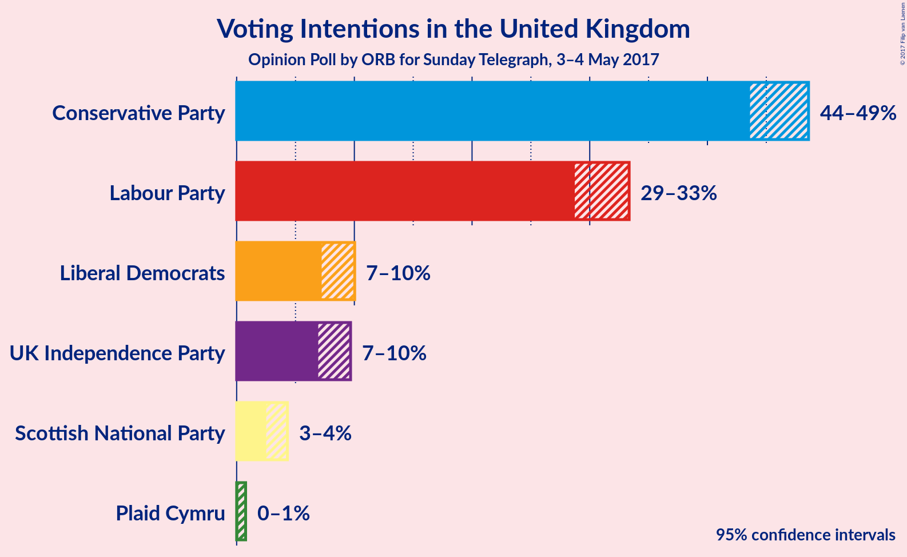
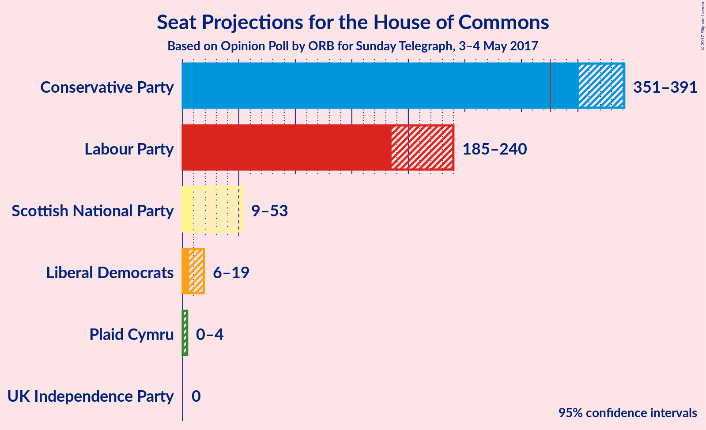
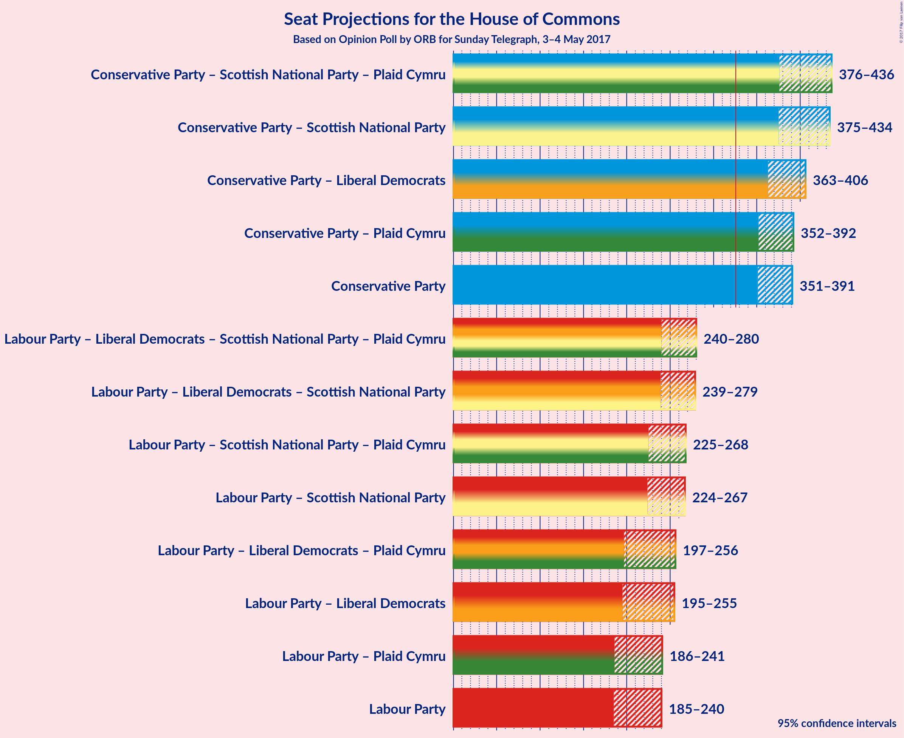

# Opinion Poll by ORB for Sunday Telegraph, 3–4 May 2017

<a href="#voting-intentions">Voting Intentions</a> | <a href="#seats">Seats</a> | <a href="#coalitions">Coalitions</a> | <a href="#technical-information">Technical Information</a>

## Voting Intentions

### Confidence Intervals

| Party | Last Result | Poll Result | 80% Confidence Interval | 90% Confidence Interval | 95% Confidence Interval | 99% Confidence Interval |
|:-----:|:-----------:|:-----------:|:-----------------------:|:-----------------------:|:-----------------------:|:-----------------------:|
| Conservative Party | 36.9% | 47.3% | 44.5–47.7% |44.0–48.2% |43.6–48.6% |42.8–49.4% |
| Labour Party | 30.4% | 31.8% | 29.5–32.5% |29.1–33.0% |28.7–33.3% |28.0–34.1% |
| Liberal Democrats | 7.9% | 8.7% | 7.7–9.5% |7.4–9.8% |7.2–10.0% |6.8–10.5% |
| UK Independence Party | 12.6% | 8.4% | 7.4–9.2% |7.1–9.4% |6.9–9.7% |6.6–10.2% |
| Scottish National Party | 4.7% | 3.4% | 2.8–4.0% |2.6–4.1% |2.5–4.3% |2.3–4.6% |
| Plaid Cymru | 0.6% | 0.3% | 0.2–0.6% |0.2–0.7% |0.1–0.8% |0.1–0.9% |

*Note:* The poll result column reflects the actual value used in the calculations. Published results may vary slightly, and in addition be rounded to fewer digits.

## Seats

### Confidence Intervals

| Party | Last Result | Median | 80% Confidence Interval | 90% Confidence Interval | 95% Confidence Interval | 99% Confidence Interval |
|:-----:|:-----------:|:------:|:-----------------------:|:-----------------------:|:-----------------------:|:-----------------------:|
| <a href="#conservative-party">Conservative Party</a> | 331 | 372 | 357–386 |354–389 |351–391 |346–397 |
| <a href="#labour-party">Labour Party</a> | 232 | 206 | 190–227 |187–234 |185–240 |179–251 |
| <a href="#liberal-democrats">Liberal Democrats</a> | 8 | 14 | 8–17 |7–17 |6–19 |4–23 |
| <a href="#uk-independence-party">UK Independence Party</a> | 1 | 0 | 0 |0 |0 |0 |
| <a href="#scottish-national-party">Scottish National Party</a> | 56 | 40 | 20–50 |13–52 |9–53 |4–55 |
| <a href="#plaid-cymru">Plaid Cymru</a> | 3 | 0 | 0–3 |0–4 |0–4 |0–5 |

### Conservative Party

| Number of Seats | Probability | Accumulated |
|:---------------:|:-----------:|:-----------:|
| 338 | 0% | 100% |
| 339 | 0% | 99.9% |
| 340 | 0% | 99.9% |
| 341 | 0% | 99.9% |
| 342 | 0% | 99.9% |
| 343 | 0.1% | 99.8% |
| 344 | 0.1% | 99.8% |
| 345 | 0.1% | 99.7% |
| 346 | 0.1% | 99.6% |
| 347 | 0.2% | 99.5% |
| 348 | 0.2% | 99.3% |
| 349 | 0.3% | 99.1% |
| 350 | 0.6% | 98.7% |
| 351 | 0.8% | 98% |
| 352 | 1.0% | 97% |
| 353 | 1.2% | 96% |
| 354 | 1.4% | 95% |
| 355 | 2% | 94% |
| 356 | 2% | 92% |
| 357 | 2% | 91% |
| 358 | 2% | 89% |
| 359 | 2% | 87% |
| 360 | 2% | 85% |
| 361 | 2% | 83% |
| 362 | 1.5% | 81% |
| 363 | 1.3% | 79% |
| 364 | 2% | 78% |
| 365 | 2% | 76% |
| 366 | 2% | 74% |
| 367 | 3% | 72% |
| 368 | 4% | 69% |
| 369 | 4% | 65% |
| 370 | 4% | 61% |
| 371 | 4% | 57% |
| 372 | 4% | 53% |
| 373 | 3% | 49% |
| 374 | 4% | 46% |
| 375 | 3% | 42% |
| 376 | 3% | 39% |
| 377 | 3% | 36% |
| 378 | 3% | 33% |
| 379 | 2% | 30% |
| 380 | 3% | 27% |
| 381 | 2% | 24% |
| 382 | 3% | 22% |
| 383 | 2% | 19% |
| 384 | 3% | 17% |
| 385 | 3% | 14% |
| 386 | 2% | 12% |
| 387 | 2% | 10% |
| 388 | 2% | 8% |
| 389 | 1.4% | 6% |
| 390 | 0.9% | 4% |
| 391 | 1.0% | 3% |
| 392 | 0.6% | 2% |
| 393 | 0.4% | 2% |
| 394 | 0.3% | 1.3% |
| 395 | 0.2% | 1.0% |
| 396 | 0.1% | 0.8% |
| 397 | 0.2% | 0.6% |
| 398 | 0.1% | 0.5% |
| 399 | 0.1% | 0.3% |
| 400 | 0.1% | 0.3% |
| 401 | 0% | 0.2% |
| 402 | 0% | 0.2% |
| 403 | 0% | 0.1% |
| 404 | 0% | 0.1% |
| 405 | 0% | 0.1% |
| 406 | 0% | 0.1% |
| 407 | 0% | 0.1% |
| 408 | 0% | 0% |

### Labour Party

| Number of Seats | Probability | Accumulated |
|:---------------:|:-----------:|:-----------:|
| 170 | 0% | 100% |
| 171 | 0% | 99.9% |
| 172 | 0% | 99.9% |
| 173 | 0% | 99.9% |
| 174 | 0% | 99.9% |
| 175 | 0% | 99.9% |
| 176 | 0% | 99.8% |
| 177 | 0.1% | 99.8% |
| 178 | 0.1% | 99.7% |
| 179 | 0.2% | 99.6% |
| 180 | 0.2% | 99.4% |
| 181 | 0.2% | 99.2% |
| 182 | 0.3% | 99.1% |
| 183 | 0.4% | 98.8% |
| 184 | 0.5% | 98% |
| 185 | 0.9% | 98% |
| 186 | 1.3% | 97% |
| 187 | 2% | 96% |
| 188 | 1.2% | 94% |
| 189 | 2% | 93% |
| 190 | 2% | 91% |
| 191 | 2% | 89% |
| 192 | 2% | 87% |
| 193 | 2% | 85% |
| 194 | 2% | 83% |
| 195 | 3% | 81% |
| 196 | 2% | 78% |
| 197 | 3% | 76% |
| 198 | 2% | 73% |
| 199 | 2% | 71% |
| 200 | 2% | 69% |
| 201 | 3% | 67% |
| 202 | 3% | 64% |
| 203 | 2% | 60% |
| 204 | 3% | 58% |
| 205 | 4% | 54% |
| 206 | 3% | 51% |
| 207 | 3% | 47% |
| 208 | 4% | 44% |
| 209 | 2% | 40% |
| 210 | 1.4% | 38% |
| 211 | 2% | 37% |
| 212 | 2% | 35% |
| 213 | 2% | 33% |
| 214 | 2% | 32% |
| 215 | 2% | 29% |
| 216 | 2% | 27% |
| 217 | 2% | 25% |
| 218 | 2% | 22% |
| 219 | 2% | 20% |
| 220 | 1.5% | 19% |
| 221 | 1.4% | 17% |
| 222 | 1.4% | 16% |
| 223 | 1.2% | 15% |
| 224 | 1.2% | 13% |
| 225 | 0.9% | 12% |
| 226 | 1.0% | 11% |
| 227 | 1.0% | 10% |
| 228 | 0.6% | 9% |
| 229 | 0.8% | 9% |
| 230 | 0.9% | 8% |
| 231 | 0.6% | 7% |
| 232 | 0.4% | 6% |
| 233 | 0.7% | 6% |
| 234 | 0.6% | 5% |
| 235 | 0.5% | 5% |
| 236 | 0.5% | 4% |
| 237 | 0.5% | 4% |
| 238 | 0.4% | 3% |
| 239 | 0.3% | 3% |
| 240 | 0.3% | 3% |
| 241 | 0.2% | 2% |
| 242 | 0.2% | 2% |
| 243 | 0.2% | 2% |
| 244 | 0.2% | 2% |
| 245 | 0.2% | 2% |
| 246 | 0.2% | 1.3% |
| 247 | 0.2% | 1.1% |
| 248 | 0.1% | 0.9% |
| 249 | 0.1% | 0.8% |
| 250 | 0.1% | 0.7% |
| 251 | 0.1% | 0.6% |
| 252 | 0.1% | 0.5% |
| 253 | 0.1% | 0.4% |
| 254 | 0.1% | 0.3% |
| 255 | 0.1% | 0.2% |
| 256 | 0% | 0.2% |
| 257 | 0% | 0.1% |
| 258 | 0% | 0.1% |
| 259 | 0% | 0.1% |
| 260 | 0% | 0.1% |
| 261 | 0% | 0% |

### Liberal Democrats

| Number of Seats | Probability | Accumulated |
|:---------------:|:-----------:|:-----------:|
| 3 | 0.1% | 100% |
| 4 | 0.4% | 99.8% |
| 5 | 1.1% | 99.4% |
| 6 | 2% | 98% |
| 7 | 4% | 96% |
| 8 | 4% | 92% |
| 9 | 4% | 88% |
| 10 | 5% | 84% |
| 11 | 8% | 79% |
| 12 | 11% | 71% |
| 13 | 10% | 60% |
| 14 | 11% | 51% |
| 15 | 17% | 40% |
| 16 | 3% | 23% |
| 17 | 16% | 20% |
| 18 | 1.4% | 5% |
| 19 | 2% | 3% |
| 20 | 0.5% | 2% |
| 21 | 0.4% | 1.0% |
| 22 | 0.1% | 0.6% |
| 23 | 0.4% | 0.5% |
| 24 | 0.1% | 0.1% |
| 25 | 0.1% | 0.1% |
| 26 | 0% | 0% |

### UK Independence Party

| Number of Seats | Probability | Accumulated |
|:---------------:|:-----------:|:-----------:|
| 0 | 100% | 100% |
| 1 | 0% | 0% |

### Scottish National Party

| Number of Seats | Probability | Accumulated |
|:---------------:|:-----------:|:-----------:|
| 2 | 0.1% | 100% |
| 3 | 0.3% | 99.9% |
| 4 | 0.6% | 99.6% |
| 5 | 0.5% | 99.0% |
| 6 | 0.3% | 98% |
| 7 | 0.4% | 98% |
| 8 | 0.1% | 98% |
| 9 | 1.2% | 98% |
| 10 | 0.1% | 96% |
| 11 | 0% | 96% |
| 12 | 0.4% | 96% |
| 13 | 1.2% | 96% |
| 14 | 0.5% | 95% |
| 15 | 0.6% | 94% |
| 16 | 1.1% | 94% |
| 17 | 0.9% | 93% |
| 18 | 0.6% | 92% |
| 19 | 0.5% | 91% |
| 20 | 0.8% | 91% |
| 21 | 1.1% | 90% |
| 22 | 2% | 89% |
| 23 | 2% | 87% |
| 24 | 1.0% | 85% |
| 25 | 1.0% | 84% |
| 26 | 2% | 83% |
| 27 | 2% | 81% |
| 28 | 2% | 80% |
| 29 | 2% | 78% |
| 30 | 1.3% | 76% |
| 31 | 1.3% | 75% |
| 32 | 0.6% | 74% |
| 33 | 0.9% | 73% |
| 34 | 0.9% | 72% |
| 35 | 2% | 71% |
| 36 | 3% | 69% |
| 37 | 4% | 66% |
| 38 | 4% | 62% |
| 39 | 7% | 59% |
| 40 | 4% | 51% |
| 41 | 7% | 48% |
| 42 | 7% | 41% |
| 43 | 4% | 33% |
| 44 | 3% | 30% |
| 45 | 4% | 26% |
| 46 | 4% | 22% |
| 47 | 3% | 18% |
| 48 | 3% | 15% |
| 49 | 2% | 13% |
| 50 | 3% | 10% |
| 51 | 2% | 8% |
| 52 | 2% | 6% |
| 53 | 2% | 4% |
| 54 | 1.0% | 2% |
| 55 | 1.0% | 1.0% |
| 56 | 0% | 0% |

### Plaid Cymru

| Number of Seats | Probability | Accumulated |
|:---------------:|:-----------:|:-----------:|
| 0 | 60% | 100% |
| 1 | 2% | 40% |
| 2 | 3% | 39% |
| 3 | 27% | 36% |
| 4 | 7% | 9% |
| 5 | 1.3% | 1.3% |
| 6 | 0% | 0.1% |
| 7 | 0.1% | 0.1% |
| 8 | 0% | 0% |

## Coalitions

### Confidence Intervals

| Coalition | Last Result | Median | 80% Confidence Interval | 90% Confidence Interval | 95% Confidence Interval | 99% Confidence Interval |
|:---------:|:-----------:|:------:|:-----------------------:|:-----------------------:|:-----------------------:|:-----------------------:|
| Conservative Party – Scottish National Party – Plaid Cymru | 390 | 412 | 389–429 | 382–432 | 376–436 | 365–441 |
| Conservative Party – Scottish National Party | 387 | 411 | 388–428 | 381–431 | 375–434 | 363–440 |
| Conservative Party – Liberal Democrats | 339 | 386 | 370–400 | 366–403 | 363–406 | 358–412 |
| Conservative Party – Plaid Cymru | 334 | 373 | 358–388 | 355–390 | 352–392 | 347–398 |
| Conservative Party | 331 | 372 | 357–386 | 354–389 | 351–391 | 346–397 |
| Labour Party – Liberal Democrats – Scottish National Party – Plaid Cymru | 299 | 259 | 245–274 | 242–277 | 240–280 | 234–285 |
| Labour Party – Liberal Democrats – Scottish National Party | 296 | 258 | 243–273 | 241–276 | 239–279 | 233–284 |
| Labour Party – Scottish National Party – Plaid Cymru | 291 | 245 | 231–261 | 228–265 | 225–268 | 219–273 |
| Labour Party – Scottish National Party | 288 | 244 | 230–260 | 227–264 | 224–267 | 218–272 |
| Labour Party – Liberal Democrats – Plaid Cymru | 243 | 220 | 203–243 | 200–250 | 197–256 | 191–268 |
| Labour Party – Liberal Democrats | 240 | 219 | 202–242 | 199–249 | 195–255 | 190–266 |
| Labour Party – Plaid Cymru | 235 | 207 | 191–228 | 188–236 | 186–241 | 180–252 |
| Labour Party | 232 | 206 | 190–227 | 187–234 | 185–240 | 179–251 |

### Conservative Party – Scottish National Party – Plaid Cymru

| Number of Seats | Probability | Accumulated |
|:---------------:|:-----------:|:-----------:|
| 355 | 0% | 100% |
| 356 | 0% | 99.9% |
| 357 | 0% | 99.9% |
| 358 | 0% | 99.9% |
| 359 | 0% | 99.9% |
| 360 | 0% | 99.8% |
| 361 | 0.1% | 99.8% |
| 362 | 0.1% | 99.7% |
| 363 | 0.1% | 99.7% |
| 364 | 0.1% | 99.6% |
| 365 | 0.1% | 99.5% |
| 366 | 0.1% | 99.4% |
| 367 | 0.1% | 99.3% |
| 368 | 0.2% | 99.2% |
| 369 | 0.2% | 99.0% |
| 370 | 0.1% | 98.8% |
| 371 | 0.2% | 98.7% |
| 372 | 0.2% | 98% |
| 373 | 0.2% | 98% |
| 374 | 0.2% | 98% |
| 375 | 0.3% | 98% |
| 376 | 0.3% | 98% |
| 377 | 0.5% | 97% |
| 378 | 0.3% | 97% |
| 379 | 0.4% | 97% |
| 380 | 0.5% | 96% |
| 381 | 0.6% | 96% |
| 382 | 0.3% | 95% |
| 383 | 0.6% | 95% |
| 384 | 0.7% | 94% |
| 385 | 0.6% | 93% |
| 386 | 0.6% | 93% |
| 387 | 0.7% | 92% |
| 388 | 0.7% | 91% |
| 389 | 0.9% | 91% |
| 390 | 0.9% | 90% |
| 391 | 1.1% | 89% |
| 392 | 0.8% | 88% |
| 393 | 0.9% | 87% |
| 394 | 0.9% | 86% |
| 395 | 1.5% | 85% |
| 396 | 1.4% | 84% |
| 397 | 1.1% | 82% |
| 398 | 2% | 81% |
| 399 | 2% | 79% |
| 400 | 2% | 78% |
| 401 | 2% | 76% |
| 402 | 2% | 74% |
| 403 | 2% | 72% |
| 404 | 2% | 70% |
| 405 | 2% | 69% |
| 406 | 2% | 67% |
| 407 | 2% | 64% |
| 408 | 3% | 62% |
| 409 | 2% | 60% |
| 410 | 3% | 58% |
| 411 | 3% | 54% |
| 412 | 2% | 51% |
| 413 | 3% | 49% |
| 414 | 3% | 46% |
| 415 | 3% | 43% |
| 416 | 2% | 41% |
| 417 | 3% | 39% |
| 418 | 3% | 36% |
| 419 | 2% | 33% |
| 420 | 3% | 31% |
| 421 | 2% | 28% |
| 422 | 2% | 25% |
| 423 | 2% | 23% |
| 424 | 2% | 21% |
| 425 | 2% | 19% |
| 426 | 2% | 16% |
| 427 | 2% | 14% |
| 428 | 2% | 12% |
| 429 | 1.2% | 10% |
| 430 | 1.4% | 9% |
| 431 | 1.5% | 8% |
| 432 | 1.2% | 6% |
| 433 | 1.0% | 5% |
| 434 | 0.9% | 4% |
| 435 | 0.6% | 3% |
| 436 | 0.7% | 3% |
| 437 | 0.4% | 2% |
| 438 | 0.4% | 1.4% |
| 439 | 0.3% | 1.0% |
| 440 | 0.2% | 0.8% |
| 441 | 0.1% | 0.5% |
| 442 | 0.1% | 0.4% |
| 443 | 0.1% | 0.3% |
| 444 | 0.1% | 0.3% |
| 445 | 0.1% | 0.2% |
| 446 | 0% | 0.1% |
| 447 | 0% | 0.1% |
| 448 | 0% | 0.1% |
| 449 | 0% | 0.1% |
| 450 | 0% | 0% |

### Conservative Party – Scottish National Party

| Number of Seats | Probability | Accumulated |
|:---------------:|:-----------:|:-----------:|
| 354 | 0% | 100% |
| 355 | 0% | 99.9% |
| 356 | 0% | 99.9% |
| 357 | 0% | 99.9% |
| 358 | 0.1% | 99.9% |
| 359 | 0% | 99.8% |
| 360 | 0% | 99.8% |
| 361 | 0.1% | 99.7% |
| 362 | 0.1% | 99.7% |
| 363 | 0.1% | 99.6% |
| 364 | 0.1% | 99.5% |
| 365 | 0.1% | 99.4% |
| 366 | 0.2% | 99.3% |
| 367 | 0.1% | 99.1% |
| 368 | 0.2% | 99.0% |
| 369 | 0.2% | 98.8% |
| 370 | 0.1% | 98.6% |
| 371 | 0.2% | 98% |
| 372 | 0.2% | 98% |
| 373 | 0.2% | 98% |
| 374 | 0.3% | 98% |
| 375 | 0.3% | 98% |
| 376 | 0.4% | 97% |
| 377 | 0.5% | 97% |
| 378 | 0.4% | 96% |
| 379 | 0.3% | 96% |
| 380 | 0.7% | 96% |
| 381 | 0.7% | 95% |
| 382 | 0.4% | 94% |
| 383 | 0.5% | 94% |
| 384 | 0.7% | 93% |
| 385 | 0.7% | 93% |
| 386 | 0.7% | 92% |
| 387 | 0.8% | 91% |
| 388 | 0.8% | 91% |
| 389 | 0.9% | 90% |
| 390 | 0.8% | 89% |
| 391 | 1.2% | 88% |
| 392 | 1.1% | 87% |
| 393 | 1.0% | 86% |
| 394 | 1.2% | 85% |
| 395 | 2% | 84% |
| 396 | 2% | 82% |
| 397 | 1.3% | 80% |
| 398 | 2% | 79% |
| 399 | 2% | 78% |
| 400 | 2% | 75% |
| 401 | 2% | 74% |
| 402 | 2% | 72% |
| 403 | 2% | 70% |
| 404 | 2% | 68% |
| 405 | 2% | 66% |
| 406 | 2% | 64% |
| 407 | 2% | 61% |
| 408 | 3% | 59% |
| 409 | 2% | 56% |
| 410 | 3% | 54% |
| 411 | 3% | 51% |
| 412 | 2% | 48% |
| 413 | 3% | 46% |
| 414 | 3% | 42% |
| 415 | 2% | 40% |
| 416 | 2% | 37% |
| 417 | 3% | 35% |
| 418 | 3% | 33% |
| 419 | 2% | 30% |
| 420 | 3% | 28% |
| 421 | 2% | 25% |
| 422 | 2% | 22% |
| 423 | 2% | 20% |
| 424 | 2% | 18% |
| 425 | 2% | 16% |
| 426 | 2% | 14% |
| 427 | 2% | 12% |
| 428 | 1.4% | 10% |
| 429 | 1.3% | 9% |
| 430 | 1.3% | 7% |
| 431 | 1.3% | 6% |
| 432 | 1.1% | 5% |
| 433 | 0.6% | 4% |
| 434 | 0.7% | 3% |
| 435 | 0.4% | 2% |
| 436 | 0.6% | 2% |
| 437 | 0.3% | 1.3% |
| 438 | 0.3% | 1.0% |
| 439 | 0.2% | 0.7% |
| 440 | 0.2% | 0.5% |
| 441 | 0.1% | 0.4% |
| 442 | 0.1% | 0.3% |
| 443 | 0.1% | 0.2% |
| 444 | 0% | 0.2% |
| 445 | 0% | 0.1% |
| 446 | 0% | 0.1% |
| 447 | 0% | 0.1% |
| 448 | 0% | 0.1% |
| 449 | 0% | 0% |

### Conservative Party – Liberal Democrats

| Number of Seats | Probability | Accumulated |
|:---------------:|:-----------:|:-----------:|
| 350 | 0% | 100% |
| 351 | 0% | 99.9% |
| 352 | 0% | 99.9% |
| 353 | 0% | 99.9% |
| 354 | 0% | 99.9% |
| 355 | 0.1% | 99.8% |
| 356 | 0.1% | 99.8% |
| 357 | 0.1% | 99.7% |
| 358 | 0.2% | 99.5% |
| 359 | 0.2% | 99.3% |
| 360 | 0.3% | 99.1% |
| 361 | 0.4% | 98.7% |
| 362 | 0.5% | 98% |
| 363 | 0.7% | 98% |
| 364 | 0.7% | 97% |
| 365 | 1.0% | 97% |
| 366 | 1.0% | 96% |
| 367 | 0.9% | 95% |
| 368 | 1.4% | 94% |
| 369 | 2% | 92% |
| 370 | 2% | 91% |
| 371 | 2% | 89% |
| 372 | 2% | 87% |
| 373 | 2% | 85% |
| 374 | 2% | 83% |
| 375 | 2% | 81% |
| 376 | 2% | 79% |
| 377 | 2% | 77% |
| 378 | 3% | 75% |
| 379 | 3% | 72% |
| 380 | 3% | 70% |
| 381 | 2% | 67% |
| 382 | 3% | 64% |
| 383 | 3% | 61% |
| 384 | 4% | 58% |
| 385 | 3% | 54% |
| 386 | 4% | 51% |
| 387 | 4% | 47% |
| 388 | 3% | 43% |
| 389 | 4% | 40% |
| 390 | 3% | 36% |
| 391 | 3% | 33% |
| 392 | 2% | 30% |
| 393 | 2% | 28% |
| 394 | 3% | 26% |
| 395 | 2% | 23% |
| 396 | 2% | 20% |
| 397 | 2% | 18% |
| 398 | 2% | 16% |
| 399 | 2% | 14% |
| 400 | 2% | 11% |
| 401 | 2% | 9% |
| 402 | 2% | 8% |
| 403 | 1.4% | 6% |
| 404 | 1.1% | 5% |
| 405 | 0.7% | 3% |
| 406 | 0.9% | 3% |
| 407 | 0.5% | 2% |
| 408 | 0.3% | 1.4% |
| 409 | 0.2% | 1.1% |
| 410 | 0.2% | 0.8% |
| 411 | 0.1% | 0.7% |
| 412 | 0.1% | 0.5% |
| 413 | 0.1% | 0.4% |
| 414 | 0.1% | 0.3% |
| 415 | 0.1% | 0.3% |
| 416 | 0% | 0.2% |
| 417 | 0% | 0.1% |
| 418 | 0% | 0.1% |
| 419 | 0% | 0.1% |
| 420 | 0% | 0.1% |
| 421 | 0% | 0.1% |
| 422 | 0% | 0% |

### Conservative Party – Plaid Cymru

| Number of Seats | Probability | Accumulated |
|:---------------:|:-----------:|:-----------:|
| 339 | 0% | 100% |
| 340 | 0% | 99.9% |
| 341 | 0% | 99.9% |
| 342 | 0% | 99.9% |
| 343 | 0% | 99.9% |
| 344 | 0.1% | 99.8% |
| 345 | 0.1% | 99.8% |
| 346 | 0.1% | 99.7% |
| 347 | 0.1% | 99.6% |
| 348 | 0.2% | 99.5% |
| 349 | 0.2% | 99.3% |
| 350 | 0.4% | 99.1% |
| 351 | 0.5% | 98.7% |
| 352 | 0.8% | 98% |
| 353 | 0.9% | 97% |
| 354 | 1.1% | 97% |
| 355 | 1.4% | 95% |
| 356 | 1.3% | 94% |
| 357 | 1.4% | 93% |
| 358 | 2% | 91% |
| 359 | 2% | 89% |
| 360 | 2% | 87% |
| 361 | 2% | 85% |
| 362 | 2% | 83% |
| 363 | 2% | 81% |
| 364 | 2% | 80% |
| 365 | 1.2% | 78% |
| 366 | 2% | 77% |
| 367 | 2% | 75% |
| 368 | 3% | 72% |
| 369 | 3% | 69% |
| 370 | 4% | 66% |
| 371 | 4% | 62% |
| 372 | 4% | 58% |
| 373 | 4% | 54% |
| 374 | 4% | 50% |
| 375 | 3% | 46% |
| 376 | 3% | 43% |
| 377 | 3% | 40% |
| 378 | 3% | 36% |
| 379 | 3% | 34% |
| 380 | 3% | 31% |
| 381 | 3% | 28% |
| 382 | 3% | 26% |
| 383 | 2% | 23% |
| 384 | 3% | 20% |
| 385 | 3% | 17% |
| 386 | 2% | 15% |
| 387 | 3% | 13% |
| 388 | 2% | 10% |
| 389 | 2% | 8% |
| 390 | 1.3% | 6% |
| 391 | 1.3% | 5% |
| 392 | 1.0% | 3% |
| 393 | 0.6% | 2% |
| 394 | 0.3% | 2% |
| 395 | 0.4% | 1.5% |
| 396 | 0.2% | 1.1% |
| 397 | 0.2% | 0.9% |
| 398 | 0.2% | 0.7% |
| 399 | 0.1% | 0.5% |
| 400 | 0.1% | 0.4% |
| 401 | 0.1% | 0.3% |
| 402 | 0.1% | 0.2% |
| 403 | 0% | 0.2% |
| 404 | 0% | 0.1% |
| 405 | 0% | 0.1% |
| 406 | 0% | 0.1% |
| 407 | 0% | 0.1% |
| 408 | 0% | 0.1% |
| 409 | 0% | 0% |

### Conservative Party

| Number of Seats | Probability | Accumulated |
|:---------------:|:-----------:|:-----------:|
| 338 | 0% | 100% |
| 339 | 0% | 99.9% |
| 340 | 0% | 99.9% |
| 341 | 0% | 99.9% |
| 342 | 0% | 99.9% |
| 343 | 0.1% | 99.8% |
| 344 | 0.1% | 99.8% |
| 345 | 0.1% | 99.7% |
| 346 | 0.1% | 99.6% |
| 347 | 0.2% | 99.5% |
| 348 | 0.2% | 99.3% |
| 349 | 0.3% | 99.1% |
| 350 | 0.6% | 98.7% |
| 351 | 0.8% | 98% |
| 352 | 1.0% | 97% |
| 353 | 1.2% | 96% |
| 354 | 1.4% | 95% |
| 355 | 2% | 94% |
| 356 | 2% | 92% |
| 357 | 2% | 91% |
| 358 | 2% | 89% |
| 359 | 2% | 87% |
| 360 | 2% | 85% |
| 361 | 2% | 83% |
| 362 | 1.5% | 81% |
| 363 | 1.3% | 79% |
| 364 | 2% | 78% |
| 365 | 2% | 76% |
| 366 | 2% | 74% |
| 367 | 3% | 72% |
| 368 | 4% | 69% |
| 369 | 4% | 65% |
| 370 | 4% | 61% |
| 371 | 4% | 57% |
| 372 | 4% | 53% |
| 373 | 3% | 49% |
| 374 | 4% | 46% |
| 375 | 3% | 42% |
| 376 | 3% | 39% |
| 377 | 3% | 36% |
| 378 | 3% | 33% |
| 379 | 2% | 30% |
| 380 | 3% | 27% |
| 381 | 2% | 24% |
| 382 | 3% | 22% |
| 383 | 2% | 19% |
| 384 | 3% | 17% |
| 385 | 3% | 14% |
| 386 | 2% | 12% |
| 387 | 2% | 10% |
| 388 | 2% | 8% |
| 389 | 1.4% | 6% |
| 390 | 0.9% | 4% |
| 391 | 1.0% | 3% |
| 392 | 0.6% | 2% |
| 393 | 0.4% | 2% |
| 394 | 0.3% | 1.3% |
| 395 | 0.2% | 1.0% |
| 396 | 0.1% | 0.8% |
| 397 | 0.2% | 0.6% |
| 398 | 0.1% | 0.5% |
| 399 | 0.1% | 0.3% |
| 400 | 0.1% | 0.3% |
| 401 | 0% | 0.2% |
| 402 | 0% | 0.2% |
| 403 | 0% | 0.1% |
| 404 | 0% | 0.1% |
| 405 | 0% | 0.1% |
| 406 | 0% | 0.1% |
| 407 | 0% | 0.1% |
| 408 | 0% | 0% |

### Labour Party – Liberal Democrats – Scottish National Party – Plaid Cymru

| Number of Seats | Probability | Accumulated |
|:---------------:|:-----------:|:-----------:|
| 224 | 0% | 100% |
| 225 | 0% | 99.9% |
| 226 | 0% | 99.9% |
| 227 | 0% | 99.9% |
| 228 | 0% | 99.9% |
| 229 | 0% | 99.9% |
| 230 | 0% | 99.8% |
| 231 | 0.1% | 99.8% |
| 232 | 0.1% | 99.7% |
| 233 | 0.1% | 99.7% |
| 234 | 0.2% | 99.5% |
| 235 | 0.1% | 99.4% |
| 236 | 0.2% | 99.2% |
| 237 | 0.3% | 99.0% |
| 238 | 0.4% | 98.7% |
| 239 | 0.6% | 98% |
| 240 | 1.0% | 98% |
| 241 | 0.9% | 97% |
| 242 | 1.4% | 96% |
| 243 | 2% | 94% |
| 244 | 2% | 92% |
| 245 | 2% | 90% |
| 246 | 3% | 88% |
| 247 | 3% | 86% |
| 248 | 2% | 83% |
| 249 | 3% | 81% |
| 250 | 2% | 78% |
| 251 | 3% | 76% |
| 252 | 2% | 73% |
| 253 | 3% | 70% |
| 254 | 3% | 67% |
| 255 | 3% | 64% |
| 256 | 3% | 61% |
| 257 | 4% | 58% |
| 258 | 3% | 54% |
| 259 | 4% | 51% |
| 260 | 4% | 47% |
| 261 | 4% | 43% |
| 262 | 4% | 39% |
| 263 | 4% | 35% |
| 264 | 3% | 31% |
| 265 | 2% | 28% |
| 266 | 2% | 26% |
| 267 | 2% | 24% |
| 268 | 1.3% | 22% |
| 269 | 1.5% | 21% |
| 270 | 2% | 19% |
| 271 | 2% | 17% |
| 272 | 2% | 15% |
| 273 | 2% | 13% |
| 274 | 2% | 11% |
| 275 | 2% | 9% |
| 276 | 2% | 8% |
| 277 | 1.4% | 6% |
| 278 | 1.2% | 5% |
| 279 | 1.0% | 4% |
| 280 | 0.8% | 3% |
| 281 | 0.6% | 2% |
| 282 | 0.3% | 1.3% |
| 283 | 0.2% | 0.9% |
| 284 | 0.2% | 0.7% |
| 285 | 0.1% | 0.5% |
| 286 | 0.1% | 0.4% |
| 287 | 0.1% | 0.3% |
| 288 | 0.1% | 0.2% |
| 289 | 0% | 0.2% |
| 290 | 0% | 0.1% |
| 291 | 0% | 0.1% |
| 292 | 0% | 0.1% |
| 293 | 0% | 0.1% |
| 294 | 0% | 0% |

### Labour Party – Liberal Democrats – Scottish National Party

| Number of Seats | Probability | Accumulated |
|:---------------:|:-----------:|:-----------:|
| 223 | 0% | 100% |
| 224 | 0% | 99.9% |
| 225 | 0% | 99.9% |
| 226 | 0% | 99.9% |
| 227 | 0% | 99.9% |
| 228 | 0% | 99.9% |
| 229 | 0.1% | 99.8% |
| 230 | 0.1% | 99.8% |
| 231 | 0.1% | 99.7% |
| 232 | 0.1% | 99.6% |
| 233 | 0.2% | 99.5% |
| 234 | 0.2% | 99.3% |
| 235 | 0.2% | 99.1% |
| 236 | 0.4% | 98.9% |
| 237 | 0.3% | 98.5% |
| 238 | 0.6% | 98% |
| 239 | 1.0% | 98% |
| 240 | 1.3% | 97% |
| 241 | 1.3% | 95% |
| 242 | 2% | 94% |
| 243 | 2% | 92% |
| 244 | 3% | 90% |
| 245 | 2% | 87% |
| 246 | 3% | 85% |
| 247 | 3% | 83% |
| 248 | 2% | 80% |
| 249 | 3% | 77% |
| 250 | 3% | 74% |
| 251 | 3% | 72% |
| 252 | 3% | 69% |
| 253 | 3% | 66% |
| 254 | 3% | 64% |
| 255 | 3% | 60% |
| 256 | 3% | 57% |
| 257 | 4% | 54% |
| 258 | 4% | 50% |
| 259 | 4% | 46% |
| 260 | 4% | 42% |
| 261 | 4% | 38% |
| 262 | 3% | 34% |
| 263 | 3% | 31% |
| 264 | 2% | 28% |
| 265 | 2% | 25% |
| 266 | 1.2% | 23% |
| 267 | 2% | 22% |
| 268 | 2% | 20% |
| 269 | 2% | 19% |
| 270 | 2% | 17% |
| 271 | 2% | 15% |
| 272 | 2% | 13% |
| 273 | 2% | 11% |
| 274 | 1.4% | 9% |
| 275 | 1.3% | 7% |
| 276 | 1.4% | 6% |
| 277 | 1.1% | 5% |
| 278 | 0.9% | 3% |
| 279 | 0.8% | 3% |
| 280 | 0.5% | 2% |
| 281 | 0.4% | 1.3% |
| 282 | 0.2% | 0.9% |
| 283 | 0.2% | 0.7% |
| 284 | 0.1% | 0.5% |
| 285 | 0.1% | 0.4% |
| 286 | 0.1% | 0.3% |
| 287 | 0.1% | 0.2% |
| 288 | 0% | 0.2% |
| 289 | 0% | 0.1% |
| 290 | 0% | 0.1% |
| 291 | 0% | 0.1% |
| 292 | 0% | 0.1% |
| 293 | 0% | 0% |

### Labour Party – Scottish National Party – Plaid Cymru

| Number of Seats | Probability | Accumulated |
|:---------------:|:-----------:|:-----------:|
| 210 | 0% | 100% |
| 211 | 0% | 99.9% |
| 212 | 0% | 99.9% |
| 213 | 0% | 99.9% |
| 214 | 0% | 99.9% |
| 215 | 0% | 99.9% |
| 216 | 0.1% | 99.8% |
| 217 | 0.1% | 99.7% |
| 218 | 0.1% | 99.7% |
| 219 | 0.1% | 99.6% |
| 220 | 0.1% | 99.5% |
| 221 | 0.2% | 99.3% |
| 222 | 0.2% | 99.2% |
| 223 | 0.3% | 98.9% |
| 224 | 0.5% | 98.6% |
| 225 | 0.9% | 98% |
| 226 | 0.7% | 97% |
| 227 | 1.1% | 97% |
| 228 | 1.4% | 95% |
| 229 | 2% | 94% |
| 230 | 2% | 92% |
| 231 | 2% | 91% |
| 232 | 2% | 89% |
| 233 | 2% | 86% |
| 234 | 2% | 84% |
| 235 | 2% | 82% |
| 236 | 2% | 80% |
| 237 | 3% | 77% |
| 238 | 2% | 74% |
| 239 | 2% | 72% |
| 240 | 3% | 70% |
| 241 | 3% | 67% |
| 242 | 4% | 64% |
| 243 | 3% | 60% |
| 244 | 4% | 57% |
| 245 | 4% | 53% |
| 246 | 3% | 49% |
| 247 | 4% | 46% |
| 248 | 3% | 42% |
| 249 | 3% | 39% |
| 250 | 2% | 36% |
| 251 | 3% | 33% |
| 252 | 3% | 30% |
| 253 | 3% | 28% |
| 254 | 2% | 25% |
| 255 | 2% | 23% |
| 256 | 2% | 21% |
| 257 | 2% | 19% |
| 258 | 2% | 17% |
| 259 | 2% | 15% |
| 260 | 2% | 13% |
| 261 | 2% | 11% |
| 262 | 2% | 9% |
| 263 | 1.4% | 8% |
| 264 | 0.9% | 6% |
| 265 | 1.0% | 5% |
| 266 | 1.0% | 4% |
| 267 | 0.7% | 3% |
| 268 | 0.7% | 3% |
| 269 | 0.5% | 2% |
| 270 | 0.4% | 2% |
| 271 | 0.3% | 1.3% |
| 272 | 0.2% | 0.9% |
| 273 | 0.2% | 0.7% |
| 274 | 0.1% | 0.5% |
| 275 | 0.1% | 0.3% |
| 276 | 0.1% | 0.2% |
| 277 | 0% | 0.2% |
| 278 | 0% | 0.1% |
| 279 | 0% | 0.1% |
| 280 | 0% | 0.1% |
| 281 | 0% | 0.1% |
| 282 | 0% | 0% |

### Labour Party – Scottish National Party

| Number of Seats | Probability | Accumulated |
|:---------------:|:-----------:|:-----------:|
| 209 | 0% | 100% |
| 210 | 0% | 99.9% |
| 211 | 0% | 99.9% |
| 212 | 0% | 99.9% |
| 213 | 0% | 99.9% |
| 214 | 0.1% | 99.9% |
| 215 | 0.1% | 99.8% |
| 216 | 0.1% | 99.7% |
| 217 | 0.1% | 99.6% |
| 218 | 0.1% | 99.5% |
| 219 | 0.2% | 99.4% |
| 220 | 0.2% | 99.2% |
| 221 | 0.2% | 99.1% |
| 222 | 0.3% | 98.8% |
| 223 | 0.5% | 98.5% |
| 224 | 0.8% | 98% |
| 225 | 1.1% | 97% |
| 226 | 1.0% | 96% |
| 227 | 1.3% | 95% |
| 228 | 1.5% | 94% |
| 229 | 2% | 92% |
| 230 | 2% | 90% |
| 231 | 2% | 88% |
| 232 | 3% | 86% |
| 233 | 2% | 84% |
| 234 | 3% | 82% |
| 235 | 3% | 79% |
| 236 | 3% | 77% |
| 237 | 3% | 74% |
| 238 | 2% | 71% |
| 239 | 3% | 68% |
| 240 | 3% | 66% |
| 241 | 3% | 63% |
| 242 | 4% | 60% |
| 243 | 4% | 56% |
| 244 | 4% | 52% |
| 245 | 3% | 48% |
| 246 | 4% | 45% |
| 247 | 3% | 41% |
| 248 | 3% | 38% |
| 249 | 3% | 35% |
| 250 | 2% | 32% |
| 251 | 2% | 30% |
| 252 | 2% | 28% |
| 253 | 3% | 25% |
| 254 | 2% | 23% |
| 255 | 2% | 21% |
| 256 | 2% | 18% |
| 257 | 2% | 16% |
| 258 | 2% | 14% |
| 259 | 2% | 12% |
| 260 | 2% | 10% |
| 261 | 2% | 9% |
| 262 | 1.4% | 7% |
| 263 | 1.0% | 6% |
| 264 | 0.9% | 5% |
| 265 | 0.9% | 4% |
| 266 | 0.7% | 3% |
| 267 | 0.5% | 3% |
| 268 | 0.4% | 2% |
| 269 | 0.4% | 2% |
| 270 | 0.3% | 1.2% |
| 271 | 0.3% | 0.9% |
| 272 | 0.2% | 0.7% |
| 273 | 0.1% | 0.5% |
| 274 | 0.1% | 0.3% |
| 275 | 0.1% | 0.2% |
| 276 | 0% | 0.2% |
| 277 | 0% | 0.1% |
| 278 | 0% | 0.1% |
| 279 | 0% | 0.1% |
| 280 | 0% | 0.1% |
| 281 | 0% | 0% |

### Labour Party – Liberal Democrats – Plaid Cymru

| Number of Seats | Probability | Accumulated |
|:---------------:|:-----------:|:-----------:|
| 183 | 0% | 100% |
| 184 | 0% | 99.9% |
| 185 | 0% | 99.9% |
| 186 | 0% | 99.9% |
| 187 | 0% | 99.9% |
| 188 | 0.1% | 99.8% |
| 189 | 0.1% | 99.8% |
| 190 | 0.1% | 99.7% |
| 191 | 0.2% | 99.6% |
| 192 | 0.2% | 99.5% |
| 193 | 0.3% | 99.3% |
| 194 | 0.3% | 99.0% |
| 195 | 0.6% | 98.7% |
| 196 | 0.4% | 98% |
| 197 | 0.7% | 98% |
| 198 | 0.6% | 97% |
| 199 | 1.1% | 96% |
| 200 | 1.3% | 95% |
| 201 | 1.3% | 94% |
| 202 | 1.3% | 93% |
| 203 | 1.4% | 91% |
| 204 | 2% | 90% |
| 205 | 2% | 88% |
| 206 | 2% | 86% |
| 207 | 2% | 84% |
| 208 | 2% | 82% |
| 209 | 2% | 80% |
| 210 | 2% | 78% |
| 211 | 3% | 75% |
| 212 | 2% | 72% |
| 213 | 3% | 70% |
| 214 | 3% | 67% |
| 215 | 2% | 65% |
| 216 | 2% | 63% |
| 217 | 3% | 60% |
| 218 | 3% | 58% |
| 219 | 2% | 54% |
| 220 | 3% | 52% |
| 221 | 3% | 49% |
| 222 | 2% | 46% |
| 223 | 3% | 44% |
| 224 | 2% | 41% |
| 225 | 2% | 39% |
| 226 | 2% | 36% |
| 227 | 2% | 34% |
| 228 | 2% | 32% |
| 229 | 2% | 30% |
| 230 | 2% | 28% |
| 231 | 2% | 26% |
| 232 | 2% | 25% |
| 233 | 2% | 22% |
| 234 | 1.3% | 21% |
| 235 | 2% | 20% |
| 236 | 2% | 18% |
| 237 | 1.2% | 16% |
| 238 | 1.0% | 15% |
| 239 | 1.1% | 14% |
| 240 | 1.2% | 13% |
| 241 | 0.8% | 12% |
| 242 | 0.9% | 11% |
| 243 | 0.8% | 10% |
| 244 | 0.8% | 9% |
| 245 | 0.7% | 9% |
| 246 | 0.7% | 8% |
| 247 | 0.7% | 7% |
| 248 | 0.5% | 7% |
| 249 | 0.4% | 6% |
| 250 | 0.7% | 6% |
| 251 | 0.7% | 5% |
| 252 | 0.3% | 4% |
| 253 | 0.4% | 4% |
| 254 | 0.5% | 4% |
| 255 | 0.4% | 3% |
| 256 | 0.3% | 3% |
| 257 | 0.3% | 2% |
| 258 | 0.2% | 2% |
| 259 | 0.2% | 2% |
| 260 | 0.2% | 2% |
| 261 | 0.1% | 2% |
| 262 | 0.2% | 1.4% |
| 263 | 0.2% | 1.2% |
| 264 | 0.1% | 1.0% |
| 265 | 0.2% | 0.9% |
| 266 | 0.1% | 0.7% |
| 267 | 0.1% | 0.6% |
| 268 | 0.1% | 0.5% |
| 269 | 0.1% | 0.4% |
| 270 | 0.1% | 0.3% |
| 271 | 0% | 0.3% |
| 272 | 0% | 0.2% |
| 273 | 0.1% | 0.2% |
| 274 | 0% | 0.1% |
| 275 | 0% | 0.1% |
| 276 | 0% | 0.1% |
| 277 | 0% | 0.1% |
| 278 | 0% | 0% |

### Labour Party – Liberal Democrats

| Number of Seats | Probability | Accumulated |
|:---------------:|:-----------:|:-----------:|
| 182 | 0% | 100% |
| 183 | 0% | 99.9% |
| 184 | 0% | 99.9% |
| 185 | 0% | 99.9% |
| 186 | 0.1% | 99.9% |
| 187 | 0.1% | 99.8% |
| 188 | 0.1% | 99.7% |
| 189 | 0.1% | 99.7% |
| 190 | 0.1% | 99.6% |
| 191 | 0.2% | 99.5% |
| 192 | 0.3% | 99.2% |
| 193 | 0.4% | 99.0% |
| 194 | 0.4% | 98.6% |
| 195 | 0.7% | 98% |
| 196 | 0.6% | 97% |
| 197 | 0.9% | 97% |
| 198 | 1.0% | 96% |
| 199 | 1.2% | 95% |
| 200 | 1.5% | 94% |
| 201 | 1.4% | 92% |
| 202 | 1.2% | 91% |
| 203 | 2% | 90% |
| 204 | 2% | 88% |
| 205 | 2% | 86% |
| 206 | 2% | 84% |
| 207 | 2% | 81% |
| 208 | 2% | 79% |
| 209 | 2% | 77% |
| 210 | 2% | 75% |
| 211 | 3% | 72% |
| 212 | 2% | 69% |
| 213 | 3% | 67% |
| 214 | 3% | 64% |
| 215 | 2% | 61% |
| 216 | 3% | 59% |
| 217 | 3% | 57% |
| 218 | 3% | 54% |
| 219 | 2% | 51% |
| 220 | 3% | 49% |
| 221 | 3% | 46% |
| 222 | 2% | 42% |
| 223 | 3% | 40% |
| 224 | 2% | 38% |
| 225 | 2% | 36% |
| 226 | 2% | 33% |
| 227 | 2% | 31% |
| 228 | 2% | 30% |
| 229 | 2% | 28% |
| 230 | 2% | 26% |
| 231 | 2% | 24% |
| 232 | 2% | 22% |
| 233 | 2% | 21% |
| 234 | 1.1% | 19% |
| 235 | 1.4% | 18% |
| 236 | 1.5% | 16% |
| 237 | 0.9% | 15% |
| 238 | 0.9% | 14% |
| 239 | 0.8% | 13% |
| 240 | 1.1% | 12% |
| 241 | 0.9% | 11% |
| 242 | 0.9% | 10% |
| 243 | 0.7% | 9% |
| 244 | 0.7% | 9% |
| 245 | 0.6% | 8% |
| 246 | 0.6% | 7% |
| 247 | 0.7% | 7% |
| 248 | 0.6% | 6% |
| 249 | 0.3% | 5% |
| 250 | 0.6% | 5% |
| 251 | 0.5% | 4% |
| 252 | 0.4% | 4% |
| 253 | 0.3% | 3% |
| 254 | 0.5% | 3% |
| 255 | 0.3% | 3% |
| 256 | 0.3% | 2% |
| 257 | 0.2% | 2% |
| 258 | 0.2% | 2% |
| 259 | 0.2% | 2% |
| 260 | 0.2% | 2% |
| 261 | 0.1% | 1.3% |
| 262 | 0.2% | 1.2% |
| 263 | 0.2% | 1.0% |
| 264 | 0.1% | 0.8% |
| 265 | 0.1% | 0.7% |
| 266 | 0.1% | 0.6% |
| 267 | 0.1% | 0.5% |
| 268 | 0.1% | 0.4% |
| 269 | 0.1% | 0.3% |
| 270 | 0.1% | 0.3% |
| 271 | 0% | 0.2% |
| 272 | 0% | 0.2% |
| 273 | 0% | 0.1% |
| 274 | 0% | 0.1% |
| 275 | 0% | 0.1% |
| 276 | 0% | 0.1% |
| 277 | 0% | 0% |

### Labour Party – Plaid Cymru

| Number of Seats | Probability | Accumulated |
|:---------------:|:-----------:|:-----------:|
| 171 | 0% | 100% |
| 172 | 0% | 99.9% |
| 173 | 0% | 99.9% |
| 174 | 0% | 99.9% |
| 175 | 0% | 99.9% |
| 176 | 0% | 99.9% |
| 177 | 0.1% | 99.8% |
| 178 | 0.1% | 99.8% |
| 179 | 0.1% | 99.7% |
| 180 | 0.2% | 99.6% |
| 181 | 0.1% | 99.5% |
| 182 | 0.2% | 99.3% |
| 183 | 0.3% | 99.1% |
| 184 | 0.3% | 98.9% |
| 185 | 0.5% | 98.5% |
| 186 | 1.0% | 98% |
| 187 | 1.2% | 97% |
| 188 | 1.1% | 96% |
| 189 | 2% | 95% |
| 190 | 2% | 93% |
| 191 | 2% | 91% |
| 192 | 2% | 90% |
| 193 | 2% | 87% |
| 194 | 2% | 85% |
| 195 | 2% | 83% |
| 196 | 2% | 81% |
| 197 | 3% | 79% |
| 198 | 2% | 76% |
| 199 | 2% | 74% |
| 200 | 2% | 72% |
| 201 | 3% | 70% |
| 202 | 3% | 67% |
| 203 | 3% | 64% |
| 204 | 3% | 62% |
| 205 | 4% | 59% |
| 206 | 3% | 55% |
| 207 | 3% | 51% |
| 208 | 4% | 48% |
| 209 | 3% | 44% |
| 210 | 2% | 41% |
| 211 | 2% | 39% |
| 212 | 2% | 37% |
| 213 | 1.5% | 35% |
| 214 | 2% | 34% |
| 215 | 2% | 32% |
| 216 | 2% | 30% |
| 217 | 2% | 28% |
| 218 | 2% | 25% |
| 219 | 2% | 23% |
| 220 | 2% | 21% |
| 221 | 2% | 19% |
| 222 | 1.4% | 18% |
| 223 | 1.3% | 16% |
| 224 | 1.2% | 15% |
| 225 | 1.2% | 14% |
| 226 | 1.2% | 13% |
| 227 | 1.0% | 11% |
| 228 | 0.7% | 10% |
| 229 | 1.0% | 10% |
| 230 | 0.9% | 9% |
| 231 | 0.5% | 8% |
| 232 | 0.5% | 7% |
| 233 | 0.6% | 7% |
| 234 | 0.7% | 6% |
| 235 | 0.4% | 5% |
| 236 | 0.6% | 5% |
| 237 | 0.6% | 5% |
| 238 | 0.5% | 4% |
| 239 | 0.4% | 3% |
| 240 | 0.4% | 3% |
| 241 | 0.2% | 3% |
| 242 | 0.2% | 2% |
| 243 | 0.3% | 2% |
| 244 | 0.2% | 2% |
| 245 | 0.2% | 2% |
| 246 | 0.2% | 2% |
| 247 | 0.2% | 1.3% |
| 248 | 0.2% | 1.1% |
| 249 | 0.1% | 1.0% |
| 250 | 0.1% | 0.8% |
| 251 | 0.1% | 0.7% |
| 252 | 0.1% | 0.6% |
| 253 | 0.1% | 0.5% |
| 254 | 0.1% | 0.4% |
| 255 | 0.1% | 0.3% |
| 256 | 0.1% | 0.2% |
| 257 | 0.1% | 0.2% |
| 258 | 0% | 0.1% |
| 259 | 0% | 0.1% |
| 260 | 0% | 0.1% |
| 261 | 0% | 0.1% |
| 262 | 0% | 0% |

### Labour Party

| Number of Seats | Probability | Accumulated |
|:---------------:|:-----------:|:-----------:|
| 170 | 0% | 100% |
| 171 | 0% | 99.9% |
| 172 | 0% | 99.9% |
| 173 | 0% | 99.9% |
| 174 | 0% | 99.9% |
| 175 | 0% | 99.9% |
| 176 | 0% | 99.8% |
| 177 | 0.1% | 99.8% |
| 178 | 0.1% | 99.7% |
| 179 | 0.2% | 99.6% |
| 180 | 0.2% | 99.4% |
| 181 | 0.2% | 99.2% |
| 182 | 0.3% | 99.1% |
| 183 | 0.4% | 98.8% |
| 184 | 0.5% | 98% |
| 185 | 0.9% | 98% |
| 186 | 1.3% | 97% |
| 187 | 2% | 96% |
| 188 | 1.2% | 94% |
| 189 | 2% | 93% |
| 190 | 2% | 91% |
| 191 | 2% | 89% |
| 192 | 2% | 87% |
| 193 | 2% | 85% |
| 194 | 2% | 83% |
| 195 | 3% | 81% |
| 196 | 2% | 78% |
| 197 | 3% | 76% |
| 198 | 2% | 73% |
| 199 | 2% | 71% |
| 200 | 2% | 69% |
| 201 | 3% | 67% |
| 202 | 3% | 64% |
| 203 | 2% | 60% |
| 204 | 3% | 58% |
| 205 | 4% | 54% |
| 206 | 3% | 51% |
| 207 | 3% | 47% |
| 208 | 4% | 44% |
| 209 | 2% | 40% |
| 210 | 1.4% | 38% |
| 211 | 2% | 37% |
| 212 | 2% | 35% |
| 213 | 2% | 33% |
| 214 | 2% | 32% |
| 215 | 2% | 29% |
| 216 | 2% | 27% |
| 217 | 2% | 25% |
| 218 | 2% | 22% |
| 219 | 2% | 20% |
| 220 | 1.5% | 19% |
| 221 | 1.4% | 17% |
| 222 | 1.4% | 16% |
| 223 | 1.2% | 15% |
| 224 | 1.2% | 13% |
| 225 | 0.9% | 12% |
| 226 | 1.0% | 11% |
| 227 | 1.0% | 10% |
| 228 | 0.6% | 9% |
| 229 | 0.8% | 9% |
| 230 | 0.9% | 8% |
| 231 | 0.6% | 7% |
| 232 | 0.4% | 6% |
| 233 | 0.7% | 6% |
| 234 | 0.6% | 5% |
| 235 | 0.5% | 5% |
| 236 | 0.5% | 4% |
| 237 | 0.5% | 4% |
| 238 | 0.4% | 3% |
| 239 | 0.3% | 3% |
| 240 | 0.3% | 3% |
| 241 | 0.2% | 2% |
| 242 | 0.2% | 2% |
| 243 | 0.2% | 2% |
| 244 | 0.2% | 2% |
| 245 | 0.2% | 2% |
| 246 | 0.2% | 1.3% |
| 247 | 0.2% | 1.1% |
| 248 | 0.1% | 0.9% |
| 249 | 0.1% | 0.8% |
| 250 | 0.1% | 0.7% |
| 251 | 0.1% | 0.6% |
| 252 | 0.1% | 0.5% |
| 253 | 0.1% | 0.4% |
| 254 | 0.1% | 0.3% |
| 255 | 0.1% | 0.2% |
| 256 | 0% | 0.2% |
| 257 | 0% | 0.1% |
| 258 | 0% | 0.1% |
| 259 | 0% | 0.1% |
| 260 | 0% | 0.1% |
| 261 | 0% | 0% |

## Technical Information

### Opinion Poll

+ **Pollster:** ORB
+ **Media:** Sunday Telegraph
+ **Fieldwork period:** 3–4 May 2017

### Calculations

+ **Sample size:** 1509
+ **Simulations done:** 4,194,304
+ **Error estimate:** 0.29%

