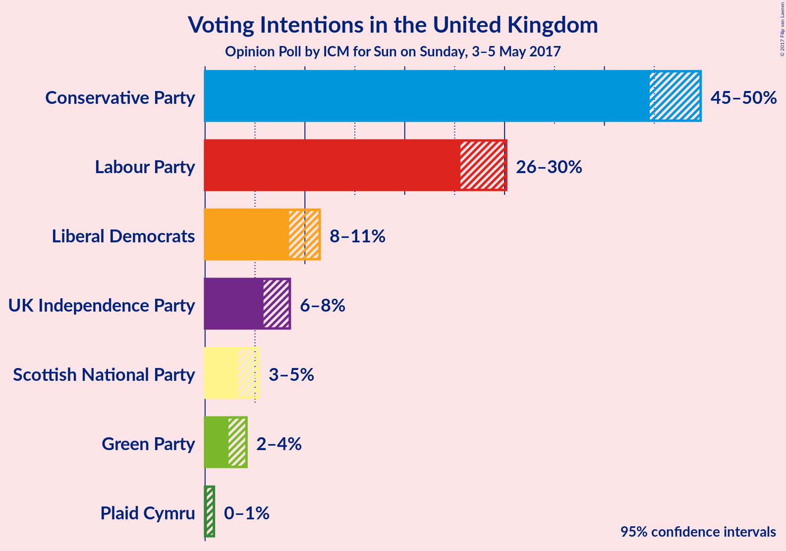
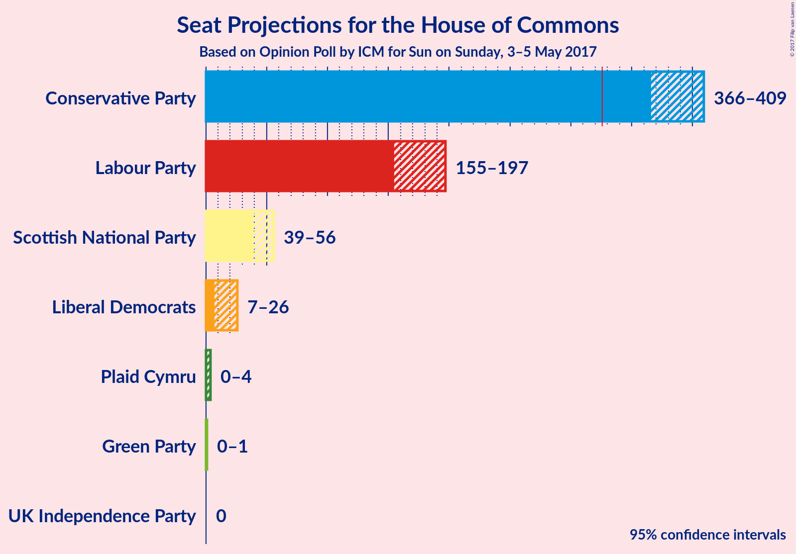
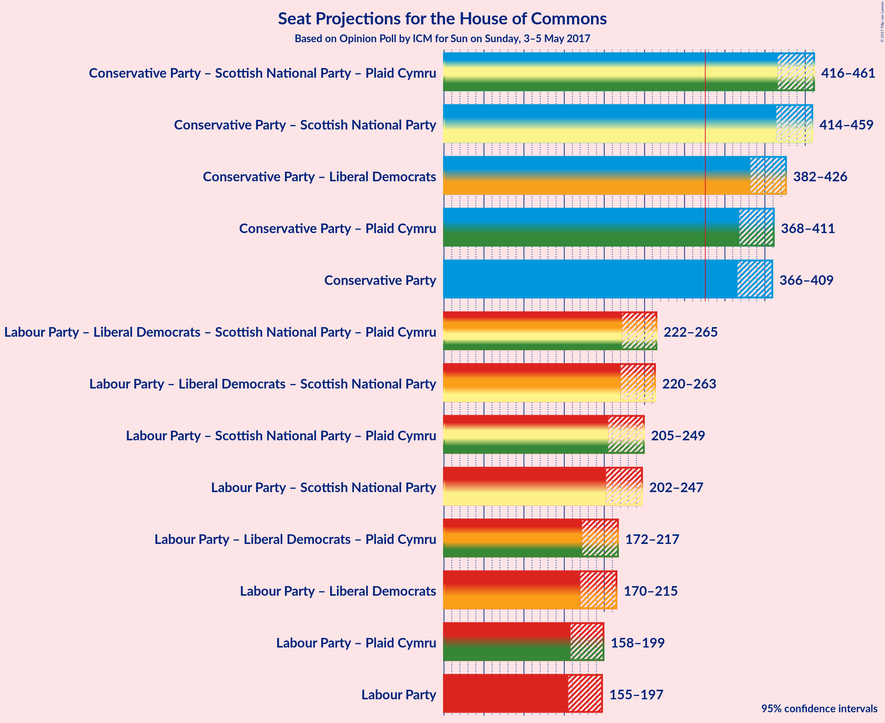

# Opinion Poll by ICM for Sun on Sunday, 3–5 May 2017

<a href="#voting-intentions">Voting Intentions</a> | <a href="#seats">Seats</a> | <a href="#coalitions">Coalitions</a> | <a href="#technical-information">Technical Information</a>

## Voting Intentions

### Confidence Intervals

| Party | Last Result | Poll Result | 80% Confidence Interval | 90% Confidence Interval | 95% Confidence Interval | 99% Confidence Interval |
|:-----:|:-----------:|:-----------:|:-----------------------:|:-----------------------:|:-----------------------:|:-----------------------:|
| Conservative Party | 36.9% | 47.3% | 45.4–48.8% |44.9–49.2% |44.5–49.6% |43.7–50.4% |
| Labour Party | 30.4% | 27.9% | 26.4–29.4% |25.9–29.8% |25.6–30.2% |24.9–30.9% |
| Liberal Democrats | 7.9% | 9.9% | 8.9–10.9% |8.6–11.2% |8.4–11.5% |8.0–12.0% |
| UK Independence Party | 12.6% | 7.1% | 6.3–8.0% |6.0–8.3% |5.9–8.5% |5.5–8.9% |
| Scottish National Party | 4.7% | 4.2% | 3.6–5.0% |3.4–5.2% |3.3–5.4% |3.0–5.7% |
| Green Party | 3.8% | 3.1% | 2.6–3.8% |2.5–4.0% |2.3–4.1% |2.1–4.5% |
| Plaid Cymru | 0.6% | 0.4% | 0.3–0.7% |0.2–0.8% |0.2–0.9% |0.1–1.1% |

*Note:* The poll result column reflects the actual value used in the calculations. Published results may vary slightly, and in addition be rounded to fewer digits.

## Seats

### Confidence Intervals

| Party | Last Result | Median | 80% Confidence Interval | 90% Confidence Interval | 95% Confidence Interval | 99% Confidence Interval |
|:-----:|:-----------:|:------:|:-----------------------:|:-----------------------:|:-----------------------:|:-----------------------:|
| <a href="#conservative-party">Conservative Party</a> | 331 | 386 | 374–403 |370–406 |366–409 |359–416 |
| <a href="#labour-party">Labour Party</a> | 232 | 179 | 161–189 |159–194 |155–197 |149–204 |
| <a href="#liberal-democrats">Liberal Democrats</a> | 8 | 16 | 10–22 |9–24 |7–26 |6–30 |
| <a href="#uk-independence-party">UK Independence Party</a> | 1 | 0 | 0 |0 |0 |0 |
| <a href="#scottish-national-party">Scottish National Party</a> | 56 | 49 | 42–54 |41–55 |39–56 |36–56 |
| <a href="#green-party">Green Party</a> | 1 | 1 | 0–1 |0–1 |0–1 |0–2 |
| <a href="#plaid-cymru">Plaid Cymru</a> | 3 | 3 | 0–4 |0–4 |0–4 |0–7 |

### Conservative Party

| Number of Seats | Probability | Accumulated |
|:---------------:|:-----------:|:-----------:|
| 348 | 0% | 100% |
| 349 | 0% | 99.9% |
| 350 | 0% | 99.9% |
| 351 | 0% | 99.9% |
| 352 | 0% | 99.9% |
| 353 | 0% | 99.8% |
| 354 | 0% | 99.8% |
| 355 | 0% | 99.8% |
| 356 | 0% | 99.7% |
| 357 | 0.1% | 99.7% |
| 358 | 0.1% | 99.6% |
| 359 | 0.2% | 99.6% |
| 360 | 0.2% | 99.4% |
| 361 | 0.2% | 99.2% |
| 362 | 0.1% | 99.0% |
| 363 | 0.3% | 98.9% |
| 364 | 0.6% | 98.6% |
| 365 | 0.5% | 98% |
| 366 | 0.3% | 98% |
| 367 | 0.5% | 97% |
| 368 | 1.0% | 97% |
| 369 | 0.3% | 96% |
| 370 | 2% | 96% |
| 371 | 0.8% | 94% |
| 372 | 1.0% | 93% |
| 373 | 1.3% | 92% |
| 374 | 1.1% | 91% |
| 375 | 2% | 90% |
| 376 | 2% | 88% |
| 377 | 2% | 86% |
| 378 | 2% | 84% |
| 379 | 5% | 82% |
| 380 | 5% | 77% |
| 381 | 5% | 72% |
| 382 | 3% | 67% |
| 383 | 7% | 64% |
| 384 | 3% | 57% |
| 385 | 2% | 54% |
| 386 | 5% | 51% |
| 387 | 3% | 46% |
| 388 | 4% | 43% |
| 389 | 2% | 39% |
| 390 | 5% | 37% |
| 391 | 2% | 32% |
| 392 | 2% | 30% |
| 393 | 1.2% | 28% |
| 394 | 3% | 27% |
| 395 | 3% | 25% |
| 396 | 3% | 22% |
| 397 | 1.0% | 19% |
| 398 | 2% | 18% |
| 399 | 2% | 16% |
| 400 | 0.9% | 14% |
| 401 | 0.8% | 13% |
| 402 | 2% | 12% |
| 403 | 1.5% | 10% |
| 404 | 1.0% | 9% |
| 405 | 1.3% | 8% |
| 406 | 1.4% | 6% |
| 407 | 1.0% | 5% |
| 408 | 0.8% | 4% |
| 409 | 0.7% | 3% |
| 410 | 0.6% | 2% |
| 411 | 0.4% | 2% |
| 412 | 0.3% | 1.5% |
| 413 | 0.2% | 1.2% |
| 414 | 0.3% | 1.0% |
| 415 | 0.2% | 0.8% |
| 416 | 0.1% | 0.6% |
| 417 | 0.1% | 0.5% |
| 418 | 0.2% | 0.4% |
| 419 | 0.1% | 0.3% |
| 420 | 0.1% | 0.2% |
| 421 | 0% | 0.1% |
| 422 | 0% | 0.1% |
| 423 | 0% | 0.1% |
| 424 | 0% | 0% |

### Labour Party

| Number of Seats | Probability | Accumulated |
|:---------------:|:-----------:|:-----------:|
| 143 | 0% | 100% |
| 144 | 0% | 99.9% |
| 145 | 0.1% | 99.9% |
| 146 | 0% | 99.8% |
| 147 | 0.1% | 99.8% |
| 148 | 0.1% | 99.7% |
| 149 | 0.1% | 99.6% |
| 150 | 0.2% | 99.4% |
| 151 | 0.2% | 99.3% |
| 152 | 0.3% | 99.1% |
| 153 | 0.5% | 98.8% |
| 154 | 0.6% | 98% |
| 155 | 0.4% | 98% |
| 156 | 0.6% | 97% |
| 157 | 0.6% | 97% |
| 158 | 0.7% | 96% |
| 159 | 3% | 95% |
| 160 | 1.3% | 93% |
| 161 | 2% | 91% |
| 162 | 0.7% | 90% |
| 163 | 1.2% | 89% |
| 164 | 2% | 88% |
| 165 | 1.4% | 86% |
| 166 | 2% | 85% |
| 167 | 1.5% | 83% |
| 168 | 2% | 81% |
| 169 | 0.8% | 80% |
| 170 | 1.3% | 79% |
| 171 | 3% | 78% |
| 172 | 2% | 75% |
| 173 | 3% | 73% |
| 174 | 3% | 69% |
| 175 | 4% | 66% |
| 176 | 5% | 62% |
| 177 | 3% | 57% |
| 178 | 2% | 54% |
| 179 | 3% | 52% |
| 180 | 3% | 49% |
| 181 | 6% | 46% |
| 182 | 7% | 40% |
| 183 | 5% | 33% |
| 184 | 6% | 27% |
| 185 | 3% | 22% |
| 186 | 2% | 19% |
| 187 | 3% | 17% |
| 188 | 3% | 14% |
| 189 | 1.2% | 11% |
| 190 | 1.1% | 9% |
| 191 | 1.1% | 8% |
| 192 | 0.9% | 7% |
| 193 | 1.3% | 6% |
| 194 | 0.8% | 5% |
| 195 | 0.6% | 4% |
| 196 | 0.4% | 4% |
| 197 | 0.8% | 3% |
| 198 | 0.5% | 2% |
| 199 | 0.3% | 2% |
| 200 | 0.1% | 2% |
| 201 | 0.4% | 1.4% |
| 202 | 0.3% | 1.1% |
| 203 | 0.3% | 0.8% |
| 204 | 0.1% | 0.5% |
| 205 | 0.1% | 0.4% |
| 206 | 0% | 0.3% |
| 207 | 0% | 0.3% |
| 208 | 0.1% | 0.3% |
| 209 | 0% | 0.2% |
| 210 | 0% | 0.2% |
| 211 | 0% | 0.2% |
| 212 | 0% | 0.1% |
| 213 | 0% | 0.1% |
| 214 | 0% | 0.1% |
| 215 | 0% | 0% |

### Liberal Democrats

| Number of Seats | Probability | Accumulated |
|:---------------:|:-----------:|:-----------:|
| 5 | 0.1% | 100% |
| 6 | 0.6% | 99.8% |
| 7 | 2% | 99.2% |
| 8 | 2% | 97% |
| 9 | 4% | 95% |
| 10 | 2% | 91% |
| 11 | 5% | 89% |
| 12 | 8% | 84% |
| 13 | 11% | 76% |
| 14 | 5% | 65% |
| 15 | 5% | 60% |
| 16 | 10% | 55% |
| 17 | 12% | 45% |
| 18 | 5% | 34% |
| 19 | 9% | 29% |
| 20 | 4% | 20% |
| 21 | 4% | 16% |
| 22 | 2% | 12% |
| 23 | 2% | 9% |
| 24 | 3% | 8% |
| 25 | 1.0% | 5% |
| 26 | 1.3% | 4% |
| 27 | 0.8% | 2% |
| 28 | 0.4% | 2% |
| 29 | 0.6% | 1.2% |
| 30 | 0.2% | 0.6% |
| 31 | 0.2% | 0.4% |
| 32 | 0% | 0.1% |
| 33 | 0.1% | 0.1% |
| 34 | 0% | 0% |

### UK Independence Party

| Number of Seats | Probability | Accumulated |
|:---------------:|:-----------:|:-----------:|
| 0 | 100% | 100% |
| 1 | 0% | 0% |

### Scottish National Party

| Number of Seats | Probability | Accumulated |
|:---------------:|:-----------:|:-----------:|
| 27 | 0% | 100% |
| 28 | 0% | 99.9% |
| 29 | 0% | 99.9% |
| 30 | 0% | 99.9% |
| 31 | 0% | 99.9% |
| 32 | 0% | 99.9% |
| 33 | 0% | 99.9% |
| 34 | 0.1% | 99.8% |
| 35 | 0.1% | 99.8% |
| 36 | 0.4% | 99.7% |
| 37 | 0.7% | 99.3% |
| 38 | 0.8% | 98.6% |
| 39 | 0.5% | 98% |
| 40 | 2% | 97% |
| 41 | 1.3% | 96% |
| 42 | 5% | 94% |
| 43 | 5% | 89% |
| 44 | 4% | 84% |
| 45 | 7% | 79% |
| 46 | 6% | 72% |
| 47 | 6% | 67% |
| 48 | 10% | 61% |
| 49 | 5% | 51% |
| 50 | 9% | 46% |
| 51 | 6% | 37% |
| 52 | 4% | 31% |
| 53 | 12% | 27% |
| 54 | 7% | 16% |
| 55 | 5% | 9% |
| 56 | 4% | 4% |
| 57 | 0.3% | 0.4% |
| 58 | 0.1% | 0.1% |
| 59 | 0% | 0% |

### Green Party

| Number of Seats | Probability | Accumulated |
|:---------------:|:-----------:|:-----------:|
| 0 | 12% | 100% |
| 1 | 88% | 88% |
| 2 | 0.6% | 0.6% |
| 3 | 0% | 0% |

### Plaid Cymru

| Number of Seats | Probability | Accumulated |
|:---------------:|:-----------:|:-----------:|
| 0 | 31% | 100% |
| 1 | 10% | 69% |
| 2 | 0.3% | 59% |
| 3 | 28% | 58% |
| 4 | 28% | 30% |
| 5 | 0.7% | 2% |
| 6 | 0.4% | 1.2% |
| 7 | 0.7% | 0.8% |
| 8 | 0% | 0.1% |
| 9 | 0% | 0% |

## Coalitions

### Confidence Intervals

| Coalition | Last Result | Median | 80% Confidence Interval | 90% Confidence Interval | 95% Confidence Interval | 99% Confidence Interval |
|:---------:|:-----------:|:------:|:-----------------------:|:-----------------------:|:-----------------------:|:-----------------------:|
| Conservative Party – Scottish National Party – Plaid Cymru | 390 | 437 | 424–454 | 420–458 | 416–461 | 408–467 |
| Conservative Party – Scottish National Party | 387 | 435 | 422–450 | 418–455 | 414–459 | 406–465 |
| Conservative Party – Liberal Democrats | 339 | 402 | 390–419 | 385–424 | 382–426 | 374–434 |
| Conservative Party – Plaid Cymru | 334 | 388 | 376–405 | 372–409 | 368–411 | 361–418 |
| Conservative Party | 331 | 386 | 374–403 | 370–406 | 366–409 | 359–416 |
| Labour Party – Liberal Democrats – Scottish National Party – Plaid Cymru | 299 | 245 | 229–257 | 225–261 | 222–265 | 215–272 |
| Labour Party – Liberal Democrats – Scottish National Party | 296 | 243 | 226–255 | 222–259 | 220–263 | 213–270 |
| Labour Party – Scottish National Party – Plaid Cymru | 291 | 229 | 212–241 | 207–246 | 205–249 | 197–257 |
| Labour Party – Scottish National Party | 288 | 227 | 209–240 | 205–244 | 202–247 | 195–255 |
| Labour Party – Liberal Democrats – Plaid Cymru | 243 | 197 | 181–209 | 176–213 | 172–217 | 167–225 |
| Labour Party – Liberal Democrats | 240 | 194 | 178–207 | 173–211 | 170–215 | 164–223 |
| Labour Party – Plaid Cymru | 235 | 181 | 164–191 | 161–196 | 158–199 | 151–206 |
| Labour Party | 232 | 179 | 161–189 | 159–194 | 155–197 | 149–204 |

### Conservative Party – Scottish National Party – Plaid Cymru

| Number of Seats | Probability | Accumulated |
|:---------------:|:-----------:|:-----------:|
| 397 | 0% | 100% |
| 398 | 0% | 99.9% |
| 399 | 0% | 99.9% |
| 400 | 0% | 99.9% |
| 401 | 0% | 99.9% |
| 402 | 0% | 99.9% |
| 403 | 0.1% | 99.8% |
| 404 | 0% | 99.8% |
| 405 | 0.1% | 99.8% |
| 406 | 0.1% | 99.7% |
| 407 | 0.1% | 99.6% |
| 408 | 0.1% | 99.5% |
| 409 | 0.1% | 99.5% |
| 410 | 0.2% | 99.4% |
| 411 | 0.2% | 99.2% |
| 412 | 0.2% | 99.0% |
| 413 | 0.4% | 98.8% |
| 414 | 0.6% | 98% |
| 415 | 0.2% | 98% |
| 416 | 0.5% | 98% |
| 417 | 0.6% | 97% |
| 418 | 0.5% | 97% |
| 419 | 0.9% | 96% |
| 420 | 1.2% | 95% |
| 421 | 0.6% | 94% |
| 422 | 0.9% | 93% |
| 423 | 2% | 92% |
| 424 | 1.1% | 91% |
| 425 | 1.3% | 90% |
| 426 | 3% | 88% |
| 427 | 3% | 85% |
| 428 | 3% | 82% |
| 429 | 2% | 79% |
| 430 | 2% | 78% |
| 431 | 3% | 76% |
| 432 | 3% | 72% |
| 433 | 6% | 69% |
| 434 | 5% | 63% |
| 435 | 3% | 58% |
| 436 | 4% | 55% |
| 437 | 4% | 51% |
| 438 | 4% | 48% |
| 439 | 4% | 44% |
| 440 | 4% | 40% |
| 441 | 2% | 36% |
| 442 | 1.5% | 34% |
| 443 | 5% | 33% |
| 444 | 2% | 28% |
| 445 | 3% | 26% |
| 446 | 2% | 23% |
| 447 | 3% | 21% |
| 448 | 1.0% | 18% |
| 449 | 2% | 17% |
| 450 | 1.4% | 16% |
| 451 | 2% | 14% |
| 452 | 2% | 13% |
| 453 | 1.1% | 11% |
| 454 | 2% | 10% |
| 455 | 1.3% | 8% |
| 456 | 1.0% | 7% |
| 457 | 0.7% | 6% |
| 458 | 1.0% | 5% |
| 459 | 0.5% | 4% |
| 460 | 0.9% | 4% |
| 461 | 0.8% | 3% |
| 462 | 0.4% | 2% |
| 463 | 0.6% | 2% |
| 464 | 0.3% | 1.1% |
| 465 | 0.1% | 0.9% |
| 466 | 0.2% | 0.7% |
| 467 | 0.1% | 0.5% |
| 468 | 0.1% | 0.4% |
| 469 | 0.1% | 0.3% |
| 470 | 0.1% | 0.2% |
| 471 | 0.1% | 0.2% |
| 472 | 0% | 0.1% |
| 473 | 0% | 0.1% |
| 474 | 0% | 0.1% |
| 475 | 0% | 0% |

### Conservative Party – Scottish National Party

| Number of Seats | Probability | Accumulated |
|:---------------:|:-----------:|:-----------:|
| 395 | 0% | 100% |
| 396 | 0% | 99.9% |
| 397 | 0% | 99.9% |
| 398 | 0% | 99.9% |
| 399 | 0% | 99.9% |
| 400 | 0% | 99.9% |
| 401 | 0% | 99.8% |
| 402 | 0.1% | 99.8% |
| 403 | 0.1% | 99.7% |
| 404 | 0.1% | 99.7% |
| 405 | 0.1% | 99.6% |
| 406 | 0.1% | 99.5% |
| 407 | 0.1% | 99.4% |
| 408 | 0.1% | 99.3% |
| 409 | 0.1% | 99.1% |
| 410 | 0.3% | 99.0% |
| 411 | 0.3% | 98.7% |
| 412 | 0.2% | 98% |
| 413 | 0.4% | 98% |
| 414 | 0.7% | 98% |
| 415 | 0.4% | 97% |
| 416 | 1.0% | 97% |
| 417 | 0.7% | 96% |
| 418 | 0.7% | 95% |
| 419 | 1.1% | 94% |
| 420 | 1.4% | 93% |
| 421 | 0.8% | 92% |
| 422 | 2% | 91% |
| 423 | 3% | 89% |
| 424 | 2% | 86% |
| 425 | 2% | 84% |
| 426 | 2% | 82% |
| 427 | 2% | 80% |
| 428 | 3% | 78% |
| 429 | 5% | 75% |
| 430 | 3% | 70% |
| 431 | 5% | 67% |
| 432 | 4% | 62% |
| 433 | 5% | 58% |
| 434 | 3% | 54% |
| 435 | 3% | 50% |
| 436 | 4% | 48% |
| 437 | 3% | 43% |
| 438 | 4% | 40% |
| 439 | 2% | 36% |
| 440 | 4% | 34% |
| 441 | 2% | 30% |
| 442 | 1.1% | 28% |
| 443 | 4% | 27% |
| 444 | 3% | 23% |
| 445 | 2% | 20% |
| 446 | 2% | 18% |
| 447 | 1.1% | 16% |
| 448 | 1.1% | 15% |
| 449 | 3% | 14% |
| 450 | 2% | 12% |
| 451 | 0.9% | 10% |
| 452 | 1.2% | 9% |
| 453 | 1.0% | 8% |
| 454 | 0.9% | 7% |
| 455 | 1.1% | 6% |
| 456 | 0.4% | 5% |
| 457 | 1.0% | 4% |
| 458 | 0.6% | 3% |
| 459 | 0.7% | 3% |
| 460 | 0.6% | 2% |
| 461 | 0.3% | 2% |
| 462 | 0.4% | 1.3% |
| 463 | 0.3% | 1.0% |
| 464 | 0.1% | 0.7% |
| 465 | 0.1% | 0.5% |
| 466 | 0.1% | 0.4% |
| 467 | 0.1% | 0.3% |
| 468 | 0.1% | 0.2% |
| 469 | 0.1% | 0.2% |
| 470 | 0% | 0.1% |
| 471 | 0% | 0.1% |
| 472 | 0% | 0.1% |
| 473 | 0% | 0% |

### Conservative Party – Liberal Democrats

| Number of Seats | Probability | Accumulated |
|:---------------:|:-----------:|:-----------:|
| 364 | 0% | 100% |
| 365 | 0% | 99.9% |
| 366 | 0% | 99.9% |
| 367 | 0% | 99.9% |
| 368 | 0% | 99.9% |
| 369 | 0% | 99.9% |
| 370 | 0.1% | 99.8% |
| 371 | 0% | 99.8% |
| 372 | 0.1% | 99.7% |
| 373 | 0.1% | 99.6% |
| 374 | 0.1% | 99.6% |
| 375 | 0.1% | 99.5% |
| 376 | 0.1% | 99.3% |
| 377 | 0.3% | 99.2% |
| 378 | 0.2% | 98.9% |
| 379 | 0.2% | 98.8% |
| 380 | 0.2% | 98.6% |
| 381 | 0.7% | 98% |
| 382 | 0.5% | 98% |
| 383 | 0.4% | 97% |
| 384 | 1.1% | 97% |
| 385 | 0.7% | 96% |
| 386 | 0.7% | 95% |
| 387 | 2% | 94% |
| 388 | 1.5% | 93% |
| 389 | 0.9% | 91% |
| 390 | 2% | 90% |
| 391 | 2% | 88% |
| 392 | 2% | 86% |
| 393 | 3% | 83% |
| 394 | 3% | 81% |
| 395 | 2% | 78% |
| 396 | 4% | 76% |
| 397 | 5% | 72% |
| 398 | 4% | 67% |
| 399 | 5% | 63% |
| 400 | 5% | 58% |
| 401 | 2% | 53% |
| 402 | 5% | 51% |
| 403 | 4% | 46% |
| 404 | 3% | 42% |
| 405 | 3% | 38% |
| 406 | 2% | 35% |
| 407 | 2% | 33% |
| 408 | 1.1% | 31% |
| 409 | 2% | 30% |
| 410 | 2% | 27% |
| 411 | 2% | 25% |
| 412 | 5% | 23% |
| 413 | 0.9% | 19% |
| 414 | 1.1% | 18% |
| 415 | 1.1% | 17% |
| 416 | 1.2% | 16% |
| 417 | 1.2% | 14% |
| 418 | 3% | 13% |
| 419 | 2% | 11% |
| 420 | 0.8% | 9% |
| 421 | 1.0% | 8% |
| 422 | 0.5% | 7% |
| 423 | 1.3% | 7% |
| 424 | 0.4% | 5% |
| 425 | 1.1% | 5% |
| 426 | 1.3% | 4% |
| 427 | 0.4% | 2% |
| 428 | 0.3% | 2% |
| 429 | 0.2% | 2% |
| 430 | 0.3% | 2% |
| 431 | 0.2% | 1.3% |
| 432 | 0.3% | 1.1% |
| 433 | 0.2% | 0.8% |
| 434 | 0.2% | 0.6% |
| 435 | 0% | 0.4% |
| 436 | 0.1% | 0.4% |
| 437 | 0.1% | 0.3% |
| 438 | 0.1% | 0.3% |
| 439 | 0.1% | 0.2% |
| 440 | 0% | 0.1% |
| 441 | 0% | 0.1% |
| 442 | 0% | 0% |

### Conservative Party – Plaid Cymru

| Number of Seats | Probability | Accumulated |
|:---------------:|:-----------:|:-----------:|
| 351 | 0% | 100% |
| 352 | 0% | 99.9% |
| 353 | 0% | 99.9% |
| 354 | 0% | 99.9% |
| 355 | 0% | 99.9% |
| 356 | 0% | 99.8% |
| 357 | 0% | 99.8% |
| 358 | 0% | 99.8% |
| 359 | 0.1% | 99.7% |
| 360 | 0.1% | 99.6% |
| 361 | 0.1% | 99.6% |
| 362 | 0.2% | 99.5% |
| 363 | 0.2% | 99.3% |
| 364 | 0.6% | 99.1% |
| 365 | 0.2% | 98.5% |
| 366 | 0.3% | 98% |
| 367 | 0.2% | 98% |
| 368 | 0.5% | 98% |
| 369 | 0.3% | 97% |
| 370 | 0.5% | 97% |
| 371 | 1.1% | 96% |
| 372 | 0.7% | 95% |
| 373 | 1.4% | 95% |
| 374 | 1.1% | 93% |
| 375 | 0.9% | 92% |
| 376 | 1.5% | 91% |
| 377 | 1.3% | 90% |
| 378 | 2% | 88% |
| 379 | 3% | 86% |
| 380 | 2% | 83% |
| 381 | 3% | 81% |
| 382 | 3% | 78% |
| 383 | 7% | 75% |
| 384 | 3% | 68% |
| 385 | 4% | 64% |
| 386 | 4% | 60% |
| 387 | 4% | 56% |
| 388 | 4% | 52% |
| 389 | 3% | 48% |
| 390 | 5% | 45% |
| 391 | 4% | 40% |
| 392 | 3% | 36% |
| 393 | 2% | 33% |
| 394 | 3% | 31% |
| 395 | 2% | 28% |
| 396 | 2% | 26% |
| 397 | 0.8% | 23% |
| 398 | 2% | 22% |
| 399 | 2% | 20% |
| 400 | 2% | 18% |
| 401 | 2% | 17% |
| 402 | 1.3% | 15% |
| 403 | 1.3% | 14% |
| 404 | 1.3% | 12% |
| 405 | 1.0% | 11% |
| 406 | 2% | 10% |
| 407 | 0.7% | 8% |
| 408 | 0.8% | 7% |
| 409 | 2% | 6% |
| 410 | 1.0% | 4% |
| 411 | 0.9% | 3% |
| 412 | 0.3% | 2% |
| 413 | 0.4% | 2% |
| 414 | 0.4% | 2% |
| 415 | 0.3% | 1.2% |
| 416 | 0.1% | 0.9% |
| 417 | 0.1% | 0.8% |
| 418 | 0.2% | 0.7% |
| 419 | 0.2% | 0.5% |
| 420 | 0.1% | 0.3% |
| 421 | 0% | 0.2% |
| 422 | 0% | 0.2% |
| 423 | 0.1% | 0.1% |
| 424 | 0% | 0.1% |
| 425 | 0% | 0% |

### Conservative Party

| Number of Seats | Probability | Accumulated |
|:---------------:|:-----------:|:-----------:|
| 348 | 0% | 100% |
| 349 | 0% | 99.9% |
| 350 | 0% | 99.9% |
| 351 | 0% | 99.9% |
| 352 | 0% | 99.9% |
| 353 | 0% | 99.8% |
| 354 | 0% | 99.8% |
| 355 | 0% | 99.8% |
| 356 | 0% | 99.7% |
| 357 | 0.1% | 99.7% |
| 358 | 0.1% | 99.6% |
| 359 | 0.2% | 99.6% |
| 360 | 0.2% | 99.4% |
| 361 | 0.2% | 99.2% |
| 362 | 0.1% | 99.0% |
| 363 | 0.3% | 98.9% |
| 364 | 0.6% | 98.6% |
| 365 | 0.5% | 98% |
| 366 | 0.3% | 98% |
| 367 | 0.5% | 97% |
| 368 | 1.0% | 97% |
| 369 | 0.3% | 96% |
| 370 | 2% | 96% |
| 371 | 0.8% | 94% |
| 372 | 1.0% | 93% |
| 373 | 1.3% | 92% |
| 374 | 1.1% | 91% |
| 375 | 2% | 90% |
| 376 | 2% | 88% |
| 377 | 2% | 86% |
| 378 | 2% | 84% |
| 379 | 5% | 82% |
| 380 | 5% | 77% |
| 381 | 5% | 72% |
| 382 | 3% | 67% |
| 383 | 7% | 64% |
| 384 | 3% | 57% |
| 385 | 2% | 54% |
| 386 | 5% | 51% |
| 387 | 3% | 46% |
| 388 | 4% | 43% |
| 389 | 2% | 39% |
| 390 | 5% | 37% |
| 391 | 2% | 32% |
| 392 | 2% | 30% |
| 393 | 1.2% | 28% |
| 394 | 3% | 27% |
| 395 | 3% | 25% |
| 396 | 3% | 22% |
| 397 | 1.0% | 19% |
| 398 | 2% | 18% |
| 399 | 2% | 16% |
| 400 | 0.9% | 14% |
| 401 | 0.8% | 13% |
| 402 | 2% | 12% |
| 403 | 1.5% | 10% |
| 404 | 1.0% | 9% |
| 405 | 1.3% | 8% |
| 406 | 1.4% | 6% |
| 407 | 1.0% | 5% |
| 408 | 0.8% | 4% |
| 409 | 0.7% | 3% |
| 410 | 0.6% | 2% |
| 411 | 0.4% | 2% |
| 412 | 0.3% | 1.5% |
| 413 | 0.2% | 1.2% |
| 414 | 0.3% | 1.0% |
| 415 | 0.2% | 0.8% |
| 416 | 0.1% | 0.6% |
| 417 | 0.1% | 0.5% |
| 418 | 0.2% | 0.4% |
| 419 | 0.1% | 0.3% |
| 420 | 0.1% | 0.2% |
| 421 | 0% | 0.1% |
| 422 | 0% | 0.1% |
| 423 | 0% | 0.1% |
| 424 | 0% | 0% |

### Labour Party – Liberal Democrats – Scottish National Party – Plaid Cymru

| Number of Seats | Probability | Accumulated |
|:---------------:|:-----------:|:-----------:|
| 208 | 0% | 100% |
| 209 | 0.1% | 99.9% |
| 210 | 0% | 99.9% |
| 211 | 0% | 99.9% |
| 212 | 0.1% | 99.8% |
| 213 | 0.2% | 99.8% |
| 214 | 0.1% | 99.6% |
| 215 | 0.1% | 99.5% |
| 216 | 0.2% | 99.5% |
| 217 | 0.3% | 99.3% |
| 218 | 0.1% | 99.0% |
| 219 | 0.2% | 98.8% |
| 220 | 0.4% | 98.6% |
| 221 | 0.6% | 98% |
| 222 | 0.5% | 98% |
| 223 | 0.8% | 97% |
| 224 | 1.0% | 96% |
| 225 | 1.3% | 95% |
| 226 | 2% | 94% |
| 227 | 1.0% | 92% |
| 228 | 1.1% | 91% |
| 229 | 2% | 90% |
| 230 | 0.9% | 88% |
| 231 | 0.8% | 87% |
| 232 | 2% | 86% |
| 233 | 2% | 84% |
| 234 | 1.0% | 82% |
| 235 | 3% | 81% |
| 236 | 3% | 79% |
| 237 | 2% | 76% |
| 238 | 2% | 73% |
| 239 | 2% | 72% |
| 240 | 2% | 70% |
| 241 | 5% | 68% |
| 242 | 2% | 63% |
| 243 | 4% | 61% |
| 244 | 3% | 57% |
| 245 | 5% | 54% |
| 246 | 2% | 49% |
| 247 | 3% | 47% |
| 248 | 7% | 43% |
| 249 | 3% | 37% |
| 250 | 5% | 33% |
| 251 | 5% | 28% |
| 252 | 5% | 23% |
| 253 | 2% | 19% |
| 254 | 2% | 16% |
| 255 | 2% | 15% |
| 256 | 2% | 12% |
| 257 | 1.3% | 11% |
| 258 | 1.4% | 9% |
| 259 | 0.9% | 8% |
| 260 | 0.9% | 7% |
| 261 | 2% | 6% |
| 262 | 0.3% | 4% |
| 263 | 1.0% | 4% |
| 264 | 0.4% | 3% |
| 265 | 0.3% | 3% |
| 266 | 0.5% | 2% |
| 267 | 0.5% | 2% |
| 268 | 0.3% | 1.4% |
| 269 | 0.2% | 1.1% |
| 270 | 0.2% | 1.0% |
| 271 | 0.2% | 0.8% |
| 272 | 0.2% | 0.6% |
| 273 | 0.1% | 0.4% |
| 274 | 0.1% | 0.4% |
| 275 | 0% | 0.3% |
| 276 | 0.1% | 0.3% |
| 277 | 0% | 0.2% |
| 278 | 0% | 0.2% |
| 279 | 0% | 0.2% |
| 280 | 0% | 0.1% |
| 281 | 0% | 0.1% |
| 282 | 0% | 0.1% |
| 283 | 0% | 0.1% |
| 284 | 0% | 0% |

### Labour Party – Liberal Democrats – Scottish National Party

| Number of Seats | Probability | Accumulated |
|:---------------:|:-----------:|:-----------:|
| 207 | 0% | 100% |
| 208 | 0.1% | 99.9% |
| 209 | 0% | 99.9% |
| 210 | 0% | 99.8% |
| 211 | 0% | 99.8% |
| 212 | 0.2% | 99.8% |
| 213 | 0.2% | 99.6% |
| 214 | 0.1% | 99.4% |
| 215 | 0.1% | 99.3% |
| 216 | 0.3% | 99.1% |
| 217 | 0.4% | 98.8% |
| 218 | 0.4% | 98% |
| 219 | 0.3% | 98% |
| 220 | 0.7% | 98% |
| 221 | 0.9% | 97% |
| 222 | 2% | 96% |
| 223 | 0.6% | 94% |
| 224 | 1.0% | 93% |
| 225 | 2% | 92% |
| 226 | 1.3% | 90% |
| 227 | 0.9% | 89% |
| 228 | 2% | 88% |
| 229 | 1.2% | 87% |
| 230 | 2% | 85% |
| 231 | 2% | 83% |
| 232 | 1.4% | 82% |
| 233 | 3% | 80% |
| 234 | 0.8% | 78% |
| 235 | 3% | 77% |
| 236 | 2% | 74% |
| 237 | 3% | 72% |
| 238 | 2% | 69% |
| 239 | 2% | 67% |
| 240 | 4% | 65% |
| 241 | 5% | 60% |
| 242 | 3% | 55% |
| 243 | 3% | 52% |
| 244 | 4% | 49% |
| 245 | 3% | 44% |
| 246 | 5% | 41% |
| 247 | 3% | 36% |
| 248 | 7% | 33% |
| 249 | 3% | 25% |
| 250 | 3% | 22% |
| 251 | 2% | 19% |
| 252 | 3% | 17% |
| 253 | 3% | 14% |
| 254 | 1.2% | 12% |
| 255 | 1.3% | 10% |
| 256 | 1.0% | 9% |
| 257 | 1.3% | 8% |
| 258 | 1.4% | 7% |
| 259 | 0.8% | 5% |
| 260 | 1.1% | 5% |
| 261 | 0.5% | 4% |
| 262 | 0.4% | 3% |
| 263 | 0.5% | 3% |
| 264 | 0.2% | 2% |
| 265 | 0.4% | 2% |
| 266 | 0.2% | 2% |
| 267 | 0.6% | 1.5% |
| 268 | 0.2% | 0.9% |
| 269 | 0.2% | 0.7% |
| 270 | 0.1% | 0.5% |
| 271 | 0.1% | 0.4% |
| 272 | 0.1% | 0.4% |
| 273 | 0% | 0.3% |
| 274 | 0% | 0.2% |
| 275 | 0% | 0.2% |
| 276 | 0% | 0.2% |
| 277 | 0% | 0.1% |
| 278 | 0% | 0.1% |
| 279 | 0% | 0.1% |
| 280 | 0% | 0.1% |
| 281 | 0% | 0.1% |
| 282 | 0% | 0% |

### Labour Party – Scottish National Party – Plaid Cymru

| Number of Seats | Probability | Accumulated |
|:---------------:|:-----------:|:-----------:|
| 190 | 0% | 100% |
| 191 | 0% | 99.9% |
| 192 | 0% | 99.9% |
| 193 | 0.1% | 99.9% |
| 194 | 0.1% | 99.8% |
| 195 | 0.1% | 99.7% |
| 196 | 0% | 99.6% |
| 197 | 0.1% | 99.6% |
| 198 | 0.2% | 99.4% |
| 199 | 0.3% | 99.2% |
| 200 | 0.2% | 98.9% |
| 201 | 0.3% | 98.8% |
| 202 | 0.2% | 98% |
| 203 | 0.3% | 98% |
| 204 | 0.3% | 98% |
| 205 | 0.9% | 98% |
| 206 | 1.4% | 97% |
| 207 | 0.5% | 95% |
| 208 | 1.3% | 95% |
| 209 | 0.5% | 93% |
| 210 | 0.6% | 93% |
| 211 | 1.2% | 92% |
| 212 | 2% | 91% |
| 213 | 3% | 90% |
| 214 | 0.8% | 87% |
| 215 | 2% | 86% |
| 216 | 1.1% | 85% |
| 217 | 0.8% | 83% |
| 218 | 1.1% | 83% |
| 219 | 5% | 82% |
| 220 | 2% | 77% |
| 221 | 2% | 75% |
| 222 | 3% | 73% |
| 223 | 1.1% | 70% |
| 224 | 2% | 69% |
| 225 | 2% | 68% |
| 226 | 3% | 65% |
| 227 | 3% | 62% |
| 228 | 4% | 59% |
| 229 | 5% | 54% |
| 230 | 2% | 49% |
| 231 | 4% | 47% |
| 232 | 5% | 43% |
| 233 | 4% | 38% |
| 234 | 5% | 34% |
| 235 | 4% | 28% |
| 236 | 3% | 24% |
| 237 | 3% | 22% |
| 238 | 2% | 19% |
| 239 | 2% | 17% |
| 240 | 2% | 15% |
| 241 | 2% | 12% |
| 242 | 1.0% | 10% |
| 243 | 1.5% | 9% |
| 244 | 2% | 7% |
| 245 | 0.7% | 6% |
| 246 | 0.7% | 5% |
| 247 | 1.0% | 4% |
| 248 | 0.5% | 3% |
| 249 | 0.5% | 3% |
| 250 | 0.8% | 2% |
| 251 | 0.2% | 2% |
| 252 | 0.2% | 1.4% |
| 253 | 0.2% | 1.2% |
| 254 | 0.3% | 1.1% |
| 255 | 0.1% | 0.8% |
| 256 | 0.1% | 0.7% |
| 257 | 0.1% | 0.6% |
| 258 | 0.1% | 0.4% |
| 259 | 0.1% | 0.4% |
| 260 | 0% | 0.3% |
| 261 | 0.1% | 0.2% |
| 262 | 0% | 0.2% |
| 263 | 0% | 0.1% |
| 264 | 0% | 0.1% |
| 265 | 0% | 0.1% |
| 266 | 0% | 0.1% |
| 267 | 0% | 0.1% |
| 268 | 0% | 0% |

### Labour Party – Scottish National Party

| Number of Seats | Probability | Accumulated |
|:---------------:|:-----------:|:-----------:|
| 188 | 0% | 100% |
| 189 | 0% | 99.9% |
| 190 | 0% | 99.9% |
| 191 | 0.1% | 99.9% |
| 192 | 0.1% | 99.8% |
| 193 | 0.1% | 99.7% |
| 194 | 0% | 99.6% |
| 195 | 0.1% | 99.6% |
| 196 | 0.2% | 99.4% |
| 197 | 0.3% | 99.2% |
| 198 | 0.1% | 98.9% |
| 199 | 0.3% | 98.8% |
| 200 | 0.3% | 98% |
| 201 | 0.3% | 98% |
| 202 | 1.1% | 98% |
| 203 | 0.6% | 97% |
| 204 | 0.7% | 96% |
| 205 | 0.7% | 95% |
| 206 | 0.8% | 95% |
| 207 | 1.2% | 94% |
| 208 | 0.8% | 93% |
| 209 | 2% | 92% |
| 210 | 1.0% | 90% |
| 211 | 2% | 89% |
| 212 | 1.5% | 87% |
| 213 | 2% | 86% |
| 214 | 1.0% | 84% |
| 215 | 1.0% | 83% |
| 216 | 2% | 82% |
| 217 | 1.1% | 80% |
| 218 | 3% | 79% |
| 219 | 3% | 75% |
| 220 | 1.4% | 72% |
| 221 | 2% | 71% |
| 222 | 1.4% | 68% |
| 223 | 2% | 67% |
| 224 | 2% | 64% |
| 225 | 5% | 62% |
| 226 | 4% | 57% |
| 227 | 5% | 54% |
| 228 | 4% | 49% |
| 229 | 4% | 44% |
| 230 | 4% | 41% |
| 231 | 5% | 37% |
| 232 | 3% | 32% |
| 233 | 4% | 29% |
| 234 | 3% | 25% |
| 235 | 3% | 22% |
| 236 | 3% | 19% |
| 237 | 2% | 16% |
| 238 | 2% | 14% |
| 239 | 1.2% | 12% |
| 240 | 2% | 11% |
| 241 | 3% | 9% |
| 242 | 0.5% | 6% |
| 243 | 0.4% | 6% |
| 244 | 0.9% | 5% |
| 245 | 0.6% | 4% |
| 246 | 1.0% | 4% |
| 247 | 0.9% | 3% |
| 248 | 0.1% | 2% |
| 249 | 0.3% | 2% |
| 250 | 0.2% | 1.4% |
| 251 | 0.3% | 1.3% |
| 252 | 0.2% | 1.0% |
| 253 | 0.2% | 0.8% |
| 254 | 0.1% | 0.6% |
| 255 | 0.1% | 0.5% |
| 256 | 0.1% | 0.5% |
| 257 | 0.1% | 0.4% |
| 258 | 0.1% | 0.3% |
| 259 | 0% | 0.2% |
| 260 | 0% | 0.1% |
| 261 | 0% | 0.1% |
| 262 | 0% | 0.1% |
| 263 | 0% | 0.1% |
| 264 | 0% | 0.1% |
| 265 | 0% | 0.1% |
| 266 | 0% | 0% |

### Labour Party – Liberal Democrats – Plaid Cymru

| Number of Seats | Probability | Accumulated |
|:---------------:|:-----------:|:-----------:|
| 159 | 0% | 100% |
| 160 | 0% | 99.9% |
| 161 | 0% | 99.9% |
| 162 | 0.1% | 99.9% |
| 163 | 0.1% | 99.8% |
| 164 | 0.1% | 99.8% |
| 165 | 0.1% | 99.7% |
| 166 | 0.1% | 99.6% |
| 167 | 0.2% | 99.5% |
| 168 | 0.2% | 99.3% |
| 169 | 0.4% | 99.1% |
| 170 | 0.3% | 98.7% |
| 171 | 0.5% | 98% |
| 172 | 0.7% | 98% |
| 173 | 0.4% | 97% |
| 174 | 1.1% | 97% |
| 175 | 0.6% | 96% |
| 176 | 0.7% | 95% |
| 177 | 1.3% | 95% |
| 178 | 0.8% | 93% |
| 179 | 1.1% | 92% |
| 180 | 1.2% | 91% |
| 181 | 2% | 90% |
| 182 | 2% | 88% |
| 183 | 2% | 86% |
| 184 | 1.2% | 85% |
| 185 | 2% | 84% |
| 186 | 2% | 82% |
| 187 | 3% | 80% |
| 188 | 4% | 77% |
| 189 | 2% | 73% |
| 190 | 2% | 72% |
| 191 | 4% | 70% |
| 192 | 2% | 66% |
| 193 | 4% | 65% |
| 194 | 3% | 60% |
| 195 | 4% | 57% |
| 196 | 3% | 53% |
| 197 | 4% | 50% |
| 198 | 5% | 47% |
| 199 | 3% | 42% |
| 200 | 5% | 39% |
| 201 | 3% | 33% |
| 202 | 5% | 30% |
| 203 | 4% | 26% |
| 204 | 2% | 22% |
| 205 | 2% | 20% |
| 206 | 2% | 18% |
| 207 | 2% | 16% |
| 208 | 3% | 14% |
| 209 | 2% | 11% |
| 210 | 0.8% | 9% |
| 211 | 1.4% | 8% |
| 212 | 1.1% | 7% |
| 213 | 0.7% | 6% |
| 214 | 0.7% | 5% |
| 215 | 1.0% | 4% |
| 216 | 0.4% | 3% |
| 217 | 0.7% | 3% |
| 218 | 0.4% | 2% |
| 219 | 0.2% | 2% |
| 220 | 0.3% | 2% |
| 221 | 0.3% | 1.3% |
| 222 | 0.1% | 1.0% |
| 223 | 0.1% | 0.9% |
| 224 | 0.2% | 0.7% |
| 225 | 0.1% | 0.6% |
| 226 | 0.1% | 0.5% |
| 227 | 0.1% | 0.4% |
| 228 | 0.1% | 0.3% |
| 229 | 0.1% | 0.3% |
| 230 | 0% | 0.2% |
| 231 | 0% | 0.2% |
| 232 | 0% | 0.1% |
| 233 | 0% | 0.1% |
| 234 | 0% | 0.1% |
| 235 | 0% | 0.1% |
| 236 | 0% | 0.1% |
| 237 | 0% | 0% |

### Labour Party – Liberal Democrats

| Number of Seats | Probability | Accumulated |
|:---------------:|:-----------:|:-----------:|
| 157 | 0% | 100% |
| 158 | 0% | 99.9% |
| 159 | 0% | 99.9% |
| 160 | 0% | 99.9% |
| 161 | 0.1% | 99.9% |
| 162 | 0.1% | 99.8% |
| 163 | 0.1% | 99.7% |
| 164 | 0.1% | 99.6% |
| 165 | 0.2% | 99.5% |
| 166 | 0.1% | 99.3% |
| 167 | 0.3% | 99.2% |
| 168 | 0.5% | 98.9% |
| 169 | 0.4% | 98% |
| 170 | 0.7% | 98% |
| 171 | 0.9% | 97% |
| 172 | 0.5% | 96% |
| 173 | 1.0% | 96% |
| 174 | 0.8% | 95% |
| 175 | 0.7% | 94% |
| 176 | 1.4% | 93% |
| 177 | 2% | 92% |
| 178 | 1.3% | 90% |
| 179 | 2% | 89% |
| 180 | 2% | 87% |
| 181 | 1.3% | 86% |
| 182 | 1.3% | 84% |
| 183 | 1.2% | 83% |
| 184 | 2% | 82% |
| 185 | 2% | 80% |
| 186 | 3% | 77% |
| 187 | 2% | 74% |
| 188 | 5% | 72% |
| 189 | 1.4% | 67% |
| 190 | 2% | 66% |
| 191 | 3% | 64% |
| 192 | 3% | 60% |
| 193 | 4% | 57% |
| 194 | 4% | 53% |
| 195 | 3% | 49% |
| 196 | 3% | 46% |
| 197 | 6% | 43% |
| 198 | 6% | 37% |
| 199 | 2% | 31% |
| 200 | 4% | 28% |
| 201 | 2% | 25% |
| 202 | 2% | 22% |
| 203 | 3% | 21% |
| 204 | 3% | 18% |
| 205 | 3% | 15% |
| 206 | 2% | 12% |
| 207 | 1.2% | 10% |
| 208 | 2% | 9% |
| 209 | 1.1% | 8% |
| 210 | 0.5% | 7% |
| 211 | 1.2% | 6% |
| 212 | 0.9% | 5% |
| 213 | 0.5% | 4% |
| 214 | 0.6% | 3% |
| 215 | 0.5% | 3% |
| 216 | 0.2% | 2% |
| 217 | 0.6% | 2% |
| 218 | 0.4% | 2% |
| 219 | 0.2% | 1.2% |
| 220 | 0.2% | 1.0% |
| 221 | 0.2% | 0.8% |
| 222 | 0.1% | 0.6% |
| 223 | 0.1% | 0.5% |
| 224 | 0.1% | 0.5% |
| 225 | 0.1% | 0.4% |
| 226 | 0.1% | 0.3% |
| 227 | 0% | 0.2% |
| 228 | 0.1% | 0.2% |
| 229 | 0% | 0.2% |
| 230 | 0% | 0.1% |
| 231 | 0% | 0.1% |
| 232 | 0% | 0.1% |
| 233 | 0% | 0.1% |
| 234 | 0% | 0.1% |
| 235 | 0% | 0% |

### Labour Party – Plaid Cymru

| Number of Seats | Probability | Accumulated |
|:---------------:|:-----------:|:-----------:|
| 145 | 0% | 100% |
| 146 | 0% | 99.9% |
| 147 | 0% | 99.9% |
| 148 | 0.1% | 99.9% |
| 149 | 0.1% | 99.8% |
| 150 | 0.1% | 99.7% |
| 151 | 0.1% | 99.6% |
| 152 | 0.2% | 99.5% |
| 153 | 0.3% | 99.3% |
| 154 | 0.5% | 99.0% |
| 155 | 0.3% | 98.5% |
| 156 | 0.2% | 98% |
| 157 | 0.5% | 98% |
| 158 | 0.5% | 98% |
| 159 | 0.8% | 97% |
| 160 | 0.9% | 96% |
| 161 | 1.5% | 95% |
| 162 | 2% | 94% |
| 163 | 2% | 92% |
| 164 | 0.8% | 91% |
| 165 | 2% | 90% |
| 166 | 1.3% | 88% |
| 167 | 1.3% | 86% |
| 168 | 1.2% | 85% |
| 169 | 1.5% | 84% |
| 170 | 2% | 82% |
| 171 | 2% | 81% |
| 172 | 2% | 79% |
| 173 | 1.1% | 77% |
| 174 | 5% | 76% |
| 175 | 2% | 71% |
| 176 | 3% | 69% |
| 177 | 3% | 66% |
| 178 | 3% | 63% |
| 179 | 6% | 60% |
| 180 | 2% | 55% |
| 181 | 3% | 53% |
| 182 | 5% | 50% |
| 183 | 3% | 45% |
| 184 | 6% | 42% |
| 185 | 7% | 36% |
| 186 | 5% | 28% |
| 187 | 5% | 24% |
| 188 | 3% | 19% |
| 189 | 2% | 16% |
| 190 | 2% | 14% |
| 191 | 3% | 12% |
| 192 | 1.2% | 9% |
| 193 | 1.4% | 8% |
| 194 | 0.9% | 7% |
| 195 | 0.5% | 6% |
| 196 | 0.6% | 5% |
| 197 | 1.2% | 5% |
| 198 | 0.5% | 3% |
| 199 | 0.5% | 3% |
| 200 | 0.4% | 2% |
| 201 | 0.4% | 2% |
| 202 | 0.3% | 2% |
| 203 | 0.3% | 1.4% |
| 204 | 0.3% | 1.1% |
| 205 | 0.2% | 0.8% |
| 206 | 0.2% | 0.6% |
| 207 | 0.1% | 0.4% |
| 208 | 0% | 0.4% |
| 209 | 0.1% | 0.3% |
| 210 | 0% | 0.3% |
| 211 | 0.1% | 0.2% |
| 212 | 0% | 0.2% |
| 213 | 0% | 0.1% |
| 214 | 0% | 0.1% |
| 215 | 0% | 0.1% |
| 216 | 0% | 0.1% |
| 217 | 0% | 0% |

### Labour Party

| Number of Seats | Probability | Accumulated |
|:---------------:|:-----------:|:-----------:|
| 143 | 0% | 100% |
| 144 | 0% | 99.9% |
| 145 | 0.1% | 99.9% |
| 146 | 0% | 99.8% |
| 147 | 0.1% | 99.8% |
| 148 | 0.1% | 99.7% |
| 149 | 0.1% | 99.6% |
| 150 | 0.2% | 99.4% |
| 151 | 0.2% | 99.3% |
| 152 | 0.3% | 99.1% |
| 153 | 0.5% | 98.8% |
| 154 | 0.6% | 98% |
| 155 | 0.4% | 98% |
| 156 | 0.6% | 97% |
| 157 | 0.6% | 97% |
| 158 | 0.7% | 96% |
| 159 | 3% | 95% |
| 160 | 1.3% | 93% |
| 161 | 2% | 91% |
| 162 | 0.7% | 90% |
| 163 | 1.2% | 89% |
| 164 | 2% | 88% |
| 165 | 1.4% | 86% |
| 166 | 2% | 85% |
| 167 | 1.5% | 83% |
| 168 | 2% | 81% |
| 169 | 0.8% | 80% |
| 170 | 1.3% | 79% |
| 171 | 3% | 78% |
| 172 | 2% | 75% |
| 173 | 3% | 73% |
| 174 | 3% | 69% |
| 175 | 4% | 66% |
| 176 | 5% | 62% |
| 177 | 3% | 57% |
| 178 | 2% | 54% |
| 179 | 3% | 52% |
| 180 | 3% | 49% |
| 181 | 6% | 46% |
| 182 | 7% | 40% |
| 183 | 5% | 33% |
| 184 | 6% | 27% |
| 185 | 3% | 22% |
| 186 | 2% | 19% |
| 187 | 3% | 17% |
| 188 | 3% | 14% |
| 189 | 1.2% | 11% |
| 190 | 1.1% | 9% |
| 191 | 1.1% | 8% |
| 192 | 0.9% | 7% |
| 193 | 1.3% | 6% |
| 194 | 0.8% | 5% |
| 195 | 0.6% | 4% |
| 196 | 0.4% | 4% |
| 197 | 0.8% | 3% |
| 198 | 0.5% | 2% |
| 199 | 0.3% | 2% |
| 200 | 0.1% | 2% |
| 201 | 0.4% | 1.4% |
| 202 | 0.3% | 1.1% |
| 203 | 0.3% | 0.8% |
| 204 | 0.1% | 0.5% |
| 205 | 0.1% | 0.4% |
| 206 | 0% | 0.3% |
| 207 | 0% | 0.3% |
| 208 | 0.1% | 0.3% |
| 209 | 0% | 0.2% |
| 210 | 0% | 0.2% |
| 211 | 0% | 0.2% |
| 212 | 0% | 0.1% |
| 213 | 0% | 0.1% |
| 214 | 0% | 0.1% |
| 215 | 0% | 0% |

## Technical Information

### Opinion Poll

+ **Pollster:** ICM
+ **Media:** Sun on Sunday
+ **Fieldwork period:** 3–5 May 2017

### Calculations

+ **Sample size:** 1467
+ **Simulations done:** 2,097,152
+ **Error estimate:** 2.41%

