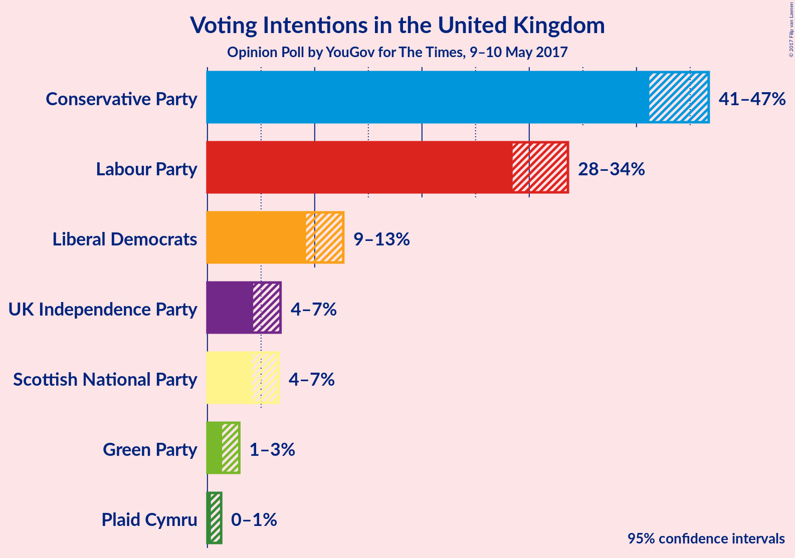
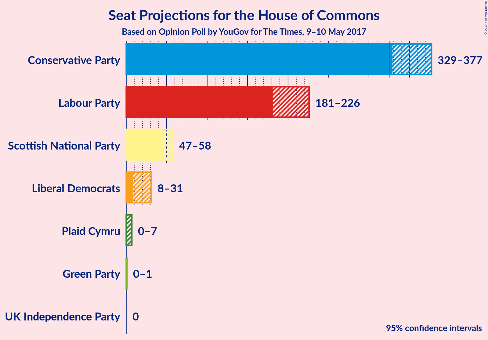
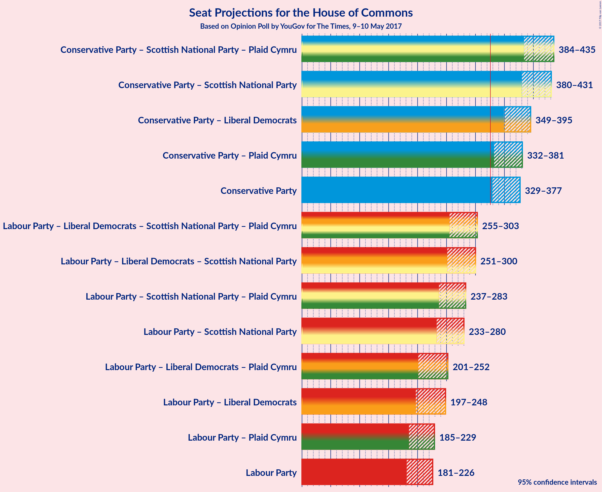

# Opinion Poll by YouGov for The Times, 9–10 May 2017

<a href="#voting-intentions">Voting Intentions</a> | <a href="#seats">Seats</a> | <a href="#coalitions">Coalitions</a> | <a href="#technical-information">Technical Information</a>

## Voting Intentions

### Confidence Intervals

| Party | Last Result | Poll Result | 80% Confidence Interval | 90% Confidence Interval | 95% Confidence Interval | 99% Confidence Interval |
|:-----:|:-----------:|:-----------:|:-----------------------:|:-----------------------:|:-----------------------:|:-----------------------:|
| Conservative Party | 36.9% | 44.4% | 42.2–45.8% |41.6–46.3% |41.2–46.7% |40.3–47.6% |
| Labour Party | 30.4% | 31.3% | 29.3–32.7% |28.9–33.2% |28.5–33.6% |27.7–34.4% |
| Liberal Democrats | 7.9% | 10.9% | 9.7–12.0% |9.4–12.4% |9.2–12.7% |8.7–13.3% |
| UK Independence Party | 12.6% | 5.5% | 4.7–6.3% |4.5–6.6% |4.3–6.8% |3.9–7.3% |
| Scottish National Party | 4.7% | 5.3% | 4.5–6.2% |4.3–6.4% |4.1–6.6% |3.8–7.1% |
| Green Party | 3.8% | 2.0% | 1.6–2.6% |1.5–2.8% |1.4–3.0% |1.2–3.3% |
| Plaid Cymru | 0.6% | 0.7% | 0.4–1.1% |0.4–1.2% |0.3–1.3% |0.2–1.5% |

*Note:* The poll result column reflects the actual value used in the calculations. Published results may vary slightly, and in addition be rounded to fewer digits.

## Seats

### Confidence Intervals

| Party | Last Result | Median | 80% Confidence Interval | 90% Confidence Interval | 95% Confidence Interval | 99% Confidence Interval |
|:-----:|:-----------:|:------:|:-----------------------:|:-----------------------:|:-----------------------:|:-----------------------:|
| <a href="#conservative-party">Conservative Party</a> | 331 | 351 | 337–369 |333–374 |329–377 |319–382 |
| <a href="#labour-party">Labour Party</a> | 232 | 206 | 187–217 |184–222 |181–226 |176–234 |
| <a href="#liberal-democrats">Liberal Democrats</a> | 8 | 18 | 10–27 |9–29 |8–31 |7–38 |
| <a href="#uk-independence-party">UK Independence Party</a> | 1 | 0 | 0 |0 |0 |0 |
| <a href="#scottish-national-party">Scottish National Party</a> | 56 | 53 | 49–58 |48–58 |47–58 |43–59 |
| <a href="#green-party">Green Party</a> | 1 | 0 | 0–1 |0–1 |0–1 |0–1 |
| <a href="#plaid-cymru">Plaid Cymru</a> | 3 | 4 | 3–5 |0–7 |0–7 |0–8 |

### Conservative Party

| Number of Seats | Probability | Accumulated |
|:---------------:|:-----------:|:-----------:|
| 308 | 0% | 100% |
| 309 | 0% | 99.9% |
| 310 | 0% | 99.9% |
| 311 | 0% | 99.9% |
| 312 | 0% | 99.9% |
| 313 | 0% | 99.9% |
| 314 | 0% | 99.8% |
| 315 | 0% | 99.8% |
| 316 | 0% | 99.7% |
| 317 | 0.1% | 99.7% |
| 318 | 0.1% | 99.6% |
| 319 | 0.1% | 99.6% |
| 320 | 0.1% | 99.5% |
| 321 | 0.1% | 99.3% |
| 322 | 0.2% | 99.2% |
| 323 | 0.1% | 99.0% |
| 324 | 0.3% | 98.9% |
| 325 | 0.3% | 98.7% |
| 326 | 0.2% | 98% |
| 327 | 0.4% | 98% |
| 328 | 0.3% | 98% |
| 329 | 0.6% | 98% |
| 330 | 0.4% | 97% |
| 331 | 0.6% | 96% |
| 332 | 0.5% | 96% |
| 333 | 0.8% | 95% |
| 334 | 0.9% | 95% |
| 335 | 1.1% | 94% |
| 336 | 1.2% | 93% |
| 337 | 3% | 91% |
| 338 | 1.4% | 89% |
| 339 | 3% | 88% |
| 340 | 2% | 85% |
| 341 | 3% | 82% |
| 342 | 4% | 79% |
| 343 | 2% | 75% |
| 344 | 4% | 73% |
| 345 | 3% | 68% |
| 346 | 4% | 65% |
| 347 | 3% | 62% |
| 348 | 2% | 58% |
| 349 | 3% | 56% |
| 350 | 3% | 54% |
| 351 | 2% | 51% |
| 352 | 2% | 48% |
| 353 | 2% | 47% |
| 354 | 3% | 45% |
| 355 | 3% | 42% |
| 356 | 2% | 39% |
| 357 | 4% | 37% |
| 358 | 2% | 34% |
| 359 | 3% | 32% |
| 360 | 2% | 29% |
| 361 | 2% | 26% |
| 362 | 3% | 24% |
| 363 | 3% | 22% |
| 364 | 2% | 19% |
| 365 | 2% | 18% |
| 366 | 2% | 16% |
| 367 | 2% | 14% |
| 368 | 1.3% | 12% |
| 369 | 1.3% | 11% |
| 370 | 1.2% | 10% |
| 371 | 1.2% | 9% |
| 372 | 1.0% | 7% |
| 373 | 0.9% | 6% |
| 374 | 1.1% | 6% |
| 375 | 0.7% | 4% |
| 376 | 0.9% | 4% |
| 377 | 0.4% | 3% |
| 378 | 0.6% | 2% |
| 379 | 0.5% | 2% |
| 380 | 0.4% | 1.3% |
| 381 | 0.2% | 0.9% |
| 382 | 0.2% | 0.6% |
| 383 | 0.1% | 0.4% |
| 384 | 0.1% | 0.3% |
| 385 | 0.1% | 0.3% |
| 386 | 0% | 0.2% |
| 387 | 0.1% | 0.2% |
| 388 | 0% | 0.1% |
| 389 | 0% | 0.1% |
| 390 | 0% | 0.1% |
| 391 | 0% | 0% |

### Labour Party

| Number of Seats | Probability | Accumulated |
|:---------------:|:-----------:|:-----------:|
| 168 | 0% | 100% |
| 169 | 0% | 99.9% |
| 170 | 0% | 99.9% |
| 171 | 0% | 99.9% |
| 172 | 0% | 99.8% |
| 173 | 0.1% | 99.8% |
| 174 | 0.1% | 99.7% |
| 175 | 0.1% | 99.6% |
| 176 | 0.1% | 99.5% |
| 177 | 0.2% | 99.4% |
| 178 | 0.4% | 99.2% |
| 179 | 0.4% | 98.8% |
| 180 | 0.8% | 98% |
| 181 | 0.9% | 98% |
| 182 | 0.9% | 97% |
| 183 | 0.8% | 96% |
| 184 | 0.9% | 95% |
| 185 | 1.0% | 94% |
| 186 | 1.0% | 93% |
| 187 | 2% | 92% |
| 188 | 0.9% | 90% |
| 189 | 1.0% | 89% |
| 190 | 1.4% | 88% |
| 191 | 1.4% | 87% |
| 192 | 2% | 85% |
| 193 | 2% | 83% |
| 194 | 1.5% | 81% |
| 195 | 3% | 79% |
| 196 | 3% | 77% |
| 197 | 3% | 74% |
| 198 | 3% | 71% |
| 199 | 3% | 67% |
| 200 | 3% | 64% |
| 201 | 3% | 61% |
| 202 | 2% | 58% |
| 203 | 2% | 56% |
| 204 | 2% | 54% |
| 205 | 1.2% | 52% |
| 206 | 1.5% | 51% |
| 207 | 3% | 49% |
| 208 | 2% | 47% |
| 209 | 3% | 44% |
| 210 | 5% | 41% |
| 211 | 5% | 36% |
| 212 | 3% | 31% |
| 213 | 4% | 27% |
| 214 | 4% | 24% |
| 215 | 4% | 20% |
| 216 | 4% | 16% |
| 217 | 3% | 13% |
| 218 | 2% | 10% |
| 219 | 2% | 8% |
| 220 | 0.8% | 6% |
| 221 | 0.5% | 6% |
| 222 | 0.5% | 5% |
| 223 | 0.8% | 5% |
| 224 | 0.5% | 4% |
| 225 | 0.7% | 3% |
| 226 | 0.3% | 3% |
| 227 | 0.4% | 2% |
| 228 | 0.3% | 2% |
| 229 | 0.2% | 2% |
| 230 | 0.3% | 1.3% |
| 231 | 0.2% | 1.1% |
| 232 | 0.2% | 0.9% |
| 233 | 0.1% | 0.7% |
| 234 | 0.1% | 0.6% |
| 235 | 0.1% | 0.5% |
| 236 | 0.1% | 0.4% |
| 237 | 0.1% | 0.3% |
| 238 | 0.1% | 0.3% |
| 239 | 0% | 0.2% |
| 240 | 0% | 0.2% |
| 241 | 0% | 0.1% |
| 242 | 0% | 0.1% |
| 243 | 0% | 0.1% |
| 244 | 0% | 0.1% |
| 245 | 0% | 0.1% |
| 246 | 0% | 0% |

### Liberal Democrats

| Number of Seats | Probability | Accumulated |
|:---------------:|:-----------:|:-----------:|
| 5 | 0.1% | 100% |
| 6 | 0.2% | 99.9% |
| 7 | 0.5% | 99.7% |
| 8 | 2% | 99.1% |
| 9 | 5% | 97% |
| 10 | 3% | 93% |
| 11 | 4% | 90% |
| 12 | 3% | 86% |
| 13 | 3% | 83% |
| 14 | 5% | 80% |
| 15 | 6% | 75% |
| 16 | 6% | 68% |
| 17 | 6% | 62% |
| 18 | 6% | 56% |
| 19 | 7% | 50% |
| 20 | 6% | 43% |
| 21 | 6% | 36% |
| 22 | 5% | 30% |
| 23 | 5% | 25% |
| 24 | 4% | 20% |
| 25 | 2% | 16% |
| 26 | 2% | 13% |
| 27 | 3% | 11% |
| 28 | 2% | 8% |
| 29 | 2% | 6% |
| 30 | 1.3% | 4% |
| 31 | 0.8% | 3% |
| 32 | 0.6% | 2% |
| 33 | 0.3% | 2% |
| 34 | 0.3% | 1.4% |
| 35 | 0.3% | 1.1% |
| 36 | 0.2% | 0.9% |
| 37 | 0.1% | 0.7% |
| 38 | 0.2% | 0.6% |
| 39 | 0.2% | 0.4% |
| 40 | 0% | 0.2% |
| 41 | 0.1% | 0.2% |
| 42 | 0% | 0.1% |
| 43 | 0% | 0% |

### UK Independence Party

| Number of Seats | Probability | Accumulated |
|:---------------:|:-----------:|:-----------:|
| 0 | 100% | 100% |
| 1 | 0% | 0% |

### Scottish National Party

| Number of Seats | Probability | Accumulated |
|:---------------:|:-----------:|:-----------:|
| 39 | 0% | 100% |
| 40 | 0.1% | 99.9% |
| 41 | 0.1% | 99.8% |
| 42 | 0.2% | 99.7% |
| 43 | 0.2% | 99.6% |
| 44 | 0.3% | 99.4% |
| 45 | 0.3% | 99.1% |
| 46 | 0.9% | 98.7% |
| 47 | 3% | 98% |
| 48 | 1.4% | 95% |
| 49 | 8% | 94% |
| 50 | 14% | 86% |
| 51 | 4% | 72% |
| 52 | 3% | 69% |
| 53 | 18% | 66% |
| 54 | 11% | 47% |
| 55 | 8% | 36% |
| 56 | 7% | 28% |
| 57 | 6% | 21% |
| 58 | 13% | 15% |
| 59 | 2% | 2% |
| 60 | 0% | 0% |

### Green Party

| Number of Seats | Probability | Accumulated |
|:---------------:|:-----------:|:-----------:|
| 0 | 86% | 100% |
| 1 | 14% | 14% |
| 2 | 0% | 0% |

### Plaid Cymru

| Number of Seats | Probability | Accumulated |
|:---------------:|:-----------:|:-----------:|
| 0 | 5% | 100% |
| 1 | 1.0% | 95% |
| 2 | 2% | 94% |
| 3 | 27% | 91% |
| 4 | 52% | 64% |
| 5 | 4% | 11% |
| 6 | 2% | 8% |
| 7 | 5% | 5% |
| 8 | 0.7% | 0.8% |
| 9 | 0% | 0.1% |
| 10 | 0% | 0.1% |
| 11 | 0% | 0% |

## Coalitions

### Confidence Intervals

| Coalition | Last Result | Median | 80% Confidence Interval | 90% Confidence Interval | 95% Confidence Interval | 99% Confidence Interval |
|:---------:|:-----------:|:------:|:-----------------------:|:-----------------------:|:-----------------------:|:-----------------------:|
| Conservative Party – Scottish National Party – Plaid Cymru | 390 | 408 | 393–427 | 388–432 | 384–435 | 374–441 |
| Conservative Party – Scottish National Party | 387 | 404 | 389–423 | 385–428 | 380–431 | 371–437 |
| Conservative Party – Liberal Democrats | 339 | 370 | 356–388 | 353–392 | 349–395 | 340–401 |
| Conservative Party – Plaid Cymru | 334 | 354 | 341–373 | 337–378 | 332–381 | 323–386 |
| Conservative Party | 331 | 351 | 337–369 | 333–374 | 329–377 | 319–382 |
| Labour Party – Liberal Democrats – Scottish National Party – Plaid Cymru | 299 | 281 | 263–295 | 258–299 | 255–303 | 250–313 |
| Labour Party – Liberal Democrats – Scottish National Party | 296 | 277 | 259–291 | 254–295 | 251–300 | 246–309 |
| Labour Party – Scottish National Party – Plaid Cymru | 291 | 262 | 244–276 | 240–279 | 237–283 | 231–292 |
| Labour Party – Scottish National Party | 288 | 259 | 241–272 | 236–275 | 233–280 | 227–288 |
| Labour Party – Liberal Democrats – Plaid Cymru | 243 | 227 | 209–242 | 204–247 | 201–252 | 195–261 |
| Labour Party – Liberal Democrats | 240 | 224 | 205–239 | 200–244 | 197–248 | 191–258 |
| Labour Party – Plaid Cymru | 235 | 210 | 191–221 | 187–225 | 185–229 | 180–237 |
| Labour Party | 232 | 206 | 187–217 | 184–222 | 181–226 | 176–234 |

### Conservative Party – Scottish National Party – Plaid Cymru

| Number of Seats | Probability | Accumulated |
|:---------------:|:-----------:|:-----------:|
| 363 | 0% | 100% |
| 364 | 0% | 99.9% |
| 365 | 0% | 99.9% |
| 366 | 0% | 99.9% |
| 367 | 0% | 99.9% |
| 368 | 0% | 99.9% |
| 369 | 0% | 99.8% |
| 370 | 0% | 99.8% |
| 371 | 0% | 99.7% |
| 372 | 0.1% | 99.7% |
| 373 | 0.1% | 99.7% |
| 374 | 0.1% | 99.6% |
| 375 | 0.1% | 99.5% |
| 376 | 0.1% | 99.4% |
| 377 | 0.1% | 99.3% |
| 378 | 0.2% | 99.2% |
| 379 | 0.2% | 99.0% |
| 380 | 0.2% | 98.8% |
| 381 | 0.2% | 98.6% |
| 382 | 0.4% | 98% |
| 383 | 0.4% | 98% |
| 384 | 0.5% | 98% |
| 385 | 0.5% | 97% |
| 386 | 0.4% | 97% |
| 387 | 0.8% | 96% |
| 388 | 0.8% | 95% |
| 389 | 0.7% | 95% |
| 390 | 1.1% | 94% |
| 391 | 1.3% | 93% |
| 392 | 0.9% | 92% |
| 393 | 1.3% | 91% |
| 394 | 2% | 89% |
| 395 | 2% | 88% |
| 396 | 3% | 85% |
| 397 | 2% | 82% |
| 398 | 4% | 81% |
| 399 | 3% | 77% |
| 400 | 2% | 74% |
| 401 | 3% | 72% |
| 402 | 3% | 68% |
| 403 | 3% | 66% |
| 404 | 3% | 62% |
| 405 | 3% | 60% |
| 406 | 2% | 56% |
| 407 | 2% | 54% |
| 408 | 3% | 52% |
| 409 | 2% | 49% |
| 410 | 3% | 47% |
| 411 | 3% | 44% |
| 412 | 2% | 41% |
| 413 | 3% | 39% |
| 414 | 4% | 37% |
| 415 | 2% | 33% |
| 416 | 2% | 32% |
| 417 | 2% | 30% |
| 418 | 2% | 27% |
| 419 | 2% | 25% |
| 420 | 3% | 23% |
| 421 | 2% | 20% |
| 422 | 2% | 18% |
| 423 | 2% | 17% |
| 424 | 2% | 15% |
| 425 | 2% | 13% |
| 426 | 1.3% | 11% |
| 427 | 1.4% | 10% |
| 428 | 0.8% | 9% |
| 429 | 0.8% | 8% |
| 430 | 1.0% | 7% |
| 431 | 0.7% | 6% |
| 432 | 0.7% | 5% |
| 433 | 0.9% | 5% |
| 434 | 0.7% | 4% |
| 435 | 0.6% | 3% |
| 436 | 0.5% | 2% |
| 437 | 0.4% | 2% |
| 438 | 0.3% | 1.5% |
| 439 | 0.2% | 1.1% |
| 440 | 0.3% | 0.9% |
| 441 | 0.2% | 0.6% |
| 442 | 0.1% | 0.4% |
| 443 | 0.1% | 0.3% |
| 444 | 0% | 0.2% |
| 445 | 0% | 0.2% |
| 446 | 0.1% | 0.2% |
| 447 | 0% | 0.1% |
| 448 | 0% | 0.1% |
| 449 | 0% | 0.1% |
| 450 | 0% | 0% |

### Conservative Party – Scottish National Party

| Number of Seats | Probability | Accumulated |
|:---------------:|:-----------:|:-----------:|
| 359 | 0% | 100% |
| 360 | 0% | 99.9% |
| 361 | 0% | 99.9% |
| 362 | 0% | 99.9% |
| 363 | 0% | 99.9% |
| 364 | 0% | 99.9% |
| 365 | 0% | 99.9% |
| 366 | 0% | 99.8% |
| 367 | 0.1% | 99.8% |
| 368 | 0.1% | 99.7% |
| 369 | 0.1% | 99.7% |
| 370 | 0.1% | 99.6% |
| 371 | 0.1% | 99.5% |
| 372 | 0.1% | 99.4% |
| 373 | 0.1% | 99.3% |
| 374 | 0.2% | 99.3% |
| 375 | 0.1% | 99.1% |
| 376 | 0.3% | 98.9% |
| 377 | 0.1% | 98.6% |
| 378 | 0.3% | 98% |
| 379 | 0.4% | 98% |
| 380 | 0.4% | 98% |
| 381 | 0.4% | 97% |
| 382 | 0.5% | 97% |
| 383 | 0.7% | 96% |
| 384 | 0.6% | 96% |
| 385 | 0.8% | 95% |
| 386 | 0.9% | 94% |
| 387 | 1.1% | 93% |
| 388 | 1.0% | 92% |
| 389 | 1.3% | 91% |
| 390 | 1.5% | 90% |
| 391 | 2% | 88% |
| 392 | 2% | 86% |
| 393 | 3% | 84% |
| 394 | 2% | 81% |
| 395 | 3% | 79% |
| 396 | 3% | 76% |
| 397 | 3% | 72% |
| 398 | 3% | 69% |
| 399 | 4% | 67% |
| 400 | 3% | 63% |
| 401 | 3% | 61% |
| 402 | 3% | 58% |
| 403 | 2% | 55% |
| 404 | 3% | 53% |
| 405 | 2% | 50% |
| 406 | 2% | 47% |
| 407 | 3% | 45% |
| 408 | 2% | 42% |
| 409 | 3% | 40% |
| 410 | 3% | 37% |
| 411 | 1.5% | 34% |
| 412 | 3% | 33% |
| 413 | 2% | 30% |
| 414 | 3% | 28% |
| 415 | 2% | 26% |
| 416 | 3% | 24% |
| 417 | 2% | 21% |
| 418 | 2% | 19% |
| 419 | 2% | 17% |
| 420 | 1.4% | 15% |
| 421 | 2% | 14% |
| 422 | 1.2% | 12% |
| 423 | 1.3% | 10% |
| 424 | 1.3% | 9% |
| 425 | 0.9% | 8% |
| 426 | 0.9% | 7% |
| 427 | 0.9% | 6% |
| 428 | 0.6% | 5% |
| 429 | 1.0% | 5% |
| 430 | 0.7% | 4% |
| 431 | 0.6% | 3% |
| 432 | 0.4% | 2% |
| 433 | 0.5% | 2% |
| 434 | 0.3% | 1.5% |
| 435 | 0.2% | 1.1% |
| 436 | 0.3% | 0.9% |
| 437 | 0.2% | 0.6% |
| 438 | 0.1% | 0.4% |
| 439 | 0.1% | 0.3% |
| 440 | 0.1% | 0.2% |
| 441 | 0% | 0.2% |
| 442 | 0% | 0.1% |
| 443 | 0% | 0.1% |
| 444 | 0% | 0.1% |
| 445 | 0% | 0% |

### Conservative Party – Liberal Democrats

| Number of Seats | Probability | Accumulated |
|:---------------:|:-----------:|:-----------:|
| 329 | 0% | 100% |
| 330 | 0% | 99.9% |
| 331 | 0% | 99.9% |
| 332 | 0% | 99.9% |
| 333 | 0% | 99.9% |
| 334 | 0% | 99.9% |
| 335 | 0% | 99.8% |
| 336 | 0.1% | 99.8% |
| 337 | 0.1% | 99.7% |
| 338 | 0.1% | 99.7% |
| 339 | 0.1% | 99.6% |
| 340 | 0.1% | 99.6% |
| 341 | 0.1% | 99.5% |
| 342 | 0.1% | 99.3% |
| 343 | 0.2% | 99.2% |
| 344 | 0.2% | 99.0% |
| 345 | 0.3% | 98.9% |
| 346 | 0.4% | 98.6% |
| 347 | 0.4% | 98% |
| 348 | 0.3% | 98% |
| 349 | 0.6% | 98% |
| 350 | 0.4% | 97% |
| 351 | 0.4% | 96% |
| 352 | 0.6% | 96% |
| 353 | 0.9% | 95% |
| 354 | 1.2% | 95% |
| 355 | 2% | 93% |
| 356 | 2% | 92% |
| 357 | 3% | 89% |
| 358 | 4% | 87% |
| 359 | 2% | 83% |
| 360 | 2% | 81% |
| 361 | 2% | 79% |
| 362 | 3% | 76% |
| 363 | 4% | 73% |
| 364 | 5% | 69% |
| 365 | 4% | 64% |
| 366 | 2% | 60% |
| 367 | 2% | 58% |
| 368 | 2% | 55% |
| 369 | 3% | 53% |
| 370 | 3% | 50% |
| 371 | 3% | 48% |
| 372 | 3% | 45% |
| 373 | 2% | 42% |
| 374 | 3% | 40% |
| 375 | 3% | 37% |
| 376 | 3% | 35% |
| 377 | 2% | 31% |
| 378 | 3% | 30% |
| 379 | 2% | 27% |
| 380 | 3% | 25% |
| 381 | 3% | 22% |
| 382 | 2% | 19% |
| 383 | 2% | 17% |
| 384 | 2% | 16% |
| 385 | 1.2% | 14% |
| 386 | 1.3% | 13% |
| 387 | 1.2% | 12% |
| 388 | 2% | 10% |
| 389 | 1.0% | 9% |
| 390 | 1.0% | 8% |
| 391 | 1.3% | 7% |
| 392 | 1.2% | 5% |
| 393 | 0.7% | 4% |
| 394 | 0.5% | 3% |
| 395 | 0.7% | 3% |
| 396 | 0.4% | 2% |
| 397 | 0.3% | 2% |
| 398 | 0.4% | 1.5% |
| 399 | 0.2% | 1.1% |
| 400 | 0.2% | 0.8% |
| 401 | 0.2% | 0.7% |
| 402 | 0.1% | 0.5% |
| 403 | 0.1% | 0.4% |
| 404 | 0.1% | 0.3% |
| 405 | 0% | 0.2% |
| 406 | 0% | 0.1% |
| 407 | 0% | 0.1% |
| 408 | 0% | 0.1% |
| 409 | 0% | 0.1% |
| 410 | 0% | 0% |

### Conservative Party – Plaid Cymru

| Number of Seats | Probability | Accumulated |
|:---------------:|:-----------:|:-----------:|
| 312 | 0% | 100% |
| 313 | 0% | 99.9% |
| 314 | 0% | 99.9% |
| 315 | 0% | 99.9% |
| 316 | 0% | 99.9% |
| 317 | 0% | 99.8% |
| 318 | 0% | 99.8% |
| 319 | 0% | 99.8% |
| 320 | 0.1% | 99.7% |
| 321 | 0.1% | 99.7% |
| 322 | 0.1% | 99.6% |
| 323 | 0.1% | 99.5% |
| 324 | 0.2% | 99.4% |
| 325 | 0.1% | 99.3% |
| 326 | 0.2% | 99.1% |
| 327 | 0.2% | 99.0% |
| 328 | 0.2% | 98.8% |
| 329 | 0.3% | 98.6% |
| 330 | 0.3% | 98% |
| 331 | 0.3% | 98% |
| 332 | 0.3% | 98% |
| 333 | 0.7% | 97% |
| 334 | 0.4% | 97% |
| 335 | 0.6% | 96% |
| 336 | 0.6% | 96% |
| 337 | 0.9% | 95% |
| 338 | 1.0% | 94% |
| 339 | 0.9% | 93% |
| 340 | 2% | 92% |
| 341 | 2% | 90% |
| 342 | 2% | 88% |
| 343 | 2% | 86% |
| 344 | 3% | 84% |
| 345 | 3% | 81% |
| 346 | 4% | 77% |
| 347 | 2% | 74% |
| 348 | 4% | 71% |
| 349 | 3% | 67% |
| 350 | 4% | 64% |
| 351 | 3% | 60% |
| 352 | 2% | 57% |
| 353 | 3% | 56% |
| 354 | 3% | 53% |
| 355 | 2% | 50% |
| 356 | 2% | 48% |
| 357 | 2% | 46% |
| 358 | 2% | 44% |
| 359 | 3% | 42% |
| 360 | 3% | 39% |
| 361 | 3% | 36% |
| 362 | 2% | 33% |
| 363 | 3% | 31% |
| 364 | 2% | 28% |
| 365 | 2% | 26% |
| 366 | 3% | 24% |
| 367 | 2% | 21% |
| 368 | 1.4% | 19% |
| 369 | 2% | 17% |
| 370 | 2% | 15% |
| 371 | 1.3% | 14% |
| 372 | 2% | 12% |
| 373 | 1.1% | 11% |
| 374 | 1.0% | 10% |
| 375 | 1.2% | 9% |
| 376 | 1.0% | 7% |
| 377 | 1.1% | 6% |
| 378 | 0.8% | 5% |
| 379 | 0.8% | 4% |
| 380 | 0.8% | 4% |
| 381 | 0.6% | 3% |
| 382 | 0.6% | 2% |
| 383 | 0.5% | 2% |
| 384 | 0.2% | 1.2% |
| 385 | 0.3% | 0.9% |
| 386 | 0.2% | 0.7% |
| 387 | 0.1% | 0.5% |
| 388 | 0.1% | 0.3% |
| 389 | 0.1% | 0.3% |
| 390 | 0.1% | 0.2% |
| 391 | 0.1% | 0.2% |
| 392 | 0% | 0.1% |
| 393 | 0% | 0.1% |
| 394 | 0% | 0.1% |
| 395 | 0% | 0.1% |
| 396 | 0% | 0% |

### Conservative Party

| Number of Seats | Probability | Accumulated |
|:---------------:|:-----------:|:-----------:|
| 308 | 0% | 100% |
| 309 | 0% | 99.9% |
| 310 | 0% | 99.9% |
| 311 | 0% | 99.9% |
| 312 | 0% | 99.9% |
| 313 | 0% | 99.9% |
| 314 | 0% | 99.8% |
| 315 | 0% | 99.8% |
| 316 | 0% | 99.7% |
| 317 | 0.1% | 99.7% |
| 318 | 0.1% | 99.6% |
| 319 | 0.1% | 99.6% |
| 320 | 0.1% | 99.5% |
| 321 | 0.1% | 99.3% |
| 322 | 0.2% | 99.2% |
| 323 | 0.1% | 99.0% |
| 324 | 0.3% | 98.9% |
| 325 | 0.3% | 98.7% |
| 326 | 0.2% | 98% |
| 327 | 0.4% | 98% |
| 328 | 0.3% | 98% |
| 329 | 0.6% | 98% |
| 330 | 0.4% | 97% |
| 331 | 0.6% | 96% |
| 332 | 0.5% | 96% |
| 333 | 0.8% | 95% |
| 334 | 0.9% | 95% |
| 335 | 1.1% | 94% |
| 336 | 1.2% | 93% |
| 337 | 3% | 91% |
| 338 | 1.4% | 89% |
| 339 | 3% | 88% |
| 340 | 2% | 85% |
| 341 | 3% | 82% |
| 342 | 4% | 79% |
| 343 | 2% | 75% |
| 344 | 4% | 73% |
| 345 | 3% | 68% |
| 346 | 4% | 65% |
| 347 | 3% | 62% |
| 348 | 2% | 58% |
| 349 | 3% | 56% |
| 350 | 3% | 54% |
| 351 | 2% | 51% |
| 352 | 2% | 48% |
| 353 | 2% | 47% |
| 354 | 3% | 45% |
| 355 | 3% | 42% |
| 356 | 2% | 39% |
| 357 | 4% | 37% |
| 358 | 2% | 34% |
| 359 | 3% | 32% |
| 360 | 2% | 29% |
| 361 | 2% | 26% |
| 362 | 3% | 24% |
| 363 | 3% | 22% |
| 364 | 2% | 19% |
| 365 | 2% | 18% |
| 366 | 2% | 16% |
| 367 | 2% | 14% |
| 368 | 1.3% | 12% |
| 369 | 1.3% | 11% |
| 370 | 1.2% | 10% |
| 371 | 1.2% | 9% |
| 372 | 1.0% | 7% |
| 373 | 0.9% | 6% |
| 374 | 1.1% | 6% |
| 375 | 0.7% | 4% |
| 376 | 0.9% | 4% |
| 377 | 0.4% | 3% |
| 378 | 0.6% | 2% |
| 379 | 0.5% | 2% |
| 380 | 0.4% | 1.3% |
| 381 | 0.2% | 0.9% |
| 382 | 0.2% | 0.6% |
| 383 | 0.1% | 0.4% |
| 384 | 0.1% | 0.3% |
| 385 | 0.1% | 0.3% |
| 386 | 0% | 0.2% |
| 387 | 0.1% | 0.2% |
| 388 | 0% | 0.1% |
| 389 | 0% | 0.1% |
| 390 | 0% | 0.1% |
| 391 | 0% | 0% |

### Labour Party – Liberal Democrats – Scottish National Party – Plaid Cymru

| Number of Seats | Probability | Accumulated |
|:---------------:|:-----------:|:-----------:|
| 242 | 0% | 100% |
| 243 | 0% | 99.9% |
| 244 | 0% | 99.9% |
| 245 | 0.1% | 99.9% |
| 246 | 0% | 99.8% |
| 247 | 0.1% | 99.8% |
| 248 | 0.1% | 99.7% |
| 249 | 0.1% | 99.7% |
| 250 | 0.2% | 99.6% |
| 251 | 0.2% | 99.3% |
| 252 | 0.5% | 99.1% |
| 253 | 0.5% | 98.7% |
| 254 | 0.7% | 98% |
| 255 | 0.4% | 98% |
| 256 | 0.9% | 97% |
| 257 | 0.8% | 96% |
| 258 | 1.0% | 95% |
| 259 | 1.1% | 94% |
| 260 | 0.9% | 93% |
| 261 | 1.2% | 92% |
| 262 | 1.1% | 91% |
| 263 | 1.4% | 90% |
| 264 | 1.3% | 89% |
| 265 | 1.4% | 87% |
| 266 | 2% | 86% |
| 267 | 2% | 84% |
| 268 | 2% | 82% |
| 269 | 3% | 81% |
| 270 | 3% | 78% |
| 271 | 2% | 75% |
| 272 | 2% | 73% |
| 273 | 3% | 71% |
| 274 | 2% | 68% |
| 275 | 4% | 66% |
| 276 | 2% | 62% |
| 277 | 3% | 60% |
| 278 | 2% | 57% |
| 279 | 2% | 55% |
| 280 | 1.4% | 53% |
| 281 | 3% | 51% |
| 282 | 2% | 49% |
| 283 | 3% | 46% |
| 284 | 2% | 43% |
| 285 | 3% | 41% |
| 286 | 3% | 38% |
| 287 | 3% | 35% |
| 288 | 5% | 31% |
| 289 | 2% | 27% |
| 290 | 4% | 25% |
| 291 | 3% | 21% |
| 292 | 2% | 17% |
| 293 | 3% | 15% |
| 294 | 2% | 12% |
| 295 | 2% | 11% |
| 296 | 1.2% | 8% |
| 297 | 0.9% | 7% |
| 298 | 0.9% | 6% |
| 299 | 0.8% | 5% |
| 300 | 0.6% | 5% |
| 301 | 0.5% | 4% |
| 302 | 0.4% | 3% |
| 303 | 0.6% | 3% |
| 304 | 0.3% | 2% |
| 305 | 0.4% | 2% |
| 306 | 0.2% | 2% |
| 307 | 0.2% | 2% |
| 308 | 0.3% | 1.3% |
| 309 | 0.1% | 1.1% |
| 310 | 0.2% | 0.9% |
| 311 | 0.1% | 0.8% |
| 312 | 0.1% | 0.7% |
| 313 | 0.1% | 0.5% |
| 314 | 0.1% | 0.4% |
| 315 | 0.1% | 0.3% |
| 316 | 0% | 0.3% |
| 317 | 0% | 0.3% |
| 318 | 0% | 0.2% |
| 319 | 0% | 0.2% |
| 320 | 0% | 0.1% |
| 321 | 0% | 0.1% |
| 322 | 0% | 0.1% |
| 323 | 0% | 0.1% |
| 324 | 0% | 0.1% |
| 325 | 0% | 0% |

### Labour Party – Liberal Democrats – Scottish National Party

| Number of Seats | Probability | Accumulated |
|:---------------:|:-----------:|:-----------:|
| 237 | 0% | 100% |
| 238 | 0% | 99.9% |
| 239 | 0% | 99.9% |
| 240 | 0% | 99.9% |
| 241 | 0.1% | 99.9% |
| 242 | 0.1% | 99.8% |
| 243 | 0.1% | 99.8% |
| 244 | 0.1% | 99.7% |
| 245 | 0.1% | 99.6% |
| 246 | 0.2% | 99.5% |
| 247 | 0.3% | 99.3% |
| 248 | 0.3% | 99.0% |
| 249 | 0.5% | 98.8% |
| 250 | 0.5% | 98% |
| 251 | 0.6% | 98% |
| 252 | 0.8% | 97% |
| 253 | 0.8% | 96% |
| 254 | 0.9% | 95% |
| 255 | 1.0% | 95% |
| 256 | 1.1% | 94% |
| 257 | 1.2% | 92% |
| 258 | 1.0% | 91% |
| 259 | 1.2% | 90% |
| 260 | 2% | 89% |
| 261 | 1.0% | 87% |
| 262 | 2% | 86% |
| 263 | 2% | 85% |
| 264 | 1.4% | 82% |
| 265 | 2% | 81% |
| 266 | 3% | 79% |
| 267 | 2% | 76% |
| 268 | 2% | 73% |
| 269 | 3% | 72% |
| 270 | 2% | 69% |
| 271 | 3% | 66% |
| 272 | 2% | 63% |
| 273 | 2% | 61% |
| 274 | 3% | 58% |
| 275 | 2% | 56% |
| 276 | 2% | 54% |
| 277 | 2% | 52% |
| 278 | 3% | 50% |
| 279 | 3% | 46% |
| 280 | 2% | 44% |
| 281 | 3% | 42% |
| 282 | 3% | 39% |
| 283 | 3% | 35% |
| 284 | 4% | 33% |
| 285 | 2% | 28% |
| 286 | 4% | 26% |
| 287 | 3% | 22% |
| 288 | 3% | 19% |
| 289 | 2% | 16% |
| 290 | 2% | 14% |
| 291 | 2% | 12% |
| 292 | 2% | 9% |
| 293 | 0.9% | 8% |
| 294 | 0.9% | 7% |
| 295 | 0.8% | 6% |
| 296 | 0.6% | 5% |
| 297 | 0.6% | 4% |
| 298 | 0.4% | 4% |
| 299 | 0.7% | 3% |
| 300 | 0.3% | 3% |
| 301 | 0.3% | 2% |
| 302 | 0.3% | 2% |
| 303 | 0.2% | 2% |
| 304 | 0.2% | 1.4% |
| 305 | 0.2% | 1.2% |
| 306 | 0.1% | 1.0% |
| 307 | 0.1% | 0.9% |
| 308 | 0.2% | 0.7% |
| 309 | 0.1% | 0.6% |
| 310 | 0.1% | 0.5% |
| 311 | 0% | 0.4% |
| 312 | 0.1% | 0.3% |
| 313 | 0% | 0.3% |
| 314 | 0% | 0.2% |
| 315 | 0% | 0.2% |
| 316 | 0% | 0.2% |
| 317 | 0% | 0.1% |
| 318 | 0% | 0.1% |
| 319 | 0% | 0.1% |
| 320 | 0% | 0.1% |
| 321 | 0% | 0% |

### Labour Party – Scottish National Party – Plaid Cymru

| Number of Seats | Probability | Accumulated |
|:---------------:|:-----------:|:-----------:|
| 223 | 0% | 100% |
| 224 | 0% | 99.9% |
| 225 | 0% | 99.9% |
| 226 | 0% | 99.9% |
| 227 | 0.1% | 99.9% |
| 228 | 0.1% | 99.8% |
| 229 | 0.1% | 99.7% |
| 230 | 0.1% | 99.6% |
| 231 | 0.2% | 99.5% |
| 232 | 0.2% | 99.3% |
| 233 | 0.2% | 99.1% |
| 234 | 0.4% | 98.9% |
| 235 | 0.4% | 98% |
| 236 | 0.4% | 98% |
| 237 | 0.7% | 98% |
| 238 | 0.6% | 97% |
| 239 | 0.7% | 97% |
| 240 | 1.3% | 96% |
| 241 | 1.4% | 95% |
| 242 | 0.9% | 93% |
| 243 | 1.0% | 92% |
| 244 | 2% | 91% |
| 245 | 1.4% | 90% |
| 246 | 1.3% | 88% |
| 247 | 1.2% | 87% |
| 248 | 2% | 86% |
| 249 | 2% | 84% |
| 250 | 2% | 83% |
| 251 | 3% | 80% |
| 252 | 3% | 78% |
| 253 | 2% | 74% |
| 254 | 3% | 72% |
| 255 | 2% | 70% |
| 256 | 4% | 68% |
| 257 | 3% | 65% |
| 258 | 3% | 62% |
| 259 | 2% | 59% |
| 260 | 3% | 57% |
| 261 | 2% | 54% |
| 262 | 3% | 52% |
| 263 | 3% | 49% |
| 264 | 2% | 46% |
| 265 | 2% | 44% |
| 266 | 2% | 42% |
| 267 | 5% | 40% |
| 268 | 5% | 35% |
| 269 | 4% | 30% |
| 270 | 3% | 26% |
| 271 | 2% | 23% |
| 272 | 3% | 21% |
| 273 | 2% | 19% |
| 274 | 4% | 16% |
| 275 | 3% | 13% |
| 276 | 2% | 10% |
| 277 | 2% | 8% |
| 278 | 1.1% | 6% |
| 279 | 0.9% | 5% |
| 280 | 0.6% | 4% |
| 281 | 0.4% | 4% |
| 282 | 0.4% | 3% |
| 283 | 0.6% | 3% |
| 284 | 0.3% | 2% |
| 285 | 0.4% | 2% |
| 286 | 0.4% | 2% |
| 287 | 0.3% | 1.4% |
| 288 | 0.2% | 1.1% |
| 289 | 0.2% | 1.0% |
| 290 | 0.1% | 0.8% |
| 291 | 0.1% | 0.7% |
| 292 | 0.1% | 0.5% |
| 293 | 0.1% | 0.4% |
| 294 | 0.1% | 0.4% |
| 295 | 0.1% | 0.3% |
| 296 | 0.1% | 0.3% |
| 297 | 0% | 0.2% |
| 298 | 0% | 0.2% |
| 299 | 0% | 0.1% |
| 300 | 0% | 0.1% |
| 301 | 0% | 0.1% |
| 302 | 0% | 0.1% |
| 303 | 0% | 0.1% |
| 304 | 0% | 0% |

### Labour Party – Scottish National Party

| Number of Seats | Probability | Accumulated |
|:---------------:|:-----------:|:-----------:|
| 219 | 0% | 100% |
| 220 | 0% | 99.9% |
| 221 | 0% | 99.9% |
| 222 | 0% | 99.9% |
| 223 | 0% | 99.9% |
| 224 | 0.1% | 99.8% |
| 225 | 0.1% | 99.7% |
| 226 | 0.1% | 99.6% |
| 227 | 0.2% | 99.5% |
| 228 | 0.2% | 99.3% |
| 229 | 0.2% | 99.2% |
| 230 | 0.4% | 98.9% |
| 231 | 0.4% | 98.5% |
| 232 | 0.4% | 98% |
| 233 | 0.5% | 98% |
| 234 | 0.7% | 97% |
| 235 | 0.6% | 97% |
| 236 | 1.1% | 96% |
| 237 | 1.3% | 95% |
| 238 | 1.1% | 93% |
| 239 | 1.0% | 92% |
| 240 | 1.1% | 91% |
| 241 | 2% | 90% |
| 242 | 1.4% | 89% |
| 243 | 1.4% | 87% |
| 244 | 2% | 86% |
| 245 | 1.4% | 84% |
| 246 | 2% | 83% |
| 247 | 3% | 81% |
| 248 | 3% | 78% |
| 249 | 2% | 75% |
| 250 | 3% | 73% |
| 251 | 3% | 71% |
| 252 | 3% | 68% |
| 253 | 3% | 65% |
| 254 | 3% | 63% |
| 255 | 2% | 60% |
| 256 | 2% | 58% |
| 257 | 3% | 55% |
| 258 | 2% | 52% |
| 259 | 3% | 50% |
| 260 | 2% | 47% |
| 261 | 2% | 45% |
| 262 | 3% | 43% |
| 263 | 4% | 40% |
| 264 | 4% | 36% |
| 265 | 3% | 32% |
| 266 | 3% | 29% |
| 267 | 4% | 25% |
| 268 | 3% | 22% |
| 269 | 2% | 19% |
| 270 | 4% | 17% |
| 271 | 2% | 14% |
| 272 | 3% | 11% |
| 273 | 2% | 9% |
| 274 | 1.2% | 7% |
| 275 | 1.0% | 6% |
| 276 | 0.6% | 5% |
| 277 | 0.6% | 4% |
| 278 | 0.4% | 4% |
| 279 | 0.6% | 3% |
| 280 | 0.3% | 3% |
| 281 | 0.5% | 2% |
| 282 | 0.3% | 2% |
| 283 | 0.2% | 2% |
| 284 | 0.3% | 1.3% |
| 285 | 0.2% | 1.1% |
| 286 | 0.2% | 0.9% |
| 287 | 0.1% | 0.7% |
| 288 | 0.1% | 0.6% |
| 289 | 0.1% | 0.5% |
| 290 | 0% | 0.4% |
| 291 | 0.1% | 0.4% |
| 292 | 0.1% | 0.3% |
| 293 | 0.1% | 0.2% |
| 294 | 0% | 0.2% |
| 295 | 0% | 0.1% |
| 296 | 0% | 0.1% |
| 297 | 0% | 0.1% |
| 298 | 0% | 0.1% |
| 299 | 0% | 0.1% |
| 300 | 0% | 0% |

### Labour Party – Liberal Democrats – Plaid Cymru

| Number of Seats | Probability | Accumulated |
|:---------------:|:-----------:|:-----------:|
| 187 | 0% | 100% |
| 188 | 0% | 99.9% |
| 189 | 0% | 99.9% |
| 190 | 0% | 99.9% |
| 191 | 0% | 99.9% |
| 192 | 0.1% | 99.8% |
| 193 | 0.1% | 99.8% |
| 194 | 0.1% | 99.7% |
| 195 | 0.2% | 99.6% |
| 196 | 0.4% | 99.4% |
| 197 | 0.2% | 99.0% |
| 198 | 0.4% | 98.8% |
| 199 | 0.5% | 98% |
| 200 | 0.5% | 98% |
| 201 | 0.6% | 98% |
| 202 | 0.8% | 97% |
| 203 | 0.9% | 96% |
| 204 | 0.7% | 95% |
| 205 | 0.9% | 94% |
| 206 | 0.8% | 94% |
| 207 | 0.9% | 93% |
| 208 | 1.2% | 92% |
| 209 | 1.4% | 91% |
| 210 | 1.2% | 89% |
| 211 | 2% | 88% |
| 212 | 1.4% | 86% |
| 213 | 2% | 85% |
| 214 | 2% | 83% |
| 215 | 2% | 81% |
| 216 | 3% | 79% |
| 217 | 2% | 76% |
| 218 | 3% | 74% |
| 219 | 1.4% | 71% |
| 220 | 3% | 70% |
| 221 | 2% | 67% |
| 222 | 3% | 65% |
| 223 | 3% | 62% |
| 224 | 2% | 59% |
| 225 | 3% | 57% |
| 226 | 2% | 54% |
| 227 | 2% | 52% |
| 228 | 3% | 50% |
| 229 | 2% | 47% |
| 230 | 3% | 45% |
| 231 | 3% | 42% |
| 232 | 3% | 39% |
| 233 | 3% | 36% |
| 234 | 3% | 33% |
| 235 | 3% | 30% |
| 236 | 3% | 27% |
| 237 | 3% | 24% |
| 238 | 2% | 21% |
| 239 | 3% | 19% |
| 240 | 2% | 15% |
| 241 | 2% | 14% |
| 242 | 1.4% | 11% |
| 243 | 1.3% | 10% |
| 244 | 1.0% | 9% |
| 245 | 1.4% | 8% |
| 246 | 0.7% | 6% |
| 247 | 0.8% | 6% |
| 248 | 0.6% | 5% |
| 249 | 0.6% | 4% |
| 250 | 0.5% | 4% |
| 251 | 0.4% | 3% |
| 252 | 0.4% | 3% |
| 253 | 0.4% | 2% |
| 254 | 0.3% | 2% |
| 255 | 0.2% | 1.5% |
| 256 | 0.3% | 1.3% |
| 257 | 0.1% | 1.1% |
| 258 | 0.2% | 0.9% |
| 259 | 0.1% | 0.7% |
| 260 | 0.1% | 0.6% |
| 261 | 0.1% | 0.6% |
| 262 | 0.1% | 0.5% |
| 263 | 0.1% | 0.4% |
| 264 | 0% | 0.3% |
| 265 | 0.1% | 0.3% |
| 266 | 0% | 0.2% |
| 267 | 0% | 0.2% |
| 268 | 0% | 0.1% |
| 269 | 0% | 0.1% |
| 270 | 0% | 0.1% |
| 271 | 0% | 0.1% |
| 272 | 0% | 0.1% |
| 273 | 0% | 0.1% |
| 274 | 0% | 0% |

### Labour Party – Liberal Democrats

| Number of Seats | Probability | Accumulated |
|:---------------:|:-----------:|:-----------:|
| 183 | 0% | 100% |
| 184 | 0% | 99.9% |
| 185 | 0% | 99.9% |
| 186 | 0.1% | 99.9% |
| 187 | 0% | 99.8% |
| 188 | 0% | 99.8% |
| 189 | 0.1% | 99.8% |
| 190 | 0.1% | 99.7% |
| 191 | 0.2% | 99.6% |
| 192 | 0.3% | 99.4% |
| 193 | 0.2% | 99.1% |
| 194 | 0.4% | 98.8% |
| 195 | 0.4% | 98% |
| 196 | 0.5% | 98% |
| 197 | 0.6% | 98% |
| 198 | 0.8% | 97% |
| 199 | 0.8% | 96% |
| 200 | 0.7% | 95% |
| 201 | 1.0% | 95% |
| 202 | 0.9% | 94% |
| 203 | 0.8% | 93% |
| 204 | 0.7% | 92% |
| 205 | 2% | 91% |
| 206 | 1.4% | 90% |
| 207 | 2% | 88% |
| 208 | 2% | 86% |
| 209 | 2% | 85% |
| 210 | 2% | 83% |
| 211 | 1.2% | 81% |
| 212 | 3% | 80% |
| 213 | 3% | 77% |
| 214 | 3% | 75% |
| 215 | 2% | 72% |
| 216 | 2% | 70% |
| 217 | 2% | 68% |
| 218 | 3% | 66% |
| 219 | 3% | 63% |
| 220 | 2% | 60% |
| 221 | 3% | 58% |
| 222 | 2% | 55% |
| 223 | 2% | 53% |
| 224 | 3% | 51% |
| 225 | 2% | 48% |
| 226 | 2% | 45% |
| 227 | 3% | 43% |
| 228 | 3% | 40% |
| 229 | 3% | 37% |
| 230 | 3% | 34% |
| 231 | 3% | 31% |
| 232 | 3% | 28% |
| 233 | 2% | 25% |
| 234 | 4% | 23% |
| 235 | 1.4% | 19% |
| 236 | 3% | 18% |
| 237 | 2% | 14% |
| 238 | 2% | 12% |
| 239 | 1.3% | 10% |
| 240 | 0.9% | 9% |
| 241 | 1.5% | 8% |
| 242 | 0.9% | 7% |
| 243 | 0.6% | 6% |
| 244 | 0.8% | 5% |
| 245 | 0.8% | 4% |
| 246 | 0.4% | 4% |
| 247 | 0.5% | 3% |
| 248 | 0.5% | 3% |
| 249 | 0.4% | 2% |
| 250 | 0.4% | 2% |
| 251 | 0.2% | 2% |
| 252 | 0.2% | 1.4% |
| 253 | 0.2% | 1.2% |
| 254 | 0.2% | 1.0% |
| 255 | 0.1% | 0.8% |
| 256 | 0.1% | 0.7% |
| 257 | 0.1% | 0.6% |
| 258 | 0.1% | 0.5% |
| 259 | 0.1% | 0.4% |
| 260 | 0.1% | 0.3% |
| 261 | 0% | 0.3% |
| 262 | 0% | 0.2% |
| 263 | 0% | 0.2% |
| 264 | 0% | 0.2% |
| 265 | 0% | 0.1% |
| 266 | 0% | 0.1% |
| 267 | 0% | 0.1% |
| 268 | 0% | 0.1% |
| 269 | 0% | 0.1% |
| 270 | 0% | 0% |

### Labour Party – Plaid Cymru

| Number of Seats | Probability | Accumulated |
|:---------------:|:-----------:|:-----------:|
| 172 | 0% | 100% |
| 173 | 0% | 99.9% |
| 174 | 0% | 99.9% |
| 175 | 0% | 99.9% |
| 176 | 0% | 99.8% |
| 177 | 0.1% | 99.8% |
| 178 | 0.1% | 99.7% |
| 179 | 0.1% | 99.6% |
| 180 | 0.2% | 99.5% |
| 181 | 0.3% | 99.3% |
| 182 | 0.3% | 99.1% |
| 183 | 0.3% | 98.8% |
| 184 | 0.9% | 98% |
| 185 | 0.9% | 98% |
| 186 | 1.0% | 97% |
| 187 | 0.8% | 96% |
| 188 | 1.0% | 95% |
| 189 | 0.8% | 94% |
| 190 | 2% | 93% |
| 191 | 2% | 91% |
| 192 | 1.1% | 90% |
| 193 | 1.0% | 89% |
| 194 | 1.2% | 88% |
| 195 | 2% | 87% |
| 196 | 2% | 84% |
| 197 | 2% | 82% |
| 198 | 2% | 80% |
| 199 | 2% | 78% |
| 200 | 3% | 76% |
| 201 | 3% | 73% |
| 202 | 4% | 70% |
| 203 | 3% | 66% |
| 204 | 3% | 63% |
| 205 | 3% | 60% |
| 206 | 2% | 57% |
| 207 | 2% | 55% |
| 208 | 1.4% | 53% |
| 209 | 1.2% | 52% |
| 210 | 2% | 51% |
| 211 | 3% | 49% |
| 212 | 2% | 46% |
| 213 | 4% | 44% |
| 214 | 6% | 40% |
| 215 | 4% | 34% |
| 216 | 4% | 30% |
| 217 | 4% | 26% |
| 218 | 3% | 22% |
| 219 | 4% | 19% |
| 220 | 4% | 15% |
| 221 | 3% | 11% |
| 222 | 2% | 9% |
| 223 | 1.1% | 7% |
| 224 | 0.5% | 6% |
| 225 | 0.5% | 5% |
| 226 | 0.5% | 5% |
| 227 | 0.9% | 4% |
| 228 | 0.6% | 4% |
| 229 | 0.5% | 3% |
| 230 | 0.4% | 2% |
| 231 | 0.3% | 2% |
| 232 | 0.2% | 2% |
| 233 | 0.3% | 1.5% |
| 234 | 0.3% | 1.2% |
| 235 | 0.2% | 1.0% |
| 236 | 0.1% | 0.8% |
| 237 | 0.1% | 0.6% |
| 238 | 0.1% | 0.5% |
| 239 | 0.1% | 0.4% |
| 240 | 0% | 0.3% |
| 241 | 0% | 0.3% |
| 242 | 0% | 0.2% |
| 243 | 0% | 0.2% |
| 244 | 0% | 0.2% |
| 245 | 0% | 0.1% |
| 246 | 0% | 0.1% |
| 247 | 0% | 0.1% |
| 248 | 0% | 0.1% |
| 249 | 0% | 0% |

### Labour Party

| Number of Seats | Probability | Accumulated |
|:---------------:|:-----------:|:-----------:|
| 168 | 0% | 100% |
| 169 | 0% | 99.9% |
| 170 | 0% | 99.9% |
| 171 | 0% | 99.9% |
| 172 | 0% | 99.8% |
| 173 | 0.1% | 99.8% |
| 174 | 0.1% | 99.7% |
| 175 | 0.1% | 99.6% |
| 176 | 0.1% | 99.5% |
| 177 | 0.2% | 99.4% |
| 178 | 0.4% | 99.2% |
| 179 | 0.4% | 98.8% |
| 180 | 0.8% | 98% |
| 181 | 0.9% | 98% |
| 182 | 0.9% | 97% |
| 183 | 0.8% | 96% |
| 184 | 0.9% | 95% |
| 185 | 1.0% | 94% |
| 186 | 1.0% | 93% |
| 187 | 2% | 92% |
| 188 | 0.9% | 90% |
| 189 | 1.0% | 89% |
| 190 | 1.4% | 88% |
| 191 | 1.4% | 87% |
| 192 | 2% | 85% |
| 193 | 2% | 83% |
| 194 | 1.5% | 81% |
| 195 | 3% | 79% |
| 196 | 3% | 77% |
| 197 | 3% | 74% |
| 198 | 3% | 71% |
| 199 | 3% | 67% |
| 200 | 3% | 64% |
| 201 | 3% | 61% |
| 202 | 2% | 58% |
| 203 | 2% | 56% |
| 204 | 2% | 54% |
| 205 | 1.2% | 52% |
| 206 | 1.5% | 51% |
| 207 | 3% | 49% |
| 208 | 2% | 47% |
| 209 | 3% | 44% |
| 210 | 5% | 41% |
| 211 | 5% | 36% |
| 212 | 3% | 31% |
| 213 | 4% | 27% |
| 214 | 4% | 24% |
| 215 | 4% | 20% |
| 216 | 4% | 16% |
| 217 | 3% | 13% |
| 218 | 2% | 10% |
| 219 | 2% | 8% |
| 220 | 0.8% | 6% |
| 221 | 0.5% | 6% |
| 222 | 0.5% | 5% |
| 223 | 0.8% | 5% |
| 224 | 0.5% | 4% |
| 225 | 0.7% | 3% |
| 226 | 0.3% | 3% |
| 227 | 0.4% | 2% |
| 228 | 0.3% | 2% |
| 229 | 0.2% | 2% |
| 230 | 0.3% | 1.3% |
| 231 | 0.2% | 1.1% |
| 232 | 0.2% | 0.9% |
| 233 | 0.1% | 0.7% |
| 234 | 0.1% | 0.6% |
| 235 | 0.1% | 0.5% |
| 236 | 0.1% | 0.4% |
| 237 | 0.1% | 0.3% |
| 238 | 0.1% | 0.3% |
| 239 | 0% | 0.2% |
| 240 | 0% | 0.2% |
| 241 | 0% | 0.1% |
| 242 | 0% | 0.1% |
| 243 | 0% | 0.1% |
| 244 | 0% | 0.1% |
| 245 | 0% | 0.1% |
| 246 | 0% | 0% |

## Technical Information

### Opinion Poll

+ **Pollster:** YouGov
+ **Media:** The Times
+ **Fieldwork period:** 9–10 May 2017

### Calculations

+ **Sample size:** 1228
+ **Simulations done:** 4,194,304
+ **Error estimate:** 0.99%

