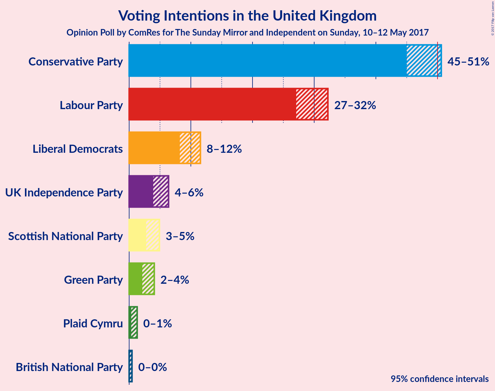
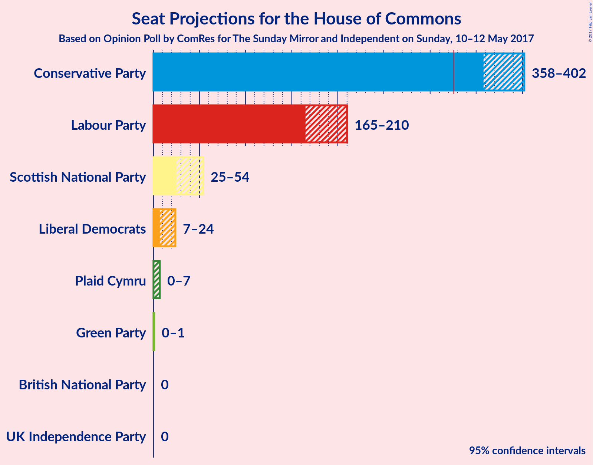
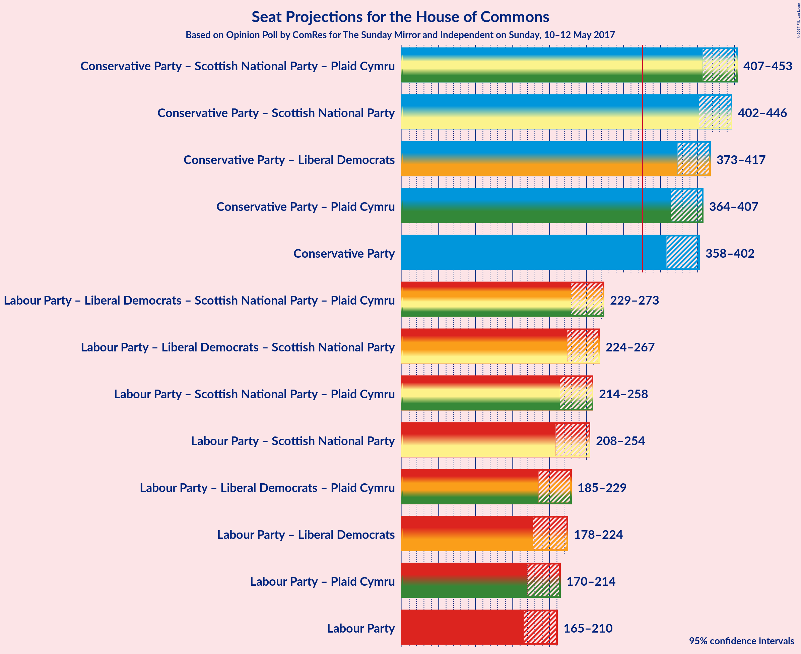

# Opinion Poll by ComRes for The Sunday Mirror and Independent on Sunday, 10–12 May 2017

<a href="#voting-intentions">Voting Intentions</a> | <a href="#seats">Seats</a> | <a href="#coalitions">Coalitions</a> | <a href="#technical-information">Technical Information</a>

## Voting Intentions

### Confidence Intervals

| Party | Last Result | Poll Result | 80% Confidence Interval | 90% Confidence Interval | 95% Confidence Interval | 99% Confidence Interval |
|:-----:|:-----------:|:-----------:|:-----------------------:|:-----------------------:|:-----------------------:|:-----------------------:|
| Conservative Party | 36.9% | 48.0% | 46.0–49.6% |45.4–50.1% |45.0–50.6% |44.1–51.5% |
| Labour Party | 30.4% | 29.7% | 28.0–31.3% |27.5–31.8% |27.1–32.2% |26.3–33.1% |
| Liberal Democrats | 7.9% | 9.8% | 8.7–10.9% |8.4–11.3% |8.2–11.6% |7.7–12.1% |
| UK Independence Party | 12.6% | 5.0% | 4.3–5.9% |4.1–6.2% |3.9–6.4% |3.6–6.8% |
| Scottish National Party | 4.7% | 3.7% | 3.1–4.5% |2.9–4.7% |2.8–4.9% |2.5–5.3% |
| Green Party | 3.8% | 3.0% | 2.4–3.7% |2.3–3.9% |2.1–4.1% |1.9–4.4% |
| Plaid Cymru | 0.6% | 0.7% | 0.4–1.1% |0.4–1.2% |0.3–1.3% |0.2–1.5% |
| British National Party | 0.0% | 0.1% | 0.0–0.3% |0.0–0.4% |0.0–0.5% |0.0–0.6% |

*Note:* The poll result column reflects the actual value used in the calculations. Published results may vary slightly, and in addition be rounded to fewer digits.

## Seats

### Confidence Intervals

| Party | Last Result | Median | 80% Confidence Interval | 90% Confidence Interval | 95% Confidence Interval | 99% Confidence Interval |
|:-----:|:-----------:|:------:|:-----------------------:|:-----------------------:|:-----------------------:|:-----------------------:|
| <a href="#conservative-party">Conservative Party</a> | 331 | 382 | 364–391 |362–397 |358–402 |352–412 |
| <a href="#labour-party">Labour Party</a> | 232 | 188 | 175–200 |170–203 |165–210 |156–223 |
| <a href="#liberal-democrats">Liberal Democrats</a> | 8 | 14 | 11–20 |10–23 |7–24 |5–29 |
| <a href="#uk-independence-party">UK Independence Party</a> | 1 | 0 | 0 |0 |0 |0 |
| <a href="#scottish-national-party">Scottish National Party</a> | 56 | 44 | 38–51 |32–53 |25–54 |16–55 |
| <a href="#green-party">Green Party</a> | 1 | 1 | 0–1 |0–1 |0–1 |0–1 |
| <a href="#plaid-cymru">Plaid Cymru</a> | 3 | 4 | 3–6 |0–7 |0–7 |0–8 |
| <a href="#british-national-party">British National Party</a> | 0 | 0 | 0 |0 |0 |0 |

### Conservative Party

| Number of Seats | Probability | Accumulated |
|:---------------:|:-----------:|:-----------:|
| 343 | 0% | 100% |
| 344 | 0% | 99.9% |
| 345 | 0% | 99.9% |
| 346 | 0% | 99.9% |
| 347 | 0% | 99.9% |
| 348 | 0.1% | 99.8% |
| 349 | 0.1% | 99.8% |
| 350 | 0% | 99.7% |
| 351 | 0.1% | 99.7% |
| 352 | 0.2% | 99.5% |
| 353 | 0.4% | 99.3% |
| 354 | 0.1% | 98.9% |
| 355 | 0.1% | 98.8% |
| 356 | 0.5% | 98.6% |
| 357 | 0.3% | 98% |
| 358 | 0.4% | 98% |
| 359 | 0.1% | 97% |
| 360 | 0% | 97% |
| 361 | 0.2% | 97% |
| 362 | 3% | 97% |
| 363 | 0.6% | 94% |
| 364 | 4% | 93% |
| 365 | 0.1% | 90% |
| 366 | 0.2% | 90% |
| 367 | 0.1% | 89% |
| 368 | 0.8% | 89% |
| 369 | 0.9% | 88% |
| 370 | 0.6% | 88% |
| 371 | 8% | 87% |
| 372 | 2% | 79% |
| 373 | 1.3% | 76% |
| 374 | 1.0% | 75% |
| 375 | 4% | 74% |
| 376 | 1.2% | 70% |
| 377 | 0.6% | 69% |
| 378 | 1.1% | 68% |
| 379 | 2% | 67% |
| 380 | 1.2% | 65% |
| 381 | 2% | 64% |
| 382 | 22% | 62% |
| 383 | 10% | 40% |
| 384 | 3% | 30% |
| 385 | 0.5% | 27% |
| 386 | 11% | 27% |
| 387 | 0.8% | 16% |
| 388 | 2% | 15% |
| 389 | 0.6% | 13% |
| 390 | 2% | 13% |
| 391 | 0.8% | 11% |
| 392 | 2% | 10% |
| 393 | 1.0% | 8% |
| 394 | 0.2% | 7% |
| 395 | 0.8% | 7% |
| 396 | 0.5% | 6% |
| 397 | 0.8% | 6% |
| 398 | 0.6% | 5% |
| 399 | 0% | 4% |
| 400 | 0.8% | 4% |
| 401 | 0.7% | 3% |
| 402 | 0.7% | 3% |
| 403 | 0.1% | 2% |
| 404 | 0.2% | 2% |
| 405 | 0.3% | 2% |
| 406 | 0.3% | 1.3% |
| 407 | 0% | 1.0% |
| 408 | 0.1% | 1.0% |
| 409 | 0.1% | 0.9% |
| 410 | 0.1% | 0.8% |
| 411 | 0.1% | 0.7% |
| 412 | 0.4% | 0.6% |
| 413 | 0% | 0.3% |
| 414 | 0% | 0.2% |
| 415 | 0% | 0.2% |
| 416 | 0% | 0.2% |
| 417 | 0% | 0.1% |
| 418 | 0% | 0.1% |
| 419 | 0% | 0.1% |
| 420 | 0% | 0.1% |
| 421 | 0% | 0.1% |
| 422 | 0% | 0% |

### Labour Party

| Number of Seats | Probability | Accumulated |
|:---------------:|:-----------:|:-----------:|
| 148 | 0% | 100% |
| 149 | 0% | 99.9% |
| 150 | 0% | 99.9% |
| 151 | 0% | 99.9% |
| 152 | 0% | 99.9% |
| 153 | 0.1% | 99.9% |
| 154 | 0% | 99.8% |
| 155 | 0.1% | 99.8% |
| 156 | 0.3% | 99.7% |
| 157 | 0.1% | 99.4% |
| 158 | 0.2% | 99.3% |
| 159 | 0.2% | 99.1% |
| 160 | 0.1% | 99.0% |
| 161 | 0.2% | 98.9% |
| 162 | 0% | 98.7% |
| 163 | 0.2% | 98.7% |
| 164 | 0.8% | 98% |
| 165 | 1.0% | 98% |
| 166 | 0.3% | 97% |
| 167 | 0.1% | 96% |
| 168 | 0.5% | 96% |
| 169 | 0.1% | 96% |
| 170 | 0.9% | 96% |
| 171 | 0.2% | 95% |
| 172 | 0.1% | 95% |
| 173 | 1.0% | 94% |
| 174 | 1.2% | 93% |
| 175 | 2% | 92% |
| 176 | 2% | 90% |
| 177 | 1.0% | 88% |
| 178 | 1.1% | 87% |
| 179 | 0.5% | 86% |
| 180 | 1.0% | 86% |
| 181 | 0.8% | 85% |
| 182 | 3% | 84% |
| 183 | 10% | 81% |
| 184 | 2% | 71% |
| 185 | 5% | 69% |
| 186 | 8% | 65% |
| 187 | 3% | 57% |
| 188 | 18% | 53% |
| 189 | 2% | 35% |
| 190 | 4% | 33% |
| 191 | 0.8% | 29% |
| 192 | 0.5% | 28% |
| 193 | 8% | 28% |
| 194 | 0.4% | 20% |
| 195 | 2% | 20% |
| 196 | 4% | 18% |
| 197 | 2% | 13% |
| 198 | 0.9% | 12% |
| 199 | 0.2% | 11% |
| 200 | 0.7% | 11% |
| 201 | 3% | 10% |
| 202 | 0.8% | 7% |
| 203 | 1.4% | 6% |
| 204 | 0.2% | 4% |
| 205 | 0.8% | 4% |
| 206 | 0.1% | 3% |
| 207 | 0.3% | 3% |
| 208 | 0% | 3% |
| 209 | 0.2% | 3% |
| 210 | 1.1% | 3% |
| 211 | 0.1% | 2% |
| 212 | 0.2% | 2% |
| 213 | 0.1% | 1.4% |
| 214 | 0.3% | 1.3% |
| 215 | 0% | 1.1% |
| 216 | 0.2% | 1.0% |
| 217 | 0.1% | 0.8% |
| 218 | 0% | 0.7% |
| 219 | 0% | 0.7% |
| 220 | 0% | 0.6% |
| 221 | 0.1% | 0.6% |
| 222 | 0% | 0.5% |
| 223 | 0.1% | 0.5% |
| 224 | 0% | 0.5% |
| 225 | 0% | 0.5% |
| 226 | 0% | 0.4% |
| 227 | 0% | 0.4% |
| 228 | 0% | 0.4% |
| 229 | 0% | 0.4% |
| 230 | 0.1% | 0.4% |
| 231 | 0% | 0.3% |
| 232 | 0% | 0.3% |
| 233 | 0% | 0.3% |
| 234 | 0% | 0.3% |
| 235 | 0% | 0.3% |
| 236 | 0% | 0.2% |
| 237 | 0% | 0.2% |
| 238 | 0% | 0.2% |
| 239 | 0% | 0.2% |
| 240 | 0% | 0.1% |
| 241 | 0% | 0.1% |
| 242 | 0.1% | 0.1% |
| 243 | 0% | 0% |

### Liberal Democrats

| Number of Seats | Probability | Accumulated |
|:---------------:|:-----------:|:-----------:|
| 5 | 0.6% | 100% |
| 6 | 0.3% | 99.3% |
| 7 | 2% | 99.0% |
| 8 | 1.1% | 97% |
| 9 | 0.7% | 96% |
| 10 | 2% | 95% |
| 11 | 5% | 93% |
| 12 | 3% | 88% |
| 13 | 30% | 85% |
| 14 | 8% | 55% |
| 15 | 5% | 47% |
| 16 | 7% | 43% |
| 17 | 6% | 36% |
| 18 | 2% | 30% |
| 19 | 15% | 28% |
| 20 | 6% | 13% |
| 21 | 1.0% | 8% |
| 22 | 0.8% | 7% |
| 23 | 3% | 6% |
| 24 | 0.4% | 3% |
| 25 | 1.0% | 2% |
| 26 | 0.4% | 2% |
| 27 | 0.3% | 1.1% |
| 28 | 0.2% | 0.8% |
| 29 | 0.2% | 0.5% |
| 30 | 0.2% | 0.4% |
| 31 | 0.1% | 0.2% |
| 32 | 0% | 0.1% |
| 33 | 0.1% | 0.1% |
| 34 | 0% | 0% |

### UK Independence Party

| Number of Seats | Probability | Accumulated |
|:---------------:|:-----------:|:-----------:|
| 0 | 100% | 100% |
| 1 | 0% | 0% |

### Scottish National Party

| Number of Seats | Probability | Accumulated |
|:---------------:|:-----------:|:-----------:|
| 3 | 0% | 100% |
| 4 | 0% | 99.9% |
| 5 | 0.1% | 99.9% |
| 6 | 0% | 99.9% |
| 7 | 0% | 99.8% |
| 8 | 0% | 99.8% |
| 9 | 0.1% | 99.8% |
| 10 | 0% | 99.7% |
| 11 | 0% | 99.7% |
| 12 | 0.1% | 99.7% |
| 13 | 0% | 99.6% |
| 14 | 0% | 99.6% |
| 15 | 0% | 99.6% |
| 16 | 0.1% | 99.6% |
| 17 | 0.1% | 99.4% |
| 18 | 0% | 99.3% |
| 19 | 0.3% | 99.3% |
| 20 | 0% | 99.0% |
| 21 | 0.1% | 99.0% |
| 22 | 0.4% | 98.8% |
| 23 | 0% | 98% |
| 24 | 0% | 98% |
| 25 | 1.3% | 98% |
| 26 | 0.2% | 97% |
| 27 | 0.3% | 97% |
| 28 | 0.3% | 97% |
| 29 | 0.2% | 96% |
| 30 | 0% | 96% |
| 31 | 0.1% | 96% |
| 32 | 2% | 96% |
| 33 | 0.3% | 94% |
| 34 | 0.9% | 94% |
| 35 | 0.3% | 93% |
| 36 | 0.8% | 93% |
| 37 | 2% | 92% |
| 38 | 0.6% | 90% |
| 39 | 3% | 90% |
| 40 | 2% | 87% |
| 41 | 0.5% | 85% |
| 42 | 18% | 85% |
| 43 | 6% | 67% |
| 44 | 19% | 61% |
| 45 | 6% | 42% |
| 46 | 2% | 36% |
| 47 | 6% | 34% |
| 48 | 6% | 28% |
| 49 | 2% | 21% |
| 50 | 9% | 19% |
| 51 | 1.3% | 10% |
| 52 | 0.3% | 9% |
| 53 | 6% | 8% |
| 54 | 0.7% | 3% |
| 55 | 1.5% | 2% |
| 56 | 0.3% | 0.4% |
| 57 | 0% | 0% |

### Green Party

| Number of Seats | Probability | Accumulated |
|:---------------:|:-----------:|:-----------:|
| 0 | 17% | 100% |
| 1 | 83% | 83% |
| 2 | 0.1% | 0.1% |
| 3 | 0% | 0% |

### Plaid Cymru

| Number of Seats | Probability | Accumulated |
|:---------------:|:-----------:|:-----------:|
| 0 | 7% | 100% |
| 1 | 0.6% | 93% |
| 2 | 0.4% | 92% |
| 3 | 7% | 92% |
| 4 | 70% | 85% |
| 5 | 4% | 15% |
| 6 | 2% | 10% |
| 7 | 7% | 8% |
| 8 | 0.6% | 0.7% |
| 9 | 0.1% | 0.1% |
| 10 | 0% | 0.1% |
| 11 | 0% | 0% |

### British National Party

| Number of Seats | Probability | Accumulated |
|:---------------:|:-----------:|:-----------:|
| 0 | 100% | 100% |
| 1 | 0% | 0% |

## Coalitions

### Confidence Intervals

| Coalition | Last Result | Median | 80% Confidence Interval | 90% Confidence Interval | 95% Confidence Interval | 99% Confidence Interval |
|:---------:|:-----------:|:------:|:-----------------------:|:-----------------------:|:-----------------------:|:-----------------------:|
| Conservative Party – Scottish National Party – Plaid Cymru | 390 | 429 | 418–440 | 411–445 | 407–453 | 389–459 |
| Conservative Party – Scottish National Party | 387 | 425 | 414–436 | 408–441 | 402–446 | 385–455 |
| Conservative Party – Liberal Democrats | 339 | 395 | 384–407 | 376–413 | 373–417 | 364–429 |
| Conservative Party – Plaid Cymru | 334 | 386 | 368–395 | 366–401 | 364–407 | 356–416 |
| Conservative Party | 331 | 382 | 364–391 | 362–397 | 358–402 | 352–412 |
| Labour Party – Liberal Democrats – Scottish National Party – Plaid Cymru | 299 | 249 | 241–267 | 234–269 | 229–273 | 219–280 |
| Labour Party – Liberal Democrats – Scottish National Party | 296 | 245 | 236–263 | 230–265 | 224–267 | 215–276 |
| Labour Party – Scottish National Party – Plaid Cymru | 291 | 236 | 224–247 | 218–256 | 214–258 | 202–267 |
| Labour Party – Scottish National Party | 288 | 232 | 219–243 | 215–252 | 208–254 | 198–263 |
| Labour Party – Liberal Democrats – Plaid Cymru | 243 | 206 | 196–217 | 190–224 | 185–229 | 177–246 |
| Labour Party – Liberal Democrats | 240 | 202 | 191–213 | 186–220 | 178–224 | 172–242 |
| Labour Party – Plaid Cymru | 235 | 192 | 180–204 | 176–207 | 170–214 | 162–226 |
| Labour Party | 232 | 188 | 175–200 | 170–203 | 165–210 | 156–223 |

### Conservative Party – Scottish National Party – Plaid Cymru

| Number of Seats | Probability | Accumulated |
|:---------------:|:-----------:|:-----------:|
| 370 | 0% | 100% |
| 371 | 0.1% | 99.9% |
| 372 | 0% | 99.9% |
| 373 | 0% | 99.8% |
| 374 | 0% | 99.8% |
| 375 | 0% | 99.8% |
| 376 | 0% | 99.8% |
| 377 | 0% | 99.8% |
| 378 | 0% | 99.8% |
| 379 | 0% | 99.7% |
| 380 | 0% | 99.7% |
| 381 | 0% | 99.7% |
| 382 | 0% | 99.7% |
| 383 | 0% | 99.7% |
| 384 | 0% | 99.7% |
| 385 | 0% | 99.6% |
| 386 | 0% | 99.6% |
| 387 | 0% | 99.6% |
| 388 | 0.1% | 99.6% |
| 389 | 0% | 99.5% |
| 390 | 0.1% | 99.5% |
| 391 | 0% | 99.4% |
| 392 | 0% | 99.4% |
| 393 | 0.1% | 99.4% |
| 394 | 0% | 99.3% |
| 395 | 0.2% | 99.2% |
| 396 | 0.1% | 99.1% |
| 397 | 0.1% | 99.0% |
| 398 | 0.1% | 98.9% |
| 399 | 0% | 98.7% |
| 400 | 0.1% | 98.7% |
| 401 | 0.3% | 98.6% |
| 402 | 0.1% | 98% |
| 403 | 0.1% | 98% |
| 404 | 0.1% | 98% |
| 405 | 0.1% | 98% |
| 406 | 0.3% | 98% |
| 407 | 0.3% | 98% |
| 408 | 0.1% | 97% |
| 409 | 0.4% | 97% |
| 410 | 1.5% | 97% |
| 411 | 0.3% | 95% |
| 412 | 1.2% | 95% |
| 413 | 0.3% | 94% |
| 414 | 0.7% | 93% |
| 415 | 0.4% | 93% |
| 416 | 0.2% | 92% |
| 417 | 0.9% | 92% |
| 418 | 4% | 91% |
| 419 | 3% | 87% |
| 420 | 1.4% | 84% |
| 421 | 3% | 82% |
| 422 | 5% | 79% |
| 423 | 0.8% | 74% |
| 424 | 0.8% | 73% |
| 425 | 7% | 72% |
| 426 | 2% | 66% |
| 427 | 4% | 64% |
| 428 | 3% | 60% |
| 429 | 9% | 57% |
| 430 | 18% | 48% |
| 431 | 0.7% | 30% |
| 432 | 10% | 29% |
| 433 | 0.9% | 19% |
| 434 | 2% | 18% |
| 435 | 0.7% | 17% |
| 436 | 0.8% | 16% |
| 437 | 0.6% | 15% |
| 438 | 1.0% | 14% |
| 439 | 3% | 13% |
| 440 | 0.8% | 11% |
| 441 | 0.3% | 10% |
| 442 | 0.8% | 10% |
| 443 | 1.3% | 9% |
| 444 | 1.0% | 7% |
| 445 | 2% | 6% |
| 446 | 0.1% | 4% |
| 447 | 0.1% | 4% |
| 448 | 0.4% | 4% |
| 449 | 0% | 4% |
| 450 | 0.4% | 4% |
| 451 | 0.4% | 3% |
| 452 | 0.4% | 3% |
| 453 | 0.6% | 3% |
| 454 | 0.3% | 2% |
| 455 | 0.2% | 2% |
| 456 | 0.6% | 1.5% |
| 457 | 0% | 0.9% |
| 458 | 0.3% | 0.8% |
| 459 | 0.1% | 0.5% |
| 460 | 0% | 0.4% |
| 461 | 0% | 0.4% |
| 462 | 0.1% | 0.4% |
| 463 | 0.2% | 0.3% |
| 464 | 0% | 0.2% |
| 465 | 0% | 0.1% |
| 466 | 0% | 0.1% |
| 467 | 0.1% | 0.1% |
| 468 | 0% | 0% |

### Conservative Party – Scottish National Party

| Number of Seats | Probability | Accumulated |
|:---------------:|:-----------:|:-----------:|
| 366 | 0% | 100% |
| 367 | 0.1% | 99.9% |
| 368 | 0% | 99.9% |
| 369 | 0% | 99.8% |
| 370 | 0% | 99.8% |
| 371 | 0% | 99.8% |
| 372 | 0% | 99.8% |
| 373 | 0% | 99.8% |
| 374 | 0% | 99.8% |
| 375 | 0% | 99.8% |
| 376 | 0% | 99.7% |
| 377 | 0% | 99.7% |
| 378 | 0% | 99.7% |
| 379 | 0% | 99.7% |
| 380 | 0% | 99.7% |
| 381 | 0% | 99.6% |
| 382 | 0% | 99.6% |
| 383 | 0% | 99.6% |
| 384 | 0% | 99.6% |
| 385 | 0.1% | 99.5% |
| 386 | 0% | 99.5% |
| 387 | 0% | 99.5% |
| 388 | 0% | 99.4% |
| 389 | 0% | 99.4% |
| 390 | 0.1% | 99.4% |
| 391 | 0.2% | 99.3% |
| 392 | 0.1% | 99.1% |
| 393 | 0% | 99.0% |
| 394 | 0.2% | 98.9% |
| 395 | 0.1% | 98.7% |
| 396 | 0.1% | 98.6% |
| 397 | 0% | 98.5% |
| 398 | 0.2% | 98% |
| 399 | 0.2% | 98% |
| 400 | 0.1% | 98% |
| 401 | 0% | 98% |
| 402 | 0.4% | 98% |
| 403 | 0.1% | 97% |
| 404 | 0.5% | 97% |
| 405 | 0.4% | 97% |
| 406 | 1.3% | 96% |
| 407 | 0.2% | 95% |
| 408 | 1.2% | 95% |
| 409 | 0.5% | 94% |
| 410 | 0.1% | 93% |
| 411 | 0.3% | 93% |
| 412 | 0.9% | 93% |
| 413 | 1.0% | 92% |
| 414 | 4% | 91% |
| 415 | 4% | 87% |
| 416 | 1.3% | 83% |
| 417 | 2% | 82% |
| 418 | 5% | 80% |
| 419 | 1.2% | 75% |
| 420 | 0.9% | 73% |
| 421 | 5% | 72% |
| 422 | 0.9% | 68% |
| 423 | 4% | 67% |
| 424 | 0.7% | 63% |
| 425 | 14% | 62% |
| 426 | 19% | 48% |
| 427 | 1.0% | 30% |
| 428 | 10% | 29% |
| 429 | 0.7% | 19% |
| 430 | 1.0% | 18% |
| 431 | 1.1% | 17% |
| 432 | 0.6% | 16% |
| 433 | 1.2% | 15% |
| 434 | 2% | 14% |
| 435 | 2% | 12% |
| 436 | 1.3% | 10% |
| 437 | 0.5% | 9% |
| 438 | 1.3% | 9% |
| 439 | 0.6% | 7% |
| 440 | 0.6% | 7% |
| 441 | 1.5% | 6% |
| 442 | 0.4% | 4% |
| 443 | 0.2% | 4% |
| 444 | 0.1% | 4% |
| 445 | 0.4% | 4% |
| 446 | 1.0% | 3% |
| 447 | 0.4% | 2% |
| 448 | 0.2% | 2% |
| 449 | 0.2% | 2% |
| 450 | 0.1% | 2% |
| 451 | 0.1% | 2% |
| 452 | 0.5% | 1.5% |
| 453 | 0.1% | 1.0% |
| 454 | 0.4% | 0.9% |
| 455 | 0.1% | 0.5% |
| 456 | 0% | 0.4% |
| 457 | 0% | 0.4% |
| 458 | 0.1% | 0.4% |
| 459 | 0.1% | 0.3% |
| 460 | 0% | 0.2% |
| 461 | 0% | 0.2% |
| 462 | 0.1% | 0.2% |
| 463 | 0% | 0.1% |
| 464 | 0% | 0.1% |
| 465 | 0% | 0.1% |
| 466 | 0% | 0% |

### Conservative Party – Liberal Democrats

| Number of Seats | Probability | Accumulated |
|:---------------:|:-----------:|:-----------:|
| 358 | 0% | 100% |
| 359 | 0% | 99.9% |
| 360 | 0% | 99.9% |
| 361 | 0% | 99.9% |
| 362 | 0% | 99.9% |
| 363 | 0.1% | 99.8% |
| 364 | 0.4% | 99.8% |
| 365 | 0% | 99.3% |
| 366 | 0.2% | 99.3% |
| 367 | 0.1% | 99.1% |
| 368 | 0.1% | 99.0% |
| 369 | 0.4% | 99.0% |
| 370 | 0% | 98.6% |
| 371 | 0% | 98.6% |
| 372 | 0.1% | 98.6% |
| 373 | 3% | 98.5% |
| 374 | 0.2% | 96% |
| 375 | 0.4% | 96% |
| 376 | 0.9% | 95% |
| 377 | 0.9% | 94% |
| 378 | 0% | 94% |
| 379 | 0.1% | 94% |
| 380 | 0.7% | 93% |
| 381 | 0.5% | 93% |
| 382 | 0.3% | 92% |
| 383 | 0.4% | 92% |
| 384 | 7% | 92% |
| 385 | 5% | 85% |
| 386 | 1.4% | 80% |
| 387 | 2% | 78% |
| 388 | 2% | 76% |
| 389 | 1.2% | 75% |
| 390 | 0.2% | 74% |
| 391 | 1.4% | 73% |
| 392 | 1.3% | 72% |
| 393 | 0.9% | 71% |
| 394 | 5% | 70% |
| 395 | 18% | 65% |
| 396 | 0.3% | 47% |
| 397 | 2% | 47% |
| 398 | 7% | 45% |
| 399 | 8% | 38% |
| 400 | 1.2% | 30% |
| 401 | 0.4% | 28% |
| 402 | 11% | 28% |
| 403 | 0.7% | 17% |
| 404 | 0.7% | 16% |
| 405 | 0.8% | 16% |
| 406 | 2% | 15% |
| 407 | 4% | 13% |
| 408 | 0.3% | 9% |
| 409 | 0.4% | 9% |
| 410 | 0.8% | 8% |
| 411 | 1.1% | 8% |
| 412 | 1.3% | 6% |
| 413 | 0.3% | 5% |
| 414 | 0.7% | 5% |
| 415 | 0.3% | 4% |
| 416 | 0.8% | 4% |
| 417 | 0.7% | 3% |
| 418 | 0.3% | 2% |
| 419 | 0.3% | 2% |
| 420 | 0.2% | 2% |
| 421 | 0.1% | 2% |
| 422 | 0.3% | 2% |
| 423 | 0.2% | 1.3% |
| 424 | 0.1% | 1.0% |
| 425 | 0.1% | 1.0% |
| 426 | 0% | 0.8% |
| 427 | 0.1% | 0.8% |
| 428 | 0.2% | 0.7% |
| 429 | 0.2% | 0.5% |
| 430 | 0% | 0.3% |
| 431 | 0% | 0.2% |
| 432 | 0% | 0.2% |
| 433 | 0.1% | 0.2% |
| 434 | 0% | 0.1% |
| 435 | 0% | 0.1% |
| 436 | 0% | 0.1% |
| 437 | 0% | 0.1% |
| 438 | 0% | 0.1% |
| 439 | 0% | 0% |

### Conservative Party – Plaid Cymru

| Number of Seats | Probability | Accumulated |
|:---------------:|:-----------:|:-----------:|
| 346 | 0% | 100% |
| 347 | 0% | 99.9% |
| 348 | 0% | 99.9% |
| 349 | 0% | 99.9% |
| 350 | 0% | 99.9% |
| 351 | 0% | 99.8% |
| 352 | 0.1% | 99.8% |
| 353 | 0.1% | 99.7% |
| 354 | 0% | 99.6% |
| 355 | 0% | 99.6% |
| 356 | 0.2% | 99.5% |
| 357 | 0.5% | 99.3% |
| 358 | 0.2% | 98.9% |
| 359 | 0.1% | 98.7% |
| 360 | 0.5% | 98.6% |
| 361 | 0.1% | 98% |
| 362 | 0.2% | 98% |
| 363 | 0.2% | 98% |
| 364 | 0.5% | 98% |
| 365 | 0.5% | 97% |
| 366 | 3% | 97% |
| 367 | 0.2% | 94% |
| 368 | 4% | 94% |
| 369 | 0.4% | 90% |
| 370 | 0.2% | 89% |
| 371 | 0.1% | 89% |
| 372 | 0.8% | 89% |
| 373 | 1.1% | 88% |
| 374 | 1.1% | 87% |
| 375 | 8% | 86% |
| 376 | 1.1% | 78% |
| 377 | 0.8% | 77% |
| 378 | 3% | 76% |
| 379 | 5% | 74% |
| 380 | 0.7% | 69% |
| 381 | 0.4% | 69% |
| 382 | 3% | 68% |
| 383 | 2% | 65% |
| 384 | 2% | 64% |
| 385 | 2% | 61% |
| 386 | 19% | 59% |
| 387 | 10% | 40% |
| 388 | 2% | 30% |
| 389 | 3% | 28% |
| 390 | 8% | 25% |
| 391 | 1.3% | 17% |
| 392 | 2% | 15% |
| 393 | 0.6% | 13% |
| 394 | 2% | 13% |
| 395 | 0.5% | 10% |
| 396 | 1.0% | 10% |
| 397 | 0.4% | 9% |
| 398 | 1.2% | 8% |
| 399 | 0.4% | 7% |
| 400 | 2% | 7% |
| 401 | 0.8% | 5% |
| 402 | 0.7% | 5% |
| 403 | 0.1% | 4% |
| 404 | 0.2% | 4% |
| 405 | 0.6% | 4% |
| 406 | 0.2% | 3% |
| 407 | 0.4% | 3% |
| 408 | 0.2% | 2% |
| 409 | 0.8% | 2% |
| 410 | 0.2% | 1.3% |
| 411 | 0.2% | 1.1% |
| 412 | 0.1% | 1.0% |
| 413 | 0.1% | 0.9% |
| 414 | 0% | 0.8% |
| 415 | 0.1% | 0.7% |
| 416 | 0.3% | 0.6% |
| 417 | 0% | 0.3% |
| 418 | 0% | 0.3% |
| 419 | 0.1% | 0.3% |
| 420 | 0% | 0.2% |
| 421 | 0% | 0.1% |
| 422 | 0% | 0.1% |
| 423 | 0% | 0.1% |
| 424 | 0% | 0.1% |
| 425 | 0% | 0.1% |
| 426 | 0% | 0% |

### Conservative Party

| Number of Seats | Probability | Accumulated |
|:---------------:|:-----------:|:-----------:|
| 343 | 0% | 100% |
| 344 | 0% | 99.9% |
| 345 | 0% | 99.9% |
| 346 | 0% | 99.9% |
| 347 | 0% | 99.9% |
| 348 | 0.1% | 99.8% |
| 349 | 0.1% | 99.8% |
| 350 | 0% | 99.7% |
| 351 | 0.1% | 99.7% |
| 352 | 0.2% | 99.5% |
| 353 | 0.4% | 99.3% |
| 354 | 0.1% | 98.9% |
| 355 | 0.1% | 98.8% |
| 356 | 0.5% | 98.6% |
| 357 | 0.3% | 98% |
| 358 | 0.4% | 98% |
| 359 | 0.1% | 97% |
| 360 | 0% | 97% |
| 361 | 0.2% | 97% |
| 362 | 3% | 97% |
| 363 | 0.6% | 94% |
| 364 | 4% | 93% |
| 365 | 0.1% | 90% |
| 366 | 0.2% | 90% |
| 367 | 0.1% | 89% |
| 368 | 0.8% | 89% |
| 369 | 0.9% | 88% |
| 370 | 0.6% | 88% |
| 371 | 8% | 87% |
| 372 | 2% | 79% |
| 373 | 1.3% | 76% |
| 374 | 1.0% | 75% |
| 375 | 4% | 74% |
| 376 | 1.2% | 70% |
| 377 | 0.6% | 69% |
| 378 | 1.1% | 68% |
| 379 | 2% | 67% |
| 380 | 1.2% | 65% |
| 381 | 2% | 64% |
| 382 | 22% | 62% |
| 383 | 10% | 40% |
| 384 | 3% | 30% |
| 385 | 0.5% | 27% |
| 386 | 11% | 27% |
| 387 | 0.8% | 16% |
| 388 | 2% | 15% |
| 389 | 0.6% | 13% |
| 390 | 2% | 13% |
| 391 | 0.8% | 11% |
| 392 | 2% | 10% |
| 393 | 1.0% | 8% |
| 394 | 0.2% | 7% |
| 395 | 0.8% | 7% |
| 396 | 0.5% | 6% |
| 397 | 0.8% | 6% |
| 398 | 0.6% | 5% |
| 399 | 0% | 4% |
| 400 | 0.8% | 4% |
| 401 | 0.7% | 3% |
| 402 | 0.7% | 3% |
| 403 | 0.1% | 2% |
| 404 | 0.2% | 2% |
| 405 | 0.3% | 2% |
| 406 | 0.3% | 1.3% |
| 407 | 0% | 1.0% |
| 408 | 0.1% | 1.0% |
| 409 | 0.1% | 0.9% |
| 410 | 0.1% | 0.8% |
| 411 | 0.1% | 0.7% |
| 412 | 0.4% | 0.6% |
| 413 | 0% | 0.3% |
| 414 | 0% | 0.2% |
| 415 | 0% | 0.2% |
| 416 | 0% | 0.2% |
| 417 | 0% | 0.1% |
| 418 | 0% | 0.1% |
| 419 | 0% | 0.1% |
| 420 | 0% | 0.1% |
| 421 | 0% | 0.1% |
| 422 | 0% | 0% |

### Labour Party – Liberal Democrats – Scottish National Party – Plaid Cymru

| Number of Seats | Probability | Accumulated |
|:---------------:|:-----------:|:-----------:|
| 210 | 0% | 100% |
| 211 | 0% | 99.9% |
| 212 | 0% | 99.9% |
| 213 | 0% | 99.9% |
| 214 | 0% | 99.9% |
| 215 | 0.1% | 99.9% |
| 216 | 0% | 99.8% |
| 217 | 0% | 99.8% |
| 218 | 0% | 99.8% |
| 219 | 0.3% | 99.7% |
| 220 | 0.1% | 99.4% |
| 221 | 0.1% | 99.3% |
| 222 | 0.1% | 99.2% |
| 223 | 0.1% | 99.1% |
| 224 | 0% | 99.0% |
| 225 | 0.1% | 99.0% |
| 226 | 0.4% | 98.9% |
| 227 | 0.2% | 98% |
| 228 | 0.1% | 98% |
| 229 | 0.7% | 98% |
| 230 | 0.5% | 97% |
| 231 | 0.8% | 97% |
| 232 | 0.2% | 96% |
| 233 | 0.4% | 96% |
| 234 | 0.9% | 96% |
| 235 | 0.2% | 95% |
| 236 | 1.1% | 94% |
| 237 | 0.1% | 93% |
| 238 | 0.3% | 93% |
| 239 | 2% | 93% |
| 240 | 0.3% | 90% |
| 241 | 3% | 90% |
| 242 | 0.2% | 88% |
| 243 | 2% | 87% |
| 244 | 0.4% | 85% |
| 245 | 11% | 85% |
| 246 | 1.0% | 74% |
| 247 | 1.4% | 73% |
| 248 | 11% | 72% |
| 249 | 22% | 61% |
| 250 | 2% | 39% |
| 251 | 1.2% | 36% |
| 252 | 1.5% | 35% |
| 253 | 0.6% | 34% |
| 254 | 2% | 33% |
| 255 | 0.8% | 31% |
| 256 | 5% | 31% |
| 257 | 1.2% | 26% |
| 258 | 1.3% | 25% |
| 259 | 2% | 24% |
| 260 | 4% | 22% |
| 261 | 5% | 17% |
| 262 | 1.0% | 13% |
| 263 | 0.6% | 12% |
| 264 | 0.4% | 11% |
| 265 | 0.3% | 11% |
| 266 | 0.1% | 10% |
| 267 | 4% | 10% |
| 268 | 0.5% | 7% |
| 269 | 3% | 6% |
| 270 | 0.3% | 3% |
| 271 | 0% | 3% |
| 272 | 0% | 3% |
| 273 | 0.4% | 3% |
| 274 | 0.1% | 2% |
| 275 | 0.6% | 2% |
| 276 | 0.1% | 1.4% |
| 277 | 0.1% | 1.3% |
| 278 | 0.5% | 1.2% |
| 279 | 0.1% | 0.7% |
| 280 | 0.2% | 0.6% |
| 281 | 0.1% | 0.4% |
| 282 | 0.1% | 0.3% |
| 283 | 0.1% | 0.2% |
| 284 | 0% | 0.2% |
| 285 | 0% | 0.1% |
| 286 | 0% | 0.1% |
| 287 | 0% | 0.1% |
| 288 | 0% | 0.1% |
| 289 | 0% | 0% |

### Labour Party – Liberal Democrats – Scottish National Party

| Number of Seats | Probability | Accumulated |
|:---------------:|:-----------:|:-----------:|
| 206 | 0% | 100% |
| 207 | 0% | 99.9% |
| 208 | 0% | 99.9% |
| 209 | 0% | 99.9% |
| 210 | 0% | 99.9% |
| 211 | 0% | 99.9% |
| 212 | 0.1% | 99.9% |
| 213 | 0.1% | 99.8% |
| 214 | 0% | 99.7% |
| 215 | 0.3% | 99.7% |
| 216 | 0.1% | 99.4% |
| 217 | 0.1% | 99.3% |
| 218 | 0.1% | 99.3% |
| 219 | 0.1% | 99.1% |
| 220 | 0.1% | 99.0% |
| 221 | 0% | 98.9% |
| 222 | 1.0% | 98.9% |
| 223 | 0.2% | 98% |
| 224 | 0.4% | 98% |
| 225 | 0.1% | 97% |
| 226 | 0.6% | 97% |
| 227 | 0.1% | 97% |
| 228 | 0.3% | 96% |
| 229 | 0.4% | 96% |
| 230 | 0.9% | 96% |
| 231 | 0.6% | 95% |
| 232 | 2% | 94% |
| 233 | 0.5% | 93% |
| 234 | 0.9% | 92% |
| 235 | 0.9% | 91% |
| 236 | 0.7% | 90% |
| 237 | 2% | 90% |
| 238 | 0.7% | 88% |
| 239 | 2% | 87% |
| 240 | 0.9% | 85% |
| 241 | 9% | 84% |
| 242 | 3% | 75% |
| 243 | 0.7% | 72% |
| 244 | 10% | 71% |
| 245 | 19% | 61% |
| 246 | 3% | 42% |
| 247 | 2% | 39% |
| 248 | 0.9% | 37% |
| 249 | 4% | 36% |
| 250 | 0.4% | 32% |
| 251 | 0.3% | 31% |
| 252 | 5% | 31% |
| 253 | 3% | 26% |
| 254 | 0.8% | 24% |
| 255 | 0.6% | 23% |
| 256 | 4% | 22% |
| 257 | 5% | 18% |
| 258 | 1.4% | 13% |
| 259 | 0.5% | 12% |
| 260 | 0.4% | 11% |
| 261 | 0.3% | 11% |
| 262 | 0.4% | 11% |
| 263 | 4% | 10% |
| 264 | 0.1% | 6% |
| 265 | 3% | 6% |
| 266 | 0.4% | 3% |
| 267 | 0.6% | 3% |
| 268 | 0.2% | 2% |
| 269 | 0.1% | 2% |
| 270 | 0.1% | 2% |
| 271 | 0.6% | 2% |
| 272 | 0.1% | 1.4% |
| 273 | 0.1% | 1.3% |
| 274 | 0.5% | 1.2% |
| 275 | 0% | 0.7% |
| 276 | 0.2% | 0.6% |
| 277 | 0.1% | 0.4% |
| 278 | 0.1% | 0.4% |
| 279 | 0.1% | 0.3% |
| 280 | 0% | 0.2% |
| 281 | 0% | 0.2% |
| 282 | 0% | 0.1% |
| 283 | 0% | 0.1% |
| 284 | 0% | 0.1% |
| 285 | 0% | 0.1% |
| 286 | 0% | 0% |

### Labour Party – Scottish National Party – Plaid Cymru

| Number of Seats | Probability | Accumulated |
|:---------------:|:-----------:|:-----------:|
| 193 | 0% | 100% |
| 194 | 0% | 99.9% |
| 195 | 0% | 99.9% |
| 196 | 0% | 99.9% |
| 197 | 0% | 99.9% |
| 198 | 0% | 99.9% |
| 199 | 0.1% | 99.9% |
| 200 | 0% | 99.8% |
| 201 | 0% | 99.8% |
| 202 | 0.3% | 99.7% |
| 203 | 0.2% | 99.5% |
| 204 | 0% | 99.3% |
| 205 | 0.1% | 99.3% |
| 206 | 0.1% | 99.2% |
| 207 | 0.1% | 99.1% |
| 208 | 0.2% | 99.0% |
| 209 | 0.1% | 98.8% |
| 210 | 0.3% | 98.6% |
| 211 | 0.1% | 98% |
| 212 | 0.3% | 98% |
| 213 | 0.4% | 98% |
| 214 | 0.6% | 98% |
| 215 | 0.9% | 97% |
| 216 | 0.2% | 96% |
| 217 | 0.5% | 96% |
| 218 | 0.5% | 95% |
| 219 | 1.3% | 95% |
| 220 | 1.2% | 94% |
| 221 | 0.5% | 92% |
| 222 | 0.5% | 92% |
| 223 | 0.4% | 92% |
| 224 | 2% | 91% |
| 225 | 3% | 89% |
| 226 | 1.4% | 86% |
| 227 | 1.1% | 85% |
| 228 | 0.7% | 84% |
| 229 | 11% | 83% |
| 230 | 0.5% | 72% |
| 231 | 0.4% | 72% |
| 232 | 8% | 71% |
| 233 | 8% | 63% |
| 234 | 2% | 55% |
| 235 | 0.3% | 54% |
| 236 | 18% | 53% |
| 237 | 5% | 35% |
| 238 | 0.7% | 30% |
| 239 | 1.4% | 30% |
| 240 | 1.1% | 28% |
| 241 | 0.5% | 27% |
| 242 | 0.9% | 26% |
| 243 | 2% | 26% |
| 244 | 2% | 24% |
| 245 | 1.2% | 22% |
| 246 | 0.4% | 21% |
| 247 | 12% | 20% |
| 248 | 0.3% | 8% |
| 249 | 0.2% | 8% |
| 250 | 0.7% | 8% |
| 251 | 0.7% | 7% |
| 252 | 0.1% | 7% |
| 253 | 0% | 6% |
| 254 | 0.9% | 6% |
| 255 | 0.5% | 6% |
| 256 | 0.6% | 5% |
| 257 | 0.3% | 4% |
| 258 | 3% | 4% |
| 259 | 0.1% | 2% |
| 260 | 0% | 1.4% |
| 261 | 0% | 1.4% |
| 262 | 0.3% | 1.4% |
| 263 | 0.1% | 1.1% |
| 264 | 0.1% | 1.0% |
| 265 | 0.2% | 0.9% |
| 266 | 0% | 0.7% |
| 267 | 0.5% | 0.7% |
| 268 | 0% | 0.2% |
| 269 | 0.1% | 0.2% |
| 270 | 0% | 0.1% |
| 271 | 0% | 0.1% |
| 272 | 0% | 0.1% |
| 273 | 0% | 0.1% |
| 274 | 0% | 0.1% |
| 275 | 0% | 0% |

### Labour Party – Scottish National Party

| Number of Seats | Probability | Accumulated |
|:---------------:|:-----------:|:-----------:|
| 189 | 0% | 100% |
| 190 | 0% | 99.9% |
| 191 | 0% | 99.9% |
| 192 | 0% | 99.9% |
| 193 | 0% | 99.9% |
| 194 | 0% | 99.9% |
| 195 | 0% | 99.8% |
| 196 | 0.1% | 99.8% |
| 197 | 0.1% | 99.7% |
| 198 | 0.3% | 99.7% |
| 199 | 0.2% | 99.4% |
| 200 | 0% | 99.2% |
| 201 | 0% | 99.2% |
| 202 | 0.1% | 99.1% |
| 203 | 0.1% | 99.1% |
| 204 | 0.1% | 99.0% |
| 205 | 0.1% | 98.9% |
| 206 | 0.4% | 98.8% |
| 207 | 0.3% | 98% |
| 208 | 0.7% | 98% |
| 209 | 0.3% | 97% |
| 210 | 0.8% | 97% |
| 211 | 0.4% | 96% |
| 212 | 0.2% | 96% |
| 213 | 0.4% | 96% |
| 214 | 0.3% | 95% |
| 215 | 1.3% | 95% |
| 216 | 0.6% | 94% |
| 217 | 0.1% | 93% |
| 218 | 2% | 93% |
| 219 | 1.1% | 91% |
| 220 | 3% | 90% |
| 221 | 2% | 87% |
| 222 | 0.4% | 85% |
| 223 | 0.7% | 85% |
| 224 | 0.3% | 84% |
| 225 | 9% | 84% |
| 226 | 3% | 75% |
| 227 | 2% | 72% |
| 228 | 8% | 70% |
| 229 | 5% | 62% |
| 230 | 0.6% | 57% |
| 231 | 0.2% | 56% |
| 232 | 19% | 56% |
| 233 | 7% | 37% |
| 234 | 1.1% | 30% |
| 235 | 2% | 29% |
| 236 | 0.7% | 27% |
| 237 | 0.7% | 27% |
| 238 | 2% | 26% |
| 239 | 0.5% | 24% |
| 240 | 1.0% | 24% |
| 241 | 0.7% | 23% |
| 242 | 2% | 22% |
| 243 | 12% | 20% |
| 244 | 0.8% | 9% |
| 245 | 0.3% | 8% |
| 246 | 0.4% | 8% |
| 247 | 0.3% | 7% |
| 248 | 0.1% | 7% |
| 249 | 0.4% | 7% |
| 250 | 0.7% | 6% |
| 251 | 0.4% | 6% |
| 252 | 0.8% | 5% |
| 253 | 0.2% | 5% |
| 254 | 3% | 4% |
| 255 | 0.1% | 2% |
| 256 | 0.3% | 2% |
| 257 | 0.1% | 1.2% |
| 258 | 0.1% | 1.1% |
| 259 | 0.1% | 1.0% |
| 260 | 0% | 0.9% |
| 261 | 0.1% | 0.9% |
| 262 | 0.1% | 0.9% |
| 263 | 0.5% | 0.8% |
| 264 | 0.1% | 0.3% |
| 265 | 0% | 0.2% |
| 266 | 0% | 0.1% |
| 267 | 0% | 0.1% |
| 268 | 0% | 0.1% |
| 269 | 0% | 0.1% |
| 270 | 0% | 0.1% |
| 271 | 0% | 0% |

### Labour Party – Liberal Democrats – Plaid Cymru

| Number of Seats | Probability | Accumulated |
|:---------------:|:-----------:|:-----------:|
| 167 | 0% | 100% |
| 168 | 0% | 99.9% |
| 169 | 0.1% | 99.9% |
| 170 | 0% | 99.8% |
| 171 | 0% | 99.8% |
| 172 | 0% | 99.8% |
| 173 | 0.1% | 99.7% |
| 174 | 0% | 99.7% |
| 175 | 0% | 99.6% |
| 176 | 0.1% | 99.6% |
| 177 | 0.2% | 99.5% |
| 178 | 0.3% | 99.4% |
| 179 | 0.5% | 99.0% |
| 180 | 0.1% | 98.5% |
| 181 | 0.1% | 98% |
| 182 | 0.2% | 98% |
| 183 | 0.1% | 98% |
| 184 | 0.2% | 98% |
| 185 | 1.2% | 98% |
| 186 | 0.4% | 97% |
| 187 | 0.1% | 96% |
| 188 | 0.1% | 96% |
| 189 | 0.2% | 96% |
| 190 | 2% | 96% |
| 191 | 0.6% | 94% |
| 192 | 0.6% | 93% |
| 193 | 0.5% | 93% |
| 194 | 1.2% | 92% |
| 195 | 0.8% | 91% |
| 196 | 3% | 90% |
| 197 | 2% | 88% |
| 198 | 1.0% | 86% |
| 199 | 1.0% | 85% |
| 200 | 1.0% | 84% |
| 201 | 0.8% | 83% |
| 202 | 0.9% | 82% |
| 203 | 10% | 81% |
| 204 | 0.7% | 71% |
| 205 | 19% | 71% |
| 206 | 14% | 52% |
| 207 | 0.2% | 38% |
| 208 | 4% | 38% |
| 209 | 2% | 34% |
| 210 | 4% | 32% |
| 211 | 1.2% | 28% |
| 212 | 0.9% | 27% |
| 213 | 2% | 26% |
| 214 | 6% | 24% |
| 215 | 0.4% | 19% |
| 216 | 5% | 18% |
| 217 | 4% | 13% |
| 218 | 0.9% | 9% |
| 219 | 1.2% | 8% |
| 220 | 0.1% | 7% |
| 221 | 0.2% | 7% |
| 222 | 0.6% | 7% |
| 223 | 0.3% | 6% |
| 224 | 1.0% | 6% |
| 225 | 1.1% | 5% |
| 226 | 0.7% | 4% |
| 227 | 0.6% | 3% |
| 228 | 0.1% | 3% |
| 229 | 0.4% | 3% |
| 230 | 0.1% | 2% |
| 231 | 0.1% | 2% |
| 232 | 0.2% | 2% |
| 233 | 0.1% | 2% |
| 234 | 0.1% | 2% |
| 235 | 0.1% | 2% |
| 236 | 0.1% | 1.4% |
| 237 | 0.2% | 1.3% |
| 238 | 0.1% | 1.1% |
| 239 | 0.1% | 1.0% |
| 240 | 0% | 0.9% |
| 241 | 0.3% | 0.9% |
| 242 | 0.1% | 0.6% |
| 243 | 0% | 0.6% |
| 244 | 0% | 0.6% |
| 245 | 0% | 0.6% |
| 246 | 0% | 0.5% |
| 247 | 0% | 0.5% |
| 248 | 0% | 0.4% |
| 249 | 0% | 0.4% |
| 250 | 0% | 0.4% |
| 251 | 0% | 0.4% |
| 252 | 0% | 0.3% |
| 253 | 0% | 0.3% |
| 254 | 0% | 0.3% |
| 255 | 0% | 0.3% |
| 256 | 0% | 0.3% |
| 257 | 0% | 0.2% |
| 258 | 0% | 0.2% |
| 259 | 0% | 0.2% |
| 260 | 0% | 0.2% |
| 261 | 0% | 0.2% |
| 262 | 0% | 0.2% |
| 263 | 0% | 0.2% |
| 264 | 0.1% | 0.1% |
| 265 | 0% | 0.1% |
| 266 | 0% | 0% |

### Labour Party – Liberal Democrats

| Number of Seats | Probability | Accumulated |
|:---------------:|:-----------:|:-----------:|
| 164 | 0% | 100% |
| 165 | 0.1% | 99.9% |
| 166 | 0% | 99.9% |
| 167 | 0% | 99.9% |
| 168 | 0.1% | 99.8% |
| 169 | 0.1% | 99.7% |
| 170 | 0.1% | 99.7% |
| 171 | 0% | 99.6% |
| 172 | 0.1% | 99.6% |
| 173 | 0.1% | 99.5% |
| 174 | 0.2% | 99.4% |
| 175 | 0.6% | 99.1% |
| 176 | 0.2% | 98.6% |
| 177 | 0.1% | 98% |
| 178 | 0.8% | 98% |
| 179 | 0.4% | 97% |
| 180 | 0.1% | 97% |
| 181 | 0.6% | 97% |
| 182 | 0.1% | 96% |
| 183 | 0.2% | 96% |
| 184 | 0.2% | 96% |
| 185 | 0.1% | 96% |
| 186 | 1.3% | 96% |
| 187 | 2% | 94% |
| 188 | 0.8% | 93% |
| 189 | 1.1% | 92% |
| 190 | 0.6% | 91% |
| 191 | 0.8% | 90% |
| 192 | 3% | 89% |
| 193 | 0.9% | 87% |
| 194 | 0.3% | 86% |
| 195 | 1.1% | 85% |
| 196 | 0.7% | 84% |
| 197 | 2% | 84% |
| 198 | 1.0% | 82% |
| 199 | 10% | 81% |
| 200 | 0.6% | 71% |
| 201 | 18% | 70% |
| 202 | 9% | 52% |
| 203 | 3% | 43% |
| 204 | 5% | 41% |
| 205 | 1.1% | 36% |
| 206 | 7% | 35% |
| 207 | 1.2% | 28% |
| 208 | 0.7% | 27% |
| 209 | 1.0% | 26% |
| 210 | 7% | 25% |
| 211 | 0.5% | 18% |
| 212 | 4% | 18% |
| 213 | 4% | 13% |
| 214 | 0.7% | 9% |
| 215 | 0.5% | 8% |
| 216 | 0.5% | 8% |
| 217 | 0.7% | 7% |
| 218 | 0.3% | 7% |
| 219 | 0.3% | 6% |
| 220 | 1.1% | 6% |
| 221 | 1.3% | 5% |
| 222 | 0.7% | 4% |
| 223 | 0.1% | 3% |
| 224 | 0.3% | 3% |
| 225 | 0.3% | 2% |
| 226 | 0.1% | 2% |
| 227 | 0.1% | 2% |
| 228 | 0.1% | 2% |
| 229 | 0.1% | 2% |
| 230 | 0.3% | 2% |
| 231 | 0.1% | 1.4% |
| 232 | 0% | 1.3% |
| 233 | 0.1% | 1.3% |
| 234 | 0.2% | 1.2% |
| 235 | 0.1% | 1.0% |
| 236 | 0% | 0.9% |
| 237 | 0.2% | 0.9% |
| 238 | 0.1% | 0.7% |
| 239 | 0% | 0.6% |
| 240 | 0% | 0.6% |
| 241 | 0.1% | 0.6% |
| 242 | 0% | 0.5% |
| 243 | 0% | 0.5% |
| 244 | 0% | 0.4% |
| 245 | 0% | 0.4% |
| 246 | 0% | 0.4% |
| 247 | 0% | 0.4% |
| 248 | 0% | 0.4% |
| 249 | 0% | 0.3% |
| 250 | 0% | 0.3% |
| 251 | 0% | 0.3% |
| 252 | 0% | 0.3% |
| 253 | 0% | 0.3% |
| 254 | 0% | 0.2% |
| 255 | 0% | 0.2% |
| 256 | 0% | 0.2% |
| 257 | 0% | 0.2% |
| 258 | 0% | 0.2% |
| 259 | 0% | 0.2% |
| 260 | 0.1% | 0.1% |
| 261 | 0% | 0.1% |
| 262 | 0% | 0% |

### Labour Party – Plaid Cymru

| Number of Seats | Probability | Accumulated |
|:---------------:|:-----------:|:-----------:|
| 152 | 0% | 100% |
| 153 | 0% | 99.9% |
| 154 | 0% | 99.9% |
| 155 | 0% | 99.9% |
| 156 | 0% | 99.9% |
| 157 | 0% | 99.8% |
| 158 | 0% | 99.8% |
| 159 | 0.1% | 99.8% |
| 160 | 0.1% | 99.7% |
| 161 | 0% | 99.6% |
| 162 | 0.3% | 99.5% |
| 163 | 0.2% | 99.2% |
| 164 | 0.1% | 99.0% |
| 165 | 0.1% | 98.9% |
| 166 | 0.1% | 98.8% |
| 167 | 0.2% | 98.7% |
| 168 | 0.3% | 98.5% |
| 169 | 0.7% | 98% |
| 170 | 0.4% | 98% |
| 171 | 0.8% | 97% |
| 172 | 0.7% | 96% |
| 173 | 0.2% | 96% |
| 174 | 0.1% | 95% |
| 175 | 0.1% | 95% |
| 176 | 0.4% | 95% |
| 177 | 0.7% | 95% |
| 178 | 1.2% | 94% |
| 179 | 2% | 93% |
| 180 | 2% | 91% |
| 181 | 1.0% | 89% |
| 182 | 0.3% | 88% |
| 183 | 0.6% | 87% |
| 184 | 1.4% | 87% |
| 185 | 2% | 85% |
| 186 | 2% | 84% |
| 187 | 11% | 81% |
| 188 | 0.8% | 71% |
| 189 | 5% | 70% |
| 190 | 13% | 65% |
| 191 | 2% | 52% |
| 192 | 18% | 50% |
| 193 | 2% | 32% |
| 194 | 0.9% | 30% |
| 195 | 0.5% | 29% |
| 196 | 1.5% | 29% |
| 197 | 7% | 27% |
| 198 | 1.1% | 20% |
| 199 | 0.4% | 19% |
| 200 | 5% | 19% |
| 201 | 2% | 14% |
| 202 | 1.0% | 12% |
| 203 | 0.2% | 11% |
| 204 | 0.9% | 11% |
| 205 | 3% | 10% |
| 206 | 0.4% | 6% |
| 207 | 1.1% | 6% |
| 208 | 0.9% | 5% |
| 209 | 0.5% | 4% |
| 210 | 0.2% | 3% |
| 211 | 0% | 3% |
| 212 | 0.2% | 3% |
| 213 | 0.1% | 3% |
| 214 | 0.8% | 3% |
| 215 | 0.1% | 2% |
| 216 | 0.4% | 2% |
| 217 | 0.3% | 2% |
| 218 | 0.3% | 1.2% |
| 219 | 0.1% | 1.0% |
| 220 | 0.1% | 0.9% |
| 221 | 0.1% | 0.8% |
| 222 | 0% | 0.7% |
| 223 | 0% | 0.7% |
| 224 | 0.1% | 0.6% |
| 225 | 0% | 0.6% |
| 226 | 0% | 0.5% |
| 227 | 0% | 0.5% |
| 228 | 0% | 0.5% |
| 229 | 0% | 0.5% |
| 230 | 0% | 0.5% |
| 231 | 0% | 0.4% |
| 232 | 0% | 0.4% |
| 233 | 0% | 0.4% |
| 234 | 0.1% | 0.3% |
| 235 | 0% | 0.3% |
| 236 | 0% | 0.3% |
| 237 | 0% | 0.3% |
| 238 | 0% | 0.3% |
| 239 | 0% | 0.2% |
| 240 | 0% | 0.2% |
| 241 | 0% | 0.2% |
| 242 | 0% | 0.2% |
| 243 | 0% | 0.2% |
| 244 | 0% | 0.1% |
| 245 | 0% | 0.1% |
| 246 | 0.1% | 0.1% |
| 247 | 0% | 0% |

### Labour Party

| Number of Seats | Probability | Accumulated |
|:---------------:|:-----------:|:-----------:|
| 148 | 0% | 100% |
| 149 | 0% | 99.9% |
| 150 | 0% | 99.9% |
| 151 | 0% | 99.9% |
| 152 | 0% | 99.9% |
| 153 | 0.1% | 99.9% |
| 154 | 0% | 99.8% |
| 155 | 0.1% | 99.8% |
| 156 | 0.3% | 99.7% |
| 157 | 0.1% | 99.4% |
| 158 | 0.2% | 99.3% |
| 159 | 0.2% | 99.1% |
| 160 | 0.1% | 99.0% |
| 161 | 0.2% | 98.9% |
| 162 | 0% | 98.7% |
| 163 | 0.2% | 98.7% |
| 164 | 0.8% | 98% |
| 165 | 1.0% | 98% |
| 166 | 0.3% | 97% |
| 167 | 0.1% | 96% |
| 168 | 0.5% | 96% |
| 169 | 0.1% | 96% |
| 170 | 0.9% | 96% |
| 171 | 0.2% | 95% |
| 172 | 0.1% | 95% |
| 173 | 1.0% | 94% |
| 174 | 1.2% | 93% |
| 175 | 2% | 92% |
| 176 | 2% | 90% |
| 177 | 1.0% | 88% |
| 178 | 1.1% | 87% |
| 179 | 0.5% | 86% |
| 180 | 1.0% | 86% |
| 181 | 0.8% | 85% |
| 182 | 3% | 84% |
| 183 | 10% | 81% |
| 184 | 2% | 71% |
| 185 | 5% | 69% |
| 186 | 8% | 65% |
| 187 | 3% | 57% |
| 188 | 18% | 53% |
| 189 | 2% | 35% |
| 190 | 4% | 33% |
| 191 | 0.8% | 29% |
| 192 | 0.5% | 28% |
| 193 | 8% | 28% |
| 194 | 0.4% | 20% |
| 195 | 2% | 20% |
| 196 | 4% | 18% |
| 197 | 2% | 13% |
| 198 | 0.9% | 12% |
| 199 | 0.2% | 11% |
| 200 | 0.7% | 11% |
| 201 | 3% | 10% |
| 202 | 0.8% | 7% |
| 203 | 1.4% | 6% |
| 204 | 0.2% | 4% |
| 205 | 0.8% | 4% |
| 206 | 0.1% | 3% |
| 207 | 0.3% | 3% |
| 208 | 0% | 3% |
| 209 | 0.2% | 3% |
| 210 | 1.1% | 3% |
| 211 | 0.1% | 2% |
| 212 | 0.2% | 2% |
| 213 | 0.1% | 1.4% |
| 214 | 0.3% | 1.3% |
| 215 | 0% | 1.1% |
| 216 | 0.2% | 1.0% |
| 217 | 0.1% | 0.8% |
| 218 | 0% | 0.7% |
| 219 | 0% | 0.7% |
| 220 | 0% | 0.6% |
| 221 | 0.1% | 0.6% |
| 222 | 0% | 0.5% |
| 223 | 0.1% | 0.5% |
| 224 | 0% | 0.5% |
| 225 | 0% | 0.5% |
| 226 | 0% | 0.4% |
| 227 | 0% | 0.4% |
| 228 | 0% | 0.4% |
| 229 | 0% | 0.4% |
| 230 | 0.1% | 0.4% |
| 231 | 0% | 0.3% |
| 232 | 0% | 0.3% |
| 233 | 0% | 0.3% |
| 234 | 0% | 0.3% |
| 235 | 0% | 0.3% |
| 236 | 0% | 0.2% |
| 237 | 0% | 0.2% |
| 238 | 0% | 0.2% |
| 239 | 0% | 0.2% |
| 240 | 0% | 0.1% |
| 241 | 0% | 0.1% |
| 242 | 0.1% | 0.1% |
| 243 | 0% | 0% |

## Technical Information

### Opinion Poll

+ **Pollster:** ComRes
+ **Media:** The Sunday Mirror and Independent on Sunday
+ **Fieldwork period:** 10–12 May 2017

### Calculations

+ **Sample size:** 1214
+ **Simulations done:** 1,048,576
+ **Error estimate:** 1.19%

