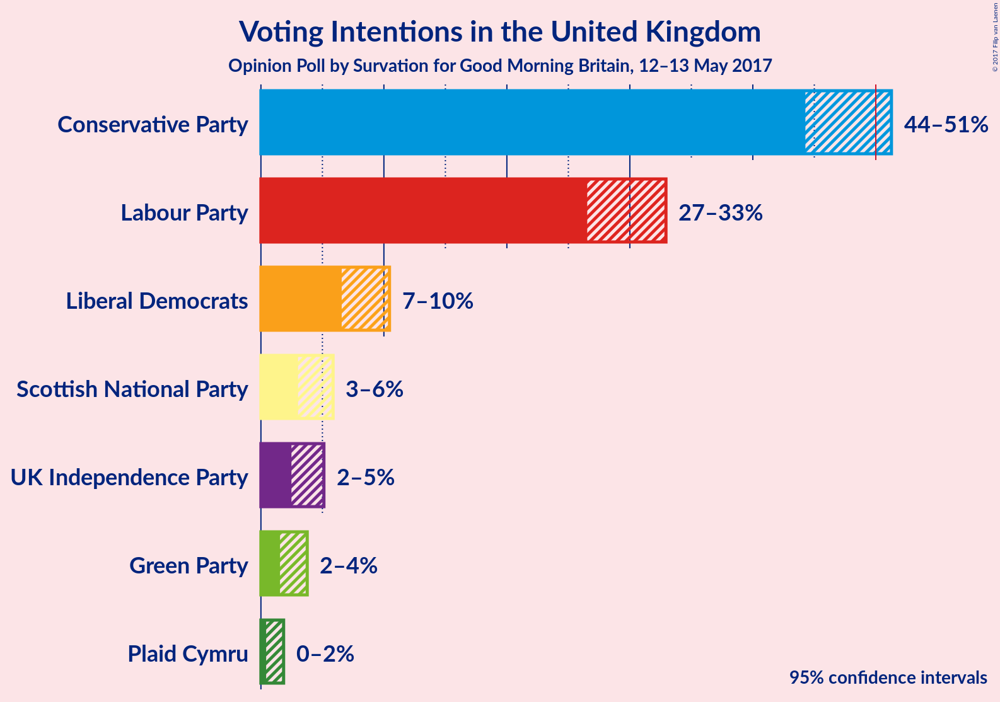
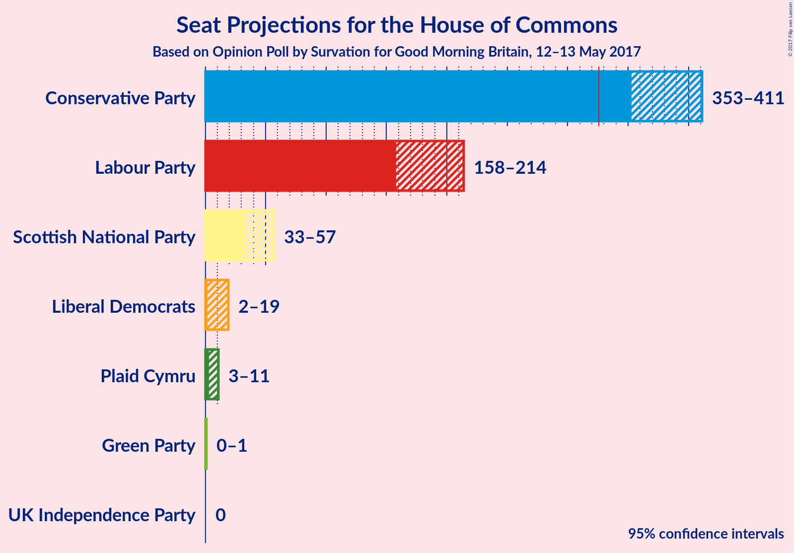
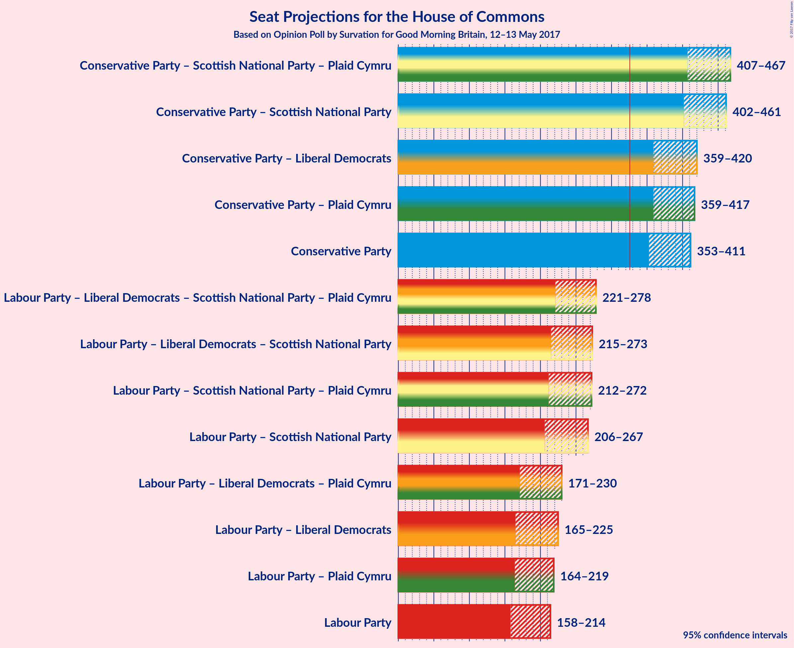

# Opinion Poll by Survation for Good Morning Britain, 12–13 May 2017

<a href="#voting-intentions">Voting Intentions</a> | <a href="#seats">Seats</a> | <a href="#coalitions">Coalitions</a> | <a href="#technical-information">Technical Information</a>

## Voting Intentions

### Confidence Intervals

| Party | Last Result | Poll Result | 80% Confidence Interval | 90% Confidence Interval | 95% Confidence Interval | 99% Confidence Interval |
|:-----:|:-----------:|:-----------:|:-----------------------:|:-----------------------:|:-----------------------:|:-----------------------:|
| Conservative Party | 36.9% | 49.3% | 45.5–50.1% |44.8–50.7% |44.3–51.3% |43.2–52.4% |
| Labour Party | 30.4% | 30.6% | 27.6–31.8% |27.0–32.4% |26.5–32.9% |25.6–34.0% |
| Liberal Democrats | 7.9% | 8.6% | 7.1–9.7% |6.8–10.1% |6.6–10.5% |6.1–11.2% |
| Scottish National Party | 4.7% | 4.4% | 3.4–5.3% |3.2–5.6% |3.0–5.9% |2.7–6.4% |
| UK Independence Party | 12.6% | 3.7% | 2.9–4.6% |2.7–4.9% |2.5–5.1% |2.2–5.7% |
| Green Party | 3.8% | 2.5% | 1.8–3.3% |1.7–3.5% |1.6–3.8% |1.3–4.2% |
| Plaid Cymru | 0.6% | 0.9% | 0.6–1.5% |0.5–1.7% |0.4–1.8% |0.3–2.2% |

*Note:* The poll result column reflects the actual value used in the calculations. Published results may vary slightly, and in addition be rounded to fewer digits.

## Seats

### Confidence Intervals

| Party | Last Result | Median | 80% Confidence Interval | 90% Confidence Interval | 95% Confidence Interval | 99% Confidence Interval |
|:-----:|:-----------:|:------:|:-----------------------:|:-----------------------:|:-----------------------:|:-----------------------:|
| <a href="#conservative-party">Conservative Party</a> | 331 | 382 | 363–398 |356–406 |353–411 |346–418 |
| <a href="#labour-party">Labour Party</a> | 232 | 186 | 168–204 |160–210 |158–214 |150–227 |
| <a href="#liberal-democrats">Liberal Democrats</a> | 8 | 7 | 3–15 |3–17 |2–19 |0–23 |
| <a href="#scottish-national-party">Scottish National Party</a> | 56 | 52 | 41–56 |37–57 |33–57 |19–59 |
| <a href="#uk-independence-party">UK Independence Party</a> | 1 | 0 | 0 |0 |0 |0 |
| <a href="#green-party">Green Party</a> | 1 | 0 | 0–1 |0–1 |0–1 |0–1 |
| <a href="#plaid-cymru">Plaid Cymru</a> | 3 | 5 | 3–8 |3–10 |3–11 |0–12 |

### Conservative Party

| Number of Seats | Probability | Accumulated |
|:---------------:|:-----------:|:-----------:|
| 334 | 0% | 100% |
| 335 | 0% | 99.9% |
| 336 | 0% | 99.9% |
| 337 | 0% | 99.9% |
| 338 | 0% | 99.9% |
| 339 | 0% | 99.9% |
| 340 | 0% | 99.9% |
| 341 | 0% | 99.9% |
| 342 | 0% | 99.8% |
| 343 | 0.1% | 99.8% |
| 344 | 0.1% | 99.7% |
| 345 | 0.1% | 99.7% |
| 346 | 0.1% | 99.5% |
| 347 | 0.4% | 99.4% |
| 348 | 0.1% | 99.0% |
| 349 | 0.3% | 98.9% |
| 350 | 0.2% | 98.6% |
| 351 | 0.3% | 98% |
| 352 | 0.3% | 98% |
| 353 | 0.5% | 98% |
| 354 | 1.0% | 97% |
| 355 | 0.6% | 96% |
| 356 | 1.0% | 96% |
| 357 | 1.0% | 95% |
| 358 | 0.2% | 94% |
| 359 | 0.5% | 94% |
| 360 | 0.6% | 93% |
| 361 | 1.2% | 92% |
| 362 | 0.5% | 91% |
| 363 | 2% | 91% |
| 364 | 1.1% | 89% |
| 365 | 1.0% | 88% |
| 366 | 1.3% | 87% |
| 367 | 0.8% | 86% |
| 368 | 2% | 85% |
| 369 | 1.3% | 83% |
| 370 | 1.1% | 82% |
| 371 | 4% | 81% |
| 372 | 2% | 76% |
| 373 | 4% | 74% |
| 374 | 3% | 70% |
| 375 | 2% | 67% |
| 376 | 3% | 65% |
| 377 | 2% | 62% |
| 378 | 1.0% | 60% |
| 379 | 1.0% | 59% |
| 380 | 3% | 58% |
| 381 | 4% | 55% |
| 382 | 4% | 51% |
| 383 | 4% | 47% |
| 384 | 3% | 44% |
| 385 | 3% | 40% |
| 386 | 4% | 37% |
| 387 | 1.2% | 33% |
| 388 | 2% | 32% |
| 389 | 3% | 30% |
| 390 | 2% | 27% |
| 391 | 4% | 25% |
| 392 | 2% | 21% |
| 393 | 1.1% | 20% |
| 394 | 0.6% | 18% |
| 395 | 2% | 18% |
| 396 | 4% | 16% |
| 397 | 2% | 12% |
| 398 | 0.7% | 10% |
| 399 | 0.8% | 10% |
| 400 | 1.0% | 9% |
| 401 | 0.4% | 8% |
| 402 | 0.5% | 7% |
| 403 | 0.4% | 7% |
| 404 | 0.3% | 6% |
| 405 | 0.7% | 6% |
| 406 | 0.8% | 5% |
| 407 | 0.5% | 5% |
| 408 | 0.7% | 4% |
| 409 | 0.5% | 3% |
| 410 | 0.3% | 3% |
| 411 | 0.8% | 3% |
| 412 | 0.3% | 2% |
| 413 | 0.2% | 2% |
| 414 | 0.2% | 1.3% |
| 415 | 0.2% | 1.1% |
| 416 | 0.2% | 0.9% |
| 417 | 0.1% | 0.7% |
| 418 | 0.1% | 0.6% |
| 419 | 0.2% | 0.5% |
| 420 | 0.1% | 0.3% |
| 421 | 0.1% | 0.3% |
| 422 | 0.1% | 0.2% |
| 423 | 0% | 0.1% |
| 424 | 0% | 0.1% |
| 425 | 0% | 0.1% |
| 426 | 0% | 0.1% |
| 427 | 0% | 0.1% |
| 428 | 0% | 0% |

### Labour Party

| Number of Seats | Probability | Accumulated |
|:---------------:|:-----------:|:-----------:|
| 140 | 0% | 100% |
| 141 | 0% | 99.9% |
| 142 | 0% | 99.9% |
| 143 | 0% | 99.9% |
| 144 | 0% | 99.9% |
| 145 | 0% | 99.8% |
| 146 | 0% | 99.8% |
| 147 | 0% | 99.8% |
| 148 | 0.1% | 99.8% |
| 149 | 0.1% | 99.7% |
| 150 | 0.2% | 99.6% |
| 151 | 0.1% | 99.4% |
| 152 | 0.2% | 99.3% |
| 153 | 0.1% | 99.1% |
| 154 | 0.2% | 98.9% |
| 155 | 0.3% | 98.7% |
| 156 | 0.4% | 98% |
| 157 | 0.5% | 98% |
| 158 | 0.7% | 98% |
| 159 | 1.1% | 97% |
| 160 | 0.9% | 96% |
| 161 | 0.6% | 95% |
| 162 | 0.6% | 94% |
| 163 | 0.4% | 94% |
| 164 | 0.5% | 93% |
| 165 | 1.2% | 93% |
| 166 | 0.6% | 92% |
| 167 | 0.7% | 91% |
| 168 | 2% | 90% |
| 169 | 2% | 89% |
| 170 | 2% | 87% |
| 171 | 3% | 86% |
| 172 | 2% | 83% |
| 173 | 2% | 81% |
| 174 | 3% | 79% |
| 175 | 1.4% | 76% |
| 176 | 0.9% | 75% |
| 177 | 2% | 74% |
| 178 | 2% | 72% |
| 179 | 2% | 70% |
| 180 | 2% | 68% |
| 181 | 5% | 66% |
| 182 | 3% | 61% |
| 183 | 2% | 59% |
| 184 | 2% | 57% |
| 185 | 3% | 55% |
| 186 | 4% | 52% |
| 187 | 2% | 48% |
| 188 | 3% | 46% |
| 189 | 1.1% | 44% |
| 190 | 2% | 43% |
| 191 | 2% | 41% |
| 192 | 2% | 39% |
| 193 | 1.1% | 36% |
| 194 | 5% | 35% |
| 195 | 2% | 30% |
| 196 | 5% | 28% |
| 197 | 2% | 23% |
| 198 | 1.0% | 21% |
| 199 | 2% | 20% |
| 200 | 1.2% | 18% |
| 201 | 2% | 17% |
| 202 | 2% | 15% |
| 203 | 2% | 13% |
| 204 | 2% | 12% |
| 205 | 0.3% | 10% |
| 206 | 2% | 9% |
| 207 | 0.6% | 8% |
| 208 | 0.7% | 7% |
| 209 | 0.7% | 6% |
| 210 | 0.9% | 6% |
| 211 | 0.5% | 5% |
| 212 | 0.7% | 4% |
| 213 | 0.8% | 3% |
| 214 | 0.4% | 3% |
| 215 | 0.4% | 2% |
| 216 | 0.3% | 2% |
| 217 | 0.3% | 2% |
| 218 | 0.2% | 1.3% |
| 219 | 0.1% | 1.1% |
| 220 | 0.1% | 1.0% |
| 221 | 0.1% | 0.9% |
| 222 | 0.1% | 0.8% |
| 223 | 0% | 0.7% |
| 224 | 0.1% | 0.6% |
| 225 | 0% | 0.6% |
| 226 | 0% | 0.5% |
| 227 | 0% | 0.5% |
| 228 | 0% | 0.5% |
| 229 | 0% | 0.4% |
| 230 | 0% | 0.4% |
| 231 | 0% | 0.4% |
| 232 | 0% | 0.4% |
| 233 | 0% | 0.3% |
| 234 | 0% | 0.3% |
| 235 | 0% | 0.3% |
| 236 | 0% | 0.2% |
| 237 | 0% | 0.2% |
| 238 | 0% | 0.2% |
| 239 | 0% | 0.1% |
| 240 | 0% | 0.1% |
| 241 | 0% | 0.1% |
| 242 | 0% | 0.1% |
| 243 | 0% | 0.1% |
| 244 | 0% | 0.1% |
| 245 | 0% | 0.1% |
| 246 | 0% | 0.1% |
| 247 | 0% | 0.1% |
| 248 | 0% | 0% |

### Liberal Democrats

| Number of Seats | Probability | Accumulated |
|:---------------:|:-----------:|:-----------:|
| 0 | 1.0% | 100% |
| 1 | 1.2% | 99.0% |
| 2 | 2% | 98% |
| 3 | 6% | 96% |
| 4 | 10% | 90% |
| 5 | 9% | 80% |
| 6 | 12% | 71% |
| 7 | 9% | 59% |
| 8 | 8% | 50% |
| 9 | 6% | 41% |
| 10 | 5% | 36% |
| 11 | 5% | 31% |
| 12 | 5% | 25% |
| 13 | 3% | 21% |
| 14 | 6% | 18% |
| 15 | 3% | 11% |
| 16 | 3% | 8% |
| 17 | 1.4% | 5% |
| 18 | 1.2% | 4% |
| 19 | 0.7% | 3% |
| 20 | 0.5% | 2% |
| 21 | 0.3% | 1.3% |
| 22 | 0.2% | 1.0% |
| 23 | 0.3% | 0.8% |
| 24 | 0.2% | 0.5% |
| 25 | 0.1% | 0.3% |
| 26 | 0.1% | 0.2% |
| 27 | 0% | 0.1% |
| 28 | 0% | 0.1% |
| 29 | 0% | 0.1% |
| 30 | 0% | 0% |

### Scottish National Party

| Number of Seats | Probability | Accumulated |
|:---------------:|:-----------:|:-----------:|
| 4 | 0% | 100% |
| 5 | 0% | 99.9% |
| 6 | 0% | 99.9% |
| 7 | 0% | 99.9% |
| 8 | 0% | 99.9% |
| 9 | 0% | 99.9% |
| 10 | 0% | 99.8% |
| 11 | 0% | 99.8% |
| 12 | 0% | 99.8% |
| 13 | 0% | 99.8% |
| 14 | 0% | 99.8% |
| 15 | 0.1% | 99.7% |
| 16 | 0.1% | 99.7% |
| 17 | 0% | 99.6% |
| 18 | 0% | 99.6% |
| 19 | 0% | 99.5% |
| 20 | 0.2% | 99.5% |
| 21 | 0.2% | 99.3% |
| 22 | 0.2% | 99.1% |
| 23 | 0% | 98.9% |
| 24 | 0.2% | 98.9% |
| 25 | 0.2% | 98.7% |
| 26 | 0.1% | 98.5% |
| 27 | 0% | 98% |
| 28 | 0.3% | 98% |
| 29 | 0.3% | 98% |
| 30 | 0.1% | 98% |
| 31 | 0.1% | 98% |
| 32 | 0% | 98% |
| 33 | 0.3% | 98% |
| 34 | 0.2% | 97% |
| 35 | 0.3% | 97% |
| 36 | 0.5% | 97% |
| 37 | 1.4% | 96% |
| 38 | 0.5% | 95% |
| 39 | 2% | 94% |
| 40 | 2% | 93% |
| 41 | 2% | 91% |
| 42 | 3% | 89% |
| 43 | 1.4% | 86% |
| 44 | 1.1% | 85% |
| 45 | 3% | 84% |
| 46 | 3% | 81% |
| 47 | 2% | 78% |
| 48 | 6% | 75% |
| 49 | 5% | 70% |
| 50 | 5% | 64% |
| 51 | 7% | 60% |
| 52 | 3% | 52% |
| 53 | 8% | 49% |
| 54 | 8% | 41% |
| 55 | 17% | 33% |
| 56 | 9% | 16% |
| 57 | 6% | 7% |
| 58 | 0.9% | 2% |
| 59 | 1.0% | 1.0% |
| 60 | 0% | 0% |

### UK Independence Party

| Number of Seats | Probability | Accumulated |
|:---------------:|:-----------:|:-----------:|
| 0 | 100% | 100% |
| 1 | 0% | 0% |

### Green Party

| Number of Seats | Probability | Accumulated |
|:---------------:|:-----------:|:-----------:|
| 0 | 61% | 100% |
| 1 | 39% | 39% |
| 2 | 0.1% | 0.1% |
| 3 | 0% | 0% |

### Plaid Cymru

| Number of Seats | Probability | Accumulated |
|:---------------:|:-----------:|:-----------:|
| 0 | 1.5% | 100% |
| 1 | 0.4% | 98.5% |
| 2 | 0.1% | 98% |
| 3 | 9% | 98% |
| 4 | 23% | 89% |
| 5 | 22% | 66% |
| 6 | 4% | 44% |
| 7 | 23% | 39% |
| 8 | 9% | 16% |
| 9 | 1.3% | 7% |
| 10 | 0.9% | 5% |
| 11 | 3% | 4% |
| 12 | 0.7% | 1.1% |
| 13 | 0.2% | 0.4% |
| 14 | 0.1% | 0.2% |
| 15 | 0% | 0.1% |
| 16 | 0% | 0% |

## Coalitions

### Confidence Intervals

| Coalition | Last Result | Median | 80% Confidence Interval | 90% Confidence Interval | 95% Confidence Interval | 99% Confidence Interval |
|:---------:|:-----------:|:------:|:-----------------------:|:-----------------------:|:-----------------------:|:-----------------------:|
| Conservative Party – Scottish National Party – Plaid Cymru | 390 | 437 | 417–456 | 412–463 | 407–467 | 393–474 |
| Conservative Party – Scottish National Party | 387 | 432 | 411–451 | 407–456 | 402–461 | 388–468 |
| Conservative Party – Liberal Democrats | 339 | 389 | 371–409 | 363–414 | 359–420 | 354–430 |
| Conservative Party – Plaid Cymru | 334 | 388 | 367–404 | 362–412 | 359–417 | 350–424 |
| Conservative Party | 331 | 382 | 363–398 | 356–406 | 353–411 | 346–418 |
| Labour Party – Liberal Democrats – Scottish National Party – Plaid Cymru | 299 | 250 | 234–269 | 226–275 | 221–278 | 213–286 |
| Labour Party – Liberal Democrats – Scottish National Party | 296 | 244 | 227–264 | 220–270 | 215–273 | 207–281 |
| Labour Party – Scottish National Party – Plaid Cymru | 291 | 242 | 223–261 | 217–268 | 212–272 | 202–278 |
| Labour Party – Scottish National Party | 288 | 237 | 216–255 | 211–262 | 206–267 | 196–272 |
| Labour Party – Liberal Democrats – Plaid Cymru | 243 | 200 | 181–220 | 175–225 | 171–230 | 164–244 |
| Labour Party – Liberal Democrats | 240 | 194 | 176–215 | 168–220 | 165–225 | 158–239 |
| Labour Party – Plaid Cymru | 235 | 191 | 174–210 | 167–216 | 164–219 | 157–232 |
| Labour Party | 232 | 186 | 168–204 | 160–210 | 158–214 | 150–227 |

### Conservative Party – Scottish National Party – Plaid Cymru

| Number of Seats | Probability | Accumulated |
|:---------------:|:-----------:|:-----------:|
| 370 | 0% | 100% |
| 371 | 0% | 99.9% |
| 372 | 0% | 99.9% |
| 373 | 0% | 99.9% |
| 374 | 0% | 99.9% |
| 375 | 0% | 99.9% |
| 376 | 0% | 99.9% |
| 377 | 0% | 99.9% |
| 378 | 0% | 99.9% |
| 379 | 0% | 99.9% |
| 380 | 0% | 99.9% |
| 381 | 0% | 99.9% |
| 382 | 0% | 99.8% |
| 383 | 0% | 99.8% |
| 384 | 0% | 99.8% |
| 385 | 0.1% | 99.8% |
| 386 | 0% | 99.8% |
| 387 | 0% | 99.7% |
| 388 | 0% | 99.7% |
| 389 | 0% | 99.6% |
| 390 | 0% | 99.6% |
| 391 | 0% | 99.6% |
| 392 | 0% | 99.6% |
| 393 | 0% | 99.5% |
| 394 | 0.1% | 99.5% |
| 395 | 0.1% | 99.4% |
| 396 | 0% | 99.3% |
| 397 | 0.1% | 99.3% |
| 398 | 0% | 99.2% |
| 399 | 0.1% | 99.2% |
| 400 | 0.1% | 99.1% |
| 401 | 0.2% | 99.0% |
| 402 | 0.2% | 98.9% |
| 403 | 0.1% | 98.6% |
| 404 | 0.2% | 98% |
| 405 | 0.2% | 98% |
| 406 | 0.3% | 98% |
| 407 | 0.6% | 98% |
| 408 | 0.4% | 97% |
| 409 | 0.5% | 97% |
| 410 | 0.4% | 96% |
| 411 | 0.7% | 96% |
| 412 | 0.9% | 95% |
| 413 | 1.0% | 94% |
| 414 | 1.1% | 94% |
| 415 | 0.8% | 92% |
| 416 | 0.8% | 92% |
| 417 | 1.4% | 91% |
| 418 | 2% | 89% |
| 419 | 0.9% | 88% |
| 420 | 2% | 87% |
| 421 | 0.4% | 84% |
| 422 | 2% | 84% |
| 423 | 2% | 82% |
| 424 | 0.7% | 80% |
| 425 | 2% | 80% |
| 426 | 1.0% | 78% |
| 427 | 2% | 77% |
| 428 | 2% | 75% |
| 429 | 2% | 72% |
| 430 | 4% | 71% |
| 431 | 4% | 66% |
| 432 | 2% | 62% |
| 433 | 2% | 60% |
| 434 | 3% | 58% |
| 435 | 3% | 56% |
| 436 | 2% | 53% |
| 437 | 1.4% | 51% |
| 438 | 2% | 50% |
| 439 | 3% | 47% |
| 440 | 2% | 44% |
| 441 | 2% | 42% |
| 442 | 3% | 39% |
| 443 | 2% | 36% |
| 444 | 3% | 34% |
| 445 | 3% | 31% |
| 446 | 2% | 28% |
| 447 | 2% | 26% |
| 448 | 0.9% | 24% |
| 449 | 2% | 24% |
| 450 | 0.9% | 21% |
| 451 | 1.2% | 20% |
| 452 | 3% | 19% |
| 453 | 2% | 16% |
| 454 | 1.0% | 15% |
| 455 | 3% | 14% |
| 456 | 1.4% | 11% |
| 457 | 1.1% | 10% |
| 458 | 0.6% | 8% |
| 459 | 1.2% | 8% |
| 460 | 0.6% | 7% |
| 461 | 0.4% | 6% |
| 462 | 0.5% | 6% |
| 463 | 0.2% | 5% |
| 464 | 0.7% | 5% |
| 465 | 0.5% | 4% |
| 466 | 0.6% | 4% |
| 467 | 1.0% | 3% |
| 468 | 0.4% | 2% |
| 469 | 0.3% | 2% |
| 470 | 0.2% | 1.3% |
| 471 | 0.3% | 1.1% |
| 472 | 0.2% | 0.9% |
| 473 | 0.2% | 0.7% |
| 474 | 0.1% | 0.5% |
| 475 | 0.1% | 0.4% |
| 476 | 0.1% | 0.3% |
| 477 | 0% | 0.3% |
| 478 | 0.1% | 0.2% |
| 479 | 0% | 0.2% |
| 480 | 0% | 0.1% |
| 481 | 0% | 0.1% |
| 482 | 0% | 0.1% |
| 483 | 0% | 0.1% |
| 484 | 0% | 0% |

### Conservative Party – Scottish National Party

| Number of Seats | Probability | Accumulated |
|:---------------:|:-----------:|:-----------:|
| 365 | 0% | 100% |
| 366 | 0% | 99.9% |
| 367 | 0% | 99.9% |
| 368 | 0% | 99.9% |
| 369 | 0% | 99.9% |
| 370 | 0% | 99.9% |
| 371 | 0% | 99.9% |
| 372 | 0% | 99.9% |
| 373 | 0% | 99.9% |
| 374 | 0% | 99.9% |
| 375 | 0% | 99.9% |
| 376 | 0% | 99.9% |
| 377 | 0% | 99.9% |
| 378 | 0% | 99.9% |
| 379 | 0% | 99.8% |
| 380 | 0.1% | 99.8% |
| 381 | 0% | 99.7% |
| 382 | 0% | 99.7% |
| 383 | 0.1% | 99.7% |
| 384 | 0% | 99.6% |
| 385 | 0% | 99.6% |
| 386 | 0% | 99.6% |
| 387 | 0% | 99.6% |
| 388 | 0.1% | 99.5% |
| 389 | 0% | 99.5% |
| 390 | 0.1% | 99.4% |
| 391 | 0.1% | 99.4% |
| 392 | 0.1% | 99.3% |
| 393 | 0.1% | 99.2% |
| 394 | 0% | 99.1% |
| 395 | 0.1% | 99.1% |
| 396 | 0.1% | 99.0% |
| 397 | 0.2% | 98.9% |
| 398 | 0.3% | 98.7% |
| 399 | 0.1% | 98% |
| 400 | 0.3% | 98% |
| 401 | 0.5% | 98% |
| 402 | 0.4% | 98% |
| 403 | 0.4% | 97% |
| 404 | 0.6% | 97% |
| 405 | 0.4% | 96% |
| 406 | 0.6% | 96% |
| 407 | 0.7% | 95% |
| 408 | 1.0% | 94% |
| 409 | 1.4% | 94% |
| 410 | 1.1% | 92% |
| 411 | 1.1% | 91% |
| 412 | 2% | 90% |
| 413 | 0.6% | 88% |
| 414 | 0.6% | 88% |
| 415 | 2% | 87% |
| 416 | 1.4% | 85% |
| 417 | 0.9% | 83% |
| 418 | 3% | 82% |
| 419 | 1.0% | 79% |
| 420 | 0.6% | 79% |
| 421 | 2% | 78% |
| 422 | 1.0% | 76% |
| 423 | 5% | 75% |
| 424 | 2% | 70% |
| 425 | 3% | 69% |
| 426 | 4% | 65% |
| 427 | 1.4% | 61% |
| 428 | 1.3% | 60% |
| 429 | 3% | 59% |
| 430 | 3% | 56% |
| 431 | 3% | 53% |
| 432 | 2% | 50% |
| 433 | 3% | 48% |
| 434 | 2% | 45% |
| 435 | 3% | 43% |
| 436 | 3% | 40% |
| 437 | 4% | 37% |
| 438 | 3% | 33% |
| 439 | 2% | 30% |
| 440 | 3% | 29% |
| 441 | 2% | 25% |
| 442 | 2% | 24% |
| 443 | 0.5% | 22% |
| 444 | 0.9% | 21% |
| 445 | 2% | 21% |
| 446 | 2% | 19% |
| 447 | 4% | 16% |
| 448 | 0.5% | 13% |
| 449 | 1.2% | 12% |
| 450 | 0.8% | 11% |
| 451 | 1.4% | 10% |
| 452 | 2% | 9% |
| 453 | 0.4% | 7% |
| 454 | 1.0% | 7% |
| 455 | 0.5% | 6% |
| 456 | 0.4% | 5% |
| 457 | 0.3% | 5% |
| 458 | 0.4% | 5% |
| 459 | 0.3% | 4% |
| 460 | 1.3% | 4% |
| 461 | 0.6% | 3% |
| 462 | 0.4% | 2% |
| 463 | 0.4% | 2% |
| 464 | 0.3% | 1.2% |
| 465 | 0.1% | 1.0% |
| 466 | 0.2% | 0.8% |
| 467 | 0.1% | 0.6% |
| 468 | 0.2% | 0.5% |
| 469 | 0.1% | 0.4% |
| 470 | 0.1% | 0.3% |
| 471 | 0.1% | 0.2% |
| 472 | 0.1% | 0.2% |
| 473 | 0% | 0.1% |
| 474 | 0% | 0.1% |
| 475 | 0% | 0.1% |
| 476 | 0% | 0.1% |
| 477 | 0% | 0% |

### Conservative Party – Liberal Democrats

| Number of Seats | Probability | Accumulated |
|:---------------:|:-----------:|:-----------:|
| 343 | 0% | 100% |
| 344 | 0% | 99.9% |
| 345 | 0% | 99.9% |
| 346 | 0% | 99.9% |
| 347 | 0% | 99.9% |
| 348 | 0% | 99.9% |
| 349 | 0% | 99.9% |
| 350 | 0% | 99.8% |
| 351 | 0% | 99.8% |
| 352 | 0.1% | 99.8% |
| 353 | 0.1% | 99.7% |
| 354 | 0.2% | 99.6% |
| 355 | 0.3% | 99.4% |
| 356 | 0.1% | 99.1% |
| 357 | 0.2% | 98.9% |
| 358 | 0.5% | 98.7% |
| 359 | 0.8% | 98% |
| 360 | 0.4% | 97% |
| 361 | 0.6% | 97% |
| 362 | 1.0% | 96% |
| 363 | 0.6% | 95% |
| 364 | 0.1% | 95% |
| 365 | 0.6% | 95% |
| 366 | 0.4% | 94% |
| 367 | 0.4% | 94% |
| 368 | 1.3% | 93% |
| 369 | 1.1% | 92% |
| 370 | 0.7% | 91% |
| 371 | 2% | 90% |
| 372 | 1.0% | 89% |
| 373 | 2% | 88% |
| 374 | 0.7% | 86% |
| 375 | 4% | 85% |
| 376 | 2% | 82% |
| 377 | 0.5% | 80% |
| 378 | 1.3% | 79% |
| 379 | 2% | 78% |
| 380 | 1.4% | 76% |
| 381 | 3% | 75% |
| 382 | 2% | 72% |
| 383 | 2% | 69% |
| 384 | 3% | 68% |
| 385 | 2% | 65% |
| 386 | 1.5% | 63% |
| 387 | 3% | 61% |
| 388 | 5% | 58% |
| 389 | 4% | 53% |
| 390 | 3% | 49% |
| 391 | 2% | 46% |
| 392 | 3% | 44% |
| 393 | 2% | 42% |
| 394 | 3% | 40% |
| 395 | 3% | 37% |
| 396 | 2% | 34% |
| 397 | 2% | 32% |
| 398 | 3% | 30% |
| 399 | 2% | 27% |
| 400 | 2% | 25% |
| 401 | 1.2% | 23% |
| 402 | 1.5% | 22% |
| 403 | 3% | 20% |
| 404 | 3% | 17% |
| 405 | 2% | 14% |
| 406 | 1.1% | 13% |
| 407 | 0.5% | 11% |
| 408 | 0.6% | 11% |
| 409 | 1.4% | 10% |
| 410 | 0.4% | 9% |
| 411 | 0.9% | 8% |
| 412 | 1.1% | 8% |
| 413 | 1.2% | 6% |
| 414 | 0.4% | 5% |
| 415 | 0.3% | 5% |
| 416 | 0.7% | 5% |
| 417 | 0.3% | 4% |
| 418 | 0.6% | 4% |
| 419 | 0.4% | 3% |
| 420 | 0.2% | 3% |
| 421 | 0.3% | 2% |
| 422 | 0.2% | 2% |
| 423 | 0.3% | 2% |
| 424 | 0.1% | 1.5% |
| 425 | 0.2% | 1.4% |
| 426 | 0.2% | 1.1% |
| 427 | 0.2% | 0.9% |
| 428 | 0.2% | 0.8% |
| 429 | 0.1% | 0.6% |
| 430 | 0.1% | 0.5% |
| 431 | 0.1% | 0.4% |
| 432 | 0.1% | 0.4% |
| 433 | 0% | 0.3% |
| 434 | 0.1% | 0.2% |
| 435 | 0% | 0.2% |
| 436 | 0% | 0.1% |
| 437 | 0% | 0.1% |
| 438 | 0% | 0.1% |
| 439 | 0% | 0.1% |
| 440 | 0% | 0.1% |
| 441 | 0% | 0% |

### Conservative Party – Plaid Cymru

| Number of Seats | Probability | Accumulated |
|:---------------:|:-----------:|:-----------:|
| 339 | 0% | 100% |
| 340 | 0% | 99.9% |
| 341 | 0% | 99.9% |
| 342 | 0% | 99.9% |
| 343 | 0% | 99.9% |
| 344 | 0% | 99.9% |
| 345 | 0% | 99.9% |
| 346 | 0% | 99.9% |
| 347 | 0.1% | 99.8% |
| 348 | 0.1% | 99.8% |
| 349 | 0.1% | 99.7% |
| 350 | 0.1% | 99.6% |
| 351 | 0.2% | 99.5% |
| 352 | 0.3% | 99.3% |
| 353 | 0.3% | 99.1% |
| 354 | 0.2% | 98.8% |
| 355 | 0.2% | 98.6% |
| 356 | 0.2% | 98% |
| 357 | 0.2% | 98% |
| 358 | 0.3% | 98% |
| 359 | 0.8% | 98% |
| 360 | 0.6% | 97% |
| 361 | 1.0% | 96% |
| 362 | 0.9% | 95% |
| 363 | 0.8% | 94% |
| 364 | 1.1% | 94% |
| 365 | 0.7% | 93% |
| 366 | 0.9% | 92% |
| 367 | 1.0% | 91% |
| 368 | 1.2% | 90% |
| 369 | 1.3% | 89% |
| 370 | 0.4% | 87% |
| 371 | 0.6% | 87% |
| 372 | 0.5% | 86% |
| 373 | 1.3% | 86% |
| 374 | 3% | 85% |
| 375 | 2% | 82% |
| 376 | 4% | 80% |
| 377 | 1.1% | 77% |
| 378 | 4% | 76% |
| 379 | 3% | 72% |
| 380 | 3% | 68% |
| 381 | 2% | 65% |
| 382 | 2% | 63% |
| 383 | 2% | 61% |
| 384 | 1.5% | 60% |
| 385 | 2% | 58% |
| 386 | 2% | 56% |
| 387 | 3% | 54% |
| 388 | 3% | 51% |
| 389 | 5% | 48% |
| 390 | 5% | 43% |
| 391 | 3% | 38% |
| 392 | 2% | 35% |
| 393 | 3% | 33% |
| 394 | 1.5% | 30% |
| 395 | 3% | 28% |
| 396 | 1.1% | 26% |
| 397 | 0.7% | 24% |
| 398 | 2% | 24% |
| 399 | 2% | 22% |
| 400 | 3% | 20% |
| 401 | 3% | 17% |
| 402 | 0.8% | 14% |
| 403 | 2% | 13% |
| 404 | 2% | 12% |
| 405 | 0.7% | 10% |
| 406 | 0.6% | 9% |
| 407 | 1.1% | 8% |
| 408 | 0.4% | 7% |
| 409 | 0.4% | 7% |
| 410 | 0.5% | 6% |
| 411 | 0.4% | 6% |
| 412 | 0.7% | 5% |
| 413 | 0.5% | 5% |
| 414 | 0.6% | 4% |
| 415 | 0.4% | 4% |
| 416 | 0.6% | 3% |
| 417 | 0.6% | 3% |
| 418 | 0.5% | 2% |
| 419 | 0.2% | 2% |
| 420 | 0.2% | 1.4% |
| 421 | 0.2% | 1.2% |
| 422 | 0.2% | 1.0% |
| 423 | 0.1% | 0.8% |
| 424 | 0.2% | 0.7% |
| 425 | 0.1% | 0.5% |
| 426 | 0.1% | 0.4% |
| 427 | 0.1% | 0.3% |
| 428 | 0% | 0.3% |
| 429 | 0.1% | 0.2% |
| 430 | 0% | 0.2% |
| 431 | 0% | 0.1% |
| 432 | 0% | 0.1% |
| 433 | 0% | 0.1% |
| 434 | 0% | 0.1% |
| 435 | 0% | 0% |

### Conservative Party

| Number of Seats | Probability | Accumulated |
|:---------------:|:-----------:|:-----------:|
| 334 | 0% | 100% |
| 335 | 0% | 99.9% |
| 336 | 0% | 99.9% |
| 337 | 0% | 99.9% |
| 338 | 0% | 99.9% |
| 339 | 0% | 99.9% |
| 340 | 0% | 99.9% |
| 341 | 0% | 99.9% |
| 342 | 0% | 99.8% |
| 343 | 0.1% | 99.8% |
| 344 | 0.1% | 99.7% |
| 345 | 0.1% | 99.7% |
| 346 | 0.1% | 99.5% |
| 347 | 0.4% | 99.4% |
| 348 | 0.1% | 99.0% |
| 349 | 0.3% | 98.9% |
| 350 | 0.2% | 98.6% |
| 351 | 0.3% | 98% |
| 352 | 0.3% | 98% |
| 353 | 0.5% | 98% |
| 354 | 1.0% | 97% |
| 355 | 0.6% | 96% |
| 356 | 1.0% | 96% |
| 357 | 1.0% | 95% |
| 358 | 0.2% | 94% |
| 359 | 0.5% | 94% |
| 360 | 0.6% | 93% |
| 361 | 1.2% | 92% |
| 362 | 0.5% | 91% |
| 363 | 2% | 91% |
| 364 | 1.1% | 89% |
| 365 | 1.0% | 88% |
| 366 | 1.3% | 87% |
| 367 | 0.8% | 86% |
| 368 | 2% | 85% |
| 369 | 1.3% | 83% |
| 370 | 1.1% | 82% |
| 371 | 4% | 81% |
| 372 | 2% | 76% |
| 373 | 4% | 74% |
| 374 | 3% | 70% |
| 375 | 2% | 67% |
| 376 | 3% | 65% |
| 377 | 2% | 62% |
| 378 | 1.0% | 60% |
| 379 | 1.0% | 59% |
| 380 | 3% | 58% |
| 381 | 4% | 55% |
| 382 | 4% | 51% |
| 383 | 4% | 47% |
| 384 | 3% | 44% |
| 385 | 3% | 40% |
| 386 | 4% | 37% |
| 387 | 1.2% | 33% |
| 388 | 2% | 32% |
| 389 | 3% | 30% |
| 390 | 2% | 27% |
| 391 | 4% | 25% |
| 392 | 2% | 21% |
| 393 | 1.1% | 20% |
| 394 | 0.6% | 18% |
| 395 | 2% | 18% |
| 396 | 4% | 16% |
| 397 | 2% | 12% |
| 398 | 0.7% | 10% |
| 399 | 0.8% | 10% |
| 400 | 1.0% | 9% |
| 401 | 0.4% | 8% |
| 402 | 0.5% | 7% |
| 403 | 0.4% | 7% |
| 404 | 0.3% | 6% |
| 405 | 0.7% | 6% |
| 406 | 0.8% | 5% |
| 407 | 0.5% | 5% |
| 408 | 0.7% | 4% |
| 409 | 0.5% | 3% |
| 410 | 0.3% | 3% |
| 411 | 0.8% | 3% |
| 412 | 0.3% | 2% |
| 413 | 0.2% | 2% |
| 414 | 0.2% | 1.3% |
| 415 | 0.2% | 1.1% |
| 416 | 0.2% | 0.9% |
| 417 | 0.1% | 0.7% |
| 418 | 0.1% | 0.6% |
| 419 | 0.2% | 0.5% |
| 420 | 0.1% | 0.3% |
| 421 | 0.1% | 0.3% |
| 422 | 0.1% | 0.2% |
| 423 | 0% | 0.1% |
| 424 | 0% | 0.1% |
| 425 | 0% | 0.1% |
| 426 | 0% | 0.1% |
| 427 | 0% | 0.1% |
| 428 | 0% | 0% |

### Labour Party – Liberal Democrats – Scottish National Party – Plaid Cymru

| Number of Seats | Probability | Accumulated |
|:---------------:|:-----------:|:-----------:|
| 205 | 0% | 100% |
| 206 | 0% | 99.9% |
| 207 | 0% | 99.9% |
| 208 | 0% | 99.9% |
| 209 | 0% | 99.9% |
| 210 | 0.1% | 99.8% |
| 211 | 0.1% | 99.8% |
| 212 | 0.1% | 99.7% |
| 213 | 0.2% | 99.6% |
| 214 | 0.1% | 99.5% |
| 215 | 0.1% | 99.4% |
| 216 | 0.2% | 99.2% |
| 217 | 0.2% | 99.0% |
| 218 | 0.1% | 98.8% |
| 219 | 0.2% | 98.6% |
| 220 | 0.3% | 98% |
| 221 | 0.7% | 98% |
| 222 | 0.6% | 97% |
| 223 | 0.3% | 97% |
| 224 | 0.9% | 97% |
| 225 | 0.5% | 96% |
| 226 | 0.6% | 95% |
| 227 | 0.7% | 95% |
| 228 | 0.4% | 94% |
| 229 | 0.7% | 94% |
| 230 | 0.3% | 93% |
| 231 | 0.9% | 93% |
| 232 | 0.7% | 92% |
| 233 | 0.7% | 91% |
| 234 | 0.9% | 90% |
| 235 | 2% | 89% |
| 236 | 4% | 88% |
| 237 | 2% | 84% |
| 238 | 0.6% | 82% |
| 239 | 1.1% | 81% |
| 240 | 2% | 80% |
| 241 | 3% | 78% |
| 242 | 3% | 75% |
| 243 | 3% | 72% |
| 244 | 2% | 69% |
| 245 | 3% | 68% |
| 246 | 3% | 65% |
| 247 | 4% | 62% |
| 248 | 3% | 58% |
| 249 | 4% | 55% |
| 250 | 5% | 51% |
| 251 | 3% | 47% |
| 252 | 3% | 44% |
| 253 | 1.0% | 41% |
| 254 | 2% | 40% |
| 255 | 3% | 39% |
| 256 | 3% | 36% |
| 257 | 3% | 33% |
| 258 | 2% | 31% |
| 259 | 3% | 28% |
| 260 | 4% | 25% |
| 261 | 3% | 22% |
| 262 | 1.1% | 19% |
| 263 | 1.3% | 18% |
| 264 | 2% | 17% |
| 265 | 0.8% | 15% |
| 266 | 1.4% | 14% |
| 267 | 1.3% | 13% |
| 268 | 1.2% | 11% |
| 269 | 1.3% | 10% |
| 270 | 0.3% | 9% |
| 271 | 2% | 9% |
| 272 | 0.3% | 7% |
| 273 | 0.5% | 7% |
| 274 | 0.3% | 6% |
| 275 | 1.3% | 6% |
| 276 | 0.6% | 5% |
| 277 | 1.0% | 4% |
| 278 | 0.8% | 3% |
| 279 | 0.3% | 2% |
| 280 | 0.3% | 2% |
| 281 | 0.3% | 2% |
| 282 | 0.2% | 1.5% |
| 283 | 0.2% | 1.3% |
| 284 | 0.3% | 1.1% |
| 285 | 0.2% | 0.7% |
| 286 | 0.1% | 0.6% |
| 287 | 0.1% | 0.4% |
| 288 | 0% | 0.3% |
| 289 | 0.1% | 0.3% |
| 290 | 0% | 0.2% |
| 291 | 0% | 0.2% |
| 292 | 0% | 0.1% |
| 293 | 0% | 0.1% |
| 294 | 0% | 0.1% |
| 295 | 0% | 0.1% |
| 296 | 0% | 0.1% |
| 297 | 0% | 0.1% |
| 298 | 0% | 0% |

### Labour Party – Liberal Democrats – Scottish National Party

| Number of Seats | Probability | Accumulated |
|:---------------:|:-----------:|:-----------:|
| 198 | 0% | 100% |
| 199 | 0% | 99.9% |
| 200 | 0% | 99.9% |
| 201 | 0% | 99.9% |
| 202 | 0% | 99.9% |
| 203 | 0.1% | 99.8% |
| 204 | 0% | 99.8% |
| 205 | 0.1% | 99.7% |
| 206 | 0.1% | 99.7% |
| 207 | 0.1% | 99.6% |
| 208 | 0.2% | 99.4% |
| 209 | 0.1% | 99.3% |
| 210 | 0.2% | 99.2% |
| 211 | 0.3% | 99.0% |
| 212 | 0.2% | 98.7% |
| 213 | 0.2% | 98% |
| 214 | 0.7% | 98% |
| 215 | 0.4% | 98% |
| 216 | 0.5% | 97% |
| 217 | 0.6% | 97% |
| 218 | 0.5% | 96% |
| 219 | 0.5% | 96% |
| 220 | 0.8% | 95% |
| 221 | 0.5% | 94% |
| 222 | 0.3% | 94% |
| 223 | 0.4% | 93% |
| 224 | 1.0% | 93% |
| 225 | 0.5% | 92% |
| 226 | 0.6% | 91% |
| 227 | 0.9% | 91% |
| 228 | 2% | 90% |
| 229 | 1.4% | 88% |
| 230 | 1.3% | 86% |
| 231 | 2% | 85% |
| 232 | 3% | 83% |
| 233 | 2% | 80% |
| 234 | 2% | 78% |
| 235 | 0.8% | 76% |
| 236 | 1.3% | 75% |
| 237 | 3% | 74% |
| 238 | 2% | 71% |
| 239 | 3% | 69% |
| 240 | 2% | 66% |
| 241 | 4% | 64% |
| 242 | 5% | 60% |
| 243 | 4% | 54% |
| 244 | 3% | 51% |
| 245 | 3% | 48% |
| 246 | 2% | 45% |
| 247 | 2% | 44% |
| 248 | 2% | 41% |
| 249 | 2% | 39% |
| 250 | 2% | 37% |
| 251 | 2% | 36% |
| 252 | 4% | 34% |
| 253 | 4% | 30% |
| 254 | 2% | 25% |
| 255 | 3% | 24% |
| 256 | 1.4% | 21% |
| 257 | 2% | 19% |
| 258 | 3% | 18% |
| 259 | 1.2% | 15% |
| 260 | 0.5% | 14% |
| 261 | 0.6% | 13% |
| 262 | 0.9% | 13% |
| 263 | 0.8% | 12% |
| 264 | 1.3% | 11% |
| 265 | 1.3% | 10% |
| 266 | 0.5% | 8% |
| 267 | 0.8% | 8% |
| 268 | 0.9% | 7% |
| 269 | 0.6% | 6% |
| 270 | 1.3% | 5% |
| 271 | 0.8% | 4% |
| 272 | 0.5% | 3% |
| 273 | 0.8% | 3% |
| 274 | 0.3% | 2% |
| 275 | 0.2% | 2% |
| 276 | 0.2% | 2% |
| 277 | 0.1% | 1.5% |
| 278 | 0.3% | 1.4% |
| 279 | 0.3% | 1.1% |
| 280 | 0.2% | 0.8% |
| 281 | 0.1% | 0.6% |
| 282 | 0% | 0.4% |
| 283 | 0.1% | 0.4% |
| 284 | 0% | 0.3% |
| 285 | 0.1% | 0.2% |
| 286 | 0% | 0.2% |
| 287 | 0% | 0.1% |
| 288 | 0% | 0.1% |
| 289 | 0% | 0.1% |
| 290 | 0% | 0.1% |
| 291 | 0% | 0.1% |
| 292 | 0% | 0.1% |
| 293 | 0% | 0% |

### Labour Party – Scottish National Party – Plaid Cymru

| Number of Seats | Probability | Accumulated |
|:---------------:|:-----------:|:-----------:|
| 192 | 0% | 100% |
| 193 | 0% | 99.9% |
| 194 | 0% | 99.9% |
| 195 | 0% | 99.9% |
| 196 | 0% | 99.9% |
| 197 | 0% | 99.9% |
| 198 | 0.1% | 99.8% |
| 199 | 0.1% | 99.7% |
| 200 | 0% | 99.7% |
| 201 | 0.1% | 99.6% |
| 202 | 0.1% | 99.6% |
| 203 | 0.1% | 99.5% |
| 204 | 0.1% | 99.3% |
| 205 | 0.2% | 99.2% |
| 206 | 0.2% | 99.0% |
| 207 | 0.2% | 98.8% |
| 208 | 0.1% | 98.6% |
| 209 | 0.3% | 98% |
| 210 | 0.2% | 98% |
| 211 | 0.3% | 98% |
| 212 | 0.2% | 98% |
| 213 | 0.5% | 97% |
| 214 | 0.5% | 97% |
| 215 | 0.6% | 96% |
| 216 | 0.4% | 96% |
| 217 | 0.4% | 95% |
| 218 | 0.8% | 95% |
| 219 | 1.0% | 94% |
| 220 | 0.8% | 93% |
| 221 | 1.1% | 92% |
| 222 | 0.5% | 91% |
| 223 | 1.3% | 91% |
| 224 | 0.7% | 89% |
| 225 | 0.6% | 89% |
| 226 | 1.0% | 88% |
| 227 | 2% | 87% |
| 228 | 3% | 85% |
| 229 | 3% | 82% |
| 230 | 2% | 79% |
| 231 | 1.2% | 78% |
| 232 | 2% | 77% |
| 233 | 2% | 75% |
| 234 | 3% | 73% |
| 235 | 3% | 70% |
| 236 | 3% | 67% |
| 237 | 2% | 64% |
| 238 | 3% | 62% |
| 239 | 2% | 59% |
| 240 | 2% | 57% |
| 241 | 3% | 55% |
| 242 | 3% | 52% |
| 243 | 4% | 49% |
| 244 | 5% | 46% |
| 245 | 2% | 40% |
| 246 | 2% | 38% |
| 247 | 3% | 37% |
| 248 | 2% | 33% |
| 249 | 3% | 32% |
| 250 | 1.4% | 29% |
| 251 | 3% | 27% |
| 252 | 1.2% | 25% |
| 253 | 2% | 23% |
| 254 | 1.2% | 22% |
| 255 | 2% | 21% |
| 256 | 3% | 19% |
| 257 | 1.2% | 16% |
| 258 | 1.1% | 14% |
| 259 | 1.4% | 13% |
| 260 | 1.0% | 12% |
| 261 | 2% | 11% |
| 262 | 0.3% | 9% |
| 263 | 1.2% | 9% |
| 264 | 1.2% | 8% |
| 265 | 0.3% | 6% |
| 266 | 0.6% | 6% |
| 267 | 0.3% | 5% |
| 268 | 0.4% | 5% |
| 269 | 0.8% | 5% |
| 270 | 0.7% | 4% |
| 271 | 0.5% | 3% |
| 272 | 0.6% | 3% |
| 273 | 0.7% | 2% |
| 274 | 0.4% | 2% |
| 275 | 0.1% | 1.2% |
| 276 | 0.3% | 1.0% |
| 277 | 0.2% | 0.7% |
| 278 | 0.1% | 0.5% |
| 279 | 0.1% | 0.4% |
| 280 | 0.1% | 0.3% |
| 281 | 0% | 0.2% |
| 282 | 0% | 0.2% |
| 283 | 0% | 0.2% |
| 284 | 0% | 0.1% |
| 285 | 0% | 0.1% |
| 286 | 0% | 0.1% |
| 287 | 0% | 0.1% |
| 288 | 0% | 0.1% |
| 289 | 0% | 0.1% |
| 290 | 0% | 0% |

### Labour Party – Scottish National Party

| Number of Seats | Probability | Accumulated |
|:---------------:|:-----------:|:-----------:|
| 185 | 0% | 100% |
| 186 | 0% | 99.9% |
| 187 | 0% | 99.9% |
| 188 | 0% | 99.9% |
| 189 | 0% | 99.9% |
| 190 | 0% | 99.9% |
| 191 | 0.1% | 99.9% |
| 192 | 0.1% | 99.8% |
| 193 | 0.1% | 99.7% |
| 194 | 0.1% | 99.7% |
| 195 | 0% | 99.6% |
| 196 | 0.1% | 99.5% |
| 197 | 0% | 99.4% |
| 198 | 0.2% | 99.3% |
| 199 | 0.1% | 99.2% |
| 200 | 0.3% | 99.1% |
| 201 | 0.2% | 98.8% |
| 202 | 0.2% | 98.6% |
| 203 | 0.3% | 98% |
| 204 | 0.2% | 98% |
| 205 | 0.3% | 98% |
| 206 | 0.4% | 98% |
| 207 | 0.7% | 97% |
| 208 | 0.3% | 97% |
| 209 | 0.5% | 96% |
| 210 | 0.4% | 96% |
| 211 | 0.8% | 95% |
| 212 | 1.0% | 95% |
| 213 | 0.9% | 94% |
| 214 | 0.7% | 93% |
| 215 | 0.9% | 92% |
| 216 | 1.2% | 91% |
| 217 | 0.7% | 90% |
| 218 | 0.8% | 89% |
| 219 | 0.9% | 88% |
| 220 | 1.2% | 88% |
| 221 | 0.8% | 86% |
| 222 | 2% | 86% |
| 223 | 2% | 83% |
| 224 | 2% | 81% |
| 225 | 4% | 79% |
| 226 | 1.5% | 76% |
| 227 | 1.3% | 74% |
| 228 | 3% | 73% |
| 229 | 3% | 70% |
| 230 | 2% | 67% |
| 231 | 2% | 65% |
| 232 | 2% | 63% |
| 233 | 2% | 61% |
| 234 | 4% | 58% |
| 235 | 1.3% | 54% |
| 236 | 2% | 53% |
| 237 | 4% | 50% |
| 238 | 5% | 47% |
| 239 | 2% | 42% |
| 240 | 2% | 40% |
| 241 | 3% | 38% |
| 242 | 1.2% | 35% |
| 243 | 3% | 34% |
| 244 | 4% | 31% |
| 245 | 1.4% | 27% |
| 246 | 2% | 26% |
| 247 | 1.1% | 24% |
| 248 | 1.3% | 23% |
| 249 | 0.8% | 22% |
| 250 | 2% | 21% |
| 251 | 3% | 18% |
| 252 | 2% | 16% |
| 253 | 0.9% | 14% |
| 254 | 1.5% | 13% |
| 255 | 2% | 11% |
| 256 | 0.6% | 10% |
| 257 | 0.8% | 9% |
| 258 | 1.1% | 8% |
| 259 | 1.1% | 7% |
| 260 | 0.3% | 6% |
| 261 | 0.8% | 6% |
| 262 | 0.3% | 5% |
| 263 | 0.4% | 5% |
| 264 | 0.7% | 4% |
| 265 | 0.7% | 4% |
| 266 | 0.5% | 3% |
| 267 | 0.6% | 3% |
| 268 | 0.6% | 2% |
| 269 | 0.2% | 1.4% |
| 270 | 0.2% | 1.2% |
| 271 | 0.3% | 1.0% |
| 272 | 0.3% | 0.7% |
| 273 | 0.1% | 0.5% |
| 274 | 0.1% | 0.4% |
| 275 | 0.1% | 0.3% |
| 276 | 0.1% | 0.3% |
| 277 | 0% | 0.2% |
| 278 | 0% | 0.2% |
| 279 | 0% | 0.1% |
| 280 | 0% | 0.1% |
| 281 | 0% | 0.1% |
| 282 | 0% | 0.1% |
| 283 | 0% | 0.1% |
| 284 | 0% | 0.1% |
| 285 | 0% | 0% |

### Labour Party – Liberal Democrats – Plaid Cymru

| Number of Seats | Probability | Accumulated |
|:---------------:|:-----------:|:-----------:|
| 156 | 0% | 100% |
| 157 | 0% | 99.9% |
| 158 | 0% | 99.9% |
| 159 | 0% | 99.9% |
| 160 | 0.1% | 99.9% |
| 161 | 0.1% | 99.8% |
| 162 | 0.1% | 99.7% |
| 163 | 0% | 99.7% |
| 164 | 0.2% | 99.6% |
| 165 | 0.2% | 99.4% |
| 166 | 0.1% | 99.2% |
| 167 | 0.1% | 99.1% |
| 168 | 0.3% | 99.0% |
| 169 | 0.4% | 98.7% |
| 170 | 0.4% | 98% |
| 171 | 1.0% | 98% |
| 172 | 0.9% | 97% |
| 173 | 0.4% | 96% |
| 174 | 0.2% | 96% |
| 175 | 0.4% | 95% |
| 176 | 0.3% | 95% |
| 177 | 0.8% | 95% |
| 178 | 0.8% | 94% |
| 179 | 0.4% | 93% |
| 180 | 1.5% | 93% |
| 181 | 2% | 91% |
| 182 | 0.7% | 90% |
| 183 | 1.2% | 89% |
| 184 | 0.6% | 88% |
| 185 | 4% | 87% |
| 186 | 2% | 83% |
| 187 | 2% | 81% |
| 188 | 0.8% | 79% |
| 189 | 0.9% | 78% |
| 190 | 2% | 78% |
| 191 | 2% | 76% |
| 192 | 3% | 74% |
| 193 | 2% | 71% |
| 194 | 5% | 69% |
| 195 | 3% | 64% |
| 196 | 2% | 62% |
| 197 | 4% | 59% |
| 198 | 1.2% | 55% |
| 199 | 3% | 54% |
| 200 | 3% | 51% |
| 201 | 2% | 48% |
| 202 | 4% | 46% |
| 203 | 1.3% | 42% |
| 204 | 2% | 41% |
| 205 | 3% | 39% |
| 206 | 3% | 36% |
| 207 | 3% | 33% |
| 208 | 3% | 31% |
| 209 | 3% | 28% |
| 210 | 1.4% | 25% |
| 211 | 1.4% | 23% |
| 212 | 0.8% | 22% |
| 213 | 1.5% | 21% |
| 214 | 2% | 20% |
| 215 | 2% | 17% |
| 216 | 2% | 15% |
| 217 | 1.0% | 14% |
| 218 | 0.5% | 13% |
| 219 | 0.6% | 12% |
| 220 | 2% | 12% |
| 221 | 1.0% | 10% |
| 222 | 1.2% | 9% |
| 223 | 1.2% | 7% |
| 224 | 0.8% | 6% |
| 225 | 0.9% | 5% |
| 226 | 0.5% | 4% |
| 227 | 0.6% | 4% |
| 228 | 0.4% | 3% |
| 229 | 0.3% | 3% |
| 230 | 0.4% | 3% |
| 231 | 0.4% | 2% |
| 232 | 0.2% | 2% |
| 233 | 0.2% | 2% |
| 234 | 0.3% | 1.5% |
| 235 | 0.1% | 1.2% |
| 236 | 0.1% | 1.1% |
| 237 | 0.1% | 1.0% |
| 238 | 0% | 0.9% |
| 239 | 0.1% | 0.9% |
| 240 | 0.1% | 0.8% |
| 241 | 0.1% | 0.7% |
| 242 | 0.1% | 0.6% |
| 243 | 0% | 0.5% |
| 244 | 0.1% | 0.5% |
| 245 | 0% | 0.5% |
| 246 | 0% | 0.4% |
| 247 | 0% | 0.4% |
| 248 | 0% | 0.4% |
| 249 | 0% | 0.3% |
| 250 | 0% | 0.3% |
| 251 | 0% | 0.3% |
| 252 | 0% | 0.2% |
| 253 | 0% | 0.2% |
| 254 | 0% | 0.2% |
| 255 | 0% | 0.1% |
| 256 | 0% | 0.1% |
| 257 | 0% | 0.1% |
| 258 | 0% | 0.1% |
| 259 | 0% | 0.1% |
| 260 | 0% | 0.1% |
| 261 | 0% | 0.1% |
| 262 | 0% | 0.1% |
| 263 | 0% | 0.1% |
| 264 | 0% | 0.1% |
| 265 | 0% | 0.1% |
| 266 | 0% | 0.1% |
| 267 | 0% | 0.1% |
| 268 | 0% | 0% |

### Labour Party – Liberal Democrats

| Number of Seats | Probability | Accumulated |
|:---------------:|:-----------:|:-----------:|
| 149 | 0% | 100% |
| 150 | 0% | 99.9% |
| 151 | 0% | 99.9% |
| 152 | 0% | 99.9% |
| 153 | 0% | 99.9% |
| 154 | 0% | 99.8% |
| 155 | 0.1% | 99.8% |
| 156 | 0.1% | 99.7% |
| 157 | 0.1% | 99.6% |
| 158 | 0.1% | 99.6% |
| 159 | 0.2% | 99.4% |
| 160 | 0.2% | 99.2% |
| 161 | 0.2% | 99.0% |
| 162 | 0.2% | 98.8% |
| 163 | 0.4% | 98.6% |
| 164 | 0.6% | 98% |
| 165 | 1.1% | 98% |
| 166 | 0.4% | 97% |
| 167 | 0.7% | 96% |
| 168 | 0.5% | 95% |
| 169 | 0.2% | 95% |
| 170 | 0.4% | 95% |
| 171 | 0.8% | 94% |
| 172 | 0.4% | 94% |
| 173 | 1.2% | 93% |
| 174 | 1.0% | 92% |
| 175 | 0.6% | 91% |
| 176 | 2% | 90% |
| 177 | 3% | 89% |
| 178 | 1.3% | 86% |
| 179 | 2% | 85% |
| 180 | 3% | 83% |
| 181 | 1.2% | 81% |
| 182 | 1.1% | 79% |
| 183 | 2% | 78% |
| 184 | 1.3% | 76% |
| 185 | 2% | 75% |
| 186 | 2% | 73% |
| 187 | 4% | 71% |
| 188 | 2% | 67% |
| 189 | 3% | 65% |
| 190 | 3% | 62% |
| 191 | 2% | 60% |
| 192 | 3% | 58% |
| 193 | 3% | 55% |
| 194 | 2% | 52% |
| 195 | 2% | 50% |
| 196 | 2% | 48% |
| 197 | 4% | 46% |
| 198 | 2% | 42% |
| 199 | 1.4% | 41% |
| 200 | 4% | 39% |
| 201 | 3% | 35% |
| 202 | 3% | 32% |
| 203 | 2% | 29% |
| 204 | 3% | 27% |
| 205 | 0.8% | 24% |
| 206 | 2% | 23% |
| 207 | 1.3% | 21% |
| 208 | 0.8% | 20% |
| 209 | 2% | 19% |
| 210 | 1.5% | 17% |
| 211 | 2% | 16% |
| 212 | 1.2% | 14% |
| 213 | 1.3% | 13% |
| 214 | 1.4% | 12% |
| 215 | 2% | 10% |
| 216 | 0.6% | 9% |
| 217 | 0.9% | 8% |
| 218 | 1.0% | 7% |
| 219 | 0.9% | 6% |
| 220 | 0.8% | 5% |
| 221 | 0.6% | 4% |
| 222 | 0.5% | 4% |
| 223 | 0.4% | 3% |
| 224 | 0.5% | 3% |
| 225 | 0.4% | 3% |
| 226 | 0.3% | 2% |
| 227 | 0.2% | 2% |
| 228 | 0.2% | 2% |
| 229 | 0.1% | 1.4% |
| 230 | 0.3% | 1.3% |
| 231 | 0.1% | 1.0% |
| 232 | 0.1% | 1.0% |
| 233 | 0% | 0.9% |
| 234 | 0.1% | 0.8% |
| 235 | 0.1% | 0.8% |
| 236 | 0.1% | 0.7% |
| 237 | 0.1% | 0.6% |
| 238 | 0% | 0.5% |
| 239 | 0% | 0.5% |
| 240 | 0% | 0.5% |
| 241 | 0% | 0.4% |
| 242 | 0% | 0.4% |
| 243 | 0% | 0.4% |
| 244 | 0% | 0.3% |
| 245 | 0% | 0.3% |
| 246 | 0% | 0.3% |
| 247 | 0% | 0.2% |
| 248 | 0% | 0.2% |
| 249 | 0% | 0.2% |
| 250 | 0% | 0.2% |
| 251 | 0% | 0.1% |
| 252 | 0% | 0.1% |
| 253 | 0% | 0.1% |
| 254 | 0% | 0.1% |
| 255 | 0% | 0.1% |
| 256 | 0% | 0.1% |
| 257 | 0% | 0.1% |
| 258 | 0% | 0.1% |
| 259 | 0% | 0.1% |
| 260 | 0% | 0.1% |
| 261 | 0% | 0.1% |
| 262 | 0% | 0% |

### Labour Party – Plaid Cymru

| Number of Seats | Probability | Accumulated |
|:---------------:|:-----------:|:-----------:|
| 148 | 0% | 100% |
| 149 | 0% | 99.9% |
| 150 | 0% | 99.9% |
| 151 | 0% | 99.9% |
| 152 | 0% | 99.9% |
| 153 | 0% | 99.8% |
| 154 | 0.1% | 99.8% |
| 155 | 0.1% | 99.7% |
| 156 | 0.1% | 99.7% |
| 157 | 0.4% | 99.6% |
| 158 | 0.1% | 99.2% |
| 159 | 0.4% | 99.1% |
| 160 | 0.2% | 98.8% |
| 161 | 0.3% | 98.6% |
| 162 | 0.3% | 98% |
| 163 | 0.5% | 98% |
| 164 | 0.5% | 98% |
| 165 | 0.8% | 97% |
| 166 | 1.0% | 96% |
| 167 | 0.8% | 95% |
| 168 | 0.5% | 94% |
| 169 | 0.3% | 94% |
| 170 | 0.6% | 94% |
| 171 | 0.7% | 93% |
| 172 | 1.1% | 92% |
| 173 | 1.0% | 91% |
| 174 | 2% | 90% |
| 175 | 1.2% | 89% |
| 176 | 2% | 87% |
| 177 | 2% | 86% |
| 178 | 3% | 84% |
| 179 | 2% | 81% |
| 180 | 3% | 80% |
| 181 | 1.1% | 77% |
| 182 | 2% | 76% |
| 183 | 1.4% | 74% |
| 184 | 1.1% | 72% |
| 185 | 3% | 71% |
| 186 | 3% | 68% |
| 187 | 3% | 66% |
| 188 | 4% | 63% |
| 189 | 5% | 59% |
| 190 | 2% | 53% |
| 191 | 2% | 51% |
| 192 | 2% | 49% |
| 193 | 2% | 47% |
| 194 | 2% | 45% |
| 195 | 2% | 43% |
| 196 | 3% | 41% |
| 197 | 1.2% | 38% |
| 198 | 3% | 37% |
| 199 | 2% | 34% |
| 200 | 3% | 31% |
| 201 | 6% | 29% |
| 202 | 1.3% | 23% |
| 203 | 2% | 22% |
| 204 | 1.4% | 20% |
| 205 | 1.4% | 19% |
| 206 | 2% | 18% |
| 207 | 2% | 15% |
| 208 | 1.5% | 14% |
| 209 | 2% | 12% |
| 210 | 2% | 11% |
| 211 | 0.9% | 9% |
| 212 | 0.8% | 8% |
| 213 | 0.4% | 7% |
| 214 | 0.6% | 7% |
| 215 | 1.1% | 6% |
| 216 | 0.5% | 5% |
| 217 | 1.1% | 5% |
| 218 | 1.0% | 4% |
| 219 | 0.3% | 3% |
| 220 | 0.3% | 2% |
| 221 | 0.3% | 2% |
| 222 | 0.3% | 2% |
| 223 | 0.3% | 1.4% |
| 224 | 0.1% | 1.1% |
| 225 | 0.1% | 1.0% |
| 226 | 0.1% | 0.9% |
| 227 | 0.1% | 0.8% |
| 228 | 0% | 0.7% |
| 229 | 0% | 0.6% |
| 230 | 0% | 0.6% |
| 231 | 0% | 0.5% |
| 232 | 0% | 0.5% |
| 233 | 0% | 0.5% |
| 234 | 0.1% | 0.5% |
| 235 | 0% | 0.4% |
| 236 | 0% | 0.4% |
| 237 | 0% | 0.4% |
| 238 | 0% | 0.3% |
| 239 | 0% | 0.3% |
| 240 | 0% | 0.3% |
| 241 | 0% | 0.2% |
| 242 | 0% | 0.2% |
| 243 | 0% | 0.2% |
| 244 | 0% | 0.1% |
| 245 | 0% | 0.1% |
| 246 | 0% | 0.1% |
| 247 | 0% | 0.1% |
| 248 | 0% | 0.1% |
| 249 | 0% | 0.1% |
| 250 | 0% | 0.1% |
| 251 | 0% | 0.1% |
| 252 | 0% | 0.1% |
| 253 | 0% | 0.1% |
| 254 | 0% | 0% |

### Labour Party

| Number of Seats | Probability | Accumulated |
|:---------------:|:-----------:|:-----------:|
| 140 | 0% | 100% |
| 141 | 0% | 99.9% |
| 142 | 0% | 99.9% |
| 143 | 0% | 99.9% |
| 144 | 0% | 99.9% |
| 145 | 0% | 99.8% |
| 146 | 0% | 99.8% |
| 147 | 0% | 99.8% |
| 148 | 0.1% | 99.8% |
| 149 | 0.1% | 99.7% |
| 150 | 0.2% | 99.6% |
| 151 | 0.1% | 99.4% |
| 152 | 0.2% | 99.3% |
| 153 | 0.1% | 99.1% |
| 154 | 0.2% | 98.9% |
| 155 | 0.3% | 98.7% |
| 156 | 0.4% | 98% |
| 157 | 0.5% | 98% |
| 158 | 0.7% | 98% |
| 159 | 1.1% | 97% |
| 160 | 0.9% | 96% |
| 161 | 0.6% | 95% |
| 162 | 0.6% | 94% |
| 163 | 0.4% | 94% |
| 164 | 0.5% | 93% |
| 165 | 1.2% | 93% |
| 166 | 0.6% | 92% |
| 167 | 0.7% | 91% |
| 168 | 2% | 90% |
| 169 | 2% | 89% |
| 170 | 2% | 87% |
| 171 | 3% | 86% |
| 172 | 2% | 83% |
| 173 | 2% | 81% |
| 174 | 3% | 79% |
| 175 | 1.4% | 76% |
| 176 | 0.9% | 75% |
| 177 | 2% | 74% |
| 178 | 2% | 72% |
| 179 | 2% | 70% |
| 180 | 2% | 68% |
| 181 | 5% | 66% |
| 182 | 3% | 61% |
| 183 | 2% | 59% |
| 184 | 2% | 57% |
| 185 | 3% | 55% |
| 186 | 4% | 52% |
| 187 | 2% | 48% |
| 188 | 3% | 46% |
| 189 | 1.1% | 44% |
| 190 | 2% | 43% |
| 191 | 2% | 41% |
| 192 | 2% | 39% |
| 193 | 1.1% | 36% |
| 194 | 5% | 35% |
| 195 | 2% | 30% |
| 196 | 5% | 28% |
| 197 | 2% | 23% |
| 198 | 1.0% | 21% |
| 199 | 2% | 20% |
| 200 | 1.2% | 18% |
| 201 | 2% | 17% |
| 202 | 2% | 15% |
| 203 | 2% | 13% |
| 204 | 2% | 12% |
| 205 | 0.3% | 10% |
| 206 | 2% | 9% |
| 207 | 0.6% | 8% |
| 208 | 0.7% | 7% |
| 209 | 0.7% | 6% |
| 210 | 0.9% | 6% |
| 211 | 0.5% | 5% |
| 212 | 0.7% | 4% |
| 213 | 0.8% | 3% |
| 214 | 0.4% | 3% |
| 215 | 0.4% | 2% |
| 216 | 0.3% | 2% |
| 217 | 0.3% | 2% |
| 218 | 0.2% | 1.3% |
| 219 | 0.1% | 1.1% |
| 220 | 0.1% | 1.0% |
| 221 | 0.1% | 0.9% |
| 222 | 0.1% | 0.8% |
| 223 | 0% | 0.7% |
| 224 | 0.1% | 0.6% |
| 225 | 0% | 0.6% |
| 226 | 0% | 0.5% |
| 227 | 0% | 0.5% |
| 228 | 0% | 0.5% |
| 229 | 0% | 0.4% |
| 230 | 0% | 0.4% |
| 231 | 0% | 0.4% |
| 232 | 0% | 0.4% |
| 233 | 0% | 0.3% |
| 234 | 0% | 0.3% |
| 235 | 0% | 0.3% |
| 236 | 0% | 0.2% |
| 237 | 0% | 0.2% |
| 238 | 0% | 0.2% |
| 239 | 0% | 0.1% |
| 240 | 0% | 0.1% |
| 241 | 0% | 0.1% |
| 242 | 0% | 0.1% |
| 243 | 0% | 0.1% |
| 244 | 0% | 0.1% |
| 245 | 0% | 0.1% |
| 246 | 0% | 0.1% |
| 247 | 0% | 0.1% |
| 248 | 0% | 0% |

## Technical Information

### Opinion Poll

+ **Pollster:** Survation
+ **Media:** Good Morning Britain
+ **Fieldwork period:** 12–13 May 2017

### Calculations

+ **Sample size:** 758
+ **Simulations done:** 1,048,576
+ **Error estimate:** 1.30%

