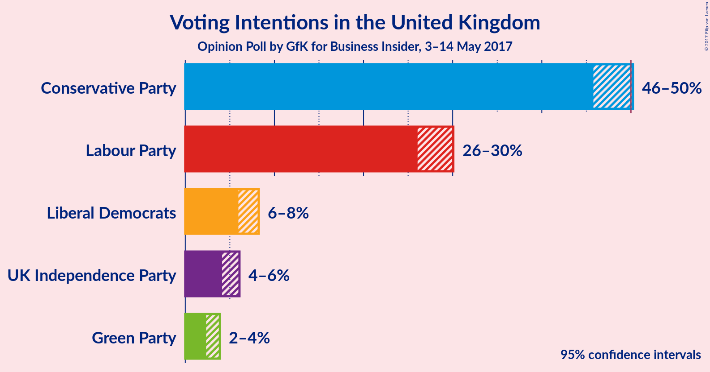
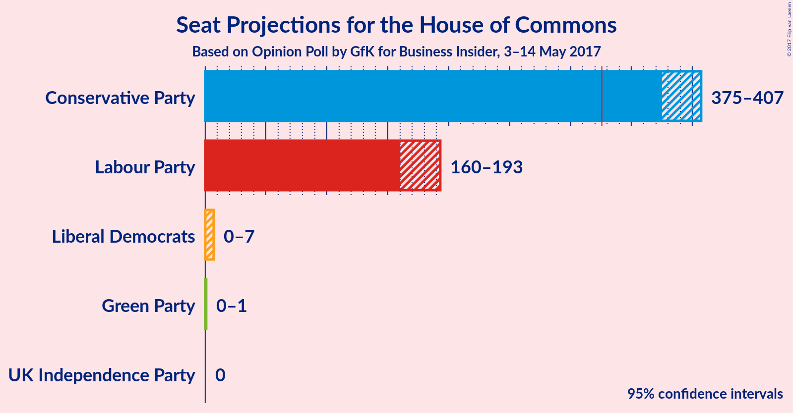
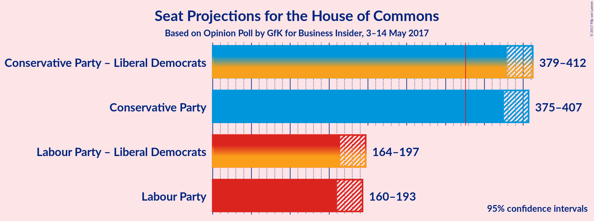

# Opinion Poll by GfK for Business Insider, 3–14 May 2017

<a href="#voting-intentions">Voting Intentions</a> | <a href="#seats">Seats</a> | <a href="#coalitions">Coalitions</a> | <a href="#technical-information">Technical Information</a>

## Voting Intentions

### Confidence Intervals

| Party | Last Result | Poll Result | 80% Confidence Interval | 90% Confidence Interval | 95% Confidence Interval | 99% Confidence Interval |
|:-----:|:-----------:|:-----------:|:-----------------------:|:-----------------------:|:-----------------------:|:-----------------------:|
| Conservative Party | 36.9% | 52.7% | 46.5–49.5% |46.1–49.9% |45.8–50.2% |45.1–50.9% |
| Labour Party | 30.4% | 30.8% | 26.7–29.4% |26.4–29.7% |26.1–30.1% |25.5–30.7% |
| Liberal Democrats | 7.9% | 7.7% | 6.3–7.8% |6.1–8.0% |6.0–8.2% |5.6–8.6% |
| UK Independence Party | 12.6% | 5.5% | 4.4–5.7% |4.3–5.9% |4.1–6.1% |3.9–6.4% |
| Green Party | 3.8% | 3.3% | 2.6–3.6% |2.5–3.7% |2.3–3.9% |2.1–4.2% |

*Note:* The poll result column reflects the actual value used in the calculations. Published results may vary slightly, and in addition be rounded to fewer digits.

## Seats

### Confidence Intervals

| Party | Last Result | Median | 80% Confidence Interval | 90% Confidence Interval | 95% Confidence Interval | 99% Confidence Interval |
|:-----:|:-----------:|:------:|:-----------------------:|:-----------------------:|:-----------------------:|:-----------------------:|
| <a href="#conservative-party">Conservative Party</a> | 331 | 389 | 381–401 |378–405 |375–407 |368–412 |
| <a href="#labour-party">Labour Party</a> | 232 | 178 | 166–187 |162–190 |160–193 |154–201 |
| <a href="#liberal-democrats">Liberal Democrats</a> | 8 | 4 | 2–6 |2–7 |0–7 |0–7 |
| <a href="#uk-independence-party">UK Independence Party</a> | 1 | 0 | 0 |0 |0 |0 |
| <a href="#green-party">Green Party</a> | 1 | 1 | 0–1 |0–1 |0–1 |0–1 |

### Conservative Party

| Number of Seats | Probability | Accumulated |
|:---------------:|:-----------:|:-----------:|
| 363 | 0% | 100% |
| 364 | 0.1% | 99.9% |
| 365 | 0.1% | 99.9% |
| 366 | 0.1% | 99.8% |
| 367 | 0.1% | 99.7% |
| 368 | 0.2% | 99.6% |
| 369 | 0.1% | 99.4% |
| 370 | 0.1% | 99.3% |
| 371 | 0.3% | 99.2% |
| 372 | 0.3% | 98.8% |
| 373 | 0.6% | 98.6% |
| 374 | 0.2% | 98% |
| 375 | 0.4% | 98% |
| 376 | 0.8% | 97% |
| 377 | 2% | 97% |
| 378 | 1.2% | 95% |
| 379 | 1.5% | 94% |
| 380 | 2% | 92% |
| 381 | 2% | 90% |
| 382 | 8% | 88% |
| 383 | 8% | 80% |
| 384 | 6% | 72% |
| 385 | 4% | 67% |
| 386 | 4% | 62% |
| 387 | 2% | 58% |
| 388 | 2% | 56% |
| 389 | 11% | 54% |
| 390 | 7% | 44% |
| 391 | 5% | 37% |
| 392 | 2% | 32% |
| 393 | 0.6% | 29% |
| 394 | 3% | 28% |
| 395 | 2% | 26% |
| 396 | 3% | 23% |
| 397 | 3% | 21% |
| 398 | 3% | 18% |
| 399 | 2% | 15% |
| 400 | 2% | 13% |
| 401 | 2% | 12% |
| 402 | 0.6% | 10% |
| 403 | 0.5% | 9% |
| 404 | 2% | 9% |
| 405 | 3% | 7% |
| 406 | 2% | 4% |
| 407 | 0.7% | 3% |
| 408 | 0.4% | 2% |
| 409 | 0.4% | 2% |
| 410 | 0.3% | 1.2% |
| 411 | 0.2% | 0.9% |
| 412 | 0.2% | 0.7% |
| 413 | 0.2% | 0.5% |
| 414 | 0.1% | 0.3% |
| 415 | 0.1% | 0.2% |
| 416 | 0% | 0.1% |
| 417 | 0% | 0.1% |
| 418 | 0% | 0.1% |
| 419 | 0% | 0% |

### Labour Party

| Number of Seats | Probability | Accumulated |
|:---------------:|:-----------:|:-----------:|
| 149 | 0% | 100% |
| 150 | 0% | 99.9% |
| 151 | 0.1% | 99.9% |
| 152 | 0.1% | 99.8% |
| 153 | 0.2% | 99.7% |
| 154 | 0.1% | 99.5% |
| 155 | 0.3% | 99.4% |
| 156 | 0.2% | 99.1% |
| 157 | 0.3% | 98.8% |
| 158 | 0.5% | 98.5% |
| 159 | 0.4% | 98% |
| 160 | 1.1% | 98% |
| 161 | 1.5% | 97% |
| 162 | 2% | 95% |
| 163 | 2% | 93% |
| 164 | 0.6% | 91% |
| 165 | 0.8% | 91% |
| 166 | 1.4% | 90% |
| 167 | 2% | 89% |
| 168 | 2% | 87% |
| 169 | 2% | 85% |
| 170 | 3% | 83% |
| 171 | 2% | 79% |
| 172 | 2% | 77% |
| 173 | 3% | 75% |
| 174 | 0.6% | 72% |
| 175 | 2% | 71% |
| 176 | 4% | 69% |
| 177 | 7% | 65% |
| 178 | 10% | 58% |
| 179 | 3% | 48% |
| 180 | 2% | 45% |
| 181 | 4% | 42% |
| 182 | 4% | 39% |
| 183 | 5% | 35% |
| 184 | 7% | 30% |
| 185 | 9% | 23% |
| 186 | 3% | 14% |
| 187 | 2% | 11% |
| 188 | 2% | 9% |
| 189 | 1.2% | 7% |
| 190 | 1.3% | 6% |
| 191 | 1.0% | 4% |
| 192 | 0.6% | 3% |
| 193 | 0.5% | 3% |
| 194 | 0.4% | 2% |
| 195 | 0.4% | 2% |
| 196 | 0.3% | 2% |
| 197 | 0.3% | 1.3% |
| 198 | 0.2% | 1.0% |
| 199 | 0.1% | 0.8% |
| 200 | 0.1% | 0.6% |
| 201 | 0.1% | 0.5% |
| 202 | 0.1% | 0.4% |
| 203 | 0.1% | 0.2% |
| 204 | 0.1% | 0.2% |
| 205 | 0% | 0.1% |
| 206 | 0% | 0.1% |
| 207 | 0% | 0% |

### Liberal Democrats

| Number of Seats | Probability | Accumulated |
|:---------------:|:-----------:|:-----------:|
| 0 | 3% | 100% |
| 1 | 2% | 97% |
| 2 | 10% | 95% |
| 3 | 14% | 85% |
| 4 | 30% | 72% |
| 5 | 16% | 41% |
| 6 | 20% | 26% |
| 7 | 5% | 6% |
| 8 | 0.2% | 0.5% |
| 9 | 0.1% | 0.3% |
| 10 | 0.1% | 0.2% |
| 11 | 0% | 0% |

### UK Independence Party

| Number of Seats | Probability | Accumulated |
|:---------------:|:-----------:|:-----------:|
| 0 | 100% | 100% |
| 1 | 0% | 0% |

### Green Party

| Number of Seats | Probability | Accumulated |
|:---------------:|:-----------:|:-----------:|
| 0 | 16% | 100% |
| 1 | 84% | 84% |
| 2 | 0.1% | 0.1% |
| 3 | 0% | 0% |

## Coalitions

### Confidence Intervals

| Coalition | Last Result | Median | 80% Confidence Interval | 90% Confidence Interval | 95% Confidence Interval | 99% Confidence Interval |
|:---------:|:-----------:|:------:|:-----------------------:|:-----------------------:|:-----------------------:|:-----------------------:|
| Conservative Party – Liberal Democrats | 339 | 393 | 384–406 | 382–410 | 379–412 | 372–417 |
| Conservative Party | 331 | 389 | 381–401 | 378–405 | 375–407 | 368–412 |
| Labour Party – Liberal Democrats | 240 | 183 | 170–191 | 166–194 | 164–197 | 158–204 |
| Labour Party | 232 | 178 | 166–187 | 162–190 | 160–193 | 154–201 |

### Conservative Party – Liberal Democrats

| Number of Seats | Probability | Accumulated |
|:---------------:|:-----------:|:-----------:|
| 366 | 0% | 100% |
| 367 | 0% | 99.9% |
| 368 | 0% | 99.9% |
| 369 | 0.1% | 99.9% |
| 370 | 0.1% | 99.8% |
| 371 | 0.1% | 99.7% |
| 372 | 0.1% | 99.6% |
| 373 | 0.2% | 99.4% |
| 374 | 0.2% | 99.3% |
| 375 | 0.2% | 99.0% |
| 376 | 0.4% | 98.8% |
| 377 | 0.3% | 98% |
| 378 | 0.5% | 98% |
| 379 | 0.5% | 98% |
| 380 | 0.9% | 97% |
| 381 | 1.1% | 96% |
| 382 | 1.3% | 95% |
| 383 | 2% | 94% |
| 384 | 2% | 92% |
| 385 | 4% | 90% |
| 386 | 5% | 86% |
| 387 | 7% | 81% |
| 388 | 6% | 74% |
| 389 | 4% | 68% |
| 390 | 4% | 64% |
| 391 | 3% | 59% |
| 392 | 3% | 56% |
| 393 | 8% | 53% |
| 394 | 5% | 46% |
| 395 | 7% | 40% |
| 396 | 2% | 33% |
| 397 | 3% | 31% |
| 398 | 3% | 29% |
| 399 | 1.1% | 26% |
| 400 | 3% | 25% |
| 401 | 2% | 21% |
| 402 | 2% | 19% |
| 403 | 3% | 17% |
| 404 | 2% | 14% |
| 405 | 1.5% | 12% |
| 406 | 1.2% | 11% |
| 407 | 1.0% | 10% |
| 408 | 1.4% | 9% |
| 409 | 2% | 7% |
| 410 | 2% | 6% |
| 411 | 1.3% | 4% |
| 412 | 0.8% | 3% |
| 413 | 0.3% | 2% |
| 414 | 0.4% | 1.5% |
| 415 | 0.2% | 1.1% |
| 416 | 0.3% | 0.9% |
| 417 | 0.2% | 0.6% |
| 418 | 0.2% | 0.4% |
| 419 | 0.1% | 0.3% |
| 420 | 0.1% | 0.2% |
| 421 | 0% | 0.1% |
| 422 | 0% | 0.1% |
| 423 | 0% | 0% |

### Conservative Party

| Number of Seats | Probability | Accumulated |
|:---------------:|:-----------:|:-----------:|
| 363 | 0% | 100% |
| 364 | 0.1% | 99.9% |
| 365 | 0.1% | 99.9% |
| 366 | 0.1% | 99.8% |
| 367 | 0.1% | 99.7% |
| 368 | 0.2% | 99.6% |
| 369 | 0.1% | 99.4% |
| 370 | 0.1% | 99.3% |
| 371 | 0.3% | 99.2% |
| 372 | 0.3% | 98.8% |
| 373 | 0.6% | 98.6% |
| 374 | 0.2% | 98% |
| 375 | 0.4% | 98% |
| 376 | 0.8% | 97% |
| 377 | 2% | 97% |
| 378 | 1.2% | 95% |
| 379 | 1.5% | 94% |
| 380 | 2% | 92% |
| 381 | 2% | 90% |
| 382 | 8% | 88% |
| 383 | 8% | 80% |
| 384 | 6% | 72% |
| 385 | 4% | 67% |
| 386 | 4% | 62% |
| 387 | 2% | 58% |
| 388 | 2% | 56% |
| 389 | 11% | 54% |
| 390 | 7% | 44% |
| 391 | 5% | 37% |
| 392 | 2% | 32% |
| 393 | 0.6% | 29% |
| 394 | 3% | 28% |
| 395 | 2% | 26% |
| 396 | 3% | 23% |
| 397 | 3% | 21% |
| 398 | 3% | 18% |
| 399 | 2% | 15% |
| 400 | 2% | 13% |
| 401 | 2% | 12% |
| 402 | 0.6% | 10% |
| 403 | 0.5% | 9% |
| 404 | 2% | 9% |
| 405 | 3% | 7% |
| 406 | 2% | 4% |
| 407 | 0.7% | 3% |
| 408 | 0.4% | 2% |
| 409 | 0.4% | 2% |
| 410 | 0.3% | 1.2% |
| 411 | 0.2% | 0.9% |
| 412 | 0.2% | 0.7% |
| 413 | 0.2% | 0.5% |
| 414 | 0.1% | 0.3% |
| 415 | 0.1% | 0.2% |
| 416 | 0% | 0.1% |
| 417 | 0% | 0.1% |
| 418 | 0% | 0.1% |
| 419 | 0% | 0% |

### Labour Party – Liberal Democrats

| Number of Seats | Probability | Accumulated |
|:---------------:|:-----------:|:-----------:|
| 153 | 0% | 100% |
| 154 | 0% | 99.9% |
| 155 | 0.1% | 99.9% |
| 156 | 0.1% | 99.9% |
| 157 | 0.2% | 99.8% |
| 158 | 0.1% | 99.6% |
| 159 | 0.3% | 99.5% |
| 160 | 0.2% | 99.2% |
| 161 | 0.4% | 99.0% |
| 162 | 0.3% | 98.7% |
| 163 | 0.4% | 98% |
| 164 | 0.7% | 98% |
| 165 | 1.5% | 97% |
| 166 | 2% | 96% |
| 167 | 2% | 94% |
| 168 | 1.1% | 92% |
| 169 | 0.7% | 91% |
| 170 | 1.2% | 90% |
| 171 | 1.5% | 89% |
| 172 | 2% | 88% |
| 173 | 2% | 86% |
| 174 | 3% | 83% |
| 175 | 3% | 81% |
| 176 | 3% | 78% |
| 177 | 2% | 75% |
| 178 | 2% | 73% |
| 179 | 2% | 71% |
| 180 | 3% | 69% |
| 181 | 7% | 66% |
| 182 | 7% | 59% |
| 183 | 7% | 52% |
| 184 | 3% | 45% |
| 185 | 3% | 42% |
| 186 | 4% | 39% |
| 187 | 5% | 36% |
| 188 | 6% | 30% |
| 189 | 8% | 24% |
| 190 | 5% | 16% |
| 191 | 2% | 11% |
| 192 | 2% | 9% |
| 193 | 1.2% | 7% |
| 194 | 1.4% | 6% |
| 195 | 1.0% | 4% |
| 196 | 0.8% | 3% |
| 197 | 0.4% | 3% |
| 198 | 0.3% | 2% |
| 199 | 0.4% | 2% |
| 200 | 0.3% | 2% |
| 201 | 0.3% | 1.2% |
| 202 | 0.2% | 0.9% |
| 203 | 0.1% | 0.8% |
| 204 | 0.2% | 0.6% |
| 205 | 0.1% | 0.5% |
| 206 | 0.1% | 0.3% |
| 207 | 0.1% | 0.2% |
| 208 | 0.1% | 0.1% |
| 209 | 0% | 0.1% |
| 210 | 0% | 0.1% |
| 211 | 0% | 0% |

### Labour Party

| Number of Seats | Probability | Accumulated |
|:---------------:|:-----------:|:-----------:|
| 149 | 0% | 100% |
| 150 | 0% | 99.9% |
| 151 | 0.1% | 99.9% |
| 152 | 0.1% | 99.8% |
| 153 | 0.2% | 99.7% |
| 154 | 0.1% | 99.5% |
| 155 | 0.3% | 99.4% |
| 156 | 0.2% | 99.1% |
| 157 | 0.3% | 98.8% |
| 158 | 0.5% | 98.5% |
| 159 | 0.4% | 98% |
| 160 | 1.1% | 98% |
| 161 | 1.5% | 97% |
| 162 | 2% | 95% |
| 163 | 2% | 93% |
| 164 | 0.6% | 91% |
| 165 | 0.8% | 91% |
| 166 | 1.4% | 90% |
| 167 | 2% | 89% |
| 168 | 2% | 87% |
| 169 | 2% | 85% |
| 170 | 3% | 83% |
| 171 | 2% | 79% |
| 172 | 2% | 77% |
| 173 | 3% | 75% |
| 174 | 0.6% | 72% |
| 175 | 2% | 71% |
| 176 | 4% | 69% |
| 177 | 7% | 65% |
| 178 | 10% | 58% |
| 179 | 3% | 48% |
| 180 | 2% | 45% |
| 181 | 4% | 42% |
| 182 | 4% | 39% |
| 183 | 5% | 35% |
| 184 | 7% | 30% |
| 185 | 9% | 23% |
| 186 | 3% | 14% |
| 187 | 2% | 11% |
| 188 | 2% | 9% |
| 189 | 1.2% | 7% |
| 190 | 1.3% | 6% |
| 191 | 1.0% | 4% |
| 192 | 0.6% | 3% |
| 193 | 0.5% | 3% |
| 194 | 0.4% | 2% |
| 195 | 0.4% | 2% |
| 196 | 0.3% | 2% |
| 197 | 0.3% | 1.3% |
| 198 | 0.2% | 1.0% |
| 199 | 0.1% | 0.8% |
| 200 | 0.1% | 0.6% |
| 201 | 0.1% | 0.5% |
| 202 | 0.1% | 0.4% |
| 203 | 0.1% | 0.2% |
| 204 | 0.1% | 0.2% |
| 205 | 0% | 0.1% |
| 206 | 0% | 0.1% |
| 207 | 0% | 0% |

## Technical Information

### Opinion Poll

+ **Pollster:** GfK
+ **Media:** Business Insider
+ **Fieldwork period:** 3–14 May 2017

### Calculations

+ **Sample size:** 1778
+ **Simulations done:** 2,097,152
+ **Error estimate:** 0.20%

