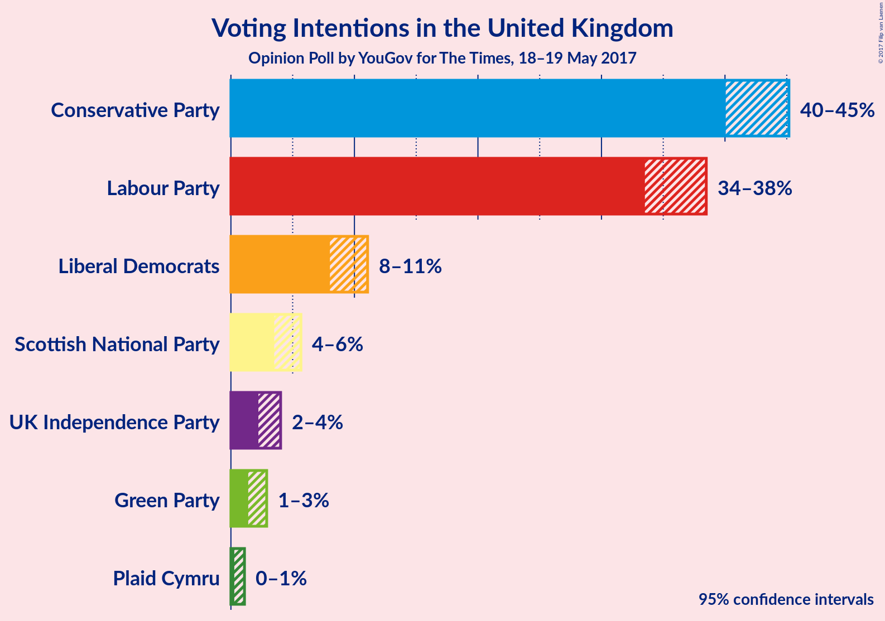
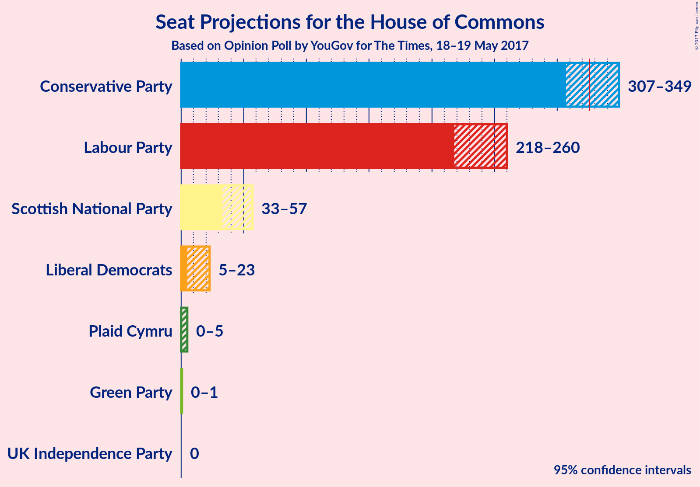
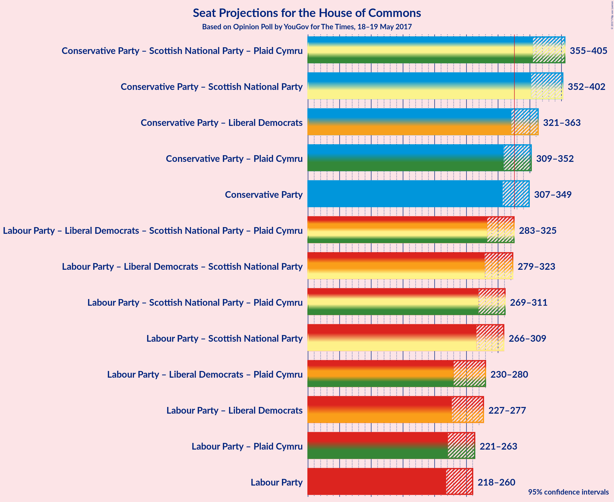

# Opinion Poll by YouGov for The Times, 18–19 May 2017

<a href="#voting-intentions">Voting Intentions</a> | <a href="#seats">Seats</a> | <a href="#coalitions">Coalitions</a> | <a href="#technical-information">Technical Information</a>

## Voting Intentions

### Confidence Intervals

| Party | Last Result | Poll Result | 80% Confidence Interval | 90% Confidence Interval | 95% Confidence Interval | 99% Confidence Interval |
|:-----:|:-----------:|:-----------:|:-----------------------:|:-----------------------:|:-----------------------:|:-----------------------:|
| Conservative Party | 36.9% | 43.4% | 40.9–44.3% |40.5–44.8% |40.1–45.2% |39.3–46.0% |
| Labour Party | 30.4% | 36.7% | 34.4–37.6% |33.9–38.1% |33.5–38.5% |32.8–39.3% |
| Liberal Democrats | 7.9% | 9.6% | 8.5–10.5% |8.2–10.8% |8.0–11.1% |7.6–11.6% |
| Scottish National Party | 4.7% | 4.6% | 3.8–5.3% |3.7–5.5% |3.5–5.7% |3.2–6.1% |
| UK Independence Party | 12.6% | 3.1% | 2.5–3.7% |2.3–3.9% |2.2–4.0% |2.0–4.4% |
| Green Party | 3.8% | 2.1% | 1.6–2.6% |1.5–2.8% |1.4–2.9% |1.2–3.2% |
| Plaid Cymru | 0.6% | 0.6% | 0.4–0.9% |0.3–1.0% |0.3–1.1% |0.2–1.3% |

*Note:* The poll result column reflects the actual value used in the calculations. Published results may vary slightly, and in addition be rounded to fewer digits.

## Seats

### Confidence Intervals

| Party | Last Result | Median | 80% Confidence Interval | 90% Confidence Interval | 95% Confidence Interval | 99% Confidence Interval |
|:-----:|:-----------:|:------:|:-----------------------:|:-----------------------:|:-----------------------:|:-----------------------:|
| <a href="#conservative-party">Conservative Party</a> | 331 | 330 | 314–345 |310–347 |307–349 |300–353 |
| <a href="#labour-party">Labour Party</a> | 232 | 235 | 221–252 |218–257 |218–260 |215–271 |
| <a href="#liberal-democrats">Liberal Democrats</a> | 8 | 12 | 8–20 |6–21 |5–23 |3–27 |
| <a href="#scottish-national-party">Scottish National Party</a> | 56 | 52 | 43–55 |40–56 |33–57 |24–58 |
| <a href="#uk-independence-party">UK Independence Party</a> | 1 | 0 | 0 |0 |0 |0 |
| <a href="#green-party">Green Party</a> | 1 | 0 | 0 |0 |0–1 |0–1 |
| <a href="#plaid-cymru">Plaid Cymru</a> | 3 | 3 | 1–4 |0–5 |0–5 |0–7 |

### Conservative Party

| Number of Seats | Probability | Accumulated |
|:---------------:|:-----------:|:-----------:|
| 292 | 0% | 100% |
| 293 | 0% | 99.9% |
| 294 | 0% | 99.9% |
| 295 | 0.1% | 99.9% |
| 296 | 0% | 99.8% |
| 297 | 0% | 99.8% |
| 298 | 0.1% | 99.8% |
| 299 | 0.1% | 99.7% |
| 300 | 0.1% | 99.6% |
| 301 | 0.1% | 99.4% |
| 302 | 0.3% | 99.3% |
| 303 | 0.2% | 99.0% |
| 304 | 0.4% | 98.8% |
| 305 | 0.6% | 98% |
| 306 | 0.4% | 98% |
| 307 | 0.7% | 98% |
| 308 | 0.8% | 97% |
| 309 | 0.9% | 96% |
| 310 | 0.7% | 95% |
| 311 | 1.2% | 94% |
| 312 | 1.4% | 93% |
| 313 | 2% | 92% |
| 314 | 3% | 90% |
| 315 | 2% | 87% |
| 316 | 2% | 85% |
| 317 | 2% | 82% |
| 318 | 3% | 81% |
| 319 | 4% | 78% |
| 320 | 3% | 74% |
| 321 | 2% | 71% |
| 322 | 1.2% | 69% |
| 323 | 1.0% | 67% |
| 324 | 2% | 66% |
| 325 | 3% | 65% |
| 326 | 3% | 62% |
| 327 | 2% | 59% |
| 328 | 2% | 56% |
| 329 | 2% | 55% |
| 330 | 5% | 52% |
| 331 | 7% | 47% |
| 332 | 3% | 40% |
| 333 | 2% | 37% |
| 334 | 3% | 34% |
| 335 | 6% | 31% |
| 336 | 3% | 25% |
| 337 | 3% | 22% |
| 338 | 1.0% | 19% |
| 339 | 2% | 18% |
| 340 | 0.8% | 16% |
| 341 | 1.1% | 15% |
| 342 | 2% | 14% |
| 343 | 1.1% | 12% |
| 344 | 0.6% | 11% |
| 345 | 2% | 11% |
| 346 | 0.8% | 9% |
| 347 | 4% | 8% |
| 348 | 0.8% | 4% |
| 349 | 2% | 4% |
| 350 | 0.5% | 2% |
| 351 | 0.8% | 1.5% |
| 352 | 0.1% | 0.7% |
| 353 | 0.2% | 0.6% |
| 354 | 0.1% | 0.3% |
| 355 | 0% | 0.3% |
| 356 | 0% | 0.2% |
| 357 | 0% | 0.2% |
| 358 | 0% | 0.2% |
| 359 | 0% | 0.1% |
| 360 | 0% | 0.1% |
| 361 | 0% | 0.1% |
| 362 | 0% | 0.1% |
| 363 | 0% | 0.1% |
| 364 | 0% | 0% |

### Labour Party

| Number of Seats | Probability | Accumulated |
|:---------------:|:-----------:|:-----------:|
| 203 | 0% | 100% |
| 204 | 0% | 99.9% |
| 205 | 0% | 99.9% |
| 206 | 0% | 99.9% |
| 207 | 0% | 99.9% |
| 208 | 0% | 99.9% |
| 209 | 0% | 99.9% |
| 210 | 0% | 99.8% |
| 211 | 0% | 99.8% |
| 212 | 0% | 99.8% |
| 213 | 0.1% | 99.7% |
| 214 | 0.1% | 99.6% |
| 215 | 0.2% | 99.5% |
| 216 | 0.6% | 99.4% |
| 217 | 0.9% | 98.7% |
| 218 | 3% | 98% |
| 219 | 3% | 95% |
| 220 | 1.3% | 91% |
| 221 | 1.3% | 90% |
| 222 | 1.3% | 89% |
| 223 | 0.5% | 88% |
| 224 | 0.4% | 87% |
| 225 | 0.9% | 87% |
| 226 | 0.5% | 86% |
| 227 | 0.9% | 85% |
| 228 | 0.8% | 84% |
| 229 | 4% | 83% |
| 230 | 1.3% | 80% |
| 231 | 3% | 78% |
| 232 | 8% | 75% |
| 233 | 4% | 67% |
| 234 | 5% | 62% |
| 235 | 7% | 57% |
| 236 | 4% | 49% |
| 237 | 4% | 45% |
| 238 | 2% | 42% |
| 239 | 2% | 39% |
| 240 | 1.3% | 38% |
| 241 | 1.2% | 36% |
| 242 | 0.9% | 35% |
| 243 | 0.5% | 34% |
| 244 | 0.8% | 34% |
| 245 | 0.9% | 33% |
| 246 | 3% | 32% |
| 247 | 3% | 29% |
| 248 | 4% | 27% |
| 249 | 5% | 23% |
| 250 | 4% | 18% |
| 251 | 2% | 14% |
| 252 | 3% | 12% |
| 253 | 1.3% | 9% |
| 254 | 0.9% | 7% |
| 255 | 0.5% | 7% |
| 256 | 0.9% | 6% |
| 257 | 0.6% | 5% |
| 258 | 0.6% | 5% |
| 259 | 0.9% | 4% |
| 260 | 0.8% | 3% |
| 261 | 0.4% | 2% |
| 262 | 0.3% | 2% |
| 263 | 0.2% | 2% |
| 264 | 0.1% | 1.3% |
| 265 | 0.1% | 1.2% |
| 266 | 0.2% | 1.1% |
| 267 | 0.1% | 0.9% |
| 268 | 0.2% | 0.8% |
| 269 | 0.1% | 0.7% |
| 270 | 0% | 0.6% |
| 271 | 0.1% | 0.5% |
| 272 | 0.1% | 0.4% |
| 273 | 0.1% | 0.4% |
| 274 | 0.1% | 0.3% |
| 275 | 0% | 0.3% |
| 276 | 0% | 0.2% |
| 277 | 0% | 0.2% |
| 278 | 0% | 0.2% |
| 279 | 0% | 0.2% |
| 280 | 0% | 0.1% |
| 281 | 0% | 0.1% |
| 282 | 0% | 0.1% |
| 283 | 0% | 0.1% |
| 284 | 0% | 0.1% |
| 285 | 0% | 0.1% |
| 286 | 0% | 0.1% |
| 287 | 0% | 0% |

### Liberal Democrats

| Number of Seats | Probability | Accumulated |
|:---------------:|:-----------:|:-----------:|
| 2 | 0.1% | 100% |
| 3 | 0.5% | 99.9% |
| 4 | 1.1% | 99.4% |
| 5 | 2% | 98% |
| 6 | 2% | 96% |
| 7 | 3% | 94% |
| 8 | 7% | 90% |
| 9 | 11% | 83% |
| 10 | 15% | 72% |
| 11 | 6% | 57% |
| 12 | 6% | 51% |
| 13 | 6% | 45% |
| 14 | 5% | 39% |
| 15 | 5% | 35% |
| 16 | 5% | 30% |
| 17 | 5% | 25% |
| 18 | 4% | 20% |
| 19 | 6% | 16% |
| 20 | 3% | 10% |
| 21 | 2% | 7% |
| 22 | 1.2% | 5% |
| 23 | 1.3% | 4% |
| 24 | 0.8% | 2% |
| 25 | 0.7% | 2% |
| 26 | 0.3% | 0.8% |
| 27 | 0.3% | 0.6% |
| 28 | 0.1% | 0.2% |
| 29 | 0.1% | 0.2% |
| 30 | 0% | 0.1% |
| 31 | 0% | 0% |

### Scottish National Party

| Number of Seats | Probability | Accumulated |
|:---------------:|:-----------:|:-----------:|
| 9 | 0% | 100% |
| 10 | 0% | 99.9% |
| 11 | 0% | 99.9% |
| 12 | 0% | 99.9% |
| 13 | 0% | 99.9% |
| 14 | 0% | 99.9% |
| 15 | 0.1% | 99.9% |
| 16 | 0% | 99.8% |
| 17 | 0% | 99.8% |
| 18 | 0.1% | 99.8% |
| 19 | 0% | 99.7% |
| 20 | 0% | 99.7% |
| 21 | 0% | 99.7% |
| 22 | 0.1% | 99.6% |
| 23 | 0% | 99.6% |
| 24 | 0.1% | 99.5% |
| 25 | 0.1% | 99.4% |
| 26 | 0.1% | 99.3% |
| 27 | 0.1% | 99.2% |
| 28 | 0.5% | 99.1% |
| 29 | 0.2% | 98.6% |
| 30 | 0.3% | 98% |
| 31 | 0.2% | 98% |
| 32 | 0.3% | 98% |
| 33 | 0.4% | 98% |
| 34 | 0.1% | 97% |
| 35 | 0.1% | 97% |
| 36 | 0.1% | 97% |
| 37 | 0.1% | 97% |
| 38 | 0.4% | 97% |
| 39 | 0.7% | 96% |
| 40 | 1.4% | 96% |
| 41 | 0.8% | 94% |
| 42 | 1.2% | 94% |
| 43 | 3% | 92% |
| 44 | 2% | 90% |
| 45 | 4% | 88% |
| 46 | 5% | 84% |
| 47 | 4% | 79% |
| 48 | 4% | 76% |
| 49 | 7% | 72% |
| 50 | 7% | 65% |
| 51 | 2% | 58% |
| 52 | 12% | 56% |
| 53 | 13% | 44% |
| 54 | 14% | 31% |
| 55 | 11% | 18% |
| 56 | 4% | 7% |
| 57 | 2% | 3% |
| 58 | 0.8% | 0.9% |
| 59 | 0.1% | 0.1% |
| 60 | 0% | 0% |

### UK Independence Party

| Number of Seats | Probability | Accumulated |
|:---------------:|:-----------:|:-----------:|
| 0 | 100% | 100% |
| 1 | 0% | 0% |

### Green Party

| Number of Seats | Probability | Accumulated |
|:---------------:|:-----------:|:-----------:|
| 0 | 97% | 100% |
| 1 | 3% | 3% |
| 2 | 0% | 0% |

### Plaid Cymru

| Number of Seats | Probability | Accumulated |
|:---------------:|:-----------:|:-----------:|
| 0 | 9% | 100% |
| 1 | 9% | 91% |
| 2 | 9% | 83% |
| 3 | 46% | 73% |
| 4 | 20% | 28% |
| 5 | 8% | 8% |
| 6 | 0.2% | 0.7% |
| 7 | 0.5% | 0.5% |
| 8 | 0% | 0% |

## Coalitions

### Confidence Intervals

| Coalition | Last Result | Median | 80% Confidence Interval | 90% Confidence Interval | 95% Confidence Interval | 99% Confidence Interval |
|:---------:|:-----------:|:------:|:-----------------------:|:-----------------------:|:-----------------------:|:-----------------------:|
| Conservative Party – Scottish National Party – Plaid Cymru | 390 | 383 | 365–397 | 358–403 | 355–405 | 343–408 |
| Conservative Party – Scottish National Party | 387 | 380 | 362–394 | 355–399 | 352–402 | 340–405 |
| Conservative Party – Liberal Democrats | 339 | 342 | 327–357 | 325–360 | 321–363 | 315–368 |
| Conservative Party – Plaid Cymru | 334 | 333 | 317–349 | 313–351 | 309–352 | 303–356 |
| Conservative Party | 331 | 330 | 314–345 | 310–347 | 307–349 | 300–353 |
| Labour Party – Liberal Democrats – Scottish National Party – Plaid Cymru | 299 | 302 | 287–318 | 285–322 | 283–325 | 279–332 |
| Labour Party – Liberal Democrats – Scottish National Party | 296 | 299 | 283–315 | 281–319 | 279–323 | 276–329 |
| Labour Party – Scottish National Party – Plaid Cymru | 291 | 290 | 275–305 | 272–307 | 269–311 | 264–317 |
| Labour Party – Scottish National Party | 288 | 287 | 272–303 | 269–305 | 266–309 | 261–314 |
| Labour Party – Liberal Democrats – Plaid Cymru | 243 | 252 | 238–270 | 233–277 | 230–280 | 227–292 |
| Labour Party – Liberal Democrats | 240 | 249 | 235–267 | 229–274 | 227–277 | 224–289 |
| Labour Party – Plaid Cymru | 235 | 238 | 224–255 | 222–260 | 221–263 | 217–273 |
| Labour Party | 232 | 235 | 221–252 | 218–257 | 218–260 | 215–271 |

### Conservative Party – Scottish National Party – Plaid Cymru

| Number of Seats | Probability | Accumulated |
|:---------------:|:-----------:|:-----------:|
| 328 | 0% | 100% |
| 329 | 0% | 99.9% |
| 330 | 0% | 99.9% |
| 331 | 0% | 99.9% |
| 332 | 0% | 99.9% |
| 333 | 0% | 99.9% |
| 334 | 0% | 99.9% |
| 335 | 0% | 99.8% |
| 336 | 0% | 99.8% |
| 337 | 0% | 99.8% |
| 338 | 0.1% | 99.8% |
| 339 | 0% | 99.7% |
| 340 | 0% | 99.7% |
| 341 | 0% | 99.6% |
| 342 | 0.1% | 99.6% |
| 343 | 0.1% | 99.5% |
| 344 | 0.1% | 99.5% |
| 345 | 0.1% | 99.3% |
| 346 | 0.1% | 99.3% |
| 347 | 0.1% | 99.1% |
| 348 | 0.1% | 99.0% |
| 349 | 0.3% | 98.9% |
| 350 | 0.2% | 98.7% |
| 351 | 0.2% | 98.5% |
| 352 | 0.2% | 98% |
| 353 | 0.2% | 98% |
| 354 | 0.2% | 98% |
| 355 | 0.7% | 98% |
| 356 | 1.0% | 97% |
| 357 | 0.7% | 96% |
| 358 | 0.7% | 95% |
| 359 | 0.6% | 95% |
| 360 | 0.7% | 94% |
| 361 | 0.5% | 93% |
| 362 | 0.7% | 93% |
| 363 | 0.9% | 92% |
| 364 | 0.8% | 91% |
| 365 | 3% | 91% |
| 366 | 1.2% | 88% |
| 367 | 2% | 87% |
| 368 | 2% | 85% |
| 369 | 3% | 83% |
| 370 | 2% | 80% |
| 371 | 2% | 78% |
| 372 | 2% | 76% |
| 373 | 1.4% | 73% |
| 374 | 2% | 72% |
| 375 | 2% | 70% |
| 376 | 2% | 68% |
| 377 | 2% | 66% |
| 378 | 4% | 63% |
| 379 | 3% | 59% |
| 380 | 2% | 56% |
| 381 | 3% | 54% |
| 382 | 1.0% | 51% |
| 383 | 2% | 50% |
| 384 | 2% | 48% |
| 385 | 2% | 46% |
| 386 | 4% | 44% |
| 387 | 3% | 41% |
| 388 | 6% | 38% |
| 389 | 1.5% | 33% |
| 390 | 8% | 31% |
| 391 | 2% | 23% |
| 392 | 3% | 21% |
| 393 | 2% | 18% |
| 394 | 2% | 16% |
| 395 | 2% | 14% |
| 396 | 1.4% | 12% |
| 397 | 1.3% | 11% |
| 398 | 0.7% | 10% |
| 399 | 0.5% | 9% |
| 400 | 0.6% | 8% |
| 401 | 0.9% | 8% |
| 402 | 1.0% | 7% |
| 403 | 2% | 6% |
| 404 | 1.1% | 4% |
| 405 | 1.1% | 3% |
| 406 | 0.9% | 2% |
| 407 | 0.4% | 1.0% |
| 408 | 0.2% | 0.6% |
| 409 | 0.1% | 0.4% |
| 410 | 0.1% | 0.3% |
| 411 | 0% | 0.2% |
| 412 | 0% | 0.2% |
| 413 | 0% | 0.1% |
| 414 | 0% | 0.1% |
| 415 | 0% | 0.1% |
| 416 | 0% | 0.1% |
| 417 | 0% | 0.1% |
| 418 | 0% | 0.1% |
| 419 | 0% | 0% |

### Conservative Party – Scottish National Party

| Number of Seats | Probability | Accumulated |
|:---------------:|:-----------:|:-----------:|
| 325 | 0% | 100% |
| 326 | 0% | 99.9% |
| 327 | 0% | 99.9% |
| 328 | 0% | 99.9% |
| 329 | 0% | 99.9% |
| 330 | 0% | 99.9% |
| 331 | 0% | 99.9% |
| 332 | 0% | 99.9% |
| 333 | 0% | 99.8% |
| 334 | 0% | 99.8% |
| 335 | 0.1% | 99.8% |
| 336 | 0.1% | 99.7% |
| 337 | 0% | 99.7% |
| 338 | 0% | 99.7% |
| 339 | 0.1% | 99.6% |
| 340 | 0.1% | 99.5% |
| 341 | 0.1% | 99.4% |
| 342 | 0.1% | 99.4% |
| 343 | 0.2% | 99.3% |
| 344 | 0.1% | 99.1% |
| 345 | 0.1% | 99.1% |
| 346 | 0.2% | 98.9% |
| 347 | 0.2% | 98.8% |
| 348 | 0.1% | 98.6% |
| 349 | 0.3% | 98% |
| 350 | 0.2% | 98% |
| 351 | 0.4% | 98% |
| 352 | 0.5% | 98% |
| 353 | 1.1% | 97% |
| 354 | 0.5% | 96% |
| 355 | 0.6% | 96% |
| 356 | 0.8% | 95% |
| 357 | 0.5% | 94% |
| 358 | 0.8% | 94% |
| 359 | 0.4% | 93% |
| 360 | 0.6% | 92% |
| 361 | 1.2% | 92% |
| 362 | 2% | 91% |
| 363 | 1.3% | 88% |
| 364 | 2% | 87% |
| 365 | 2% | 85% |
| 366 | 2% | 83% |
| 367 | 2% | 81% |
| 368 | 2% | 79% |
| 369 | 2% | 76% |
| 370 | 2% | 75% |
| 371 | 2% | 73% |
| 372 | 2% | 71% |
| 373 | 4% | 69% |
| 374 | 3% | 66% |
| 375 | 4% | 63% |
| 376 | 3% | 59% |
| 377 | 2% | 56% |
| 378 | 2% | 54% |
| 379 | 2% | 52% |
| 380 | 2% | 50% |
| 381 | 3% | 48% |
| 382 | 2% | 45% |
| 383 | 4% | 44% |
| 384 | 0.8% | 40% |
| 385 | 7% | 39% |
| 386 | 1.4% | 33% |
| 387 | 4% | 31% |
| 388 | 3% | 27% |
| 389 | 3% | 24% |
| 390 | 4% | 21% |
| 391 | 3% | 17% |
| 392 | 2% | 14% |
| 393 | 1.0% | 12% |
| 394 | 2% | 11% |
| 395 | 0.5% | 10% |
| 396 | 0.8% | 9% |
| 397 | 0.9% | 8% |
| 398 | 0.5% | 7% |
| 399 | 2% | 7% |
| 400 | 0.7% | 5% |
| 401 | 1.5% | 4% |
| 402 | 1.4% | 3% |
| 403 | 0.3% | 1.2% |
| 404 | 0.3% | 0.9% |
| 405 | 0.1% | 0.5% |
| 406 | 0.1% | 0.4% |
| 407 | 0% | 0.3% |
| 408 | 0.1% | 0.2% |
| 409 | 0% | 0.1% |
| 410 | 0% | 0.1% |
| 411 | 0% | 0.1% |
| 412 | 0% | 0.1% |
| 413 | 0% | 0.1% |
| 414 | 0% | 0.1% |
| 415 | 0% | 0% |

### Conservative Party – Liberal Democrats

| Number of Seats | Probability | Accumulated |
|:---------------:|:-----------:|:-----------:|
| 307 | 0% | 100% |
| 308 | 0% | 99.9% |
| 309 | 0% | 99.9% |
| 310 | 0% | 99.9% |
| 311 | 0% | 99.9% |
| 312 | 0% | 99.9% |
| 313 | 0% | 99.8% |
| 314 | 0.2% | 99.8% |
| 315 | 0.1% | 99.6% |
| 316 | 0.3% | 99.5% |
| 317 | 0.2% | 99.2% |
| 318 | 0.5% | 99.0% |
| 319 | 0.5% | 98.6% |
| 320 | 0.4% | 98% |
| 321 | 0.5% | 98% |
| 322 | 0.5% | 97% |
| 323 | 0.6% | 97% |
| 324 | 1.0% | 96% |
| 325 | 2% | 95% |
| 326 | 2% | 93% |
| 327 | 3% | 91% |
| 328 | 5% | 88% |
| 329 | 1.4% | 83% |
| 330 | 3% | 82% |
| 331 | 3% | 78% |
| 332 | 2% | 76% |
| 333 | 1.2% | 73% |
| 334 | 2% | 72% |
| 335 | 2% | 70% |
| 336 | 2% | 69% |
| 337 | 2% | 67% |
| 338 | 2% | 65% |
| 339 | 2% | 63% |
| 340 | 4% | 61% |
| 341 | 5% | 57% |
| 342 | 4% | 52% |
| 343 | 3% | 48% |
| 344 | 7% | 44% |
| 345 | 4% | 37% |
| 346 | 4% | 33% |
| 347 | 2% | 29% |
| 348 | 4% | 28% |
| 349 | 2% | 24% |
| 350 | 3% | 22% |
| 351 | 2% | 19% |
| 352 | 0.9% | 17% |
| 353 | 1.4% | 16% |
| 354 | 1.2% | 15% |
| 355 | 1.2% | 13% |
| 356 | 1.4% | 12% |
| 357 | 2% | 11% |
| 358 | 1.3% | 8% |
| 359 | 1.1% | 7% |
| 360 | 1.4% | 6% |
| 361 | 0.6% | 5% |
| 362 | 1.4% | 4% |
| 363 | 0.7% | 3% |
| 364 | 0.7% | 2% |
| 365 | 0.1% | 1.2% |
| 366 | 0.2% | 1.1% |
| 367 | 0.4% | 0.9% |
| 368 | 0.2% | 0.5% |
| 369 | 0.1% | 0.3% |
| 370 | 0% | 0.2% |
| 371 | 0% | 0.2% |
| 372 | 0% | 0.1% |
| 373 | 0% | 0.1% |
| 374 | 0% | 0.1% |
| 375 | 0% | 0.1% |
| 376 | 0% | 0.1% |
| 377 | 0% | 0.1% |
| 378 | 0% | 0% |

### Conservative Party – Plaid Cymru

| Number of Seats | Probability | Accumulated |
|:---------------:|:-----------:|:-----------:|
| 293 | 0% | 100% |
| 294 | 0% | 99.9% |
| 295 | 0% | 99.9% |
| 296 | 0% | 99.9% |
| 297 | 0% | 99.9% |
| 298 | 0% | 99.9% |
| 299 | 0.1% | 99.9% |
| 300 | 0.1% | 99.8% |
| 301 | 0.1% | 99.7% |
| 302 | 0.1% | 99.6% |
| 303 | 0.2% | 99.5% |
| 304 | 0.2% | 99.4% |
| 305 | 0.2% | 99.2% |
| 306 | 0.3% | 99.0% |
| 307 | 0.3% | 98.6% |
| 308 | 0.6% | 98% |
| 309 | 0.3% | 98% |
| 310 | 0.7% | 97% |
| 311 | 0.8% | 97% |
| 312 | 0.8% | 96% |
| 313 | 1.3% | 95% |
| 314 | 0.9% | 94% |
| 315 | 2% | 93% |
| 316 | 1.0% | 91% |
| 317 | 3% | 90% |
| 318 | 3% | 87% |
| 319 | 2% | 84% |
| 320 | 3% | 82% |
| 321 | 4% | 79% |
| 322 | 3% | 75% |
| 323 | 2% | 72% |
| 324 | 1.4% | 70% |
| 325 | 2% | 69% |
| 326 | 0.9% | 67% |
| 327 | 1.2% | 66% |
| 328 | 3% | 65% |
| 329 | 1.1% | 62% |
| 330 | 4% | 61% |
| 331 | 2% | 57% |
| 332 | 3% | 55% |
| 333 | 5% | 52% |
| 334 | 5% | 47% |
| 335 | 5% | 42% |
| 336 | 5% | 37% |
| 337 | 3% | 32% |
| 338 | 5% | 29% |
| 339 | 4% | 23% |
| 340 | 1.3% | 19% |
| 341 | 1.0% | 18% |
| 342 | 1.5% | 17% |
| 343 | 1.5% | 15% |
| 344 | 0.6% | 14% |
| 345 | 1.2% | 13% |
| 346 | 0.9% | 12% |
| 347 | 0.5% | 11% |
| 348 | 0.8% | 11% |
| 349 | 2% | 10% |
| 350 | 3% | 8% |
| 351 | 0.9% | 5% |
| 352 | 2% | 4% |
| 353 | 0.8% | 2% |
| 354 | 0.8% | 2% |
| 355 | 0.3% | 0.9% |
| 356 | 0.2% | 0.5% |
| 357 | 0.1% | 0.4% |
| 358 | 0% | 0.3% |
| 359 | 0% | 0.2% |
| 360 | 0% | 0.2% |
| 361 | 0% | 0.2% |
| 362 | 0% | 0.2% |
| 363 | 0% | 0.1% |
| 364 | 0% | 0.1% |
| 365 | 0% | 0.1% |
| 366 | 0% | 0.1% |
| 367 | 0% | 0% |

### Conservative Party

| Number of Seats | Probability | Accumulated |
|:---------------:|:-----------:|:-----------:|
| 292 | 0% | 100% |
| 293 | 0% | 99.9% |
| 294 | 0% | 99.9% |
| 295 | 0.1% | 99.9% |
| 296 | 0% | 99.8% |
| 297 | 0% | 99.8% |
| 298 | 0.1% | 99.8% |
| 299 | 0.1% | 99.7% |
| 300 | 0.1% | 99.6% |
| 301 | 0.1% | 99.4% |
| 302 | 0.3% | 99.3% |
| 303 | 0.2% | 99.0% |
| 304 | 0.4% | 98.8% |
| 305 | 0.6% | 98% |
| 306 | 0.4% | 98% |
| 307 | 0.7% | 98% |
| 308 | 0.8% | 97% |
| 309 | 0.9% | 96% |
| 310 | 0.7% | 95% |
| 311 | 1.2% | 94% |
| 312 | 1.4% | 93% |
| 313 | 2% | 92% |
| 314 | 3% | 90% |
| 315 | 2% | 87% |
| 316 | 2% | 85% |
| 317 | 2% | 82% |
| 318 | 3% | 81% |
| 319 | 4% | 78% |
| 320 | 3% | 74% |
| 321 | 2% | 71% |
| 322 | 1.2% | 69% |
| 323 | 1.0% | 67% |
| 324 | 2% | 66% |
| 325 | 3% | 65% |
| 326 | 3% | 62% |
| 327 | 2% | 59% |
| 328 | 2% | 56% |
| 329 | 2% | 55% |
| 330 | 5% | 52% |
| 331 | 7% | 47% |
| 332 | 3% | 40% |
| 333 | 2% | 37% |
| 334 | 3% | 34% |
| 335 | 6% | 31% |
| 336 | 3% | 25% |
| 337 | 3% | 22% |
| 338 | 1.0% | 19% |
| 339 | 2% | 18% |
| 340 | 0.8% | 16% |
| 341 | 1.1% | 15% |
| 342 | 2% | 14% |
| 343 | 1.1% | 12% |
| 344 | 0.6% | 11% |
| 345 | 2% | 11% |
| 346 | 0.8% | 9% |
| 347 | 4% | 8% |
| 348 | 0.8% | 4% |
| 349 | 2% | 4% |
| 350 | 0.5% | 2% |
| 351 | 0.8% | 1.5% |
| 352 | 0.1% | 0.7% |
| 353 | 0.2% | 0.6% |
| 354 | 0.1% | 0.3% |
| 355 | 0% | 0.3% |
| 356 | 0% | 0.2% |
| 357 | 0% | 0.2% |
| 358 | 0% | 0.2% |
| 359 | 0% | 0.1% |
| 360 | 0% | 0.1% |
| 361 | 0% | 0.1% |
| 362 | 0% | 0.1% |
| 363 | 0% | 0.1% |
| 364 | 0% | 0% |

### Labour Party – Liberal Democrats – Scottish National Party – Plaid Cymru

| Number of Seats | Probability | Accumulated |
|:---------------:|:-----------:|:-----------:|
| 269 | 0% | 100% |
| 270 | 0% | 99.9% |
| 271 | 0% | 99.9% |
| 272 | 0% | 99.9% |
| 273 | 0% | 99.9% |
| 274 | 0% | 99.9% |
| 275 | 0% | 99.8% |
| 276 | 0% | 99.8% |
| 277 | 0% | 99.8% |
| 278 | 0.1% | 99.7% |
| 279 | 0.2% | 99.7% |
| 280 | 0.2% | 99.4% |
| 281 | 0.8% | 99.3% |
| 282 | 0.6% | 98.5% |
| 283 | 2% | 98% |
| 284 | 0.9% | 96% |
| 285 | 4% | 95% |
| 286 | 0.8% | 92% |
| 287 | 2% | 91% |
| 288 | 0.6% | 89% |
| 289 | 1.1% | 89% |
| 290 | 2% | 88% |
| 291 | 1.0% | 86% |
| 292 | 0.8% | 85% |
| 293 | 2% | 84% |
| 294 | 1.0% | 82% |
| 295 | 3% | 81% |
| 296 | 3% | 78% |
| 297 | 6% | 75% |
| 298 | 4% | 69% |
| 299 | 2% | 65% |
| 300 | 4% | 63% |
| 301 | 7% | 60% |
| 302 | 5% | 53% |
| 303 | 2% | 47% |
| 304 | 1.5% | 45% |
| 305 | 2% | 44% |
| 306 | 3% | 41% |
| 307 | 3% | 38% |
| 308 | 2% | 35% |
| 309 | 1.0% | 34% |
| 310 | 1.3% | 33% |
| 311 | 2% | 31% |
| 312 | 3% | 29% |
| 313 | 4% | 26% |
| 314 | 3% | 22% |
| 315 | 2% | 19% |
| 316 | 3% | 18% |
| 317 | 2% | 15% |
| 318 | 3% | 13% |
| 319 | 2% | 10% |
| 320 | 1.3% | 8% |
| 321 | 1.1% | 7% |
| 322 | 0.6% | 5% |
| 323 | 0.9% | 5% |
| 324 | 0.8% | 4% |
| 325 | 0.7% | 3% |
| 326 | 0.4% | 2% |
| 327 | 0.6% | 2% |
| 328 | 0.4% | 2% |
| 329 | 0.2% | 1.2% |
| 330 | 0.3% | 1.0% |
| 331 | 0.1% | 0.7% |
| 332 | 0.1% | 0.6% |
| 333 | 0.1% | 0.4% |
| 334 | 0.1% | 0.3% |
| 335 | 0% | 0.2% |
| 336 | 0% | 0.2% |
| 337 | 0.1% | 0.2% |
| 338 | 0% | 0.1% |
| 339 | 0% | 0.1% |
| 340 | 0% | 0.1% |
| 341 | 0% | 0% |

### Labour Party – Liberal Democrats – Scottish National Party

| Number of Seats | Probability | Accumulated |
|:---------------:|:-----------:|:-----------:|
| 265 | 0% | 100% |
| 266 | 0% | 99.9% |
| 267 | 0% | 99.9% |
| 268 | 0% | 99.9% |
| 269 | 0% | 99.9% |
| 270 | 0% | 99.9% |
| 271 | 0% | 99.8% |
| 272 | 0% | 99.8% |
| 273 | 0% | 99.8% |
| 274 | 0% | 99.7% |
| 275 | 0.1% | 99.7% |
| 276 | 0.2% | 99.6% |
| 277 | 0.3% | 99.5% |
| 278 | 0.8% | 99.1% |
| 279 | 1.0% | 98% |
| 280 | 2% | 97% |
| 281 | 0.9% | 96% |
| 282 | 3% | 95% |
| 283 | 2% | 92% |
| 284 | 0.7% | 90% |
| 285 | 0.5% | 89% |
| 286 | 0.9% | 89% |
| 287 | 1.2% | 88% |
| 288 | 0.6% | 87% |
| 289 | 1.5% | 86% |
| 290 | 1.5% | 85% |
| 291 | 1.0% | 83% |
| 292 | 1.4% | 82% |
| 293 | 4% | 81% |
| 294 | 6% | 77% |
| 295 | 3% | 71% |
| 296 | 5% | 68% |
| 297 | 5% | 63% |
| 298 | 5% | 58% |
| 299 | 5% | 53% |
| 300 | 3% | 48% |
| 301 | 2% | 45% |
| 302 | 4% | 43% |
| 303 | 1.2% | 39% |
| 304 | 3% | 38% |
| 305 | 1.1% | 35% |
| 306 | 0.9% | 34% |
| 307 | 2% | 33% |
| 308 | 1.4% | 31% |
| 309 | 2% | 30% |
| 310 | 3% | 27% |
| 311 | 4% | 25% |
| 312 | 3% | 21% |
| 313 | 2% | 18% |
| 314 | 3% | 16% |
| 315 | 3% | 13% |
| 316 | 1.1% | 10% |
| 317 | 2% | 9% |
| 318 | 0.9% | 7% |
| 319 | 1.3% | 6% |
| 320 | 0.8% | 5% |
| 321 | 0.8% | 4% |
| 322 | 0.7% | 3% |
| 323 | 0.3% | 3% |
| 324 | 0.6% | 2% |
| 325 | 0.3% | 2% |
| 326 | 0.3% | 1.4% |
| 327 | 0.2% | 1.0% |
| 328 | 0.2% | 0.8% |
| 329 | 0.2% | 0.6% |
| 330 | 0.1% | 0.4% |
| 331 | 0.1% | 0.4% |
| 332 | 0.1% | 0.3% |
| 333 | 0.1% | 0.2% |
| 334 | 0% | 0.1% |
| 335 | 0% | 0.1% |
| 336 | 0% | 0.1% |
| 337 | 0% | 0.1% |
| 338 | 0% | 0.1% |
| 339 | 0% | 0.1% |
| 340 | 0% | 0% |

### Labour Party – Scottish National Party – Plaid Cymru

| Number of Seats | Probability | Accumulated |
|:---------------:|:-----------:|:-----------:|
| 255 | 0% | 100% |
| 256 | 0% | 99.9% |
| 257 | 0% | 99.9% |
| 258 | 0% | 99.9% |
| 259 | 0% | 99.9% |
| 260 | 0% | 99.9% |
| 261 | 0% | 99.9% |
| 262 | 0% | 99.8% |
| 263 | 0.1% | 99.8% |
| 264 | 0.2% | 99.7% |
| 265 | 0.4% | 99.5% |
| 266 | 0.2% | 99.1% |
| 267 | 0.1% | 98.9% |
| 268 | 0.7% | 98.7% |
| 269 | 0.8% | 98% |
| 270 | 1.3% | 97% |
| 271 | 0.6% | 96% |
| 272 | 1.4% | 95% |
| 273 | 1.1% | 94% |
| 274 | 1.2% | 93% |
| 275 | 2% | 92% |
| 276 | 1.5% | 89% |
| 277 | 1.2% | 88% |
| 278 | 1.2% | 87% |
| 279 | 1.4% | 85% |
| 280 | 0.9% | 84% |
| 281 | 2% | 83% |
| 282 | 3% | 81% |
| 283 | 2% | 78% |
| 284 | 4% | 76% |
| 285 | 2% | 72% |
| 286 | 4% | 71% |
| 287 | 4% | 67% |
| 288 | 7% | 63% |
| 289 | 3% | 55% |
| 290 | 4% | 52% |
| 291 | 5% | 48% |
| 292 | 4% | 43% |
| 293 | 2% | 39% |
| 294 | 2% | 37% |
| 295 | 2% | 35% |
| 296 | 2% | 33% |
| 297 | 2% | 31% |
| 298 | 2% | 30% |
| 299 | 1.3% | 28% |
| 300 | 2% | 27% |
| 301 | 3% | 24% |
| 302 | 3% | 22% |
| 303 | 1.4% | 18% |
| 304 | 5% | 17% |
| 305 | 3% | 12% |
| 306 | 2% | 9% |
| 307 | 2% | 7% |
| 308 | 1.0% | 5% |
| 309 | 0.6% | 4% |
| 310 | 0.5% | 3% |
| 311 | 0.5% | 3% |
| 312 | 0.4% | 2% |
| 313 | 0.5% | 2% |
| 314 | 0.5% | 1.4% |
| 315 | 0.2% | 1.0% |
| 316 | 0.3% | 0.8% |
| 317 | 0.1% | 0.5% |
| 318 | 0.2% | 0.4% |
| 319 | 0% | 0.2% |
| 320 | 0% | 0.2% |
| 321 | 0% | 0.1% |
| 322 | 0% | 0.1% |
| 323 | 0% | 0.1% |
| 324 | 0% | 0.1% |
| 325 | 0% | 0.1% |
| 326 | 0% | 0% |

### Labour Party – Scottish National Party

| Number of Seats | Probability | Accumulated |
|:---------------:|:-----------:|:-----------:|
| 252 | 0% | 100% |
| 253 | 0% | 99.9% |
| 254 | 0% | 99.9% |
| 255 | 0% | 99.9% |
| 256 | 0% | 99.9% |
| 257 | 0% | 99.9% |
| 258 | 0% | 99.8% |
| 259 | 0.1% | 99.8% |
| 260 | 0.1% | 99.8% |
| 261 | 0.3% | 99.7% |
| 262 | 0.3% | 99.4% |
| 263 | 0.1% | 99.0% |
| 264 | 0.4% | 98.9% |
| 265 | 0.7% | 98% |
| 266 | 1.1% | 98% |
| 267 | 0.9% | 97% |
| 268 | 0.7% | 96% |
| 269 | 2% | 95% |
| 270 | 0.9% | 93% |
| 271 | 2% | 93% |
| 272 | 2% | 91% |
| 273 | 2% | 89% |
| 274 | 1.2% | 87% |
| 275 | 0.7% | 86% |
| 276 | 1.4% | 85% |
| 277 | 0.6% | 84% |
| 278 | 1.0% | 83% |
| 279 | 3% | 82% |
| 280 | 2% | 80% |
| 281 | 2% | 77% |
| 282 | 4% | 75% |
| 283 | 2% | 71% |
| 284 | 6% | 69% |
| 285 | 5% | 63% |
| 286 | 4% | 57% |
| 287 | 8% | 54% |
| 288 | 3% | 46% |
| 289 | 4% | 43% |
| 290 | 3% | 39% |
| 291 | 2% | 36% |
| 292 | 2% | 34% |
| 293 | 1.1% | 32% |
| 294 | 1.5% | 31% |
| 295 | 1.4% | 30% |
| 296 | 2% | 28% |
| 297 | 3% | 27% |
| 298 | 2% | 24% |
| 299 | 2% | 22% |
| 300 | 2% | 21% |
| 301 | 6% | 18% |
| 302 | 2% | 12% |
| 303 | 3% | 10% |
| 304 | 2% | 7% |
| 305 | 1.5% | 5% |
| 306 | 0.5% | 4% |
| 307 | 0.3% | 3% |
| 308 | 0.3% | 3% |
| 309 | 0.5% | 3% |
| 310 | 0.7% | 2% |
| 311 | 0.2% | 1.5% |
| 312 | 0.5% | 1.3% |
| 313 | 0.3% | 0.9% |
| 314 | 0.1% | 0.5% |
| 315 | 0.2% | 0.4% |
| 316 | 0.1% | 0.2% |
| 317 | 0.1% | 0.2% |
| 318 | 0% | 0.1% |
| 319 | 0% | 0.1% |
| 320 | 0% | 0.1% |
| 321 | 0% | 0.1% |
| 322 | 0% | 0.1% |
| 323 | 0% | 0.1% |
| 324 | 0% | 0% |

### Labour Party – Liberal Democrats – Plaid Cymru

| Number of Seats | Probability | Accumulated |
|:---------------:|:-----------:|:-----------:|
| 218 | 0% | 100% |
| 219 | 0% | 99.9% |
| 220 | 0% | 99.9% |
| 221 | 0% | 99.9% |
| 222 | 0% | 99.9% |
| 223 | 0% | 99.9% |
| 224 | 0.1% | 99.9% |
| 225 | 0% | 99.8% |
| 226 | 0.1% | 99.7% |
| 227 | 0.2% | 99.6% |
| 228 | 0.3% | 99.4% |
| 229 | 0.3% | 99.1% |
| 230 | 1.5% | 98.8% |
| 231 | 2% | 97% |
| 232 | 0.8% | 96% |
| 233 | 2% | 95% |
| 234 | 0.6% | 93% |
| 235 | 0.9% | 93% |
| 236 | 0.8% | 92% |
| 237 | 0.5% | 91% |
| 238 | 2% | 90% |
| 239 | 0.9% | 89% |
| 240 | 2% | 88% |
| 241 | 3% | 86% |
| 242 | 4% | 83% |
| 243 | 3% | 79% |
| 244 | 3% | 76% |
| 245 | 4% | 73% |
| 246 | 2% | 69% |
| 247 | 7% | 67% |
| 248 | 0.7% | 61% |
| 249 | 4% | 60% |
| 250 | 1.4% | 56% |
| 251 | 2% | 54% |
| 252 | 2% | 52% |
| 253 | 2% | 50% |
| 254 | 2% | 48% |
| 255 | 2% | 46% |
| 256 | 3% | 44% |
| 257 | 4% | 41% |
| 258 | 3% | 37% |
| 259 | 4% | 34% |
| 260 | 1.5% | 31% |
| 261 | 2% | 29% |
| 262 | 2% | 27% |
| 263 | 2% | 25% |
| 264 | 3% | 24% |
| 265 | 2% | 21% |
| 266 | 2% | 19% |
| 267 | 2% | 17% |
| 268 | 2% | 15% |
| 269 | 1.3% | 13% |
| 270 | 2% | 12% |
| 271 | 1.2% | 9% |
| 272 | 0.6% | 8% |
| 273 | 0.4% | 8% |
| 274 | 0.8% | 7% |
| 275 | 0.5% | 6% |
| 276 | 0.8% | 6% |
| 277 | 0.6% | 5% |
| 278 | 0.5% | 4% |
| 279 | 1.1% | 4% |
| 280 | 0.5% | 3% |
| 281 | 0.4% | 2% |
| 282 | 0.2% | 2% |
| 283 | 0.3% | 2% |
| 284 | 0.1% | 2% |
| 285 | 0.2% | 1.4% |
| 286 | 0.2% | 1.2% |
| 287 | 0.1% | 1.1% |
| 288 | 0.1% | 0.9% |
| 289 | 0.2% | 0.9% |
| 290 | 0.1% | 0.7% |
| 291 | 0.1% | 0.6% |
| 292 | 0.1% | 0.6% |
| 293 | 0.1% | 0.5% |
| 294 | 0% | 0.4% |
| 295 | 0% | 0.3% |
| 296 | 0.1% | 0.3% |
| 297 | 0.1% | 0.3% |
| 298 | 0% | 0.2% |
| 299 | 0% | 0.2% |
| 300 | 0% | 0.2% |
| 301 | 0% | 0.1% |
| 302 | 0% | 0.1% |
| 303 | 0% | 0.1% |
| 304 | 0% | 0.1% |
| 305 | 0% | 0.1% |
| 306 | 0% | 0.1% |
| 307 | 0% | 0.1% |
| 308 | 0% | 0% |

### Labour Party – Liberal Democrats

| Number of Seats | Probability | Accumulated |
|:---------------:|:-----------:|:-----------:|
| 214 | 0% | 100% |
| 215 | 0% | 99.9% |
| 216 | 0% | 99.9% |
| 217 | 0% | 99.9% |
| 218 | 0% | 99.9% |
| 219 | 0% | 99.9% |
| 220 | 0% | 99.8% |
| 221 | 0% | 99.8% |
| 222 | 0.1% | 99.8% |
| 223 | 0.1% | 99.7% |
| 224 | 0.3% | 99.6% |
| 225 | 0.4% | 99.4% |
| 226 | 0.9% | 98.9% |
| 227 | 1.1% | 98% |
| 228 | 1.2% | 97% |
| 229 | 2% | 96% |
| 230 | 1.0% | 94% |
| 231 | 0.9% | 93% |
| 232 | 0.6% | 92% |
| 233 | 0.5% | 92% |
| 234 | 0.7% | 91% |
| 235 | 1.4% | 90% |
| 236 | 1.3% | 89% |
| 237 | 2% | 88% |
| 238 | 2% | 86% |
| 239 | 2% | 84% |
| 240 | 3% | 82% |
| 241 | 2% | 79% |
| 242 | 8% | 76% |
| 243 | 2% | 69% |
| 244 | 5% | 67% |
| 245 | 2% | 62% |
| 246 | 4% | 59% |
| 247 | 2% | 55% |
| 248 | 1.5% | 53% |
| 249 | 2% | 52% |
| 250 | 1.1% | 50% |
| 251 | 3% | 49% |
| 252 | 2% | 46% |
| 253 | 3% | 44% |
| 254 | 4% | 41% |
| 255 | 2% | 37% |
| 256 | 2% | 34% |
| 257 | 2% | 32% |
| 258 | 3% | 30% |
| 259 | 1.2% | 28% |
| 260 | 2% | 26% |
| 261 | 2% | 24% |
| 262 | 2% | 22% |
| 263 | 3% | 19% |
| 264 | 2% | 17% |
| 265 | 2% | 15% |
| 266 | 1.2% | 13% |
| 267 | 3% | 12% |
| 268 | 0.8% | 9% |
| 269 | 0.9% | 9% |
| 270 | 0.6% | 8% |
| 271 | 0.5% | 7% |
| 272 | 0.7% | 7% |
| 273 | 0.6% | 6% |
| 274 | 0.6% | 5% |
| 275 | 0.7% | 5% |
| 276 | 1.0% | 4% |
| 277 | 0.7% | 3% |
| 278 | 0.2% | 2% |
| 279 | 0.2% | 2% |
| 280 | 0.2% | 2% |
| 281 | 0.2% | 2% |
| 282 | 0.2% | 1.5% |
| 283 | 0.3% | 1.3% |
| 284 | 0.1% | 1.1% |
| 285 | 0.1% | 1.0% |
| 286 | 0.1% | 0.9% |
| 287 | 0.1% | 0.7% |
| 288 | 0.1% | 0.7% |
| 289 | 0.1% | 0.5% |
| 290 | 0.1% | 0.5% |
| 291 | 0% | 0.4% |
| 292 | 0% | 0.4% |
| 293 | 0% | 0.3% |
| 294 | 0.1% | 0.3% |
| 295 | 0% | 0.2% |
| 296 | 0% | 0.2% |
| 297 | 0% | 0.2% |
| 298 | 0% | 0.2% |
| 299 | 0% | 0.1% |
| 300 | 0% | 0.1% |
| 301 | 0% | 0.1% |
| 302 | 0% | 0.1% |
| 303 | 0% | 0.1% |
| 304 | 0% | 0.1% |
| 305 | 0% | 0% |

### Labour Party – Plaid Cymru

| Number of Seats | Probability | Accumulated |
|:---------------:|:-----------:|:-----------:|
| 206 | 0% | 100% |
| 207 | 0% | 99.9% |
| 208 | 0% | 99.9% |
| 209 | 0% | 99.9% |
| 210 | 0% | 99.9% |
| 211 | 0% | 99.9% |
| 212 | 0% | 99.9% |
| 213 | 0% | 99.9% |
| 214 | 0% | 99.8% |
| 215 | 0.1% | 99.8% |
| 216 | 0.1% | 99.7% |
| 217 | 0.2% | 99.7% |
| 218 | 0.3% | 99.5% |
| 219 | 0.6% | 99.2% |
| 220 | 0.5% | 98.6% |
| 221 | 3% | 98% |
| 222 | 2% | 95% |
| 223 | 3% | 93% |
| 224 | 1.3% | 91% |
| 225 | 1.4% | 89% |
| 226 | 0.9% | 88% |
| 227 | 0.7% | 87% |
| 228 | 0.7% | 86% |
| 229 | 2% | 86% |
| 230 | 1.1% | 84% |
| 231 | 3% | 83% |
| 232 | 2% | 80% |
| 233 | 2% | 78% |
| 234 | 7% | 77% |
| 235 | 6% | 70% |
| 236 | 2% | 64% |
| 237 | 4% | 62% |
| 238 | 9% | 58% |
| 239 | 4% | 50% |
| 240 | 3% | 46% |
| 241 | 2% | 43% |
| 242 | 3% | 41% |
| 243 | 0.9% | 38% |
| 244 | 2% | 37% |
| 245 | 1.2% | 35% |
| 246 | 1.0% | 34% |
| 247 | 1.1% | 33% |
| 248 | 1.1% | 32% |
| 249 | 3% | 31% |
| 250 | 4% | 28% |
| 251 | 3% | 24% |
| 252 | 4% | 22% |
| 253 | 4% | 17% |
| 254 | 2% | 13% |
| 255 | 3% | 11% |
| 256 | 1.0% | 9% |
| 257 | 1.2% | 8% |
| 258 | 0.8% | 7% |
| 259 | 0.7% | 6% |
| 260 | 0.8% | 5% |
| 261 | 0.5% | 4% |
| 262 | 0.7% | 4% |
| 263 | 0.7% | 3% |
| 264 | 0.3% | 2% |
| 265 | 0.4% | 2% |
| 266 | 0.3% | 2% |
| 267 | 0.1% | 1.3% |
| 268 | 0.2% | 1.2% |
| 269 | 0.2% | 1.0% |
| 270 | 0.1% | 0.9% |
| 271 | 0.1% | 0.8% |
| 272 | 0.1% | 0.7% |
| 273 | 0.1% | 0.6% |
| 274 | 0% | 0.5% |
| 275 | 0% | 0.4% |
| 276 | 0.1% | 0.4% |
| 277 | 0.1% | 0.3% |
| 278 | 0% | 0.3% |
| 279 | 0% | 0.2% |
| 280 | 0% | 0.2% |
| 281 | 0% | 0.2% |
| 282 | 0% | 0.2% |
| 283 | 0% | 0.1% |
| 284 | 0% | 0.1% |
| 285 | 0% | 0.1% |
| 286 | 0% | 0.1% |
| 287 | 0% | 0.1% |
| 288 | 0% | 0.1% |
| 289 | 0% | 0% |

### Labour Party

| Number of Seats | Probability | Accumulated |
|:---------------:|:-----------:|:-----------:|
| 203 | 0% | 100% |
| 204 | 0% | 99.9% |
| 205 | 0% | 99.9% |
| 206 | 0% | 99.9% |
| 207 | 0% | 99.9% |
| 208 | 0% | 99.9% |
| 209 | 0% | 99.9% |
| 210 | 0% | 99.8% |
| 211 | 0% | 99.8% |
| 212 | 0% | 99.8% |
| 213 | 0.1% | 99.7% |
| 214 | 0.1% | 99.6% |
| 215 | 0.2% | 99.5% |
| 216 | 0.6% | 99.4% |
| 217 | 0.9% | 98.7% |
| 218 | 3% | 98% |
| 219 | 3% | 95% |
| 220 | 1.3% | 91% |
| 221 | 1.3% | 90% |
| 222 | 1.3% | 89% |
| 223 | 0.5% | 88% |
| 224 | 0.4% | 87% |
| 225 | 0.9% | 87% |
| 226 | 0.5% | 86% |
| 227 | 0.9% | 85% |
| 228 | 0.8% | 84% |
| 229 | 4% | 83% |
| 230 | 1.3% | 80% |
| 231 | 3% | 78% |
| 232 | 8% | 75% |
| 233 | 4% | 67% |
| 234 | 5% | 62% |
| 235 | 7% | 57% |
| 236 | 4% | 49% |
| 237 | 4% | 45% |
| 238 | 2% | 42% |
| 239 | 2% | 39% |
| 240 | 1.3% | 38% |
| 241 | 1.2% | 36% |
| 242 | 0.9% | 35% |
| 243 | 0.5% | 34% |
| 244 | 0.8% | 34% |
| 245 | 0.9% | 33% |
| 246 | 3% | 32% |
| 247 | 3% | 29% |
| 248 | 4% | 27% |
| 249 | 5% | 23% |
| 250 | 4% | 18% |
| 251 | 2% | 14% |
| 252 | 3% | 12% |
| 253 | 1.3% | 9% |
| 254 | 0.9% | 7% |
| 255 | 0.5% | 7% |
| 256 | 0.9% | 6% |
| 257 | 0.6% | 5% |
| 258 | 0.6% | 5% |
| 259 | 0.9% | 4% |
| 260 | 0.8% | 3% |
| 261 | 0.4% | 2% |
| 262 | 0.3% | 2% |
| 263 | 0.2% | 2% |
| 264 | 0.1% | 1.3% |
| 265 | 0.1% | 1.2% |
| 266 | 0.2% | 1.1% |
| 267 | 0.1% | 0.9% |
| 268 | 0.2% | 0.8% |
| 269 | 0.1% | 0.7% |
| 270 | 0% | 0.6% |
| 271 | 0.1% | 0.5% |
| 272 | 0.1% | 0.4% |
| 273 | 0.1% | 0.4% |
| 274 | 0.1% | 0.3% |
| 275 | 0% | 0.3% |
| 276 | 0% | 0.2% |
| 277 | 0% | 0.2% |
| 278 | 0% | 0.2% |
| 279 | 0% | 0.2% |
| 280 | 0% | 0.1% |
| 281 | 0% | 0.1% |
| 282 | 0% | 0.1% |
| 283 | 0% | 0.1% |
| 284 | 0% | 0.1% |
| 285 | 0% | 0.1% |
| 286 | 0% | 0.1% |
| 287 | 0% | 0% |

## Technical Information

### Opinion Poll

+ **Pollster:** YouGov
+ **Media:** The Times
+ **Fieldwork period:** 18–19 May 2017

### Calculations

+ **Sample size:** 1404
+ **Simulations done:** 1,048,576
+ **Error estimate:** 0.96%

