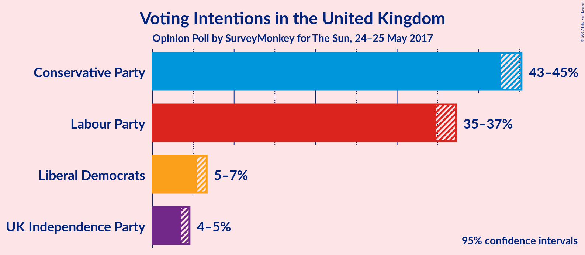
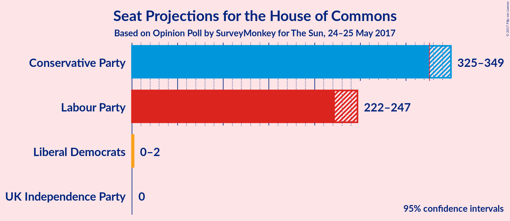
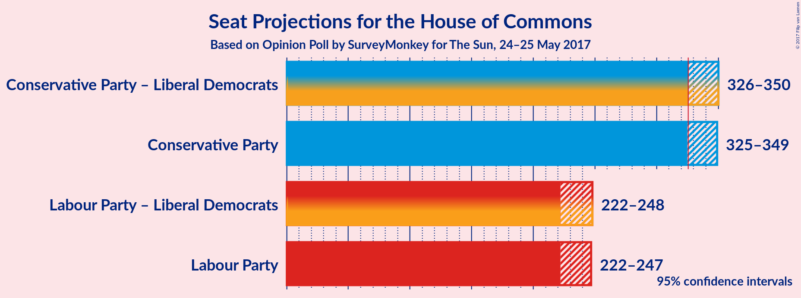

# Opinion Poll by SurveyMonkey for The Sun, 24–25 May 2017

<a href="#voting-intentions">Voting Intentions</a> | <a href="#seats">Seats</a> | <a href="#coalitions">Coalitions</a> | <a href="#technical-information">Technical Information</a>

## Voting Intentions

### Confidence Intervals

| Party | Last Result | Poll Result | 80% Confidence Interval | 90% Confidence Interval | 95% Confidence Interval | 99% Confidence Interval |
|:-----:|:-----------:|:-----------:|:-----------------------:|:-----------------------:|:-----------------------:|:-----------------------:|
| Conservative Party | 36.9% | 48.9% | 43.2–44.8% |42.9–45.1% |42.7–45.3% |42.3–45.7% |
| Labour Party | 30.4% | 40.0% | 35.2–36.8% |35.0–37.0% |34.8–37.2% |34.4–37.6% |
| Liberal Democrats | 7.9% | 6.7% | 5.6–6.4% |5.5–6.5% |5.4–6.6% |5.2–6.8% |
| UK Independence Party | 12.6% | 4.4% | 3.7–4.3% |3.6–4.5% |3.5–4.5% |3.4–4.7% |

*Note:* The poll result column reflects the actual value used in the calculations. Published results may vary slightly, and in addition be rounded to fewer digits.

## Seats

### Confidence Intervals

| Party | Last Result | Median | 80% Confidence Interval | 90% Confidence Interval | 95% Confidence Interval | 99% Confidence Interval |
|:-----:|:-----------:|:------:|:-----------------------:|:-----------------------:|:-----------------------:|:-----------------------:|
| <a href="#conservative-party">Conservative Party</a> | 331 | 338 | 330–345 |327–348 |325–349 |323–351 |
| <a href="#labour-party">Labour Party</a> | 232 | 233 | 226–241 |223–244 |222–247 |220–248 |
| <a href="#liberal-democrats">Liberal Democrats</a> | 8 | 0 | 0–2 |0–2 |0–2 |0–2 |
| <a href="#uk-independence-party">UK Independence Party</a> | 1 | 0 | 0 |0 |0 |0 |

### Conservative Party

| Number of Seats | Probability | Accumulated |
|:---------------:|:-----------:|:-----------:|
| 321 | 0.1% | 100% |
| 322 | 0.2% | 99.9% |
| 323 | 0.5% | 99.6% |
| 324 | 1.3% | 99.1% |
| 325 | 1.5% | 98% |
| 326 | 0.7% | 96% |
| 327 | 0.7% | 96% |
| 328 | 2% | 95% |
| 329 | 2% | 93% |
| 330 | 3% | 91% |
| 331 | 3% | 88% |
| 332 | 2% | 85% |
| 333 | 7% | 83% |
| 334 | 8% | 76% |
| 335 | 4% | 68% |
| 336 | 4% | 64% |
| 337 | 9% | 60% |
| 338 | 10% | 51% |
| 339 | 7% | 41% |
| 340 | 4% | 35% |
| 341 | 3% | 31% |
| 342 | 6% | 28% |
| 343 | 8% | 21% |
| 344 | 2% | 13% |
| 345 | 1.4% | 10% |
| 346 | 1.5% | 9% |
| 347 | 2% | 7% |
| 348 | 1.2% | 5% |
| 349 | 2% | 4% |
| 350 | 1.0% | 2% |
| 351 | 0.9% | 0.9% |
| 352 | 0% | 0.1% |
| 353 | 0% | 0% |

### Labour Party

| Number of Seats | Probability | Accumulated |
|:---------------:|:-----------:|:-----------:|
| 219 | 0% | 100% |
| 220 | 1.1% | 99.9% |
| 221 | 1.0% | 98.8% |
| 222 | 2% | 98% |
| 223 | 0.8% | 95% |
| 224 | 3% | 95% |
| 225 | 0.8% | 92% |
| 226 | 2% | 91% |
| 227 | 3% | 89% |
| 228 | 12% | 86% |
| 229 | 4% | 75% |
| 230 | 3% | 71% |
| 231 | 5% | 68% |
| 232 | 8% | 64% |
| 233 | 11% | 56% |
| 234 | 7% | 45% |
| 235 | 2% | 38% |
| 236 | 4% | 35% |
| 237 | 6% | 32% |
| 238 | 7% | 25% |
| 239 | 2% | 18% |
| 240 | 2% | 16% |
| 241 | 4% | 14% |
| 242 | 2% | 9% |
| 243 | 2% | 8% |
| 244 | 0.9% | 5% |
| 245 | 0.2% | 4% |
| 246 | 1.4% | 4% |
| 247 | 2% | 3% |
| 248 | 0.7% | 1.2% |
| 249 | 0.3% | 0.5% |
| 250 | 0.2% | 0.2% |
| 251 | 0% | 0% |

### Liberal Democrats

| Number of Seats | Probability | Accumulated |
|:---------------:|:-----------:|:-----------:|
| 0 | 52% | 100% |
| 1 | 8% | 48% |
| 2 | 39% | 39% |
| 3 | 0% | 0% |

### UK Independence Party

| Number of Seats | Probability | Accumulated |
|:---------------:|:-----------:|:-----------:|
| 0 | 100% | 100% |
| 1 | 0% | 0% |

## Coalitions

### Confidence Intervals

| Coalition | Last Result | Median | 80% Confidence Interval | 90% Confidence Interval | 95% Confidence Interval | 99% Confidence Interval |
|:---------:|:-----------:|:------:|:-----------------------:|:-----------------------:|:-----------------------:|:-----------------------:|
| Conservative Party – Liberal Democrats | 339 | 338 | 331–345 | 329–348 | 326–350 | 324–352 |
| Conservative Party | 331 | 338 | 330–345 | 327–348 | 325–349 | 323–351 |
| Labour Party – Liberal Democrats | 240 | 234 | 227–243 | 224–245 | 222–248 | 220–250 |
| Labour Party | 232 | 233 | 226–241 | 223–244 | 222–247 | 220–248 |

### Conservative Party – Liberal Democrats

| Number of Seats | Probability | Accumulated |
|:---------------:|:-----------:|:-----------:|
| 322 | 0.1% | 100% |
| 323 | 0.2% | 99.9% |
| 324 | 0.5% | 99.6% |
| 325 | 1.3% | 99.1% |
| 326 | 2% | 98% |
| 327 | 0.7% | 96% |
| 328 | 0.6% | 96% |
| 329 | 2% | 95% |
| 330 | 2% | 93% |
| 331 | 3% | 91% |
| 332 | 3% | 88% |
| 333 | 2% | 85% |
| 334 | 7% | 83% |
| 335 | 8% | 75% |
| 336 | 3% | 67% |
| 337 | 5% | 64% |
| 338 | 10% | 59% |
| 339 | 10% | 49% |
| 340 | 6% | 40% |
| 341 | 4% | 34% |
| 342 | 3% | 30% |
| 343 | 8% | 27% |
| 344 | 7% | 19% |
| 345 | 2% | 12% |
| 346 | 1.2% | 10% |
| 347 | 2% | 9% |
| 348 | 2% | 7% |
| 349 | 2% | 5% |
| 350 | 2% | 3% |
| 351 | 1.1% | 2% |
| 352 | 0.5% | 0.5% |
| 353 | 0% | 0.1% |
| 354 | 0% | 0% |

### Conservative Party

| Number of Seats | Probability | Accumulated |
|:---------------:|:-----------:|:-----------:|
| 321 | 0.1% | 100% |
| 322 | 0.2% | 99.9% |
| 323 | 0.5% | 99.6% |
| 324 | 1.3% | 99.1% |
| 325 | 1.5% | 98% |
| 326 | 0.7% | 96% |
| 327 | 0.7% | 96% |
| 328 | 2% | 95% |
| 329 | 2% | 93% |
| 330 | 3% | 91% |
| 331 | 3% | 88% |
| 332 | 2% | 85% |
| 333 | 7% | 83% |
| 334 | 8% | 76% |
| 335 | 4% | 68% |
| 336 | 4% | 64% |
| 337 | 9% | 60% |
| 338 | 10% | 51% |
| 339 | 7% | 41% |
| 340 | 4% | 35% |
| 341 | 3% | 31% |
| 342 | 6% | 28% |
| 343 | 8% | 21% |
| 344 | 2% | 13% |
| 345 | 1.4% | 10% |
| 346 | 1.5% | 9% |
| 347 | 2% | 7% |
| 348 | 1.2% | 5% |
| 349 | 2% | 4% |
| 350 | 1.0% | 2% |
| 351 | 0.9% | 0.9% |
| 352 | 0% | 0.1% |
| 353 | 0% | 0% |

### Labour Party – Liberal Democrats

| Number of Seats | Probability | Accumulated |
|:---------------:|:-----------:|:-----------:|
| 219 | 0% | 100% |
| 220 | 0.7% | 99.9% |
| 221 | 0.8% | 99.3% |
| 222 | 2% | 98% |
| 223 | 1.1% | 97% |
| 224 | 3% | 96% |
| 225 | 1.0% | 93% |
| 226 | 2% | 92% |
| 227 | 2% | 90% |
| 228 | 7% | 88% |
| 229 | 4% | 81% |
| 230 | 6% | 77% |
| 231 | 4% | 71% |
| 232 | 6% | 67% |
| 233 | 8% | 61% |
| 234 | 7% | 53% |
| 235 | 7% | 46% |
| 236 | 5% | 39% |
| 237 | 4% | 35% |
| 238 | 7% | 31% |
| 239 | 5% | 24% |
| 240 | 4% | 19% |
| 241 | 3% | 16% |
| 242 | 2% | 13% |
| 243 | 3% | 10% |
| 244 | 1.4% | 7% |
| 245 | 1.2% | 6% |
| 246 | 1.0% | 5% |
| 247 | 1.0% | 4% |
| 248 | 1.2% | 3% |
| 249 | 1.0% | 2% |
| 250 | 0.4% | 0.7% |
| 251 | 0.2% | 0.3% |
| 252 | 0.1% | 0.1% |
| 253 | 0% | 0% |

### Labour Party

| Number of Seats | Probability | Accumulated |
|:---------------:|:-----------:|:-----------:|
| 219 | 0% | 100% |
| 220 | 1.1% | 99.9% |
| 221 | 1.0% | 98.8% |
| 222 | 2% | 98% |
| 223 | 0.8% | 95% |
| 224 | 3% | 95% |
| 225 | 0.8% | 92% |
| 226 | 2% | 91% |
| 227 | 3% | 89% |
| 228 | 12% | 86% |
| 229 | 4% | 75% |
| 230 | 3% | 71% |
| 231 | 5% | 68% |
| 232 | 8% | 64% |
| 233 | 11% | 56% |
| 234 | 7% | 45% |
| 235 | 2% | 38% |
| 236 | 4% | 35% |
| 237 | 6% | 32% |
| 238 | 7% | 25% |
| 239 | 2% | 18% |
| 240 | 2% | 16% |
| 241 | 4% | 14% |
| 242 | 2% | 9% |
| 243 | 2% | 8% |
| 244 | 0.9% | 5% |
| 245 | 0.2% | 4% |
| 246 | 1.4% | 4% |
| 247 | 2% | 3% |
| 248 | 0.7% | 1.2% |
| 249 | 0.3% | 0.5% |
| 250 | 0.2% | 0.2% |
| 251 | 0% | 0% |

## Technical Information

### Opinion Poll

+ **Pollster:** SurveyMonkey
+ **Media:** The Sun
+ **Fieldwork period:** 24–25 May 2017

### Calculations

+ **Sample size:** 5400
+ **Simulations done:** 2,097,152
+ **Error estimate:** 0.05%

