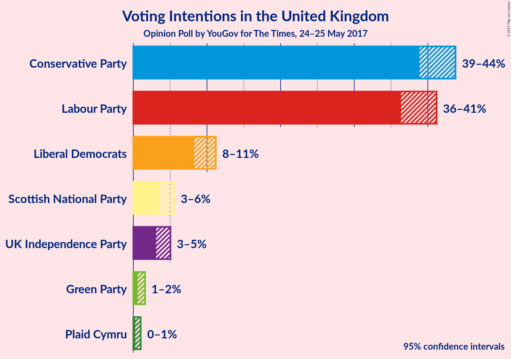
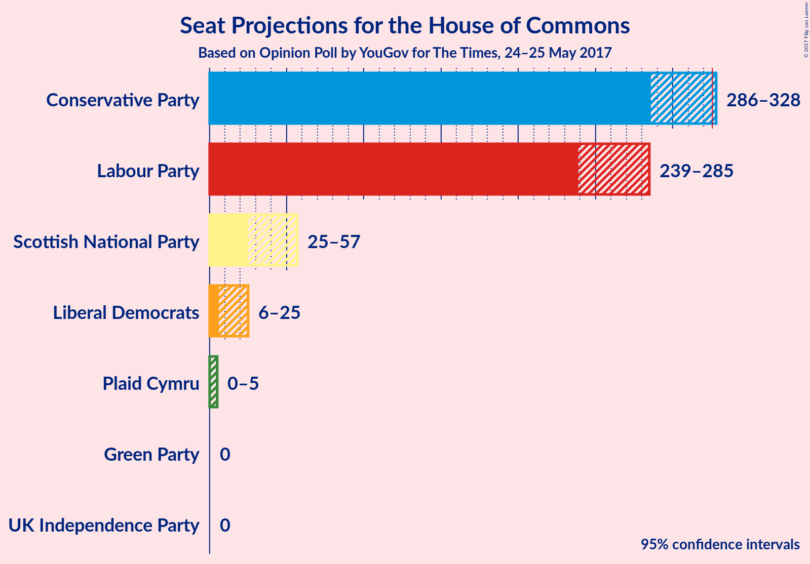
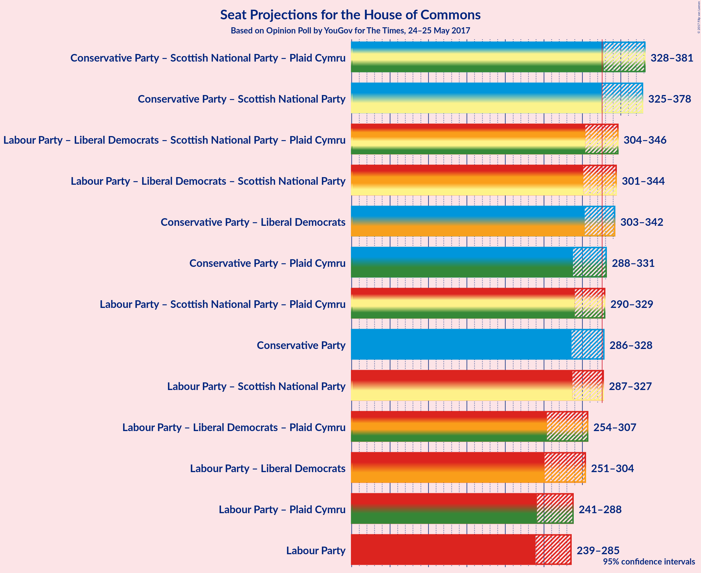

# Opinion Poll by YouGov for The Times, 24–25 May 2017

<a href="#voting-intentions">Voting Intentions</a> | <a href="#seats">Seats</a> | <a href="#coalitions">Coalitions</a> | <a href="#technical-information">Technical Information</a>

## Voting Intentions

### Confidence Intervals

| Party | Last Result | Poll Result | 80% Confidence Interval | 90% Confidence Interval | 95% Confidence Interval | 99% Confidence Interval |
|:-----:|:-----------:|:-----------:|:-----------------------:|:-----------------------:|:-----------------------:|:-----------------------:|
| Conservative Party | 36.9% | 41.5% | 39.7–42.9% |39.3–43.4% |38.9–43.8% |38.1–44.5% |
| Labour Party | 30.4% | 38.9% | 37.2–40.3% |36.7–40.8% |36.4–41.2% |35.6–41.9% |
| Liberal Democrats | 7.9% | 9.7% | 8.7–10.7% |8.5–11.0% |8.3–11.2% |7.8–11.7% |
| Scottish National Party | 4.7% | 4.4% | 3.8–5.2% |3.6–5.4% |3.5–5.5% |3.2–5.9% |
| UK Independence Party | 12.6% | 4.0% | 3.4–4.7% |3.2–4.9% |3.1–5.0% |2.8–5.4% |
| Green Party | 3.8% | 1.0% | 0.7–1.4% |0.6–1.5% |0.6–1.6% |0.5–1.8% |
| Plaid Cymru | 0.6% | 0.5% | 0.3–0.8% |0.3–0.9% |0.3–1.0% |0.2–1.2% |

*Note:* The poll result column reflects the actual value used in the calculations. Published results may vary slightly, and in addition be rounded to fewer digits.

## Seats

### Confidence Intervals

| Party | Last Result | Median | 80% Confidence Interval | 90% Confidence Interval | 95% Confidence Interval | 99% Confidence Interval |
|:-----:|:-----------:|:------:|:-----------------------:|:-----------------------:|:-----------------------:|:-----------------------:|
| <a href="#conservative-party">Conservative Party</a> | 331 | 310 | 297–320 |292–324 |286–328 |276–336 |
| <a href="#labour-party">Labour Party</a> | 232 | 257 | 247–273 |243–280 |239–285 |231–298 |
| <a href="#liberal-democrats">Liberal Democrats</a> | 8 | 15 | 8–22 |7–24 |6–25 |4–28 |
| <a href="#scottish-national-party">Scottish National Party</a> | 56 | 49 | 36–54 |29–56 |25–57 |12–57 |
| <a href="#uk-independence-party">UK Independence Party</a> | 1 | 0 | 0 |0 |0 |0 |
| <a href="#green-party">Green Party</a> | 1 | 0 | 0 |0 |0 |0 |
| <a href="#plaid-cymru">Plaid Cymru</a> | 3 | 3 | 0–4 |0–4 |0–5 |0–5 |

### Conservative Party

| Number of Seats | Probability | Accumulated |
|:---------------:|:-----------:|:-----------:|
| 266 | 0% | 100% |
| 267 | 0% | 99.9% |
| 268 | 0% | 99.9% |
| 269 | 0% | 99.9% |
| 270 | 0% | 99.9% |
| 271 | 0.1% | 99.8% |
| 272 | 0.1% | 99.8% |
| 273 | 0% | 99.7% |
| 274 | 0.1% | 99.7% |
| 275 | 0.1% | 99.6% |
| 276 | 0.1% | 99.5% |
| 277 | 0.1% | 99.4% |
| 278 | 0.2% | 99.3% |
| 279 | 0.1% | 99.2% |
| 280 | 0.2% | 99.1% |
| 281 | 0.2% | 98.9% |
| 282 | 0.3% | 98.7% |
| 283 | 0.3% | 98% |
| 284 | 0.2% | 98% |
| 285 | 0.1% | 98% |
| 286 | 0.4% | 98% |
| 287 | 0.3% | 97% |
| 288 | 0.3% | 97% |
| 289 | 0.5% | 97% |
| 290 | 0.6% | 96% |
| 291 | 0.4% | 96% |
| 292 | 1.3% | 95% |
| 293 | 0.7% | 94% |
| 294 | 0.5% | 93% |
| 295 | 1.0% | 93% |
| 296 | 1.1% | 92% |
| 297 | 2% | 91% |
| 298 | 2% | 89% |
| 299 | 1.1% | 87% |
| 300 | 2% | 86% |
| 301 | 2% | 84% |
| 302 | 3% | 82% |
| 303 | 3% | 80% |
| 304 | 4% | 77% |
| 305 | 4% | 74% |
| 306 | 4% | 70% |
| 307 | 4% | 66% |
| 308 | 6% | 62% |
| 309 | 4% | 56% |
| 310 | 4% | 52% |
| 311 | 3% | 47% |
| 312 | 7% | 45% |
| 313 | 6% | 38% |
| 314 | 5% | 32% |
| 315 | 3% | 28% |
| 316 | 3% | 25% |
| 317 | 3% | 22% |
| 318 | 5% | 19% |
| 319 | 3% | 14% |
| 320 | 2% | 11% |
| 321 | 2% | 9% |
| 322 | 1.0% | 7% |
| 323 | 0.8% | 6% |
| 324 | 0.5% | 5% |
| 325 | 1.0% | 5% |
| 326 | 0.5% | 4% |
| 327 | 0.5% | 3% |
| 328 | 0.3% | 3% |
| 329 | 0.4% | 2% |
| 330 | 0.4% | 2% |
| 331 | 0.3% | 2% |
| 332 | 0.3% | 1.3% |
| 333 | 0.2% | 1.0% |
| 334 | 0.2% | 0.8% |
| 335 | 0.1% | 0.7% |
| 336 | 0.1% | 0.5% |
| 337 | 0.1% | 0.4% |
| 338 | 0.1% | 0.3% |
| 339 | 0.1% | 0.3% |
| 340 | 0% | 0.2% |
| 341 | 0% | 0.2% |
| 342 | 0% | 0.1% |
| 343 | 0% | 0.1% |
| 344 | 0% | 0.1% |
| 345 | 0% | 0% |

### Labour Party

| Number of Seats | Probability | Accumulated |
|:---------------:|:-----------:|:-----------:|
| 222 | 0% | 100% |
| 223 | 0% | 99.9% |
| 224 | 0% | 99.9% |
| 225 | 0% | 99.9% |
| 226 | 0% | 99.9% |
| 227 | 0.1% | 99.9% |
| 228 | 0% | 99.8% |
| 229 | 0.1% | 99.7% |
| 230 | 0.1% | 99.7% |
| 231 | 0.1% | 99.5% |
| 232 | 0.1% | 99.4% |
| 233 | 0.2% | 99.3% |
| 234 | 0.2% | 99.1% |
| 235 | 0.3% | 99.0% |
| 236 | 0.3% | 98.6% |
| 237 | 0.4% | 98% |
| 238 | 0.4% | 98% |
| 239 | 0.4% | 98% |
| 240 | 0.7% | 97% |
| 241 | 0.5% | 97% |
| 242 | 0.6% | 96% |
| 243 | 0.7% | 95% |
| 244 | 0.7% | 95% |
| 245 | 2% | 94% |
| 246 | 1.4% | 92% |
| 247 | 3% | 91% |
| 248 | 2% | 88% |
| 249 | 5% | 86% |
| 250 | 4% | 81% |
| 251 | 3% | 77% |
| 252 | 5% | 74% |
| 253 | 4% | 69% |
| 254 | 4% | 65% |
| 255 | 5% | 61% |
| 256 | 5% | 56% |
| 257 | 4% | 51% |
| 258 | 4% | 46% |
| 259 | 5% | 42% |
| 260 | 3% | 37% |
| 261 | 3% | 34% |
| 262 | 4% | 31% |
| 263 | 2% | 27% |
| 264 | 2% | 25% |
| 265 | 2% | 24% |
| 266 | 2% | 22% |
| 267 | 2% | 19% |
| 268 | 1.5% | 17% |
| 269 | 0.9% | 15% |
| 270 | 2% | 15% |
| 271 | 1.3% | 13% |
| 272 | 1.3% | 12% |
| 273 | 0.8% | 10% |
| 274 | 1.1% | 10% |
| 275 | 0.7% | 9% |
| 276 | 0.8% | 8% |
| 277 | 0.8% | 7% |
| 278 | 0.5% | 6% |
| 279 | 0.4% | 6% |
| 280 | 0.5% | 5% |
| 281 | 0.6% | 5% |
| 282 | 0.5% | 4% |
| 283 | 0.3% | 4% |
| 284 | 0.5% | 3% |
| 285 | 0.5% | 3% |
| 286 | 0.2% | 2% |
| 287 | 0.2% | 2% |
| 288 | 0.2% | 2% |
| 289 | 0.2% | 2% |
| 290 | 0.2% | 2% |
| 291 | 0.2% | 2% |
| 292 | 0.3% | 1.3% |
| 293 | 0.1% | 1.1% |
| 294 | 0.2% | 1.0% |
| 295 | 0.1% | 0.8% |
| 296 | 0.1% | 0.7% |
| 297 | 0.1% | 0.6% |
| 298 | 0.1% | 0.5% |
| 299 | 0.1% | 0.5% |
| 300 | 0.1% | 0.4% |
| 301 | 0% | 0.3% |
| 302 | 0% | 0.3% |
| 303 | 0% | 0.3% |
| 304 | 0% | 0.3% |
| 305 | 0% | 0.2% |
| 306 | 0% | 0.2% |
| 307 | 0% | 0.1% |
| 308 | 0% | 0.1% |
| 309 | 0% | 0.1% |
| 310 | 0% | 0.1% |
| 311 | 0% | 0.1% |
| 312 | 0% | 0.1% |
| 313 | 0% | 0.1% |
| 314 | 0% | 0.1% |
| 315 | 0% | 0% |

### Liberal Democrats

| Number of Seats | Probability | Accumulated |
|:---------------:|:-----------:|:-----------:|
| 3 | 0.2% | 100% |
| 4 | 0.6% | 99.7% |
| 5 | 0.7% | 99.1% |
| 6 | 2% | 98% |
| 7 | 4% | 97% |
| 8 | 5% | 93% |
| 9 | 8% | 88% |
| 10 | 6% | 80% |
| 11 | 3% | 75% |
| 12 | 7% | 72% |
| 13 | 5% | 65% |
| 14 | 8% | 60% |
| 15 | 6% | 51% |
| 16 | 4% | 46% |
| 17 | 9% | 42% |
| 18 | 6% | 33% |
| 19 | 4% | 27% |
| 20 | 6% | 23% |
| 21 | 5% | 17% |
| 22 | 3% | 12% |
| 23 | 2% | 8% |
| 24 | 2% | 6% |
| 25 | 2% | 4% |
| 26 | 0.4% | 2% |
| 27 | 0.9% | 1.4% |
| 28 | 0.2% | 0.5% |
| 29 | 0.1% | 0.3% |
| 30 | 0.1% | 0.2% |
| 31 | 0% | 0.1% |
| 32 | 0% | 0.1% |
| 33 | 0% | 0.1% |
| 34 | 0% | 0.1% |
| 35 | 0% | 0.1% |
| 36 | 0% | 0% |

### Scottish National Party

| Number of Seats | Probability | Accumulated |
|:---------------:|:-----------:|:-----------:|
| 6 | 0.1% | 100% |
| 7 | 0% | 99.9% |
| 8 | 0.1% | 99.9% |
| 9 | 0% | 99.8% |
| 10 | 0.1% | 99.8% |
| 11 | 0.2% | 99.7% |
| 12 | 0.1% | 99.5% |
| 13 | 0% | 99.5% |
| 14 | 0% | 99.4% |
| 15 | 0.2% | 99.4% |
| 16 | 0.1% | 99.2% |
| 17 | 0.2% | 99.2% |
| 18 | 0.2% | 98.9% |
| 19 | 0.1% | 98.8% |
| 20 | 0.4% | 98.6% |
| 21 | 0.2% | 98% |
| 22 | 0.1% | 98% |
| 23 | 0.1% | 98% |
| 24 | 0.2% | 98% |
| 25 | 0.5% | 98% |
| 26 | 0.5% | 97% |
| 27 | 0.4% | 97% |
| 28 | 0.8% | 96% |
| 29 | 0.6% | 95% |
| 30 | 0.8% | 95% |
| 31 | 0.5% | 94% |
| 32 | 0.5% | 94% |
| 33 | 0.8% | 93% |
| 34 | 1.0% | 92% |
| 35 | 1.0% | 91% |
| 36 | 0.8% | 90% |
| 37 | 0.6% | 89% |
| 38 | 0.9% | 89% |
| 39 | 0.4% | 88% |
| 40 | 0.6% | 87% |
| 41 | 1.2% | 87% |
| 42 | 2% | 86% |
| 43 | 2% | 84% |
| 44 | 3% | 82% |
| 45 | 8% | 79% |
| 46 | 10% | 71% |
| 47 | 4% | 61% |
| 48 | 5% | 57% |
| 49 | 7% | 53% |
| 50 | 7% | 46% |
| 51 | 3% | 38% |
| 52 | 9% | 35% |
| 53 | 10% | 26% |
| 54 | 6% | 16% |
| 55 | 4% | 9% |
| 56 | 2% | 5% |
| 57 | 2% | 3% |
| 58 | 0.4% | 0.4% |
| 59 | 0% | 0% |

### UK Independence Party

| Number of Seats | Probability | Accumulated |
|:---------------:|:-----------:|:-----------:|
| 0 | 100% | 100% |
| 1 | 0% | 0% |

### Green Party

| Number of Seats | Probability | Accumulated |
|:---------------:|:-----------:|:-----------:|
| 0 | 100% | 100% |
| 1 | 0% | 0% |

### Plaid Cymru

| Number of Seats | Probability | Accumulated |
|:---------------:|:-----------:|:-----------:|
| 0 | 13% | 100% |
| 1 | 19% | 87% |
| 2 | 9% | 68% |
| 3 | 43% | 58% |
| 4 | 11% | 16% |
| 5 | 5% | 5% |
| 6 | 0% | 0.1% |
| 7 | 0.1% | 0.1% |
| 8 | 0% | 0% |

## Coalitions

### Confidence Intervals

| Coalition | Last Result | Median | 80% Confidence Interval | 90% Confidence Interval | 95% Confidence Interval | 99% Confidence Interval |
|:---------:|:-----------:|:------:|:-----------------------:|:-----------------------:|:-----------------------:|:-----------------------:|
| Conservative Party – Scottish National Party – Plaid Cymru | 390 | 360 | 341–374 | 334–377 | 328–381 | 314–390 |
| Conservative Party – Scottish National Party | 387 | 358 | 339–371 | 332–374 | 325–378 | 312–386 |
| Labour Party – Liberal Democrats – Scottish National Party – Plaid Cymru | 299 | 322 | 312–335 | 308–340 | 304–346 | 296–356 |
| Labour Party – Liberal Democrats – Scottish National Party | 296 | 320 | 309–333 | 305–338 | 301–344 | 294–354 |
| Conservative Party – Liberal Democrats | 339 | 325 | 313–335 | 308–338 | 303–342 | 293–350 |
| Conservative Party – Plaid Cymru | 334 | 312 | 299–323 | 294–327 | 288–331 | 278–338 |
| Labour Party – Scottish National Party – Plaid Cymru | 291 | 307 | 297–319 | 294–324 | 290–329 | 282–339 |
| Conservative Party | 331 | 310 | 297–320 | 292–324 | 286–328 | 276–336 |
| Labour Party – Scottish National Party | 288 | 305 | 295–317 | 291–322 | 287–327 | 280–338 |
| Labour Party – Liberal Democrats – Plaid Cymru | 243 | 274 | 261–293 | 258–300 | 254–307 | 246–320 |
| Labour Party – Liberal Democrats | 240 | 272 | 258–291 | 255–298 | 251–304 | 242–318 |
| Labour Party – Plaid Cymru | 235 | 259 | 250–275 | 246–283 | 241–288 | 234–300 |
| Labour Party | 232 | 257 | 247–273 | 243–280 | 239–285 | 231–298 |

### Conservative Party – Scottish National Party – Plaid Cymru

| Number of Seats | Probability | Accumulated |
|:---------------:|:-----------:|:-----------:|
| 296 | 0% | 100% |
| 297 | 0% | 99.9% |
| 298 | 0% | 99.9% |
| 299 | 0% | 99.9% |
| 300 | 0% | 99.9% |
| 301 | 0% | 99.9% |
| 302 | 0% | 99.9% |
| 303 | 0% | 99.9% |
| 304 | 0% | 99.9% |
| 305 | 0% | 99.9% |
| 306 | 0% | 99.8% |
| 307 | 0% | 99.8% |
| 308 | 0% | 99.8% |
| 309 | 0.1% | 99.8% |
| 310 | 0% | 99.7% |
| 311 | 0% | 99.7% |
| 312 | 0% | 99.6% |
| 313 | 0.1% | 99.6% |
| 314 | 0.1% | 99.5% |
| 315 | 0.1% | 99.4% |
| 316 | 0.1% | 99.4% |
| 317 | 0.1% | 99.3% |
| 318 | 0.1% | 99.2% |
| 319 | 0.1% | 99.1% |
| 320 | 0.1% | 99.0% |
| 321 | 0.1% | 98.9% |
| 322 | 0.1% | 98.8% |
| 323 | 0.2% | 98.7% |
| 324 | 0.2% | 98% |
| 325 | 0.2% | 98% |
| 326 | 0.3% | 98% |
| 327 | 0.1% | 98% |
| 328 | 0.4% | 98% |
| 329 | 0.2% | 97% |
| 330 | 0.4% | 97% |
| 331 | 0.4% | 97% |
| 332 | 0.5% | 96% |
| 333 | 0.5% | 96% |
| 334 | 0.5% | 95% |
| 335 | 0.6% | 95% |
| 336 | 0.4% | 94% |
| 337 | 0.9% | 94% |
| 338 | 0.7% | 93% |
| 339 | 0.8% | 92% |
| 340 | 1.0% | 91% |
| 341 | 0.6% | 90% |
| 342 | 1.2% | 90% |
| 343 | 1.2% | 89% |
| 344 | 0.9% | 87% |
| 345 | 0.9% | 87% |
| 346 | 2% | 86% |
| 347 | 2% | 84% |
| 348 | 0.9% | 82% |
| 349 | 2% | 81% |
| 350 | 3% | 79% |
| 351 | 2% | 77% |
| 352 | 2% | 75% |
| 353 | 2% | 73% |
| 354 | 3% | 71% |
| 355 | 2% | 68% |
| 356 | 4% | 66% |
| 357 | 3% | 61% |
| 358 | 3% | 59% |
| 359 | 3% | 56% |
| 360 | 4% | 53% |
| 361 | 3% | 49% |
| 362 | 3% | 46% |
| 363 | 5% | 43% |
| 364 | 3% | 39% |
| 365 | 4% | 36% |
| 366 | 3% | 32% |
| 367 | 3% | 28% |
| 368 | 3% | 25% |
| 369 | 4% | 23% |
| 370 | 2% | 19% |
| 371 | 2% | 16% |
| 372 | 2% | 14% |
| 373 | 2% | 13% |
| 374 | 2% | 10% |
| 375 | 2% | 8% |
| 376 | 1.4% | 7% |
| 377 | 0.7% | 5% |
| 378 | 0.7% | 5% |
| 379 | 0.6% | 4% |
| 380 | 0.5% | 3% |
| 381 | 0.5% | 3% |
| 382 | 0.3% | 2% |
| 383 | 0.3% | 2% |
| 384 | 0.3% | 2% |
| 385 | 0.3% | 1.4% |
| 386 | 0.3% | 1.2% |
| 387 | 0.1% | 0.9% |
| 388 | 0.1% | 0.8% |
| 389 | 0.2% | 0.7% |
| 390 | 0.2% | 0.5% |
| 391 | 0.1% | 0.4% |
| 392 | 0.1% | 0.3% |
| 393 | 0% | 0.2% |
| 394 | 0% | 0.2% |
| 395 | 0% | 0.1% |
| 396 | 0% | 0.1% |
| 397 | 0% | 0.1% |
| 398 | 0% | 0.1% |
| 399 | 0% | 0.1% |
| 400 | 0% | 0% |

### Conservative Party – Scottish National Party

| Number of Seats | Probability | Accumulated |
|:---------------:|:-----------:|:-----------:|
| 295 | 0% | 100% |
| 296 | 0% | 99.9% |
| 297 | 0% | 99.9% |
| 298 | 0% | 99.9% |
| 299 | 0% | 99.9% |
| 300 | 0% | 99.9% |
| 301 | 0% | 99.9% |
| 302 | 0% | 99.9% |
| 303 | 0% | 99.9% |
| 304 | 0% | 99.8% |
| 305 | 0% | 99.8% |
| 306 | 0.1% | 99.8% |
| 307 | 0% | 99.7% |
| 308 | 0% | 99.7% |
| 309 | 0% | 99.7% |
| 310 | 0.1% | 99.6% |
| 311 | 0% | 99.6% |
| 312 | 0.1% | 99.5% |
| 313 | 0.1% | 99.4% |
| 314 | 0.1% | 99.3% |
| 315 | 0.1% | 99.3% |
| 316 | 0.1% | 99.2% |
| 317 | 0.1% | 99.1% |
| 318 | 0.1% | 99.0% |
| 319 | 0.1% | 98.9% |
| 320 | 0.1% | 98.7% |
| 321 | 0.2% | 98.6% |
| 322 | 0.3% | 98% |
| 323 | 0.3% | 98% |
| 324 | 0.2% | 98% |
| 325 | 0.5% | 98% |
| 326 | 0.2% | 97% |
| 327 | 0.3% | 97% |
| 328 | 0.3% | 97% |
| 329 | 0.4% | 97% |
| 330 | 0.5% | 96% |
| 331 | 0.5% | 96% |
| 332 | 0.6% | 95% |
| 333 | 0.5% | 95% |
| 334 | 0.5% | 94% |
| 335 | 0.9% | 94% |
| 336 | 0.6% | 93% |
| 337 | 0.8% | 92% |
| 338 | 0.7% | 91% |
| 339 | 0.8% | 91% |
| 340 | 0.9% | 90% |
| 341 | 0.8% | 89% |
| 342 | 1.4% | 88% |
| 343 | 2% | 87% |
| 344 | 2% | 84% |
| 345 | 0.7% | 82% |
| 346 | 2% | 82% |
| 347 | 1.5% | 80% |
| 348 | 1.4% | 79% |
| 349 | 2% | 77% |
| 350 | 3% | 75% |
| 351 | 3% | 73% |
| 352 | 2% | 70% |
| 353 | 2% | 68% |
| 354 | 4% | 65% |
| 355 | 4% | 61% |
| 356 | 3% | 57% |
| 357 | 3% | 54% |
| 358 | 2% | 51% |
| 359 | 3% | 49% |
| 360 | 5% | 46% |
| 361 | 4% | 42% |
| 362 | 5% | 38% |
| 363 | 3% | 33% |
| 364 | 3% | 30% |
| 365 | 3% | 27% |
| 366 | 5% | 24% |
| 367 | 2% | 20% |
| 368 | 2% | 18% |
| 369 | 1.3% | 15% |
| 370 | 2% | 14% |
| 371 | 3% | 12% |
| 372 | 2% | 9% |
| 373 | 2% | 8% |
| 374 | 0.8% | 6% |
| 375 | 0.8% | 5% |
| 376 | 0.5% | 4% |
| 377 | 0.7% | 4% |
| 378 | 0.5% | 3% |
| 379 | 0.4% | 2% |
| 380 | 0.2% | 2% |
| 381 | 0.3% | 2% |
| 382 | 0.3% | 2% |
| 383 | 0.2% | 1.2% |
| 384 | 0.2% | 1.1% |
| 385 | 0.1% | 0.9% |
| 386 | 0.2% | 0.7% |
| 387 | 0.1% | 0.5% |
| 388 | 0.1% | 0.4% |
| 389 | 0.1% | 0.3% |
| 390 | 0.1% | 0.3% |
| 391 | 0% | 0.2% |
| 392 | 0% | 0.2% |
| 393 | 0% | 0.1% |
| 394 | 0% | 0.1% |
| 395 | 0% | 0.1% |
| 396 | 0% | 0.1% |
| 397 | 0% | 0% |

### Labour Party – Liberal Democrats – Scottish National Party – Plaid Cymru

| Number of Seats | Probability | Accumulated |
|:---------------:|:-----------:|:-----------:|
| 288 | 0% | 100% |
| 289 | 0% | 99.9% |
| 290 | 0% | 99.9% |
| 291 | 0% | 99.9% |
| 292 | 0% | 99.8% |
| 293 | 0.1% | 99.8% |
| 294 | 0.1% | 99.7% |
| 295 | 0.1% | 99.7% |
| 296 | 0.1% | 99.6% |
| 297 | 0.1% | 99.5% |
| 298 | 0.2% | 99.3% |
| 299 | 0.2% | 99.2% |
| 300 | 0.3% | 99.0% |
| 301 | 0.3% | 98.7% |
| 302 | 0.4% | 98% |
| 303 | 0.4% | 98% |
| 304 | 0.3% | 98% |
| 305 | 0.5% | 97% |
| 306 | 0.5% | 97% |
| 307 | 1.0% | 96% |
| 308 | 0.5% | 95% |
| 309 | 0.8% | 95% |
| 310 | 1.0% | 94% |
| 311 | 2% | 93% |
| 312 | 2% | 91% |
| 313 | 3% | 89% |
| 314 | 5% | 86% |
| 315 | 3% | 81% |
| 316 | 3% | 78% |
| 317 | 3% | 75% |
| 318 | 5% | 72% |
| 319 | 6% | 68% |
| 320 | 7% | 62% |
| 321 | 3% | 55% |
| 322 | 4% | 53% |
| 323 | 4% | 48% |
| 324 | 6% | 44% |
| 325 | 4% | 38% |
| 326 | 4% | 34% |
| 327 | 4% | 30% |
| 328 | 4% | 26% |
| 329 | 3% | 23% |
| 330 | 3% | 20% |
| 331 | 2% | 18% |
| 332 | 2% | 16% |
| 333 | 1.1% | 14% |
| 334 | 2% | 13% |
| 335 | 2% | 11% |
| 336 | 1.1% | 9% |
| 337 | 1.0% | 8% |
| 338 | 0.5% | 7% |
| 339 | 0.7% | 7% |
| 340 | 1.3% | 6% |
| 341 | 0.4% | 5% |
| 342 | 0.6% | 4% |
| 343 | 0.5% | 4% |
| 344 | 0.3% | 3% |
| 345 | 0.3% | 3% |
| 346 | 0.4% | 3% |
| 347 | 0.1% | 2% |
| 348 | 0.2% | 2% |
| 349 | 0.3% | 2% |
| 350 | 0.3% | 2% |
| 351 | 0.2% | 1.3% |
| 352 | 0.2% | 1.1% |
| 353 | 0.1% | 0.9% |
| 354 | 0.2% | 0.8% |
| 355 | 0.1% | 0.7% |
| 356 | 0.1% | 0.6% |
| 357 | 0.1% | 0.5% |
| 358 | 0.1% | 0.4% |
| 359 | 0% | 0.3% |
| 360 | 0.1% | 0.3% |
| 361 | 0.1% | 0.2% |
| 362 | 0% | 0.2% |
| 363 | 0% | 0.1% |
| 364 | 0% | 0.1% |
| 365 | 0% | 0.1% |
| 366 | 0% | 0.1% |
| 367 | 0% | 0% |

### Labour Party – Liberal Democrats – Scottish National Party

| Number of Seats | Probability | Accumulated |
|:---------------:|:-----------:|:-----------:|
| 285 | 0% | 100% |
| 286 | 0% | 99.9% |
| 287 | 0% | 99.9% |
| 288 | 0% | 99.9% |
| 289 | 0% | 99.8% |
| 290 | 0.1% | 99.8% |
| 291 | 0.1% | 99.8% |
| 292 | 0.1% | 99.7% |
| 293 | 0.1% | 99.6% |
| 294 | 0.1% | 99.5% |
| 295 | 0.2% | 99.4% |
| 296 | 0.2% | 99.2% |
| 297 | 0.2% | 99.0% |
| 298 | 0.3% | 98.8% |
| 299 | 0.5% | 98.5% |
| 300 | 0.4% | 98% |
| 301 | 0.4% | 98% |
| 302 | 0.2% | 97% |
| 303 | 0.6% | 97% |
| 304 | 1.1% | 97% |
| 305 | 0.7% | 95% |
| 306 | 0.6% | 95% |
| 307 | 0.9% | 94% |
| 308 | 1.2% | 93% |
| 309 | 3% | 92% |
| 310 | 2% | 89% |
| 311 | 3% | 87% |
| 312 | 5% | 84% |
| 313 | 3% | 79% |
| 314 | 3% | 76% |
| 315 | 3% | 73% |
| 316 | 5% | 70% |
| 317 | 5% | 65% |
| 318 | 4% | 60% |
| 319 | 5% | 56% |
| 320 | 4% | 51% |
| 321 | 4% | 47% |
| 322 | 5% | 42% |
| 323 | 4% | 37% |
| 324 | 3% | 33% |
| 325 | 4% | 30% |
| 326 | 3% | 26% |
| 327 | 3% | 23% |
| 328 | 2% | 19% |
| 329 | 2% | 17% |
| 330 | 2% | 15% |
| 331 | 1.2% | 14% |
| 332 | 2% | 13% |
| 333 | 2% | 11% |
| 334 | 1.0% | 9% |
| 335 | 0.8% | 8% |
| 336 | 0.7% | 7% |
| 337 | 1.0% | 6% |
| 338 | 0.5% | 5% |
| 339 | 0.9% | 5% |
| 340 | 0.4% | 4% |
| 341 | 0.5% | 4% |
| 342 | 0.3% | 3% |
| 343 | 0.4% | 3% |
| 344 | 0.2% | 3% |
| 345 | 0.3% | 2% |
| 346 | 0.2% | 2% |
| 347 | 0.3% | 2% |
| 348 | 0.3% | 2% |
| 349 | 0.2% | 1.3% |
| 350 | 0.2% | 1.1% |
| 351 | 0.2% | 0.9% |
| 352 | 0.1% | 0.7% |
| 353 | 0.1% | 0.6% |
| 354 | 0.1% | 0.5% |
| 355 | 0.1% | 0.5% |
| 356 | 0% | 0.4% |
| 357 | 0.1% | 0.3% |
| 358 | 0.1% | 0.3% |
| 359 | 0.1% | 0.2% |
| 360 | 0% | 0.2% |
| 361 | 0% | 0.1% |
| 362 | 0% | 0.1% |
| 363 | 0% | 0.1% |
| 364 | 0% | 0% |

### Conservative Party – Liberal Democrats

| Number of Seats | Probability | Accumulated |
|:---------------:|:-----------:|:-----------:|
| 284 | 0% | 100% |
| 285 | 0% | 99.9% |
| 286 | 0% | 99.9% |
| 287 | 0% | 99.9% |
| 288 | 0.1% | 99.8% |
| 289 | 0% | 99.8% |
| 290 | 0.1% | 99.7% |
| 291 | 0.1% | 99.7% |
| 292 | 0.1% | 99.6% |
| 293 | 0.1% | 99.5% |
| 294 | 0.1% | 99.4% |
| 295 | 0.1% | 99.3% |
| 296 | 0.2% | 99.2% |
| 297 | 0.2% | 99.0% |
| 298 | 0.2% | 98.8% |
| 299 | 0.1% | 98.5% |
| 300 | 0.3% | 98% |
| 301 | 0.3% | 98% |
| 302 | 0.3% | 98% |
| 303 | 0.4% | 98% |
| 304 | 0.3% | 97% |
| 305 | 0.3% | 97% |
| 306 | 0.4% | 96% |
| 307 | 0.9% | 96% |
| 308 | 0.5% | 95% |
| 309 | 1.1% | 95% |
| 310 | 1.0% | 94% |
| 311 | 1.0% | 92% |
| 312 | 1.2% | 91% |
| 313 | 0.8% | 90% |
| 314 | 2% | 90% |
| 315 | 3% | 88% |
| 316 | 2% | 85% |
| 317 | 2% | 83% |
| 318 | 3% | 81% |
| 319 | 4% | 78% |
| 320 | 4% | 74% |
| 321 | 4% | 70% |
| 322 | 6% | 67% |
| 323 | 4% | 61% |
| 324 | 4% | 57% |
| 325 | 6% | 52% |
| 326 | 5% | 47% |
| 327 | 6% | 42% |
| 328 | 6% | 36% |
| 329 | 4% | 30% |
| 330 | 3% | 27% |
| 331 | 3% | 23% |
| 332 | 4% | 21% |
| 333 | 4% | 16% |
| 334 | 3% | 13% |
| 335 | 2% | 10% |
| 336 | 1.1% | 8% |
| 337 | 1.0% | 7% |
| 338 | 1.0% | 6% |
| 339 | 0.8% | 5% |
| 340 | 0.8% | 4% |
| 341 | 0.5% | 3% |
| 342 | 0.5% | 3% |
| 343 | 0.3% | 2% |
| 344 | 0.3% | 2% |
| 345 | 0.3% | 2% |
| 346 | 0.2% | 1.3% |
| 347 | 0.3% | 1.1% |
| 348 | 0.1% | 0.8% |
| 349 | 0.2% | 0.7% |
| 350 | 0.1% | 0.5% |
| 351 | 0.1% | 0.4% |
| 352 | 0.1% | 0.4% |
| 353 | 0.1% | 0.3% |
| 354 | 0% | 0.2% |
| 355 | 0% | 0.2% |
| 356 | 0% | 0.1% |
| 357 | 0% | 0.1% |
| 358 | 0% | 0.1% |
| 359 | 0% | 0.1% |
| 360 | 0% | 0% |

### Conservative Party – Plaid Cymru

| Number of Seats | Probability | Accumulated |
|:---------------:|:-----------:|:-----------:|
| 269 | 0% | 100% |
| 270 | 0% | 99.9% |
| 271 | 0% | 99.9% |
| 272 | 0% | 99.9% |
| 273 | 0.1% | 99.8% |
| 274 | 0.1% | 99.8% |
| 275 | 0.1% | 99.7% |
| 276 | 0% | 99.7% |
| 277 | 0.1% | 99.6% |
| 278 | 0.1% | 99.5% |
| 279 | 0.1% | 99.5% |
| 280 | 0.1% | 99.4% |
| 281 | 0.2% | 99.3% |
| 282 | 0.2% | 99.1% |
| 283 | 0.2% | 98.9% |
| 284 | 0.3% | 98.7% |
| 285 | 0.3% | 98% |
| 286 | 0.2% | 98% |
| 287 | 0.3% | 98% |
| 288 | 0.2% | 98% |
| 289 | 0.4% | 97% |
| 290 | 0.3% | 97% |
| 291 | 0.5% | 97% |
| 292 | 0.4% | 96% |
| 293 | 0.9% | 96% |
| 294 | 0.5% | 95% |
| 295 | 1.0% | 95% |
| 296 | 0.7% | 94% |
| 297 | 0.8% | 93% |
| 298 | 1.0% | 92% |
| 299 | 2% | 91% |
| 300 | 2% | 89% |
| 301 | 1.2% | 87% |
| 302 | 2% | 86% |
| 303 | 2% | 85% |
| 304 | 2% | 83% |
| 305 | 3% | 81% |
| 306 | 3% | 77% |
| 307 | 4% | 74% |
| 308 | 3% | 70% |
| 309 | 4% | 67% |
| 310 | 5% | 63% |
| 311 | 4% | 58% |
| 312 | 4% | 53% |
| 313 | 5% | 49% |
| 314 | 4% | 44% |
| 315 | 5% | 40% |
| 316 | 5% | 35% |
| 317 | 3% | 30% |
| 318 | 3% | 27% |
| 319 | 3% | 24% |
| 320 | 5% | 21% |
| 321 | 3% | 16% |
| 322 | 2% | 13% |
| 323 | 3% | 11% |
| 324 | 1.2% | 8% |
| 325 | 0.9% | 7% |
| 326 | 0.6% | 6% |
| 327 | 0.7% | 5% |
| 328 | 1.1% | 5% |
| 329 | 0.6% | 3% |
| 330 | 0.2% | 3% |
| 331 | 0.4% | 3% |
| 332 | 0.4% | 2% |
| 333 | 0.5% | 2% |
| 334 | 0.3% | 1.5% |
| 335 | 0.2% | 1.2% |
| 336 | 0.2% | 1.0% |
| 337 | 0.2% | 0.8% |
| 338 | 0.1% | 0.6% |
| 339 | 0.1% | 0.5% |
| 340 | 0.1% | 0.4% |
| 341 | 0.1% | 0.3% |
| 342 | 0.1% | 0.2% |
| 343 | 0% | 0.2% |
| 344 | 0% | 0.2% |
| 345 | 0% | 0.1% |
| 346 | 0% | 0.1% |
| 347 | 0% | 0.1% |
| 348 | 0% | 0% |

### Labour Party – Scottish National Party – Plaid Cymru

| Number of Seats | Probability | Accumulated |
|:---------------:|:-----------:|:-----------:|
| 273 | 0% | 100% |
| 274 | 0% | 99.9% |
| 275 | 0% | 99.9% |
| 276 | 0% | 99.9% |
| 277 | 0% | 99.9% |
| 278 | 0% | 99.8% |
| 279 | 0.1% | 99.8% |
| 280 | 0.1% | 99.7% |
| 281 | 0.1% | 99.6% |
| 282 | 0.1% | 99.6% |
| 283 | 0.2% | 99.5% |
| 284 | 0.1% | 99.3% |
| 285 | 0.3% | 99.2% |
| 286 | 0.2% | 98.9% |
| 287 | 0.3% | 98.7% |
| 288 | 0.3% | 98% |
| 289 | 0.3% | 98% |
| 290 | 0.5% | 98% |
| 291 | 0.5% | 97% |
| 292 | 0.8% | 97% |
| 293 | 0.8% | 96% |
| 294 | 1.0% | 95% |
| 295 | 1.0% | 94% |
| 296 | 1.1% | 93% |
| 297 | 2% | 92% |
| 298 | 3% | 90% |
| 299 | 4% | 87% |
| 300 | 4% | 84% |
| 301 | 3% | 79% |
| 302 | 3% | 77% |
| 303 | 4% | 73% |
| 304 | 6% | 70% |
| 305 | 6% | 64% |
| 306 | 5% | 58% |
| 307 | 6% | 53% |
| 308 | 4% | 48% |
| 309 | 4% | 43% |
| 310 | 6% | 39% |
| 311 | 4% | 33% |
| 312 | 4% | 30% |
| 313 | 4% | 26% |
| 314 | 3% | 22% |
| 315 | 2% | 19% |
| 316 | 2% | 17% |
| 317 | 3% | 15% |
| 318 | 2% | 12% |
| 319 | 0.8% | 10% |
| 320 | 1.2% | 10% |
| 321 | 1.0% | 9% |
| 322 | 1.0% | 8% |
| 323 | 1.1% | 6% |
| 324 | 0.5% | 5% |
| 325 | 0.9% | 5% |
| 326 | 0.4% | 4% |
| 327 | 0.3% | 4% |
| 328 | 0.3% | 3% |
| 329 | 0.4% | 3% |
| 330 | 0.3% | 2% |
| 331 | 0.3% | 2% |
| 332 | 0.3% | 2% |
| 333 | 0.1% | 2% |
| 334 | 0.2% | 1.5% |
| 335 | 0.2% | 1.2% |
| 336 | 0.2% | 1.0% |
| 337 | 0.1% | 0.8% |
| 338 | 0.1% | 0.7% |
| 339 | 0.1% | 0.6% |
| 340 | 0.1% | 0.5% |
| 341 | 0.1% | 0.4% |
| 342 | 0.1% | 0.3% |
| 343 | 0% | 0.3% |
| 344 | 0.1% | 0.2% |
| 345 | 0% | 0.2% |
| 346 | 0% | 0.1% |
| 347 | 0% | 0.1% |
| 348 | 0% | 0.1% |
| 349 | 0% | 0% |

### Conservative Party

| Number of Seats | Probability | Accumulated |
|:---------------:|:-----------:|:-----------:|
| 266 | 0% | 100% |
| 267 | 0% | 99.9% |
| 268 | 0% | 99.9% |
| 269 | 0% | 99.9% |
| 270 | 0% | 99.9% |
| 271 | 0.1% | 99.8% |
| 272 | 0.1% | 99.8% |
| 273 | 0% | 99.7% |
| 274 | 0.1% | 99.7% |
| 275 | 0.1% | 99.6% |
| 276 | 0.1% | 99.5% |
| 277 | 0.1% | 99.4% |
| 278 | 0.2% | 99.3% |
| 279 | 0.1% | 99.2% |
| 280 | 0.2% | 99.1% |
| 281 | 0.2% | 98.9% |
| 282 | 0.3% | 98.7% |
| 283 | 0.3% | 98% |
| 284 | 0.2% | 98% |
| 285 | 0.1% | 98% |
| 286 | 0.4% | 98% |
| 287 | 0.3% | 97% |
| 288 | 0.3% | 97% |
| 289 | 0.5% | 97% |
| 290 | 0.6% | 96% |
| 291 | 0.4% | 96% |
| 292 | 1.3% | 95% |
| 293 | 0.7% | 94% |
| 294 | 0.5% | 93% |
| 295 | 1.0% | 93% |
| 296 | 1.1% | 92% |
| 297 | 2% | 91% |
| 298 | 2% | 89% |
| 299 | 1.1% | 87% |
| 300 | 2% | 86% |
| 301 | 2% | 84% |
| 302 | 3% | 82% |
| 303 | 3% | 80% |
| 304 | 4% | 77% |
| 305 | 4% | 74% |
| 306 | 4% | 70% |
| 307 | 4% | 66% |
| 308 | 6% | 62% |
| 309 | 4% | 56% |
| 310 | 4% | 52% |
| 311 | 3% | 47% |
| 312 | 7% | 45% |
| 313 | 6% | 38% |
| 314 | 5% | 32% |
| 315 | 3% | 28% |
| 316 | 3% | 25% |
| 317 | 3% | 22% |
| 318 | 5% | 19% |
| 319 | 3% | 14% |
| 320 | 2% | 11% |
| 321 | 2% | 9% |
| 322 | 1.0% | 7% |
| 323 | 0.8% | 6% |
| 324 | 0.5% | 5% |
| 325 | 1.0% | 5% |
| 326 | 0.5% | 4% |
| 327 | 0.5% | 3% |
| 328 | 0.3% | 3% |
| 329 | 0.4% | 2% |
| 330 | 0.4% | 2% |
| 331 | 0.3% | 2% |
| 332 | 0.3% | 1.3% |
| 333 | 0.2% | 1.0% |
| 334 | 0.2% | 0.8% |
| 335 | 0.1% | 0.7% |
| 336 | 0.1% | 0.5% |
| 337 | 0.1% | 0.4% |
| 338 | 0.1% | 0.3% |
| 339 | 0.1% | 0.3% |
| 340 | 0% | 0.2% |
| 341 | 0% | 0.2% |
| 342 | 0% | 0.1% |
| 343 | 0% | 0.1% |
| 344 | 0% | 0.1% |
| 345 | 0% | 0% |

### Labour Party – Scottish National Party

| Number of Seats | Probability | Accumulated |
|:---------------:|:-----------:|:-----------:|
| 271 | 0% | 100% |
| 272 | 0% | 99.9% |
| 273 | 0% | 99.9% |
| 274 | 0% | 99.9% |
| 275 | 0% | 99.9% |
| 276 | 0.1% | 99.8% |
| 277 | 0% | 99.7% |
| 278 | 0.1% | 99.7% |
| 279 | 0.1% | 99.6% |
| 280 | 0.2% | 99.5% |
| 281 | 0.2% | 99.4% |
| 282 | 0.2% | 99.2% |
| 283 | 0.2% | 99.0% |
| 284 | 0.3% | 98.8% |
| 285 | 0.4% | 98.5% |
| 286 | 0.2% | 98% |
| 287 | 0.5% | 98% |
| 288 | 0.5% | 97% |
| 289 | 0.7% | 97% |
| 290 | 0.8% | 96% |
| 291 | 0.9% | 95% |
| 292 | 0.8% | 94% |
| 293 | 1.3% | 94% |
| 294 | 2% | 92% |
| 295 | 1.4% | 90% |
| 296 | 4% | 89% |
| 297 | 4% | 85% |
| 298 | 3% | 81% |
| 299 | 3% | 78% |
| 300 | 3% | 75% |
| 301 | 4% | 72% |
| 302 | 6% | 68% |
| 303 | 5% | 62% |
| 304 | 5% | 56% |
| 305 | 6% | 51% |
| 306 | 5% | 46% |
| 307 | 4% | 41% |
| 308 | 4% | 37% |
| 309 | 4% | 33% |
| 310 | 4% | 29% |
| 311 | 4% | 25% |
| 312 | 3% | 22% |
| 313 | 2% | 19% |
| 314 | 2% | 17% |
| 315 | 2% | 14% |
| 316 | 2% | 12% |
| 317 | 0.9% | 10% |
| 318 | 0.8% | 9% |
| 319 | 1.4% | 9% |
| 320 | 1.5% | 7% |
| 321 | 0.4% | 6% |
| 322 | 0.9% | 5% |
| 323 | 0.5% | 5% |
| 324 | 0.6% | 4% |
| 325 | 0.3% | 3% |
| 326 | 0.4% | 3% |
| 327 | 0.4% | 3% |
| 328 | 0.3% | 2% |
| 329 | 0.2% | 2% |
| 330 | 0.1% | 2% |
| 331 | 0.3% | 2% |
| 332 | 0.2% | 1.5% |
| 333 | 0.2% | 1.3% |
| 334 | 0.2% | 1.0% |
| 335 | 0.2% | 0.8% |
| 336 | 0.1% | 0.7% |
| 337 | 0.1% | 0.6% |
| 338 | 0.1% | 0.5% |
| 339 | 0.1% | 0.4% |
| 340 | 0.1% | 0.3% |
| 341 | 0% | 0.2% |
| 342 | 0% | 0.2% |
| 343 | 0.1% | 0.2% |
| 344 | 0% | 0.1% |
| 345 | 0% | 0.1% |
| 346 | 0% | 0.1% |
| 347 | 0% | 0% |

### Labour Party – Liberal Democrats – Plaid Cymru

| Number of Seats | Probability | Accumulated |
|:---------------:|:-----------:|:-----------:|
| 236 | 0% | 100% |
| 237 | 0% | 99.9% |
| 238 | 0% | 99.9% |
| 239 | 0% | 99.9% |
| 240 | 0% | 99.9% |
| 241 | 0% | 99.8% |
| 242 | 0.1% | 99.8% |
| 243 | 0.1% | 99.7% |
| 244 | 0.1% | 99.7% |
| 245 | 0.1% | 99.6% |
| 246 | 0.2% | 99.5% |
| 247 | 0.1% | 99.3% |
| 248 | 0.2% | 99.1% |
| 249 | 0.2% | 98.9% |
| 250 | 0.3% | 98.8% |
| 251 | 0.3% | 98% |
| 252 | 0.2% | 98% |
| 253 | 0.4% | 98% |
| 254 | 0.5% | 98% |
| 255 | 0.7% | 97% |
| 256 | 0.5% | 96% |
| 257 | 0.8% | 96% |
| 258 | 0.8% | 95% |
| 259 | 2% | 94% |
| 260 | 2% | 92% |
| 261 | 3% | 91% |
| 262 | 2% | 88% |
| 263 | 1.3% | 86% |
| 264 | 2% | 85% |
| 265 | 2% | 82% |
| 266 | 5% | 80% |
| 267 | 3% | 76% |
| 268 | 3% | 73% |
| 269 | 3% | 70% |
| 270 | 5% | 67% |
| 271 | 4% | 62% |
| 272 | 5% | 58% |
| 273 | 3% | 54% |
| 274 | 2% | 51% |
| 275 | 3% | 49% |
| 276 | 3% | 46% |
| 277 | 4% | 43% |
| 278 | 4% | 39% |
| 279 | 2% | 35% |
| 280 | 2% | 32% |
| 281 | 3% | 30% |
| 282 | 3% | 27% |
| 283 | 2% | 25% |
| 284 | 1.4% | 23% |
| 285 | 1.5% | 21% |
| 286 | 2% | 20% |
| 287 | 0.7% | 18% |
| 288 | 2% | 18% |
| 289 | 2% | 16% |
| 290 | 1.4% | 13% |
| 291 | 0.8% | 12% |
| 292 | 0.9% | 11% |
| 293 | 0.8% | 10% |
| 294 | 0.7% | 9% |
| 295 | 0.8% | 9% |
| 296 | 0.6% | 8% |
| 297 | 0.9% | 7% |
| 298 | 0.5% | 6% |
| 299 | 0.5% | 6% |
| 300 | 0.6% | 5% |
| 301 | 0.5% | 5% |
| 302 | 0.5% | 4% |
| 303 | 0.4% | 4% |
| 304 | 0.3% | 3% |
| 305 | 0.3% | 3% |
| 306 | 0.2% | 3% |
| 307 | 0.5% | 3% |
| 308 | 0.2% | 2% |
| 309 | 0.3% | 2% |
| 310 | 0.3% | 2% |
| 311 | 0.2% | 2% |
| 312 | 0.1% | 1.4% |
| 313 | 0.1% | 1.3% |
| 314 | 0.1% | 1.1% |
| 315 | 0.1% | 1.0% |
| 316 | 0.1% | 0.9% |
| 317 | 0.1% | 0.8% |
| 318 | 0.1% | 0.7% |
| 319 | 0.1% | 0.7% |
| 320 | 0.1% | 0.6% |
| 321 | 0% | 0.5% |
| 322 | 0.1% | 0.4% |
| 323 | 0% | 0.4% |
| 324 | 0% | 0.3% |
| 325 | 0% | 0.3% |
| 326 | 0.1% | 0.3% |
| 327 | 0% | 0.2% |
| 328 | 0% | 0.2% |
| 329 | 0% | 0.2% |
| 330 | 0% | 0.1% |
| 331 | 0% | 0.1% |
| 332 | 0% | 0.1% |
| 333 | 0% | 0.1% |
| 334 | 0% | 0.1% |
| 335 | 0% | 0.1% |
| 336 | 0% | 0.1% |
| 337 | 0% | 0.1% |
| 338 | 0% | 0% |

### Labour Party – Liberal Democrats

| Number of Seats | Probability | Accumulated |
|:---------------:|:-----------:|:-----------:|
| 233 | 0% | 100% |
| 234 | 0% | 99.9% |
| 235 | 0% | 99.9% |
| 236 | 0% | 99.9% |
| 237 | 0% | 99.9% |
| 238 | 0% | 99.9% |
| 239 | 0% | 99.8% |
| 240 | 0.1% | 99.8% |
| 241 | 0.1% | 99.7% |
| 242 | 0.2% | 99.6% |
| 243 | 0.2% | 99.5% |
| 244 | 0.1% | 99.3% |
| 245 | 0.1% | 99.2% |
| 246 | 0.3% | 99.1% |
| 247 | 0.3% | 98.8% |
| 248 | 0.3% | 98.6% |
| 249 | 0.3% | 98% |
| 250 | 0.3% | 98% |
| 251 | 0.5% | 98% |
| 252 | 0.5% | 97% |
| 253 | 0.6% | 97% |
| 254 | 0.7% | 96% |
| 255 | 0.7% | 95% |
| 256 | 1.4% | 95% |
| 257 | 2% | 93% |
| 258 | 2% | 92% |
| 259 | 2% | 90% |
| 260 | 2% | 87% |
| 261 | 2% | 86% |
| 262 | 2% | 84% |
| 263 | 4% | 81% |
| 264 | 3% | 77% |
| 265 | 3% | 75% |
| 266 | 3% | 72% |
| 267 | 4% | 68% |
| 268 | 3% | 64% |
| 269 | 5% | 61% |
| 270 | 3% | 57% |
| 271 | 3% | 54% |
| 272 | 4% | 51% |
| 273 | 3% | 47% |
| 274 | 3% | 44% |
| 275 | 3% | 41% |
| 276 | 4% | 39% |
| 277 | 2% | 34% |
| 278 | 3% | 32% |
| 279 | 2% | 29% |
| 280 | 2% | 27% |
| 281 | 2% | 25% |
| 282 | 3% | 23% |
| 283 | 2% | 21% |
| 284 | 0.9% | 19% |
| 285 | 2% | 18% |
| 286 | 2% | 16% |
| 287 | 0.9% | 14% |
| 288 | 0.9% | 13% |
| 289 | 1.2% | 13% |
| 290 | 1.2% | 11% |
| 291 | 0.6% | 10% |
| 292 | 1.0% | 10% |
| 293 | 0.8% | 9% |
| 294 | 0.7% | 8% |
| 295 | 0.9% | 7% |
| 296 | 0.4% | 6% |
| 297 | 0.6% | 6% |
| 298 | 0.5% | 5% |
| 299 | 0.5% | 5% |
| 300 | 0.5% | 4% |
| 301 | 0.4% | 4% |
| 302 | 0.4% | 3% |
| 303 | 0.2% | 3% |
| 304 | 0.4% | 3% |
| 305 | 0.1% | 2% |
| 306 | 0.3% | 2% |
| 307 | 0.2% | 2% |
| 308 | 0.2% | 2% |
| 309 | 0.2% | 2% |
| 310 | 0.1% | 1.3% |
| 311 | 0.1% | 1.2% |
| 312 | 0.1% | 1.1% |
| 313 | 0.1% | 1.0% |
| 314 | 0.1% | 0.9% |
| 315 | 0.1% | 0.8% |
| 316 | 0.1% | 0.7% |
| 317 | 0.1% | 0.6% |
| 318 | 0.1% | 0.6% |
| 319 | 0.1% | 0.5% |
| 320 | 0% | 0.4% |
| 321 | 0% | 0.4% |
| 322 | 0% | 0.3% |
| 323 | 0.1% | 0.3% |
| 324 | 0% | 0.2% |
| 325 | 0% | 0.2% |
| 326 | 0% | 0.2% |
| 327 | 0% | 0.2% |
| 328 | 0% | 0.1% |
| 329 | 0% | 0.1% |
| 330 | 0% | 0.1% |
| 331 | 0% | 0.1% |
| 332 | 0% | 0.1% |
| 333 | 0% | 0.1% |
| 334 | 0% | 0.1% |
| 335 | 0% | 0.1% |
| 336 | 0% | 0.1% |
| 337 | 0% | 0% |

### Labour Party – Plaid Cymru

| Number of Seats | Probability | Accumulated |
|:---------------:|:-----------:|:-----------:|
| 225 | 0% | 100% |
| 226 | 0% | 99.9% |
| 227 | 0% | 99.9% |
| 228 | 0% | 99.9% |
| 229 | 0% | 99.9% |
| 230 | 0.1% | 99.8% |
| 231 | 0.1% | 99.8% |
| 232 | 0.1% | 99.7% |
| 233 | 0.1% | 99.6% |
| 234 | 0.1% | 99.5% |
| 235 | 0.2% | 99.4% |
| 236 | 0.1% | 99.2% |
| 237 | 0.2% | 99.1% |
| 238 | 0.4% | 98.9% |
| 239 | 0.4% | 98% |
| 240 | 0.3% | 98% |
| 241 | 0.3% | 98% |
| 242 | 0.4% | 97% |
| 243 | 0.6% | 97% |
| 244 | 0.5% | 96% |
| 245 | 0.8% | 96% |
| 246 | 0.6% | 95% |
| 247 | 1.3% | 95% |
| 248 | 1.1% | 93% |
| 249 | 1.5% | 92% |
| 250 | 4% | 91% |
| 251 | 4% | 87% |
| 252 | 5% | 83% |
| 253 | 3% | 77% |
| 254 | 3% | 75% |
| 255 | 5% | 72% |
| 256 | 4% | 67% |
| 257 | 5% | 63% |
| 258 | 5% | 58% |
| 259 | 5% | 53% |
| 260 | 4% | 48% |
| 261 | 6% | 44% |
| 262 | 4% | 38% |
| 263 | 4% | 34% |
| 264 | 2% | 30% |
| 265 | 3% | 28% |
| 266 | 1.0% | 26% |
| 267 | 2% | 25% |
| 268 | 3% | 23% |
| 269 | 2% | 20% |
| 270 | 2% | 18% |
| 271 | 1.2% | 16% |
| 272 | 1.4% | 15% |
| 273 | 1.1% | 13% |
| 274 | 2% | 12% |
| 275 | 1.1% | 11% |
| 276 | 0.6% | 9% |
| 277 | 0.8% | 9% |
| 278 | 0.8% | 8% |
| 279 | 0.7% | 7% |
| 280 | 0.6% | 6% |
| 281 | 0.5% | 6% |
| 282 | 0.3% | 5% |
| 283 | 0.6% | 5% |
| 284 | 0.6% | 4% |
| 285 | 0.5% | 4% |
| 286 | 0.5% | 3% |
| 287 | 0.3% | 3% |
| 288 | 0.2% | 3% |
| 289 | 0.2% | 2% |
| 290 | 0.3% | 2% |
| 291 | 0.2% | 2% |
| 292 | 0.2% | 2% |
| 293 | 0.2% | 1.5% |
| 294 | 0.1% | 1.3% |
| 295 | 0.2% | 1.2% |
| 296 | 0.2% | 1.0% |
| 297 | 0.1% | 0.8% |
| 298 | 0.1% | 0.7% |
| 299 | 0.1% | 0.7% |
| 300 | 0.1% | 0.6% |
| 301 | 0.1% | 0.5% |
| 302 | 0.1% | 0.4% |
| 303 | 0% | 0.3% |
| 304 | 0% | 0.3% |
| 305 | 0% | 0.3% |
| 306 | 0% | 0.3% |
| 307 | 0% | 0.2% |
| 308 | 0% | 0.2% |
| 309 | 0% | 0.2% |
| 310 | 0% | 0.1% |
| 311 | 0% | 0.1% |
| 312 | 0% | 0.1% |
| 313 | 0% | 0.1% |
| 314 | 0% | 0.1% |
| 315 | 0% | 0.1% |
| 316 | 0% | 0.1% |
| 317 | 0% | 0% |

### Labour Party

| Number of Seats | Probability | Accumulated |
|:---------------:|:-----------:|:-----------:|
| 222 | 0% | 100% |
| 223 | 0% | 99.9% |
| 224 | 0% | 99.9% |
| 225 | 0% | 99.9% |
| 226 | 0% | 99.9% |
| 227 | 0.1% | 99.9% |
| 228 | 0% | 99.8% |
| 229 | 0.1% | 99.7% |
| 230 | 0.1% | 99.7% |
| 231 | 0.1% | 99.5% |
| 232 | 0.1% | 99.4% |
| 233 | 0.2% | 99.3% |
| 234 | 0.2% | 99.1% |
| 235 | 0.3% | 99.0% |
| 236 | 0.3% | 98.6% |
| 237 | 0.4% | 98% |
| 238 | 0.4% | 98% |
| 239 | 0.4% | 98% |
| 240 | 0.7% | 97% |
| 241 | 0.5% | 97% |
| 242 | 0.6% | 96% |
| 243 | 0.7% | 95% |
| 244 | 0.7% | 95% |
| 245 | 2% | 94% |
| 246 | 1.4% | 92% |
| 247 | 3% | 91% |
| 248 | 2% | 88% |
| 249 | 5% | 86% |
| 250 | 4% | 81% |
| 251 | 3% | 77% |
| 252 | 5% | 74% |
| 253 | 4% | 69% |
| 254 | 4% | 65% |
| 255 | 5% | 61% |
| 256 | 5% | 56% |
| 257 | 4% | 51% |
| 258 | 4% | 46% |
| 259 | 5% | 42% |
| 260 | 3% | 37% |
| 261 | 3% | 34% |
| 262 | 4% | 31% |
| 263 | 2% | 27% |
| 264 | 2% | 25% |
| 265 | 2% | 24% |
| 266 | 2% | 22% |
| 267 | 2% | 19% |
| 268 | 1.5% | 17% |
| 269 | 0.9% | 15% |
| 270 | 2% | 15% |
| 271 | 1.3% | 13% |
| 272 | 1.3% | 12% |
| 273 | 0.8% | 10% |
| 274 | 1.1% | 10% |
| 275 | 0.7% | 9% |
| 276 | 0.8% | 8% |
| 277 | 0.8% | 7% |
| 278 | 0.5% | 6% |
| 279 | 0.4% | 6% |
| 280 | 0.5% | 5% |
| 281 | 0.6% | 5% |
| 282 | 0.5% | 4% |
| 283 | 0.3% | 4% |
| 284 | 0.5% | 3% |
| 285 | 0.5% | 3% |
| 286 | 0.2% | 2% |
| 287 | 0.2% | 2% |
| 288 | 0.2% | 2% |
| 289 | 0.2% | 2% |
| 290 | 0.2% | 2% |
| 291 | 0.2% | 2% |
| 292 | 0.3% | 1.3% |
| 293 | 0.1% | 1.1% |
| 294 | 0.2% | 1.0% |
| 295 | 0.1% | 0.8% |
| 296 | 0.1% | 0.7% |
| 297 | 0.1% | 0.6% |
| 298 | 0.1% | 0.5% |
| 299 | 0.1% | 0.5% |
| 300 | 0.1% | 0.4% |
| 301 | 0% | 0.3% |
| 302 | 0% | 0.3% |
| 303 | 0% | 0.3% |
| 304 | 0% | 0.3% |
| 305 | 0% | 0.2% |
| 306 | 0% | 0.2% |
| 307 | 0% | 0.1% |
| 308 | 0% | 0.1% |
| 309 | 0% | 0.1% |
| 310 | 0% | 0.1% |
| 311 | 0% | 0.1% |
| 312 | 0% | 0.1% |
| 313 | 0% | 0.1% |
| 314 | 0% | 0.1% |
| 315 | 0% | 0% |

## Technical Information

### Opinion Poll

+ **Pollster:** YouGov
+ **Media:** The Times
+ **Fieldwork period:** 24–25 May 2017

### Calculations

+ **Sample size:** 1559
+ **Simulations done:** 4,194,304
+ **Error estimate:** 0.90%

