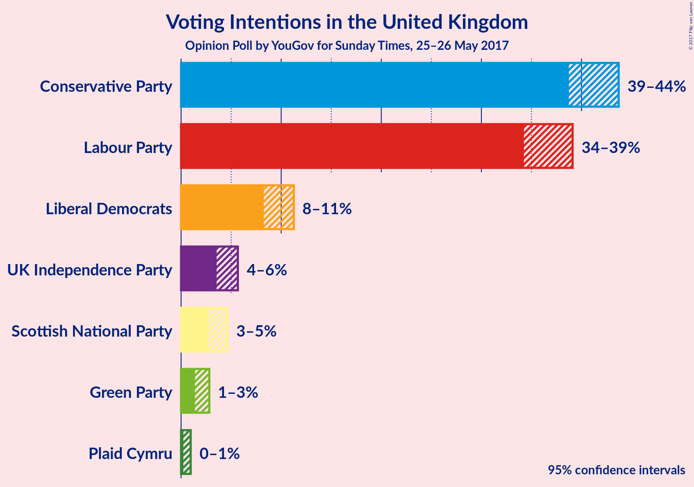
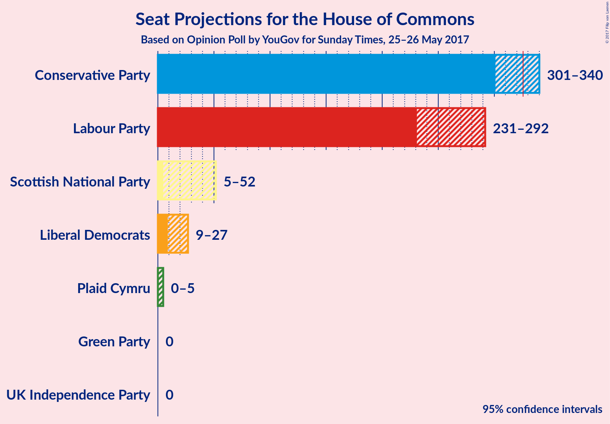
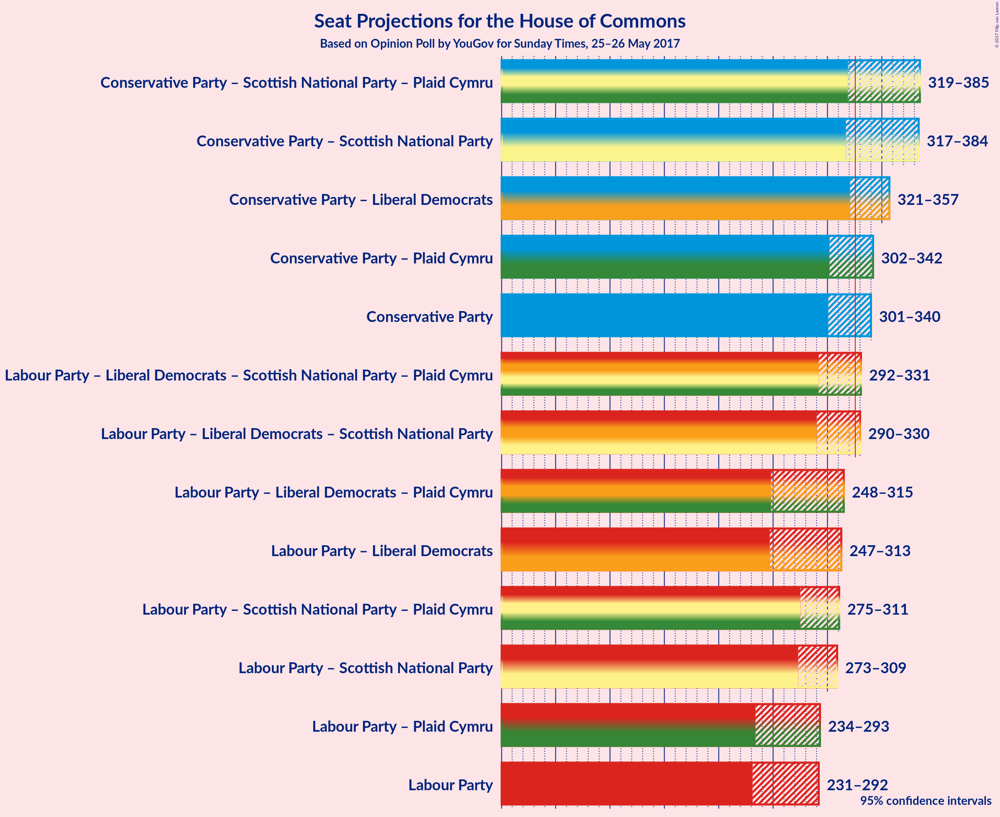

# Opinion Poll by YouGov for Sunday Times, 25–26 May 2017

<a href="#voting-intentions">Voting Intentions</a> | <a href="#seats">Seats</a> | <a href="#coalitions">Coalitions</a> | <a href="#technical-information">Technical Information</a>

## Voting Intentions

### Confidence Intervals

| Party | Last Result | Poll Result | 80% Confidence Interval | 90% Confidence Interval | 95% Confidence Interval | 99% Confidence Interval |
|:-----:|:-----------:|:-----------:|:-----------------------:|:-----------------------:|:-----------------------:|:-----------------------:|
| Conservative Party | 36.9% | 42.0% | 39.6–42.8% |39.1–43.3% |38.7–43.7% |38.0–44.5% |
| Labour Party | 30.4% | 37.4% | 35.1–38.3% |34.6–38.7% |34.2–39.1% |33.5–39.9% |
| Liberal Democrats | 7.9% | 9.9% | 8.7–10.7% |8.5–11.0% |8.3–11.3% |7.8–11.8% |
| UK Independence Party | 12.6% | 4.6% | 3.9–5.3% |3.7–5.5% |3.6–5.7% |3.3–6.1% |
| Scottish National Party | 4.7% | 3.6% | 3.0–4.3% |2.9–4.5% |2.7–4.6% |2.5–5.0% |
| Green Party | 3.8% | 2.0% | 1.6–2.5% |1.5–2.7% |1.4–2.8% |1.2–3.1% |
| Plaid Cymru | 0.6% | 0.5% | 0.3–0.8% |0.3–0.9% |0.2–1.0% |0.2–1.1% |

*Note:* The poll result column reflects the actual value used in the calculations. Published results may vary slightly, and in addition be rounded to fewer digits.

## Seats

### Confidence Intervals

| Party | Last Result | Median | 80% Confidence Interval | 90% Confidence Interval | 95% Confidence Interval | 99% Confidence Interval |
|:-----:|:-----------:|:------:|:-----------------------:|:-----------------------:|:-----------------------:|:-----------------------:|
| <a href="#conservative-party">Conservative Party</a> | 331 | 318 | 307–333 |303–337 |301–340 |289–349 |
| <a href="#labour-party">Labour Party</a> | 232 | 255 | 239–278 |235–287 |231–292 |224–297 |
| <a href="#liberal-democrats">Liberal Democrats</a> | 8 | 19 | 13–24 |10–26 |9–27 |7–29 |
| <a href="#uk-independence-party">UK Independence Party</a> | 1 | 0 | 0 |0 |0 |0 |
| <a href="#scottish-national-party">Scottish National Party</a> | 56 | 34 | 14–49 |7–50 |5–52 |2–54 |
| <a href="#green-party">Green Party</a> | 1 | 0 | 0 |0 |0 |0–1 |
| <a href="#plaid-cymru">Plaid Cymru</a> | 3 | 3 | 0–4 |0–4 |0–5 |0–5 |

### Conservative Party

| Number of Seats | Probability | Accumulated |
|:---------------:|:-----------:|:-----------:|
| 278 | 0% | 100% |
| 279 | 0% | 99.9% |
| 280 | 0% | 99.9% |
| 281 | 0% | 99.9% |
| 282 | 0% | 99.9% |
| 283 | 0% | 99.9% |
| 284 | 0% | 99.9% |
| 285 | 0% | 99.9% |
| 286 | 0% | 99.8% |
| 287 | 0.1% | 99.8% |
| 288 | 0.1% | 99.7% |
| 289 | 0.2% | 99.6% |
| 290 | 0.1% | 99.4% |
| 291 | 0.1% | 99.3% |
| 292 | 0.1% | 99.2% |
| 293 | 0.1% | 99.1% |
| 294 | 0.1% | 99.1% |
| 295 | 0.1% | 99.0% |
| 296 | 0.1% | 98.9% |
| 297 | 0.2% | 98.9% |
| 298 | 0.4% | 98.6% |
| 299 | 0.4% | 98% |
| 300 | 0.3% | 98% |
| 301 | 1.3% | 98% |
| 302 | 1.2% | 96% |
| 303 | 0.5% | 95% |
| 304 | 1.0% | 95% |
| 305 | 0.9% | 94% |
| 306 | 2% | 93% |
| 307 | 2% | 91% |
| 308 | 4% | 88% |
| 309 | 3% | 85% |
| 310 | 3% | 81% |
| 311 | 4% | 79% |
| 312 | 3% | 75% |
| 313 | 2% | 72% |
| 314 | 6% | 70% |
| 315 | 6% | 64% |
| 316 | 3% | 58% |
| 317 | 4% | 55% |
| 318 | 4% | 50% |
| 319 | 4% | 47% |
| 320 | 2% | 42% |
| 321 | 2% | 40% |
| 322 | 4% | 38% |
| 323 | 4% | 34% |
| 324 | 3% | 31% |
| 325 | 2% | 28% |
| 326 | 6% | 27% |
| 327 | 4% | 20% |
| 328 | 1.4% | 17% |
| 329 | 2% | 15% |
| 330 | 1.0% | 14% |
| 331 | 0.7% | 13% |
| 332 | 0.9% | 12% |
| 333 | 1.2% | 11% |
| 334 | 1.1% | 10% |
| 335 | 0.7% | 9% |
| 336 | 2% | 8% |
| 337 | 1.1% | 6% |
| 338 | 2% | 5% |
| 339 | 0.4% | 3% |
| 340 | 0.4% | 3% |
| 341 | 0.2% | 2% |
| 342 | 0.1% | 2% |
| 343 | 0.4% | 2% |
| 344 | 0.3% | 1.5% |
| 345 | 0.2% | 1.2% |
| 346 | 0.2% | 1.0% |
| 347 | 0.2% | 0.8% |
| 348 | 0.1% | 0.6% |
| 349 | 0.2% | 0.5% |
| 350 | 0.2% | 0.3% |
| 351 | 0% | 0.2% |
| 352 | 0.1% | 0.1% |
| 353 | 0% | 0.1% |
| 354 | 0% | 0% |

### Labour Party

| Number of Seats | Probability | Accumulated |
|:---------------:|:-----------:|:-----------:|
| 218 | 0% | 100% |
| 219 | 0.1% | 99.9% |
| 220 | 0.1% | 99.9% |
| 221 | 0.1% | 99.8% |
| 222 | 0.1% | 99.7% |
| 223 | 0.1% | 99.6% |
| 224 | 0.2% | 99.5% |
| 225 | 0.1% | 99.4% |
| 226 | 0.2% | 99.2% |
| 227 | 0.2% | 99.0% |
| 228 | 0.3% | 98.8% |
| 229 | 0.4% | 98.6% |
| 230 | 0.2% | 98% |
| 231 | 0.6% | 98% |
| 232 | 0.4% | 97% |
| 233 | 0.5% | 97% |
| 234 | 1.0% | 96% |
| 235 | 0.8% | 95% |
| 236 | 2% | 95% |
| 237 | 0.6% | 92% |
| 238 | 1.2% | 92% |
| 239 | 1.0% | 91% |
| 240 | 0.5% | 90% |
| 241 | 0.9% | 89% |
| 242 | 1.0% | 88% |
| 243 | 0.4% | 87% |
| 244 | 1.0% | 87% |
| 245 | 3% | 86% |
| 246 | 2% | 83% |
| 247 | 2% | 82% |
| 248 | 1.5% | 80% |
| 249 | 2% | 79% |
| 250 | 3% | 77% |
| 251 | 2% | 73% |
| 252 | 8% | 71% |
| 253 | 9% | 63% |
| 254 | 4% | 55% |
| 255 | 2% | 51% |
| 256 | 2% | 49% |
| 257 | 2% | 47% |
| 258 | 2% | 46% |
| 259 | 3% | 43% |
| 260 | 0.4% | 40% |
| 261 | 1.0% | 40% |
| 262 | 0.4% | 39% |
| 263 | 1.0% | 38% |
| 264 | 1.0% | 37% |
| 265 | 2% | 36% |
| 266 | 0.1% | 35% |
| 267 | 0.6% | 34% |
| 268 | 2% | 34% |
| 269 | 2% | 32% |
| 270 | 3% | 30% |
| 271 | 2% | 27% |
| 272 | 5% | 26% |
| 273 | 3% | 21% |
| 274 | 2% | 17% |
| 275 | 3% | 15% |
| 276 | 0.9% | 12% |
| 277 | 0.3% | 11% |
| 278 | 1.2% | 11% |
| 279 | 2% | 10% |
| 280 | 0.4% | 8% |
| 281 | 0.8% | 8% |
| 282 | 0.3% | 7% |
| 283 | 0.2% | 7% |
| 284 | 0.2% | 6% |
| 285 | 0.1% | 6% |
| 286 | 0.3% | 6% |
| 287 | 0.9% | 6% |
| 288 | 0.5% | 5% |
| 289 | 0.4% | 4% |
| 290 | 0.5% | 4% |
| 291 | 0.2% | 3% |
| 292 | 1.5% | 3% |
| 293 | 0.4% | 2% |
| 294 | 0.4% | 1.3% |
| 295 | 0.3% | 0.9% |
| 296 | 0.1% | 0.6% |
| 297 | 0.1% | 0.5% |
| 298 | 0% | 0.5% |
| 299 | 0.1% | 0.4% |
| 300 | 0.1% | 0.3% |
| 301 | 0% | 0.3% |
| 302 | 0% | 0.2% |
| 303 | 0% | 0.2% |
| 304 | 0% | 0.2% |
| 305 | 0% | 0.2% |
| 306 | 0% | 0.1% |
| 307 | 0% | 0.1% |
| 308 | 0% | 0.1% |
| 309 | 0% | 0.1% |
| 310 | 0% | 0.1% |
| 311 | 0% | 0.1% |
| 312 | 0% | 0.1% |
| 313 | 0% | 0% |

### Liberal Democrats

| Number of Seats | Probability | Accumulated |
|:---------------:|:-----------:|:-----------:|
| 4 | 0% | 100% |
| 5 | 0.1% | 99.9% |
| 6 | 0.2% | 99.8% |
| 7 | 0.5% | 99.6% |
| 8 | 0.7% | 99.1% |
| 9 | 1.0% | 98% |
| 10 | 3% | 97% |
| 11 | 1.0% | 95% |
| 12 | 3% | 94% |
| 13 | 3% | 90% |
| 14 | 7% | 87% |
| 15 | 4% | 80% |
| 16 | 8% | 76% |
| 17 | 8% | 68% |
| 18 | 7% | 60% |
| 19 | 9% | 53% |
| 20 | 5% | 44% |
| 21 | 10% | 39% |
| 22 | 6% | 29% |
| 23 | 8% | 23% |
| 24 | 5% | 15% |
| 25 | 5% | 10% |
| 26 | 0.6% | 5% |
| 27 | 4% | 5% |
| 28 | 0.3% | 1.1% |
| 29 | 0.5% | 0.9% |
| 30 | 0.1% | 0.4% |
| 31 | 0.1% | 0.3% |
| 32 | 0% | 0.2% |
| 33 | 0.1% | 0.2% |
| 34 | 0% | 0.1% |
| 35 | 0% | 0.1% |
| 36 | 0% | 0.1% |
| 37 | 0% | 0.1% |
| 38 | 0% | 0% |

### UK Independence Party

| Number of Seats | Probability | Accumulated |
|:---------------:|:-----------:|:-----------:|
| 0 | 100% | 100% |
| 1 | 0% | 0% |

### Scottish National Party

| Number of Seats | Probability | Accumulated |
|:---------------:|:-----------:|:-----------:|
| 2 | 0.6% | 100% |
| 3 | 0.2% | 99.4% |
| 4 | 0.8% | 99.2% |
| 5 | 1.3% | 98% |
| 6 | 2% | 97% |
| 7 | 0.8% | 96% |
| 8 | 0.5% | 95% |
| 9 | 0.4% | 94% |
| 10 | 0.4% | 94% |
| 11 | 3% | 93% |
| 12 | 0.1% | 91% |
| 13 | 0.2% | 91% |
| 14 | 1.4% | 90% |
| 15 | 2% | 89% |
| 16 | 2% | 87% |
| 17 | 0.4% | 86% |
| 18 | 6% | 85% |
| 19 | 0.2% | 79% |
| 20 | 0.6% | 79% |
| 21 | 1.0% | 78% |
| 22 | 1.0% | 77% |
| 23 | 0.3% | 76% |
| 24 | 0.9% | 76% |
| 25 | 2% | 75% |
| 26 | 0.9% | 73% |
| 27 | 5% | 72% |
| 28 | 0.5% | 67% |
| 29 | 2% | 67% |
| 30 | 2% | 65% |
| 31 | 5% | 63% |
| 32 | 5% | 58% |
| 33 | 2% | 53% |
| 34 | 2% | 51% |
| 35 | 0.6% | 49% |
| 36 | 0.6% | 49% |
| 37 | 2% | 48% |
| 38 | 0.4% | 46% |
| 39 | 0.4% | 46% |
| 40 | 0.9% | 45% |
| 41 | 3% | 44% |
| 42 | 4% | 41% |
| 43 | 4% | 37% |
| 44 | 3% | 33% |
| 45 | 6% | 30% |
| 46 | 8% | 24% |
| 47 | 3% | 16% |
| 48 | 3% | 14% |
| 49 | 4% | 11% |
| 50 | 1.5% | 6% |
| 51 | 0.9% | 5% |
| 52 | 2% | 4% |
| 53 | 1.4% | 2% |
| 54 | 0.5% | 0.9% |
| 55 | 0.3% | 0.4% |
| 56 | 0.1% | 0.1% |
| 57 | 0% | 0% |

### Green Party

| Number of Seats | Probability | Accumulated |
|:---------------:|:-----------:|:-----------:|
| 0 | 98% | 100% |
| 1 | 2% | 2% |
| 2 | 0% | 0% |

### Plaid Cymru

| Number of Seats | Probability | Accumulated |
|:---------------:|:-----------:|:-----------:|
| 0 | 20% | 100% |
| 1 | 15% | 80% |
| 2 | 12% | 65% |
| 3 | 40% | 53% |
| 4 | 10% | 13% |
| 5 | 3% | 3% |
| 6 | 0% | 0.1% |
| 7 | 0.1% | 0.1% |
| 8 | 0% | 0% |

## Coalitions

### Confidence Intervals

| Coalition | Last Result | Median | 80% Confidence Interval | 90% Confidence Interval | 95% Confidence Interval | 99% Confidence Interval |
|:---------:|:-----------:|:------:|:-----------------------:|:-----------------------:|:-----------------------:|:-----------------------:|
| Conservative Party – Scottish National Party – Plaid Cymru | 390 | 358 | 335–376 | 322–382 | 319–385 | 312–395 |
| Conservative Party – Scottish National Party | 387 | 356 | 332–375 | 321–379 | 317–384 | 310–392 |
| Conservative Party – Liberal Democrats | 339 | 337 | 327–350 | 324–354 | 321–357 | 312–365 |
| Conservative Party – Plaid Cymru | 334 | 320 | 309–336 | 305–339 | 302–342 | 291–350 |
| Conservative Party | 331 | 318 | 307–333 | 303–337 | 301–340 | 289–349 |
| Labour Party – Liberal Democrats – Scottish National Party – Plaid Cymru | 299 | 314 | 299–325 | 295–329 | 292–331 | 283–343 |
| Labour Party – Liberal Democrats – Scottish National Party | 296 | 312 | 296–323 | 293–327 | 290–330 | 282–341 |
| Labour Party – Liberal Democrats – Plaid Cymru | 243 | 276 | 257–300 | 253–311 | 248–315 | 240–322 |
| Labour Party – Liberal Democrats | 240 | 274 | 256–297 | 250–310 | 247–313 | 237–320 |
| Labour Party – Scottish National Party – Plaid Cymru | 291 | 295 | 281–305 | 278–308 | 275–311 | 267–320 |
| Labour Party – Scottish National Party | 288 | 293 | 280–303 | 277–306 | 273–309 | 264–318 |
| Labour Party – Plaid Cymru | 235 | 258 | 242–281 | 237–289 | 234–293 | 226–299 |
| Labour Party | 232 | 255 | 239–278 | 235–287 | 231–292 | 224–297 |

### Conservative Party – Scottish National Party – Plaid Cymru

| Number of Seats | Probability | Accumulated |
|:---------------:|:-----------:|:-----------:|
| 298 | 0% | 100% |
| 299 | 0% | 99.9% |
| 300 | 0% | 99.9% |
| 301 | 0% | 99.9% |
| 302 | 0% | 99.9% |
| 303 | 0% | 99.8% |
| 304 | 0% | 99.8% |
| 305 | 0% | 99.8% |
| 306 | 0% | 99.8% |
| 307 | 0% | 99.8% |
| 308 | 0% | 99.8% |
| 309 | 0% | 99.8% |
| 310 | 0% | 99.7% |
| 311 | 0.1% | 99.7% |
| 312 | 0.1% | 99.6% |
| 313 | 0.1% | 99.4% |
| 314 | 0.2% | 99.4% |
| 315 | 0.3% | 99.1% |
| 316 | 0.2% | 98.8% |
| 317 | 0.3% | 98.6% |
| 318 | 0.7% | 98% |
| 319 | 0.4% | 98% |
| 320 | 0.9% | 97% |
| 321 | 0.6% | 96% |
| 322 | 0.6% | 96% |
| 323 | 0.6% | 95% |
| 324 | 0.2% | 94% |
| 325 | 0.1% | 94% |
| 326 | 0.1% | 94% |
| 327 | 0.1% | 94% |
| 328 | 0.1% | 94% |
| 329 | 0.1% | 94% |
| 330 | 1.0% | 94% |
| 331 | 0.1% | 93% |
| 332 | 0.4% | 92% |
| 333 | 0.7% | 92% |
| 334 | 0.8% | 91% |
| 335 | 3% | 90% |
| 336 | 2% | 88% |
| 337 | 2% | 86% |
| 338 | 3% | 84% |
| 339 | 5% | 81% |
| 340 | 4% | 77% |
| 341 | 2% | 73% |
| 342 | 2% | 71% |
| 343 | 1.1% | 69% |
| 344 | 2% | 67% |
| 345 | 0.4% | 65% |
| 346 | 2% | 65% |
| 347 | 0.2% | 63% |
| 348 | 1.0% | 63% |
| 349 | 0.2% | 61% |
| 350 | 0.3% | 61% |
| 351 | 0.3% | 61% |
| 352 | 0.6% | 61% |
| 353 | 0.4% | 60% |
| 354 | 2% | 60% |
| 355 | 2% | 58% |
| 356 | 1.4% | 56% |
| 357 | 2% | 55% |
| 358 | 4% | 53% |
| 359 | 4% | 49% |
| 360 | 6% | 46% |
| 361 | 5% | 40% |
| 362 | 5% | 35% |
| 363 | 2% | 31% |
| 364 | 2% | 29% |
| 365 | 3% | 26% |
| 366 | 3% | 23% |
| 367 | 2% | 20% |
| 368 | 1.0% | 19% |
| 369 | 1.0% | 18% |
| 370 | 1.2% | 17% |
| 371 | 0.5% | 15% |
| 372 | 0.8% | 15% |
| 373 | 0.8% | 14% |
| 374 | 0.5% | 13% |
| 375 | 2% | 13% |
| 376 | 2% | 11% |
| 377 | 0.6% | 9% |
| 378 | 1.0% | 9% |
| 379 | 1.0% | 8% |
| 380 | 0.2% | 7% |
| 381 | 0.8% | 7% |
| 382 | 2% | 6% |
| 383 | 0.8% | 4% |
| 384 | 0.7% | 4% |
| 385 | 0.5% | 3% |
| 386 | 0.2% | 2% |
| 387 | 0.3% | 2% |
| 388 | 0.2% | 2% |
| 389 | 0.4% | 2% |
| 390 | 0.3% | 1.4% |
| 391 | 0.3% | 1.0% |
| 392 | 0.1% | 0.8% |
| 393 | 0.1% | 0.7% |
| 394 | 0% | 0.6% |
| 395 | 0.1% | 0.5% |
| 396 | 0.2% | 0.5% |
| 397 | 0% | 0.3% |
| 398 | 0% | 0.2% |
| 399 | 0% | 0.2% |
| 400 | 0% | 0.2% |
| 401 | 0.1% | 0.1% |
| 402 | 0% | 0.1% |
| 403 | 0% | 0% |

### Conservative Party – Scottish National Party

| Number of Seats | Probability | Accumulated |
|:---------------:|:-----------:|:-----------:|
| 295 | 0% | 100% |
| 296 | 0% | 99.9% |
| 297 | 0% | 99.9% |
| 298 | 0% | 99.9% |
| 299 | 0% | 99.9% |
| 300 | 0% | 99.9% |
| 301 | 0% | 99.9% |
| 302 | 0% | 99.8% |
| 303 | 0% | 99.8% |
| 304 | 0% | 99.8% |
| 305 | 0% | 99.8% |
| 306 | 0% | 99.8% |
| 307 | 0% | 99.7% |
| 308 | 0.1% | 99.7% |
| 309 | 0.1% | 99.6% |
| 310 | 0.1% | 99.5% |
| 311 | 0.2% | 99.4% |
| 312 | 0.2% | 99.3% |
| 313 | 0.2% | 99.1% |
| 314 | 0.2% | 98.9% |
| 315 | 0.5% | 98.6% |
| 316 | 0.5% | 98% |
| 317 | 0.7% | 98% |
| 318 | 0.5% | 97% |
| 319 | 0.4% | 96% |
| 320 | 0.7% | 96% |
| 321 | 0.8% | 95% |
| 322 | 0.3% | 95% |
| 323 | 0.3% | 94% |
| 324 | 0.2% | 94% |
| 325 | 0.1% | 94% |
| 326 | 0.1% | 94% |
| 327 | 1.1% | 94% |
| 328 | 0.4% | 92% |
| 329 | 0.4% | 92% |
| 330 | 0.5% | 92% |
| 331 | 0.7% | 91% |
| 332 | 1.1% | 91% |
| 333 | 1.3% | 89% |
| 334 | 2% | 88% |
| 335 | 2% | 86% |
| 336 | 4% | 84% |
| 337 | 4% | 80% |
| 338 | 1.2% | 75% |
| 339 | 2% | 74% |
| 340 | 2% | 72% |
| 341 | 3% | 70% |
| 342 | 1.0% | 67% |
| 343 | 0.7% | 66% |
| 344 | 1.3% | 65% |
| 345 | 2% | 64% |
| 346 | 0.3% | 62% |
| 347 | 0.3% | 62% |
| 348 | 0.7% | 61% |
| 349 | 0.2% | 61% |
| 350 | 0.5% | 61% |
| 351 | 1.4% | 60% |
| 352 | 2% | 59% |
| 353 | 1.0% | 57% |
| 354 | 1.4% | 56% |
| 355 | 3% | 54% |
| 356 | 3% | 51% |
| 357 | 4% | 48% |
| 358 | 4% | 43% |
| 359 | 4% | 39% |
| 360 | 3% | 35% |
| 361 | 4% | 32% |
| 362 | 2% | 28% |
| 363 | 4% | 26% |
| 364 | 1.0% | 22% |
| 365 | 2% | 21% |
| 366 | 1.1% | 20% |
| 367 | 2% | 18% |
| 368 | 0.7% | 16% |
| 369 | 1.2% | 16% |
| 370 | 0.6% | 14% |
| 371 | 0.9% | 14% |
| 372 | 1.3% | 13% |
| 373 | 0.7% | 12% |
| 374 | 0.8% | 11% |
| 375 | 2% | 10% |
| 376 | 0.3% | 8% |
| 377 | 1.4% | 8% |
| 378 | 0.6% | 7% |
| 379 | 2% | 6% |
| 380 | 0.7% | 4% |
| 381 | 0.3% | 4% |
| 382 | 0.6% | 3% |
| 383 | 0.2% | 3% |
| 384 | 0.5% | 3% |
| 385 | 0.4% | 2% |
| 386 | 0.4% | 2% |
| 387 | 0.2% | 1.4% |
| 388 | 0.2% | 1.3% |
| 389 | 0.1% | 1.0% |
| 390 | 0.3% | 0.9% |
| 391 | 0.1% | 0.7% |
| 392 | 0.1% | 0.5% |
| 393 | 0.1% | 0.4% |
| 394 | 0.1% | 0.4% |
| 395 | 0.1% | 0.3% |
| 396 | 0.1% | 0.2% |
| 397 | 0% | 0.2% |
| 398 | 0% | 0.1% |
| 399 | 0% | 0.1% |
| 400 | 0% | 0% |

### Conservative Party – Liberal Democrats

| Number of Seats | Probability | Accumulated |
|:---------------:|:-----------:|:-----------:|
| 298 | 0% | 100% |
| 299 | 0% | 99.9% |
| 300 | 0% | 99.9% |
| 301 | 0% | 99.9% |
| 302 | 0% | 99.9% |
| 303 | 0% | 99.9% |
| 304 | 0% | 99.9% |
| 305 | 0% | 99.9% |
| 306 | 0% | 99.8% |
| 307 | 0% | 99.8% |
| 308 | 0% | 99.8% |
| 309 | 0.1% | 99.8% |
| 310 | 0.1% | 99.7% |
| 311 | 0.1% | 99.6% |
| 312 | 0.1% | 99.6% |
| 313 | 0.1% | 99.5% |
| 314 | 0.1% | 99.3% |
| 315 | 0.1% | 99.2% |
| 316 | 0.2% | 99.1% |
| 317 | 0.3% | 98.9% |
| 318 | 0.3% | 98.6% |
| 319 | 0.2% | 98% |
| 320 | 0.4% | 98% |
| 321 | 0.9% | 98% |
| 322 | 1.0% | 97% |
| 323 | 0.6% | 96% |
| 324 | 0.9% | 95% |
| 325 | 2% | 94% |
| 326 | 2% | 92% |
| 327 | 3% | 90% |
| 328 | 3% | 88% |
| 329 | 2% | 85% |
| 330 | 5% | 83% |
| 331 | 6% | 78% |
| 332 | 6% | 72% |
| 333 | 4% | 66% |
| 334 | 2% | 62% |
| 335 | 4% | 60% |
| 336 | 2% | 55% |
| 337 | 4% | 53% |
| 338 | 8% | 49% |
| 339 | 4% | 41% |
| 340 | 5% | 37% |
| 341 | 3% | 32% |
| 342 | 2% | 29% |
| 343 | 1.1% | 27% |
| 344 | 4% | 26% |
| 345 | 3% | 22% |
| 346 | 2% | 19% |
| 347 | 2% | 17% |
| 348 | 2% | 14% |
| 349 | 0.5% | 12% |
| 350 | 2% | 12% |
| 351 | 2% | 10% |
| 352 | 2% | 8% |
| 353 | 0.5% | 6% |
| 354 | 1.3% | 5% |
| 355 | 0.5% | 4% |
| 356 | 0.7% | 4% |
| 357 | 0.5% | 3% |
| 358 | 0.4% | 2% |
| 359 | 0.4% | 2% |
| 360 | 0.3% | 1.5% |
| 361 | 0.2% | 1.2% |
| 362 | 0.1% | 1.0% |
| 363 | 0.2% | 0.9% |
| 364 | 0.1% | 0.7% |
| 365 | 0.2% | 0.6% |
| 366 | 0.1% | 0.4% |
| 367 | 0.1% | 0.4% |
| 368 | 0.1% | 0.2% |
| 369 | 0.1% | 0.1% |
| 370 | 0% | 0.1% |
| 371 | 0% | 0.1% |
| 372 | 0% | 0% |

### Conservative Party – Plaid Cymru

| Number of Seats | Probability | Accumulated |
|:---------------:|:-----------:|:-----------:|
| 279 | 0% | 100% |
| 280 | 0% | 99.9% |
| 281 | 0% | 99.9% |
| 282 | 0% | 99.9% |
| 283 | 0% | 99.9% |
| 284 | 0% | 99.9% |
| 285 | 0% | 99.9% |
| 286 | 0% | 99.9% |
| 287 | 0% | 99.9% |
| 288 | 0% | 99.9% |
| 289 | 0.1% | 99.8% |
| 290 | 0.2% | 99.7% |
| 291 | 0.1% | 99.5% |
| 292 | 0.1% | 99.4% |
| 293 | 0.1% | 99.3% |
| 294 | 0.1% | 99.2% |
| 295 | 0.1% | 99.1% |
| 296 | 0.1% | 99.0% |
| 297 | 0% | 98.9% |
| 298 | 0% | 98.9% |
| 299 | 0.1% | 98.9% |
| 300 | 0.4% | 98.8% |
| 301 | 0.5% | 98% |
| 302 | 0.9% | 98% |
| 303 | 0.6% | 97% |
| 304 | 1.0% | 96% |
| 305 | 0.8% | 95% |
| 306 | 1.0% | 95% |
| 307 | 1.3% | 94% |
| 308 | 2% | 92% |
| 309 | 2% | 91% |
| 310 | 3% | 88% |
| 311 | 4% | 85% |
| 312 | 3% | 81% |
| 313 | 2% | 78% |
| 314 | 4% | 76% |
| 315 | 4% | 72% |
| 316 | 3% | 68% |
| 317 | 3% | 65% |
| 318 | 5% | 61% |
| 319 | 6% | 57% |
| 320 | 3% | 50% |
| 321 | 4% | 47% |
| 322 | 2% | 43% |
| 323 | 3% | 41% |
| 324 | 3% | 38% |
| 325 | 2% | 35% |
| 326 | 3% | 33% |
| 327 | 4% | 30% |
| 328 | 3% | 26% |
| 329 | 5% | 23% |
| 330 | 5% | 18% |
| 331 | 0.5% | 14% |
| 332 | 0.9% | 13% |
| 333 | 0.4% | 12% |
| 334 | 0.5% | 12% |
| 335 | 1.3% | 12% |
| 336 | 0.9% | 10% |
| 337 | 1.1% | 9% |
| 338 | 2% | 8% |
| 339 | 3% | 7% |
| 340 | 0.9% | 4% |
| 341 | 0.6% | 3% |
| 342 | 0.3% | 3% |
| 343 | 0.3% | 2% |
| 344 | 0.2% | 2% |
| 345 | 0.1% | 2% |
| 346 | 0.2% | 2% |
| 347 | 0.2% | 1.4% |
| 348 | 0.2% | 1.1% |
| 349 | 0.3% | 0.9% |
| 350 | 0.2% | 0.6% |
| 351 | 0.1% | 0.5% |
| 352 | 0.1% | 0.3% |
| 353 | 0.1% | 0.3% |
| 354 | 0% | 0.1% |
| 355 | 0% | 0.1% |
| 356 | 0% | 0.1% |
| 357 | 0% | 0% |

### Conservative Party

| Number of Seats | Probability | Accumulated |
|:---------------:|:-----------:|:-----------:|
| 278 | 0% | 100% |
| 279 | 0% | 99.9% |
| 280 | 0% | 99.9% |
| 281 | 0% | 99.9% |
| 282 | 0% | 99.9% |
| 283 | 0% | 99.9% |
| 284 | 0% | 99.9% |
| 285 | 0% | 99.9% |
| 286 | 0% | 99.8% |
| 287 | 0.1% | 99.8% |
| 288 | 0.1% | 99.7% |
| 289 | 0.2% | 99.6% |
| 290 | 0.1% | 99.4% |
| 291 | 0.1% | 99.3% |
| 292 | 0.1% | 99.2% |
| 293 | 0.1% | 99.1% |
| 294 | 0.1% | 99.1% |
| 295 | 0.1% | 99.0% |
| 296 | 0.1% | 98.9% |
| 297 | 0.2% | 98.9% |
| 298 | 0.4% | 98.6% |
| 299 | 0.4% | 98% |
| 300 | 0.3% | 98% |
| 301 | 1.3% | 98% |
| 302 | 1.2% | 96% |
| 303 | 0.5% | 95% |
| 304 | 1.0% | 95% |
| 305 | 0.9% | 94% |
| 306 | 2% | 93% |
| 307 | 2% | 91% |
| 308 | 4% | 88% |
| 309 | 3% | 85% |
| 310 | 3% | 81% |
| 311 | 4% | 79% |
| 312 | 3% | 75% |
| 313 | 2% | 72% |
| 314 | 6% | 70% |
| 315 | 6% | 64% |
| 316 | 3% | 58% |
| 317 | 4% | 55% |
| 318 | 4% | 50% |
| 319 | 4% | 47% |
| 320 | 2% | 42% |
| 321 | 2% | 40% |
| 322 | 4% | 38% |
| 323 | 4% | 34% |
| 324 | 3% | 31% |
| 325 | 2% | 28% |
| 326 | 6% | 27% |
| 327 | 4% | 20% |
| 328 | 1.4% | 17% |
| 329 | 2% | 15% |
| 330 | 1.0% | 14% |
| 331 | 0.7% | 13% |
| 332 | 0.9% | 12% |
| 333 | 1.2% | 11% |
| 334 | 1.1% | 10% |
| 335 | 0.7% | 9% |
| 336 | 2% | 8% |
| 337 | 1.1% | 6% |
| 338 | 2% | 5% |
| 339 | 0.4% | 3% |
| 340 | 0.4% | 3% |
| 341 | 0.2% | 2% |
| 342 | 0.1% | 2% |
| 343 | 0.4% | 2% |
| 344 | 0.3% | 1.5% |
| 345 | 0.2% | 1.2% |
| 346 | 0.2% | 1.0% |
| 347 | 0.2% | 0.8% |
| 348 | 0.1% | 0.6% |
| 349 | 0.2% | 0.5% |
| 350 | 0.2% | 0.3% |
| 351 | 0% | 0.2% |
| 352 | 0.1% | 0.1% |
| 353 | 0% | 0.1% |
| 354 | 0% | 0% |

### Labour Party – Liberal Democrats – Scottish National Party – Plaid Cymru

| Number of Seats | Probability | Accumulated |
|:---------------:|:-----------:|:-----------:|
| 279 | 0% | 100% |
| 280 | 0.1% | 99.9% |
| 281 | 0% | 99.9% |
| 282 | 0.2% | 99.8% |
| 283 | 0.2% | 99.7% |
| 284 | 0.1% | 99.5% |
| 285 | 0.2% | 99.4% |
| 286 | 0.2% | 99.2% |
| 287 | 0.2% | 99.0% |
| 288 | 0.3% | 98.8% |
| 289 | 0.4% | 98% |
| 290 | 0.1% | 98% |
| 291 | 0.2% | 98% |
| 292 | 0.4% | 98% |
| 293 | 0.5% | 97% |
| 294 | 2% | 97% |
| 295 | 1.1% | 95% |
| 296 | 2% | 94% |
| 297 | 0.8% | 92% |
| 298 | 1.1% | 91% |
| 299 | 1.2% | 90% |
| 300 | 0.9% | 89% |
| 301 | 0.7% | 88% |
| 302 | 1.0% | 87% |
| 303 | 2% | 86% |
| 304 | 1.4% | 85% |
| 305 | 4% | 83% |
| 306 | 6% | 80% |
| 307 | 1.5% | 73% |
| 308 | 3% | 72% |
| 309 | 3% | 69% |
| 310 | 4% | 66% |
| 311 | 2% | 62% |
| 312 | 2% | 60% |
| 313 | 4% | 58% |
| 314 | 4% | 53% |
| 315 | 4% | 50% |
| 316 | 3% | 45% |
| 317 | 6% | 42% |
| 318 | 6% | 36% |
| 319 | 2% | 30% |
| 320 | 3% | 28% |
| 321 | 4% | 25% |
| 322 | 3% | 21% |
| 323 | 3% | 19% |
| 324 | 4% | 15% |
| 325 | 2% | 12% |
| 326 | 2% | 9% |
| 327 | 0.9% | 7% |
| 328 | 1.0% | 6% |
| 329 | 0.4% | 5% |
| 330 | 1.2% | 5% |
| 331 | 1.3% | 4% |
| 332 | 0.3% | 2% |
| 333 | 0.4% | 2% |
| 334 | 0.4% | 2% |
| 335 | 0.2% | 1.4% |
| 336 | 0.1% | 1.1% |
| 337 | 0.1% | 1.1% |
| 338 | 0.1% | 1.0% |
| 339 | 0.1% | 0.9% |
| 340 | 0.1% | 0.9% |
| 341 | 0.1% | 0.8% |
| 342 | 0.1% | 0.7% |
| 343 | 0.2% | 0.6% |
| 344 | 0.1% | 0.4% |
| 345 | 0.1% | 0.3% |
| 346 | 0% | 0.2% |
| 347 | 0% | 0.2% |
| 348 | 0% | 0.1% |
| 349 | 0% | 0.1% |
| 350 | 0% | 0.1% |
| 351 | 0% | 0.1% |
| 352 | 0% | 0.1% |
| 353 | 0% | 0.1% |
| 354 | 0% | 0.1% |
| 355 | 0% | 0% |

### Labour Party – Liberal Democrats – Scottish National Party

| Number of Seats | Probability | Accumulated |
|:---------------:|:-----------:|:-----------:|
| 276 | 0% | 100% |
| 277 | 0% | 99.9% |
| 278 | 0% | 99.9% |
| 279 | 0.1% | 99.8% |
| 280 | 0.1% | 99.7% |
| 281 | 0.1% | 99.7% |
| 282 | 0.2% | 99.5% |
| 283 | 0.3% | 99.4% |
| 284 | 0.2% | 99.1% |
| 285 | 0.3% | 98.8% |
| 286 | 0.2% | 98.6% |
| 287 | 0.1% | 98% |
| 288 | 0.2% | 98% |
| 289 | 0.3% | 98% |
| 290 | 0.3% | 98% |
| 291 | 0.6% | 97% |
| 292 | 0.9% | 97% |
| 293 | 3% | 96% |
| 294 | 1.5% | 93% |
| 295 | 1.1% | 92% |
| 296 | 0.8% | 91% |
| 297 | 1.4% | 90% |
| 298 | 0.4% | 88% |
| 299 | 0.4% | 88% |
| 300 | 0.9% | 88% |
| 301 | 0.5% | 87% |
| 302 | 5% | 86% |
| 303 | 5% | 82% |
| 304 | 3% | 77% |
| 305 | 4% | 74% |
| 306 | 3% | 70% |
| 307 | 2% | 67% |
| 308 | 3% | 65% |
| 309 | 3% | 62% |
| 310 | 2% | 59% |
| 311 | 4% | 57% |
| 312 | 3% | 53% |
| 313 | 6% | 50% |
| 314 | 4% | 43% |
| 315 | 3% | 39% |
| 316 | 3% | 35% |
| 317 | 4% | 32% |
| 318 | 4% | 28% |
| 319 | 2% | 24% |
| 320 | 3% | 22% |
| 321 | 4% | 19% |
| 322 | 3% | 15% |
| 323 | 2% | 12% |
| 324 | 2% | 9% |
| 325 | 1.3% | 8% |
| 326 | 1.0% | 6% |
| 327 | 0.8% | 5% |
| 328 | 1.0% | 5% |
| 329 | 0.6% | 4% |
| 330 | 0.9% | 3% |
| 331 | 0.5% | 2% |
| 332 | 0.4% | 2% |
| 333 | 0.1% | 1.2% |
| 334 | 0% | 1.1% |
| 335 | 0% | 1.1% |
| 336 | 0.1% | 1.1% |
| 337 | 0.1% | 1.0% |
| 338 | 0.1% | 0.9% |
| 339 | 0.1% | 0.8% |
| 340 | 0.1% | 0.7% |
| 341 | 0.1% | 0.6% |
| 342 | 0.2% | 0.5% |
| 343 | 0.1% | 0.3% |
| 344 | 0% | 0.2% |
| 345 | 0% | 0.1% |
| 346 | 0% | 0.1% |
| 347 | 0% | 0.1% |
| 348 | 0% | 0.1% |
| 349 | 0% | 0.1% |
| 350 | 0% | 0.1% |
| 351 | 0% | 0.1% |
| 352 | 0% | 0.1% |
| 353 | 0% | 0.1% |
| 354 | 0% | 0% |

### Labour Party – Liberal Democrats – Plaid Cymru

| Number of Seats | Probability | Accumulated |
|:---------------:|:-----------:|:-----------:|
| 232 | 0% | 100% |
| 233 | 0% | 99.9% |
| 234 | 0% | 99.9% |
| 235 | 0% | 99.9% |
| 236 | 0.1% | 99.8% |
| 237 | 0.1% | 99.8% |
| 238 | 0.1% | 99.6% |
| 239 | 0.1% | 99.6% |
| 240 | 0.1% | 99.5% |
| 241 | 0.1% | 99.4% |
| 242 | 0.3% | 99.3% |
| 243 | 0.1% | 99.0% |
| 244 | 0.2% | 99.0% |
| 245 | 0.2% | 98.7% |
| 246 | 0.4% | 98.6% |
| 247 | 0.4% | 98% |
| 248 | 0.5% | 98% |
| 249 | 0.3% | 97% |
| 250 | 0.5% | 97% |
| 251 | 0.3% | 97% |
| 252 | 0.7% | 96% |
| 253 | 2% | 95% |
| 254 | 0.6% | 94% |
| 255 | 1.4% | 93% |
| 256 | 0.3% | 92% |
| 257 | 2% | 92% |
| 258 | 0.7% | 90% |
| 259 | 0.7% | 89% |
| 260 | 1.3% | 88% |
| 261 | 0.9% | 87% |
| 262 | 0.7% | 86% |
| 263 | 1.2% | 86% |
| 264 | 0.7% | 84% |
| 265 | 2% | 84% |
| 266 | 1.1% | 82% |
| 267 | 2% | 80% |
| 268 | 1.1% | 79% |
| 269 | 4% | 78% |
| 270 | 2% | 74% |
| 271 | 4% | 72% |
| 272 | 3% | 68% |
| 273 | 4% | 65% |
| 274 | 4% | 61% |
| 275 | 4% | 57% |
| 276 | 3% | 52% |
| 277 | 3% | 49% |
| 278 | 1.4% | 46% |
| 279 | 1.0% | 44% |
| 280 | 2% | 43% |
| 281 | 1.3% | 41% |
| 282 | 0.5% | 40% |
| 283 | 0.2% | 39% |
| 284 | 0.7% | 39% |
| 285 | 0.3% | 39% |
| 286 | 0.3% | 38% |
| 287 | 2% | 38% |
| 288 | 1.3% | 36% |
| 289 | 0.7% | 35% |
| 290 | 1.0% | 34% |
| 291 | 3% | 33% |
| 292 | 2% | 30% |
| 293 | 2% | 28% |
| 294 | 1.2% | 26% |
| 295 | 5% | 25% |
| 296 | 4% | 20% |
| 297 | 2% | 16% |
| 298 | 2% | 14% |
| 299 | 1.2% | 12% |
| 300 | 1.1% | 11% |
| 301 | 0.7% | 9% |
| 302 | 0.5% | 9% |
| 303 | 0.4% | 8% |
| 304 | 0.4% | 8% |
| 305 | 1.1% | 7% |
| 306 | 0.1% | 6% |
| 307 | 0.1% | 6% |
| 308 | 0.2% | 6% |
| 309 | 0.3% | 6% |
| 310 | 0.3% | 6% |
| 311 | 0.8% | 5% |
| 312 | 0.7% | 5% |
| 313 | 0.4% | 4% |
| 314 | 0.5% | 3% |
| 315 | 0.7% | 3% |
| 316 | 0.5% | 2% |
| 317 | 0.5% | 2% |
| 318 | 0.2% | 1.4% |
| 319 | 0.2% | 1.1% |
| 320 | 0.2% | 0.9% |
| 321 | 0.2% | 0.7% |
| 322 | 0.1% | 0.6% |
| 323 | 0.1% | 0.5% |
| 324 | 0.1% | 0.4% |
| 325 | 0% | 0.3% |
| 326 | 0% | 0.3% |
| 327 | 0% | 0.2% |
| 328 | 0% | 0.2% |
| 329 | 0% | 0.2% |
| 330 | 0% | 0.2% |
| 331 | 0% | 0.2% |
| 332 | 0% | 0.1% |
| 333 | 0% | 0.1% |
| 334 | 0% | 0.1% |
| 335 | 0% | 0.1% |
| 336 | 0% | 0.1% |
| 337 | 0% | 0.1% |
| 338 | 0% | 0% |

### Labour Party – Liberal Democrats

| Number of Seats | Probability | Accumulated |
|:---------------:|:-----------:|:-----------:|
| 230 | 0% | 100% |
| 231 | 0.1% | 99.9% |
| 232 | 0% | 99.9% |
| 233 | 0% | 99.8% |
| 234 | 0% | 99.8% |
| 235 | 0% | 99.8% |
| 236 | 0.2% | 99.7% |
| 237 | 0.1% | 99.5% |
| 238 | 0.1% | 99.5% |
| 239 | 0.1% | 99.4% |
| 240 | 0.1% | 99.3% |
| 241 | 0.3% | 99.2% |
| 242 | 0.3% | 98.9% |
| 243 | 0.4% | 98.6% |
| 244 | 0.1% | 98% |
| 245 | 0.3% | 98% |
| 246 | 0.2% | 98% |
| 247 | 0.5% | 98% |
| 248 | 0.7% | 97% |
| 249 | 0.8% | 96% |
| 250 | 2% | 96% |
| 251 | 0.8% | 94% |
| 252 | 0.3% | 93% |
| 253 | 1.0% | 93% |
| 254 | 1.0% | 92% |
| 255 | 0.6% | 91% |
| 256 | 2% | 91% |
| 257 | 2% | 89% |
| 258 | 0.4% | 87% |
| 259 | 0.8% | 87% |
| 260 | 0.8% | 86% |
| 261 | 0.5% | 85% |
| 262 | 1.2% | 85% |
| 263 | 1.0% | 83% |
| 264 | 1.0% | 82% |
| 265 | 2% | 81% |
| 266 | 3% | 80% |
| 267 | 3% | 77% |
| 268 | 2% | 74% |
| 269 | 2% | 71% |
| 270 | 5% | 69% |
| 271 | 5% | 65% |
| 272 | 6% | 60% |
| 273 | 4% | 54% |
| 274 | 4% | 50% |
| 275 | 2% | 47% |
| 276 | 1.4% | 45% |
| 277 | 2% | 43% |
| 278 | 1.5% | 42% |
| 279 | 0.4% | 40% |
| 280 | 0.6% | 40% |
| 281 | 0.3% | 39% |
| 282 | 0.3% | 39% |
| 283 | 0.2% | 39% |
| 284 | 1.0% | 39% |
| 285 | 0.2% | 37% |
| 286 | 2% | 37% |
| 287 | 0.4% | 35% |
| 288 | 2% | 35% |
| 289 | 1.1% | 33% |
| 290 | 2% | 31% |
| 291 | 2% | 29% |
| 292 | 4% | 27% |
| 293 | 5% | 23% |
| 294 | 3% | 19% |
| 295 | 2% | 16% |
| 296 | 2% | 14% |
| 297 | 3% | 12% |
| 298 | 0.8% | 9% |
| 299 | 0.7% | 9% |
| 300 | 0.4% | 8% |
| 301 | 0.1% | 8% |
| 302 | 1.0% | 7% |
| 303 | 0.1% | 6% |
| 304 | 0.1% | 6% |
| 305 | 0.1% | 6% |
| 306 | 0.1% | 6% |
| 307 | 0.1% | 6% |
| 308 | 0.2% | 6% |
| 309 | 0.6% | 6% |
| 310 | 0.6% | 5% |
| 311 | 0.6% | 4% |
| 312 | 0.9% | 4% |
| 313 | 0.4% | 3% |
| 314 | 0.7% | 2% |
| 315 | 0.3% | 2% |
| 316 | 0.2% | 1.4% |
| 317 | 0.3% | 1.2% |
| 318 | 0.2% | 0.9% |
| 319 | 0.1% | 0.6% |
| 320 | 0.1% | 0.5% |
| 321 | 0.1% | 0.4% |
| 322 | 0% | 0.3% |
| 323 | 0% | 0.3% |
| 324 | 0% | 0.2% |
| 325 | 0% | 0.2% |
| 326 | 0% | 0.2% |
| 327 | 0% | 0.2% |
| 328 | 0% | 0.2% |
| 329 | 0% | 0.2% |
| 330 | 0% | 0.2% |
| 331 | 0% | 0.1% |
| 332 | 0% | 0.1% |
| 333 | 0% | 0.1% |
| 334 | 0% | 0.1% |
| 335 | 0% | 0% |

### Labour Party – Scottish National Party – Plaid Cymru

| Number of Seats | Probability | Accumulated |
|:---------------:|:-----------:|:-----------:|
| 261 | 0% | 100% |
| 262 | 0% | 99.9% |
| 263 | 0.1% | 99.9% |
| 264 | 0.1% | 99.9% |
| 265 | 0.1% | 99.8% |
| 266 | 0.1% | 99.6% |
| 267 | 0.2% | 99.6% |
| 268 | 0.1% | 99.4% |
| 269 | 0.2% | 99.3% |
| 270 | 0.1% | 99.1% |
| 271 | 0.2% | 99.0% |
| 272 | 0.3% | 98.8% |
| 273 | 0.4% | 98% |
| 274 | 0.4% | 98% |
| 275 | 0.6% | 98% |
| 276 | 0.6% | 97% |
| 277 | 0.6% | 96% |
| 278 | 1.3% | 96% |
| 279 | 0.5% | 95% |
| 280 | 2% | 94% |
| 281 | 2% | 92% |
| 282 | 2% | 90% |
| 283 | 0.6% | 88% |
| 284 | 2% | 88% |
| 285 | 2% | 85% |
| 286 | 2% | 83% |
| 287 | 3% | 81% |
| 288 | 4% | 78% |
| 289 | 1.2% | 74% |
| 290 | 2% | 73% |
| 291 | 3% | 71% |
| 292 | 5% | 68% |
| 293 | 4% | 63% |
| 294 | 8% | 59% |
| 295 | 4% | 51% |
| 296 | 2% | 47% |
| 297 | 4% | 45% |
| 298 | 2% | 40% |
| 299 | 4% | 38% |
| 300 | 6% | 34% |
| 301 | 6% | 28% |
| 302 | 5% | 22% |
| 303 | 2% | 17% |
| 304 | 3% | 15% |
| 305 | 3% | 12% |
| 306 | 2% | 10% |
| 307 | 2% | 8% |
| 308 | 0.9% | 6% |
| 309 | 0.6% | 5% |
| 310 | 1.0% | 4% |
| 311 | 0.9% | 3% |
| 312 | 0.4% | 2% |
| 313 | 0.2% | 2% |
| 314 | 0.3% | 2% |
| 315 | 0.3% | 1.4% |
| 316 | 0.2% | 1.1% |
| 317 | 0.1% | 0.9% |
| 318 | 0.1% | 0.8% |
| 319 | 0.1% | 0.7% |
| 320 | 0.1% | 0.5% |
| 321 | 0.1% | 0.4% |
| 322 | 0.1% | 0.4% |
| 323 | 0.1% | 0.3% |
| 324 | 0% | 0.2% |
| 325 | 0% | 0.2% |
| 326 | 0% | 0.2% |
| 327 | 0% | 0.2% |
| 328 | 0% | 0.1% |
| 329 | 0% | 0.1% |
| 330 | 0% | 0.1% |
| 331 | 0% | 0.1% |
| 332 | 0% | 0.1% |
| 333 | 0% | 0.1% |
| 334 | 0% | 0.1% |
| 335 | 0% | 0% |

### Labour Party – Scottish National Party

| Number of Seats | Probability | Accumulated |
|:---------------:|:-----------:|:-----------:|
| 259 | 0% | 100% |
| 260 | 0% | 99.9% |
| 261 | 0.1% | 99.9% |
| 262 | 0.1% | 99.8% |
| 263 | 0.1% | 99.7% |
| 264 | 0.1% | 99.6% |
| 265 | 0.1% | 99.5% |
| 266 | 0.1% | 99.3% |
| 267 | 0.1% | 99.2% |
| 268 | 0.2% | 99.1% |
| 269 | 0.3% | 99.0% |
| 270 | 0.3% | 98.7% |
| 271 | 0.3% | 98% |
| 272 | 0.5% | 98% |
| 273 | 0.5% | 98% |
| 274 | 0.6% | 97% |
| 275 | 0.9% | 97% |
| 276 | 0.7% | 96% |
| 277 | 1.1% | 95% |
| 278 | 2% | 94% |
| 279 | 2% | 92% |
| 280 | 1.0% | 91% |
| 281 | 3% | 90% |
| 282 | 2% | 87% |
| 283 | 1.2% | 85% |
| 284 | 4% | 84% |
| 285 | 4% | 79% |
| 286 | 1.0% | 76% |
| 287 | 2% | 75% |
| 288 | 2% | 73% |
| 289 | 2% | 71% |
| 290 | 8% | 69% |
| 291 | 8% | 61% |
| 292 | 3% | 54% |
| 293 | 5% | 51% |
| 294 | 3% | 46% |
| 295 | 3% | 43% |
| 296 | 3% | 40% |
| 297 | 5% | 38% |
| 298 | 5% | 32% |
| 299 | 4% | 27% |
| 300 | 4% | 23% |
| 301 | 5% | 19% |
| 302 | 2% | 14% |
| 303 | 3% | 12% |
| 304 | 2% | 9% |
| 305 | 1.5% | 8% |
| 306 | 1.4% | 6% |
| 307 | 0.8% | 5% |
| 308 | 0.8% | 4% |
| 309 | 0.7% | 3% |
| 310 | 0.2% | 2% |
| 311 | 0.5% | 2% |
| 312 | 0.4% | 2% |
| 313 | 0.1% | 1.3% |
| 314 | 0.1% | 1.2% |
| 315 | 0.3% | 1.1% |
| 316 | 0.1% | 0.7% |
| 317 | 0% | 0.6% |
| 318 | 0.1% | 0.6% |
| 319 | 0.1% | 0.4% |
| 320 | 0.1% | 0.4% |
| 321 | 0.1% | 0.3% |
| 322 | 0% | 0.3% |
| 323 | 0% | 0.2% |
| 324 | 0% | 0.2% |
| 325 | 0% | 0.2% |
| 326 | 0% | 0.1% |
| 327 | 0% | 0.1% |
| 328 | 0% | 0.1% |
| 329 | 0% | 0.1% |
| 330 | 0% | 0.1% |
| 331 | 0% | 0.1% |
| 332 | 0% | 0.1% |
| 333 | 0% | 0% |

### Labour Party – Plaid Cymru

| Number of Seats | Probability | Accumulated |
|:---------------:|:-----------:|:-----------:|
| 221 | 0% | 100% |
| 222 | 0.1% | 99.9% |
| 223 | 0.1% | 99.8% |
| 224 | 0.1% | 99.7% |
| 225 | 0.1% | 99.7% |
| 226 | 0.1% | 99.5% |
| 227 | 0.2% | 99.4% |
| 228 | 0.3% | 99.2% |
| 229 | 0.1% | 98.9% |
| 230 | 0.2% | 98.8% |
| 231 | 0.3% | 98.6% |
| 232 | 0.4% | 98% |
| 233 | 0.3% | 98% |
| 234 | 0.5% | 98% |
| 235 | 0.6% | 97% |
| 236 | 1.2% | 97% |
| 237 | 0.4% | 95% |
| 238 | 0.7% | 95% |
| 239 | 3% | 94% |
| 240 | 0.8% | 91% |
| 241 | 0.4% | 91% |
| 242 | 0.8% | 90% |
| 243 | 0.5% | 89% |
| 244 | 2% | 89% |
| 245 | 1.2% | 87% |
| 246 | 0.5% | 86% |
| 247 | 0.6% | 85% |
| 248 | 2% | 84% |
| 249 | 2% | 83% |
| 250 | 2% | 81% |
| 251 | 2% | 79% |
| 252 | 4% | 78% |
| 253 | 5% | 74% |
| 254 | 7% | 69% |
| 255 | 3% | 62% |
| 256 | 7% | 59% |
| 257 | 2% | 52% |
| 258 | 3% | 50% |
| 259 | 1.3% | 48% |
| 260 | 1.4% | 46% |
| 261 | 3% | 45% |
| 262 | 2% | 42% |
| 263 | 0.8% | 40% |
| 264 | 1.0% | 39% |
| 265 | 0.7% | 38% |
| 266 | 1.3% | 38% |
| 267 | 1.1% | 36% |
| 268 | 2% | 35% |
| 269 | 2% | 34% |
| 270 | 1.1% | 32% |
| 271 | 1.5% | 30% |
| 272 | 1.2% | 29% |
| 273 | 3% | 28% |
| 274 | 5% | 25% |
| 275 | 3% | 20% |
| 276 | 2% | 17% |
| 277 | 1.4% | 15% |
| 278 | 2% | 14% |
| 279 | 1.3% | 12% |
| 280 | 0.7% | 11% |
| 281 | 0.3% | 10% |
| 282 | 1.4% | 10% |
| 283 | 0.5% | 8% |
| 284 | 0.9% | 8% |
| 285 | 0.4% | 7% |
| 286 | 0.2% | 6% |
| 287 | 0.4% | 6% |
| 288 | 0.3% | 6% |
| 289 | 0.6% | 6% |
| 290 | 0.8% | 5% |
| 291 | 0.2% | 4% |
| 292 | 0.5% | 4% |
| 293 | 1.1% | 3% |
| 294 | 0.4% | 2% |
| 295 | 0.7% | 2% |
| 296 | 0.3% | 1.2% |
| 297 | 0.2% | 0.9% |
| 298 | 0.1% | 0.7% |
| 299 | 0.1% | 0.6% |
| 300 | 0.1% | 0.5% |
| 301 | 0% | 0.4% |
| 302 | 0.1% | 0.4% |
| 303 | 0.1% | 0.3% |
| 304 | 0% | 0.2% |
| 305 | 0% | 0.2% |
| 306 | 0% | 0.2% |
| 307 | 0% | 0.2% |
| 308 | 0% | 0.1% |
| 309 | 0% | 0.1% |
| 310 | 0% | 0.1% |
| 311 | 0% | 0.1% |
| 312 | 0% | 0.1% |
| 313 | 0% | 0.1% |
| 314 | 0% | 0% |

### Labour Party

| Number of Seats | Probability | Accumulated |
|:---------------:|:-----------:|:-----------:|
| 218 | 0% | 100% |
| 219 | 0.1% | 99.9% |
| 220 | 0.1% | 99.9% |
| 221 | 0.1% | 99.8% |
| 222 | 0.1% | 99.7% |
| 223 | 0.1% | 99.6% |
| 224 | 0.2% | 99.5% |
| 225 | 0.1% | 99.4% |
| 226 | 0.2% | 99.2% |
| 227 | 0.2% | 99.0% |
| 228 | 0.3% | 98.8% |
| 229 | 0.4% | 98.6% |
| 230 | 0.2% | 98% |
| 231 | 0.6% | 98% |
| 232 | 0.4% | 97% |
| 233 | 0.5% | 97% |
| 234 | 1.0% | 96% |
| 235 | 0.8% | 95% |
| 236 | 2% | 95% |
| 237 | 0.6% | 92% |
| 238 | 1.2% | 92% |
| 239 | 1.0% | 91% |
| 240 | 0.5% | 90% |
| 241 | 0.9% | 89% |
| 242 | 1.0% | 88% |
| 243 | 0.4% | 87% |
| 244 | 1.0% | 87% |
| 245 | 3% | 86% |
| 246 | 2% | 83% |
| 247 | 2% | 82% |
| 248 | 1.5% | 80% |
| 249 | 2% | 79% |
| 250 | 3% | 77% |
| 251 | 2% | 73% |
| 252 | 8% | 71% |
| 253 | 9% | 63% |
| 254 | 4% | 55% |
| 255 | 2% | 51% |
| 256 | 2% | 49% |
| 257 | 2% | 47% |
| 258 | 2% | 46% |
| 259 | 3% | 43% |
| 260 | 0.4% | 40% |
| 261 | 1.0% | 40% |
| 262 | 0.4% | 39% |
| 263 | 1.0% | 38% |
| 264 | 1.0% | 37% |
| 265 | 2% | 36% |
| 266 | 0.1% | 35% |
| 267 | 0.6% | 34% |
| 268 | 2% | 34% |
| 269 | 2% | 32% |
| 270 | 3% | 30% |
| 271 | 2% | 27% |
| 272 | 5% | 26% |
| 273 | 3% | 21% |
| 274 | 2% | 17% |
| 275 | 3% | 15% |
| 276 | 0.9% | 12% |
| 277 | 0.3% | 11% |
| 278 | 1.2% | 11% |
| 279 | 2% | 10% |
| 280 | 0.4% | 8% |
| 281 | 0.8% | 8% |
| 282 | 0.3% | 7% |
| 283 | 0.2% | 7% |
| 284 | 0.2% | 6% |
| 285 | 0.1% | 6% |
| 286 | 0.3% | 6% |
| 287 | 0.9% | 6% |
| 288 | 0.5% | 5% |
| 289 | 0.4% | 4% |
| 290 | 0.5% | 4% |
| 291 | 0.2% | 3% |
| 292 | 1.5% | 3% |
| 293 | 0.4% | 2% |
| 294 | 0.4% | 1.3% |
| 295 | 0.3% | 0.9% |
| 296 | 0.1% | 0.6% |
| 297 | 0.1% | 0.5% |
| 298 | 0% | 0.5% |
| 299 | 0.1% | 0.4% |
| 300 | 0.1% | 0.3% |
| 301 | 0% | 0.3% |
| 302 | 0% | 0.2% |
| 303 | 0% | 0.2% |
| 304 | 0% | 0.2% |
| 305 | 0% | 0.2% |
| 306 | 0% | 0.1% |
| 307 | 0% | 0.1% |
| 308 | 0% | 0.1% |
| 309 | 0% | 0.1% |
| 310 | 0% | 0.1% |
| 311 | 0% | 0.1% |
| 312 | 0% | 0.1% |
| 313 | 0% | 0% |

## Technical Information

### Opinion Poll

+ **Pollster:** YouGov
+ **Media:** Sunday Times
+ **Fieldwork period:** 25–26 May 2017

### Calculations

+ **Sample size:** 1482
+ **Simulations done:** 1,048,576
+ **Error estimate:** 0.76%

