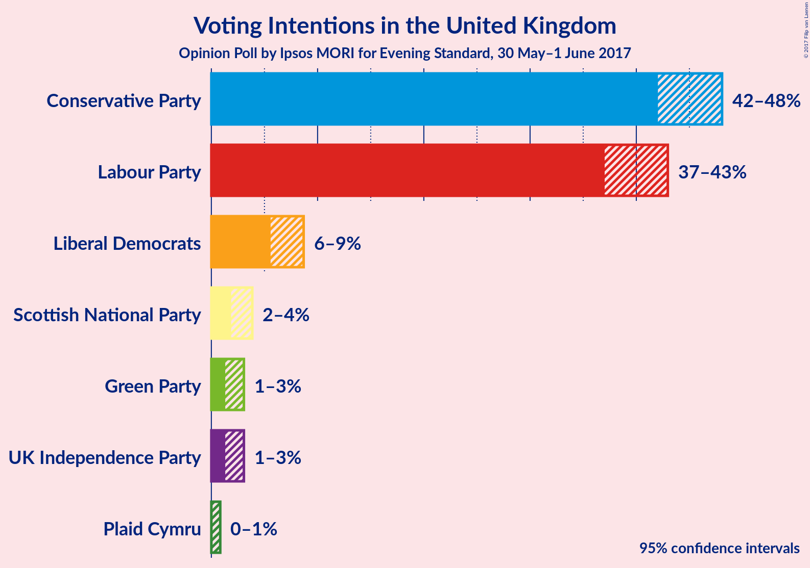
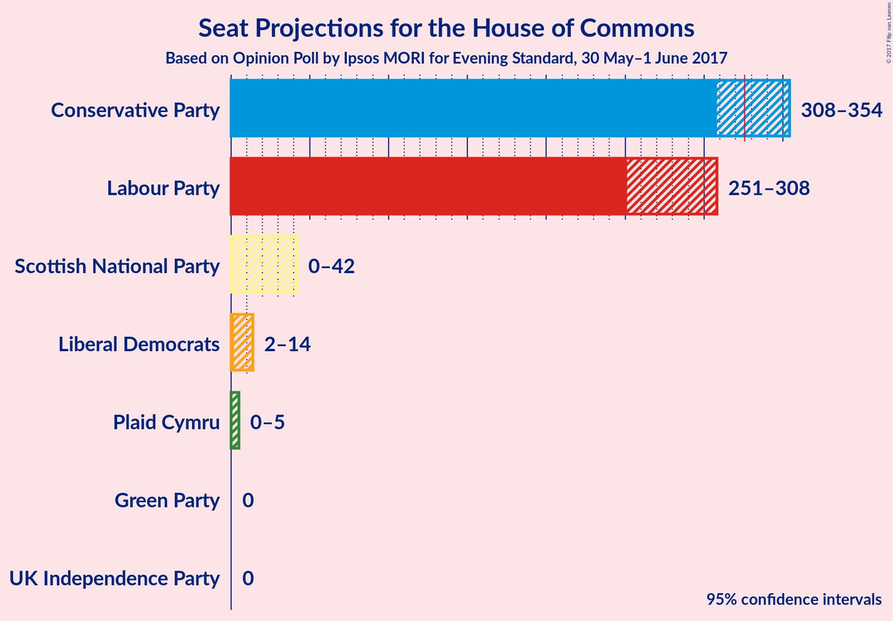
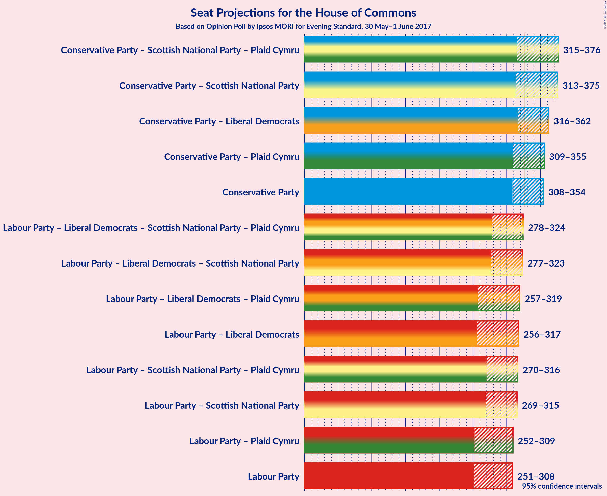

# Opinion Poll by Ipsos MORI for Evening Standard, 30 May–1 June 2017

<a href="#voting-intentions">Voting Intentions</a> | <a href="#seats">Seats</a> | <a href="#coalitions">Coalitions</a> | <a href="#technical-information">Technical Information</a>

## Voting Intentions

### Confidence Intervals

| Party | Last Result | Poll Result | 80% Confidence Interval | 90% Confidence Interval | 95% Confidence Interval | 99% Confidence Interval |
|:-----:|:-----------:|:-----------:|:-----------------------:|:-----------------------:|:-----------------------:|:-----------------------:|
| Conservative Party | 36.9% | 45.5% | 43.1–47.0% |42.5–47.6% |42.0–48.1% |41.1–49.0% |
| Labour Party | 30.4% | 40.4% | 38.0–41.9% |37.5–42.5% |37.0–43.0% |36.1–43.9% |
| Liberal Democrats | 7.9% | 7.1% | 6.1–8.1% |5.8–8.4% |5.6–8.7% |5.2–9.3% |
| Scottish National Party | 4.7% | 2.7% | 2.1–3.4% |2.0–3.7% |1.9–3.9% |1.6–4.3% |
| UK Independence Party | 12.6% | 2.0% | 1.6–2.7% |1.4–2.9% |1.3–3.1% |1.1–3.4% |
| Green Party | 3.8% | 2.0% | 1.6–2.7% |1.4–2.9% |1.3–3.1% |1.1–3.4% |
| Plaid Cymru | 0.6% | 0.3% | 0.2–0.6% |0.1–0.7% |0.1–0.8% |0.1–1.1% |

*Note:* The poll result column reflects the actual value used in the calculations. Published results may vary slightly, and in addition be rounded to fewer digits.

## Seats

### Confidence Intervals

| Party | Last Result | Median | 80% Confidence Interval | 90% Confidence Interval | 95% Confidence Interval | 99% Confidence Interval |
|:-----:|:-----------:|:------:|:-----------------------:|:-----------------------:|:-----------------------:|:-----------------------:|
| <a href="#conservative-party">Conservative Party</a> | 331 | 328 | 318–344 |314–349 |308–354 |296–358 |
| <a href="#labour-party">Labour Party</a> | 232 | 287 | 264–298 |257–302 |251–308 |237–320 |
| <a href="#liberal-democrats">Liberal Democrats</a> | 8 | 10 | 4–12 |3–13 |2–14 |1–16 |
| <a href="#scottish-national-party">Scottish National Party</a> | 56 | 5 | 1–26 |0–34 |0–42 |0–51 |
| <a href="#uk-independence-party">UK Independence Party</a> | 1 | 0 | 0 |0 |0 |0 |
| <a href="#green-party">Green Party</a> | 1 | 0 | 0 |0 |0 |0–1 |
| <a href="#plaid-cymru">Plaid Cymru</a> | 3 | 0 | 0–3 |0–4 |0–5 |0–5 |

### Conservative Party

| Number of Seats | Probability | Accumulated |
|:---------------:|:-----------:|:-----------:|
| 284 | 0% | 100% |
| 285 | 0% | 99.9% |
| 286 | 0% | 99.9% |
| 287 | 0% | 99.9% |
| 288 | 0% | 99.9% |
| 289 | 0% | 99.9% |
| 290 | 0% | 99.8% |
| 291 | 0% | 99.8% |
| 292 | 0% | 99.8% |
| 293 | 0% | 99.8% |
| 294 | 0.1% | 99.7% |
| 295 | 0.1% | 99.6% |
| 296 | 0.1% | 99.6% |
| 297 | 0% | 99.5% |
| 298 | 0% | 99.4% |
| 299 | 0.1% | 99.4% |
| 300 | 0.1% | 99.3% |
| 301 | 0.1% | 99.2% |
| 302 | 0.1% | 99.1% |
| 303 | 0.2% | 99.0% |
| 304 | 0.3% | 98.8% |
| 305 | 0.4% | 98.5% |
| 306 | 0.3% | 98% |
| 307 | 0.2% | 98% |
| 308 | 0.3% | 98% |
| 309 | 0.3% | 97% |
| 310 | 0.7% | 97% |
| 311 | 0.4% | 96% |
| 312 | 0.6% | 96% |
| 313 | 0.3% | 96% |
| 314 | 0.8% | 95% |
| 315 | 1.0% | 94% |
| 316 | 1.3% | 93% |
| 317 | 2% | 92% |
| 318 | 2% | 90% |
| 319 | 2% | 89% |
| 320 | 3% | 86% |
| 321 | 5% | 83% |
| 322 | 3% | 78% |
| 323 | 4% | 75% |
| 324 | 2% | 71% |
| 325 | 5% | 69% |
| 326 | 5% | 65% |
| 327 | 7% | 60% |
| 328 | 8% | 53% |
| 329 | 4% | 45% |
| 330 | 3% | 40% |
| 331 | 5% | 37% |
| 332 | 2% | 32% |
| 333 | 0.7% | 30% |
| 334 | 1.4% | 29% |
| 335 | 2% | 28% |
| 336 | 2% | 26% |
| 337 | 3% | 24% |
| 338 | 2% | 21% |
| 339 | 2% | 20% |
| 340 | 2% | 18% |
| 341 | 0.6% | 16% |
| 342 | 3% | 15% |
| 343 | 2% | 13% |
| 344 | 1.3% | 10% |
| 345 | 0.6% | 9% |
| 346 | 0.7% | 8% |
| 347 | 1.1% | 8% |
| 348 | 2% | 7% |
| 349 | 0.8% | 5% |
| 350 | 0.4% | 4% |
| 351 | 0.2% | 4% |
| 352 | 0.3% | 4% |
| 353 | 0.5% | 3% |
| 354 | 0.7% | 3% |
| 355 | 0.7% | 2% |
| 356 | 0.4% | 1.5% |
| 357 | 0.4% | 1.0% |
| 358 | 0.2% | 0.6% |
| 359 | 0.1% | 0.4% |
| 360 | 0.1% | 0.3% |
| 361 | 0.1% | 0.3% |
| 362 | 0.1% | 0.2% |
| 363 | 0% | 0.1% |
| 364 | 0% | 0.1% |
| 365 | 0% | 0.1% |
| 366 | 0% | 0% |

### Labour Party

| Number of Seats | Probability | Accumulated |
|:---------------:|:-----------:|:-----------:|
| 225 | 0% | 100% |
| 226 | 0% | 99.9% |
| 227 | 0% | 99.9% |
| 228 | 0% | 99.9% |
| 229 | 0% | 99.9% |
| 230 | 0% | 99.9% |
| 231 | 0% | 99.8% |
| 232 | 0% | 99.8% |
| 233 | 0% | 99.8% |
| 234 | 0% | 99.8% |
| 235 | 0.1% | 99.7% |
| 236 | 0.1% | 99.6% |
| 237 | 0.1% | 99.6% |
| 238 | 0.1% | 99.5% |
| 239 | 0.1% | 99.4% |
| 240 | 0.1% | 99.3% |
| 241 | 0.1% | 99.2% |
| 242 | 0.1% | 99.2% |
| 243 | 0.1% | 99.1% |
| 244 | 0.1% | 98.9% |
| 245 | 0.2% | 98.8% |
| 246 | 0.1% | 98.6% |
| 247 | 0.2% | 98% |
| 248 | 0.2% | 98% |
| 249 | 0.2% | 98% |
| 250 | 0.1% | 98% |
| 251 | 0.3% | 98% |
| 252 | 0.2% | 97% |
| 253 | 0.3% | 97% |
| 254 | 0.3% | 97% |
| 255 | 0.6% | 97% |
| 256 | 0.4% | 96% |
| 257 | 0.7% | 96% |
| 258 | 0.3% | 95% |
| 259 | 0.7% | 95% |
| 260 | 0.9% | 94% |
| 261 | 0.5% | 93% |
| 262 | 0.7% | 93% |
| 263 | 1.2% | 92% |
| 264 | 0.8% | 91% |
| 265 | 1.1% | 90% |
| 266 | 0.7% | 89% |
| 267 | 2% | 88% |
| 268 | 0.9% | 86% |
| 269 | 1.1% | 86% |
| 270 | 1.3% | 84% |
| 271 | 2% | 83% |
| 272 | 1.3% | 81% |
| 273 | 1.2% | 80% |
| 274 | 2% | 79% |
| 275 | 2% | 77% |
| 276 | 1.5% | 75% |
| 277 | 1.4% | 73% |
| 278 | 3% | 72% |
| 279 | 2% | 68% |
| 280 | 2% | 66% |
| 281 | 2% | 64% |
| 282 | 2% | 62% |
| 283 | 1.4% | 60% |
| 284 | 2% | 59% |
| 285 | 2% | 56% |
| 286 | 3% | 54% |
| 287 | 3% | 51% |
| 288 | 4% | 48% |
| 289 | 5% | 44% |
| 290 | 6% | 39% |
| 291 | 4% | 33% |
| 292 | 3% | 29% |
| 293 | 4% | 25% |
| 294 | 1.2% | 21% |
| 295 | 3% | 20% |
| 296 | 3% | 18% |
| 297 | 4% | 15% |
| 298 | 2% | 11% |
| 299 | 1.4% | 9% |
| 300 | 1.4% | 7% |
| 301 | 0.8% | 6% |
| 302 | 0.5% | 5% |
| 303 | 0.6% | 5% |
| 304 | 0.8% | 4% |
| 305 | 0.3% | 3% |
| 306 | 0.2% | 3% |
| 307 | 0.2% | 3% |
| 308 | 0.4% | 3% |
| 309 | 0.3% | 2% |
| 310 | 0.3% | 2% |
| 311 | 0.2% | 2% |
| 312 | 0.2% | 1.4% |
| 313 | 0.2% | 1.3% |
| 314 | 0.2% | 1.1% |
| 315 | 0.1% | 0.9% |
| 316 | 0.1% | 0.7% |
| 317 | 0% | 0.6% |
| 318 | 0% | 0.6% |
| 319 | 0% | 0.5% |
| 320 | 0.1% | 0.5% |
| 321 | 0.1% | 0.4% |
| 322 | 0.1% | 0.4% |
| 323 | 0.1% | 0.3% |
| 324 | 0.1% | 0.2% |
| 325 | 0% | 0.2% |
| 326 | 0% | 0.2% |
| 327 | 0% | 0.2% |
| 328 | 0% | 0.1% |
| 329 | 0% | 0.1% |
| 330 | 0% | 0.1% |
| 331 | 0% | 0.1% |
| 332 | 0% | 0% |

### Liberal Democrats

| Number of Seats | Probability | Accumulated |
|:---------------:|:-----------:|:-----------:|
| 0 | 0.1% | 100% |
| 1 | 0.8% | 99.9% |
| 2 | 3% | 99.1% |
| 3 | 4% | 96% |
| 4 | 6% | 92% |
| 5 | 6% | 86% |
| 6 | 3% | 81% |
| 7 | 5% | 77% |
| 8 | 9% | 72% |
| 9 | 11% | 62% |
| 10 | 9% | 51% |
| 11 | 23% | 42% |
| 12 | 13% | 20% |
| 13 | 3% | 7% |
| 14 | 1.4% | 4% |
| 15 | 2% | 2% |
| 16 | 0.7% | 0.8% |
| 17 | 0.1% | 0.1% |
| 18 | 0% | 0.1% |
| 19 | 0% | 0% |

### Scottish National Party

| Number of Seats | Probability | Accumulated |
|:---------------:|:-----------:|:-----------:|
| 0 | 8% | 100% |
| 1 | 14% | 92% |
| 2 | 12% | 78% |
| 3 | 9% | 66% |
| 4 | 6% | 57% |
| 5 | 6% | 52% |
| 6 | 4% | 45% |
| 7 | 4% | 42% |
| 8 | 4% | 37% |
| 9 | 3% | 33% |
| 10 | 2% | 30% |
| 11 | 2% | 28% |
| 12 | 1.4% | 26% |
| 13 | 1.4% | 24% |
| 14 | 2% | 23% |
| 15 | 0.9% | 21% |
| 16 | 1.3% | 20% |
| 17 | 1.5% | 19% |
| 18 | 1.2% | 17% |
| 19 | 1.1% | 16% |
| 20 | 1.0% | 15% |
| 21 | 1.3% | 14% |
| 22 | 0.9% | 13% |
| 23 | 0.5% | 12% |
| 24 | 0.6% | 12% |
| 25 | 0.8% | 11% |
| 26 | 0.6% | 10% |
| 27 | 0.5% | 10% |
| 28 | 0.7% | 9% |
| 29 | 0.4% | 8% |
| 30 | 0.7% | 8% |
| 31 | 0.6% | 7% |
| 32 | 0.8% | 7% |
| 33 | 0.8% | 6% |
| 34 | 0.2% | 5% |
| 35 | 0.3% | 5% |
| 36 | 0.3% | 5% |
| 37 | 0.3% | 4% |
| 38 | 0.3% | 4% |
| 39 | 0.4% | 4% |
| 40 | 0.4% | 3% |
| 41 | 0.2% | 3% |
| 42 | 0.2% | 3% |
| 43 | 0.2% | 2% |
| 44 | 0.1% | 2% |
| 45 | 0.3% | 2% |
| 46 | 0.2% | 2% |
| 47 | 0.2% | 2% |
| 48 | 0.2% | 1.4% |
| 49 | 0.3% | 1.2% |
| 50 | 0.3% | 0.8% |
| 51 | 0.3% | 0.5% |
| 52 | 0.1% | 0.3% |
| 53 | 0% | 0.1% |
| 54 | 0% | 0.1% |
| 55 | 0% | 0% |

### UK Independence Party

| Number of Seats | Probability | Accumulated |
|:---------------:|:-----------:|:-----------:|
| 0 | 100% | 100% |
| 1 | 0% | 0% |

### Green Party

| Number of Seats | Probability | Accumulated |
|:---------------:|:-----------:|:-----------:|
| 0 | 98% | 100% |
| 1 | 2% | 2% |
| 2 | 0% | 0% |

### Plaid Cymru

| Number of Seats | Probability | Accumulated |
|:---------------:|:-----------:|:-----------:|
| 0 | 60% | 100% |
| 1 | 15% | 40% |
| 2 | 6% | 25% |
| 3 | 11% | 19% |
| 4 | 5% | 8% |
| 5 | 4% | 4% |
| 6 | 0% | 0% |

## Coalitions

### Confidence Intervals

| Coalition | Last Result | Median | 80% Confidence Interval | 90% Confidence Interval | 95% Confidence Interval | 99% Confidence Interval |
|:---------:|:-----------:|:------:|:-----------------------:|:-----------------------:|:-----------------------:|:-----------------------:|
| Conservative Party – Scottish National Party – Plaid Cymru | 390 | 336 | 323–361 | 320–369 | 315–376 | 303–390 |
| Conservative Party – Scottish National Party | 387 | 335 | 322–360 | 318–368 | 313–375 | 302–389 |
| Conservative Party – Liberal Democrats | 339 | 338 | 325–353 | 321–358 | 316–362 | 305–368 |
| Conservative Party – Plaid Cymru | 334 | 329 | 319–345 | 314–350 | 309–355 | 297–360 |
| Conservative Party | 331 | 328 | 318–344 | 314–349 | 308–354 | 296–358 |
| Labour Party – Liberal Democrats – Scottish National Party – Plaid Cymru | 299 | 304 | 288–314 | 283–318 | 278–324 | 274–336 |
| Labour Party – Liberal Democrats – Scottish National Party | 296 | 303 | 287–313 | 282–318 | 277–323 | 272–335 |
| Labour Party – Liberal Democrats – Plaid Cymru | 243 | 297 | 272–310 | 264–314 | 257–319 | 243–330 |
| Labour Party – Liberal Democrats | 240 | 296 | 271–309 | 263–312 | 256–317 | 242–329 |
| Labour Party – Scottish National Party – Plaid Cymru | 291 | 294 | 279–307 | 274–311 | 270–316 | 264–327 |
| Labour Party – Scottish National Party | 288 | 293 | 278–305 | 272–310 | 269–315 | 263–326 |
| Labour Party – Plaid Cymru | 235 | 288 | 265–299 | 259–303 | 252–309 | 239–320 |
| Labour Party | 232 | 287 | 264–298 | 257–302 | 251–308 | 237–320 |

### Conservative Party – Scottish National Party – Plaid Cymru

| Number of Seats | Probability | Accumulated |
|:---------------:|:-----------:|:-----------:|
| 289 | 0% | 100% |
| 290 | 0% | 99.9% |
| 291 | 0% | 99.9% |
| 292 | 0% | 99.9% |
| 293 | 0% | 99.9% |
| 294 | 0% | 99.9% |
| 295 | 0% | 99.9% |
| 296 | 0% | 99.8% |
| 297 | 0.1% | 99.8% |
| 298 | 0% | 99.7% |
| 299 | 0% | 99.7% |
| 300 | 0% | 99.7% |
| 301 | 0.1% | 99.7% |
| 302 | 0.1% | 99.6% |
| 303 | 0.1% | 99.5% |
| 304 | 0.1% | 99.5% |
| 305 | 0.1% | 99.3% |
| 306 | 0.1% | 99.2% |
| 307 | 0% | 99.1% |
| 308 | 0.1% | 99.1% |
| 309 | 0.2% | 99.0% |
| 310 | 0.3% | 98.8% |
| 311 | 0.5% | 98.5% |
| 312 | 0.1% | 98% |
| 313 | 0.2% | 98% |
| 314 | 0.2% | 98% |
| 315 | 0.2% | 98% |
| 316 | 0.5% | 97% |
| 317 | 1.0% | 97% |
| 318 | 0.5% | 96% |
| 319 | 0.3% | 95% |
| 320 | 0.5% | 95% |
| 321 | 2% | 94% |
| 322 | 2% | 93% |
| 323 | 1.3% | 91% |
| 324 | 4% | 90% |
| 325 | 2% | 86% |
| 326 | 2% | 84% |
| 327 | 1.4% | 82% |
| 328 | 3% | 81% |
| 329 | 4% | 78% |
| 330 | 6% | 75% |
| 331 | 5% | 69% |
| 332 | 3% | 63% |
| 333 | 3% | 60% |
| 334 | 3% | 57% |
| 335 | 2% | 54% |
| 336 | 2% | 52% |
| 337 | 3% | 50% |
| 338 | 2% | 47% |
| 339 | 2% | 45% |
| 340 | 2% | 43% |
| 341 | 2% | 41% |
| 342 | 3% | 39% |
| 343 | 2% | 36% |
| 344 | 1.1% | 34% |
| 345 | 2% | 33% |
| 346 | 2% | 31% |
| 347 | 2% | 29% |
| 348 | 3% | 27% |
| 349 | 1.2% | 24% |
| 350 | 2% | 23% |
| 351 | 2% | 22% |
| 352 | 1.4% | 20% |
| 353 | 1.4% | 19% |
| 354 | 0.9% | 17% |
| 355 | 1.0% | 16% |
| 356 | 1.3% | 15% |
| 357 | 0.8% | 14% |
| 358 | 1.3% | 13% |
| 359 | 0.7% | 12% |
| 360 | 0.9% | 11% |
| 361 | 0.6% | 10% |
| 362 | 1.0% | 10% |
| 363 | 0.6% | 8% |
| 364 | 0.7% | 8% |
| 365 | 0.6% | 7% |
| 366 | 0.5% | 7% |
| 367 | 0.6% | 6% |
| 368 | 0.4% | 6% |
| 369 | 0.4% | 5% |
| 370 | 0.3% | 5% |
| 371 | 0.2% | 4% |
| 372 | 0.3% | 4% |
| 373 | 0.5% | 4% |
| 374 | 0.3% | 3% |
| 375 | 0.4% | 3% |
| 376 | 0.2% | 3% |
| 377 | 0.2% | 2% |
| 378 | 0.3% | 2% |
| 379 | 0.2% | 2% |
| 380 | 0.2% | 2% |
| 381 | 0.2% | 2% |
| 382 | 0.1% | 1.4% |
| 383 | 0.1% | 1.3% |
| 384 | 0.1% | 1.1% |
| 385 | 0.1% | 1.0% |
| 386 | 0.1% | 0.9% |
| 387 | 0.1% | 0.8% |
| 388 | 0.1% | 0.7% |
| 389 | 0.1% | 0.6% |
| 390 | 0.1% | 0.5% |
| 391 | 0.1% | 0.5% |
| 392 | 0.1% | 0.4% |
| 393 | 0.1% | 0.4% |
| 394 | 0% | 0.3% |
| 395 | 0.1% | 0.3% |
| 396 | 0% | 0.2% |
| 397 | 0% | 0.2% |
| 398 | 0% | 0.2% |
| 399 | 0% | 0.1% |
| 400 | 0% | 0.1% |
| 401 | 0% | 0.1% |
| 402 | 0% | 0.1% |
| 403 | 0% | 0.1% |
| 404 | 0% | 0% |

### Conservative Party – Scottish National Party

| Number of Seats | Probability | Accumulated |
|:---------------:|:-----------:|:-----------:|
| 289 | 0% | 100% |
| 290 | 0% | 99.9% |
| 291 | 0% | 99.9% |
| 292 | 0% | 99.9% |
| 293 | 0% | 99.9% |
| 294 | 0% | 99.9% |
| 295 | 0.1% | 99.9% |
| 296 | 0.1% | 99.8% |
| 297 | 0% | 99.7% |
| 298 | 0% | 99.7% |
| 299 | 0% | 99.7% |
| 300 | 0% | 99.7% |
| 301 | 0.1% | 99.6% |
| 302 | 0.1% | 99.6% |
| 303 | 0.1% | 99.5% |
| 304 | 0.2% | 99.4% |
| 305 | 0.1% | 99.2% |
| 306 | 0.1% | 99.1% |
| 307 | 0% | 99.0% |
| 308 | 0.1% | 99.0% |
| 309 | 0.3% | 98.9% |
| 310 | 0.5% | 98.7% |
| 311 | 0.5% | 98% |
| 312 | 0.1% | 98% |
| 313 | 0.1% | 98% |
| 314 | 0.1% | 97% |
| 315 | 0.2% | 97% |
| 316 | 0.7% | 97% |
| 317 | 0.9% | 96% |
| 318 | 0.7% | 96% |
| 319 | 0.5% | 95% |
| 320 | 0.6% | 94% |
| 321 | 2% | 94% |
| 322 | 2% | 92% |
| 323 | 2% | 90% |
| 324 | 4% | 88% |
| 325 | 2% | 84% |
| 326 | 2% | 82% |
| 327 | 2% | 80% |
| 328 | 3% | 78% |
| 329 | 4% | 75% |
| 330 | 6% | 71% |
| 331 | 5% | 65% |
| 332 | 2% | 59% |
| 333 | 4% | 57% |
| 334 | 3% | 54% |
| 335 | 1.3% | 50% |
| 336 | 2% | 49% |
| 337 | 3% | 47% |
| 338 | 2% | 45% |
| 339 | 2% | 43% |
| 340 | 2% | 41% |
| 341 | 2% | 39% |
| 342 | 3% | 37% |
| 343 | 2% | 35% |
| 344 | 2% | 32% |
| 345 | 2% | 31% |
| 346 | 2% | 29% |
| 347 | 1.4% | 26% |
| 348 | 2% | 25% |
| 349 | 1.3% | 23% |
| 350 | 2% | 22% |
| 351 | 1.4% | 20% |
| 352 | 1.3% | 18% |
| 353 | 1.0% | 17% |
| 354 | 1.0% | 16% |
| 355 | 1.1% | 15% |
| 356 | 1.4% | 14% |
| 357 | 0.7% | 13% |
| 358 | 1.3% | 12% |
| 359 | 0.6% | 11% |
| 360 | 0.7% | 10% |
| 361 | 0.7% | 9% |
| 362 | 0.9% | 9% |
| 363 | 0.5% | 8% |
| 364 | 0.5% | 7% |
| 365 | 0.5% | 7% |
| 366 | 0.4% | 6% |
| 367 | 0.6% | 6% |
| 368 | 0.4% | 5% |
| 369 | 0.3% | 5% |
| 370 | 0.4% | 4% |
| 371 | 0.2% | 4% |
| 372 | 0.3% | 4% |
| 373 | 0.5% | 4% |
| 374 | 0.2% | 3% |
| 375 | 0.4% | 3% |
| 376 | 0.2% | 2% |
| 377 | 0.2% | 2% |
| 378 | 0.3% | 2% |
| 379 | 0.2% | 2% |
| 380 | 0.2% | 2% |
| 381 | 0.1% | 1.4% |
| 382 | 0.2% | 1.3% |
| 383 | 0.1% | 1.1% |
| 384 | 0.1% | 1.0% |
| 385 | 0.1% | 0.9% |
| 386 | 0.1% | 0.8% |
| 387 | 0.1% | 0.7% |
| 388 | 0.1% | 0.6% |
| 389 | 0.1% | 0.5% |
| 390 | 0% | 0.4% |
| 391 | 0% | 0.4% |
| 392 | 0% | 0.4% |
| 393 | 0% | 0.3% |
| 394 | 0% | 0.3% |
| 395 | 0% | 0.2% |
| 396 | 0% | 0.2% |
| 397 | 0% | 0.2% |
| 398 | 0% | 0.1% |
| 399 | 0% | 0.1% |
| 400 | 0% | 0.1% |
| 401 | 0% | 0.1% |
| 402 | 0% | 0.1% |
| 403 | 0% | 0.1% |
| 404 | 0% | 0% |

### Conservative Party – Liberal Democrats

| Number of Seats | Probability | Accumulated |
|:---------------:|:-----------:|:-----------:|
| 292 | 0% | 100% |
| 293 | 0% | 99.9% |
| 294 | 0% | 99.9% |
| 295 | 0% | 99.9% |
| 296 | 0% | 99.9% |
| 297 | 0% | 99.9% |
| 298 | 0% | 99.9% |
| 299 | 0% | 99.8% |
| 300 | 0% | 99.8% |
| 301 | 0% | 99.8% |
| 302 | 0% | 99.7% |
| 303 | 0.1% | 99.7% |
| 304 | 0.1% | 99.6% |
| 305 | 0.1% | 99.5% |
| 306 | 0.1% | 99.5% |
| 307 | 0.1% | 99.4% |
| 308 | 0.1% | 99.3% |
| 309 | 0.1% | 99.2% |
| 310 | 0.1% | 99.1% |
| 311 | 0.2% | 99.0% |
| 312 | 0.2% | 98.7% |
| 313 | 0.2% | 98.6% |
| 314 | 0.4% | 98% |
| 315 | 0.2% | 98% |
| 316 | 0.4% | 98% |
| 317 | 0.3% | 97% |
| 318 | 0.7% | 97% |
| 319 | 0.6% | 96% |
| 320 | 0.5% | 96% |
| 321 | 0.7% | 95% |
| 322 | 0.9% | 95% |
| 323 | 0.8% | 94% |
| 324 | 1.3% | 93% |
| 325 | 2% | 92% |
| 326 | 1.2% | 90% |
| 327 | 3% | 89% |
| 328 | 2% | 86% |
| 329 | 2% | 83% |
| 330 | 3% | 81% |
| 331 | 3% | 78% |
| 332 | 4% | 75% |
| 333 | 5% | 71% |
| 334 | 5% | 66% |
| 335 | 2% | 61% |
| 336 | 4% | 59% |
| 337 | 4% | 56% |
| 338 | 5% | 52% |
| 339 | 6% | 47% |
| 340 | 6% | 41% |
| 341 | 3% | 35% |
| 342 | 4% | 33% |
| 343 | 2% | 28% |
| 344 | 0.9% | 26% |
| 345 | 2% | 26% |
| 346 | 2% | 24% |
| 347 | 2% | 21% |
| 348 | 1.3% | 19% |
| 349 | 0.9% | 18% |
| 350 | 3% | 17% |
| 351 | 3% | 15% |
| 352 | 1.0% | 12% |
| 353 | 0.9% | 11% |
| 354 | 1.1% | 10% |
| 355 | 1.3% | 9% |
| 356 | 0.7% | 7% |
| 357 | 1.2% | 7% |
| 358 | 0.8% | 6% |
| 359 | 0.5% | 5% |
| 360 | 0.6% | 4% |
| 361 | 0.6% | 4% |
| 362 | 0.6% | 3% |
| 363 | 0.4% | 2% |
| 364 | 0.5% | 2% |
| 365 | 0.2% | 2% |
| 366 | 0.3% | 1.3% |
| 367 | 0.3% | 0.9% |
| 368 | 0.3% | 0.7% |
| 369 | 0.2% | 0.4% |
| 370 | 0.1% | 0.3% |
| 371 | 0.1% | 0.2% |
| 372 | 0% | 0.1% |
| 373 | 0% | 0.1% |
| 374 | 0% | 0.1% |
| 375 | 0% | 0.1% |
| 376 | 0% | 0.1% |
| 377 | 0% | 0% |

### Conservative Party – Plaid Cymru

| Number of Seats | Probability | Accumulated |
|:---------------:|:-----------:|:-----------:|
| 285 | 0% | 100% |
| 286 | 0% | 99.9% |
| 287 | 0% | 99.9% |
| 288 | 0% | 99.9% |
| 289 | 0% | 99.9% |
| 290 | 0% | 99.9% |
| 291 | 0% | 99.8% |
| 292 | 0% | 99.8% |
| 293 | 0% | 99.8% |
| 294 | 0.1% | 99.8% |
| 295 | 0.1% | 99.7% |
| 296 | 0.1% | 99.6% |
| 297 | 0.1% | 99.5% |
| 298 | 0% | 99.5% |
| 299 | 0% | 99.4% |
| 300 | 0.1% | 99.4% |
| 301 | 0.1% | 99.3% |
| 302 | 0.1% | 99.2% |
| 303 | 0.1% | 99.1% |
| 304 | 0.2% | 98.9% |
| 305 | 0.3% | 98.7% |
| 306 | 0.3% | 98% |
| 307 | 0.2% | 98% |
| 308 | 0.2% | 98% |
| 309 | 0.3% | 98% |
| 310 | 0.5% | 97% |
| 311 | 0.5% | 97% |
| 312 | 0.4% | 96% |
| 313 | 0.4% | 96% |
| 314 | 0.7% | 96% |
| 315 | 0.6% | 95% |
| 316 | 1.3% | 94% |
| 317 | 1.5% | 93% |
| 318 | 1.2% | 92% |
| 319 | 2% | 90% |
| 320 | 3% | 89% |
| 321 | 5% | 86% |
| 322 | 3% | 81% |
| 323 | 5% | 79% |
| 324 | 2% | 74% |
| 325 | 3% | 71% |
| 326 | 3% | 68% |
| 327 | 5% | 65% |
| 328 | 8% | 59% |
| 329 | 6% | 51% |
| 330 | 4% | 45% |
| 331 | 5% | 41% |
| 332 | 3% | 36% |
| 333 | 3% | 33% |
| 334 | 1.3% | 31% |
| 335 | 2% | 29% |
| 336 | 2% | 28% |
| 337 | 2% | 26% |
| 338 | 1.4% | 24% |
| 339 | 2% | 22% |
| 340 | 2% | 20% |
| 341 | 1.0% | 17% |
| 342 | 2% | 16% |
| 343 | 2% | 14% |
| 344 | 1.4% | 12% |
| 345 | 1.3% | 11% |
| 346 | 1.0% | 10% |
| 347 | 1.0% | 9% |
| 348 | 1.3% | 8% |
| 349 | 1.4% | 7% |
| 350 | 0.6% | 5% |
| 351 | 0.4% | 5% |
| 352 | 0.3% | 4% |
| 353 | 0.5% | 4% |
| 354 | 0.6% | 3% |
| 355 | 0.7% | 3% |
| 356 | 0.4% | 2% |
| 357 | 0.6% | 2% |
| 358 | 0.4% | 1.1% |
| 359 | 0.2% | 0.7% |
| 360 | 0.1% | 0.5% |
| 361 | 0.1% | 0.4% |
| 362 | 0.1% | 0.3% |
| 363 | 0% | 0.2% |
| 364 | 0% | 0.1% |
| 365 | 0% | 0.1% |
| 366 | 0% | 0.1% |
| 367 | 0% | 0.1% |
| 368 | 0% | 0% |

### Conservative Party

| Number of Seats | Probability | Accumulated |
|:---------------:|:-----------:|:-----------:|
| 284 | 0% | 100% |
| 285 | 0% | 99.9% |
| 286 | 0% | 99.9% |
| 287 | 0% | 99.9% |
| 288 | 0% | 99.9% |
| 289 | 0% | 99.9% |
| 290 | 0% | 99.8% |
| 291 | 0% | 99.8% |
| 292 | 0% | 99.8% |
| 293 | 0% | 99.8% |
| 294 | 0.1% | 99.7% |
| 295 | 0.1% | 99.6% |
| 296 | 0.1% | 99.6% |
| 297 | 0% | 99.5% |
| 298 | 0% | 99.4% |
| 299 | 0.1% | 99.4% |
| 300 | 0.1% | 99.3% |
| 301 | 0.1% | 99.2% |
| 302 | 0.1% | 99.1% |
| 303 | 0.2% | 99.0% |
| 304 | 0.3% | 98.8% |
| 305 | 0.4% | 98.5% |
| 306 | 0.3% | 98% |
| 307 | 0.2% | 98% |
| 308 | 0.3% | 98% |
| 309 | 0.3% | 97% |
| 310 | 0.7% | 97% |
| 311 | 0.4% | 96% |
| 312 | 0.6% | 96% |
| 313 | 0.3% | 96% |
| 314 | 0.8% | 95% |
| 315 | 1.0% | 94% |
| 316 | 1.3% | 93% |
| 317 | 2% | 92% |
| 318 | 2% | 90% |
| 319 | 2% | 89% |
| 320 | 3% | 86% |
| 321 | 5% | 83% |
| 322 | 3% | 78% |
| 323 | 4% | 75% |
| 324 | 2% | 71% |
| 325 | 5% | 69% |
| 326 | 5% | 65% |
| 327 | 7% | 60% |
| 328 | 8% | 53% |
| 329 | 4% | 45% |
| 330 | 3% | 40% |
| 331 | 5% | 37% |
| 332 | 2% | 32% |
| 333 | 0.7% | 30% |
| 334 | 1.4% | 29% |
| 335 | 2% | 28% |
| 336 | 2% | 26% |
| 337 | 3% | 24% |
| 338 | 2% | 21% |
| 339 | 2% | 20% |
| 340 | 2% | 18% |
| 341 | 0.6% | 16% |
| 342 | 3% | 15% |
| 343 | 2% | 13% |
| 344 | 1.3% | 10% |
| 345 | 0.6% | 9% |
| 346 | 0.7% | 8% |
| 347 | 1.1% | 8% |
| 348 | 2% | 7% |
| 349 | 0.8% | 5% |
| 350 | 0.4% | 4% |
| 351 | 0.2% | 4% |
| 352 | 0.3% | 4% |
| 353 | 0.5% | 3% |
| 354 | 0.7% | 3% |
| 355 | 0.7% | 2% |
| 356 | 0.4% | 1.5% |
| 357 | 0.4% | 1.0% |
| 358 | 0.2% | 0.6% |
| 359 | 0.1% | 0.4% |
| 360 | 0.1% | 0.3% |
| 361 | 0.1% | 0.3% |
| 362 | 0.1% | 0.2% |
| 363 | 0% | 0.1% |
| 364 | 0% | 0.1% |
| 365 | 0% | 0.1% |
| 366 | 0% | 0% |

### Labour Party – Liberal Democrats – Scottish National Party – Plaid Cymru

| Number of Seats | Probability | Accumulated |
|:---------------:|:-----------:|:-----------:|
| 267 | 0% | 100% |
| 268 | 0% | 99.9% |
| 269 | 0% | 99.9% |
| 270 | 0% | 99.9% |
| 271 | 0.1% | 99.8% |
| 272 | 0.1% | 99.7% |
| 273 | 0.1% | 99.7% |
| 274 | 0.2% | 99.6% |
| 275 | 0.5% | 99.4% |
| 276 | 0.4% | 98.9% |
| 277 | 0.7% | 98.5% |
| 278 | 0.7% | 98% |
| 279 | 0.5% | 97% |
| 280 | 0.3% | 97% |
| 281 | 0.3% | 96% |
| 282 | 0.4% | 96% |
| 283 | 0.8% | 96% |
| 284 | 2% | 95% |
| 285 | 1.1% | 93% |
| 286 | 0.7% | 92% |
| 287 | 0.6% | 91% |
| 288 | 1.2% | 91% |
| 289 | 2% | 90% |
| 290 | 3% | 87% |
| 291 | 0.6% | 85% |
| 292 | 2% | 84% |
| 293 | 2% | 82% |
| 294 | 2% | 80% |
| 295 | 3% | 78% |
| 296 | 2% | 76% |
| 297 | 2% | 74% |
| 298 | 1.4% | 72% |
| 299 | 0.8% | 71% |
| 300 | 2% | 70% |
| 301 | 5% | 68% |
| 302 | 3% | 63% |
| 303 | 4% | 60% |
| 304 | 8% | 55% |
| 305 | 7% | 47% |
| 306 | 4% | 40% |
| 307 | 5% | 35% |
| 308 | 2% | 31% |
| 309 | 4% | 29% |
| 310 | 3% | 25% |
| 311 | 5% | 22% |
| 312 | 3% | 17% |
| 313 | 2% | 14% |
| 314 | 2% | 11% |
| 315 | 2% | 10% |
| 316 | 1.3% | 8% |
| 317 | 1.0% | 7% |
| 318 | 0.8% | 6% |
| 319 | 0.3% | 5% |
| 320 | 0.6% | 4% |
| 321 | 0.4% | 4% |
| 322 | 0.7% | 4% |
| 323 | 0.3% | 3% |
| 324 | 0.3% | 3% |
| 325 | 0.2% | 2% |
| 326 | 0.3% | 2% |
| 327 | 0.4% | 2% |
| 328 | 0.3% | 1.5% |
| 329 | 0.2% | 1.2% |
| 330 | 0.1% | 1.0% |
| 331 | 0.1% | 0.9% |
| 332 | 0.1% | 0.8% |
| 333 | 0.1% | 0.7% |
| 334 | 0% | 0.6% |
| 335 | 0% | 0.6% |
| 336 | 0.1% | 0.5% |
| 337 | 0.1% | 0.4% |
| 338 | 0.1% | 0.4% |
| 339 | 0% | 0.3% |
| 340 | 0% | 0.2% |
| 341 | 0% | 0.2% |
| 342 | 0% | 0.2% |
| 343 | 0% | 0.2% |
| 344 | 0% | 0.1% |
| 345 | 0% | 0.1% |
| 346 | 0% | 0.1% |
| 347 | 0% | 0.1% |
| 348 | 0% | 0.1% |
| 349 | 0% | 0% |

### Labour Party – Liberal Democrats – Scottish National Party

| Number of Seats | Probability | Accumulated |
|:---------------:|:-----------:|:-----------:|
| 265 | 0% | 100% |
| 266 | 0% | 99.9% |
| 267 | 0% | 99.9% |
| 268 | 0% | 99.9% |
| 269 | 0% | 99.9% |
| 270 | 0.1% | 99.8% |
| 271 | 0.1% | 99.7% |
| 272 | 0.1% | 99.6% |
| 273 | 0.2% | 99.5% |
| 274 | 0.4% | 99.3% |
| 275 | 0.6% | 98.9% |
| 276 | 0.4% | 98% |
| 277 | 0.7% | 98% |
| 278 | 0.6% | 97% |
| 279 | 0.5% | 97% |
| 280 | 0.3% | 96% |
| 281 | 0.4% | 96% |
| 282 | 0.6% | 95% |
| 283 | 1.4% | 95% |
| 284 | 1.3% | 93% |
| 285 | 1.0% | 92% |
| 286 | 1.0% | 91% |
| 287 | 1.3% | 90% |
| 288 | 1.4% | 89% |
| 289 | 2% | 87% |
| 290 | 2% | 86% |
| 291 | 1.0% | 84% |
| 292 | 2% | 83% |
| 293 | 2% | 80% |
| 294 | 1.4% | 78% |
| 295 | 2% | 76% |
| 296 | 2% | 74% |
| 297 | 2% | 72% |
| 298 | 1.2% | 70% |
| 299 | 3% | 69% |
| 300 | 3% | 67% |
| 301 | 5% | 64% |
| 302 | 4% | 59% |
| 303 | 6% | 55% |
| 304 | 8% | 49% |
| 305 | 5% | 41% |
| 306 | 3% | 35% |
| 307 | 3% | 32% |
| 308 | 2% | 29% |
| 309 | 5% | 26% |
| 310 | 3% | 21% |
| 311 | 5% | 19% |
| 312 | 3% | 14% |
| 313 | 2% | 11% |
| 314 | 1.3% | 10% |
| 315 | 1.5% | 8% |
| 316 | 1.3% | 7% |
| 317 | 0.6% | 6% |
| 318 | 0.7% | 5% |
| 319 | 0.4% | 4% |
| 320 | 0.4% | 4% |
| 321 | 0.5% | 4% |
| 322 | 0.5% | 3% |
| 323 | 0.3% | 3% |
| 324 | 0.2% | 2% |
| 325 | 0.2% | 2% |
| 326 | 0.3% | 2% |
| 327 | 0.3% | 2% |
| 328 | 0.2% | 1.3% |
| 329 | 0.1% | 1.1% |
| 330 | 0.1% | 0.9% |
| 331 | 0.1% | 0.8% |
| 332 | 0.1% | 0.7% |
| 333 | 0% | 0.6% |
| 334 | 0% | 0.6% |
| 335 | 0.1% | 0.5% |
| 336 | 0.1% | 0.5% |
| 337 | 0.1% | 0.4% |
| 338 | 0.1% | 0.3% |
| 339 | 0% | 0.2% |
| 340 | 0% | 0.2% |
| 341 | 0% | 0.2% |
| 342 | 0% | 0.2% |
| 343 | 0% | 0.1% |
| 344 | 0% | 0.1% |
| 345 | 0% | 0.1% |
| 346 | 0% | 0.1% |
| 347 | 0% | 0.1% |
| 348 | 0% | 0% |

### Labour Party – Liberal Democrats – Plaid Cymru

| Number of Seats | Probability | Accumulated |
|:---------------:|:-----------:|:-----------:|
| 229 | 0% | 100% |
| 230 | 0% | 99.9% |
| 231 | 0% | 99.9% |
| 232 | 0% | 99.9% |
| 233 | 0% | 99.9% |
| 234 | 0% | 99.9% |
| 235 | 0% | 99.9% |
| 236 | 0% | 99.8% |
| 237 | 0% | 99.8% |
| 238 | 0% | 99.8% |
| 239 | 0% | 99.7% |
| 240 | 0% | 99.7% |
| 241 | 0.1% | 99.6% |
| 242 | 0% | 99.6% |
| 243 | 0.1% | 99.6% |
| 244 | 0.1% | 99.5% |
| 245 | 0.1% | 99.4% |
| 246 | 0.1% | 99.3% |
| 247 | 0.1% | 99.2% |
| 248 | 0.1% | 99.1% |
| 249 | 0.1% | 99.0% |
| 250 | 0.2% | 98.9% |
| 251 | 0.1% | 98.7% |
| 252 | 0.2% | 98.6% |
| 253 | 0.2% | 98% |
| 254 | 0.3% | 98% |
| 255 | 0.2% | 98% |
| 256 | 0.2% | 98% |
| 257 | 0.4% | 98% |
| 258 | 0.2% | 97% |
| 259 | 0.5% | 97% |
| 260 | 0.3% | 96% |
| 261 | 0.2% | 96% |
| 262 | 0.3% | 96% |
| 263 | 0.3% | 96% |
| 264 | 0.4% | 95% |
| 265 | 0.6% | 95% |
| 266 | 0.4% | 94% |
| 267 | 0.6% | 94% |
| 268 | 0.5% | 93% |
| 269 | 0.5% | 93% |
| 270 | 0.9% | 92% |
| 271 | 0.7% | 91% |
| 272 | 0.7% | 91% |
| 273 | 0.6% | 90% |
| 274 | 1.3% | 89% |
| 275 | 0.7% | 88% |
| 276 | 1.4% | 87% |
| 277 | 1.1% | 86% |
| 278 | 0.9% | 85% |
| 279 | 1.0% | 84% |
| 280 | 1.3% | 83% |
| 281 | 1.4% | 82% |
| 282 | 2% | 80% |
| 283 | 1.3% | 78% |
| 284 | 2% | 77% |
| 285 | 1.4% | 75% |
| 286 | 2% | 74% |
| 287 | 2% | 71% |
| 288 | 2% | 69% |
| 289 | 2% | 68% |
| 290 | 3% | 65% |
| 291 | 2% | 63% |
| 292 | 2% | 61% |
| 293 | 2% | 59% |
| 294 | 2% | 57% |
| 295 | 3% | 55% |
| 296 | 2% | 53% |
| 297 | 1.4% | 51% |
| 298 | 3% | 50% |
| 299 | 4% | 46% |
| 300 | 2% | 43% |
| 301 | 5% | 40% |
| 302 | 6% | 35% |
| 303 | 4% | 29% |
| 304 | 3% | 25% |
| 305 | 2% | 22% |
| 306 | 2% | 20% |
| 307 | 2% | 18% |
| 308 | 4% | 16% |
| 309 | 2% | 12% |
| 310 | 2% | 10% |
| 311 | 2% | 8% |
| 312 | 0.6% | 6% |
| 313 | 0.5% | 6% |
| 314 | 0.7% | 5% |
| 315 | 0.9% | 4% |
| 316 | 0.7% | 4% |
| 317 | 0.2% | 3% |
| 318 | 0.1% | 3% |
| 319 | 0.1% | 3% |
| 320 | 0.1% | 2% |
| 321 | 0.5% | 2% |
| 322 | 0.5% | 2% |
| 323 | 0.3% | 1.3% |
| 324 | 0.1% | 1.1% |
| 325 | 0% | 1.0% |
| 326 | 0.1% | 1.0% |
| 327 | 0.1% | 0.9% |
| 328 | 0.2% | 0.8% |
| 329 | 0.1% | 0.6% |
| 330 | 0.1% | 0.5% |
| 331 | 0.1% | 0.4% |
| 332 | 0% | 0.4% |
| 333 | 0% | 0.3% |
| 334 | 0% | 0.3% |
| 335 | 0% | 0.3% |
| 336 | 0.1% | 0.3% |
| 337 | 0.1% | 0.2% |
| 338 | 0% | 0.1% |
| 339 | 0% | 0.1% |
| 340 | 0% | 0.1% |
| 341 | 0% | 0.1% |
| 342 | 0% | 0.1% |
| 343 | 0% | 0.1% |
| 344 | 0% | 0% |

### Labour Party – Liberal Democrats

| Number of Seats | Probability | Accumulated |
|:---------------:|:-----------:|:-----------:|
| 229 | 0% | 100% |
| 230 | 0% | 99.9% |
| 231 | 0% | 99.9% |
| 232 | 0% | 99.9% |
| 233 | 0% | 99.9% |
| 234 | 0% | 99.8% |
| 235 | 0% | 99.8% |
| 236 | 0% | 99.8% |
| 237 | 0.1% | 99.8% |
| 238 | 0% | 99.7% |
| 239 | 0.1% | 99.7% |
| 240 | 0.1% | 99.6% |
| 241 | 0.1% | 99.6% |
| 242 | 0.1% | 99.5% |
| 243 | 0.1% | 99.5% |
| 244 | 0.1% | 99.4% |
| 245 | 0.1% | 99.3% |
| 246 | 0.1% | 99.2% |
| 247 | 0.1% | 99.1% |
| 248 | 0.1% | 99.0% |
| 249 | 0.1% | 98.9% |
| 250 | 0.1% | 98.7% |
| 251 | 0.2% | 98.6% |
| 252 | 0.2% | 98% |
| 253 | 0.2% | 98% |
| 254 | 0.3% | 98% |
| 255 | 0.2% | 98% |
| 256 | 0.2% | 98% |
| 257 | 0.4% | 97% |
| 258 | 0.3% | 97% |
| 259 | 0.5% | 97% |
| 260 | 0.3% | 96% |
| 261 | 0.2% | 96% |
| 262 | 0.3% | 96% |
| 263 | 0.4% | 95% |
| 264 | 0.5% | 95% |
| 265 | 0.6% | 94% |
| 266 | 0.5% | 94% |
| 267 | 0.6% | 93% |
| 268 | 0.7% | 93% |
| 269 | 0.6% | 92% |
| 270 | 1.0% | 91% |
| 271 | 0.6% | 90% |
| 272 | 0.9% | 90% |
| 273 | 0.7% | 89% |
| 274 | 1.3% | 88% |
| 275 | 0.8% | 87% |
| 276 | 1.3% | 86% |
| 277 | 1.1% | 85% |
| 278 | 0.9% | 84% |
| 279 | 1.5% | 83% |
| 280 | 1.4% | 81% |
| 281 | 2% | 80% |
| 282 | 2% | 78% |
| 283 | 1.2% | 77% |
| 284 | 3% | 76% |
| 285 | 2% | 73% |
| 286 | 2% | 71% |
| 287 | 2% | 69% |
| 288 | 1.2% | 67% |
| 289 | 2% | 66% |
| 290 | 3% | 64% |
| 291 | 2% | 61% |
| 292 | 2% | 59% |
| 293 | 2% | 57% |
| 294 | 2% | 55% |
| 295 | 3% | 53% |
| 296 | 3% | 50% |
| 297 | 2% | 48% |
| 298 | 3% | 46% |
| 299 | 3% | 43% |
| 300 | 3% | 40% |
| 301 | 5% | 37% |
| 302 | 6% | 31% |
| 303 | 4% | 25% |
| 304 | 3% | 22% |
| 305 | 1.4% | 19% |
| 306 | 2% | 18% |
| 307 | 2% | 16% |
| 308 | 4% | 14% |
| 309 | 1.3% | 10% |
| 310 | 2% | 9% |
| 311 | 1.5% | 7% |
| 312 | 0.5% | 6% |
| 313 | 0.3% | 5% |
| 314 | 0.5% | 5% |
| 315 | 1.0% | 4% |
| 316 | 0.5% | 3% |
| 317 | 0.2% | 3% |
| 318 | 0.2% | 2% |
| 319 | 0.2% | 2% |
| 320 | 0.1% | 2% |
| 321 | 0.5% | 2% |
| 322 | 0.3% | 1.5% |
| 323 | 0.2% | 1.2% |
| 324 | 0.1% | 1.0% |
| 325 | 0% | 0.9% |
| 326 | 0.1% | 0.9% |
| 327 | 0.1% | 0.8% |
| 328 | 0.1% | 0.7% |
| 329 | 0.1% | 0.5% |
| 330 | 0.1% | 0.5% |
| 331 | 0.1% | 0.4% |
| 332 | 0% | 0.3% |
| 333 | 0% | 0.3% |
| 334 | 0% | 0.3% |
| 335 | 0.1% | 0.3% |
| 336 | 0% | 0.2% |
| 337 | 0% | 0.2% |
| 338 | 0% | 0.1% |
| 339 | 0% | 0.1% |
| 340 | 0% | 0.1% |
| 341 | 0% | 0.1% |
| 342 | 0% | 0.1% |
| 343 | 0% | 0.1% |
| 344 | 0% | 0% |

### Labour Party – Scottish National Party – Plaid Cymru

| Number of Seats | Probability | Accumulated |
|:---------------:|:-----------:|:-----------:|
| 256 | 0% | 100% |
| 257 | 0% | 99.9% |
| 258 | 0% | 99.9% |
| 259 | 0% | 99.9% |
| 260 | 0% | 99.9% |
| 261 | 0.1% | 99.9% |
| 262 | 0.1% | 99.8% |
| 263 | 0.2% | 99.7% |
| 264 | 0.3% | 99.6% |
| 265 | 0.2% | 99.3% |
| 266 | 0.3% | 99.0% |
| 267 | 0.2% | 98.7% |
| 268 | 0.5% | 98% |
| 269 | 0.4% | 98% |
| 270 | 0.6% | 98% |
| 271 | 0.6% | 97% |
| 272 | 0.6% | 96% |
| 273 | 0.6% | 96% |
| 274 | 0.7% | 95% |
| 275 | 1.2% | 94% |
| 276 | 0.8% | 93% |
| 277 | 1.2% | 93% |
| 278 | 1.1% | 91% |
| 279 | 0.9% | 90% |
| 280 | 1.0% | 89% |
| 281 | 3% | 88% |
| 282 | 3% | 85% |
| 283 | 0.9% | 83% |
| 284 | 1.3% | 82% |
| 285 | 2% | 81% |
| 286 | 2% | 79% |
| 287 | 2% | 76% |
| 288 | 1.0% | 74% |
| 289 | 2% | 73% |
| 290 | 4% | 72% |
| 291 | 3% | 67% |
| 292 | 6% | 65% |
| 293 | 6% | 59% |
| 294 | 5% | 53% |
| 295 | 4% | 48% |
| 296 | 3% | 44% |
| 297 | 2% | 41% |
| 298 | 5% | 39% |
| 299 | 5% | 34% |
| 300 | 4% | 29% |
| 301 | 3% | 25% |
| 302 | 3% | 22% |
| 303 | 2% | 19% |
| 304 | 2% | 17% |
| 305 | 3% | 14% |
| 306 | 1.2% | 11% |
| 307 | 2% | 10% |
| 308 | 1.3% | 8% |
| 309 | 0.8% | 7% |
| 310 | 0.9% | 6% |
| 311 | 0.7% | 5% |
| 312 | 0.5% | 5% |
| 313 | 0.6% | 4% |
| 314 | 0.7% | 4% |
| 315 | 0.3% | 3% |
| 316 | 0.4% | 3% |
| 317 | 0.2% | 2% |
| 318 | 0.4% | 2% |
| 319 | 0.2% | 2% |
| 320 | 0.2% | 1.4% |
| 321 | 0.2% | 1.3% |
| 322 | 0.1% | 1.0% |
| 323 | 0.1% | 0.9% |
| 324 | 0.1% | 0.8% |
| 325 | 0.1% | 0.7% |
| 326 | 0.1% | 0.6% |
| 327 | 0.1% | 0.5% |
| 328 | 0.1% | 0.5% |
| 329 | 0.1% | 0.4% |
| 330 | 0% | 0.3% |
| 331 | 0% | 0.3% |
| 332 | 0% | 0.2% |
| 333 | 0% | 0.2% |
| 334 | 0% | 0.2% |
| 335 | 0% | 0.1% |
| 336 | 0% | 0.1% |
| 337 | 0% | 0.1% |
| 338 | 0% | 0.1% |
| 339 | 0% | 0.1% |
| 340 | 0% | 0.1% |
| 341 | 0% | 0% |

### Labour Party – Scottish National Party

| Number of Seats | Probability | Accumulated |
|:---------------:|:-----------:|:-----------:|
| 255 | 0% | 100% |
| 256 | 0% | 99.9% |
| 257 | 0% | 99.9% |
| 258 | 0% | 99.9% |
| 259 | 0% | 99.9% |
| 260 | 0.1% | 99.8% |
| 261 | 0.1% | 99.8% |
| 262 | 0.2% | 99.7% |
| 263 | 0.3% | 99.5% |
| 264 | 0.4% | 99.3% |
| 265 | 0.2% | 98.9% |
| 266 | 0.4% | 98.7% |
| 267 | 0.3% | 98% |
| 268 | 0.5% | 98% |
| 269 | 0.4% | 98% |
| 270 | 0.8% | 97% |
| 271 | 0.7% | 96% |
| 272 | 0.8% | 96% |
| 273 | 0.4% | 95% |
| 274 | 1.2% | 95% |
| 275 | 1.2% | 93% |
| 276 | 0.8% | 92% |
| 277 | 1.2% | 91% |
| 278 | 1.2% | 90% |
| 279 | 1.2% | 89% |
| 280 | 1.2% | 88% |
| 281 | 3% | 87% |
| 282 | 2% | 83% |
| 283 | 1.1% | 82% |
| 284 | 2% | 81% |
| 285 | 2% | 79% |
| 286 | 3% | 77% |
| 287 | 1.4% | 74% |
| 288 | 2% | 73% |
| 289 | 2% | 70% |
| 290 | 4% | 68% |
| 291 | 3% | 64% |
| 292 | 7% | 62% |
| 293 | 6% | 54% |
| 294 | 5% | 49% |
| 295 | 3% | 43% |
| 296 | 3% | 40% |
| 297 | 2% | 38% |
| 298 | 6% | 36% |
| 299 | 5% | 30% |
| 300 | 3% | 25% |
| 301 | 3% | 21% |
| 302 | 2% | 18% |
| 303 | 2% | 16% |
| 304 | 1.4% | 14% |
| 305 | 3% | 13% |
| 306 | 1.1% | 10% |
| 307 | 2% | 9% |
| 308 | 0.9% | 7% |
| 309 | 0.8% | 6% |
| 310 | 0.9% | 6% |
| 311 | 0.3% | 5% |
| 312 | 0.5% | 4% |
| 313 | 0.6% | 4% |
| 314 | 0.6% | 3% |
| 315 | 0.3% | 3% |
| 316 | 0.4% | 2% |
| 317 | 0.3% | 2% |
| 318 | 0.3% | 2% |
| 319 | 0.1% | 1.4% |
| 320 | 0.2% | 1.3% |
| 321 | 0.2% | 1.1% |
| 322 | 0.1% | 0.9% |
| 323 | 0.1% | 0.8% |
| 324 | 0.1% | 0.7% |
| 325 | 0.1% | 0.6% |
| 326 | 0% | 0.5% |
| 327 | 0.1% | 0.5% |
| 328 | 0.1% | 0.4% |
| 329 | 0% | 0.3% |
| 330 | 0% | 0.3% |
| 331 | 0% | 0.2% |
| 332 | 0% | 0.2% |
| 333 | 0% | 0.2% |
| 334 | 0% | 0.1% |
| 335 | 0% | 0.1% |
| 336 | 0% | 0.1% |
| 337 | 0% | 0.1% |
| 338 | 0% | 0.1% |
| 339 | 0% | 0% |

### Labour Party – Plaid Cymru

| Number of Seats | Probability | Accumulated |
|:---------------:|:-----------:|:-----------:|
| 226 | 0% | 100% |
| 227 | 0% | 99.9% |
| 228 | 0% | 99.9% |
| 229 | 0% | 99.9% |
| 230 | 0% | 99.9% |
| 231 | 0% | 99.9% |
| 232 | 0% | 99.8% |
| 233 | 0% | 99.8% |
| 234 | 0% | 99.8% |
| 235 | 0.1% | 99.8% |
| 236 | 0.1% | 99.7% |
| 237 | 0.1% | 99.6% |
| 238 | 0% | 99.6% |
| 239 | 0.1% | 99.5% |
| 240 | 0.1% | 99.4% |
| 241 | 0.1% | 99.4% |
| 242 | 0.1% | 99.3% |
| 243 | 0.1% | 99.2% |
| 244 | 0.1% | 99.1% |
| 245 | 0.1% | 98.9% |
| 246 | 0.1% | 98.8% |
| 247 | 0.2% | 98.7% |
| 248 | 0.2% | 98% |
| 249 | 0.2% | 98% |
| 250 | 0.2% | 98% |
| 251 | 0.3% | 98% |
| 252 | 0.2% | 98% |
| 253 | 0.2% | 97% |
| 254 | 0.3% | 97% |
| 255 | 0.4% | 97% |
| 256 | 0.4% | 96% |
| 257 | 0.6% | 96% |
| 258 | 0.3% | 95% |
| 259 | 0.5% | 95% |
| 260 | 0.8% | 95% |
| 261 | 0.4% | 94% |
| 262 | 0.6% | 93% |
| 263 | 1.2% | 93% |
| 264 | 0.7% | 92% |
| 265 | 1.1% | 91% |
| 266 | 0.8% | 90% |
| 267 | 1.2% | 89% |
| 268 | 0.9% | 88% |
| 269 | 1.0% | 87% |
| 270 | 1.3% | 86% |
| 271 | 2% | 85% |
| 272 | 1.1% | 83% |
| 273 | 1.3% | 82% |
| 274 | 2% | 80% |
| 275 | 2% | 79% |
| 276 | 1.1% | 76% |
| 277 | 2% | 75% |
| 278 | 2% | 73% |
| 279 | 3% | 71% |
| 280 | 2% | 68% |
| 281 | 2% | 66% |
| 282 | 2% | 64% |
| 283 | 2% | 62% |
| 284 | 2% | 60% |
| 285 | 2% | 58% |
| 286 | 2% | 57% |
| 287 | 3% | 55% |
| 288 | 4% | 52% |
| 289 | 5% | 48% |
| 290 | 4% | 43% |
| 291 | 7% | 39% |
| 292 | 4% | 32% |
| 293 | 4% | 28% |
| 294 | 2% | 24% |
| 295 | 3% | 22% |
| 296 | 2% | 20% |
| 297 | 5% | 18% |
| 298 | 2% | 13% |
| 299 | 2% | 11% |
| 300 | 2% | 9% |
| 301 | 0.9% | 7% |
| 302 | 0.7% | 6% |
| 303 | 0.7% | 5% |
| 304 | 0.9% | 5% |
| 305 | 0.3% | 4% |
| 306 | 0.2% | 3% |
| 307 | 0.2% | 3% |
| 308 | 0.3% | 3% |
| 309 | 0.4% | 3% |
| 310 | 0.2% | 2% |
| 311 | 0.3% | 2% |
| 312 | 0.1% | 2% |
| 313 | 0.3% | 1.5% |
| 314 | 0.2% | 1.2% |
| 315 | 0.2% | 1.0% |
| 316 | 0.2% | 0.8% |
| 317 | 0% | 0.6% |
| 318 | 0% | 0.6% |
| 319 | 0% | 0.6% |
| 320 | 0% | 0.5% |
| 321 | 0.1% | 0.5% |
| 322 | 0.1% | 0.4% |
| 323 | 0.1% | 0.4% |
| 324 | 0.1% | 0.3% |
| 325 | 0% | 0.2% |
| 326 | 0% | 0.2% |
| 327 | 0% | 0.2% |
| 328 | 0% | 0.2% |
| 329 | 0.1% | 0.1% |
| 330 | 0% | 0.1% |
| 331 | 0% | 0.1% |
| 332 | 0% | 0.1% |
| 333 | 0% | 0% |

### Labour Party

| Number of Seats | Probability | Accumulated |
|:---------------:|:-----------:|:-----------:|
| 225 | 0% | 100% |
| 226 | 0% | 99.9% |
| 227 | 0% | 99.9% |
| 228 | 0% | 99.9% |
| 229 | 0% | 99.9% |
| 230 | 0% | 99.9% |
| 231 | 0% | 99.8% |
| 232 | 0% | 99.8% |
| 233 | 0% | 99.8% |
| 234 | 0% | 99.8% |
| 235 | 0.1% | 99.7% |
| 236 | 0.1% | 99.6% |
| 237 | 0.1% | 99.6% |
| 238 | 0.1% | 99.5% |
| 239 | 0.1% | 99.4% |
| 240 | 0.1% | 99.3% |
| 241 | 0.1% | 99.2% |
| 242 | 0.1% | 99.2% |
| 243 | 0.1% | 99.1% |
| 244 | 0.1% | 98.9% |
| 245 | 0.2% | 98.8% |
| 246 | 0.1% | 98.6% |
| 247 | 0.2% | 98% |
| 248 | 0.2% | 98% |
| 249 | 0.2% | 98% |
| 250 | 0.1% | 98% |
| 251 | 0.3% | 98% |
| 252 | 0.2% | 97% |
| 253 | 0.3% | 97% |
| 254 | 0.3% | 97% |
| 255 | 0.6% | 97% |
| 256 | 0.4% | 96% |
| 257 | 0.7% | 96% |
| 258 | 0.3% | 95% |
| 259 | 0.7% | 95% |
| 260 | 0.9% | 94% |
| 261 | 0.5% | 93% |
| 262 | 0.7% | 93% |
| 263 | 1.2% | 92% |
| 264 | 0.8% | 91% |
| 265 | 1.1% | 90% |
| 266 | 0.7% | 89% |
| 267 | 2% | 88% |
| 268 | 0.9% | 86% |
| 269 | 1.1% | 86% |
| 270 | 1.3% | 84% |
| 271 | 2% | 83% |
| 272 | 1.3% | 81% |
| 273 | 1.2% | 80% |
| 274 | 2% | 79% |
| 275 | 2% | 77% |
| 276 | 1.5% | 75% |
| 277 | 1.4% | 73% |
| 278 | 3% | 72% |
| 279 | 2% | 68% |
| 280 | 2% | 66% |
| 281 | 2% | 64% |
| 282 | 2% | 62% |
| 283 | 1.4% | 60% |
| 284 | 2% | 59% |
| 285 | 2% | 56% |
| 286 | 3% | 54% |
| 287 | 3% | 51% |
| 288 | 4% | 48% |
| 289 | 5% | 44% |
| 290 | 6% | 39% |
| 291 | 4% | 33% |
| 292 | 3% | 29% |
| 293 | 4% | 25% |
| 294 | 1.2% | 21% |
| 295 | 3% | 20% |
| 296 | 3% | 18% |
| 297 | 4% | 15% |
| 298 | 2% | 11% |
| 299 | 1.4% | 9% |
| 300 | 1.4% | 7% |
| 301 | 0.8% | 6% |
| 302 | 0.5% | 5% |
| 303 | 0.6% | 5% |
| 304 | 0.8% | 4% |
| 305 | 0.3% | 3% |
| 306 | 0.2% | 3% |
| 307 | 0.2% | 3% |
| 308 | 0.4% | 3% |
| 309 | 0.3% | 2% |
| 310 | 0.3% | 2% |
| 311 | 0.2% | 2% |
| 312 | 0.2% | 1.4% |
| 313 | 0.2% | 1.3% |
| 314 | 0.2% | 1.1% |
| 315 | 0.1% | 0.9% |
| 316 | 0.1% | 0.7% |
| 317 | 0% | 0.6% |
| 318 | 0% | 0.6% |
| 319 | 0% | 0.5% |
| 320 | 0.1% | 0.5% |
| 321 | 0.1% | 0.4% |
| 322 | 0.1% | 0.4% |
| 323 | 0.1% | 0.3% |
| 324 | 0.1% | 0.2% |
| 325 | 0% | 0.2% |
| 326 | 0% | 0.2% |
| 327 | 0% | 0.2% |
| 328 | 0% | 0.1% |
| 329 | 0% | 0.1% |
| 330 | 0% | 0.1% |
| 331 | 0% | 0.1% |
| 332 | 0% | 0% |

## Technical Information

### Opinion Poll

+ **Pollster:** Ipsos MORI
+ **Media:** Evening Standard
+ **Fieldwork period:** 30 May–1 June 2017

### Calculations

+ **Sample size:** 1035
+ **Simulations done:** 4,194,304
+ **Error estimate:** 0.78%

