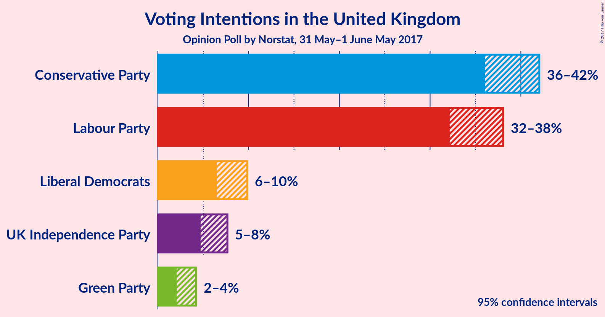
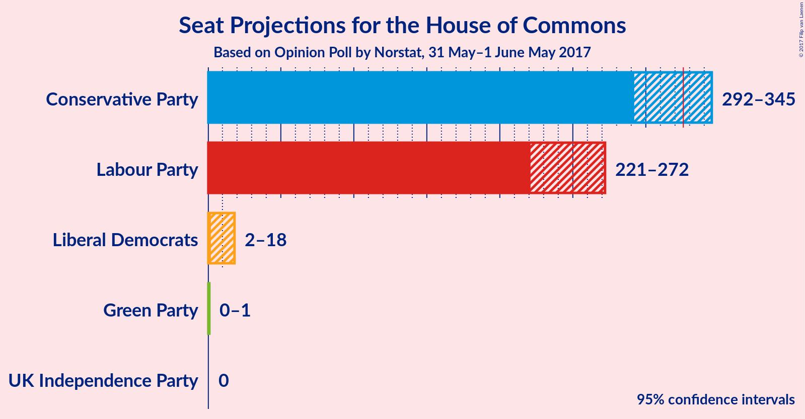

# Opinion Poll by Norstat, 31 May–1 June May 2017

<a href="#voting-intentions">Voting Intentions</a> | <a href="#seats">Seats</a> | <a href="#coalitions">Coalitions</a> | <a href="#technical-information">Technical Information</a>

## Voting Intentions

### Confidence Intervals

| Party | Last Result | Poll Result | 80% Confidence Interval | 90% Confidence Interval | 95% Confidence Interval | 99% Confidence Interval |
|:-----:|:-----------:|:-----------:|:-----------------------:|:-----------------------:|:-----------------------:|:-----------------------:|
| Conservative Party | 36.9% | 42.8% | 37.1–41.0% |36.5–41.5% |36.0–42.0% |35.1–43.0% |
| Labour Party | 30.4% | 38.5% | 33.2–37.0% |32.6–37.6% |32.2–38.0% |31.3–39.0% |
| Liberal Democrats | 7.9% | 8.8% | 7.0–9.2% |6.7–9.5% |6.5–9.8% |6.0–10.4% |
| UK Independence Party | 12.6% | 6.6% | 5.2–7.1% |4.9–7.4% |4.7–7.7% |4.3–8.2% |
| Green Party | 3.8% | 3.3% | 2.4–3.8% |2.2–4.0% |2.1–4.2% |1.8–4.6% |

*Note:* The poll result column reflects the actual value used in the calculations. Published results may vary slightly, and in addition be rounded to fewer digits.

## Seats

### Confidence Intervals

| Party | Last Result | Median | 80% Confidence Interval | 90% Confidence Interval | 95% Confidence Interval | 99% Confidence Interval |
|:-----:|:-----------:|:------:|:-----------------------:|:-----------------------:|:-----------------------:|:-----------------------:|
| <a href="#conservative-party">Conservative Party</a> | 331 | 318 | 304–335 |298–340 |292–345 |278–350 |
| <a href="#labour-party">Labour Party</a> | 232 | 248 | 231–261 |226–266 |221–272 |217–286 |
| <a href="#liberal-democrats">Liberal Democrats</a> | 8 | 7 | 3–14 |3–17 |2–18 |1–22 |
| <a href="#uk-independence-party">UK Independence Party</a> | 1 | 0 | 0 |0 |0 |0 |
| <a href="#green-party">Green Party</a> | 1 | 1 | 0–1 |0–1 |0–1 |0–1 |

### Conservative Party

| Number of Seats | Probability | Accumulated |
|:---------------:|:-----------:|:-----------:|
| 267 | 0% | 100% |
| 268 | 0% | 99.9% |
| 269 | 0% | 99.9% |
| 270 | 0% | 99.9% |
| 271 | 0% | 99.9% |
| 272 | 0% | 99.8% |
| 273 | 0% | 99.8% |
| 274 | 0.1% | 99.8% |
| 275 | 0% | 99.7% |
| 276 | 0.1% | 99.7% |
| 277 | 0.1% | 99.6% |
| 278 | 0.1% | 99.5% |
| 279 | 0.1% | 99.5% |
| 280 | 0.1% | 99.4% |
| 281 | 0.1% | 99.3% |
| 282 | 0.1% | 99.2% |
| 283 | 0.1% | 99.1% |
| 284 | 0.1% | 99.0% |
| 285 | 0.1% | 98.9% |
| 286 | 0.2% | 98.8% |
| 287 | 0.3% | 98.6% |
| 288 | 0.2% | 98% |
| 289 | 0.2% | 98% |
| 290 | 0.2% | 98% |
| 291 | 0.2% | 98% |
| 292 | 0.3% | 98% |
| 293 | 0.2% | 97% |
| 294 | 0.3% | 97% |
| 295 | 0.5% | 97% |
| 296 | 0.6% | 96% |
| 297 | 0.6% | 96% |
| 298 | 0.5% | 95% |
| 299 | 0.5% | 95% |
| 300 | 0.6% | 94% |
| 301 | 1.4% | 94% |
| 302 | 0.7% | 92% |
| 303 | 1.0% | 91% |
| 304 | 1.2% | 90% |
| 305 | 2% | 89% |
| 306 | 1.4% | 88% |
| 307 | 2% | 86% |
| 308 | 2% | 84% |
| 309 | 2% | 82% |
| 310 | 2% | 80% |
| 311 | 3% | 78% |
| 312 | 4% | 75% |
| 313 | 5% | 71% |
| 314 | 4% | 66% |
| 315 | 3% | 62% |
| 316 | 3% | 59% |
| 317 | 3% | 56% |
| 318 | 8% | 54% |
| 319 | 4% | 46% |
| 320 | 6% | 43% |
| 321 | 5% | 37% |
| 322 | 3% | 32% |
| 323 | 2% | 29% |
| 324 | 2% | 27% |
| 325 | 1.5% | 25% |
| 326 | 1.3% | 24% |
| 327 | 2% | 22% |
| 328 | 1.3% | 20% |
| 329 | 2% | 19% |
| 330 | 2% | 17% |
| 331 | 1.1% | 15% |
| 332 | 2% | 14% |
| 333 | 2% | 13% |
| 334 | 1.2% | 11% |
| 335 | 1.1% | 10% |
| 336 | 1.1% | 9% |
| 337 | 0.9% | 8% |
| 338 | 0.6% | 7% |
| 339 | 1.0% | 6% |
| 340 | 0.5% | 5% |
| 341 | 0.9% | 5% |
| 342 | 0.4% | 4% |
| 343 | 0.5% | 3% |
| 344 | 0.2% | 3% |
| 345 | 0.5% | 3% |
| 346 | 0.3% | 2% |
| 347 | 0.6% | 2% |
| 348 | 0.3% | 1.3% |
| 349 | 0.5% | 1.0% |
| 350 | 0.2% | 0.6% |
| 351 | 0.1% | 0.4% |
| 352 | 0.1% | 0.3% |
| 353 | 0% | 0.2% |
| 354 | 0.1% | 0.2% |
| 355 | 0% | 0.1% |
| 356 | 0% | 0.1% |
| 357 | 0% | 0.1% |
| 358 | 0% | 0% |

### Labour Party

| Number of Seats | Probability | Accumulated |
|:---------------:|:-----------:|:-----------:|
| 209 | 0% | 100% |
| 210 | 0% | 99.9% |
| 211 | 0% | 99.9% |
| 212 | 0% | 99.9% |
| 213 | 0.1% | 99.9% |
| 214 | 0.1% | 99.8% |
| 215 | 0.1% | 99.7% |
| 216 | 0.1% | 99.7% |
| 217 | 0.3% | 99.6% |
| 218 | 0.5% | 99.3% |
| 219 | 0.5% | 98.7% |
| 220 | 0.5% | 98% |
| 221 | 0.4% | 98% |
| 222 | 0.4% | 97% |
| 223 | 0.3% | 97% |
| 224 | 0.3% | 97% |
| 225 | 0.7% | 96% |
| 226 | 1.0% | 96% |
| 227 | 0.8% | 95% |
| 228 | 0.7% | 94% |
| 229 | 0.6% | 93% |
| 230 | 1.0% | 92% |
| 231 | 1.5% | 91% |
| 232 | 1.4% | 90% |
| 233 | 1.1% | 89% |
| 234 | 1.4% | 87% |
| 235 | 2% | 86% |
| 236 | 2% | 84% |
| 237 | 2% | 83% |
| 238 | 2% | 81% |
| 239 | 2% | 79% |
| 240 | 2% | 78% |
| 241 | 2% | 76% |
| 242 | 1.3% | 74% |
| 243 | 2% | 73% |
| 244 | 3% | 71% |
| 245 | 4% | 69% |
| 246 | 5% | 64% |
| 247 | 7% | 60% |
| 248 | 7% | 52% |
| 249 | 5% | 46% |
| 250 | 3% | 41% |
| 251 | 2% | 38% |
| 252 | 3% | 36% |
| 253 | 5% | 33% |
| 254 | 5% | 28% |
| 255 | 4% | 23% |
| 256 | 3% | 20% |
| 257 | 2% | 17% |
| 258 | 1.4% | 14% |
| 259 | 1.4% | 13% |
| 260 | 1.5% | 12% |
| 261 | 1.2% | 10% |
| 262 | 1.0% | 9% |
| 263 | 0.9% | 8% |
| 264 | 0.7% | 7% |
| 265 | 0.9% | 6% |
| 266 | 0.9% | 6% |
| 267 | 0.6% | 5% |
| 268 | 0.2% | 4% |
| 269 | 0.3% | 4% |
| 270 | 0.5% | 4% |
| 271 | 0.5% | 3% |
| 272 | 0.5% | 3% |
| 273 | 0.2% | 2% |
| 274 | 0.1% | 2% |
| 275 | 0.1% | 2% |
| 276 | 0.1% | 2% |
| 277 | 0.1% | 2% |
| 278 | 0.2% | 2% |
| 279 | 0.2% | 1.4% |
| 280 | 0.3% | 1.1% |
| 281 | 0.2% | 0.9% |
| 282 | 0% | 0.7% |
| 283 | 0% | 0.7% |
| 284 | 0% | 0.6% |
| 285 | 0.1% | 0.6% |
| 286 | 0.1% | 0.5% |
| 287 | 0.1% | 0.4% |
| 288 | 0% | 0.3% |
| 289 | 0% | 0.3% |
| 290 | 0% | 0.2% |
| 291 | 0% | 0.2% |
| 292 | 0.1% | 0.2% |
| 293 | 0% | 0.1% |
| 294 | 0% | 0.1% |
| 295 | 0% | 0% |

### Liberal Democrats

| Number of Seats | Probability | Accumulated |
|:---------------:|:-----------:|:-----------:|
| 0 | 0.1% | 100% |
| 1 | 0.6% | 99.9% |
| 2 | 4% | 99.4% |
| 3 | 10% | 95% |
| 4 | 5% | 85% |
| 5 | 8% | 80% |
| 6 | 8% | 72% |
| 7 | 17% | 65% |
| 8 | 19% | 48% |
| 9 | 5% | 29% |
| 10 | 4% | 24% |
| 11 | 3% | 21% |
| 12 | 2% | 18% |
| 13 | 4% | 15% |
| 14 | 2% | 11% |
| 15 | 3% | 9% |
| 16 | 1.4% | 6% |
| 17 | 2% | 5% |
| 18 | 1.1% | 3% |
| 19 | 0.8% | 2% |
| 20 | 0.2% | 1.1% |
| 21 | 0.4% | 0.9% |
| 22 | 0.1% | 0.5% |
| 23 | 0.1% | 0.4% |
| 24 | 0.1% | 0.3% |
| 25 | 0.1% | 0.2% |
| 26 | 0.1% | 0.1% |
| 27 | 0% | 0.1% |
| 28 | 0% | 0.1% |
| 29 | 0% | 0.1% |
| 30 | 0% | 0% |

### UK Independence Party

| Number of Seats | Probability | Accumulated |
|:---------------:|:-----------:|:-----------:|
| 0 | 100% | 100% |
| 1 | 0% | 0% |

### Green Party

| Number of Seats | Probability | Accumulated |
|:---------------:|:-----------:|:-----------:|
| 0 | 36% | 100% |
| 1 | 64% | 64% |
| 2 | 0% | 0% |

## Coalitions

### Confidence Intervals

| Coalition | Last Result | Median | 80% Confidence Interval | 90% Confidence Interval | 95% Confidence Interval | 99% Confidence Interval |
|:---------:|:-----------:|:------:|:-----------------------:|:-----------------------:|:-----------------------:|:-----------------------:|
| Conservative Party – Liberal Democrats | 339 | 325 | 313–342 | 307–347 | 302–352 | 287–357 |
| Conservative Party | 331 | 318 | 304–335 | 298–340 | 292–345 | 278–350 |
| Labour Party – Liberal Democrats | 240 | 255 | 239–270 | 233–276 | 228–282 | 223–295 |
| Labour Party | 232 | 248 | 231–261 | 226–266 | 221–272 | 217–286 |

### Conservative Party – Liberal Democrats

| Number of Seats | Probability | Accumulated |
|:---------------:|:-----------:|:-----------:|
| 279 | 0% | 100% |
| 280 | 0% | 99.9% |
| 281 | 0% | 99.9% |
| 282 | 0% | 99.8% |
| 283 | 0% | 99.8% |
| 284 | 0% | 99.8% |
| 285 | 0.1% | 99.7% |
| 286 | 0.1% | 99.7% |
| 287 | 0.1% | 99.6% |
| 288 | 0% | 99.5% |
| 289 | 0% | 99.4% |
| 290 | 0% | 99.4% |
| 291 | 0% | 99.4% |
| 292 | 0.1% | 99.3% |
| 293 | 0.3% | 99.2% |
| 294 | 0.2% | 98.9% |
| 295 | 0.2% | 98.7% |
| 296 | 0.2% | 98.5% |
| 297 | 0.1% | 98% |
| 298 | 0.1% | 98% |
| 299 | 0.1% | 98% |
| 300 | 0.1% | 98% |
| 301 | 0.3% | 98% |
| 302 | 0.5% | 98% |
| 303 | 0.4% | 97% |
| 304 | 0.3% | 97% |
| 305 | 0.3% | 96% |
| 306 | 0.4% | 96% |
| 307 | 0.8% | 96% |
| 308 | 1.0% | 95% |
| 309 | 0.5% | 94% |
| 310 | 0.8% | 93% |
| 311 | 1.0% | 93% |
| 312 | 1.2% | 92% |
| 313 | 1.1% | 90% |
| 314 | 2% | 89% |
| 315 | 2% | 88% |
| 316 | 2% | 86% |
| 317 | 2% | 85% |
| 318 | 4% | 82% |
| 319 | 4% | 78% |
| 320 | 4% | 74% |
| 321 | 3% | 69% |
| 322 | 2% | 66% |
| 323 | 4% | 64% |
| 324 | 3% | 59% |
| 325 | 6% | 56% |
| 326 | 6% | 50% |
| 327 | 5% | 44% |
| 328 | 4% | 38% |
| 329 | 4% | 35% |
| 330 | 2% | 30% |
| 331 | 2% | 28% |
| 332 | 2% | 27% |
| 333 | 2% | 25% |
| 334 | 2% | 23% |
| 335 | 2% | 21% |
| 336 | 1.3% | 20% |
| 337 | 2% | 18% |
| 338 | 2% | 17% |
| 339 | 1.2% | 15% |
| 340 | 1.2% | 13% |
| 341 | 2% | 12% |
| 342 | 1.4% | 11% |
| 343 | 1.0% | 9% |
| 344 | 0.9% | 8% |
| 345 | 0.7% | 7% |
| 346 | 0.8% | 7% |
| 347 | 1.0% | 6% |
| 348 | 0.5% | 5% |
| 349 | 0.5% | 4% |
| 350 | 0.4% | 4% |
| 351 | 0.5% | 3% |
| 352 | 0.3% | 3% |
| 353 | 0.5% | 2% |
| 354 | 0.4% | 2% |
| 355 | 0.6% | 2% |
| 356 | 0.3% | 0.9% |
| 357 | 0.2% | 0.7% |
| 358 | 0.1% | 0.5% |
| 359 | 0.1% | 0.3% |
| 360 | 0.1% | 0.2% |
| 361 | 0% | 0.2% |
| 362 | 0% | 0.1% |
| 363 | 0% | 0.1% |
| 364 | 0% | 0.1% |
| 365 | 0% | 0.1% |
| 366 | 0% | 0% |

### Conservative Party

| Number of Seats | Probability | Accumulated |
|:---------------:|:-----------:|:-----------:|
| 267 | 0% | 100% |
| 268 | 0% | 99.9% |
| 269 | 0% | 99.9% |
| 270 | 0% | 99.9% |
| 271 | 0% | 99.9% |
| 272 | 0% | 99.8% |
| 273 | 0% | 99.8% |
| 274 | 0.1% | 99.8% |
| 275 | 0% | 99.7% |
| 276 | 0.1% | 99.7% |
| 277 | 0.1% | 99.6% |
| 278 | 0.1% | 99.5% |
| 279 | 0.1% | 99.5% |
| 280 | 0.1% | 99.4% |
| 281 | 0.1% | 99.3% |
| 282 | 0.1% | 99.2% |
| 283 | 0.1% | 99.1% |
| 284 | 0.1% | 99.0% |
| 285 | 0.1% | 98.9% |
| 286 | 0.2% | 98.8% |
| 287 | 0.3% | 98.6% |
| 288 | 0.2% | 98% |
| 289 | 0.2% | 98% |
| 290 | 0.2% | 98% |
| 291 | 0.2% | 98% |
| 292 | 0.3% | 98% |
| 293 | 0.2% | 97% |
| 294 | 0.3% | 97% |
| 295 | 0.5% | 97% |
| 296 | 0.6% | 96% |
| 297 | 0.6% | 96% |
| 298 | 0.5% | 95% |
| 299 | 0.5% | 95% |
| 300 | 0.6% | 94% |
| 301 | 1.4% | 94% |
| 302 | 0.7% | 92% |
| 303 | 1.0% | 91% |
| 304 | 1.2% | 90% |
| 305 | 2% | 89% |
| 306 | 1.4% | 88% |
| 307 | 2% | 86% |
| 308 | 2% | 84% |
| 309 | 2% | 82% |
| 310 | 2% | 80% |
| 311 | 3% | 78% |
| 312 | 4% | 75% |
| 313 | 5% | 71% |
| 314 | 4% | 66% |
| 315 | 3% | 62% |
| 316 | 3% | 59% |
| 317 | 3% | 56% |
| 318 | 8% | 54% |
| 319 | 4% | 46% |
| 320 | 6% | 43% |
| 321 | 5% | 37% |
| 322 | 3% | 32% |
| 323 | 2% | 29% |
| 324 | 2% | 27% |
| 325 | 1.5% | 25% |
| 326 | 1.3% | 24% |
| 327 | 2% | 22% |
| 328 | 1.3% | 20% |
| 329 | 2% | 19% |
| 330 | 2% | 17% |
| 331 | 1.1% | 15% |
| 332 | 2% | 14% |
| 333 | 2% | 13% |
| 334 | 1.2% | 11% |
| 335 | 1.1% | 10% |
| 336 | 1.1% | 9% |
| 337 | 0.9% | 8% |
| 338 | 0.6% | 7% |
| 339 | 1.0% | 6% |
| 340 | 0.5% | 5% |
| 341 | 0.9% | 5% |
| 342 | 0.4% | 4% |
| 343 | 0.5% | 3% |
| 344 | 0.2% | 3% |
| 345 | 0.5% | 3% |
| 346 | 0.3% | 2% |
| 347 | 0.6% | 2% |
| 348 | 0.3% | 1.3% |
| 349 | 0.5% | 1.0% |
| 350 | 0.2% | 0.6% |
| 351 | 0.1% | 0.4% |
| 352 | 0.1% | 0.3% |
| 353 | 0% | 0.2% |
| 354 | 0.1% | 0.2% |
| 355 | 0% | 0.1% |
| 356 | 0% | 0.1% |
| 357 | 0% | 0.1% |
| 358 | 0% | 0% |

### Labour Party – Liberal Democrats

| Number of Seats | Probability | Accumulated |
|:---------------:|:-----------:|:-----------:|
| 216 | 0% | 100% |
| 217 | 0% | 99.9% |
| 218 | 0% | 99.9% |
| 219 | 0.1% | 99.9% |
| 220 | 0.1% | 99.8% |
| 221 | 0.1% | 99.8% |
| 222 | 0.2% | 99.7% |
| 223 | 0.2% | 99.6% |
| 224 | 0.4% | 99.4% |
| 225 | 0.3% | 99.0% |
| 226 | 0.5% | 98.7% |
| 227 | 0.4% | 98% |
| 228 | 0.4% | 98% |
| 229 | 0.3% | 97% |
| 230 | 0.5% | 97% |
| 231 | 0.5% | 97% |
| 232 | 0.7% | 96% |
| 233 | 0.6% | 95% |
| 234 | 0.9% | 95% |
| 235 | 0.7% | 94% |
| 236 | 1.0% | 93% |
| 237 | 0.9% | 92% |
| 238 | 1.0% | 91% |
| 239 | 1.3% | 90% |
| 240 | 1.5% | 89% |
| 241 | 1.4% | 88% |
| 242 | 1.2% | 86% |
| 243 | 2% | 85% |
| 244 | 2% | 83% |
| 245 | 1.4% | 82% |
| 246 | 2% | 80% |
| 247 | 2% | 78% |
| 248 | 2% | 77% |
| 249 | 2% | 75% |
| 250 | 2% | 73% |
| 251 | 3% | 71% |
| 252 | 5% | 68% |
| 253 | 4% | 64% |
| 254 | 4% | 59% |
| 255 | 6% | 56% |
| 256 | 4% | 49% |
| 257 | 3% | 45% |
| 258 | 3% | 42% |
| 259 | 3% | 39% |
| 260 | 5% | 37% |
| 261 | 4% | 32% |
| 262 | 4% | 28% |
| 263 | 3% | 24% |
| 264 | 2% | 22% |
| 265 | 2% | 19% |
| 266 | 2% | 17% |
| 267 | 2% | 15% |
| 268 | 2% | 14% |
| 269 | 2% | 12% |
| 270 | 1.1% | 10% |
| 271 | 0.9% | 9% |
| 272 | 1.1% | 9% |
| 273 | 0.9% | 7% |
| 274 | 0.7% | 6% |
| 275 | 0.6% | 6% |
| 276 | 0.4% | 5% |
| 277 | 0.6% | 5% |
| 278 | 0.6% | 4% |
| 279 | 0.4% | 4% |
| 280 | 0.3% | 3% |
| 281 | 0.3% | 3% |
| 282 | 0.3% | 3% |
| 283 | 0.2% | 2% |
| 284 | 0.2% | 2% |
| 285 | 0.2% | 2% |
| 286 | 0.2% | 2% |
| 287 | 0.2% | 2% |
| 288 | 0.1% | 1.3% |
| 289 | 0.1% | 1.2% |
| 290 | 0.1% | 1.1% |
| 291 | 0.1% | 1.0% |
| 292 | 0.1% | 0.9% |
| 293 | 0.1% | 0.8% |
| 294 | 0.1% | 0.7% |
| 295 | 0.1% | 0.6% |
| 296 | 0.1% | 0.5% |
| 297 | 0.1% | 0.4% |
| 298 | 0.1% | 0.4% |
| 299 | 0.1% | 0.3% |
| 300 | 0% | 0.3% |
| 301 | 0% | 0.2% |
| 302 | 0% | 0.2% |
| 303 | 0% | 0.2% |
| 304 | 0% | 0.1% |
| 305 | 0% | 0.1% |
| 306 | 0% | 0.1% |
| 307 | 0% | 0.1% |
| 308 | 0% | 0% |

### Labour Party

| Number of Seats | Probability | Accumulated |
|:---------------:|:-----------:|:-----------:|
| 209 | 0% | 100% |
| 210 | 0% | 99.9% |
| 211 | 0% | 99.9% |
| 212 | 0% | 99.9% |
| 213 | 0.1% | 99.9% |
| 214 | 0.1% | 99.8% |
| 215 | 0.1% | 99.7% |
| 216 | 0.1% | 99.7% |
| 217 | 0.3% | 99.6% |
| 218 | 0.5% | 99.3% |
| 219 | 0.5% | 98.7% |
| 220 | 0.5% | 98% |
| 221 | 0.4% | 98% |
| 222 | 0.4% | 97% |
| 223 | 0.3% | 97% |
| 224 | 0.3% | 97% |
| 225 | 0.7% | 96% |
| 226 | 1.0% | 96% |
| 227 | 0.8% | 95% |
| 228 | 0.7% | 94% |
| 229 | 0.6% | 93% |
| 230 | 1.0% | 92% |
| 231 | 1.5% | 91% |
| 232 | 1.4% | 90% |
| 233 | 1.1% | 89% |
| 234 | 1.4% | 87% |
| 235 | 2% | 86% |
| 236 | 2% | 84% |
| 237 | 2% | 83% |
| 238 | 2% | 81% |
| 239 | 2% | 79% |
| 240 | 2% | 78% |
| 241 | 2% | 76% |
| 242 | 1.3% | 74% |
| 243 | 2% | 73% |
| 244 | 3% | 71% |
| 245 | 4% | 69% |
| 246 | 5% | 64% |
| 247 | 7% | 60% |
| 248 | 7% | 52% |
| 249 | 5% | 46% |
| 250 | 3% | 41% |
| 251 | 2% | 38% |
| 252 | 3% | 36% |
| 253 | 5% | 33% |
| 254 | 5% | 28% |
| 255 | 4% | 23% |
| 256 | 3% | 20% |
| 257 | 2% | 17% |
| 258 | 1.4% | 14% |
| 259 | 1.4% | 13% |
| 260 | 1.5% | 12% |
| 261 | 1.2% | 10% |
| 262 | 1.0% | 9% |
| 263 | 0.9% | 8% |
| 264 | 0.7% | 7% |
| 265 | 0.9% | 6% |
| 266 | 0.9% | 6% |
| 267 | 0.6% | 5% |
| 268 | 0.2% | 4% |
| 269 | 0.3% | 4% |
| 270 | 0.5% | 4% |
| 271 | 0.5% | 3% |
| 272 | 0.5% | 3% |
| 273 | 0.2% | 2% |
| 274 | 0.1% | 2% |
| 275 | 0.1% | 2% |
| 276 | 0.1% | 2% |
| 277 | 0.1% | 2% |
| 278 | 0.2% | 2% |
| 279 | 0.2% | 1.4% |
| 280 | 0.3% | 1.1% |
| 281 | 0.2% | 0.9% |
| 282 | 0% | 0.7% |
| 283 | 0% | 0.7% |
| 284 | 0% | 0.6% |
| 285 | 0.1% | 0.6% |
| 286 | 0.1% | 0.5% |
| 287 | 0.1% | 0.4% |
| 288 | 0% | 0.3% |
| 289 | 0% | 0.3% |
| 290 | 0% | 0.2% |
| 291 | 0% | 0.2% |
| 292 | 0.1% | 0.2% |
| 293 | 0% | 0.1% |
| 294 | 0% | 0.1% |
| 295 | 0% | 0% |

## Technical Information

### Opinion Poll

+ **Pollster:** Norstat
+ **Media:** —
+ **Fieldwork period:** 31 May–1 June May 2017

### Calculations

+ **Sample size:** 922
+ **Simulations done:** 4,194,304
+ **Error estimate:** 0.18%

