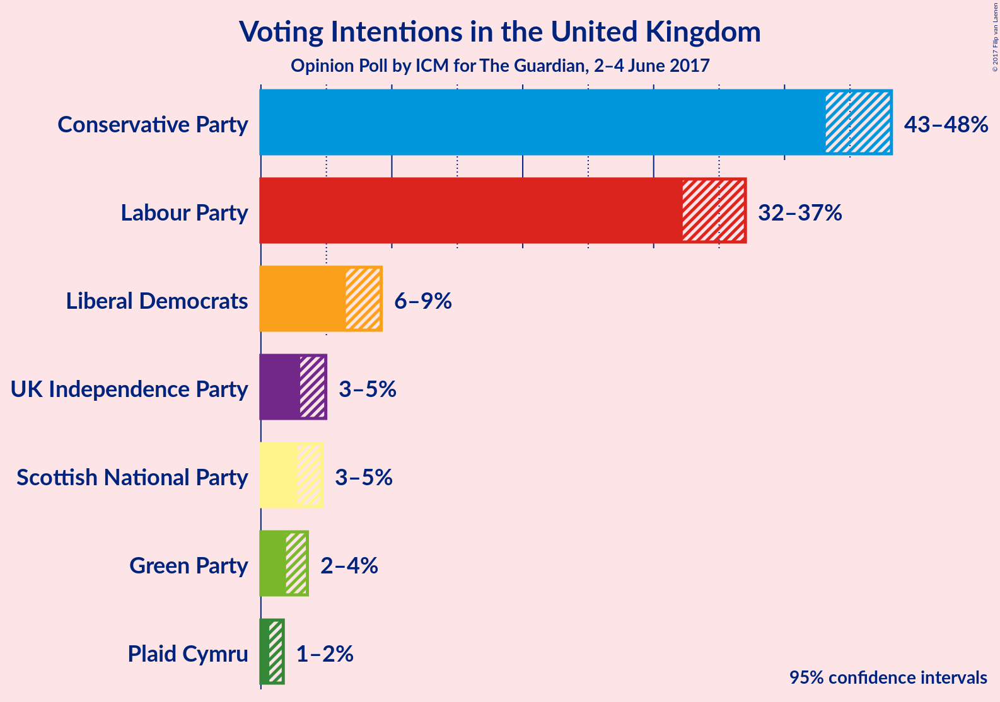
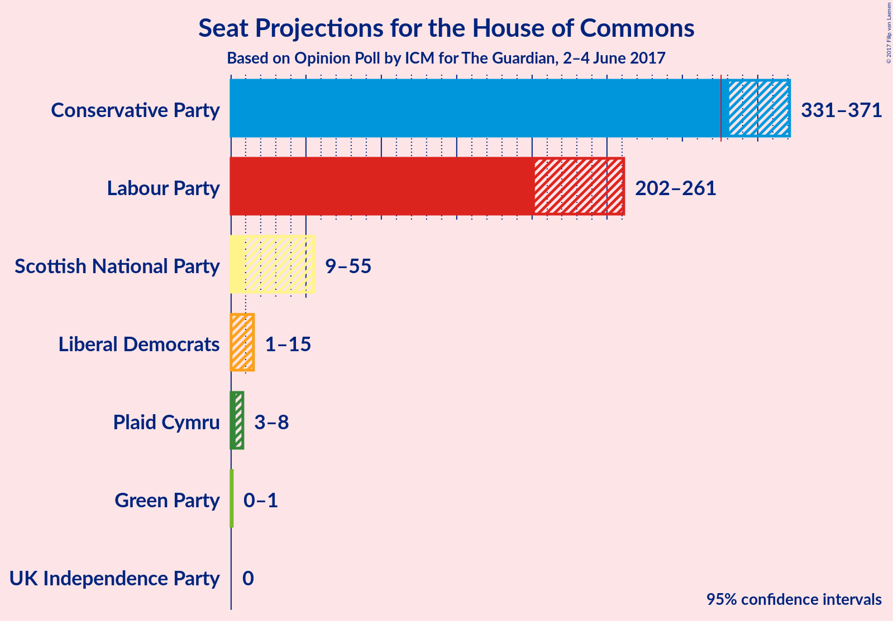
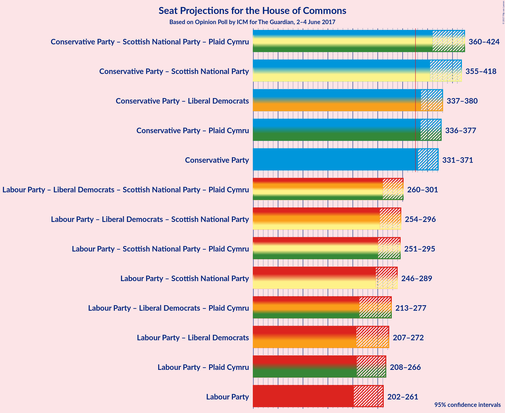

# Opinion Poll by ICM for The Guardian, 2–4 June 2017

<a href="#voting-intentions">Voting Intentions</a> | <a href="#seats">Seats</a> | <a href="#coalitions">Coalitions</a> | <a href="#technical-information">Technical Information</a>

## Voting Intentions

### Confidence Intervals

| Party | Last Result | Poll Result | 80% Confidence Interval | 90% Confidence Interval | 95% Confidence Interval | 99% Confidence Interval |
|:-----:|:-----------:|:-----------:|:-----------------------:|:-----------------------:|:-----------------------:|:-----------------------:|
| Conservative Party | 36.9% | 46.1% | 44.0–47.3% |43.5–47.8% |43.1–48.2% |42.4–48.9% |
| Labour Party | 30.4% | 34.9% | 33.0–36.2% |32.6–36.6% |32.2–37.0% |31.5–37.8% |
| Liberal Democrats | 7.9% | 7.8% | 6.9–8.7% |6.7–8.9% |6.5–9.2% |6.1–9.7% |
| UK Independence Party | 12.6% | 3.9% | 3.3–4.6% |3.1–4.8% |3.0–5.0% |2.8–5.3% |
| Scottish National Party | 4.7% | 3.6% | 3.0–4.3% |2.9–4.5% |2.8–4.7% |2.5–5.0% |
| Green Party | 3.8% | 2.6% | 2.2–3.2% |2.0–3.4% |1.9–3.6% |1.7–3.9% |
| Plaid Cymru | 0.6% | 1.1% | 0.8–1.5% |0.7–1.6% |0.6–1.7% |0.5–1.9% |

*Note:* The poll result column reflects the actual value used in the calculations. Published results may vary slightly, and in addition be rounded to fewer digits.

## Seats

### Confidence Intervals

| Party | Last Result | Median | 80% Confidence Interval | 90% Confidence Interval | 95% Confidence Interval | 99% Confidence Interval |
|:-----:|:-----------:|:------:|:-----------------------:|:-----------------------:|:-----------------------:|:-----------------------:|
| <a href="#conservative-party">Conservative Party</a> | 331 | 353 | 339–363 |336–369 |331–371 |323–378 |
| <a href="#labour-party">Labour Party</a> | 232 | 223 | 212–247 |206–254 |202–261 |195–273 |
| <a href="#liberal-democrats">Liberal Democrats</a> | 8 | 6 | 3–12 |2–13 |1–15 |1–16 |
| <a href="#uk-independence-party">UK Independence Party</a> | 1 | 0 | 0 |0 |0 |0 |
| <a href="#scottish-national-party">Scottish National Party</a> | 56 | 44 | 22–53 |14–55 |9–55 |3–56 |
| <a href="#green-party">Green Party</a> | 1 | 0 | 0–1 |0–1 |0–1 |0–1 |
| <a href="#plaid-cymru">Plaid Cymru</a> | 3 | 5 | 4–7 |3–7 |3–8 |3–10 |

### Conservative Party

| Number of Seats | Probability | Accumulated |
|:---------------:|:-----------:|:-----------:|
| 318 | 0% | 100% |
| 319 | 0% | 99.9% |
| 320 | 0.1% | 99.9% |
| 321 | 0.1% | 99.8% |
| 322 | 0.1% | 99.7% |
| 323 | 0.2% | 99.6% |
| 324 | 0.2% | 99.4% |
| 325 | 0.2% | 99.2% |
| 326 | 0.2% | 99.0% |
| 327 | 0.4% | 98.9% |
| 328 | 0.3% | 98% |
| 329 | 0.2% | 98% |
| 330 | 0.2% | 98% |
| 331 | 0.6% | 98% |
| 332 | 0.5% | 97% |
| 333 | 0.7% | 97% |
| 334 | 0.4% | 96% |
| 335 | 0.6% | 96% |
| 336 | 2% | 95% |
| 337 | 1.0% | 93% |
| 338 | 2% | 92% |
| 339 | 2% | 90% |
| 340 | 1.5% | 89% |
| 341 | 2% | 87% |
| 342 | 1.4% | 85% |
| 343 | 2% | 84% |
| 344 | 0.8% | 82% |
| 345 | 2% | 81% |
| 346 | 3% | 78% |
| 347 | 3% | 75% |
| 348 | 3% | 72% |
| 349 | 4% | 69% |
| 350 | 4% | 66% |
| 351 | 7% | 62% |
| 352 | 4% | 55% |
| 353 | 8% | 51% |
| 354 | 9% | 43% |
| 355 | 5% | 34% |
| 356 | 4% | 29% |
| 357 | 2% | 25% |
| 358 | 4% | 23% |
| 359 | 3% | 19% |
| 360 | 1.4% | 16% |
| 361 | 3% | 14% |
| 362 | 1.2% | 12% |
| 363 | 1.3% | 11% |
| 364 | 0.7% | 9% |
| 365 | 0.3% | 8% |
| 366 | 0.3% | 8% |
| 367 | 1.4% | 8% |
| 368 | 0.7% | 6% |
| 369 | 2% | 6% |
| 370 | 1.1% | 4% |
| 371 | 0.6% | 3% |
| 372 | 0.7% | 2% |
| 373 | 0.3% | 2% |
| 374 | 0.5% | 2% |
| 375 | 0.2% | 1.0% |
| 376 | 0.2% | 0.9% |
| 377 | 0.1% | 0.7% |
| 378 | 0.1% | 0.6% |
| 379 | 0% | 0.5% |
| 380 | 0.1% | 0.4% |
| 381 | 0% | 0.3% |
| 382 | 0.1% | 0.2% |
| 383 | 0% | 0.2% |
| 384 | 0.1% | 0.1% |
| 385 | 0% | 0.1% |
| 386 | 0% | 0.1% |
| 387 | 0% | 0% |

### Labour Party

| Number of Seats | Probability | Accumulated |
|:---------------:|:-----------:|:-----------:|
| 187 | 0% | 100% |
| 188 | 0% | 99.9% |
| 189 | 0% | 99.9% |
| 190 | 0% | 99.9% |
| 191 | 0.1% | 99.8% |
| 192 | 0% | 99.7% |
| 193 | 0.1% | 99.7% |
| 194 | 0.1% | 99.6% |
| 195 | 0.1% | 99.5% |
| 196 | 0.1% | 99.5% |
| 197 | 0.2% | 99.4% |
| 198 | 0.2% | 99.2% |
| 199 | 0.1% | 99.0% |
| 200 | 0.4% | 98.9% |
| 201 | 1.0% | 98.5% |
| 202 | 0.4% | 98% |
| 203 | 0.7% | 97% |
| 204 | 0.6% | 96% |
| 205 | 0.7% | 96% |
| 206 | 0.5% | 95% |
| 207 | 0.6% | 95% |
| 208 | 1.0% | 94% |
| 209 | 0.6% | 93% |
| 210 | 0.9% | 92% |
| 211 | 0.9% | 91% |
| 212 | 0.9% | 91% |
| 213 | 2% | 90% |
| 214 | 2% | 88% |
| 215 | 2% | 86% |
| 216 | 4% | 84% |
| 217 | 3% | 80% |
| 218 | 3% | 78% |
| 219 | 3% | 75% |
| 220 | 4% | 72% |
| 221 | 5% | 67% |
| 222 | 8% | 62% |
| 223 | 5% | 54% |
| 224 | 2% | 50% |
| 225 | 2% | 48% |
| 226 | 0.8% | 45% |
| 227 | 3% | 44% |
| 228 | 1.3% | 42% |
| 229 | 2% | 40% |
| 230 | 4% | 39% |
| 231 | 2% | 35% |
| 232 | 2% | 33% |
| 233 | 3% | 31% |
| 234 | 1.4% | 28% |
| 235 | 2% | 26% |
| 236 | 0.8% | 25% |
| 237 | 2% | 24% |
| 238 | 4% | 22% |
| 239 | 0.6% | 18% |
| 240 | 2% | 18% |
| 241 | 1.4% | 16% |
| 242 | 0.6% | 14% |
| 243 | 1.4% | 14% |
| 244 | 1.1% | 12% |
| 245 | 0.4% | 11% |
| 246 | 0.7% | 11% |
| 247 | 0.6% | 10% |
| 248 | 1.3% | 9% |
| 249 | 1.0% | 8% |
| 250 | 0.8% | 7% |
| 251 | 0.4% | 6% |
| 252 | 0.6% | 6% |
| 253 | 0.3% | 5% |
| 254 | 0.9% | 5% |
| 255 | 0.3% | 4% |
| 256 | 0.2% | 4% |
| 257 | 0.2% | 4% |
| 258 | 0.2% | 3% |
| 259 | 0.1% | 3% |
| 260 | 0.3% | 3% |
| 261 | 0.5% | 3% |
| 262 | 0.2% | 2% |
| 263 | 0.1% | 2% |
| 264 | 0.2% | 2% |
| 265 | 0.2% | 2% |
| 266 | 0.3% | 2% |
| 267 | 0.2% | 1.4% |
| 268 | 0.1% | 1.1% |
| 269 | 0.2% | 1.0% |
| 270 | 0.2% | 0.9% |
| 271 | 0% | 0.7% |
| 272 | 0.1% | 0.7% |
| 273 | 0.2% | 0.6% |
| 274 | 0% | 0.4% |
| 275 | 0.1% | 0.3% |
| 276 | 0% | 0.3% |
| 277 | 0% | 0.3% |
| 278 | 0% | 0.2% |
| 279 | 0% | 0.2% |
| 280 | 0% | 0.1% |
| 281 | 0% | 0.1% |
| 282 | 0% | 0.1% |
| 283 | 0% | 0% |

### Liberal Democrats

| Number of Seats | Probability | Accumulated |
|:---------------:|:-----------:|:-----------:|
| 0 | 0.3% | 100% |
| 1 | 2% | 99.7% |
| 2 | 5% | 97% |
| 3 | 9% | 92% |
| 4 | 13% | 83% |
| 5 | 12% | 70% |
| 6 | 9% | 58% |
| 7 | 4% | 49% |
| 8 | 3% | 45% |
| 9 | 9% | 42% |
| 10 | 12% | 33% |
| 11 | 7% | 21% |
| 12 | 6% | 14% |
| 13 | 4% | 8% |
| 14 | 1.1% | 4% |
| 15 | 2% | 3% |
| 16 | 1.1% | 1.5% |
| 17 | 0.2% | 0.4% |
| 18 | 0.1% | 0.2% |
| 19 | 0% | 0.1% |
| 20 | 0% | 0% |

### UK Independence Party

| Number of Seats | Probability | Accumulated |
|:---------------:|:-----------:|:-----------:|
| 0 | 100% | 100% |
| 1 | 0% | 0% |

### Scottish National Party

| Number of Seats | Probability | Accumulated |
|:---------------:|:-----------:|:-----------:|
| 2 | 0.1% | 100% |
| 3 | 0.4% | 99.9% |
| 4 | 0.4% | 99.5% |
| 5 | 0.5% | 99.1% |
| 6 | 0.3% | 98.6% |
| 7 | 0.3% | 98% |
| 8 | 0.3% | 98% |
| 9 | 0.6% | 98% |
| 10 | 0.7% | 97% |
| 11 | 0.1% | 96% |
| 12 | 0.4% | 96% |
| 13 | 0.8% | 96% |
| 14 | 0.4% | 95% |
| 15 | 0.2% | 95% |
| 16 | 0.4% | 95% |
| 17 | 1.1% | 94% |
| 18 | 0.4% | 93% |
| 19 | 1.4% | 93% |
| 20 | 0.7% | 91% |
| 21 | 0.2% | 91% |
| 22 | 0.5% | 90% |
| 23 | 0.4% | 90% |
| 24 | 2% | 90% |
| 25 | 2% | 88% |
| 26 | 0.7% | 86% |
| 27 | 2% | 85% |
| 28 | 0.9% | 83% |
| 29 | 0.7% | 82% |
| 30 | 2% | 82% |
| 31 | 2% | 80% |
| 32 | 2% | 78% |
| 33 | 0.6% | 76% |
| 34 | 0.8% | 75% |
| 35 | 2% | 74% |
| 36 | 2% | 73% |
| 37 | 0.6% | 71% |
| 38 | 4% | 70% |
| 39 | 0.3% | 66% |
| 40 | 3% | 66% |
| 41 | 4% | 63% |
| 42 | 3% | 59% |
| 43 | 2% | 55% |
| 44 | 6% | 53% |
| 45 | 7% | 47% |
| 46 | 3% | 40% |
| 47 | 7% | 37% |
| 48 | 3% | 30% |
| 49 | 5% | 27% |
| 50 | 3% | 22% |
| 51 | 2% | 19% |
| 52 | 3% | 16% |
| 53 | 5% | 14% |
| 54 | 4% | 9% |
| 55 | 4% | 5% |
| 56 | 0.9% | 0.9% |
| 57 | 0% | 0% |

### Green Party

| Number of Seats | Probability | Accumulated |
|:---------------:|:-----------:|:-----------:|
| 0 | 61% | 100% |
| 1 | 39% | 39% |
| 2 | 0% | 0% |

### Plaid Cymru

| Number of Seats | Probability | Accumulated |
|:---------------:|:-----------:|:-----------:|
| 2 | 0% | 100% |
| 3 | 7% | 99.9% |
| 4 | 3% | 93% |
| 5 | 63% | 89% |
| 6 | 7% | 26% |
| 7 | 14% | 19% |
| 8 | 4% | 5% |
| 9 | 0% | 0.6% |
| 10 | 0.2% | 0.6% |
| 11 | 0.4% | 0.4% |
| 12 | 0% | 0% |

## Coalitions

### Confidence Intervals

| Coalition | Last Result | Median | 80% Confidence Interval | 90% Confidence Interval | 95% Confidence Interval | 99% Confidence Interval |
|:---------:|:-----------:|:------:|:-----------------------:|:-----------------------:|:-----------------------:|:-----------------------:|
| Conservative Party – Scottish National Party – Plaid Cymru | 390 | 400 | 375–413 | 368–420 | 360–424 | 349–432 |
| Conservative Party – Scottish National Party | 387 | 395 | 370–408 | 362–414 | 355–418 | 344–425 |
| Conservative Party – Liberal Democrats | 339 | 359 | 345–372 | 341–377 | 337–380 | 328–388 |
| Conservative Party – Plaid Cymru | 334 | 358 | 344–369 | 341–374 | 336–377 | 328–385 |
| Conservative Party | 331 | 353 | 339–363 | 336–369 | 331–371 | 323–378 |
| Labour Party – Liberal Democrats – Scottish National Party – Plaid Cymru | 299 | 279 | 269–293 | 262–296 | 260–301 | 253–309 |
| Labour Party – Liberal Democrats – Scottish National Party | 296 | 274 | 263–288 | 257–291 | 254–296 | 247–304 |
| Labour Party – Scottish National Party – Plaid Cymru | 291 | 272 | 260–287 | 255–291 | 251–295 | 244–304 |
| Labour Party – Scottish National Party | 288 | 267 | 255–282 | 249–286 | 246–289 | 238–299 |
| Labour Party – Liberal Democrats – Plaid Cymru | 243 | 237 | 224–262 | 217–269 | 213–277 | 207–288 |
| Labour Party – Liberal Democrats | 240 | 232 | 218–257 | 212–264 | 207–272 | 200–283 |
| Labour Party – Plaid Cymru | 235 | 229 | 218–252 | 211–259 | 208–266 | 201–278 |
| Labour Party | 232 | 223 | 212–247 | 206–254 | 202–261 | 195–273 |

### Conservative Party – Scottish National Party – Plaid Cymru

| Number of Seats | Probability | Accumulated |
|:---------------:|:-----------:|:-----------:|
| 339 | 0% | 100% |
| 340 | 0.1% | 99.9% |
| 341 | 0% | 99.9% |
| 342 | 0% | 99.9% |
| 343 | 0.1% | 99.9% |
| 344 | 0.1% | 99.8% |
| 345 | 0% | 99.7% |
| 346 | 0% | 99.7% |
| 347 | 0% | 99.7% |
| 348 | 0.1% | 99.7% |
| 349 | 0.3% | 99.6% |
| 350 | 0.1% | 99.4% |
| 351 | 0.2% | 99.3% |
| 352 | 0.1% | 99.1% |
| 353 | 0.1% | 99.0% |
| 354 | 0.3% | 99.0% |
| 355 | 0.2% | 98.7% |
| 356 | 0.2% | 98% |
| 357 | 0.3% | 98% |
| 358 | 0.1% | 98% |
| 359 | 0.1% | 98% |
| 360 | 0.3% | 98% |
| 361 | 0.2% | 97% |
| 362 | 0.2% | 97% |
| 363 | 0.1% | 97% |
| 364 | 0.3% | 97% |
| 365 | 0.7% | 97% |
| 366 | 0.3% | 96% |
| 367 | 0.5% | 96% |
| 368 | 0.3% | 95% |
| 369 | 0.5% | 95% |
| 370 | 1.2% | 94% |
| 371 | 0.2% | 93% |
| 372 | 0.6% | 93% |
| 373 | 0.6% | 92% |
| 374 | 1.0% | 92% |
| 375 | 0.7% | 91% |
| 376 | 0.3% | 90% |
| 377 | 0.5% | 90% |
| 378 | 1.3% | 89% |
| 379 | 0.6% | 88% |
| 380 | 0.7% | 87% |
| 381 | 0.9% | 86% |
| 382 | 1.5% | 86% |
| 383 | 1.0% | 84% |
| 384 | 0.6% | 83% |
| 385 | 2% | 83% |
| 386 | 0.6% | 81% |
| 387 | 2% | 80% |
| 388 | 1.1% | 78% |
| 389 | 1.2% | 77% |
| 390 | 3% | 76% |
| 391 | 3% | 73% |
| 392 | 2% | 70% |
| 393 | 2% | 68% |
| 394 | 2% | 66% |
| 395 | 2% | 64% |
| 396 | 2% | 62% |
| 397 | 2% | 60% |
| 398 | 3% | 58% |
| 399 | 4% | 55% |
| 400 | 5% | 51% |
| 401 | 0.9% | 46% |
| 402 | 3% | 45% |
| 403 | 5% | 42% |
| 404 | 4% | 38% |
| 405 | 5% | 33% |
| 406 | 4% | 29% |
| 407 | 2% | 25% |
| 408 | 2% | 23% |
| 409 | 2% | 21% |
| 410 | 3% | 19% |
| 411 | 3% | 17% |
| 412 | 3% | 14% |
| 413 | 2% | 11% |
| 414 | 0.8% | 9% |
| 415 | 0.3% | 9% |
| 416 | 1.1% | 8% |
| 417 | 0.9% | 7% |
| 418 | 0.7% | 6% |
| 419 | 0.3% | 6% |
| 420 | 0.7% | 5% |
| 421 | 0.3% | 5% |
| 422 | 0.8% | 4% |
| 423 | 0.5% | 3% |
| 424 | 0.4% | 3% |
| 425 | 0.6% | 2% |
| 426 | 0.9% | 2% |
| 427 | 0.1% | 0.9% |
| 428 | 0.1% | 0.8% |
| 429 | 0.1% | 0.7% |
| 430 | 0.1% | 0.7% |
| 431 | 0.1% | 0.6% |
| 432 | 0.1% | 0.5% |
| 433 | 0.1% | 0.4% |
| 434 | 0.1% | 0.3% |
| 435 | 0.1% | 0.2% |
| 436 | 0% | 0.1% |
| 437 | 0% | 0.1% |
| 438 | 0% | 0.1% |
| 439 | 0% | 0% |

### Conservative Party – Scottish National Party

| Number of Seats | Probability | Accumulated |
|:---------------:|:-----------:|:-----------:|
| 333 | 0% | 100% |
| 334 | 0% | 99.9% |
| 335 | 0% | 99.9% |
| 336 | 0% | 99.9% |
| 337 | 0% | 99.9% |
| 338 | 0% | 99.9% |
| 339 | 0.1% | 99.9% |
| 340 | 0% | 99.7% |
| 341 | 0% | 99.7% |
| 342 | 0% | 99.7% |
| 343 | 0.1% | 99.7% |
| 344 | 0.2% | 99.6% |
| 345 | 0.1% | 99.4% |
| 346 | 0.1% | 99.3% |
| 347 | 0.3% | 99.2% |
| 348 | 0.1% | 99.0% |
| 349 | 0% | 98.9% |
| 350 | 0.4% | 98.8% |
| 351 | 0.3% | 98% |
| 352 | 0.3% | 98% |
| 353 | 0.1% | 98% |
| 354 | 0.1% | 98% |
| 355 | 0.5% | 98% |
| 356 | 0.1% | 97% |
| 357 | 0.3% | 97% |
| 358 | 0.2% | 97% |
| 359 | 0.2% | 97% |
| 360 | 0.7% | 96% |
| 361 | 0.1% | 96% |
| 362 | 0.7% | 96% |
| 363 | 0.4% | 95% |
| 364 | 0.4% | 94% |
| 365 | 1.1% | 94% |
| 366 | 0.4% | 93% |
| 367 | 0.7% | 93% |
| 368 | 0.6% | 92% |
| 369 | 0.9% | 91% |
| 370 | 0.5% | 90% |
| 371 | 0.4% | 90% |
| 372 | 0.5% | 89% |
| 373 | 2% | 89% |
| 374 | 0.5% | 87% |
| 375 | 0.4% | 87% |
| 376 | 0.7% | 86% |
| 377 | 2% | 86% |
| 378 | 1.0% | 84% |
| 379 | 0.5% | 83% |
| 380 | 2% | 82% |
| 381 | 0.8% | 81% |
| 382 | 1.3% | 80% |
| 383 | 0.8% | 78% |
| 384 | 2% | 78% |
| 385 | 3% | 75% |
| 386 | 3% | 73% |
| 387 | 1.0% | 70% |
| 388 | 3% | 69% |
| 389 | 3% | 66% |
| 390 | 1.1% | 63% |
| 391 | 2% | 62% |
| 392 | 2% | 60% |
| 393 | 3% | 57% |
| 394 | 4% | 54% |
| 395 | 4% | 50% |
| 396 | 1.3% | 46% |
| 397 | 4% | 44% |
| 398 | 4% | 41% |
| 399 | 6% | 36% |
| 400 | 4% | 30% |
| 401 | 2% | 26% |
| 402 | 1.1% | 24% |
| 403 | 3% | 23% |
| 404 | 3% | 20% |
| 405 | 3% | 17% |
| 406 | 2% | 15% |
| 407 | 2% | 13% |
| 408 | 1.5% | 10% |
| 409 | 0.8% | 9% |
| 410 | 0.5% | 8% |
| 411 | 1.3% | 8% |
| 412 | 0.5% | 6% |
| 413 | 0.6% | 6% |
| 414 | 0.3% | 5% |
| 415 | 0.6% | 5% |
| 416 | 0.5% | 4% |
| 417 | 0.9% | 4% |
| 418 | 0.5% | 3% |
| 419 | 0.4% | 2% |
| 420 | 0.2% | 2% |
| 421 | 0.9% | 2% |
| 422 | 0.1% | 0.8% |
| 423 | 0% | 0.7% |
| 424 | 0.1% | 0.7% |
| 425 | 0.1% | 0.6% |
| 426 | 0.1% | 0.4% |
| 427 | 0.1% | 0.3% |
| 428 | 0% | 0.3% |
| 429 | 0% | 0.2% |
| 430 | 0.1% | 0.2% |
| 431 | 0% | 0.1% |
| 432 | 0% | 0.1% |
| 433 | 0% | 0% |

### Conservative Party – Liberal Democrats

| Number of Seats | Probability | Accumulated |
|:---------------:|:-----------:|:-----------:|
| 324 | 0% | 100% |
| 325 | 0% | 99.9% |
| 326 | 0.1% | 99.9% |
| 327 | 0.2% | 99.7% |
| 328 | 0.1% | 99.6% |
| 329 | 0.1% | 99.5% |
| 330 | 0.1% | 99.4% |
| 331 | 0.2% | 99.3% |
| 332 | 0.2% | 99.2% |
| 333 | 0.2% | 99.0% |
| 334 | 0.3% | 98.7% |
| 335 | 0.3% | 98% |
| 336 | 0.4% | 98% |
| 337 | 0.4% | 98% |
| 338 | 0.4% | 97% |
| 339 | 0.7% | 97% |
| 340 | 1.0% | 96% |
| 341 | 1.1% | 95% |
| 342 | 0.8% | 94% |
| 343 | 2% | 94% |
| 344 | 0.8% | 92% |
| 345 | 2% | 91% |
| 346 | 1.4% | 89% |
| 347 | 0.9% | 87% |
| 348 | 2% | 86% |
| 349 | 1.4% | 84% |
| 350 | 3% | 83% |
| 351 | 1.3% | 80% |
| 352 | 3% | 79% |
| 353 | 4% | 76% |
| 354 | 2% | 72% |
| 355 | 3% | 70% |
| 356 | 4% | 67% |
| 357 | 4% | 62% |
| 358 | 5% | 58% |
| 359 | 5% | 53% |
| 360 | 2% | 49% |
| 361 | 7% | 47% |
| 362 | 5% | 40% |
| 363 | 2% | 35% |
| 364 | 8% | 33% |
| 365 | 2% | 25% |
| 366 | 4% | 24% |
| 367 | 2% | 20% |
| 368 | 3% | 18% |
| 369 | 1.4% | 15% |
| 370 | 2% | 14% |
| 371 | 2% | 12% |
| 372 | 1.4% | 10% |
| 373 | 1.2% | 9% |
| 374 | 1.0% | 8% |
| 375 | 1.2% | 7% |
| 376 | 0.4% | 6% |
| 377 | 0.5% | 5% |
| 378 | 1.0% | 5% |
| 379 | 0.3% | 4% |
| 380 | 1.3% | 3% |
| 381 | 0.2% | 2% |
| 382 | 0.2% | 2% |
| 383 | 0.4% | 2% |
| 384 | 0.3% | 1.3% |
| 385 | 0.3% | 1.1% |
| 386 | 0.2% | 0.8% |
| 387 | 0.1% | 0.6% |
| 388 | 0.1% | 0.5% |
| 389 | 0.1% | 0.4% |
| 390 | 0.1% | 0.3% |
| 391 | 0% | 0.2% |
| 392 | 0.1% | 0.2% |
| 393 | 0% | 0.1% |
| 394 | 0% | 0.1% |
| 395 | 0% | 0.1% |
| 396 | 0% | 0.1% |
| 397 | 0% | 0% |

### Conservative Party – Plaid Cymru

| Number of Seats | Probability | Accumulated |
|:---------------:|:-----------:|:-----------:|
| 323 | 0% | 100% |
| 324 | 0% | 99.9% |
| 325 | 0.1% | 99.9% |
| 326 | 0.1% | 99.8% |
| 327 | 0.1% | 99.8% |
| 328 | 0.2% | 99.7% |
| 329 | 0.3% | 99.4% |
| 330 | 0.2% | 99.2% |
| 331 | 0.2% | 99.0% |
| 332 | 0.3% | 98.8% |
| 333 | 0.2% | 98% |
| 334 | 0.3% | 98% |
| 335 | 0.2% | 98% |
| 336 | 0.6% | 98% |
| 337 | 0.4% | 97% |
| 338 | 0.5% | 97% |
| 339 | 0.6% | 96% |
| 340 | 0.6% | 96% |
| 341 | 2% | 95% |
| 342 | 0.9% | 93% |
| 343 | 2% | 92% |
| 344 | 2% | 91% |
| 345 | 1.3% | 89% |
| 346 | 2% | 87% |
| 347 | 1.4% | 85% |
| 348 | 1.1% | 84% |
| 349 | 1.2% | 83% |
| 350 | 2% | 82% |
| 351 | 4% | 80% |
| 352 | 3% | 76% |
| 353 | 3% | 73% |
| 354 | 5% | 70% |
| 355 | 4% | 65% |
| 356 | 5% | 61% |
| 357 | 4% | 56% |
| 358 | 7% | 52% |
| 359 | 10% | 45% |
| 360 | 4% | 36% |
| 361 | 5% | 31% |
| 362 | 3% | 27% |
| 363 | 4% | 24% |
| 364 | 2% | 20% |
| 365 | 2% | 18% |
| 366 | 3% | 16% |
| 367 | 1.3% | 13% |
| 368 | 2% | 12% |
| 369 | 0.9% | 10% |
| 370 | 0.7% | 9% |
| 371 | 0.7% | 9% |
| 372 | 1.2% | 8% |
| 373 | 0.5% | 7% |
| 374 | 2% | 6% |
| 375 | 1.1% | 5% |
| 376 | 0.6% | 4% |
| 377 | 0.7% | 3% |
| 378 | 0.4% | 2% |
| 379 | 0.3% | 2% |
| 380 | 0.4% | 1.5% |
| 381 | 0.2% | 1.1% |
| 382 | 0.2% | 0.9% |
| 383 | 0.1% | 0.7% |
| 384 | 0.1% | 0.6% |
| 385 | 0.2% | 0.5% |
| 386 | 0.1% | 0.4% |
| 387 | 0.1% | 0.3% |
| 388 | 0.1% | 0.2% |
| 389 | 0.1% | 0.2% |
| 390 | 0% | 0.1% |
| 391 | 0% | 0.1% |
| 392 | 0% | 0.1% |
| 393 | 0% | 0% |

### Conservative Party

| Number of Seats | Probability | Accumulated |
|:---------------:|:-----------:|:-----------:|
| 318 | 0% | 100% |
| 319 | 0% | 99.9% |
| 320 | 0.1% | 99.9% |
| 321 | 0.1% | 99.8% |
| 322 | 0.1% | 99.7% |
| 323 | 0.2% | 99.6% |
| 324 | 0.2% | 99.4% |
| 325 | 0.2% | 99.2% |
| 326 | 0.2% | 99.0% |
| 327 | 0.4% | 98.9% |
| 328 | 0.3% | 98% |
| 329 | 0.2% | 98% |
| 330 | 0.2% | 98% |
| 331 | 0.6% | 98% |
| 332 | 0.5% | 97% |
| 333 | 0.7% | 97% |
| 334 | 0.4% | 96% |
| 335 | 0.6% | 96% |
| 336 | 2% | 95% |
| 337 | 1.0% | 93% |
| 338 | 2% | 92% |
| 339 | 2% | 90% |
| 340 | 1.5% | 89% |
| 341 | 2% | 87% |
| 342 | 1.4% | 85% |
| 343 | 2% | 84% |
| 344 | 0.8% | 82% |
| 345 | 2% | 81% |
| 346 | 3% | 78% |
| 347 | 3% | 75% |
| 348 | 3% | 72% |
| 349 | 4% | 69% |
| 350 | 4% | 66% |
| 351 | 7% | 62% |
| 352 | 4% | 55% |
| 353 | 8% | 51% |
| 354 | 9% | 43% |
| 355 | 5% | 34% |
| 356 | 4% | 29% |
| 357 | 2% | 25% |
| 358 | 4% | 23% |
| 359 | 3% | 19% |
| 360 | 1.4% | 16% |
| 361 | 3% | 14% |
| 362 | 1.2% | 12% |
| 363 | 1.3% | 11% |
| 364 | 0.7% | 9% |
| 365 | 0.3% | 8% |
| 366 | 0.3% | 8% |
| 367 | 1.4% | 8% |
| 368 | 0.7% | 6% |
| 369 | 2% | 6% |
| 370 | 1.1% | 4% |
| 371 | 0.6% | 3% |
| 372 | 0.7% | 2% |
| 373 | 0.3% | 2% |
| 374 | 0.5% | 2% |
| 375 | 0.2% | 1.0% |
| 376 | 0.2% | 0.9% |
| 377 | 0.1% | 0.7% |
| 378 | 0.1% | 0.6% |
| 379 | 0% | 0.5% |
| 380 | 0.1% | 0.4% |
| 381 | 0% | 0.3% |
| 382 | 0.1% | 0.2% |
| 383 | 0% | 0.2% |
| 384 | 0.1% | 0.1% |
| 385 | 0% | 0.1% |
| 386 | 0% | 0.1% |
| 387 | 0% | 0% |

### Labour Party – Liberal Democrats – Scottish National Party – Plaid Cymru

| Number of Seats | Probability | Accumulated |
|:---------------:|:-----------:|:-----------:|
| 246 | 0% | 100% |
| 247 | 0% | 99.9% |
| 248 | 0.1% | 99.9% |
| 249 | 0% | 99.8% |
| 250 | 0.1% | 99.8% |
| 251 | 0.1% | 99.7% |
| 252 | 0.1% | 99.7% |
| 253 | 0% | 99.5% |
| 254 | 0.1% | 99.5% |
| 255 | 0.2% | 99.4% |
| 256 | 0.1% | 99.2% |
| 257 | 0.2% | 99.0% |
| 258 | 0.6% | 98.9% |
| 259 | 0.5% | 98% |
| 260 | 0.6% | 98% |
| 261 | 0.5% | 97% |
| 262 | 2% | 97% |
| 263 | 0.6% | 95% |
| 264 | 1.3% | 94% |
| 265 | 0.8% | 93% |
| 266 | 0.2% | 92% |
| 267 | 0.8% | 92% |
| 268 | 0.7% | 91% |
| 269 | 1.0% | 90% |
| 270 | 3% | 89% |
| 271 | 1.1% | 86% |
| 272 | 2% | 85% |
| 273 | 2% | 83% |
| 274 | 4% | 80% |
| 275 | 4% | 76% |
| 276 | 2% | 72% |
| 277 | 6% | 70% |
| 278 | 9% | 63% |
| 279 | 8% | 54% |
| 280 | 3% | 47% |
| 281 | 8% | 43% |
| 282 | 3% | 36% |
| 283 | 2% | 32% |
| 284 | 3% | 30% |
| 285 | 4% | 27% |
| 286 | 2% | 23% |
| 287 | 2% | 21% |
| 288 | 1.2% | 19% |
| 289 | 1.4% | 17% |
| 290 | 2% | 16% |
| 291 | 2% | 14% |
| 292 | 1.1% | 12% |
| 293 | 2% | 11% |
| 294 | 1.0% | 9% |
| 295 | 1.1% | 8% |
| 296 | 2% | 7% |
| 297 | 0.5% | 5% |
| 298 | 0.4% | 4% |
| 299 | 0.7% | 4% |
| 300 | 0.4% | 3% |
| 301 | 0.6% | 3% |
| 302 | 0.3% | 2% |
| 303 | 0.2% | 2% |
| 304 | 0.3% | 2% |
| 305 | 0.3% | 1.5% |
| 306 | 0.2% | 1.1% |
| 307 | 0.1% | 0.9% |
| 308 | 0.2% | 0.8% |
| 309 | 0.2% | 0.6% |
| 310 | 0.1% | 0.3% |
| 311 | 0.1% | 0.2% |
| 312 | 0% | 0.1% |
| 313 | 0% | 0.1% |
| 314 | 0% | 0.1% |
| 315 | 0% | 0% |

### Labour Party – Liberal Democrats – Scottish National Party

| Number of Seats | Probability | Accumulated |
|:---------------:|:-----------:|:-----------:|
| 240 | 0% | 100% |
| 241 | 0% | 99.9% |
| 242 | 0% | 99.9% |
| 243 | 0.1% | 99.9% |
| 244 | 0% | 99.8% |
| 245 | 0.1% | 99.7% |
| 246 | 0.1% | 99.7% |
| 247 | 0.2% | 99.6% |
| 248 | 0% | 99.4% |
| 249 | 0.2% | 99.4% |
| 250 | 0.2% | 99.2% |
| 251 | 0.2% | 99.0% |
| 252 | 0.4% | 98.8% |
| 253 | 0.5% | 98% |
| 254 | 0.6% | 98% |
| 255 | 0.6% | 97% |
| 256 | 0.4% | 97% |
| 257 | 2% | 96% |
| 258 | 0.6% | 94% |
| 259 | 1.0% | 94% |
| 260 | 0.9% | 93% |
| 261 | 0.5% | 92% |
| 262 | 1.1% | 91% |
| 263 | 0.5% | 90% |
| 264 | 2% | 90% |
| 265 | 3% | 88% |
| 266 | 1.0% | 84% |
| 267 | 2% | 83% |
| 268 | 2% | 81% |
| 269 | 5% | 80% |
| 270 | 5% | 75% |
| 271 | 2% | 70% |
| 272 | 6% | 68% |
| 273 | 10% | 62% |
| 274 | 6% | 52% |
| 275 | 3% | 46% |
| 276 | 6% | 43% |
| 277 | 4% | 37% |
| 278 | 4% | 33% |
| 279 | 3% | 29% |
| 280 | 4% | 26% |
| 281 | 3% | 22% |
| 282 | 2% | 19% |
| 283 | 0.7% | 18% |
| 284 | 1.2% | 17% |
| 285 | 2% | 16% |
| 286 | 2% | 14% |
| 287 | 1.3% | 12% |
| 288 | 2% | 11% |
| 289 | 1.1% | 9% |
| 290 | 1.1% | 7% |
| 291 | 2% | 6% |
| 292 | 0.6% | 5% |
| 293 | 0.4% | 4% |
| 294 | 0.5% | 4% |
| 295 | 0.4% | 3% |
| 296 | 0.6% | 3% |
| 297 | 0.2% | 2% |
| 298 | 0.3% | 2% |
| 299 | 0.3% | 2% |
| 300 | 0.3% | 1.4% |
| 301 | 0.2% | 1.1% |
| 302 | 0.2% | 0.9% |
| 303 | 0.2% | 0.8% |
| 304 | 0.2% | 0.5% |
| 305 | 0.1% | 0.3% |
| 306 | 0.1% | 0.2% |
| 307 | 0% | 0.1% |
| 308 | 0% | 0.1% |
| 309 | 0% | 0.1% |
| 310 | 0% | 0% |

### Labour Party – Scottish National Party – Plaid Cymru

| Number of Seats | Probability | Accumulated |
|:---------------:|:-----------:|:-----------:|
| 236 | 0% | 100% |
| 237 | 0% | 99.9% |
| 238 | 0% | 99.9% |
| 239 | 0% | 99.9% |
| 240 | 0.1% | 99.9% |
| 241 | 0% | 99.8% |
| 242 | 0.1% | 99.7% |
| 243 | 0.1% | 99.7% |
| 244 | 0.1% | 99.5% |
| 245 | 0.2% | 99.4% |
| 246 | 0.2% | 99.3% |
| 247 | 0.2% | 99.1% |
| 248 | 0.5% | 98.9% |
| 249 | 0.2% | 98% |
| 250 | 0.3% | 98% |
| 251 | 1.1% | 98% |
| 252 | 0.3% | 97% |
| 253 | 1.0% | 97% |
| 254 | 0.5% | 96% |
| 255 | 0.5% | 95% |
| 256 | 0.3% | 95% |
| 257 | 1.4% | 94% |
| 258 | 1.1% | 93% |
| 259 | 1.3% | 92% |
| 260 | 2% | 91% |
| 261 | 1.0% | 88% |
| 262 | 1.4% | 87% |
| 263 | 2% | 86% |
| 264 | 2% | 84% |
| 265 | 5% | 82% |
| 266 | 1.3% | 77% |
| 267 | 2% | 76% |
| 268 | 7% | 73% |
| 269 | 4% | 66% |
| 270 | 4% | 62% |
| 271 | 6% | 58% |
| 272 | 4% | 52% |
| 273 | 3% | 49% |
| 274 | 4% | 46% |
| 275 | 6% | 42% |
| 276 | 4% | 36% |
| 277 | 2% | 31% |
| 278 | 3% | 29% |
| 279 | 4% | 27% |
| 280 | 2% | 23% |
| 281 | 2% | 21% |
| 282 | 2% | 19% |
| 283 | 1.2% | 17% |
| 284 | 2% | 15% |
| 285 | 1.3% | 13% |
| 286 | 1.1% | 12% |
| 287 | 2% | 11% |
| 288 | 2% | 9% |
| 289 | 0.8% | 7% |
| 290 | 0.6% | 6% |
| 291 | 1.1% | 6% |
| 292 | 1.0% | 4% |
| 293 | 0.7% | 3% |
| 294 | 0.3% | 3% |
| 295 | 0.4% | 3% |
| 296 | 0.4% | 2% |
| 297 | 0.2% | 2% |
| 298 | 0.3% | 1.5% |
| 299 | 0.2% | 1.2% |
| 300 | 0.2% | 1.0% |
| 301 | 0.1% | 0.8% |
| 302 | 0.1% | 0.6% |
| 303 | 0.1% | 0.6% |
| 304 | 0.1% | 0.5% |
| 305 | 0.1% | 0.4% |
| 306 | 0.1% | 0.3% |
| 307 | 0.1% | 0.1% |
| 308 | 0% | 0.1% |
| 309 | 0% | 0% |

### Labour Party – Scottish National Party

| Number of Seats | Probability | Accumulated |
|:---------------:|:-----------:|:-----------:|
| 230 | 0% | 100% |
| 231 | 0% | 99.9% |
| 232 | 0% | 99.9% |
| 233 | 0% | 99.9% |
| 234 | 0% | 99.8% |
| 235 | 0.1% | 99.8% |
| 236 | 0.1% | 99.7% |
| 237 | 0.1% | 99.7% |
| 238 | 0.1% | 99.6% |
| 239 | 0.1% | 99.5% |
| 240 | 0.3% | 99.3% |
| 241 | 0.3% | 99.1% |
| 242 | 0.2% | 98.8% |
| 243 | 0.4% | 98.6% |
| 244 | 0.3% | 98% |
| 245 | 0.3% | 98% |
| 246 | 1.0% | 98% |
| 247 | 0.6% | 97% |
| 248 | 1.0% | 96% |
| 249 | 0.5% | 95% |
| 250 | 0.4% | 95% |
| 251 | 0.6% | 94% |
| 252 | 1.1% | 94% |
| 253 | 2% | 93% |
| 254 | 0.7% | 91% |
| 255 | 3% | 90% |
| 256 | 2% | 87% |
| 257 | 0.7% | 85% |
| 258 | 2% | 85% |
| 259 | 2% | 83% |
| 260 | 5% | 81% |
| 261 | 2% | 76% |
| 262 | 2% | 74% |
| 263 | 7% | 72% |
| 264 | 5% | 65% |
| 265 | 4% | 61% |
| 266 | 5% | 57% |
| 267 | 3% | 52% |
| 268 | 6% | 49% |
| 269 | 4% | 43% |
| 270 | 5% | 40% |
| 271 | 3% | 34% |
| 272 | 2% | 31% |
| 273 | 4% | 29% |
| 274 | 3% | 25% |
| 275 | 2% | 22% |
| 276 | 2% | 20% |
| 277 | 2% | 18% |
| 278 | 2% | 16% |
| 279 | 2% | 14% |
| 280 | 0.8% | 12% |
| 281 | 0.9% | 12% |
| 282 | 2% | 11% |
| 283 | 2% | 9% |
| 284 | 0.7% | 7% |
| 285 | 0.5% | 6% |
| 286 | 1.3% | 6% |
| 287 | 0.9% | 4% |
| 288 | 0.6% | 3% |
| 289 | 0.2% | 3% |
| 290 | 0.4% | 2% |
| 291 | 0.4% | 2% |
| 292 | 0.2% | 2% |
| 293 | 0.3% | 1.5% |
| 294 | 0.2% | 1.1% |
| 295 | 0.2% | 0.9% |
| 296 | 0.1% | 0.8% |
| 297 | 0.1% | 0.6% |
| 298 | 0.1% | 0.6% |
| 299 | 0.1% | 0.5% |
| 300 | 0.1% | 0.4% |
| 301 | 0.1% | 0.3% |
| 302 | 0% | 0.1% |
| 303 | 0% | 0.1% |
| 304 | 0% | 0% |

### Labour Party – Liberal Democrats – Plaid Cymru

| Number of Seats | Probability | Accumulated |
|:---------------:|:-----------:|:-----------:|
| 200 | 0% | 100% |
| 201 | 0.1% | 99.9% |
| 202 | 0.1% | 99.9% |
| 203 | 0% | 99.8% |
| 204 | 0% | 99.8% |
| 205 | 0.1% | 99.7% |
| 206 | 0.1% | 99.6% |
| 207 | 0.1% | 99.5% |
| 208 | 0.1% | 99.4% |
| 209 | 0.1% | 99.3% |
| 210 | 0.5% | 99.2% |
| 211 | 0.6% | 98.7% |
| 212 | 0.2% | 98% |
| 213 | 0.5% | 98% |
| 214 | 0.4% | 97% |
| 215 | 1.2% | 97% |
| 216 | 0.2% | 96% |
| 217 | 0.7% | 96% |
| 218 | 0.3% | 95% |
| 219 | 0.7% | 95% |
| 220 | 1.3% | 94% |
| 221 | 0.5% | 93% |
| 222 | 0.8% | 92% |
| 223 | 1.0% | 91% |
| 224 | 2% | 90% |
| 225 | 2% | 89% |
| 226 | 2% | 87% |
| 227 | 4% | 84% |
| 228 | 3% | 81% |
| 229 | 1.5% | 78% |
| 230 | 2% | 76% |
| 231 | 3% | 75% |
| 232 | 6% | 72% |
| 233 | 4% | 67% |
| 234 | 5% | 63% |
| 235 | 2% | 57% |
| 236 | 2% | 55% |
| 237 | 7% | 54% |
| 238 | 2% | 47% |
| 239 | 4% | 45% |
| 240 | 2% | 41% |
| 241 | 2% | 40% |
| 242 | 0.7% | 38% |
| 243 | 3% | 37% |
| 244 | 3% | 34% |
| 245 | 2% | 31% |
| 246 | 2% | 29% |
| 247 | 3% | 27% |
| 248 | 1.5% | 24% |
| 249 | 2% | 22% |
| 250 | 0.7% | 21% |
| 251 | 0.5% | 20% |
| 252 | 2% | 19% |
| 253 | 0.7% | 17% |
| 254 | 0.7% | 17% |
| 255 | 2% | 16% |
| 256 | 0.7% | 14% |
| 257 | 0.7% | 13% |
| 258 | 1.3% | 13% |
| 259 | 0.5% | 11% |
| 260 | 0.5% | 11% |
| 261 | 0.3% | 10% |
| 262 | 0.8% | 10% |
| 263 | 0.6% | 9% |
| 264 | 1.0% | 9% |
| 265 | 0.5% | 8% |
| 266 | 0.4% | 7% |
| 267 | 1.2% | 7% |
| 268 | 0.4% | 6% |
| 269 | 0.6% | 5% |
| 270 | 0.4% | 5% |
| 271 | 0.1% | 4% |
| 272 | 0.7% | 4% |
| 273 | 0.2% | 4% |
| 274 | 0.2% | 3% |
| 275 | 0.3% | 3% |
| 276 | 0.1% | 3% |
| 277 | 0.4% | 3% |
| 278 | 0.1% | 2% |
| 279 | 0.1% | 2% |
| 280 | 0.4% | 2% |
| 281 | 0.3% | 2% |
| 282 | 0.2% | 1.3% |
| 283 | 0% | 1.2% |
| 284 | 0.1% | 1.1% |
| 285 | 0.3% | 1.0% |
| 286 | 0% | 0.7% |
| 287 | 0.1% | 0.7% |
| 288 | 0.2% | 0.6% |
| 289 | 0.1% | 0.4% |
| 290 | 0% | 0.3% |
| 291 | 0% | 0.3% |
| 292 | 0% | 0.3% |
| 293 | 0.1% | 0.3% |
| 294 | 0% | 0.1% |
| 295 | 0% | 0.1% |
| 296 | 0% | 0.1% |
| 297 | 0% | 0.1% |
| 298 | 0% | 0.1% |
| 299 | 0% | 0% |

### Labour Party – Liberal Democrats

| Number of Seats | Probability | Accumulated |
|:---------------:|:-----------:|:-----------:|
| 193 | 0% | 100% |
| 194 | 0% | 99.9% |
| 195 | 0% | 99.9% |
| 196 | 0.1% | 99.9% |
| 197 | 0.1% | 99.8% |
| 198 | 0.1% | 99.8% |
| 199 | 0% | 99.6% |
| 200 | 0.1% | 99.6% |
| 201 | 0.1% | 99.5% |
| 202 | 0.1% | 99.4% |
| 203 | 0.1% | 99.3% |
| 204 | 0.1% | 99.2% |
| 205 | 0.5% | 99.1% |
| 206 | 0.8% | 98.6% |
| 207 | 0.6% | 98% |
| 208 | 0.3% | 97% |
| 209 | 0.4% | 97% |
| 210 | 0.9% | 97% |
| 211 | 0.3% | 96% |
| 212 | 0.7% | 95% |
| 213 | 0.5% | 95% |
| 214 | 0.9% | 94% |
| 215 | 1.1% | 93% |
| 216 | 0.6% | 92% |
| 217 | 0.6% | 92% |
| 218 | 1.1% | 91% |
| 219 | 2% | 90% |
| 220 | 2% | 88% |
| 221 | 3% | 86% |
| 222 | 3% | 83% |
| 223 | 3% | 80% |
| 224 | 2% | 77% |
| 225 | 2% | 75% |
| 226 | 4% | 73% |
| 227 | 5% | 69% |
| 228 | 3% | 64% |
| 229 | 5% | 61% |
| 230 | 2% | 56% |
| 231 | 1.2% | 54% |
| 232 | 7% | 53% |
| 233 | 2% | 46% |
| 234 | 3% | 44% |
| 235 | 2% | 41% |
| 236 | 2% | 39% |
| 237 | 1.2% | 37% |
| 238 | 2% | 36% |
| 239 | 2% | 34% |
| 240 | 3% | 31% |
| 241 | 2% | 29% |
| 242 | 3% | 27% |
| 243 | 1.1% | 24% |
| 244 | 2% | 22% |
| 245 | 0.9% | 20% |
| 246 | 0.5% | 19% |
| 247 | 2% | 19% |
| 248 | 1.0% | 17% |
| 249 | 0.7% | 16% |
| 250 | 1.5% | 16% |
| 251 | 0.8% | 14% |
| 252 | 0.8% | 13% |
| 253 | 1.3% | 13% |
| 254 | 0.4% | 11% |
| 255 | 0.6% | 11% |
| 256 | 0.2% | 10% |
| 257 | 1.1% | 10% |
| 258 | 0.7% | 9% |
| 259 | 0.9% | 8% |
| 260 | 0.3% | 7% |
| 261 | 0.4% | 7% |
| 262 | 1.4% | 7% |
| 263 | 0.3% | 5% |
| 264 | 0.4% | 5% |
| 265 | 0.3% | 5% |
| 266 | 0.4% | 4% |
| 267 | 0.6% | 4% |
| 268 | 0.3% | 3% |
| 269 | 0.1% | 3% |
| 270 | 0.3% | 3% |
| 271 | 0.2% | 3% |
| 272 | 0.3% | 3% |
| 273 | 0.1% | 2% |
| 274 | 0.1% | 2% |
| 275 | 0.4% | 2% |
| 276 | 0.3% | 2% |
| 277 | 0% | 1.3% |
| 278 | 0.3% | 1.3% |
| 279 | 0.1% | 1.0% |
| 280 | 0.1% | 1.0% |
| 281 | 0.2% | 0.8% |
| 282 | 0% | 0.7% |
| 283 | 0.2% | 0.6% |
| 284 | 0.1% | 0.4% |
| 285 | 0% | 0.3% |
| 286 | 0% | 0.3% |
| 287 | 0% | 0.3% |
| 288 | 0.1% | 0.3% |
| 289 | 0.1% | 0.2% |
| 290 | 0% | 0.1% |
| 291 | 0% | 0.1% |
| 292 | 0.1% | 0.1% |
| 293 | 0% | 0.1% |
| 294 | 0% | 0% |

### Labour Party – Plaid Cymru

| Number of Seats | Probability | Accumulated |
|:---------------:|:-----------:|:-----------:|
| 193 | 0% | 100% |
| 194 | 0% | 99.9% |
| 195 | 0% | 99.9% |
| 196 | 0.1% | 99.9% |
| 197 | 0% | 99.8% |
| 198 | 0% | 99.7% |
| 199 | 0.1% | 99.7% |
| 200 | 0.1% | 99.6% |
| 201 | 0.1% | 99.6% |
| 202 | 0.1% | 99.4% |
| 203 | 0.2% | 99.3% |
| 204 | 0.1% | 99.2% |
| 205 | 0.4% | 99.0% |
| 206 | 0.7% | 98.6% |
| 207 | 0.2% | 98% |
| 208 | 0.8% | 98% |
| 209 | 0.6% | 97% |
| 210 | 0.7% | 96% |
| 211 | 0.8% | 96% |
| 212 | 0.6% | 95% |
| 213 | 1.0% | 94% |
| 214 | 0.5% | 93% |
| 215 | 0.3% | 93% |
| 216 | 1.3% | 92% |
| 217 | 0.3% | 91% |
| 218 | 2% | 91% |
| 219 | 3% | 89% |
| 220 | 0.9% | 86% |
| 221 | 3% | 85% |
| 222 | 2% | 82% |
| 223 | 3% | 80% |
| 224 | 4% | 76% |
| 225 | 4% | 72% |
| 226 | 5% | 69% |
| 227 | 8% | 64% |
| 228 | 5% | 56% |
| 229 | 2% | 51% |
| 230 | 2% | 49% |
| 231 | 2% | 47% |
| 232 | 3% | 45% |
| 233 | 2% | 42% |
| 234 | 2% | 40% |
| 235 | 3% | 38% |
| 236 | 2% | 35% |
| 237 | 3% | 33% |
| 238 | 2% | 30% |
| 239 | 2% | 29% |
| 240 | 1.0% | 27% |
| 241 | 2% | 26% |
| 242 | 2% | 24% |
| 243 | 4% | 22% |
| 244 | 1.1% | 19% |
| 245 | 2% | 18% |
| 246 | 2% | 16% |
| 247 | 0.5% | 14% |
| 248 | 1.2% | 14% |
| 249 | 0.9% | 13% |
| 250 | 0.6% | 12% |
| 251 | 0.9% | 11% |
| 252 | 0.7% | 10% |
| 253 | 1.1% | 10% |
| 254 | 1.1% | 9% |
| 255 | 0.9% | 7% |
| 256 | 0.4% | 7% |
| 257 | 0.4% | 6% |
| 258 | 0.3% | 6% |
| 259 | 1.1% | 5% |
| 260 | 0.1% | 4% |
| 261 | 0.3% | 4% |
| 262 | 0.2% | 4% |
| 263 | 0.3% | 4% |
| 264 | 0.1% | 3% |
| 265 | 0.3% | 3% |
| 266 | 0.4% | 3% |
| 267 | 0.3% | 2% |
| 268 | 0% | 2% |
| 269 | 0.4% | 2% |
| 270 | 0.1% | 2% |
| 271 | 0.3% | 2% |
| 272 | 0.3% | 1.4% |
| 273 | 0.1% | 1.1% |
| 274 | 0.1% | 1.0% |
| 275 | 0.1% | 0.9% |
| 276 | 0.1% | 0.8% |
| 277 | 0.1% | 0.7% |
| 278 | 0.2% | 0.6% |
| 279 | 0% | 0.4% |
| 280 | 0% | 0.3% |
| 281 | 0.1% | 0.3% |
| 282 | 0% | 0.3% |
| 283 | 0% | 0.2% |
| 284 | 0.1% | 0.2% |
| 285 | 0% | 0.1% |
| 286 | 0% | 0.1% |
| 287 | 0% | 0.1% |
| 288 | 0% | 0.1% |
| 289 | 0% | 0% |

### Labour Party

| Number of Seats | Probability | Accumulated |
|:---------------:|:-----------:|:-----------:|
| 187 | 0% | 100% |
| 188 | 0% | 99.9% |
| 189 | 0% | 99.9% |
| 190 | 0% | 99.9% |
| 191 | 0.1% | 99.8% |
| 192 | 0% | 99.7% |
| 193 | 0.1% | 99.7% |
| 194 | 0.1% | 99.6% |
| 195 | 0.1% | 99.5% |
| 196 | 0.1% | 99.5% |
| 197 | 0.2% | 99.4% |
| 198 | 0.2% | 99.2% |
| 199 | 0.1% | 99.0% |
| 200 | 0.4% | 98.9% |
| 201 | 1.0% | 98.5% |
| 202 | 0.4% | 98% |
| 203 | 0.7% | 97% |
| 204 | 0.6% | 96% |
| 205 | 0.7% | 96% |
| 206 | 0.5% | 95% |
| 207 | 0.6% | 95% |
| 208 | 1.0% | 94% |
| 209 | 0.6% | 93% |
| 210 | 0.9% | 92% |
| 211 | 0.9% | 91% |
| 212 | 0.9% | 91% |
| 213 | 2% | 90% |
| 214 | 2% | 88% |
| 215 | 2% | 86% |
| 216 | 4% | 84% |
| 217 | 3% | 80% |
| 218 | 3% | 78% |
| 219 | 3% | 75% |
| 220 | 4% | 72% |
| 221 | 5% | 67% |
| 222 | 8% | 62% |
| 223 | 5% | 54% |
| 224 | 2% | 50% |
| 225 | 2% | 48% |
| 226 | 0.8% | 45% |
| 227 | 3% | 44% |
| 228 | 1.3% | 42% |
| 229 | 2% | 40% |
| 230 | 4% | 39% |
| 231 | 2% | 35% |
| 232 | 2% | 33% |
| 233 | 3% | 31% |
| 234 | 1.4% | 28% |
| 235 | 2% | 26% |
| 236 | 0.8% | 25% |
| 237 | 2% | 24% |
| 238 | 4% | 22% |
| 239 | 0.6% | 18% |
| 240 | 2% | 18% |
| 241 | 1.4% | 16% |
| 242 | 0.6% | 14% |
| 243 | 1.4% | 14% |
| 244 | 1.1% | 12% |
| 245 | 0.4% | 11% |
| 246 | 0.7% | 11% |
| 247 | 0.6% | 10% |
| 248 | 1.3% | 9% |
| 249 | 1.0% | 8% |
| 250 | 0.8% | 7% |
| 251 | 0.4% | 6% |
| 252 | 0.6% | 6% |
| 253 | 0.3% | 5% |
| 254 | 0.9% | 5% |
| 255 | 0.3% | 4% |
| 256 | 0.2% | 4% |
| 257 | 0.2% | 4% |
| 258 | 0.2% | 3% |
| 259 | 0.1% | 3% |
| 260 | 0.3% | 3% |
| 261 | 0.5% | 3% |
| 262 | 0.2% | 2% |
| 263 | 0.1% | 2% |
| 264 | 0.2% | 2% |
| 265 | 0.2% | 2% |
| 266 | 0.3% | 2% |
| 267 | 0.2% | 1.4% |
| 268 | 0.1% | 1.1% |
| 269 | 0.2% | 1.0% |
| 270 | 0.2% | 0.9% |
| 271 | 0% | 0.7% |
| 272 | 0.1% | 0.7% |
| 273 | 0.2% | 0.6% |
| 274 | 0% | 0.4% |
| 275 | 0.1% | 0.3% |
| 276 | 0% | 0.3% |
| 277 | 0% | 0.3% |
| 278 | 0% | 0.2% |
| 279 | 0% | 0.2% |
| 280 | 0% | 0.1% |
| 281 | 0% | 0.1% |
| 282 | 0% | 0.1% |
| 283 | 0% | 0% |

## Technical Information

### Opinion Poll

+ **Pollster:** ICM
+ **Media:** The Guardian
+ **Fieldwork period:** 2–4 June 2017

### Calculations

+ **Sample size:** 1513
+ **Simulations done:** 1,048,576
+ **Error estimate:** 0.87%

