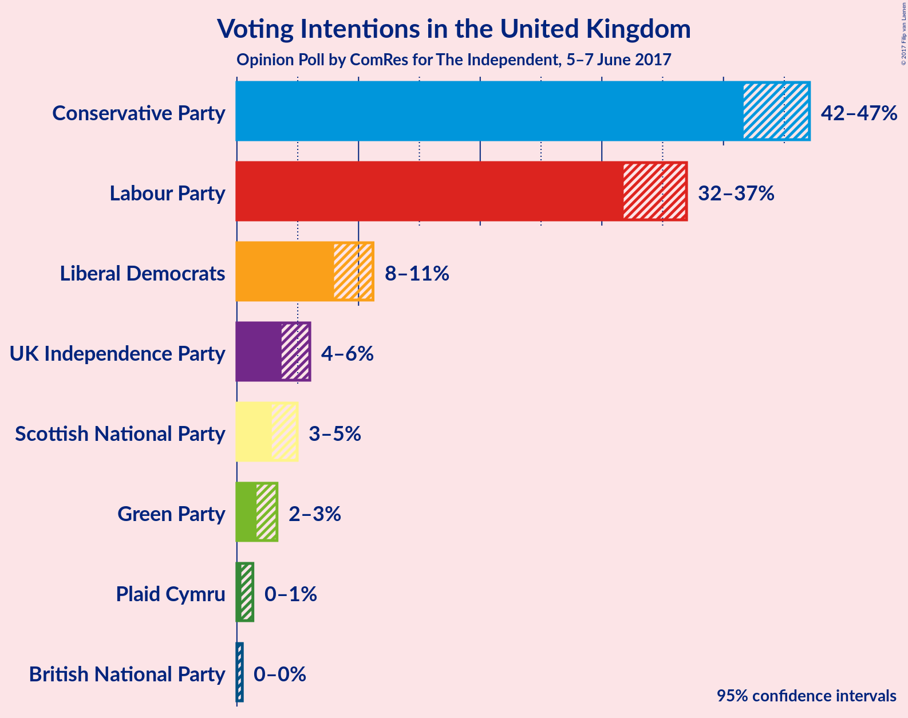
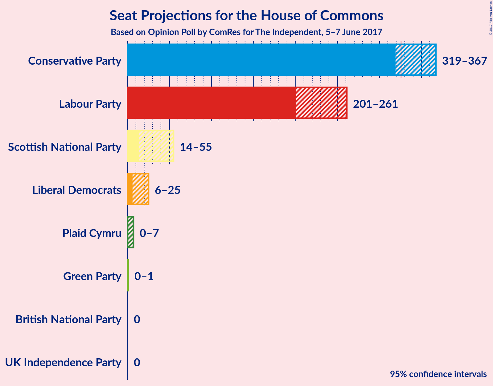
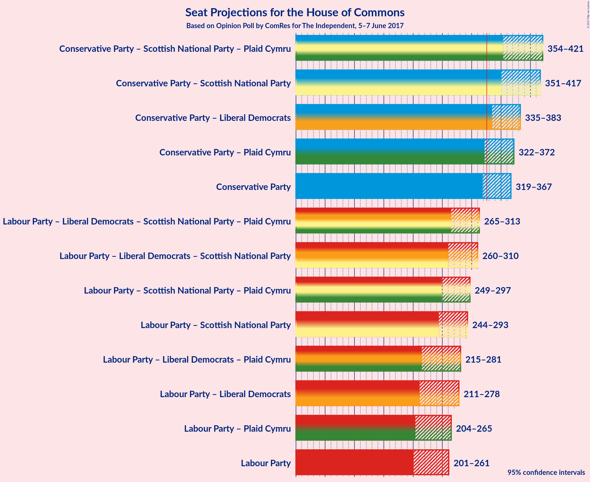

# Opinion Poll by ComRes for The Independent, 5–7 June 2017

<a href="#voting-intentions">Voting Intentions</a> | <a href="#seats">Seats</a> | <a href="#coalitions">Coalitions</a> | <a href="#technical-information">Technical Information</a>

## Voting Intentions

### Confidence Intervals

| Party | Last Result | Poll Result | 80% Confidence Interval | 90% Confidence Interval | 95% Confidence Interval | 99% Confidence Interval |
|:-----:|:-----------:|:-----------:|:-----------------------:|:-----------------------:|:-----------------------:|:-----------------------:|
| Conservative Party | 36.9% | 44.5% | 42.6–46.1% |42.1–46.6% |41.7–47.1% |40.8–47.9% |
| Labour Party | 30.4% | 34.4% | 32.7–36.1% |32.2–36.5% |31.8–37.0% |31.0–37.8% |
| Liberal Democrats | 7.9% | 9.5% | 8.5–10.6% |8.2–10.9% |8.0–11.2% |7.5–11.8% |
| UK Independence Party | 12.6% | 4.7% | 4.0–5.5% |3.8–5.8% |3.7–6.0% |3.4–6.4% |
| Scottish National Party | 4.7% | 3.8% | 3.2–4.5% |3.0–4.8% |2.9–5.0% |2.6–5.3% |
| Green Party | 3.8% | 2.3% | 1.8–2.9% |1.7–3.1% |1.6–3.3% |1.4–3.6% |
| Plaid Cymru | 0.6% | 0.7% | 0.5–1.1% |0.4–1.2% |0.4–1.3% |0.3–1.5% |
| British National Party | 0.0% | 0.1% | 0.0–0.3% |0.0–0.4% |0.0–0.4% |0.0–0.6% |

*Note:* The poll result column reflects the actual value used in the calculations. Published results may vary slightly, and in addition be rounded to fewer digits.

## Seats

### Confidence Intervals

| Party | Last Result | Median | 80% Confidence Interval | 90% Confidence Interval | 95% Confidence Interval | 99% Confidence Interval |
|:-----:|:-----------:|:------:|:-----------------------:|:-----------------------:|:-----------------------:|:-----------------------:|
| <a href="#conservative-party">Conservative Party</a> | 331 | 347 | 324–361 |319–365 |319–367 |312–373 |
| <a href="#labour-party">Labour Party</a> | 232 | 225 | 212–248 |204–252 |201–261 |192–271 |
| <a href="#liberal-democrats">Liberal Democrats</a> | 8 | 15 | 8–21 |6–24 |6–25 |5–27 |
| <a href="#uk-independence-party">UK Independence Party</a> | 1 | 0 | 0 |0 |0 |0 |
| <a href="#scottish-national-party">Scottish National Party</a> | 56 | 46 | 25–53 |17–54 |14–55 |4–55 |
| <a href="#green-party">Green Party</a> | 1 | 0 | 0–1 |0–1 |0–1 |0–1 |
| <a href="#plaid-cymru">Plaid Cymru</a> | 3 | 3 | 2–5 |0–6 |0–7 |0–7 |
| <a href="#british-national-party">British National Party</a> | 0 | 0 | 0 |0 |0 |0 |

### Conservative Party

| Number of Seats | Probability | Accumulated |
|:---------------:|:-----------:|:-----------:|
| 305 | 0.1% | 100% |
| 306 | 0% | 99.8% |
| 307 | 0% | 99.8% |
| 308 | 0% | 99.8% |
| 309 | 0% | 99.8% |
| 310 | 0% | 99.8% |
| 311 | 0.1% | 99.7% |
| 312 | 0.2% | 99.7% |
| 313 | 0.1% | 99.4% |
| 314 | 0% | 99.4% |
| 315 | 0.1% | 99.3% |
| 316 | 0.7% | 99.2% |
| 317 | 0.1% | 98.6% |
| 318 | 0.2% | 98% |
| 319 | 4% | 98% |
| 320 | 0.1% | 94% |
| 321 | 0.3% | 94% |
| 322 | 3% | 93% |
| 323 | 0.3% | 91% |
| 324 | 4% | 90% |
| 325 | 0.3% | 87% |
| 326 | 2% | 86% |
| 327 | 0.8% | 84% |
| 328 | 0.3% | 83% |
| 329 | 0.5% | 83% |
| 330 | 0.8% | 82% |
| 331 | 1.5% | 82% |
| 332 | 1.2% | 80% |
| 333 | 0.3% | 79% |
| 334 | 0.6% | 79% |
| 335 | 0.1% | 78% |
| 336 | 0.4% | 78% |
| 337 | 0.6% | 78% |
| 338 | 4% | 77% |
| 339 | 2% | 73% |
| 340 | 4% | 71% |
| 341 | 1.0% | 67% |
| 342 | 1.0% | 66% |
| 343 | 3% | 65% |
| 344 | 0.8% | 62% |
| 345 | 3% | 61% |
| 346 | 8% | 58% |
| 347 | 11% | 50% |
| 348 | 3% | 39% |
| 349 | 13% | 35% |
| 350 | 3% | 23% |
| 351 | 1.4% | 19% |
| 352 | 2% | 18% |
| 353 | 0.4% | 16% |
| 354 | 0.5% | 15% |
| 355 | 1.2% | 15% |
| 356 | 2% | 13% |
| 357 | 0.7% | 11% |
| 358 | 0.2% | 11% |
| 359 | 0% | 10% |
| 360 | 0.2% | 10% |
| 361 | 2% | 10% |
| 362 | 0.1% | 8% |
| 363 | 1.3% | 8% |
| 364 | 0.3% | 7% |
| 365 | 2% | 7% |
| 366 | 0.7% | 5% |
| 367 | 3% | 4% |
| 368 | 0.2% | 1.3% |
| 369 | 0.2% | 1.1% |
| 370 | 0.1% | 0.9% |
| 371 | 0.1% | 0.8% |
| 372 | 0.1% | 0.7% |
| 373 | 0.4% | 0.6% |
| 374 | 0% | 0.2% |
| 375 | 0% | 0.2% |
| 376 | 0% | 0.2% |
| 377 | 0% | 0.2% |
| 378 | 0% | 0.1% |
| 379 | 0% | 0.1% |
| 380 | 0% | 0.1% |
| 381 | 0% | 0.1% |
| 382 | 0% | 0.1% |
| 383 | 0% | 0.1% |
| 384 | 0% | 0.1% |
| 385 | 0% | 0.1% |
| 386 | 0% | 0% |

### Labour Party

| Number of Seats | Probability | Accumulated |
|:---------------:|:-----------:|:-----------:|
| 188 | 0% | 100% |
| 189 | 0% | 99.9% |
| 190 | 0% | 99.9% |
| 191 | 0.3% | 99.9% |
| 192 | 0.1% | 99.6% |
| 193 | 0% | 99.5% |
| 194 | 0% | 99.4% |
| 195 | 0.2% | 99.4% |
| 196 | 0.1% | 99.2% |
| 197 | 0.1% | 99.1% |
| 198 | 0.3% | 99.0% |
| 199 | 0.9% | 98.7% |
| 200 | 0.1% | 98% |
| 201 | 0.3% | 98% |
| 202 | 0.2% | 97% |
| 203 | 0.9% | 97% |
| 204 | 2% | 96% |
| 205 | 2% | 95% |
| 206 | 0.2% | 93% |
| 207 | 0.7% | 93% |
| 208 | 0% | 92% |
| 209 | 0% | 92% |
| 210 | 1.2% | 92% |
| 211 | 1.0% | 91% |
| 212 | 0.3% | 90% |
| 213 | 2% | 90% |
| 214 | 3% | 88% |
| 215 | 0.8% | 85% |
| 216 | 3% | 85% |
| 217 | 3% | 82% |
| 218 | 10% | 79% |
| 219 | 4% | 69% |
| 220 | 2% | 64% |
| 221 | 2% | 62% |
| 222 | 0.8% | 60% |
| 223 | 0.9% | 59% |
| 224 | 2% | 58% |
| 225 | 8% | 56% |
| 226 | 2% | 49% |
| 227 | 4% | 47% |
| 228 | 0.3% | 43% |
| 229 | 0.6% | 43% |
| 230 | 0.9% | 42% |
| 231 | 2% | 41% |
| 232 | 0.8% | 39% |
| 233 | 0.6% | 38% |
| 234 | 2% | 38% |
| 235 | 3% | 36% |
| 236 | 4% | 33% |
| 237 | 2% | 29% |
| 238 | 0.7% | 27% |
| 239 | 2% | 26% |
| 240 | 1.0% | 25% |
| 241 | 0.2% | 24% |
| 242 | 1.3% | 23% |
| 243 | 0.2% | 22% |
| 244 | 1.2% | 22% |
| 245 | 6% | 21% |
| 246 | 0.2% | 14% |
| 247 | 2% | 14% |
| 248 | 3% | 12% |
| 249 | 4% | 9% |
| 250 | 0.2% | 6% |
| 251 | 0% | 5% |
| 252 | 0.4% | 5% |
| 253 | 0.2% | 5% |
| 254 | 1.0% | 5% |
| 255 | 0.1% | 4% |
| 256 | 0.2% | 4% |
| 257 | 0.2% | 3% |
| 258 | 0.2% | 3% |
| 259 | 0.2% | 3% |
| 260 | 0% | 3% |
| 261 | 1.1% | 3% |
| 262 | 0.2% | 2% |
| 263 | 0% | 2% |
| 264 | 0.1% | 1.5% |
| 265 | 0.3% | 1.4% |
| 266 | 0.4% | 1.1% |
| 267 | 0.2% | 0.8% |
| 268 | 0.1% | 0.6% |
| 269 | 0% | 0.5% |
| 270 | 0% | 0.5% |
| 271 | 0% | 0.5% |
| 272 | 0% | 0.5% |
| 273 | 0% | 0.5% |
| 274 | 0.1% | 0.4% |
| 275 | 0.1% | 0.4% |
| 276 | 0% | 0.3% |
| 277 | 0% | 0.3% |
| 278 | 0% | 0.3% |
| 279 | 0% | 0.3% |
| 280 | 0% | 0.3% |
| 281 | 0% | 0.3% |
| 282 | 0% | 0.2% |
| 283 | 0% | 0.2% |
| 284 | 0% | 0.2% |
| 285 | 0.1% | 0.1% |
| 286 | 0% | 0.1% |
| 287 | 0% | 0.1% |
| 288 | 0% | 0% |

### Liberal Democrats

| Number of Seats | Probability | Accumulated |
|:---------------:|:-----------:|:-----------:|
| 2 | 0% | 100% |
| 3 | 0.1% | 99.9% |
| 4 | 0.2% | 99.8% |
| 5 | 0.7% | 99.6% |
| 6 | 4% | 98.9% |
| 7 | 2% | 95% |
| 8 | 7% | 93% |
| 9 | 8% | 86% |
| 10 | 4% | 78% |
| 11 | 4% | 74% |
| 12 | 6% | 70% |
| 13 | 8% | 64% |
| 14 | 5% | 55% |
| 15 | 7% | 50% |
| 16 | 11% | 43% |
| 17 | 6% | 32% |
| 18 | 5% | 26% |
| 19 | 2% | 22% |
| 20 | 6% | 19% |
| 21 | 6% | 14% |
| 22 | 1.4% | 8% |
| 23 | 1.0% | 6% |
| 24 | 0.4% | 5% |
| 25 | 3% | 5% |
| 26 | 0.8% | 2% |
| 27 | 0.5% | 0.9% |
| 28 | 0.1% | 0.5% |
| 29 | 0.3% | 0.4% |
| 30 | 0% | 0.1% |
| 31 | 0% | 0.1% |
| 32 | 0% | 0% |

### UK Independence Party

| Number of Seats | Probability | Accumulated |
|:---------------:|:-----------:|:-----------:|
| 0 | 100% | 100% |
| 1 | 0% | 0% |

### Scottish National Party

| Number of Seats | Probability | Accumulated |
|:---------------:|:-----------:|:-----------:|
| 2 | 0.3% | 100% |
| 3 | 0.2% | 99.7% |
| 4 | 0.1% | 99.6% |
| 5 | 0.2% | 99.4% |
| 6 | 0.1% | 99.3% |
| 7 | 0.1% | 99.2% |
| 8 | 0.2% | 99.1% |
| 9 | 0.1% | 98.9% |
| 10 | 0.2% | 98.8% |
| 11 | 0% | 98.6% |
| 12 | 0% | 98.6% |
| 13 | 0.2% | 98.6% |
| 14 | 1.2% | 98% |
| 15 | 0.3% | 97% |
| 16 | 1.2% | 97% |
| 17 | 2% | 96% |
| 18 | 0.3% | 94% |
| 19 | 0.1% | 93% |
| 20 | 0.7% | 93% |
| 21 | 0.3% | 93% |
| 22 | 0.3% | 92% |
| 23 | 0.9% | 92% |
| 24 | 0.4% | 91% |
| 25 | 2% | 91% |
| 26 | 0% | 89% |
| 27 | 3% | 89% |
| 28 | 3% | 86% |
| 29 | 2% | 84% |
| 30 | 0.8% | 82% |
| 31 | 1.0% | 81% |
| 32 | 0.2% | 80% |
| 33 | 0.1% | 80% |
| 34 | 0.4% | 79% |
| 35 | 0.2% | 79% |
| 36 | 0.4% | 79% |
| 37 | 0.5% | 79% |
| 38 | 0.6% | 78% |
| 39 | 6% | 77% |
| 40 | 3% | 71% |
| 41 | 5% | 68% |
| 42 | 4% | 63% |
| 43 | 0.3% | 59% |
| 44 | 3% | 59% |
| 45 | 6% | 56% |
| 46 | 9% | 50% |
| 47 | 6% | 42% |
| 48 | 5% | 35% |
| 49 | 5% | 31% |
| 50 | 7% | 26% |
| 51 | 0.3% | 19% |
| 52 | 3% | 19% |
| 53 | 9% | 16% |
| 54 | 3% | 7% |
| 55 | 4% | 4% |
| 56 | 0.2% | 0.4% |
| 57 | 0.1% | 0.1% |
| 58 | 0% | 0% |

### Green Party

| Number of Seats | Probability | Accumulated |
|:---------------:|:-----------:|:-----------:|
| 0 | 85% | 100% |
| 1 | 15% | 15% |
| 2 | 0% | 0% |

### Plaid Cymru

| Number of Seats | Probability | Accumulated |
|:---------------:|:-----------:|:-----------:|
| 0 | 6% | 100% |
| 1 | 4% | 94% |
| 2 | 2% | 91% |
| 3 | 39% | 89% |
| 4 | 24% | 50% |
| 5 | 19% | 26% |
| 6 | 2% | 7% |
| 7 | 5% | 5% |
| 8 | 0.3% | 0.3% |
| 9 | 0% | 0% |

### British National Party

| Number of Seats | Probability | Accumulated |
|:---------------:|:-----------:|:-----------:|
| 0 | 100% | 100% |
| 1 | 0% | 0% |

## Coalitions

### Confidence Intervals

| Coalition | Last Result | Median | 80% Confidence Interval | 90% Confidence Interval | 95% Confidence Interval | 99% Confidence Interval |
|:---------:|:-----------:|:------:|:-----------------------:|:-----------------------:|:-----------------------:|:-----------------------:|
| Conservative Party – Scottish National Party – Plaid Cymru | 390 | 392 | 367–407 | 363–413 | 354–421 | 342–424 |
| Conservative Party – Scottish National Party | 387 | 388 | 364–404 | 359–410 | 351–417 | 338–420 |
| Conservative Party – Liberal Democrats | 339 | 358 | 339–372 | 338–381 | 335–383 | 327–390 |
| Conservative Party – Plaid Cymru | 334 | 350 | 327–365 | 322–368 | 322–372 | 316–377 |
| Conservative Party | 331 | 347 | 324–361 | 319–365 | 319–367 | 312–373 |
| Labour Party – Liberal Democrats – Scottish National Party – Plaid Cymru | 299 | 285 | 271–308 | 266–313 | 265–313 | 259–320 |
| Labour Party – Liberal Democrats – Scottish National Party | 296 | 282 | 267–305 | 263–310 | 260–310 | 255–316 |
| Labour Party – Scottish National Party – Plaid Cymru | 291 | 274 | 260–293 | 251–294 | 249–297 | 242–305 |
| Labour Party – Scottish National Party | 288 | 271 | 255–290 | 248–290 | 244–293 | 238–301 |
| Labour Party – Liberal Democrats – Plaid Cymru | 243 | 244 | 228–268 | 221–272 | 215–281 | 211–294 |
| Labour Party – Liberal Democrats | 240 | 240 | 225–265 | 218–268 | 211–278 | 208–290 |
| Labour Party – Plaid Cymru | 235 | 229 | 216–252 | 208–256 | 204–265 | 198–275 |
| Labour Party | 232 | 225 | 212–248 | 204–252 | 201–261 | 192–271 |

### Conservative Party – Scottish National Party – Plaid Cymru

| Number of Seats | Probability | Accumulated |
|:---------------:|:-----------:|:-----------:|
| 329 | 0.1% | 100% |
| 330 | 0% | 99.9% |
| 331 | 0% | 99.8% |
| 332 | 0% | 99.8% |
| 333 | 0% | 99.7% |
| 334 | 0% | 99.7% |
| 335 | 0% | 99.7% |
| 336 | 0% | 99.7% |
| 337 | 0% | 99.7% |
| 338 | 0% | 99.7% |
| 339 | 0% | 99.7% |
| 340 | 0% | 99.6% |
| 341 | 0% | 99.6% |
| 342 | 0.1% | 99.6% |
| 343 | 0.1% | 99.5% |
| 344 | 0% | 99.4% |
| 345 | 0% | 99.4% |
| 346 | 0.1% | 99.3% |
| 347 | 0.2% | 99.2% |
| 348 | 0% | 99.1% |
| 349 | 0% | 99.0% |
| 350 | 0.1% | 99.0% |
| 351 | 0.9% | 99.0% |
| 352 | 0.1% | 98% |
| 353 | 0.2% | 98% |
| 354 | 0.4% | 98% |
| 355 | 0.1% | 97% |
| 356 | 0.2% | 97% |
| 357 | 0.3% | 97% |
| 358 | 0.1% | 97% |
| 359 | 0.3% | 97% |
| 360 | 0.3% | 96% |
| 361 | 0.1% | 96% |
| 362 | 0.2% | 96% |
| 363 | 1.0% | 96% |
| 364 | 0.1% | 95% |
| 365 | 0.2% | 95% |
| 366 | 0.3% | 94% |
| 367 | 5% | 94% |
| 368 | 6% | 89% |
| 369 | 0.4% | 83% |
| 370 | 1.3% | 83% |
| 371 | 3% | 81% |
| 372 | 1.0% | 78% |
| 373 | 0.2% | 77% |
| 374 | 1.5% | 77% |
| 375 | 1.0% | 76% |
| 376 | 1.1% | 75% |
| 377 | 3% | 74% |
| 378 | 0.7% | 70% |
| 379 | 2% | 70% |
| 380 | 0.3% | 67% |
| 381 | 0.1% | 67% |
| 382 | 1.0% | 67% |
| 383 | 2% | 66% |
| 384 | 1.1% | 64% |
| 385 | 2% | 63% |
| 386 | 3% | 61% |
| 387 | 0.6% | 59% |
| 388 | 1.5% | 58% |
| 389 | 0.3% | 57% |
| 390 | 1.2% | 56% |
| 391 | 3% | 55% |
| 392 | 4% | 52% |
| 393 | 2% | 48% |
| 394 | 0.4% | 46% |
| 395 | 0.6% | 45% |
| 396 | 0.3% | 45% |
| 397 | 4% | 44% |
| 398 | 7% | 40% |
| 399 | 2% | 33% |
| 400 | 2% | 31% |
| 401 | 5% | 29% |
| 402 | 7% | 24% |
| 403 | 0.7% | 17% |
| 404 | 1.4% | 17% |
| 405 | 1.4% | 15% |
| 406 | 1.1% | 14% |
| 407 | 3% | 13% |
| 408 | 0.3% | 10% |
| 409 | 0.9% | 9% |
| 410 | 0.2% | 8% |
| 411 | 0.1% | 8% |
| 412 | 1.4% | 8% |
| 413 | 2% | 7% |
| 414 | 0.4% | 5% |
| 415 | 1.0% | 4% |
| 416 | 0.4% | 3% |
| 417 | 0.1% | 3% |
| 418 | 0% | 3% |
| 419 | 0% | 3% |
| 420 | 0.1% | 3% |
| 421 | 0.5% | 3% |
| 422 | 0.1% | 2% |
| 423 | 1.1% | 2% |
| 424 | 0.7% | 1.1% |
| 425 | 0.1% | 0.4% |
| 426 | 0.1% | 0.3% |
| 427 | 0% | 0.2% |
| 428 | 0% | 0.2% |
| 429 | 0% | 0.1% |
| 430 | 0% | 0.1% |
| 431 | 0% | 0.1% |
| 432 | 0% | 0.1% |
| 433 | 0.1% | 0.1% |
| 434 | 0% | 0% |

### Conservative Party – Scottish National Party

| Number of Seats | Probability | Accumulated |
|:---------------:|:-----------:|:-----------:|
| 325 | 0% | 100% |
| 326 | 0.1% | 99.9% |
| 327 | 0% | 99.9% |
| 328 | 0% | 99.8% |
| 329 | 0% | 99.8% |
| 330 | 0% | 99.8% |
| 331 | 0% | 99.8% |
| 332 | 0% | 99.7% |
| 333 | 0% | 99.7% |
| 334 | 0% | 99.7% |
| 335 | 0% | 99.7% |
| 336 | 0% | 99.7% |
| 337 | 0% | 99.6% |
| 338 | 0.2% | 99.6% |
| 339 | 0.1% | 99.4% |
| 340 | 0% | 99.4% |
| 341 | 0.1% | 99.4% |
| 342 | 0% | 99.3% |
| 343 | 0% | 99.3% |
| 344 | 0.2% | 99.3% |
| 345 | 0.1% | 99.1% |
| 346 | 0.2% | 99.1% |
| 347 | 0.9% | 98.9% |
| 348 | 0.1% | 98% |
| 349 | 0% | 98% |
| 350 | 0.3% | 98% |
| 351 | 0.2% | 98% |
| 352 | 0.5% | 97% |
| 353 | 0.1% | 97% |
| 354 | 0.3% | 97% |
| 355 | 0.2% | 97% |
| 356 | 0.8% | 96% |
| 357 | 0.1% | 96% |
| 358 | 0.3% | 95% |
| 359 | 0.2% | 95% |
| 360 | 0.4% | 95% |
| 361 | 0.3% | 95% |
| 362 | 0.8% | 94% |
| 363 | 0.3% | 93% |
| 364 | 4% | 93% |
| 365 | 8% | 89% |
| 366 | 0.4% | 82% |
| 367 | 0.3% | 81% |
| 368 | 4% | 81% |
| 369 | 1.2% | 77% |
| 370 | 0.7% | 76% |
| 371 | 1.3% | 75% |
| 372 | 2% | 74% |
| 373 | 0.5% | 72% |
| 374 | 0.2% | 72% |
| 375 | 0.8% | 72% |
| 376 | 1.0% | 71% |
| 377 | 0.6% | 70% |
| 378 | 1.2% | 69% |
| 379 | 4% | 68% |
| 380 | 1.3% | 65% |
| 381 | 1.1% | 63% |
| 382 | 1.1% | 62% |
| 383 | 0.6% | 61% |
| 384 | 0.2% | 60% |
| 385 | 4% | 60% |
| 386 | 2% | 56% |
| 387 | 2% | 54% |
| 388 | 5% | 52% |
| 389 | 2% | 48% |
| 390 | 1.2% | 45% |
| 391 | 0.6% | 44% |
| 392 | 0.4% | 44% |
| 393 | 0.3% | 43% |
| 394 | 3% | 43% |
| 395 | 9% | 40% |
| 396 | 0.8% | 31% |
| 397 | 8% | 30% |
| 398 | 2% | 22% |
| 399 | 5% | 21% |
| 400 | 0.6% | 16% |
| 401 | 2% | 15% |
| 402 | 2% | 14% |
| 403 | 0.3% | 12% |
| 404 | 2% | 11% |
| 405 | 1.1% | 10% |
| 406 | 1.2% | 8% |
| 407 | 0.4% | 7% |
| 408 | 0.9% | 7% |
| 409 | 0.5% | 6% |
| 410 | 0.9% | 5% |
| 411 | 0.2% | 5% |
| 412 | 0.2% | 4% |
| 413 | 1.1% | 4% |
| 414 | 0% | 3% |
| 415 | 0.2% | 3% |
| 416 | 0.1% | 3% |
| 417 | 0.2% | 3% |
| 418 | 0.5% | 2% |
| 419 | 0% | 2% |
| 420 | 2% | 2% |
| 421 | 0.1% | 0.4% |
| 422 | 0.1% | 0.3% |
| 423 | 0% | 0.2% |
| 424 | 0% | 0.1% |
| 425 | 0% | 0.1% |
| 426 | 0% | 0.1% |
| 427 | 0.1% | 0.1% |
| 428 | 0% | 0% |

### Conservative Party – Liberal Democrats

| Number of Seats | Probability | Accumulated |
|:---------------:|:-----------:|:-----------:|
| 322 | 0% | 100% |
| 323 | 0% | 99.9% |
| 324 | 0.1% | 99.9% |
| 325 | 0% | 99.9% |
| 326 | 0.2% | 99.8% |
| 327 | 0.1% | 99.6% |
| 328 | 0.1% | 99.4% |
| 329 | 0% | 99.3% |
| 330 | 0.8% | 99.3% |
| 331 | 0% | 98% |
| 332 | 0.3% | 98% |
| 333 | 0.1% | 98% |
| 334 | 0.2% | 98% |
| 335 | 0.5% | 98% |
| 336 | 2% | 97% |
| 337 | 0.5% | 96% |
| 338 | 0.4% | 95% |
| 339 | 8% | 95% |
| 340 | 0.9% | 87% |
| 341 | 2% | 87% |
| 342 | 1.0% | 85% |
| 343 | 0.7% | 84% |
| 344 | 0.6% | 83% |
| 345 | 1.3% | 83% |
| 346 | 0.4% | 81% |
| 347 | 0.8% | 81% |
| 348 | 2% | 80% |
| 349 | 0.5% | 78% |
| 350 | 1.0% | 78% |
| 351 | 1.5% | 77% |
| 352 | 0.7% | 75% |
| 353 | 0.3% | 74% |
| 354 | 8% | 74% |
| 355 | 4% | 66% |
| 356 | 4% | 62% |
| 357 | 0.5% | 58% |
| 358 | 12% | 58% |
| 359 | 0.9% | 46% |
| 360 | 5% | 45% |
| 361 | 2% | 40% |
| 362 | 4% | 38% |
| 363 | 2% | 34% |
| 364 | 2% | 32% |
| 365 | 2% | 30% |
| 366 | 3% | 28% |
| 367 | 3% | 25% |
| 368 | 5% | 23% |
| 369 | 1.3% | 18% |
| 370 | 4% | 17% |
| 371 | 2% | 13% |
| 372 | 2% | 10% |
| 373 | 0.4% | 9% |
| 374 | 0.6% | 8% |
| 375 | 0.4% | 8% |
| 376 | 0.3% | 7% |
| 377 | 0.7% | 7% |
| 378 | 0.1% | 6% |
| 379 | 0.5% | 6% |
| 380 | 0.2% | 6% |
| 381 | 2% | 6% |
| 382 | 0.9% | 4% |
| 383 | 1.5% | 3% |
| 384 | 0.1% | 1.4% |
| 385 | 0.3% | 1.3% |
| 386 | 0.1% | 1.0% |
| 387 | 0.2% | 0.9% |
| 388 | 0% | 0.7% |
| 389 | 0.1% | 0.6% |
| 390 | 0.3% | 0.6% |
| 391 | 0% | 0.2% |
| 392 | 0.1% | 0.2% |
| 393 | 0% | 0.2% |
| 394 | 0% | 0.1% |
| 395 | 0% | 0.1% |
| 396 | 0% | 0.1% |
| 397 | 0% | 0.1% |
| 398 | 0% | 0.1% |
| 399 | 0% | 0.1% |
| 400 | 0% | 0.1% |
| 401 | 0% | 0% |

### Conservative Party – Plaid Cymru

| Number of Seats | Probability | Accumulated |
|:---------------:|:-----------:|:-----------:|
| 309 | 0.1% | 100% |
| 310 | 0% | 99.8% |
| 311 | 0% | 99.8% |
| 312 | 0% | 99.8% |
| 313 | 0% | 99.8% |
| 314 | 0% | 99.7% |
| 315 | 0.2% | 99.7% |
| 316 | 0.1% | 99.5% |
| 317 | 0% | 99.4% |
| 318 | 0% | 99.3% |
| 319 | 0.1% | 99.3% |
| 320 | 0.8% | 99.2% |
| 321 | 0% | 98% |
| 322 | 4% | 98% |
| 323 | 0.4% | 94% |
| 324 | 0.1% | 94% |
| 325 | 1.2% | 94% |
| 326 | 1.0% | 92% |
| 327 | 4% | 91% |
| 328 | 0.1% | 87% |
| 329 | 0.6% | 87% |
| 330 | 3% | 86% |
| 331 | 0.7% | 84% |
| 332 | 1.0% | 83% |
| 333 | 1.2% | 82% |
| 334 | 1.2% | 81% |
| 335 | 0.3% | 79% |
| 336 | 0.2% | 79% |
| 337 | 0.7% | 79% |
| 338 | 0% | 78% |
| 339 | 0.4% | 78% |
| 340 | 0.3% | 78% |
| 341 | 3% | 78% |
| 342 | 1.0% | 75% |
| 343 | 3% | 74% |
| 344 | 5% | 70% |
| 345 | 1.2% | 66% |
| 346 | 1.3% | 64% |
| 347 | 0.6% | 63% |
| 348 | 2% | 63% |
| 349 | 7% | 60% |
| 350 | 7% | 53% |
| 351 | 8% | 46% |
| 352 | 9% | 38% |
| 353 | 6% | 29% |
| 354 | 4% | 23% |
| 355 | 2% | 19% |
| 356 | 1.0% | 17% |
| 357 | 0.6% | 16% |
| 358 | 0.9% | 15% |
| 359 | 0.6% | 14% |
| 360 | 1.3% | 14% |
| 361 | 0.9% | 12% |
| 362 | 0.2% | 11% |
| 363 | 0.6% | 11% |
| 364 | 0.4% | 11% |
| 365 | 1.2% | 10% |
| 366 | 2% | 9% |
| 367 | 1.2% | 8% |
| 368 | 2% | 7% |
| 369 | 0.2% | 4% |
| 370 | 1.2% | 4% |
| 371 | 0.1% | 3% |
| 372 | 0.6% | 3% |
| 373 | 1.3% | 2% |
| 374 | 0.2% | 1.1% |
| 375 | 0.2% | 0.8% |
| 376 | 0.1% | 0.7% |
| 377 | 0.3% | 0.6% |
| 378 | 0% | 0.3% |
| 379 | 0.1% | 0.3% |
| 380 | 0% | 0.2% |
| 381 | 0% | 0.2% |
| 382 | 0% | 0.2% |
| 383 | 0% | 0.1% |
| 384 | 0% | 0.1% |
| 385 | 0% | 0.1% |
| 386 | 0% | 0.1% |
| 387 | 0% | 0.1% |
| 388 | 0% | 0.1% |
| 389 | 0% | 0.1% |
| 390 | 0% | 0% |

### Conservative Party

| Number of Seats | Probability | Accumulated |
|:---------------:|:-----------:|:-----------:|
| 305 | 0.1% | 100% |
| 306 | 0% | 99.8% |
| 307 | 0% | 99.8% |
| 308 | 0% | 99.8% |
| 309 | 0% | 99.8% |
| 310 | 0% | 99.8% |
| 311 | 0.1% | 99.7% |
| 312 | 0.2% | 99.7% |
| 313 | 0.1% | 99.4% |
| 314 | 0% | 99.4% |
| 315 | 0.1% | 99.3% |
| 316 | 0.7% | 99.2% |
| 317 | 0.1% | 98.6% |
| 318 | 0.2% | 98% |
| 319 | 4% | 98% |
| 320 | 0.1% | 94% |
| 321 | 0.3% | 94% |
| 322 | 3% | 93% |
| 323 | 0.3% | 91% |
| 324 | 4% | 90% |
| 325 | 0.3% | 87% |
| 326 | 2% | 86% |
| 327 | 0.8% | 84% |
| 328 | 0.3% | 83% |
| 329 | 0.5% | 83% |
| 330 | 0.8% | 82% |
| 331 | 1.5% | 82% |
| 332 | 1.2% | 80% |
| 333 | 0.3% | 79% |
| 334 | 0.6% | 79% |
| 335 | 0.1% | 78% |
| 336 | 0.4% | 78% |
| 337 | 0.6% | 78% |
| 338 | 4% | 77% |
| 339 | 2% | 73% |
| 340 | 4% | 71% |
| 341 | 1.0% | 67% |
| 342 | 1.0% | 66% |
| 343 | 3% | 65% |
| 344 | 0.8% | 62% |
| 345 | 3% | 61% |
| 346 | 8% | 58% |
| 347 | 11% | 50% |
| 348 | 3% | 39% |
| 349 | 13% | 35% |
| 350 | 3% | 23% |
| 351 | 1.4% | 19% |
| 352 | 2% | 18% |
| 353 | 0.4% | 16% |
| 354 | 0.5% | 15% |
| 355 | 1.2% | 15% |
| 356 | 2% | 13% |
| 357 | 0.7% | 11% |
| 358 | 0.2% | 11% |
| 359 | 0% | 10% |
| 360 | 0.2% | 10% |
| 361 | 2% | 10% |
| 362 | 0.1% | 8% |
| 363 | 1.3% | 8% |
| 364 | 0.3% | 7% |
| 365 | 2% | 7% |
| 366 | 0.7% | 5% |
| 367 | 3% | 4% |
| 368 | 0.2% | 1.3% |
| 369 | 0.2% | 1.1% |
| 370 | 0.1% | 0.9% |
| 371 | 0.1% | 0.8% |
| 372 | 0.1% | 0.7% |
| 373 | 0.4% | 0.6% |
| 374 | 0% | 0.2% |
| 375 | 0% | 0.2% |
| 376 | 0% | 0.2% |
| 377 | 0% | 0.2% |
| 378 | 0% | 0.1% |
| 379 | 0% | 0.1% |
| 380 | 0% | 0.1% |
| 381 | 0% | 0.1% |
| 382 | 0% | 0.1% |
| 383 | 0% | 0.1% |
| 384 | 0% | 0.1% |
| 385 | 0% | 0.1% |
| 386 | 0% | 0% |

### Labour Party – Liberal Democrats – Scottish National Party – Plaid Cymru

| Number of Seats | Probability | Accumulated |
|:---------------:|:-----------:|:-----------:|
| 247 | 0% | 100% |
| 248 | 0% | 99.9% |
| 249 | 0% | 99.9% |
| 250 | 0% | 99.9% |
| 251 | 0% | 99.9% |
| 252 | 0% | 99.9% |
| 253 | 0% | 99.9% |
| 254 | 0% | 99.9% |
| 255 | 0% | 99.9% |
| 256 | 0% | 99.8% |
| 257 | 0% | 99.8% |
| 258 | 0% | 99.8% |
| 259 | 0.4% | 99.8% |
| 260 | 0.1% | 99.4% |
| 261 | 0.2% | 99.3% |
| 262 | 0.1% | 99.1% |
| 263 | 0.2% | 99.1% |
| 264 | 0.3% | 98.8% |
| 265 | 3% | 98.5% |
| 266 | 0.7% | 96% |
| 267 | 2% | 95% |
| 268 | 1.0% | 93% |
| 269 | 0.5% | 92% |
| 270 | 1.0% | 92% |
| 271 | 0.9% | 91% |
| 272 | 0.3% | 90% |
| 273 | 0.1% | 90% |
| 274 | 0.7% | 90% |
| 275 | 1.3% | 89% |
| 276 | 1.1% | 88% |
| 277 | 1.2% | 86% |
| 278 | 0.5% | 85% |
| 279 | 0.5% | 85% |
| 280 | 3% | 84% |
| 281 | 1.3% | 82% |
| 282 | 3% | 80% |
| 283 | 13% | 77% |
| 284 | 4% | 64% |
| 285 | 11% | 61% |
| 286 | 10% | 49% |
| 287 | 1.0% | 39% |
| 288 | 0.7% | 38% |
| 289 | 3% | 38% |
| 290 | 1.4% | 35% |
| 291 | 0.6% | 33% |
| 292 | 4% | 33% |
| 293 | 3% | 29% |
| 294 | 3% | 26% |
| 295 | 0.6% | 23% |
| 296 | 0.3% | 22% |
| 297 | 0.1% | 22% |
| 298 | 0.7% | 22% |
| 299 | 0.4% | 21% |
| 300 | 1.1% | 21% |
| 301 | 1.4% | 20% |
| 302 | 0.8% | 18% |
| 303 | 0.5% | 18% |
| 304 | 0.3% | 17% |
| 305 | 2% | 17% |
| 306 | 2% | 15% |
| 307 | 0.3% | 13% |
| 308 | 4% | 13% |
| 309 | 0.9% | 9% |
| 310 | 2% | 9% |
| 311 | 0.2% | 6% |
| 312 | 0.1% | 6% |
| 313 | 4% | 6% |
| 314 | 0.3% | 2% |
| 315 | 0.1% | 2% |
| 316 | 0.7% | 1.4% |
| 317 | 0.1% | 0.8% |
| 318 | 0% | 0.7% |
| 319 | 0.1% | 0.6% |
| 320 | 0.2% | 0.5% |
| 321 | 0.1% | 0.3% |
| 322 | 0% | 0.3% |
| 323 | 0% | 0.2% |
| 324 | 0% | 0.2% |
| 325 | 0% | 0.2% |
| 326 | 0% | 0.2% |
| 327 | 0.1% | 0.2% |
| 328 | 0% | 0% |

### Labour Party – Liberal Democrats – Scottish National Party

| Number of Seats | Probability | Accumulated |
|:---------------:|:-----------:|:-----------:|
| 243 | 0% | 100% |
| 244 | 0% | 99.9% |
| 245 | 0% | 99.9% |
| 246 | 0% | 99.9% |
| 247 | 0% | 99.9% |
| 248 | 0% | 99.9% |
| 249 | 0% | 99.9% |
| 250 | 0% | 99.9% |
| 251 | 0% | 99.8% |
| 252 | 0% | 99.8% |
| 253 | 0.1% | 99.8% |
| 254 | 0% | 99.7% |
| 255 | 0.3% | 99.7% |
| 256 | 0.1% | 99.4% |
| 257 | 0.2% | 99.3% |
| 258 | 0.2% | 99.1% |
| 259 | 1.4% | 98.9% |
| 260 | 0.5% | 98% |
| 261 | 0.3% | 97% |
| 262 | 1.0% | 97% |
| 263 | 1.2% | 96% |
| 264 | 1.0% | 94% |
| 265 | 2% | 93% |
| 266 | 0.7% | 91% |
| 267 | 1.3% | 91% |
| 268 | 0.2% | 89% |
| 269 | 0.5% | 89% |
| 270 | 1.0% | 89% |
| 271 | 0.1% | 88% |
| 272 | 2% | 88% |
| 273 | 0.4% | 86% |
| 274 | 0.9% | 86% |
| 275 | 0.9% | 85% |
| 276 | 0.8% | 84% |
| 277 | 2% | 83% |
| 278 | 4% | 81% |
| 279 | 5% | 77% |
| 280 | 9% | 71% |
| 281 | 8% | 62% |
| 282 | 8% | 54% |
| 283 | 8% | 46% |
| 284 | 0.5% | 38% |
| 285 | 0.6% | 37% |
| 286 | 2% | 37% |
| 287 | 1.1% | 35% |
| 288 | 4% | 34% |
| 289 | 4% | 29% |
| 290 | 0.2% | 26% |
| 291 | 3% | 25% |
| 292 | 0.2% | 22% |
| 293 | 0.4% | 22% |
| 294 | 0.1% | 22% |
| 295 | 0.7% | 22% |
| 296 | 0.3% | 21% |
| 297 | 0.2% | 21% |
| 298 | 1.2% | 20% |
| 299 | 1.3% | 19% |
| 300 | 1.0% | 18% |
| 301 | 1.4% | 17% |
| 302 | 2% | 16% |
| 303 | 0.6% | 14% |
| 304 | 0.2% | 13% |
| 305 | 5% | 13% |
| 306 | 2% | 8% |
| 307 | 0.5% | 7% |
| 308 | 0.1% | 6% |
| 309 | 0.4% | 6% |
| 310 | 4% | 6% |
| 311 | 0% | 2% |
| 312 | 0.8% | 2% |
| 313 | 0.1% | 0.8% |
| 314 | 0% | 0.7% |
| 315 | 0.1% | 0.6% |
| 316 | 0% | 0.5% |
| 317 | 0.2% | 0.5% |
| 318 | 0% | 0.3% |
| 319 | 0% | 0.3% |
| 320 | 0% | 0.2% |
| 321 | 0% | 0.2% |
| 322 | 0% | 0.2% |
| 323 | 0.1% | 0.2% |
| 324 | 0% | 0% |

### Labour Party – Scottish National Party – Plaid Cymru

| Number of Seats | Probability | Accumulated |
|:---------------:|:-----------:|:-----------:|
| 232 | 0% | 100% |
| 233 | 0% | 99.9% |
| 234 | 0% | 99.9% |
| 235 | 0% | 99.9% |
| 236 | 0% | 99.9% |
| 237 | 0% | 99.9% |
| 238 | 0% | 99.9% |
| 239 | 0% | 99.9% |
| 240 | 0.1% | 99.8% |
| 241 | 0% | 99.8% |
| 242 | 0.3% | 99.7% |
| 243 | 0.1% | 99.4% |
| 244 | 0% | 99.4% |
| 245 | 0.3% | 99.3% |
| 246 | 0.1% | 99.0% |
| 247 | 0.3% | 99.0% |
| 248 | 0.3% | 98.6% |
| 249 | 2% | 98% |
| 250 | 0.2% | 96% |
| 251 | 2% | 96% |
| 252 | 0.4% | 94% |
| 253 | 0.2% | 94% |
| 254 | 0.2% | 94% |
| 255 | 0.7% | 94% |
| 256 | 0.3% | 93% |
| 257 | 0.7% | 92% |
| 258 | 0.3% | 92% |
| 259 | 1.5% | 92% |
| 260 | 0.7% | 90% |
| 261 | 2% | 89% |
| 262 | 4% | 87% |
| 263 | 1.2% | 83% |
| 264 | 4% | 82% |
| 265 | 3% | 77% |
| 266 | 2% | 74% |
| 267 | 2% | 72% |
| 268 | 2% | 70% |
| 269 | 3% | 68% |
| 270 | 4% | 65% |
| 271 | 1.3% | 61% |
| 272 | 5% | 59% |
| 273 | 1.2% | 54% |
| 274 | 11% | 53% |
| 275 | 0.4% | 42% |
| 276 | 4% | 42% |
| 277 | 4% | 37% |
| 278 | 8% | 34% |
| 279 | 0.3% | 26% |
| 280 | 0.7% | 26% |
| 281 | 2% | 25% |
| 282 | 1.0% | 23% |
| 283 | 1.3% | 22% |
| 284 | 1.2% | 21% |
| 285 | 0.9% | 20% |
| 286 | 0.4% | 19% |
| 287 | 1.4% | 19% |
| 288 | 0.4% | 17% |
| 289 | 1.3% | 17% |
| 290 | 0.4% | 16% |
| 291 | 2% | 15% |
| 292 | 0.8% | 13% |
| 293 | 8% | 13% |
| 294 | 0.5% | 5% |
| 295 | 1.2% | 5% |
| 296 | 0.8% | 3% |
| 297 | 0.6% | 3% |
| 298 | 0.1% | 2% |
| 299 | 0.1% | 2% |
| 300 | 0.3% | 2% |
| 301 | 0% | 2% |
| 302 | 0.8% | 2% |
| 303 | 0.1% | 0.7% |
| 304 | 0.1% | 0.7% |
| 305 | 0.1% | 0.6% |
| 306 | 0.2% | 0.4% |
| 307 | 0.1% | 0.2% |
| 308 | 0.1% | 0.1% |
| 309 | 0% | 0.1% |
| 310 | 0% | 0.1% |
| 311 | 0% | 0% |

### Labour Party – Scottish National Party

| Number of Seats | Probability | Accumulated |
|:---------------:|:-----------:|:-----------:|
| 227 | 0% | 100% |
| 228 | 0% | 99.9% |
| 229 | 0% | 99.9% |
| 230 | 0% | 99.9% |
| 231 | 0% | 99.9% |
| 232 | 0% | 99.9% |
| 233 | 0% | 99.9% |
| 234 | 0% | 99.9% |
| 235 | 0% | 99.8% |
| 236 | 0% | 99.8% |
| 237 | 0.1% | 99.8% |
| 238 | 0.3% | 99.7% |
| 239 | 0.1% | 99.5% |
| 240 | 0.1% | 99.4% |
| 241 | 0.3% | 99.3% |
| 242 | 0.1% | 99.0% |
| 243 | 1.3% | 98.9% |
| 244 | 1.1% | 98% |
| 245 | 0.2% | 97% |
| 246 | 0.9% | 96% |
| 247 | 0.3% | 95% |
| 248 | 0.2% | 95% |
| 249 | 0% | 95% |
| 250 | 0.7% | 95% |
| 251 | 2% | 94% |
| 252 | 0.4% | 92% |
| 253 | 0.3% | 92% |
| 254 | 1.2% | 92% |
| 255 | 0.6% | 91% |
| 256 | 2% | 90% |
| 257 | 0.4% | 88% |
| 258 | 5% | 88% |
| 259 | 0.7% | 83% |
| 260 | 3% | 82% |
| 261 | 2% | 79% |
| 262 | 2% | 77% |
| 263 | 3% | 75% |
| 264 | 2% | 72% |
| 265 | 6% | 69% |
| 266 | 2% | 63% |
| 267 | 2% | 62% |
| 268 | 5% | 59% |
| 269 | 0.7% | 54% |
| 270 | 2% | 53% |
| 271 | 11% | 52% |
| 272 | 0.6% | 41% |
| 273 | 6% | 40% |
| 274 | 5% | 34% |
| 275 | 5% | 30% |
| 276 | 0.5% | 25% |
| 277 | 0.3% | 24% |
| 278 | 0.5% | 24% |
| 279 | 1.5% | 24% |
| 280 | 1.2% | 22% |
| 281 | 0.8% | 21% |
| 282 | 2% | 20% |
| 283 | 1.0% | 18% |
| 284 | 0.7% | 17% |
| 285 | 0.1% | 17% |
| 286 | 2% | 17% |
| 287 | 1.4% | 15% |
| 288 | 0.1% | 13% |
| 289 | 0.8% | 13% |
| 290 | 8% | 13% |
| 291 | 1.0% | 5% |
| 292 | 1.2% | 4% |
| 293 | 0.2% | 3% |
| 294 | 0.2% | 2% |
| 295 | 0.2% | 2% |
| 296 | 0.2% | 2% |
| 297 | 0.8% | 2% |
| 298 | 0.1% | 0.8% |
| 299 | 0.1% | 0.7% |
| 300 | 0% | 0.6% |
| 301 | 0.3% | 0.6% |
| 302 | 0.1% | 0.3% |
| 303 | 0.1% | 0.2% |
| 304 | 0% | 0.2% |
| 305 | 0.1% | 0.2% |
| 306 | 0.1% | 0.1% |
| 307 | 0% | 0% |

### Labour Party – Liberal Democrats – Plaid Cymru

| Number of Seats | Probability | Accumulated |
|:---------------:|:-----------:|:-----------:|
| 204 | 0% | 100% |
| 205 | 0.1% | 99.9% |
| 206 | 0% | 99.9% |
| 207 | 0% | 99.9% |
| 208 | 0% | 99.9% |
| 209 | 0.1% | 99.9% |
| 210 | 0.1% | 99.8% |
| 211 | 0.4% | 99.7% |
| 212 | 1.3% | 99.3% |
| 213 | 0% | 98% |
| 214 | 0.5% | 98% |
| 215 | 0.2% | 98% |
| 216 | 0.2% | 97% |
| 217 | 0.1% | 97% |
| 218 | 0% | 97% |
| 219 | 1.2% | 97% |
| 220 | 0.4% | 96% |
| 221 | 0.8% | 96% |
| 222 | 0.2% | 95% |
| 223 | 1.3% | 95% |
| 224 | 0.2% | 93% |
| 225 | 0.3% | 93% |
| 226 | 1.2% | 93% |
| 227 | 1.0% | 91% |
| 228 | 2% | 90% |
| 229 | 0.3% | 88% |
| 230 | 3% | 88% |
| 231 | 0.9% | 85% |
| 232 | 1.1% | 85% |
| 233 | 6% | 83% |
| 234 | 0.5% | 78% |
| 235 | 8% | 77% |
| 236 | 2% | 70% |
| 237 | 7% | 68% |
| 238 | 3% | 60% |
| 239 | 0.4% | 57% |
| 240 | 0.5% | 57% |
| 241 | 0.5% | 56% |
| 242 | 2% | 56% |
| 243 | 2% | 54% |
| 244 | 5% | 52% |
| 245 | 3% | 48% |
| 246 | 2% | 45% |
| 247 | 3% | 43% |
| 248 | 0.2% | 40% |
| 249 | 1.0% | 39% |
| 250 | 0.7% | 38% |
| 251 | 1.4% | 38% |
| 252 | 1.0% | 36% |
| 253 | 4% | 35% |
| 254 | 0.4% | 31% |
| 255 | 0.6% | 31% |
| 256 | 1.1% | 30% |
| 257 | 0.8% | 29% |
| 258 | 0.3% | 28% |
| 259 | 0.5% | 28% |
| 260 | 2% | 28% |
| 261 | 1.0% | 26% |
| 262 | 0.7% | 24% |
| 263 | 2% | 24% |
| 264 | 3% | 22% |
| 265 | 0.3% | 19% |
| 266 | 0.4% | 19% |
| 267 | 8% | 18% |
| 268 | 4% | 11% |
| 269 | 0.2% | 7% |
| 270 | 0.8% | 7% |
| 271 | 0.3% | 6% |
| 272 | 0.5% | 5% |
| 273 | 0.1% | 5% |
| 274 | 0.4% | 5% |
| 275 | 0.1% | 4% |
| 276 | 0.8% | 4% |
| 277 | 0.3% | 4% |
| 278 | 0.2% | 3% |
| 279 | 0.2% | 3% |
| 280 | 0.4% | 3% |
| 281 | 0.3% | 3% |
| 282 | 0.3% | 2% |
| 283 | 0% | 2% |
| 284 | 0.1% | 2% |
| 285 | 0.9% | 2% |
| 286 | 0.2% | 1.1% |
| 287 | 0% | 0.9% |
| 288 | 0.2% | 0.9% |
| 289 | 0% | 0.7% |
| 290 | 0% | 0.7% |
| 291 | 0% | 0.7% |
| 292 | 0% | 0.6% |
| 293 | 0.1% | 0.6% |
| 294 | 0.2% | 0.6% |
| 295 | 0% | 0.4% |
| 296 | 0% | 0.4% |
| 297 | 0% | 0.3% |
| 298 | 0% | 0.3% |
| 299 | 0% | 0.3% |
| 300 | 0% | 0.3% |
| 301 | 0% | 0.3% |
| 302 | 0% | 0.2% |
| 303 | 0% | 0.2% |
| 304 | 0% | 0.2% |
| 305 | 0% | 0.2% |
| 306 | 0.1% | 0.1% |
| 307 | 0% | 0.1% |
| 308 | 0% | 0% |

### Labour Party – Liberal Democrats

| Number of Seats | Probability | Accumulated |
|:---------------:|:-----------:|:-----------:|
| 199 | 0.1% | 100% |
| 200 | 0% | 99.9% |
| 201 | 0% | 99.9% |
| 202 | 0% | 99.9% |
| 203 | 0% | 99.9% |
| 204 | 0% | 99.9% |
| 205 | 0% | 99.8% |
| 206 | 0.1% | 99.8% |
| 207 | 0.1% | 99.7% |
| 208 | 1.0% | 99.6% |
| 209 | 0.8% | 98.6% |
| 210 | 0.1% | 98% |
| 211 | 0.5% | 98% |
| 212 | 0% | 97% |
| 213 | 0% | 97% |
| 214 | 0.1% | 97% |
| 215 | 0.2% | 97% |
| 216 | 1.1% | 97% |
| 217 | 0.2% | 96% |
| 218 | 1.1% | 96% |
| 219 | 1.4% | 95% |
| 220 | 1.3% | 93% |
| 221 | 0.1% | 92% |
| 222 | 0.2% | 92% |
| 223 | 1.0% | 92% |
| 224 | 0.4% | 91% |
| 225 | 4% | 90% |
| 226 | 0.5% | 86% |
| 227 | 2% | 86% |
| 228 | 1.3% | 84% |
| 229 | 0.3% | 83% |
| 230 | 8% | 82% |
| 231 | 4% | 75% |
| 232 | 3% | 71% |
| 233 | 0.4% | 67% |
| 234 | 7% | 67% |
| 235 | 4% | 60% |
| 236 | 0.3% | 56% |
| 237 | 0.7% | 55% |
| 238 | 0.8% | 55% |
| 239 | 2% | 54% |
| 240 | 4% | 52% |
| 241 | 4% | 48% |
| 242 | 0.5% | 44% |
| 243 | 0.6% | 44% |
| 244 | 2% | 43% |
| 245 | 0.7% | 42% |
| 246 | 2% | 41% |
| 247 | 2% | 38% |
| 248 | 0.8% | 36% |
| 249 | 2% | 36% |
| 250 | 0.2% | 33% |
| 251 | 0.1% | 33% |
| 252 | 0.3% | 33% |
| 253 | 2% | 32% |
| 254 | 0.6% | 30% |
| 255 | 3% | 29% |
| 256 | 1.1% | 26% |
| 257 | 1.2% | 25% |
| 258 | 1.2% | 24% |
| 259 | 0.2% | 23% |
| 260 | 2% | 23% |
| 261 | 2% | 21% |
| 262 | 1.2% | 19% |
| 263 | 0.5% | 17% |
| 264 | 6% | 17% |
| 265 | 5% | 11% |
| 266 | 0.3% | 6% |
| 267 | 0.2% | 6% |
| 268 | 0.3% | 5% |
| 269 | 0.8% | 5% |
| 270 | 0.2% | 4% |
| 271 | 0.1% | 4% |
| 272 | 0.3% | 4% |
| 273 | 0.2% | 4% |
| 274 | 0.2% | 3% |
| 275 | 0.3% | 3% |
| 276 | 0.1% | 3% |
| 277 | 0.1% | 3% |
| 278 | 0.4% | 3% |
| 279 | 0.2% | 2% |
| 280 | 0.1% | 2% |
| 281 | 0.9% | 2% |
| 282 | 0% | 1.0% |
| 283 | 0% | 1.0% |
| 284 | 0% | 0.9% |
| 285 | 0.2% | 0.9% |
| 286 | 0.1% | 0.7% |
| 287 | 0% | 0.7% |
| 288 | 0.1% | 0.6% |
| 289 | 0.1% | 0.6% |
| 290 | 0.1% | 0.5% |
| 291 | 0% | 0.4% |
| 292 | 0% | 0.4% |
| 293 | 0% | 0.4% |
| 294 | 0% | 0.3% |
| 295 | 0% | 0.3% |
| 296 | 0% | 0.3% |
| 297 | 0% | 0.3% |
| 298 | 0% | 0.3% |
| 299 | 0% | 0.3% |
| 300 | 0.1% | 0.3% |
| 301 | 0% | 0.2% |
| 302 | 0% | 0.2% |
| 303 | 0.1% | 0.1% |
| 304 | 0% | 0% |

### Labour Party – Plaid Cymru

| Number of Seats | Probability | Accumulated |
|:---------------:|:-----------:|:-----------:|
| 192 | 0% | 100% |
| 193 | 0% | 99.9% |
| 194 | 0% | 99.9% |
| 195 | 0.3% | 99.9% |
| 196 | 0.1% | 99.6% |
| 197 | 0% | 99.5% |
| 198 | 0.2% | 99.5% |
| 199 | 0.1% | 99.3% |
| 200 | 0% | 99.2% |
| 201 | 0.1% | 99.2% |
| 202 | 0.4% | 99.1% |
| 203 | 0.1% | 98.6% |
| 204 | 1.1% | 98.5% |
| 205 | 1.0% | 97% |
| 206 | 0.9% | 96% |
| 207 | 0.1% | 95% |
| 208 | 0.7% | 95% |
| 209 | 0.3% | 95% |
| 210 | 1.2% | 94% |
| 211 | 0.1% | 93% |
| 212 | 0.7% | 93% |
| 213 | 0.1% | 92% |
| 214 | 0.5% | 92% |
| 215 | 0.9% | 92% |
| 216 | 2% | 91% |
| 217 | 0.6% | 89% |
| 218 | 1.5% | 88% |
| 219 | 2% | 87% |
| 220 | 4% | 85% |
| 221 | 5% | 81% |
| 222 | 8% | 76% |
| 223 | 6% | 68% |
| 224 | 2% | 62% |
| 225 | 0.3% | 60% |
| 226 | 0.7% | 60% |
| 227 | 2% | 59% |
| 228 | 6% | 57% |
| 229 | 3% | 51% |
| 230 | 4% | 48% |
| 231 | 0.2% | 44% |
| 232 | 1.1% | 44% |
| 233 | 0.4% | 42% |
| 234 | 0.8% | 42% |
| 235 | 3% | 41% |
| 236 | 2% | 38% |
| 237 | 2% | 36% |
| 238 | 3% | 35% |
| 239 | 1.2% | 31% |
| 240 | 1.4% | 30% |
| 241 | 0.6% | 29% |
| 242 | 2% | 28% |
| 243 | 2% | 26% |
| 244 | 0.6% | 24% |
| 245 | 0% | 24% |
| 246 | 0.1% | 24% |
| 247 | 1.5% | 23% |
| 248 | 7% | 22% |
| 249 | 1.3% | 15% |
| 250 | 0.1% | 14% |
| 251 | 3% | 14% |
| 252 | 5% | 11% |
| 253 | 0.4% | 6% |
| 254 | 0.2% | 6% |
| 255 | 0.1% | 5% |
| 256 | 0.3% | 5% |
| 257 | 0.3% | 5% |
| 258 | 0.2% | 5% |
| 259 | 0.3% | 5% |
| 260 | 0.3% | 4% |
| 261 | 0.7% | 4% |
| 262 | 0% | 3% |
| 263 | 0.4% | 3% |
| 264 | 0.1% | 3% |
| 265 | 1.0% | 3% |
| 266 | 0.2% | 2% |
| 267 | 0.3% | 2% |
| 268 | 0.1% | 1.3% |
| 269 | 0.3% | 1.1% |
| 270 | 0% | 0.8% |
| 271 | 0.2% | 0.8% |
| 272 | 0% | 0.6% |
| 273 | 0% | 0.6% |
| 274 | 0% | 0.5% |
| 275 | 0% | 0.5% |
| 276 | 0% | 0.5% |
| 277 | 0% | 0.5% |
| 278 | 0% | 0.4% |
| 279 | 0.1% | 0.4% |
| 280 | 0% | 0.3% |
| 281 | 0% | 0.3% |
| 282 | 0% | 0.3% |
| 283 | 0% | 0.3% |
| 284 | 0.1% | 0.3% |
| 285 | 0% | 0.2% |
| 286 | 0% | 0.2% |
| 287 | 0% | 0.1% |
| 288 | 0.1% | 0.1% |
| 289 | 0% | 0.1% |
| 290 | 0% | 0.1% |
| 291 | 0% | 0% |

### Labour Party

| Number of Seats | Probability | Accumulated |
|:---------------:|:-----------:|:-----------:|
| 188 | 0% | 100% |
| 189 | 0% | 99.9% |
| 190 | 0% | 99.9% |
| 191 | 0.3% | 99.9% |
| 192 | 0.1% | 99.6% |
| 193 | 0% | 99.5% |
| 194 | 0% | 99.4% |
| 195 | 0.2% | 99.4% |
| 196 | 0.1% | 99.2% |
| 197 | 0.1% | 99.1% |
| 198 | 0.3% | 99.0% |
| 199 | 0.9% | 98.7% |
| 200 | 0.1% | 98% |
| 201 | 0.3% | 98% |
| 202 | 0.2% | 97% |
| 203 | 0.9% | 97% |
| 204 | 2% | 96% |
| 205 | 2% | 95% |
| 206 | 0.2% | 93% |
| 207 | 0.7% | 93% |
| 208 | 0% | 92% |
| 209 | 0% | 92% |
| 210 | 1.2% | 92% |
| 211 | 1.0% | 91% |
| 212 | 0.3% | 90% |
| 213 | 2% | 90% |
| 214 | 3% | 88% |
| 215 | 0.8% | 85% |
| 216 | 3% | 85% |
| 217 | 3% | 82% |
| 218 | 10% | 79% |
| 219 | 4% | 69% |
| 220 | 2% | 64% |
| 221 | 2% | 62% |
| 222 | 0.8% | 60% |
| 223 | 0.9% | 59% |
| 224 | 2% | 58% |
| 225 | 8% | 56% |
| 226 | 2% | 49% |
| 227 | 4% | 47% |
| 228 | 0.3% | 43% |
| 229 | 0.6% | 43% |
| 230 | 0.9% | 42% |
| 231 | 2% | 41% |
| 232 | 0.8% | 39% |
| 233 | 0.6% | 38% |
| 234 | 2% | 38% |
| 235 | 3% | 36% |
| 236 | 4% | 33% |
| 237 | 2% | 29% |
| 238 | 0.7% | 27% |
| 239 | 2% | 26% |
| 240 | 1.0% | 25% |
| 241 | 0.2% | 24% |
| 242 | 1.3% | 23% |
| 243 | 0.2% | 22% |
| 244 | 1.2% | 22% |
| 245 | 6% | 21% |
| 246 | 0.2% | 14% |
| 247 | 2% | 14% |
| 248 | 3% | 12% |
| 249 | 4% | 9% |
| 250 | 0.2% | 6% |
| 251 | 0% | 5% |
| 252 | 0.4% | 5% |
| 253 | 0.2% | 5% |
| 254 | 1.0% | 5% |
| 255 | 0.1% | 4% |
| 256 | 0.2% | 4% |
| 257 | 0.2% | 3% |
| 258 | 0.2% | 3% |
| 259 | 0.2% | 3% |
| 260 | 0% | 3% |
| 261 | 1.1% | 3% |
| 262 | 0.2% | 2% |
| 263 | 0% | 2% |
| 264 | 0.1% | 1.5% |
| 265 | 0.3% | 1.4% |
| 266 | 0.4% | 1.1% |
| 267 | 0.2% | 0.8% |
| 268 | 0.1% | 0.6% |
| 269 | 0% | 0.5% |
| 270 | 0% | 0.5% |
| 271 | 0% | 0.5% |
| 272 | 0% | 0.5% |
| 273 | 0% | 0.5% |
| 274 | 0.1% | 0.4% |
| 275 | 0.1% | 0.4% |
| 276 | 0% | 0.3% |
| 277 | 0% | 0.3% |
| 278 | 0% | 0.3% |
| 279 | 0% | 0.3% |
| 280 | 0% | 0.3% |
| 281 | 0% | 0.3% |
| 282 | 0% | 0.2% |
| 283 | 0% | 0.2% |
| 284 | 0% | 0.2% |
| 285 | 0.1% | 0.1% |
| 286 | 0% | 0.1% |
| 287 | 0% | 0.1% |
| 288 | 0% | 0% |

## Technical Information

### Opinion Poll

+ **Pollster:** ComRes
+ **Media:** The Independent
+ **Fieldwork period:** 5–7 June 2017

### Calculations

+ **Sample size:** 1295
+ **Simulations done:** 1,048,576
+ **Error estimate:** 1.81%

