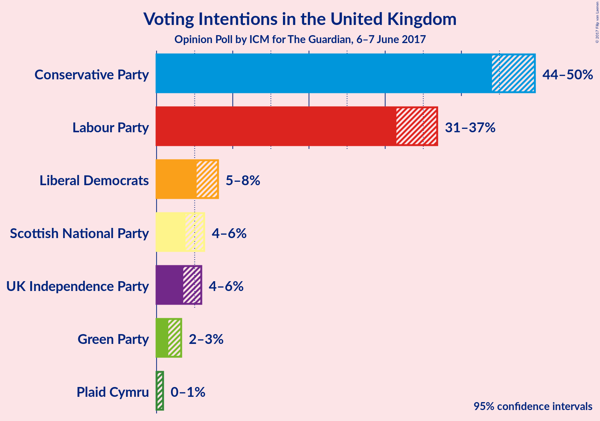
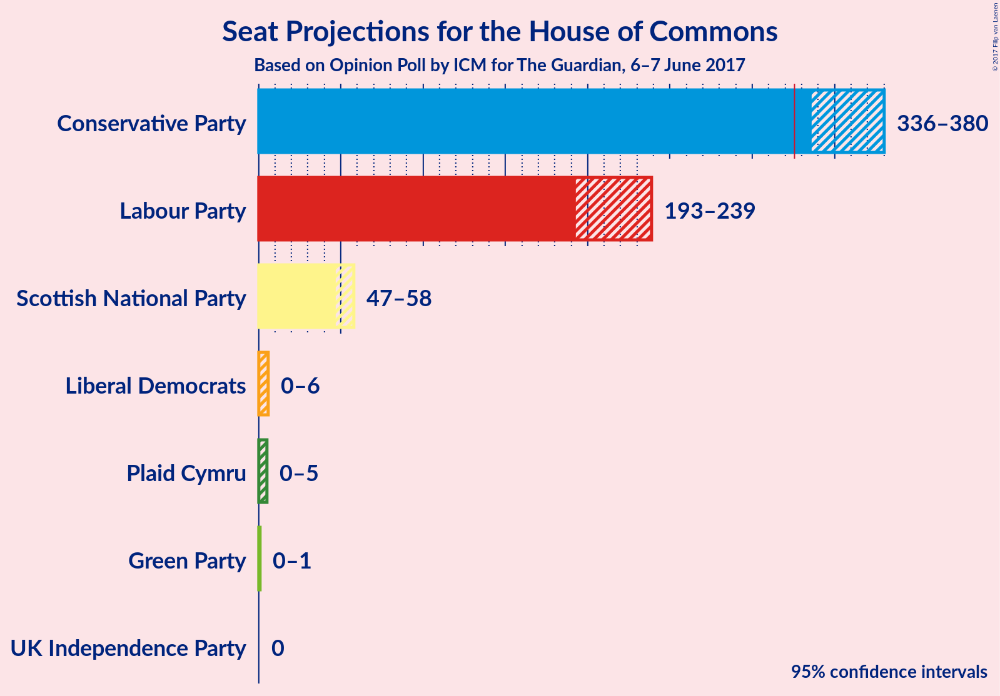
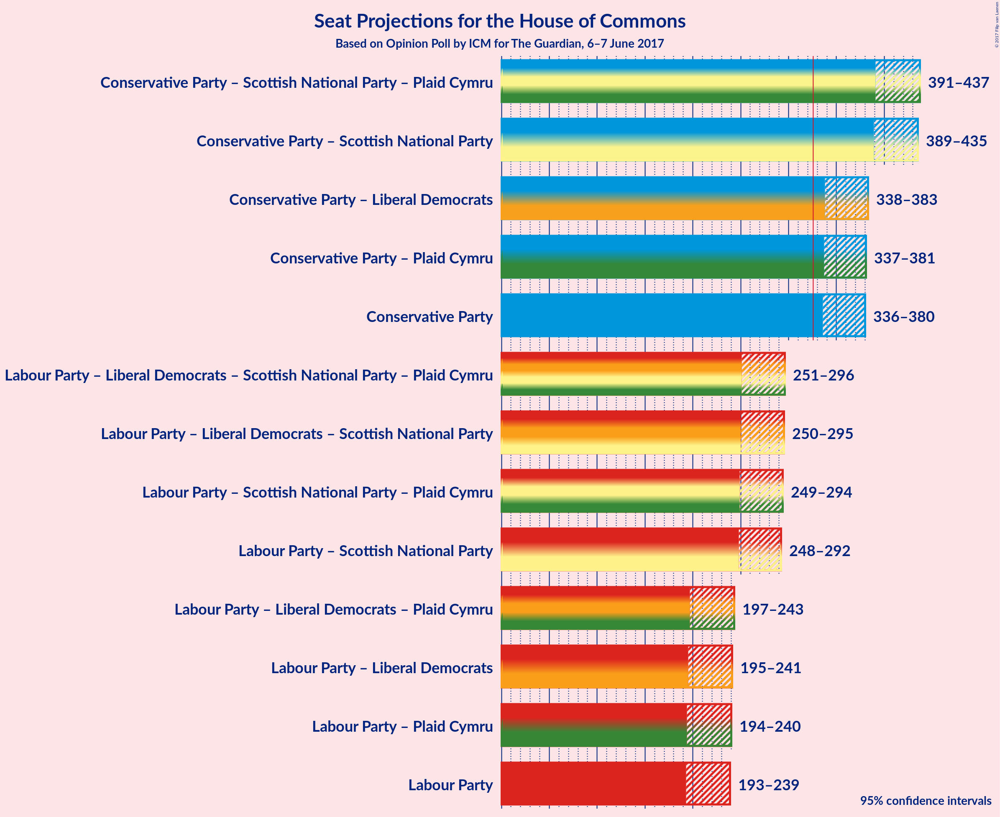

# Opinion Poll by ICM for The Guardian, 6–7 June 2017

<a href="#voting-intentions">Voting Intentions</a> | <a href="#seats">Seats</a> | <a href="#coalitions">Coalitions</a> | <a href="#technical-information">Technical Information</a>

## Voting Intentions

### Confidence Intervals

| Party | Last Result | Poll Result | 80% Confidence Interval | 90% Confidence Interval | 95% Confidence Interval | 99% Confidence Interval |
|:-----:|:-----------:|:-----------:|:-----------------------:|:-----------------------:|:-----------------------:|:-----------------------:|
| Conservative Party | 36.9% | 47.1% | 45.0–48.7% |44.5–49.2% |44.0–49.6% |43.1–50.5% |
| Labour Party | 30.4% | 34.3% | 32.4–35.9% |31.9–36.4% |31.5–36.8% |30.7–37.7% |
| Liberal Democrats | 7.9% | 6.6% | 5.7–7.5% |5.5–7.8% |5.3–8.1% |4.9–8.6% |
| Scottish National Party | 4.7% | 4.9% | 4.2–5.8% |4.0–6.0% |3.8–6.2% |3.5–6.7% |
| UK Independence Party | 12.6% | 4.6% | 3.9–5.4% |3.7–5.7% |3.5–5.9% |3.2–6.3% |
| Green Party | 3.8% | 2.2% | 1.8–2.9% |1.6–3.1% |1.5–3.2% |1.3–3.6% |
| Plaid Cymru | 0.6% | 0.3% | 0.2–0.7% |0.2–0.8% |0.1–0.9% |0.1–1.0% |

*Note:* The poll result column reflects the actual value used in the calculations. Published results may vary slightly, and in addition be rounded to fewer digits.

## Seats

### Confidence Intervals

| Party | Last Result | Median | 80% Confidence Interval | 90% Confidence Interval | 95% Confidence Interval | 99% Confidence Interval |
|:-----:|:-----------:|:------:|:-----------------------:|:-----------------------:|:-----------------------:|:-----------------------:|
| <a href="#conservative-party">Conservative Party</a> | 331 | 355 | 343–371 |339–376 |336–380 |326–386 |
| <a href="#labour-party">Labour Party</a> | 232 | 218 | 201–231 |197–235 |193–239 |187–248 |
| <a href="#liberal-democrats">Liberal Democrats</a> | 8 | 2 | 1–4 |0–5 |0–6 |0–8 |
| <a href="#scottish-national-party">Scottish National Party</a> | 56 | 56 | 52–56 |50–57 |47–58 |38–59 |
| <a href="#uk-independence-party">UK Independence Party</a> | 1 | 0 | 0 |0 |0 |0 |
| <a href="#green-party">Green Party</a> | 1 | 0 | 0–1 |0–1 |0–1 |0–1 |
| <a href="#plaid-cymru">Plaid Cymru</a> | 3 | 0 | 0–4 |0–5 |0–5 |0–5 |

### Conservative Party

| Number of Seats | Probability | Accumulated |
|:---------------:|:-----------:|:-----------:|
| 321 | 0.1% | 100% |
| 322 | 0% | 99.9% |
| 323 | 0.1% | 99.8% |
| 324 | 0.1% | 99.8% |
| 325 | 0.1% | 99.7% |
| 326 | 0.1% | 99.6% |
| 327 | 0.1% | 99.5% |
| 328 | 0.1% | 99.4% |
| 329 | 0.2% | 99.3% |
| 330 | 0.1% | 99.1% |
| 331 | 0.1% | 99.1% |
| 332 | 0.4% | 99.0% |
| 333 | 0.5% | 98.6% |
| 334 | 0.2% | 98% |
| 335 | 0.3% | 98% |
| 336 | 0.4% | 98% |
| 337 | 0.7% | 97% |
| 338 | 1.2% | 97% |
| 339 | 0.5% | 95% |
| 340 | 0.2% | 95% |
| 341 | 0.9% | 95% |
| 342 | 1.1% | 94% |
| 343 | 3% | 93% |
| 344 | 0.7% | 90% |
| 345 | 1.3% | 89% |
| 346 | 0.5% | 88% |
| 347 | 1.2% | 87% |
| 348 | 3% | 86% |
| 349 | 4% | 83% |
| 350 | 5% | 79% |
| 351 | 5% | 74% |
| 352 | 7% | 69% |
| 353 | 5% | 62% |
| 354 | 3% | 57% |
| 355 | 6% | 55% |
| 356 | 4% | 49% |
| 357 | 4% | 44% |
| 358 | 1.1% | 40% |
| 359 | 3% | 39% |
| 360 | 2% | 36% |
| 361 | 3% | 34% |
| 362 | 5% | 31% |
| 363 | 0.4% | 27% |
| 364 | 1.3% | 26% |
| 365 | 0.7% | 25% |
| 366 | 3% | 24% |
| 367 | 2% | 21% |
| 368 | 2% | 19% |
| 369 | 2% | 17% |
| 370 | 2% | 15% |
| 371 | 3% | 13% |
| 372 | 2% | 10% |
| 373 | 0.3% | 8% |
| 374 | 0.7% | 7% |
| 375 | 2% | 7% |
| 376 | 0.5% | 5% |
| 377 | 0.6% | 5% |
| 378 | 0.6% | 4% |
| 379 | 0.3% | 3% |
| 380 | 0.6% | 3% |
| 381 | 0.7% | 2% |
| 382 | 0.3% | 2% |
| 383 | 0.5% | 2% |
| 384 | 0.2% | 1.0% |
| 385 | 0.2% | 0.9% |
| 386 | 0.3% | 0.7% |
| 387 | 0.1% | 0.4% |
| 388 | 0.1% | 0.3% |
| 389 | 0% | 0.2% |
| 390 | 0.1% | 0.2% |
| 391 | 0% | 0.1% |
| 392 | 0% | 0.1% |
| 393 | 0% | 0% |

### Labour Party

| Number of Seats | Probability | Accumulated |
|:---------------:|:-----------:|:-----------:|
| 180 | 0% | 100% |
| 181 | 0% | 99.9% |
| 182 | 0% | 99.9% |
| 183 | 0% | 99.9% |
| 184 | 0% | 99.9% |
| 185 | 0.1% | 99.9% |
| 186 | 0.1% | 99.8% |
| 187 | 0.3% | 99.7% |
| 188 | 0.2% | 99.5% |
| 189 | 0.5% | 99.2% |
| 190 | 0.2% | 98.8% |
| 191 | 0.3% | 98.5% |
| 192 | 0.6% | 98% |
| 193 | 0.5% | 98% |
| 194 | 0.5% | 97% |
| 195 | 0.7% | 97% |
| 196 | 0.2% | 96% |
| 197 | 1.0% | 96% |
| 198 | 0.6% | 95% |
| 199 | 2% | 94% |
| 200 | 0.7% | 92% |
| 201 | 2% | 91% |
| 202 | 0.9% | 89% |
| 203 | 2% | 89% |
| 204 | 4% | 87% |
| 205 | 2% | 83% |
| 206 | 3% | 81% |
| 207 | 3% | 79% |
| 208 | 1.1% | 76% |
| 209 | 2% | 75% |
| 210 | 0.7% | 73% |
| 211 | 1.0% | 72% |
| 212 | 2% | 71% |
| 213 | 2% | 70% |
| 214 | 3% | 68% |
| 215 | 6% | 65% |
| 216 | 4% | 59% |
| 217 | 4% | 55% |
| 218 | 5% | 51% |
| 219 | 4% | 46% |
| 220 | 3% | 42% |
| 221 | 5% | 39% |
| 222 | 6% | 35% |
| 223 | 7% | 28% |
| 224 | 3% | 21% |
| 225 | 1.4% | 18% |
| 226 | 3% | 17% |
| 227 | 0.8% | 14% |
| 228 | 0.8% | 14% |
| 229 | 1.1% | 13% |
| 230 | 2% | 12% |
| 231 | 2% | 10% |
| 232 | 2% | 9% |
| 233 | 0.9% | 7% |
| 234 | 0.7% | 6% |
| 235 | 0.6% | 5% |
| 236 | 1.0% | 5% |
| 237 | 0.3% | 4% |
| 238 | 0.9% | 4% |
| 239 | 0.4% | 3% |
| 240 | 0.5% | 2% |
| 241 | 0.2% | 2% |
| 242 | 0.3% | 2% |
| 243 | 0.1% | 1.2% |
| 244 | 0.1% | 1.1% |
| 245 | 0.2% | 1.0% |
| 246 | 0.1% | 0.8% |
| 247 | 0.1% | 0.7% |
| 248 | 0.1% | 0.6% |
| 249 | 0.1% | 0.4% |
| 250 | 0.1% | 0.3% |
| 251 | 0% | 0.3% |
| 252 | 0.1% | 0.2% |
| 253 | 0% | 0.1% |
| 254 | 0% | 0.1% |
| 255 | 0% | 0.1% |
| 256 | 0% | 0.1% |
| 257 | 0% | 0% |

### Liberal Democrats

| Number of Seats | Probability | Accumulated |
|:---------------:|:-----------:|:-----------:|
| 0 | 7% | 100% |
| 1 | 37% | 93% |
| 2 | 25% | 56% |
| 3 | 15% | 30% |
| 4 | 8% | 16% |
| 5 | 4% | 8% |
| 6 | 3% | 4% |
| 7 | 0.7% | 1.4% |
| 8 | 0.3% | 0.7% |
| 9 | 0.2% | 0.4% |
| 10 | 0.1% | 0.2% |
| 11 | 0.1% | 0.1% |
| 12 | 0% | 0.1% |
| 13 | 0% | 0% |

### Scottish National Party

| Number of Seats | Probability | Accumulated |
|:---------------:|:-----------:|:-----------:|
| 27 | 0% | 100% |
| 28 | 0% | 99.9% |
| 29 | 0% | 99.9% |
| 30 | 0% | 99.9% |
| 31 | 0.1% | 99.9% |
| 32 | 0% | 99.8% |
| 33 | 0% | 99.8% |
| 34 | 0% | 99.8% |
| 35 | 0.1% | 99.8% |
| 36 | 0% | 99.7% |
| 37 | 0.1% | 99.7% |
| 38 | 0.1% | 99.6% |
| 39 | 0% | 99.5% |
| 40 | 0.1% | 99.5% |
| 41 | 0% | 99.4% |
| 42 | 0% | 99.3% |
| 43 | 0% | 99.3% |
| 44 | 0.1% | 99.3% |
| 45 | 0.4% | 99.1% |
| 46 | 1.2% | 98.7% |
| 47 | 0.7% | 98% |
| 48 | 0.7% | 97% |
| 49 | 1.1% | 96% |
| 50 | 2% | 95% |
| 51 | 3% | 93% |
| 52 | 2% | 90% |
| 53 | 4% | 88% |
| 54 | 8% | 84% |
| 55 | 12% | 76% |
| 56 | 54% | 64% |
| 57 | 6% | 10% |
| 58 | 2% | 4% |
| 59 | 2% | 2% |
| 60 | 0% | 0% |

### UK Independence Party

| Number of Seats | Probability | Accumulated |
|:---------------:|:-----------:|:-----------:|
| 0 | 100% | 100% |
| 1 | 0% | 0% |

### Green Party

| Number of Seats | Probability | Accumulated |
|:---------------:|:-----------:|:-----------:|
| 0 | 83% | 100% |
| 1 | 17% | 17% |
| 2 | 0% | 0% |

### Plaid Cymru

| Number of Seats | Probability | Accumulated |
|:---------------:|:-----------:|:-----------:|
| 0 | 59% | 100% |
| 1 | 1.3% | 41% |
| 2 | 6% | 40% |
| 3 | 19% | 34% |
| 4 | 5% | 14% |
| 5 | 10% | 10% |
| 6 | 0% | 0.1% |
| 7 | 0.1% | 0.1% |
| 8 | 0% | 0% |

## Coalitions

### Confidence Intervals

| Coalition | Last Result | Median | 80% Confidence Interval | 90% Confidence Interval | 95% Confidence Interval | 99% Confidence Interval |
|:---------:|:-----------:|:------:|:-----------------------:|:-----------------------:|:-----------------------:|:-----------------------:|
| Conservative Party – Scottish National Party – Plaid Cymru | 390 | 412 | 399–428 | 394–433 | 391–437 | 381–442 |
| Conservative Party – Scottish National Party | 387 | 411 | 399–427 | 393–431 | 389–435 | 380–441 |
| Conservative Party – Liberal Democrats | 339 | 357 | 345–374 | 342–378 | 338–383 | 328–389 |
| Conservative Party – Plaid Cymru | 334 | 357 | 345–373 | 341–377 | 337–381 | 328–387 |
| Conservative Party | 331 | 355 | 343–371 | 339–376 | 336–380 | 326–386 |
| Labour Party – Liberal Democrats – Scottish National Party – Plaid Cymru | 299 | 276 | 261–289 | 256–293 | 251–296 | 246–306 |
| Labour Party – Liberal Democrats – Scottish National Party | 296 | 275 | 259–286 | 254–291 | 250–295 | 245–304 |
| Labour Party – Scottish National Party – Plaid Cymru | 291 | 274 | 258–286 | 253–290 | 249–294 | 243–304 |
| Labour Party – Scottish National Party | 288 | 273 | 256–284 | 252–289 | 248–292 | 242–302 |
| Labour Party – Liberal Democrats – Plaid Cymru | 243 | 221 | 205–233 | 200–238 | 197–243 | 191–252 |
| Labour Party – Liberal Democrats | 240 | 220 | 204–233 | 199–238 | 195–241 | 190–251 |
| Labour Party – Plaid Cymru | 235 | 219 | 203–232 | 199–236 | 194–240 | 189–249 |
| Labour Party | 232 | 218 | 201–231 | 197–235 | 193–239 | 187–248 |

### Conservative Party – Scottish National Party – Plaid Cymru

| Number of Seats | Probability | Accumulated |
|:---------------:|:-----------:|:-----------:|
| 372 | 0% | 100% |
| 373 | 0% | 99.9% |
| 374 | 0% | 99.9% |
| 375 | 0.1% | 99.9% |
| 376 | 0% | 99.9% |
| 377 | 0% | 99.9% |
| 378 | 0.1% | 99.8% |
| 379 | 0.1% | 99.8% |
| 380 | 0.1% | 99.7% |
| 381 | 0.2% | 99.6% |
| 382 | 0% | 99.4% |
| 383 | 0.1% | 99.4% |
| 384 | 0.1% | 99.3% |
| 385 | 0.2% | 99.1% |
| 386 | 0.1% | 99.0% |
| 387 | 0.2% | 98.8% |
| 388 | 0.4% | 98.6% |
| 389 | 0.2% | 98% |
| 390 | 0.4% | 98% |
| 391 | 0.9% | 98% |
| 392 | 0.5% | 97% |
| 393 | 0.8% | 96% |
| 394 | 0.7% | 96% |
| 395 | 0.4% | 95% |
| 396 | 0.6% | 94% |
| 397 | 1.1% | 94% |
| 398 | 0.8% | 93% |
| 399 | 3% | 92% |
| 400 | 0.8% | 89% |
| 401 | 2% | 88% |
| 402 | 0.5% | 87% |
| 403 | 2% | 86% |
| 404 | 0.8% | 84% |
| 405 | 4% | 83% |
| 406 | 3% | 80% |
| 407 | 5% | 77% |
| 408 | 8% | 72% |
| 409 | 2% | 64% |
| 410 | 5% | 62% |
| 411 | 6% | 57% |
| 412 | 3% | 52% |
| 413 | 6% | 49% |
| 414 | 3% | 43% |
| 415 | 3% | 40% |
| 416 | 4% | 37% |
| 417 | 2% | 32% |
| 418 | 1.3% | 30% |
| 419 | 1.5% | 29% |
| 420 | 1.0% | 27% |
| 421 | 2% | 26% |
| 422 | 2% | 25% |
| 423 | 3% | 23% |
| 424 | 2% | 20% |
| 425 | 3% | 19% |
| 426 | 1.4% | 15% |
| 427 | 3% | 14% |
| 428 | 1.2% | 11% |
| 429 | 1.0% | 9% |
| 430 | 2% | 8% |
| 431 | 1.3% | 7% |
| 432 | 0.6% | 6% |
| 433 | 0.6% | 5% |
| 434 | 0.8% | 4% |
| 435 | 0.3% | 4% |
| 436 | 0.8% | 3% |
| 437 | 0.8% | 3% |
| 438 | 0.1% | 2% |
| 439 | 0.3% | 2% |
| 440 | 0.4% | 1.4% |
| 441 | 0.3% | 1.0% |
| 442 | 0.3% | 0.7% |
| 443 | 0.1% | 0.4% |
| 444 | 0% | 0.2% |
| 445 | 0.1% | 0.2% |
| 446 | 0% | 0.1% |
| 447 | 0% | 0.1% |
| 448 | 0% | 0.1% |
| 449 | 0% | 0% |

### Conservative Party – Scottish National Party

| Number of Seats | Probability | Accumulated |
|:---------------:|:-----------:|:-----------:|
| 371 | 0% | 100% |
| 372 | 0% | 99.9% |
| 373 | 0% | 99.9% |
| 374 | 0% | 99.9% |
| 375 | 0.1% | 99.9% |
| 376 | 0% | 99.8% |
| 377 | 0% | 99.8% |
| 378 | 0.1% | 99.8% |
| 379 | 0.1% | 99.7% |
| 380 | 0.1% | 99.6% |
| 381 | 0.2% | 99.5% |
| 382 | 0.1% | 99.3% |
| 383 | 0.1% | 99.2% |
| 384 | 0.2% | 99.1% |
| 385 | 0.2% | 98.9% |
| 386 | 0.1% | 98.7% |
| 387 | 0.2% | 98.6% |
| 388 | 0.6% | 98% |
| 389 | 0.5% | 98% |
| 390 | 0.4% | 97% |
| 391 | 1.0% | 97% |
| 392 | 0.3% | 96% |
| 393 | 0.8% | 96% |
| 394 | 2% | 95% |
| 395 | 0.4% | 93% |
| 396 | 0.6% | 93% |
| 397 | 0.6% | 92% |
| 398 | 0.7% | 92% |
| 399 | 4% | 91% |
| 400 | 0.8% | 87% |
| 401 | 1.2% | 86% |
| 402 | 0.8% | 85% |
| 403 | 3% | 84% |
| 404 | 3% | 82% |
| 405 | 4% | 79% |
| 406 | 7% | 75% |
| 407 | 5% | 69% |
| 408 | 7% | 63% |
| 409 | 1.1% | 57% |
| 410 | 5% | 56% |
| 411 | 6% | 51% |
| 412 | 3% | 45% |
| 413 | 4% | 42% |
| 414 | 1.2% | 38% |
| 415 | 4% | 37% |
| 416 | 4% | 34% |
| 417 | 2% | 29% |
| 418 | 2% | 27% |
| 419 | 0.3% | 25% |
| 420 | 1.4% | 25% |
| 421 | 2% | 24% |
| 422 | 3% | 22% |
| 423 | 2% | 19% |
| 424 | 2% | 17% |
| 425 | 3% | 16% |
| 426 | 1.4% | 13% |
| 427 | 3% | 12% |
| 428 | 1.0% | 8% |
| 429 | 0.8% | 7% |
| 430 | 0.4% | 6% |
| 431 | 1.4% | 6% |
| 432 | 0.5% | 4% |
| 433 | 0.6% | 4% |
| 434 | 0.5% | 3% |
| 435 | 0.3% | 3% |
| 436 | 0.5% | 2% |
| 437 | 0.6% | 2% |
| 438 | 0.2% | 1.4% |
| 439 | 0.3% | 1.1% |
| 440 | 0.3% | 0.9% |
| 441 | 0.2% | 0.6% |
| 442 | 0.2% | 0.4% |
| 443 | 0.1% | 0.2% |
| 444 | 0% | 0.1% |
| 445 | 0% | 0.1% |
| 446 | 0% | 0.1% |
| 447 | 0% | 0% |

### Conservative Party – Liberal Democrats

| Number of Seats | Probability | Accumulated |
|:---------------:|:-----------:|:-----------:|
| 323 | 0.1% | 100% |
| 324 | 0% | 99.9% |
| 325 | 0.1% | 99.9% |
| 326 | 0.1% | 99.8% |
| 327 | 0.1% | 99.7% |
| 328 | 0.1% | 99.6% |
| 329 | 0.1% | 99.5% |
| 330 | 0.1% | 99.4% |
| 331 | 0.2% | 99.4% |
| 332 | 0.1% | 99.1% |
| 333 | 0.2% | 99.1% |
| 334 | 0.4% | 98.9% |
| 335 | 0.3% | 98% |
| 336 | 0.3% | 98% |
| 337 | 0.3% | 98% |
| 338 | 0.5% | 98% |
| 339 | 0.5% | 97% |
| 340 | 0.9% | 97% |
| 341 | 0.6% | 96% |
| 342 | 0.5% | 95% |
| 343 | 1.0% | 95% |
| 344 | 1.1% | 94% |
| 345 | 3% | 92% |
| 346 | 0.9% | 90% |
| 347 | 0.9% | 89% |
| 348 | 0.8% | 88% |
| 349 | 2% | 87% |
| 350 | 2% | 85% |
| 351 | 4% | 83% |
| 352 | 5% | 79% |
| 353 | 8% | 74% |
| 354 | 4% | 66% |
| 355 | 3% | 62% |
| 356 | 4% | 59% |
| 357 | 5% | 55% |
| 358 | 5% | 50% |
| 359 | 3% | 45% |
| 360 | 3% | 42% |
| 361 | 3% | 39% |
| 362 | 3% | 36% |
| 363 | 4% | 34% |
| 364 | 0.8% | 30% |
| 365 | 2% | 29% |
| 366 | 2% | 27% |
| 367 | 1.3% | 25% |
| 368 | 2% | 24% |
| 369 | 2% | 22% |
| 370 | 3% | 19% |
| 371 | 2% | 17% |
| 372 | 3% | 15% |
| 373 | 2% | 12% |
| 374 | 2% | 11% |
| 375 | 0.6% | 9% |
| 376 | 1.4% | 8% |
| 377 | 0.7% | 7% |
| 378 | 1.1% | 6% |
| 379 | 0.7% | 5% |
| 380 | 0.2% | 4% |
| 381 | 0.7% | 4% |
| 382 | 0.5% | 3% |
| 383 | 0.4% | 3% |
| 384 | 0.6% | 2% |
| 385 | 0.5% | 2% |
| 386 | 0.3% | 1.3% |
| 387 | 0.3% | 1.0% |
| 388 | 0.1% | 0.6% |
| 389 | 0.1% | 0.5% |
| 390 | 0.1% | 0.4% |
| 391 | 0.1% | 0.4% |
| 392 | 0.1% | 0.2% |
| 393 | 0% | 0.1% |
| 394 | 0% | 0.1% |
| 395 | 0% | 0.1% |
| 396 | 0% | 0.1% |
| 397 | 0% | 0% |

### Conservative Party – Plaid Cymru

| Number of Seats | Probability | Accumulated |
|:---------------:|:-----------:|:-----------:|
| 322 | 0% | 100% |
| 323 | 0% | 99.9% |
| 324 | 0.1% | 99.9% |
| 325 | 0.1% | 99.8% |
| 326 | 0.1% | 99.7% |
| 327 | 0.1% | 99.6% |
| 328 | 0.1% | 99.6% |
| 329 | 0.2% | 99.5% |
| 330 | 0.1% | 99.3% |
| 331 | 0% | 99.2% |
| 332 | 0.4% | 99.1% |
| 333 | 0.2% | 98.8% |
| 334 | 0.2% | 98.5% |
| 335 | 0.2% | 98% |
| 336 | 0.4% | 98% |
| 337 | 0.4% | 98% |
| 338 | 0.8% | 97% |
| 339 | 0.6% | 97% |
| 340 | 0.4% | 96% |
| 341 | 0.8% | 95% |
| 342 | 0.9% | 95% |
| 343 | 1.4% | 94% |
| 344 | 1.0% | 92% |
| 345 | 1.4% | 91% |
| 346 | 1.4% | 90% |
| 347 | 0.4% | 89% |
| 348 | 2% | 88% |
| 349 | 3% | 86% |
| 350 | 2% | 83% |
| 351 | 4% | 81% |
| 352 | 9% | 77% |
| 353 | 4% | 68% |
| 354 | 3% | 64% |
| 355 | 5% | 61% |
| 356 | 4% | 56% |
| 357 | 5% | 52% |
| 358 | 4% | 47% |
| 359 | 4% | 43% |
| 360 | 3% | 39% |
| 361 | 3% | 37% |
| 362 | 4% | 34% |
| 363 | 0.6% | 30% |
| 364 | 1.4% | 29% |
| 365 | 2% | 28% |
| 366 | 2% | 26% |
| 367 | 2% | 24% |
| 368 | 2% | 22% |
| 369 | 3% | 20% |
| 370 | 2% | 17% |
| 371 | 3% | 15% |
| 372 | 2% | 12% |
| 373 | 0.6% | 10% |
| 374 | 2% | 10% |
| 375 | 2% | 8% |
| 376 | 0.6% | 6% |
| 377 | 0.7% | 6% |
| 378 | 0.7% | 5% |
| 379 | 0.2% | 4% |
| 380 | 0.8% | 4% |
| 381 | 0.8% | 3% |
| 382 | 0.4% | 2% |
| 383 | 0.4% | 2% |
| 384 | 0.2% | 2% |
| 385 | 0.3% | 1.4% |
| 386 | 0.5% | 1.1% |
| 387 | 0.2% | 0.6% |
| 388 | 0.1% | 0.4% |
| 389 | 0.1% | 0.3% |
| 390 | 0.1% | 0.2% |
| 391 | 0.1% | 0.2% |
| 392 | 0% | 0.1% |
| 393 | 0% | 0.1% |
| 394 | 0% | 0% |

### Conservative Party

| Number of Seats | Probability | Accumulated |
|:---------------:|:-----------:|:-----------:|
| 321 | 0.1% | 100% |
| 322 | 0% | 99.9% |
| 323 | 0.1% | 99.8% |
| 324 | 0.1% | 99.8% |
| 325 | 0.1% | 99.7% |
| 326 | 0.1% | 99.6% |
| 327 | 0.1% | 99.5% |
| 328 | 0.1% | 99.4% |
| 329 | 0.2% | 99.3% |
| 330 | 0.1% | 99.1% |
| 331 | 0.1% | 99.1% |
| 332 | 0.4% | 99.0% |
| 333 | 0.5% | 98.6% |
| 334 | 0.2% | 98% |
| 335 | 0.3% | 98% |
| 336 | 0.4% | 98% |
| 337 | 0.7% | 97% |
| 338 | 1.2% | 97% |
| 339 | 0.5% | 95% |
| 340 | 0.2% | 95% |
| 341 | 0.9% | 95% |
| 342 | 1.1% | 94% |
| 343 | 3% | 93% |
| 344 | 0.7% | 90% |
| 345 | 1.3% | 89% |
| 346 | 0.5% | 88% |
| 347 | 1.2% | 87% |
| 348 | 3% | 86% |
| 349 | 4% | 83% |
| 350 | 5% | 79% |
| 351 | 5% | 74% |
| 352 | 7% | 69% |
| 353 | 5% | 62% |
| 354 | 3% | 57% |
| 355 | 6% | 55% |
| 356 | 4% | 49% |
| 357 | 4% | 44% |
| 358 | 1.1% | 40% |
| 359 | 3% | 39% |
| 360 | 2% | 36% |
| 361 | 3% | 34% |
| 362 | 5% | 31% |
| 363 | 0.4% | 27% |
| 364 | 1.3% | 26% |
| 365 | 0.7% | 25% |
| 366 | 3% | 24% |
| 367 | 2% | 21% |
| 368 | 2% | 19% |
| 369 | 2% | 17% |
| 370 | 2% | 15% |
| 371 | 3% | 13% |
| 372 | 2% | 10% |
| 373 | 0.3% | 8% |
| 374 | 0.7% | 7% |
| 375 | 2% | 7% |
| 376 | 0.5% | 5% |
| 377 | 0.6% | 5% |
| 378 | 0.6% | 4% |
| 379 | 0.3% | 3% |
| 380 | 0.6% | 3% |
| 381 | 0.7% | 2% |
| 382 | 0.3% | 2% |
| 383 | 0.5% | 2% |
| 384 | 0.2% | 1.0% |
| 385 | 0.2% | 0.9% |
| 386 | 0.3% | 0.7% |
| 387 | 0.1% | 0.4% |
| 388 | 0.1% | 0.3% |
| 389 | 0% | 0.2% |
| 390 | 0.1% | 0.2% |
| 391 | 0% | 0.1% |
| 392 | 0% | 0.1% |
| 393 | 0% | 0% |

### Labour Party – Liberal Democrats – Scottish National Party – Plaid Cymru

| Number of Seats | Probability | Accumulated |
|:---------------:|:-----------:|:-----------:|
| 240 | 0% | 100% |
| 241 | 0% | 99.9% |
| 242 | 0.1% | 99.9% |
| 243 | 0% | 99.8% |
| 244 | 0.1% | 99.8% |
| 245 | 0.1% | 99.7% |
| 246 | 0.3% | 99.6% |
| 247 | 0.2% | 99.2% |
| 248 | 0.1% | 99.1% |
| 249 | 0.6% | 99.0% |
| 250 | 0.3% | 98% |
| 251 | 0.7% | 98% |
| 252 | 0.5% | 97% |
| 253 | 0.3% | 97% |
| 254 | 0.5% | 97% |
| 255 | 0.6% | 96% |
| 256 | 1.3% | 95% |
| 257 | 1.0% | 94% |
| 258 | 0.7% | 93% |
| 259 | 0.3% | 92% |
| 260 | 2% | 92% |
| 261 | 4% | 90% |
| 262 | 1.2% | 86% |
| 263 | 2% | 85% |
| 264 | 2% | 83% |
| 265 | 3% | 81% |
| 266 | 2% | 77% |
| 267 | 0.6% | 76% |
| 268 | 1.2% | 75% |
| 269 | 0.8% | 74% |
| 270 | 5% | 73% |
| 271 | 3% | 68% |
| 272 | 2% | 65% |
| 273 | 2% | 63% |
| 274 | 1.3% | 61% |
| 275 | 5% | 60% |
| 276 | 6% | 55% |
| 277 | 4% | 49% |
| 278 | 3% | 45% |
| 279 | 5% | 43% |
| 280 | 8% | 37% |
| 281 | 4% | 29% |
| 282 | 5% | 25% |
| 283 | 3% | 20% |
| 284 | 3% | 17% |
| 285 | 1.2% | 14% |
| 286 | 1.0% | 13% |
| 287 | 0.8% | 12% |
| 288 | 0.8% | 11% |
| 289 | 3% | 10% |
| 290 | 1.4% | 7% |
| 291 | 0.6% | 6% |
| 292 | 0.3% | 5% |
| 293 | 0.6% | 5% |
| 294 | 1.1% | 5% |
| 295 | 0.7% | 3% |
| 296 | 0.4% | 3% |
| 297 | 0.3% | 2% |
| 298 | 0.2% | 2% |
| 299 | 0.5% | 2% |
| 300 | 0.4% | 1.4% |
| 301 | 0.1% | 1.0% |
| 302 | 0.1% | 0.9% |
| 303 | 0.2% | 0.8% |
| 304 | 0.1% | 0.7% |
| 305 | 0.1% | 0.6% |
| 306 | 0.1% | 0.5% |
| 307 | 0.1% | 0.4% |
| 308 | 0.1% | 0.3% |
| 309 | 0.1% | 0.2% |
| 310 | 0% | 0.1% |
| 311 | 0.1% | 0.1% |
| 312 | 0% | 0% |

### Labour Party – Liberal Democrats – Scottish National Party

| Number of Seats | Probability | Accumulated |
|:---------------:|:-----------:|:-----------:|
| 239 | 0% | 100% |
| 240 | 0% | 99.9% |
| 241 | 0.1% | 99.9% |
| 242 | 0.1% | 99.8% |
| 243 | 0.1% | 99.8% |
| 244 | 0.2% | 99.7% |
| 245 | 0.2% | 99.5% |
| 246 | 0.6% | 99.4% |
| 247 | 0.2% | 98.8% |
| 248 | 0.3% | 98.6% |
| 249 | 0.4% | 98% |
| 250 | 0.5% | 98% |
| 251 | 0.8% | 97% |
| 252 | 0.7% | 97% |
| 253 | 0.2% | 96% |
| 254 | 0.7% | 96% |
| 255 | 0.7% | 95% |
| 256 | 1.2% | 94% |
| 257 | 1.0% | 93% |
| 258 | 2% | 92% |
| 259 | 0.6% | 90% |
| 260 | 2% | 90% |
| 261 | 4% | 87% |
| 262 | 1.0% | 84% |
| 263 | 3% | 83% |
| 264 | 2% | 79% |
| 265 | 3% | 77% |
| 266 | 1.4% | 75% |
| 267 | 1.0% | 73% |
| 268 | 2% | 72% |
| 269 | 0.5% | 71% |
| 270 | 4% | 70% |
| 271 | 3% | 66% |
| 272 | 3% | 63% |
| 273 | 3% | 59% |
| 274 | 4% | 56% |
| 275 | 5% | 52% |
| 276 | 6% | 48% |
| 277 | 3% | 42% |
| 278 | 3% | 39% |
| 279 | 4% | 36% |
| 280 | 10% | 31% |
| 281 | 3% | 22% |
| 282 | 2% | 19% |
| 283 | 3% | 17% |
| 284 | 2% | 14% |
| 285 | 0.4% | 12% |
| 286 | 1.5% | 11% |
| 287 | 2% | 10% |
| 288 | 0.9% | 8% |
| 289 | 1.3% | 7% |
| 290 | 0.9% | 6% |
| 291 | 0.8% | 5% |
| 292 | 0.4% | 5% |
| 293 | 0.7% | 4% |
| 294 | 0.8% | 3% |
| 295 | 0.4% | 3% |
| 296 | 0.4% | 2% |
| 297 | 0.3% | 2% |
| 298 | 0.1% | 2% |
| 299 | 0.2% | 1.5% |
| 300 | 0.4% | 1.2% |
| 301 | 0% | 0.9% |
| 302 | 0.1% | 0.8% |
| 303 | 0.1% | 0.7% |
| 304 | 0.1% | 0.5% |
| 305 | 0.1% | 0.4% |
| 306 | 0.1% | 0.4% |
| 307 | 0.1% | 0.3% |
| 308 | 0.1% | 0.2% |
| 309 | 0% | 0.1% |
| 310 | 0% | 0.1% |
| 311 | 0% | 0% |

### Labour Party – Scottish National Party – Plaid Cymru

| Number of Seats | Probability | Accumulated |
|:---------------:|:-----------:|:-----------:|
| 236 | 0% | 100% |
| 237 | 0% | 99.9% |
| 238 | 0% | 99.9% |
| 239 | 0% | 99.9% |
| 240 | 0.1% | 99.9% |
| 241 | 0.1% | 99.8% |
| 242 | 0.1% | 99.6% |
| 243 | 0.1% | 99.6% |
| 244 | 0.1% | 99.4% |
| 245 | 0.4% | 99.3% |
| 246 | 0.3% | 99.0% |
| 247 | 0.5% | 98.7% |
| 248 | 0.5% | 98% |
| 249 | 0.5% | 98% |
| 250 | 0.4% | 97% |
| 251 | 0.7% | 97% |
| 252 | 0.2% | 96% |
| 253 | 1.1% | 96% |
| 254 | 0.7% | 95% |
| 255 | 1.0% | 94% |
| 256 | 1.1% | 93% |
| 257 | 1.2% | 92% |
| 258 | 2% | 91% |
| 259 | 2% | 89% |
| 260 | 3% | 88% |
| 261 | 2% | 85% |
| 262 | 3% | 83% |
| 263 | 3% | 80% |
| 264 | 1.0% | 77% |
| 265 | 1.5% | 76% |
| 266 | 2% | 75% |
| 267 | 3% | 73% |
| 268 | 0.4% | 70% |
| 269 | 4% | 70% |
| 270 | 4% | 66% |
| 271 | 2% | 63% |
| 272 | 3% | 61% |
| 273 | 3% | 57% |
| 274 | 6% | 54% |
| 275 | 4% | 48% |
| 276 | 4% | 45% |
| 277 | 3% | 41% |
| 278 | 5% | 38% |
| 279 | 7% | 32% |
| 280 | 5% | 25% |
| 281 | 4% | 20% |
| 282 | 2% | 17% |
| 283 | 2% | 15% |
| 284 | 1.3% | 13% |
| 285 | 0.5% | 11% |
| 286 | 1.0% | 11% |
| 287 | 2% | 10% |
| 288 | 1.4% | 8% |
| 289 | 0.7% | 6% |
| 290 | 0.5% | 5% |
| 291 | 0.6% | 5% |
| 292 | 0.9% | 4% |
| 293 | 0.4% | 3% |
| 294 | 0.6% | 3% |
| 295 | 0.3% | 2% |
| 296 | 0.3% | 2% |
| 297 | 0.3% | 2% |
| 298 | 0.4% | 2% |
| 299 | 0.2% | 1.1% |
| 300 | 0.1% | 0.9% |
| 301 | 0.2% | 0.9% |
| 302 | 0.1% | 0.6% |
| 303 | 0.1% | 0.6% |
| 304 | 0.1% | 0.5% |
| 305 | 0.2% | 0.4% |
| 306 | 0% | 0.3% |
| 307 | 0.1% | 0.2% |
| 308 | 0% | 0.1% |
| 309 | 0.1% | 0.1% |
| 310 | 0% | 0% |

### Labour Party – Scottish National Party

| Number of Seats | Probability | Accumulated |
|:---------------:|:-----------:|:-----------:|
| 236 | 0% | 100% |
| 237 | 0% | 99.9% |
| 238 | 0% | 99.9% |
| 239 | 0.1% | 99.8% |
| 240 | 0.1% | 99.7% |
| 241 | 0.1% | 99.7% |
| 242 | 0.1% | 99.5% |
| 243 | 0.3% | 99.4% |
| 244 | 0.3% | 99.2% |
| 245 | 0.5% | 98.8% |
| 246 | 0.4% | 98% |
| 247 | 0.4% | 98% |
| 248 | 0.7% | 98% |
| 249 | 0.5% | 97% |
| 250 | 0.4% | 96% |
| 251 | 0.8% | 96% |
| 252 | 0.4% | 95% |
| 253 | 1.3% | 95% |
| 254 | 0.8% | 94% |
| 255 | 2% | 93% |
| 256 | 0.7% | 91% |
| 257 | 2% | 90% |
| 258 | 0.8% | 88% |
| 259 | 2% | 87% |
| 260 | 4% | 85% |
| 261 | 2% | 81% |
| 262 | 2% | 80% |
| 263 | 3% | 77% |
| 264 | 1.2% | 74% |
| 265 | 2% | 73% |
| 266 | 1.0% | 71% |
| 267 | 2% | 70% |
| 268 | 0.9% | 69% |
| 269 | 4% | 68% |
| 270 | 5% | 63% |
| 271 | 3% | 58% |
| 272 | 4% | 56% |
| 273 | 3% | 52% |
| 274 | 7% | 49% |
| 275 | 3% | 42% |
| 276 | 5% | 38% |
| 277 | 3% | 34% |
| 278 | 6% | 31% |
| 279 | 6% | 24% |
| 280 | 2% | 18% |
| 281 | 3% | 16% |
| 282 | 0.8% | 14% |
| 283 | 2% | 13% |
| 284 | 1.2% | 11% |
| 285 | 0.8% | 10% |
| 286 | 1.4% | 9% |
| 287 | 2% | 8% |
| 288 | 0.4% | 6% |
| 289 | 0.6% | 5% |
| 290 | 0.6% | 5% |
| 291 | 0.8% | 4% |
| 292 | 0.8% | 3% |
| 293 | 0.2% | 2% |
| 294 | 0.3% | 2% |
| 295 | 0.4% | 2% |
| 296 | 0.2% | 2% |
| 297 | 0.2% | 1.4% |
| 298 | 0.3% | 1.2% |
| 299 | 0.1% | 0.9% |
| 300 | 0.1% | 0.8% |
| 301 | 0.2% | 0.7% |
| 302 | 0.1% | 0.5% |
| 303 | 0.1% | 0.4% |
| 304 | 0% | 0.4% |
| 305 | 0.1% | 0.3% |
| 306 | 0% | 0.2% |
| 307 | 0.1% | 0.1% |
| 308 | 0.1% | 0.1% |
| 309 | 0% | 0% |

### Labour Party – Liberal Democrats – Plaid Cymru

| Number of Seats | Probability | Accumulated |
|:---------------:|:-----------:|:-----------:|
| 186 | 0% | 100% |
| 187 | 0% | 99.9% |
| 188 | 0% | 99.9% |
| 189 | 0.1% | 99.9% |
| 190 | 0.3% | 99.8% |
| 191 | 0.1% | 99.5% |
| 192 | 0.3% | 99.4% |
| 193 | 0.3% | 99.1% |
| 194 | 0.3% | 98.8% |
| 195 | 0.6% | 98.5% |
| 196 | 0.4% | 98% |
| 197 | 0.4% | 98% |
| 198 | 0.5% | 97% |
| 199 | 0.6% | 97% |
| 200 | 1.3% | 96% |
| 201 | 0.7% | 95% |
| 202 | 0.4% | 94% |
| 203 | 0.8% | 94% |
| 204 | 1.1% | 93% |
| 205 | 4% | 92% |
| 206 | 0.9% | 88% |
| 207 | 3% | 87% |
| 208 | 2% | 84% |
| 209 | 2% | 82% |
| 210 | 3% | 80% |
| 211 | 1.2% | 77% |
| 212 | 0.9% | 76% |
| 213 | 0.4% | 75% |
| 214 | 2% | 75% |
| 215 | 2% | 72% |
| 216 | 5% | 70% |
| 217 | 3% | 66% |
| 218 | 1.2% | 63% |
| 219 | 4% | 62% |
| 220 | 5% | 58% |
| 221 | 5% | 53% |
| 222 | 4% | 48% |
| 223 | 1.4% | 44% |
| 224 | 8% | 43% |
| 225 | 4% | 35% |
| 226 | 7% | 31% |
| 227 | 3% | 24% |
| 228 | 3% | 21% |
| 229 | 3% | 18% |
| 230 | 0.6% | 15% |
| 231 | 1.1% | 15% |
| 232 | 0.9% | 14% |
| 233 | 4% | 13% |
| 234 | 0.9% | 9% |
| 235 | 0.4% | 8% |
| 236 | 0.6% | 8% |
| 237 | 0.5% | 7% |
| 238 | 2% | 7% |
| 239 | 0.8% | 5% |
| 240 | 0.3% | 4% |
| 241 | 0.9% | 4% |
| 242 | 0.5% | 3% |
| 243 | 0.4% | 3% |
| 244 | 0.6% | 2% |
| 245 | 0.2% | 2% |
| 246 | 0.1% | 1.4% |
| 247 | 0.2% | 1.3% |
| 248 | 0.2% | 1.1% |
| 249 | 0.1% | 0.9% |
| 250 | 0.1% | 0.8% |
| 251 | 0.2% | 0.7% |
| 252 | 0.1% | 0.5% |
| 253 | 0.1% | 0.4% |
| 254 | 0.1% | 0.3% |
| 255 | 0% | 0.2% |
| 256 | 0% | 0.2% |
| 257 | 0.1% | 0.2% |
| 258 | 0% | 0.1% |
| 259 | 0% | 0.1% |
| 260 | 0% | 0.1% |
| 261 | 0% | 0.1% |
| 262 | 0% | 0% |

### Labour Party – Liberal Democrats

| Number of Seats | Probability | Accumulated |
|:---------------:|:-----------:|:-----------:|
| 184 | 0% | 100% |
| 185 | 0% | 99.9% |
| 186 | 0% | 99.9% |
| 187 | 0.1% | 99.9% |
| 188 | 0% | 99.8% |
| 189 | 0.1% | 99.8% |
| 190 | 0.4% | 99.6% |
| 191 | 0.2% | 99.2% |
| 192 | 0.4% | 99.0% |
| 193 | 0.3% | 98.6% |
| 194 | 0.2% | 98% |
| 195 | 0.7% | 98% |
| 196 | 0.7% | 97% |
| 197 | 0.4% | 97% |
| 198 | 0.8% | 96% |
| 199 | 0.5% | 95% |
| 200 | 1.2% | 95% |
| 201 | 0.7% | 94% |
| 202 | 1.5% | 93% |
| 203 | 1.0% | 92% |
| 204 | 1.4% | 91% |
| 205 | 4% | 89% |
| 206 | 0.5% | 85% |
| 207 | 3% | 84% |
| 208 | 2% | 81% |
| 209 | 2% | 79% |
| 210 | 2% | 76% |
| 211 | 1.1% | 75% |
| 212 | 1.0% | 74% |
| 213 | 1.4% | 73% |
| 214 | 1.3% | 71% |
| 215 | 3% | 70% |
| 216 | 5% | 67% |
| 217 | 3% | 62% |
| 218 | 3% | 59% |
| 219 | 6% | 56% |
| 220 | 5% | 51% |
| 221 | 4% | 46% |
| 222 | 4% | 42% |
| 223 | 2% | 38% |
| 224 | 9% | 36% |
| 225 | 4% | 27% |
| 226 | 3% | 23% |
| 227 | 3% | 20% |
| 228 | 0.7% | 17% |
| 229 | 2% | 16% |
| 230 | 0.7% | 14% |
| 231 | 2% | 13% |
| 232 | 0.6% | 11% |
| 233 | 3% | 11% |
| 234 | 0.6% | 8% |
| 235 | 1.1% | 7% |
| 236 | 0.6% | 6% |
| 237 | 0.4% | 6% |
| 238 | 0.9% | 5% |
| 239 | 0.7% | 4% |
| 240 | 0.4% | 4% |
| 241 | 0.9% | 3% |
| 242 | 0.4% | 2% |
| 243 | 0.1% | 2% |
| 244 | 0.4% | 2% |
| 245 | 0.2% | 1.3% |
| 246 | 0.1% | 1.2% |
| 247 | 0.2% | 1.0% |
| 248 | 0.1% | 0.9% |
| 249 | 0.1% | 0.7% |
| 250 | 0.1% | 0.6% |
| 251 | 0.2% | 0.6% |
| 252 | 0.1% | 0.4% |
| 253 | 0.1% | 0.3% |
| 254 | 0.1% | 0.2% |
| 255 | 0% | 0.2% |
| 256 | 0% | 0.1% |
| 257 | 0.1% | 0.1% |
| 258 | 0% | 0.1% |
| 259 | 0% | 0.1% |
| 260 | 0% | 0.1% |
| 261 | 0% | 0% |

### Labour Party – Plaid Cymru

| Number of Seats | Probability | Accumulated |
|:---------------:|:-----------:|:-----------:|
| 182 | 0% | 100% |
| 183 | 0% | 99.9% |
| 184 | 0% | 99.9% |
| 185 | 0% | 99.9% |
| 186 | 0.1% | 99.9% |
| 187 | 0.2% | 99.8% |
| 188 | 0.1% | 99.7% |
| 189 | 0.3% | 99.6% |
| 190 | 0.2% | 99.2% |
| 191 | 0.2% | 99.0% |
| 192 | 0.6% | 98.8% |
| 193 | 0.5% | 98% |
| 194 | 0.5% | 98% |
| 195 | 0.6% | 97% |
| 196 | 0.1% | 97% |
| 197 | 0.8% | 97% |
| 198 | 0.5% | 96% |
| 199 | 1.3% | 95% |
| 200 | 0.9% | 94% |
| 201 | 1.1% | 93% |
| 202 | 1.2% | 92% |
| 203 | 2% | 91% |
| 204 | 3% | 89% |
| 205 | 1.5% | 86% |
| 206 | 3% | 85% |
| 207 | 3% | 82% |
| 208 | 1.2% | 79% |
| 209 | 2% | 78% |
| 210 | 1.3% | 76% |
| 211 | 1.5% | 75% |
| 212 | 1.5% | 73% |
| 213 | 1.1% | 72% |
| 214 | 3% | 71% |
| 215 | 5% | 67% |
| 216 | 3% | 63% |
| 217 | 2% | 59% |
| 218 | 5% | 57% |
| 219 | 4% | 52% |
| 220 | 4% | 49% |
| 221 | 3% | 45% |
| 222 | 4% | 42% |
| 223 | 6% | 38% |
| 224 | 8% | 32% |
| 225 | 4% | 24% |
| 226 | 4% | 20% |
| 227 | 0.8% | 16% |
| 228 | 1.0% | 15% |
| 229 | 1.0% | 14% |
| 230 | 1.1% | 13% |
| 231 | 2% | 12% |
| 232 | 2% | 11% |
| 233 | 0.9% | 8% |
| 234 | 0.4% | 7% |
| 235 | 1.3% | 7% |
| 236 | 1.0% | 6% |
| 237 | 0.4% | 5% |
| 238 | 1.1% | 4% |
| 239 | 0.2% | 3% |
| 240 | 0.4% | 3% |
| 241 | 0.4% | 2% |
| 242 | 0.3% | 2% |
| 243 | 0.4% | 2% |
| 244 | 0.2% | 1.3% |
| 245 | 0.1% | 1.2% |
| 246 | 0.2% | 1.0% |
| 247 | 0.1% | 0.8% |
| 248 | 0.1% | 0.7% |
| 249 | 0.2% | 0.6% |
| 250 | 0.1% | 0.4% |
| 251 | 0.1% | 0.4% |
| 252 | 0.1% | 0.3% |
| 253 | 0% | 0.2% |
| 254 | 0% | 0.2% |
| 255 | 0% | 0.1% |
| 256 | 0% | 0.1% |
| 257 | 0% | 0.1% |
| 258 | 0% | 0% |

### Labour Party

| Number of Seats | Probability | Accumulated |
|:---------------:|:-----------:|:-----------:|
| 180 | 0% | 100% |
| 181 | 0% | 99.9% |
| 182 | 0% | 99.9% |
| 183 | 0% | 99.9% |
| 184 | 0% | 99.9% |
| 185 | 0.1% | 99.9% |
| 186 | 0.1% | 99.8% |
| 187 | 0.3% | 99.7% |
| 188 | 0.2% | 99.5% |
| 189 | 0.5% | 99.2% |
| 190 | 0.2% | 98.8% |
| 191 | 0.3% | 98.5% |
| 192 | 0.6% | 98% |
| 193 | 0.5% | 98% |
| 194 | 0.5% | 97% |
| 195 | 0.7% | 97% |
| 196 | 0.2% | 96% |
| 197 | 1.0% | 96% |
| 198 | 0.6% | 95% |
| 199 | 2% | 94% |
| 200 | 0.7% | 92% |
| 201 | 2% | 91% |
| 202 | 0.9% | 89% |
| 203 | 2% | 89% |
| 204 | 4% | 87% |
| 205 | 2% | 83% |
| 206 | 3% | 81% |
| 207 | 3% | 79% |
| 208 | 1.1% | 76% |
| 209 | 2% | 75% |
| 210 | 0.7% | 73% |
| 211 | 1.0% | 72% |
| 212 | 2% | 71% |
| 213 | 2% | 70% |
| 214 | 3% | 68% |
| 215 | 6% | 65% |
| 216 | 4% | 59% |
| 217 | 4% | 55% |
| 218 | 5% | 51% |
| 219 | 4% | 46% |
| 220 | 3% | 42% |
| 221 | 5% | 39% |
| 222 | 6% | 35% |
| 223 | 7% | 28% |
| 224 | 3% | 21% |
| 225 | 1.4% | 18% |
| 226 | 3% | 17% |
| 227 | 0.8% | 14% |
| 228 | 0.8% | 14% |
| 229 | 1.1% | 13% |
| 230 | 2% | 12% |
| 231 | 2% | 10% |
| 232 | 2% | 9% |
| 233 | 0.9% | 7% |
| 234 | 0.7% | 6% |
| 235 | 0.6% | 5% |
| 236 | 1.0% | 5% |
| 237 | 0.3% | 4% |
| 238 | 0.9% | 4% |
| 239 | 0.4% | 3% |
| 240 | 0.5% | 2% |
| 241 | 0.2% | 2% |
| 242 | 0.3% | 2% |
| 243 | 0.1% | 1.2% |
| 244 | 0.1% | 1.1% |
| 245 | 0.2% | 1.0% |
| 246 | 0.1% | 0.8% |
| 247 | 0.1% | 0.7% |
| 248 | 0.1% | 0.6% |
| 249 | 0.1% | 0.4% |
| 250 | 0.1% | 0.3% |
| 251 | 0% | 0.3% |
| 252 | 0.1% | 0.2% |
| 253 | 0% | 0.1% |
| 254 | 0% | 0.1% |
| 255 | 0% | 0.1% |
| 256 | 0% | 0.1% |
| 257 | 0% | 0% |

## Technical Information

### Opinion Poll

+ **Pollster:** ICM
+ **Media:** The Guardian
+ **Fieldwork period:** 6–7 June 2017

### Calculations

+ **Sample size:** 1204
+ **Simulations done:** 1,048,576
+ **Error estimate:** 1.63%

