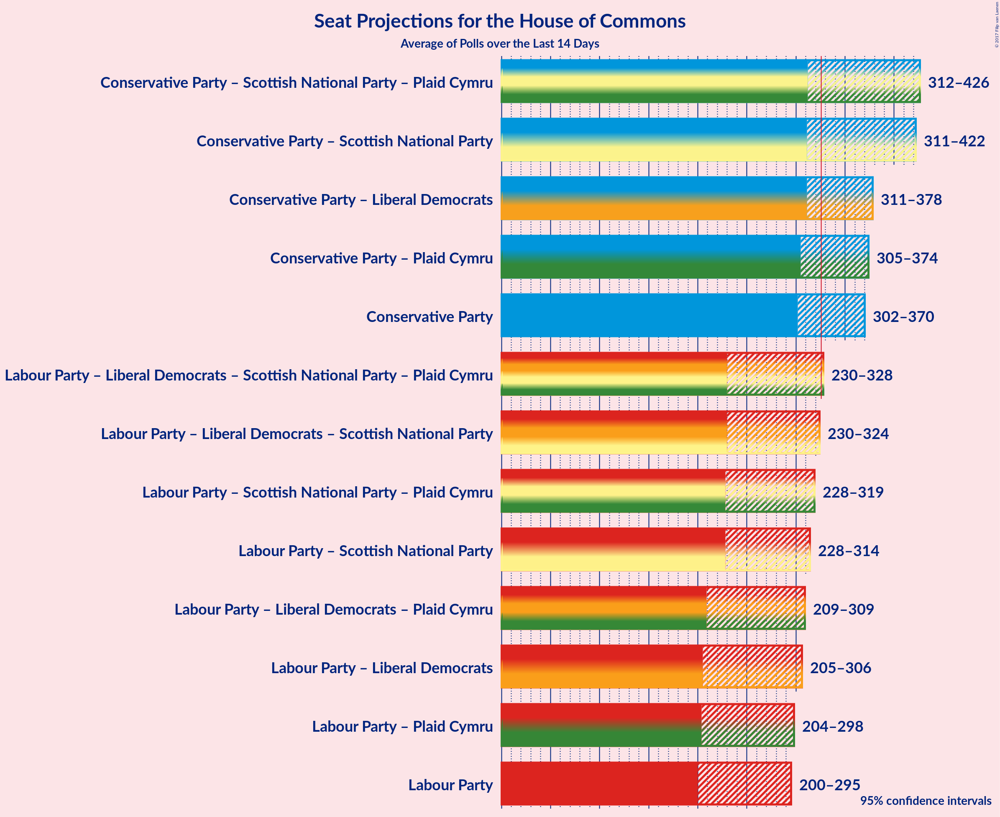

# Poll Average

<a href="#voting-intentions">Voting Intentions</a> | <a href="#seats">Seats</a> | <a href="#coalitions">Coalitions</a> | <a href="#technical-information">Technical Information</a>

The table below lists the polls on which the average is based. They are the most recent polls (less than 14 days old) registered and analyzed so far.

| Period     | Pollster/Media   | CON | LAB | UKIP | LIBDEM | SNP | GREEN | PC | BNP |
|:----------:|:----------------:|:--:|:--:|:--:|:--:|:--:|:--:|:--:|:--:|
| 7 May 2015 | General Election | 36.9%   331 | 30.4%   232 | 12.6%   1 | 7.9%   8 | 4.7%   56 | 3.8%   1 | 0.6%   3 | 0.0%   0 |
| N/A | Poll Average | 302–370 | 200–295 | 0 | 0–22 | 2–56 | 0–1 | 0–8 | 0 |
| [5–7 June 2017](2017-06-07-YouGov.html) | YouGov   The Times | 39–43%   296–336 | 35–39%   232–279 | 4–6%   0 | 9–11%   9–27 | 3–5%   17–54 | 1–3%   0 | 0–1%   0–4 | N/A   N/A |
| [6–7 June 2017](2017-06-07-Survation.html) | Survation   Mail on Sunday | 39–44%   289–324 | 38–42%   251–308 | 2–3%   0 | 7–9%   2–14 | 3–4%   5–51 | 2–3%   0 | 1–2%   5–13 | N/A   N/A |
| [2–7 June 2017](2017-06-07-Panelbase.html) | Panelbase | 42–47%   322–355 | 34–38%   220–263 | 4–5%   0 | 6–8%   1–9 | 3–5%   24–56 | 2–3%   0–1 | 0–1%   0–5 | N/A   N/A |
| [1–7 June 2017](2017-06-07-Kantar.html) | Kantar Public | 41–45%   312–342 | 36–40%   233–279 | 3–5%   0 | 6–8%   1–9 | 3–5%   20–55 | 1–3%   0 | N/A   N/A | N/A   N/A |
| [6–7 June 2017](2017-06-07-ICM.html) | ICM   The Guardian | 44–50%   336–380 | 31–37%   193–239 | 4–6%   0 | 5–8%   0–6 | 4–6%   47–58 | 2–3%   0–1 | 0–1%   0–5 | N/A   N/A |
| [5–7 June 2017](2017-06-07-ComRes.html) | ComRes   The Independent | 42–47%   319–367 | 32–37%   201–261 | 4–6%   0 | 8–11%   6–25 | 3–5%   14–55 | 2–3%   0–1 | 0–1%   0–7 | 0–0%   0 |
| [6–7 June 2017](2017-06-07-BMG.html) | BMG Research   The Herald | 43–48%   337–382 | 30–35%   187–240 | 4–6%   0 | 7–10%   1–16 | 3–5%   24–56 | 2–4%   0–1 | 1–2%   3–8 | N/A   N/A |
| [4–6 June 2017](2017-06-06-Opinium.html) | Opinium | 41–46%   315–350 | 34–38%   219–256 | 4–6%   0 | 7–9%   1–12 | 4–6%   45–57 | 2–3%   0–1 | 0–1%   0–5 | N/A   N/A |
| [31 May–1 June May 2017](2017-06-01-Norstat.html) | Norstat | 36–42%   292–345 | 32–38%   221–272 | 5–8%   0 | 6–10%   2–18 | N/A   N/A | 2–4%   0–1 | N/A   N/A | N/A   N/A |
| [30 May–1 June 2017](2017-06-01-Ipsos-MORI.html) | Ipsos MORI   Evening Standard | 42–48%   308–354 | 37–43%   251–308 | 1–3%   0 | 6–9%   2–14 | 2–4%   0–42 | 1–3%   0 | 0–1%   0–5 | N/A   N/A |
| [24–25 May 2017](2017-05-25-SurveyMonkey.html) | SurveyMonkey   The Sun | 43–45%   325–349 | 35–37%   222–247 | 4–5%   0 | 5–7%   0–2 | N/A   N/A | N/A   N/A | N/A   N/A | N/A   N/A |
| [24–25 May 2017](2017-05-25-ORB.html) | ORB   Sunday Telegraph | 41–46%   314–352 | 35–40%   225–285 | 4–6%   0 | 6–9%   2–14 | 3–5%   8–55 | N/A   N/A | 0–1%   0–5 | N/A   N/A |
| 7 May 2015 | General Election | 36.9%   331 | 30.4%   232 | 12.6%   1 | 7.9%   8 | 4.7%   56 | 3.8%   1 | 0.6%   3 | 0.0%   0 |

Only polls for which at least the sample size has been published are included in the table above.

**Legend:**
+ **Top half of each row:** Voting intentions (95% confidence interval)
+ **Bottom half of each row:** Seat projections for the House of Commons (95% confidence interval)
+ **CON:** Conservative Party
+ **LAB:** Labour Party
+ **UKIP:** UK Independence Party
+ **LIBDEM:** Liberal Democrats
+ **SNP:** Scottish National Party
+ **GREEN:** Green Party
+ **PC:** Plaid Cymru
+ **BNP:** British National Party
+ **N/A (single party):** Party not included the published results
+ **N/A (entire row):** Calculation for this opinion poll not started yet

## Voting Intentions

## Seats

### Confidence Intervals

| Party | Last Result | Median | 80% Confidence Interval | 90% Confidence Interval | 95% Confidence Interval | 99% Confidence Interval |
|:-----:|:-----------:|:------:|:-----------------------:|:-----------------------:|:-----------------------:|:-----------------------:|
| <a href="#conservative-party">Conservative Party</a> | 331 | 332 | 312–356 |307–365 | 302–370 | 290–381 |
| <a href="#labour-party">Labour Party</a> | 232 | 244 | 216–280 |206–290 | 200–295 | 190–306 |
| <a href="#uk-independence-party">UK Independence Party</a> | 1 | 0 | 0 |0 | 0 | 0 |
| <a href="#liberal-democrats">Liberal Democrats</a> | 8 | 5 | 1–16 |0–19 | 0–22 | 0–27 |
| <a href="#scottish-national-party">Scottish National Party</a> | 56 | 48 | 12–55 |4–56 | 2–56 | 0–58 |
| <a href="#green-party">Green Party</a> | 1 | 0 | 0–1 |0–1 | 0–1 | 0–1 |
| <a href="#plaid-cymru">Plaid Cymru</a> | 3 | 3 | 0–7 |0–8 | 0–8 | 0–12 |
| <a href="#british-national-party">British National Party</a> | 0 | 0 | 0 |0 | 0 | 0 |

### Conservative Party

| Number of Seats | Probability | Accumulated |
|:---------------:|:-----------:|:-----------:|
| 276 | 0% | 100% |
| 277 | 0% | 99.9% |
| 278 | 0% | 99.9% |
| 279 | 0% | 99.9% |
| 280 | 0% | 99.9% |
| 281 | 0% | 99.9% |
| 282 | 0% | 99.9% |
| 283 | 0% | 99.8% |
| 284 | 0% | 99.8% |
| 285 | 0% | 99.8% |
| 286 | 0% | 99.8% |
| 287 | 0.1% | 99.7% |
| 288 | 0.1% | 99.7% |
| 289 | 0.1% | 99.6% |
| 290 | 0.1% | 99.5% |
| 291 | 0.1% | 99.4% |
| 292 | 0.1% | 99.3% |
| 293 | 0% | 99.2% |
| 294 | 0.1% | 99.2% |
| 295 | 0.1% | 99.1% |
| 296 | 0.2% | 99.0% |
| 297 | 0.2% | 98.8% |
| 298 | 0.2% | 98.7% |
| 299 | 0.3% | 98% |
| 300 | 0.2% | 98% |
| 301 | 0.3% | 98% |
| 302 | 0.3% | 98% |
| 303 | 0.4% | 97% |
| 304 | 0.4% | 97% |
| 305 | 0.6% | 96% |
| 306 | 0.5% | 96% |
| 307 | 0.7% | 95% |
| 308 | 1.1% | 94% |
| 309 | 0.7% | 93% |
| 310 | 1.4% | 93% |
| 311 | 1.0% | 91% |
| 312 | 1.2% | 90% |
| 313 | 1.1% | 89% |
| 314 | 2% | 88% |
| 315 | 1.5% | 86% |
| 316 | 2% | 85% |
| 317 | 2% | 83% |
| 318 | 3% | 81% |
| 319 | 2% | 78% |
| 320 | 3% | 77% |
| 321 | 3% | 74% |
| 322 | 2% | 71% |
| 323 | 3% | 69% |
| 324 | 3% | 66% |
| 325 | 2% | 63% |
| 326 | 2% | 62% |
| 327 | 2% | 60% |
| 328 | 2% | 58% |
| 329 | 2% | 56% |
| 330 | 2% | 54% |
| 331 | 2% | 52% |
| 332 | 2% | 50% |
| 333 | 2% | 48% |
| 334 | 2% | 46% |
| 335 | 1.4% | 44% |
| 336 | 2% | 43% |
| 337 | 2% | 41% |
| 338 | 2% | 39% |
| 339 | 2% | 37% |
| 340 | 1.5% | 35% |
| 341 | 2% | 33% |
| 342 | 2% | 32% |
| 343 | 2% | 30% |
| 344 | 1.1% | 28% |
| 345 | 1.3% | 27% |
| 346 | 2% | 25% |
| 347 | 2% | 24% |
| 348 | 1.4% | 22% |
| 349 | 3% | 20% |
| 350 | 2% | 17% |
| 351 | 1.3% | 16% |
| 352 | 1.3% | 15% |
| 353 | 1.0% | 13% |
| 354 | 1.0% | 12% |
| 355 | 1.2% | 11% |
| 356 | 1.0% | 10% |
| 357 | 0.8% | 9% |
| 358 | 0.4% | 8% |
| 359 | 0.4% | 8% |
| 360 | 0.4% | 8% |
| 361 | 0.6% | 7% |
| 362 | 0.6% | 7% |
| 363 | 0.3% | 6% |
| 364 | 0.4% | 6% |
| 365 | 0.4% | 5% |
| 366 | 0.6% | 5% |
| 367 | 0.7% | 4% |
| 368 | 0.5% | 4% |
| 369 | 0.4% | 3% |
| 370 | 0.3% | 3% |
| 371 | 0.4% | 2% |
| 372 | 0.3% | 2% |
| 373 | 0.2% | 2% |
| 374 | 0.2% | 1.5% |
| 375 | 0.2% | 1.3% |
| 376 | 0.1% | 1.1% |
| 377 | 0.1% | 1.0% |
| 378 | 0.1% | 0.9% |
| 379 | 0.1% | 0.7% |
| 380 | 0.1% | 0.6% |
| 381 | 0.1% | 0.5% |
| 382 | 0.1% | 0.4% |
| 383 | 0.1% | 0.3% |
| 384 | 0% | 0.2% |
| 385 | 0% | 0.2% |
| 386 | 0.1% | 0.1% |
| 387 | 0% | 0.1% |
| 388 | 0% | 0.1% |
| 389 | 0% | 0% |

### Labour Party

| Number of Seats | Probability | Accumulated |
|:---------------:|:-----------:|:-----------:|
| 182 | 0% | 100% |
| 183 | 0% | 99.9% |
| 184 | 0% | 99.9% |
| 185 | 0% | 99.9% |
| 186 | 0.1% | 99.8% |
| 187 | 0.1% | 99.8% |
| 188 | 0.1% | 99.7% |
| 189 | 0.1% | 99.6% |
| 190 | 0.1% | 99.5% |
| 191 | 0.1% | 99.4% |
| 192 | 0.1% | 99.3% |
| 193 | 0.2% | 99.2% |
| 194 | 0.1% | 99.1% |
| 195 | 0.2% | 98.9% |
| 196 | 0.1% | 98.8% |
| 197 | 0.2% | 98.7% |
| 198 | 0.2% | 98% |
| 199 | 0.4% | 98% |
| 200 | 0.4% | 98% |
| 201 | 0.4% | 97% |
| 202 | 0.4% | 97% |
| 203 | 0.4% | 97% |
| 204 | 0.6% | 96% |
| 205 | 0.4% | 96% |
| 206 | 0.5% | 95% |
| 207 | 0.5% | 95% |
| 208 | 0.2% | 94% |
| 209 | 0.3% | 94% |
| 210 | 0.4% | 94% |
| 211 | 0.4% | 93% |
| 212 | 0.4% | 93% |
| 213 | 0.7% | 93% |
| 214 | 0.9% | 92% |
| 215 | 0.9% | 91% |
| 216 | 1.0% | 90% |
| 217 | 1.1% | 89% |
| 218 | 2% | 88% |
| 219 | 1.1% | 87% |
| 220 | 1.2% | 85% |
| 221 | 1.1% | 84% |
| 222 | 1.4% | 83% |
| 223 | 1.3% | 82% |
| 224 | 1.2% | 80% |
| 225 | 1.4% | 79% |
| 226 | 1.0% | 78% |
| 227 | 1.1% | 77% |
| 228 | 2% | 76% |
| 229 | 1.1% | 74% |
| 230 | 1.0% | 73% |
| 231 | 2% | 72% |
| 232 | 2% | 70% |
| 233 | 2% | 69% |
| 234 | 2% | 67% |
| 235 | 1.3% | 65% |
| 236 | 2% | 63% |
| 237 | 2% | 62% |
| 238 | 2% | 60% |
| 239 | 1.4% | 58% |
| 240 | 2% | 57% |
| 241 | 1.4% | 55% |
| 242 | 2% | 54% |
| 243 | 1.2% | 52% |
| 244 | 1.5% | 51% |
| 245 | 2% | 49% |
| 246 | 2% | 48% |
| 247 | 2% | 46% |
| 248 | 3% | 44% |
| 249 | 2% | 41% |
| 250 | 1.4% | 39% |
| 251 | 2% | 38% |
| 252 | 2% | 36% |
| 253 | 2% | 34% |
| 254 | 2% | 32% |
| 255 | 1.3% | 30% |
| 256 | 1.2% | 29% |
| 257 | 1.2% | 27% |
| 258 | 1.2% | 26% |
| 259 | 1.3% | 25% |
| 260 | 1.1% | 24% |
| 261 | 0.9% | 23% |
| 262 | 0.7% | 22% |
| 263 | 0.9% | 21% |
| 264 | 0.6% | 20% |
| 265 | 0.8% | 19% |
| 266 | 0.5% | 19% |
| 267 | 0.6% | 18% |
| 268 | 0.6% | 17% |
| 269 | 1.0% | 17% |
| 270 | 0.5% | 16% |
| 271 | 0.5% | 15% |
| 272 | 0.8% | 15% |
| 273 | 0.5% | 14% |
| 274 | 0.6% | 13% |
| 275 | 0.5% | 13% |
| 276 | 0.6% | 12% |
| 277 | 0.5% | 12% |
| 278 | 0.5% | 11% |
| 279 | 0.6% | 11% |
| 280 | 0.4% | 10% |
| 281 | 0.5% | 10% |
| 282 | 0.3% | 9% |
| 283 | 0.4% | 9% |
| 284 | 0.4% | 8% |
| 285 | 0.7% | 8% |
| 286 | 0.6% | 7% |
| 287 | 0.5% | 7% |
| 288 | 0.7% | 6% |
| 289 | 0.6% | 6% |
| 290 | 0.6% | 5% |
| 291 | 0.5% | 4% |
| 292 | 0.3% | 4% |
| 293 | 0.4% | 4% |
| 294 | 0.2% | 3% |
| 295 | 0.5% | 3% |
| 296 | 0.4% | 2% |
| 297 | 0.5% | 2% |
| 298 | 0.2% | 2% |
| 299 | 0.1% | 1.4% |
| 300 | 0.2% | 1.2% |
| 301 | 0.1% | 1.0% |
| 302 | 0.1% | 0.9% |
| 303 | 0.1% | 0.8% |
| 304 | 0.1% | 0.7% |
| 305 | 0.1% | 0.6% |
| 306 | 0.1% | 0.5% |
| 307 | 0% | 0.5% |
| 308 | 0.1% | 0.4% |
| 309 | 0% | 0.4% |
| 310 | 0.1% | 0.3% |
| 311 | 0% | 0.3% |
| 312 | 0% | 0.2% |
| 313 | 0% | 0.2% |
| 314 | 0% | 0.2% |
| 315 | 0% | 0.2% |
| 316 | 0% | 0.1% |
| 317 | 0% | 0.1% |
| 318 | 0% | 0.1% |
| 319 | 0% | 0.1% |
| 320 | 0% | 0.1% |
| 321 | 0% | 0.1% |
| 322 | 0% | 0.1% |
| 323 | 0% | 0% |

### UK Independence Party

| Number of Seats | Probability | Accumulated |
|:---------------:|:-----------:|:-----------:|
| 0 | 100% | 100% |
| 1 | 0% | 0% |

### Liberal Democrats

| Number of Seats | Probability | Accumulated |
|:---------------:|:-----------:|:-----------:|
| 0 | 5% | 100% |
| 1 | 5% | 95% |
| 2 | 11% | 89% |
| 3 | 11% | 78% |
| 4 | 8% | 67% |
| 5 | 9% | 59% |
| 6 | 6% | 50% |
| 7 | 5% | 44% |
| 8 | 6% | 38% |
| 9 | 5% | 32% |
| 10 | 4% | 27% |
| 11 | 4% | 24% |
| 12 | 3% | 20% |
| 13 | 2% | 16% |
| 14 | 2% | 14% |
| 15 | 2% | 12% |
| 16 | 2% | 10% |
| 17 | 1.2% | 8% |
| 18 | 1.2% | 7% |
| 19 | 1.2% | 6% |
| 20 | 0.8% | 5% |
| 21 | 1.2% | 4% |
| 22 | 0.6% | 3% |
| 23 | 0.6% | 2% |
| 24 | 0.4% | 2% |
| 25 | 0.6% | 1.3% |
| 26 | 0.2% | 0.7% |
| 27 | 0.3% | 0.5% |
| 28 | 0.1% | 0.2% |
| 29 | 0.1% | 0.1% |
| 30 | 0% | 0.1% |
| 31 | 0% | 0% |

### Scottish National Party

| Number of Seats | Probability | Accumulated |
|:---------------:|:-----------:|:-----------:|
| 0 | 0.8% | 100% |
| 1 | 1.4% | 99.2% |
| 2 | 1.3% | 98% |
| 3 | 1.0% | 97% |
| 4 | 0.7% | 95% |
| 5 | 0.8% | 95% |
| 6 | 0.6% | 94% |
| 7 | 0.7% | 93% |
| 8 | 0.7% | 93% |
| 9 | 0.6% | 92% |
| 10 | 0.4% | 91% |
| 11 | 0.7% | 91% |
| 12 | 0.3% | 90% |
| 13 | 0.4% | 90% |
| 14 | 0.9% | 89% |
| 15 | 0.3% | 89% |
| 16 | 0.4% | 88% |
| 17 | 0.7% | 88% |
| 18 | 0.7% | 87% |
| 19 | 0.4% | 86% |
| 20 | 0.7% | 86% |
| 21 | 0.6% | 85% |
| 22 | 0.7% | 85% |
| 23 | 0.4% | 84% |
| 24 | 0.5% | 83% |
| 25 | 0.8% | 83% |
| 26 | 0.6% | 82% |
| 27 | 0.9% | 82% |
| 28 | 0.9% | 81% |
| 29 | 0.8% | 80% |
| 30 | 1.2% | 79% |
| 31 | 1.2% | 78% |
| 32 | 1.0% | 77% |
| 33 | 1.1% | 76% |
| 34 | 0.8% | 75% |
| 35 | 0.9% | 74% |
| 36 | 1.0% | 73% |
| 37 | 1.0% | 72% |
| 38 | 0.9% | 71% |
| 39 | 2% | 70% |
| 40 | 1.2% | 68% |
| 41 | 2% | 67% |
| 42 | 2% | 66% |
| 43 | 1.4% | 64% |
| 44 | 2% | 63% |
| 45 | 3% | 61% |
| 46 | 3% | 58% |
| 47 | 4% | 54% |
| 48 | 4% | 51% |
| 49 | 4% | 47% |
| 50 | 5% | 43% |
| 51 | 5% | 38% |
| 52 | 5% | 33% |
| 53 | 4% | 28% |
| 54 | 7% | 24% |
| 55 | 7% | 17% |
| 56 | 8% | 10% |
| 57 | 1.0% | 2% |
| 58 | 0.5% | 0.6% |
| 59 | 0.2% | 0.2% |
| 60 | 0% | 0% |

### Green Party

| Number of Seats | Probability | Accumulated |
|:---------------:|:-----------:|:-----------:|
| 0 | 81% | 100% |
| 1 | 19% | 19% |
| 2 | 0% | 0% |

### Plaid Cymru

| Number of Seats | Probability | Accumulated |
|:---------------:|:-----------:|:-----------:|
| 0 | 20% | 100% |
| 1 | 7% | 80% |
| 2 | 5% | 73% |
| 3 | 26% | 69% |
| 4 | 9% | 43% |
| 5 | 18% | 34% |
| 6 | 0.9% | 15% |
| 7 | 9% | 15% |
| 8 | 4% | 6% |
| 9 | 0.4% | 2% |
| 10 | 0.3% | 1.2% |
| 11 | 0.3% | 0.8% |
| 12 | 0.1% | 0.5% |
| 13 | 0.4% | 0.5% |
| 14 | 0% | 0.1% |
| 15 | 0% | 0% |

### British National Party

| Number of Seats | Probability | Accumulated |
|:---------------:|:-----------:|:-----------:|
| 0 | 100% | 100% |
| 1 | 0% | 0% |

## Coalitions

### Confidence Intervals

| Coalition | Last Result | Median | 80% Confidence Interval | 90% Confidence Interval | 95% Confidence Interval | 99% Confidence Interval |
|:---------:|:-----------:|:------:|:-----------------------:|:-----------------------:|:-----------------------:|:-----------------------:|
| Conservative Party – Scottish National Party – Plaid Cymru | 390 | 372 | 327–411 | 318–420 | 312–426 | 299–436 |
| Conservative Party – Scottish National Party | 387 | 370 | 326–407 | 318–416 | 311–422 | 297–432 |
| Conservative Party – Liberal Democrats | 339 | 338 | 321–364 | 317–371 | 311–378 | 299–387 |
| Conservative Party – Plaid Cymru | 334 | 333 | 315–359 | 310–368 | 305–374 | 294–385 |
| Conservative Party | 331 | 332 | 312–356 | 307–365 | 302–370 | 290–381 |
| Labour Party – Liberal Democrats – Scottish National Party – Plaid Cymru | 299 | 293 | 247–318 | 234–324 | 230–328 | 224–340 |
| Labour Party – Liberal Democrats – Scottish National Party | 296 | 291 | 246–314 | 234–320 | 230–324 | 224–334 |
| Labour Party – Scottish National Party – Plaid Cymru | 291 | 287 | 242–308 | 233–313 | 228–319 | 222–330 |
| Labour Party – Scottish National Party | 288 | 284 | 241–305 | 233–309 | 228–314 | 222–324 |
| Labour Party – Liberal Democrats – Plaid Cymru | 243 | 253 | 224–293 | 216–302 | 209–309 | 199–322 |
| Labour Party – Liberal Democrats | 240 | 251 | 221–290 | 212–300 | 205–306 | 195–317 |
| Labour Party – Plaid Cymru | 235 | 246 | 219–284 | 210–293 | 204–298 | 194–312 |
| Labour Party | 232 | 244 | 216–280 | 206–290 | 200–295 | 190–306 |

### Conservative Party – Scottish National Party – Plaid Cymru

| Number of Seats | Probability | Accumulated |
|:---------------:|:-----------:|:-----------:|
| 279 | 0% | 100% |
| 280 | 0% | 99.9% |
| 281 | 0% | 99.9% |
| 282 | 0% | 99.9% |
| 283 | 0% | 99.9% |
| 284 | 0% | 99.9% |
| 285 | 0% | 99.9% |
| 286 | 0% | 99.9% |
| 287 | 0% | 99.9% |
| 288 | 0% | 99.9% |
| 289 | 0% | 99.8% |
| 290 | 0% | 99.8% |
| 291 | 0% | 99.8% |
| 292 | 0% | 99.8% |
| 293 | 0% | 99.8% |
| 294 | 0% | 99.7% |
| 295 | 0% | 99.7% |
| 296 | 0.1% | 99.7% |
| 297 | 0.1% | 99.6% |
| 298 | 0% | 99.6% |
| 299 | 0% | 99.5% |
| 300 | 0.1% | 99.5% |
| 301 | 0.1% | 99.4% |
| 302 | 0.1% | 99.3% |
| 303 | 0.1% | 99.2% |
| 304 | 0.1% | 99.1% |
| 305 | 0.1% | 99.0% |
| 306 | 0.1% | 98.8% |
| 307 | 0.2% | 98.7% |
| 308 | 0.2% | 98.5% |
| 309 | 0.2% | 98% |
| 310 | 0.2% | 98% |
| 311 | 0.3% | 98% |
| 312 | 0.4% | 98% |
| 313 | 0.4% | 97% |
| 314 | 0.4% | 97% |
| 315 | 0.3% | 96% |
| 316 | 0.3% | 96% |
| 317 | 0.4% | 96% |
| 318 | 0.7% | 95% |
| 319 | 0.4% | 95% |
| 320 | 0.6% | 94% |
| 321 | 0.5% | 94% |
| 322 | 0.5% | 93% |
| 323 | 0.4% | 93% |
| 324 | 0.7% | 92% |
| 325 | 0.5% | 92% |
| 326 | 0.6% | 91% |
| 327 | 0.4% | 90% |
| 328 | 0.5% | 90% |
| 329 | 0.7% | 89% |
| 330 | 1.1% | 89% |
| 331 | 0.9% | 88% |
| 332 | 0.7% | 87% |
| 333 | 1.2% | 86% |
| 334 | 1.3% | 85% |
| 335 | 0.7% | 84% |
| 336 | 1.0% | 83% |
| 337 | 1.4% | 82% |
| 338 | 1.3% | 80% |
| 339 | 1.0% | 79% |
| 340 | 0.9% | 78% |
| 341 | 1.0% | 77% |
| 342 | 1.1% | 76% |
| 343 | 1.4% | 75% |
| 344 | 0.5% | 74% |
| 345 | 0.6% | 73% |
| 346 | 0.7% | 73% |
| 347 | 0.8% | 72% |
| 348 | 0.8% | 71% |
| 349 | 0.5% | 70% |
| 350 | 0.7% | 70% |
| 351 | 0.7% | 69% |
| 352 | 0.7% | 68% |
| 353 | 0.8% | 68% |
| 354 | 0.6% | 67% |
| 355 | 1.4% | 66% |
| 356 | 0.7% | 65% |
| 357 | 0.6% | 64% |
| 358 | 0.8% | 64% |
| 359 | 0.7% | 63% |
| 360 | 0.7% | 62% |
| 361 | 0.8% | 62% |
| 362 | 0.8% | 61% |
| 363 | 0.7% | 60% |
| 364 | 1.0% | 59% |
| 365 | 1.1% | 58% |
| 366 | 0.8% | 57% |
| 367 | 1.4% | 56% |
| 368 | 1.5% | 55% |
| 369 | 1.2% | 54% |
| 370 | 0.9% | 52% |
| 371 | 1.4% | 51% |
| 372 | 1.0% | 50% |
| 373 | 1.3% | 49% |
| 374 | 1.4% | 48% |
| 375 | 1.2% | 46% |
| 376 | 1.0% | 45% |
| 377 | 1.3% | 44% |
| 378 | 1.1% | 43% |
| 379 | 1.3% | 42% |
| 380 | 1.3% | 40% |
| 381 | 0.9% | 39% |
| 382 | 0.9% | 38% |
| 383 | 0.9% | 37% |
| 384 | 1.0% | 36% |
| 385 | 1.0% | 35% |
| 386 | 1.3% | 34% |
| 387 | 1.2% | 33% |
| 388 | 1.0% | 32% |
| 389 | 0.8% | 31% |
| 390 | 1.0% | 30% |
| 391 | 1.1% | 29% |
| 392 | 1.1% | 28% |
| 393 | 0.9% | 27% |
| 394 | 0.9% | 26% |
| 395 | 0.8% | 25% |
| 396 | 0.7% | 25% |
| 397 | 1.0% | 24% |
| 398 | 1.3% | 23% |
| 399 | 1.0% | 21% |
| 400 | 0.6% | 20% |
| 401 | 1.1% | 20% |
| 402 | 1.0% | 19% |
| 403 | 0.8% | 18% |
| 404 | 0.7% | 17% |
| 405 | 1.2% | 16% |
| 406 | 0.9% | 15% |
| 407 | 1.3% | 14% |
| 408 | 1.3% | 13% |
| 409 | 0.7% | 12% |
| 410 | 0.7% | 11% |
| 411 | 1.0% | 10% |
| 412 | 0.6% | 9% |
| 413 | 1.0% | 9% |
| 414 | 0.5% | 8% |
| 415 | 0.6% | 7% |
| 416 | 0.6% | 7% |
| 417 | 0.4% | 6% |
| 418 | 0.3% | 6% |
| 419 | 0.3% | 5% |
| 420 | 0.2% | 5% |
| 421 | 0.3% | 5% |
| 422 | 0.4% | 4% |
| 423 | 0.6% | 4% |
| 424 | 0.4% | 4% |
| 425 | 0.5% | 3% |
| 426 | 0.3% | 3% |
| 427 | 0.4% | 2% |
| 428 | 0.2% | 2% |
| 429 | 0.2% | 2% |
| 430 | 0.2% | 1.5% |
| 431 | 0.2% | 1.3% |
| 432 | 0.1% | 1.1% |
| 433 | 0.1% | 1.0% |
| 434 | 0.2% | 0.9% |
| 435 | 0.1% | 0.7% |
| 436 | 0.1% | 0.6% |
| 437 | 0.1% | 0.5% |
| 438 | 0.1% | 0.4% |
| 439 | 0.1% | 0.3% |
| 440 | 0.1% | 0.3% |
| 441 | 0.1% | 0.2% |
| 442 | 0.1% | 0.1% |
| 443 | 0% | 0.1% |
| 444 | 0% | 0.1% |
| 445 | 0% | 0% |

### Conservative Party – Scottish National Party

| Number of Seats | Probability | Accumulated |
|:---------------:|:-----------:|:-----------:|
| 279 | 0% | 100% |
| 280 | 0% | 99.9% |
| 281 | 0% | 99.9% |
| 282 | 0% | 99.9% |
| 283 | 0% | 99.9% |
| 284 | 0% | 99.9% |
| 285 | 0% | 99.9% |
| 286 | 0% | 99.9% |
| 287 | 0% | 99.9% |
| 288 | 0% | 99.9% |
| 289 | 0% | 99.8% |
| 290 | 0% | 99.8% |
| 291 | 0% | 99.8% |
| 292 | 0% | 99.8% |
| 293 | 0% | 99.7% |
| 294 | 0% | 99.7% |
| 295 | 0.1% | 99.7% |
| 296 | 0.1% | 99.6% |
| 297 | 0.1% | 99.6% |
| 298 | 0% | 99.5% |
| 299 | 0% | 99.4% |
| 300 | 0.1% | 99.4% |
| 301 | 0.1% | 99.3% |
| 302 | 0.1% | 99.2% |
| 303 | 0.1% | 99.1% |
| 304 | 0.1% | 99.0% |
| 305 | 0.2% | 98.9% |
| 306 | 0.2% | 98.7% |
| 307 | 0.2% | 98.6% |
| 308 | 0.2% | 98% |
| 309 | 0.2% | 98% |
| 310 | 0.3% | 98% |
| 311 | 0.3% | 98% |
| 312 | 0.4% | 97% |
| 313 | 0.4% | 97% |
| 314 | 0.4% | 96% |
| 315 | 0.3% | 96% |
| 316 | 0.3% | 96% |
| 317 | 0.4% | 95% |
| 318 | 1.0% | 95% |
| 319 | 0.5% | 94% |
| 320 | 0.6% | 94% |
| 321 | 0.6% | 93% |
| 322 | 0.5% | 92% |
| 323 | 0.5% | 92% |
| 324 | 0.6% | 91% |
| 325 | 0.5% | 91% |
| 326 | 0.6% | 90% |
| 327 | 0.5% | 90% |
| 328 | 0.8% | 89% |
| 329 | 0.8% | 88% |
| 330 | 1.1% | 87% |
| 331 | 1.0% | 86% |
| 332 | 0.9% | 85% |
| 333 | 1.4% | 84% |
| 334 | 2% | 83% |
| 335 | 0.8% | 82% |
| 336 | 0.9% | 81% |
| 337 | 1.3% | 80% |
| 338 | 1.3% | 79% |
| 339 | 1.1% | 77% |
| 340 | 0.7% | 76% |
| 341 | 0.8% | 75% |
| 342 | 1.0% | 75% |
| 343 | 1.3% | 74% |
| 344 | 0.7% | 72% |
| 345 | 0.7% | 72% |
| 346 | 0.8% | 71% |
| 347 | 1.2% | 70% |
| 348 | 0.7% | 69% |
| 349 | 0.7% | 68% |
| 350 | 0.8% | 68% |
| 351 | 0.7% | 67% |
| 352 | 0.8% | 66% |
| 353 | 0.8% | 65% |
| 354 | 0.5% | 64% |
| 355 | 0.8% | 64% |
| 356 | 0.8% | 63% |
| 357 | 0.9% | 62% |
| 358 | 0.8% | 62% |
| 359 | 0.6% | 61% |
| 360 | 0.8% | 60% |
| 361 | 0.7% | 59% |
| 362 | 1.1% | 59% |
| 363 | 0.8% | 58% |
| 364 | 1.1% | 57% |
| 365 | 1.4% | 56% |
| 366 | 0.9% | 54% |
| 367 | 1.1% | 53% |
| 368 | 1.1% | 52% |
| 369 | 0.9% | 51% |
| 370 | 1.1% | 50% |
| 371 | 1.4% | 49% |
| 372 | 1.3% | 48% |
| 373 | 1.3% | 46% |
| 374 | 1.3% | 45% |
| 375 | 1.5% | 44% |
| 376 | 1.3% | 42% |
| 377 | 1.1% | 41% |
| 378 | 1.0% | 40% |
| 379 | 1.3% | 39% |
| 380 | 0.9% | 38% |
| 381 | 0.9% | 37% |
| 382 | 1.0% | 36% |
| 383 | 1.2% | 35% |
| 384 | 1.1% | 34% |
| 385 | 1.3% | 32% |
| 386 | 1.0% | 31% |
| 387 | 1.2% | 30% |
| 388 | 1.2% | 29% |
| 389 | 0.9% | 28% |
| 390 | 0.7% | 27% |
| 391 | 1.1% | 26% |
| 392 | 1.0% | 25% |
| 393 | 0.8% | 24% |
| 394 | 1.1% | 23% |
| 395 | 1.3% | 22% |
| 396 | 0.8% | 21% |
| 397 | 1.2% | 20% |
| 398 | 0.8% | 19% |
| 399 | 1.2% | 18% |
| 400 | 0.8% | 17% |
| 401 | 0.9% | 16% |
| 402 | 0.9% | 15% |
| 403 | 0.9% | 14% |
| 404 | 1.0% | 14% |
| 405 | 0.8% | 13% |
| 406 | 1.1% | 12% |
| 407 | 0.7% | 11% |
| 408 | 1.0% | 10% |
| 409 | 0.5% | 9% |
| 410 | 0.7% | 8% |
| 411 | 0.7% | 8% |
| 412 | 0.4% | 7% |
| 413 | 0.6% | 7% |
| 414 | 0.3% | 6% |
| 415 | 0.5% | 6% |
| 416 | 0.5% | 5% |
| 417 | 0.4% | 5% |
| 418 | 0.4% | 4% |
| 419 | 0.3% | 4% |
| 420 | 0.4% | 4% |
| 421 | 0.3% | 3% |
| 422 | 0.4% | 3% |
| 423 | 0.3% | 2% |
| 424 | 0.2% | 2% |
| 425 | 0.3% | 2% |
| 426 | 0.2% | 2% |
| 427 | 0.4% | 2% |
| 428 | 0.1% | 1.1% |
| 429 | 0.1% | 1.0% |
| 430 | 0.1% | 0.9% |
| 431 | 0.2% | 0.8% |
| 432 | 0.1% | 0.6% |
| 433 | 0.1% | 0.5% |
| 434 | 0.1% | 0.4% |
| 435 | 0% | 0.3% |
| 436 | 0.1% | 0.3% |
| 437 | 0.1% | 0.2% |
| 438 | 0% | 0.1% |
| 439 | 0% | 0.1% |
| 440 | 0% | 0.1% |
| 441 | 0% | 0.1% |
| 442 | 0% | 0% |

### Conservative Party – Liberal Democrats

| Number of Seats | Probability | Accumulated |
|:---------------:|:-----------:|:-----------:|
| 286 | 0% | 100% |
| 287 | 0% | 99.9% |
| 288 | 0% | 99.9% |
| 289 | 0% | 99.9% |
| 290 | 0% | 99.9% |
| 291 | 0% | 99.9% |
| 292 | 0% | 99.9% |
| 293 | 0.1% | 99.8% |
| 294 | 0.1% | 99.8% |
| 295 | 0.1% | 99.7% |
| 296 | 0.1% | 99.6% |
| 297 | 0% | 99.6% |
| 298 | 0% | 99.5% |
| 299 | 0.1% | 99.5% |
| 300 | 0% | 99.4% |
| 301 | 0.1% | 99.4% |
| 302 | 0.2% | 99.3% |
| 303 | 0.1% | 99.1% |
| 304 | 0.1% | 99.0% |
| 305 | 0.1% | 98.9% |
| 306 | 0.2% | 98.8% |
| 307 | 0.2% | 98.6% |
| 308 | 0.4% | 98% |
| 309 | 0.3% | 98% |
| 310 | 0.2% | 98% |
| 311 | 0.4% | 98% |
| 312 | 0.4% | 97% |
| 313 | 0.4% | 97% |
| 314 | 0.5% | 96% |
| 315 | 0.4% | 96% |
| 316 | 0.4% | 95% |
| 317 | 1.0% | 95% |
| 318 | 1.4% | 94% |
| 319 | 1.4% | 93% |
| 320 | 1.1% | 91% |
| 321 | 1.1% | 90% |
| 322 | 1.4% | 89% |
| 323 | 2% | 88% |
| 324 | 2% | 86% |
| 325 | 3% | 84% |
| 326 | 3% | 81% |
| 327 | 3% | 78% |
| 328 | 3% | 75% |
| 329 | 2% | 73% |
| 330 | 2% | 70% |
| 331 | 2% | 68% |
| 332 | 2% | 66% |
| 333 | 2% | 64% |
| 334 | 3% | 61% |
| 335 | 3% | 59% |
| 336 | 2% | 56% |
| 337 | 2% | 54% |
| 338 | 3% | 52% |
| 339 | 3% | 49% |
| 340 | 2% | 45% |
| 341 | 2% | 43% |
| 342 | 2% | 41% |
| 343 | 2% | 39% |
| 344 | 2% | 37% |
| 345 | 2% | 35% |
| 346 | 1.5% | 33% |
| 347 | 1.3% | 32% |
| 348 | 1.1% | 31% |
| 349 | 1.2% | 30% |
| 350 | 1.2% | 28% |
| 351 | 2% | 27% |
| 352 | 1.4% | 25% |
| 353 | 2% | 24% |
| 354 | 2% | 22% |
| 355 | 1.4% | 20% |
| 356 | 1.3% | 19% |
| 357 | 1.2% | 18% |
| 358 | 2% | 17% |
| 359 | 0.9% | 15% |
| 360 | 1.2% | 14% |
| 361 | 0.8% | 13% |
| 362 | 0.9% | 12% |
| 363 | 0.8% | 11% |
| 364 | 0.5% | 10% |
| 365 | 0.7% | 10% |
| 366 | 0.8% | 9% |
| 367 | 0.6% | 8% |
| 368 | 0.9% | 7% |
| 369 | 0.6% | 7% |
| 370 | 0.8% | 6% |
| 371 | 0.5% | 5% |
| 372 | 0.6% | 5% |
| 373 | 0.4% | 4% |
| 374 | 0.4% | 4% |
| 375 | 0.2% | 3% |
| 376 | 0.3% | 3% |
| 377 | 0.3% | 3% |
| 378 | 0.2% | 3% |
| 379 | 0.3% | 2% |
| 380 | 0.2% | 2% |
| 381 | 0.3% | 2% |
| 382 | 0.2% | 1.4% |
| 383 | 0.3% | 1.2% |
| 384 | 0.1% | 1.0% |
| 385 | 0.2% | 0.8% |
| 386 | 0.1% | 0.7% |
| 387 | 0.1% | 0.6% |
| 388 | 0.1% | 0.5% |
| 389 | 0% | 0.4% |
| 390 | 0.1% | 0.3% |
| 391 | 0% | 0.3% |
| 392 | 0.1% | 0.2% |
| 393 | 0% | 0.2% |
| 394 | 0% | 0.1% |
| 395 | 0% | 0.1% |
| 396 | 0% | 0.1% |
| 397 | 0% | 0.1% |
| 398 | 0% | 0% |

### Conservative Party – Plaid Cymru

| Number of Seats | Probability | Accumulated |
|:---------------:|:-----------:|:-----------:|
| 278 | 0% | 100% |
| 279 | 0% | 99.9% |
| 280 | 0% | 99.9% |
| 281 | 0% | 99.9% |
| 282 | 0% | 99.9% |
| 283 | 0% | 99.9% |
| 284 | 0% | 99.9% |
| 285 | 0% | 99.9% |
| 286 | 0% | 99.9% |
| 287 | 0% | 99.8% |
| 288 | 0% | 99.8% |
| 289 | 0% | 99.8% |
| 290 | 0% | 99.7% |
| 291 | 0.1% | 99.7% |
| 292 | 0% | 99.6% |
| 293 | 0.1% | 99.6% |
| 294 | 0.1% | 99.5% |
| 295 | 0.1% | 99.4% |
| 296 | 0.1% | 99.4% |
| 297 | 0.1% | 99.2% |
| 298 | 0.2% | 99.1% |
| 299 | 0.1% | 98.9% |
| 300 | 0.1% | 98.8% |
| 301 | 0.2% | 98.7% |
| 302 | 0.2% | 98% |
| 303 | 0.2% | 98% |
| 304 | 0.3% | 98% |
| 305 | 0.4% | 98% |
| 306 | 0.5% | 97% |
| 307 | 0.4% | 97% |
| 308 | 0.5% | 96% |
| 309 | 0.7% | 96% |
| 310 | 0.9% | 95% |
| 311 | 1.2% | 94% |
| 312 | 1.1% | 93% |
| 313 | 0.9% | 92% |
| 314 | 1.0% | 91% |
| 315 | 1.5% | 90% |
| 316 | 1.3% | 89% |
| 317 | 1.3% | 87% |
| 318 | 2% | 86% |
| 319 | 2% | 84% |
| 320 | 2% | 82% |
| 321 | 3% | 80% |
| 322 | 3% | 77% |
| 323 | 3% | 75% |
| 324 | 2% | 72% |
| 325 | 3% | 70% |
| 326 | 2% | 67% |
| 327 | 3% | 64% |
| 328 | 2% | 62% |
| 329 | 2% | 59% |
| 330 | 2% | 57% |
| 331 | 2% | 55% |
| 332 | 2% | 53% |
| 333 | 2% | 52% |
| 334 | 2% | 49% |
| 335 | 2% | 48% |
| 336 | 2% | 46% |
| 337 | 2% | 44% |
| 338 | 2% | 42% |
| 339 | 2% | 40% |
| 340 | 2% | 38% |
| 341 | 2% | 37% |
| 342 | 2% | 35% |
| 343 | 2% | 33% |
| 344 | 1.5% | 31% |
| 345 | 1.0% | 30% |
| 346 | 1.2% | 29% |
| 347 | 1.3% | 28% |
| 348 | 1.4% | 26% |
| 349 | 2% | 25% |
| 350 | 2% | 23% |
| 351 | 2% | 22% |
| 352 | 2% | 20% |
| 353 | 1.5% | 18% |
| 354 | 1.4% | 16% |
| 355 | 1.2% | 15% |
| 356 | 1.0% | 14% |
| 357 | 1.1% | 13% |
| 358 | 0.9% | 12% |
| 359 | 0.9% | 11% |
| 360 | 0.7% | 10% |
| 361 | 0.7% | 9% |
| 362 | 0.7% | 8% |
| 363 | 0.3% | 8% |
| 364 | 0.3% | 7% |
| 365 | 0.4% | 7% |
| 366 | 0.6% | 7% |
| 367 | 0.5% | 6% |
| 368 | 0.5% | 5% |
| 369 | 0.5% | 5% |
| 370 | 0.4% | 4% |
| 371 | 0.5% | 4% |
| 372 | 0.4% | 4% |
| 373 | 0.4% | 3% |
| 374 | 0.5% | 3% |
| 375 | 0.3% | 2% |
| 376 | 0.2% | 2% |
| 377 | 0.2% | 2% |
| 378 | 0.2% | 2% |
| 379 | 0.2% | 1.4% |
| 380 | 0.2% | 1.1% |
| 381 | 0.1% | 1.0% |
| 382 | 0.1% | 0.8% |
| 383 | 0.1% | 0.7% |
| 384 | 0.1% | 0.7% |
| 385 | 0.1% | 0.6% |
| 386 | 0.1% | 0.5% |
| 387 | 0.1% | 0.3% |
| 388 | 0% | 0.3% |
| 389 | 0% | 0.2% |
| 390 | 0% | 0.2% |
| 391 | 0% | 0.1% |
| 392 | 0% | 0.1% |
| 393 | 0% | 0.1% |
| 394 | 0% | 0% |

### Conservative Party

| Number of Seats | Probability | Accumulated |
|:---------------:|:-----------:|:-----------:|
| 276 | 0% | 100% |
| 277 | 0% | 99.9% |
| 278 | 0% | 99.9% |
| 279 | 0% | 99.9% |
| 280 | 0% | 99.9% |
| 281 | 0% | 99.9% |
| 282 | 0% | 99.9% |
| 283 | 0% | 99.8% |
| 284 | 0% | 99.8% |
| 285 | 0% | 99.8% |
| 286 | 0% | 99.8% |
| 287 | 0.1% | 99.7% |
| 288 | 0.1% | 99.7% |
| 289 | 0.1% | 99.6% |
| 290 | 0.1% | 99.5% |
| 291 | 0.1% | 99.4% |
| 292 | 0.1% | 99.3% |
| 293 | 0% | 99.2% |
| 294 | 0.1% | 99.2% |
| 295 | 0.1% | 99.1% |
| 296 | 0.2% | 99.0% |
| 297 | 0.2% | 98.8% |
| 298 | 0.2% | 98.7% |
| 299 | 0.3% | 98% |
| 300 | 0.2% | 98% |
| 301 | 0.3% | 98% |
| 302 | 0.3% | 98% |
| 303 | 0.4% | 97% |
| 304 | 0.4% | 97% |
| 305 | 0.6% | 96% |
| 306 | 0.5% | 96% |
| 307 | 0.7% | 95% |
| 308 | 1.1% | 94% |
| 309 | 0.7% | 93% |
| 310 | 1.4% | 93% |
| 311 | 1.0% | 91% |
| 312 | 1.2% | 90% |
| 313 | 1.1% | 89% |
| 314 | 2% | 88% |
| 315 | 1.5% | 86% |
| 316 | 2% | 85% |
| 317 | 2% | 83% |
| 318 | 3% | 81% |
| 319 | 2% | 78% |
| 320 | 3% | 77% |
| 321 | 3% | 74% |
| 322 | 2% | 71% |
| 323 | 3% | 69% |
| 324 | 3% | 66% |
| 325 | 2% | 63% |
| 326 | 2% | 62% |
| 327 | 2% | 60% |
| 328 | 2% | 58% |
| 329 | 2% | 56% |
| 330 | 2% | 54% |
| 331 | 2% | 52% |
| 332 | 2% | 50% |
| 333 | 2% | 48% |
| 334 | 2% | 46% |
| 335 | 1.4% | 44% |
| 336 | 2% | 43% |
| 337 | 2% | 41% |
| 338 | 2% | 39% |
| 339 | 2% | 37% |
| 340 | 1.5% | 35% |
| 341 | 2% | 33% |
| 342 | 2% | 32% |
| 343 | 2% | 30% |
| 344 | 1.1% | 28% |
| 345 | 1.3% | 27% |
| 346 | 2% | 25% |
| 347 | 2% | 24% |
| 348 | 1.4% | 22% |
| 349 | 3% | 20% |
| 350 | 2% | 17% |
| 351 | 1.3% | 16% |
| 352 | 1.3% | 15% |
| 353 | 1.0% | 13% |
| 354 | 1.0% | 12% |
| 355 | 1.2% | 11% |
| 356 | 1.0% | 10% |
| 357 | 0.8% | 9% |
| 358 | 0.4% | 8% |
| 359 | 0.4% | 8% |
| 360 | 0.4% | 8% |
| 361 | 0.6% | 7% |
| 362 | 0.6% | 7% |
| 363 | 0.3% | 6% |
| 364 | 0.4% | 6% |
| 365 | 0.4% | 5% |
| 366 | 0.6% | 5% |
| 367 | 0.7% | 4% |
| 368 | 0.5% | 4% |
| 369 | 0.4% | 3% |
| 370 | 0.3% | 3% |
| 371 | 0.4% | 2% |
| 372 | 0.3% | 2% |
| 373 | 0.2% | 2% |
| 374 | 0.2% | 1.5% |
| 375 | 0.2% | 1.3% |
| 376 | 0.1% | 1.1% |
| 377 | 0.1% | 1.0% |
| 378 | 0.1% | 0.9% |
| 379 | 0.1% | 0.7% |
| 380 | 0.1% | 0.6% |
| 381 | 0.1% | 0.5% |
| 382 | 0.1% | 0.4% |
| 383 | 0.1% | 0.3% |
| 384 | 0% | 0.2% |
| 385 | 0% | 0.2% |
| 386 | 0.1% | 0.1% |
| 387 | 0% | 0.1% |
| 388 | 0% | 0.1% |
| 389 | 0% | 0% |

### Labour Party – Liberal Democrats – Scottish National Party – Plaid Cymru

| Number of Seats | Probability | Accumulated |
|:---------------:|:-----------:|:-----------:|
| 220 | 0.1% | 100% |
| 221 | 0.1% | 99.9% |
| 222 | 0.2% | 99.8% |
| 223 | 0.1% | 99.7% |
| 224 | 0.2% | 99.6% |
| 225 | 0.1% | 99.3% |
| 226 | 0.2% | 99.2% |
| 227 | 0.2% | 99.0% |
| 228 | 0.7% | 98.8% |
| 229 | 0.3% | 98% |
| 230 | 0.5% | 98% |
| 231 | 0.4% | 97% |
| 232 | 0.5% | 97% |
| 233 | 0.7% | 96% |
| 234 | 0.7% | 96% |
| 235 | 0.6% | 95% |
| 236 | 0.5% | 94% |
| 237 | 0.4% | 94% |
| 238 | 0.6% | 94% |
| 239 | 0.5% | 93% |
| 240 | 0.4% | 92% |
| 241 | 0.4% | 92% |
| 242 | 0.3% | 92% |
| 243 | 0.4% | 91% |
| 244 | 0.3% | 91% |
| 245 | 0.3% | 91% |
| 246 | 0.3% | 90% |
| 247 | 0.3% | 90% |
| 248 | 0.3% | 90% |
| 249 | 0.3% | 89% |
| 250 | 0.3% | 89% |
| 251 | 0.4% | 89% |
| 252 | 0.5% | 88% |
| 253 | 0.5% | 88% |
| 254 | 0.4% | 87% |
| 255 | 0.6% | 87% |
| 256 | 0.5% | 86% |
| 257 | 0.5% | 86% |
| 258 | 0.4% | 85% |
| 259 | 0.5% | 85% |
| 260 | 0.7% | 85% |
| 261 | 0.8% | 84% |
| 262 | 0.6% | 83% |
| 263 | 0.8% | 83% |
| 264 | 0.7% | 82% |
| 265 | 0.9% | 81% |
| 266 | 0.6% | 80% |
| 267 | 0.5% | 80% |
| 268 | 0.6% | 79% |
| 269 | 0.4% | 79% |
| 270 | 0.8% | 78% |
| 271 | 0.6% | 77% |
| 272 | 0.5% | 77% |
| 273 | 0.5% | 76% |
| 274 | 0.6% | 76% |
| 275 | 1.0% | 75% |
| 276 | 1.1% | 74% |
| 277 | 1.1% | 73% |
| 278 | 1.0% | 72% |
| 279 | 1.1% | 71% |
| 280 | 2% | 70% |
| 281 | 1.1% | 68% |
| 282 | 2% | 67% |
| 283 | 2% | 66% |
| 284 | 1.3% | 63% |
| 285 | 2% | 62% |
| 286 | 2% | 60% |
| 287 | 0.9% | 58% |
| 288 | 0.9% | 58% |
| 289 | 1.5% | 57% |
| 290 | 2% | 55% |
| 291 | 1.2% | 54% |
| 292 | 1.3% | 52% |
| 293 | 1.3% | 51% |
| 294 | 1.5% | 50% |
| 295 | 1.5% | 48% |
| 296 | 1.3% | 47% |
| 297 | 1.2% | 46% |
| 298 | 1.1% | 44% |
| 299 | 1.2% | 43% |
| 300 | 2% | 42% |
| 301 | 2% | 41% |
| 302 | 2% | 39% |
| 303 | 1.4% | 37% |
| 304 | 2% | 36% |
| 305 | 2% | 34% |
| 306 | 2% | 32% |
| 307 | 2% | 30% |
| 308 | 2% | 28% |
| 309 | 2% | 26% |
| 310 | 2% | 23% |
| 311 | 2% | 21% |
| 312 | 2% | 19% |
| 313 | 2% | 18% |
| 314 | 2% | 16% |
| 315 | 2% | 14% |
| 316 | 1.3% | 12% |
| 317 | 0.9% | 11% |
| 318 | 1.2% | 10% |
| 319 | 0.7% | 9% |
| 320 | 0.8% | 8% |
| 321 | 0.7% | 8% |
| 322 | 1.2% | 7% |
| 323 | 0.6% | 6% |
| 324 | 0.9% | 5% |
| 325 | 0.6% | 4% |
| 326 | 0.4% | 4% |
| 327 | 0.5% | 3% |
| 328 | 0.3% | 3% |
| 329 | 0.3% | 2% |
| 330 | 0.3% | 2% |
| 331 | 0.2% | 2% |
| 332 | 0.2% | 2% |
| 333 | 0.3% | 1.4% |
| 334 | 0.2% | 1.1% |
| 335 | 0.1% | 0.9% |
| 336 | 0.2% | 0.8% |
| 337 | 0% | 0.7% |
| 338 | 0.1% | 0.6% |
| 339 | 0% | 0.6% |
| 340 | 0.1% | 0.5% |
| 341 | 0.1% | 0.5% |
| 342 | 0.1% | 0.4% |
| 343 | 0% | 0.3% |
| 344 | 0.1% | 0.3% |
| 345 | 0% | 0.2% |
| 346 | 0% | 0.2% |
| 347 | 0% | 0.1% |
| 348 | 0% | 0.1% |
| 349 | 0% | 0.1% |
| 350 | 0% | 0.1% |
| 351 | 0% | 0.1% |
| 352 | 0% | 0.1% |
| 353 | 0% | 0% |

### Labour Party – Liberal Democrats – Scottish National Party

| Number of Seats | Probability | Accumulated |
|:---------------:|:-----------:|:-----------:|
| 220 | 0.1% | 100% |
| 221 | 0.1% | 99.9% |
| 222 | 0.2% | 99.8% |
| 223 | 0.1% | 99.7% |
| 224 | 0.2% | 99.6% |
| 225 | 0.1% | 99.3% |
| 226 | 0.2% | 99.2% |
| 227 | 0.2% | 99.0% |
| 228 | 0.7% | 98.8% |
| 229 | 0.3% | 98% |
| 230 | 0.5% | 98% |
| 231 | 0.4% | 97% |
| 232 | 0.5% | 97% |
| 233 | 0.7% | 96% |
| 234 | 0.7% | 96% |
| 235 | 0.6% | 95% |
| 236 | 0.5% | 94% |
| 237 | 0.4% | 94% |
| 238 | 0.7% | 93% |
| 239 | 0.5% | 93% |
| 240 | 0.5% | 92% |
| 241 | 0.4% | 92% |
| 242 | 0.3% | 91% |
| 243 | 0.4% | 91% |
| 244 | 0.3% | 91% |
| 245 | 0.3% | 90% |
| 246 | 0.4% | 90% |
| 247 | 0.3% | 90% |
| 248 | 0.3% | 89% |
| 249 | 0.3% | 89% |
| 250 | 0.3% | 89% |
| 251 | 0.4% | 88% |
| 252 | 0.7% | 88% |
| 253 | 0.6% | 87% |
| 254 | 0.5% | 87% |
| 255 | 0.7% | 86% |
| 256 | 0.6% | 86% |
| 257 | 0.6% | 85% |
| 258 | 0.7% | 84% |
| 259 | 0.5% | 84% |
| 260 | 0.9% | 83% |
| 261 | 0.9% | 82% |
| 262 | 0.6% | 81% |
| 263 | 0.8% | 81% |
| 264 | 0.7% | 80% |
| 265 | 0.8% | 79% |
| 266 | 0.5% | 78% |
| 267 | 0.5% | 78% |
| 268 | 0.5% | 77% |
| 269 | 0.5% | 77% |
| 270 | 0.9% | 76% |
| 271 | 0.8% | 75% |
| 272 | 0.9% | 75% |
| 273 | 0.9% | 74% |
| 274 | 0.9% | 73% |
| 275 | 1.2% | 72% |
| 276 | 1.1% | 71% |
| 277 | 1.2% | 70% |
| 278 | 1.3% | 68% |
| 279 | 2% | 67% |
| 280 | 2% | 66% |
| 281 | 2% | 63% |
| 282 | 2% | 62% |
| 283 | 2% | 60% |
| 284 | 1.2% | 59% |
| 285 | 1.1% | 57% |
| 286 | 1.1% | 56% |
| 287 | 1.0% | 55% |
| 288 | 1.2% | 54% |
| 289 | 1.4% | 53% |
| 290 | 1.0% | 52% |
| 291 | 1.2% | 51% |
| 292 | 2% | 49% |
| 293 | 1.2% | 48% |
| 294 | 1.0% | 47% |
| 295 | 1.3% | 46% |
| 296 | 2% | 44% |
| 297 | 1.4% | 43% |
| 298 | 1.1% | 41% |
| 299 | 2% | 40% |
| 300 | 1.3% | 39% |
| 301 | 2% | 37% |
| 302 | 2% | 36% |
| 303 | 2% | 34% |
| 304 | 2% | 32% |
| 305 | 3% | 30% |
| 306 | 3% | 27% |
| 307 | 3% | 24% |
| 308 | 2% | 22% |
| 309 | 2% | 20% |
| 310 | 2% | 17% |
| 311 | 2% | 15% |
| 312 | 1.4% | 13% |
| 313 | 2% | 12% |
| 314 | 1.3% | 10% |
| 315 | 1.1% | 9% |
| 316 | 0.8% | 8% |
| 317 | 0.9% | 7% |
| 318 | 0.5% | 6% |
| 319 | 0.5% | 6% |
| 320 | 0.7% | 5% |
| 321 | 0.9% | 5% |
| 322 | 0.7% | 4% |
| 323 | 0.5% | 3% |
| 324 | 0.3% | 3% |
| 325 | 0.3% | 2% |
| 326 | 0.4% | 2% |
| 327 | 0.3% | 2% |
| 328 | 0.2% | 1.3% |
| 329 | 0.1% | 1.2% |
| 330 | 0.1% | 1.0% |
| 331 | 0.1% | 0.9% |
| 332 | 0.1% | 0.8% |
| 333 | 0.1% | 0.7% |
| 334 | 0.1% | 0.6% |
| 335 | 0.1% | 0.5% |
| 336 | 0.1% | 0.4% |
| 337 | 0.1% | 0.3% |
| 338 | 0% | 0.3% |
| 339 | 0% | 0.2% |
| 340 | 0% | 0.2% |
| 341 | 0% | 0.2% |
| 342 | 0% | 0.1% |
| 343 | 0% | 0.1% |
| 344 | 0% | 0.1% |
| 345 | 0% | 0.1% |
| 346 | 0% | 0.1% |
| 347 | 0% | 0% |

### Labour Party – Scottish National Party – Plaid Cymru

| Number of Seats | Probability | Accumulated |
|:---------------:|:-----------:|:-----------:|
| 217 | 0% | 100% |
| 218 | 0% | 99.9% |
| 219 | 0% | 99.9% |
| 220 | 0.1% | 99.8% |
| 221 | 0.1% | 99.7% |
| 222 | 0.2% | 99.6% |
| 223 | 0.1% | 99.4% |
| 224 | 0.3% | 99.3% |
| 225 | 0.1% | 99.0% |
| 226 | 0.2% | 98.9% |
| 227 | 0.3% | 98.6% |
| 228 | 1.0% | 98% |
| 229 | 0.4% | 97% |
| 230 | 0.3% | 97% |
| 231 | 0.5% | 97% |
| 232 | 0.8% | 96% |
| 233 | 1.0% | 95% |
| 234 | 0.7% | 94% |
| 235 | 0.4% | 94% |
| 236 | 0.5% | 93% |
| 237 | 0.7% | 93% |
| 238 | 0.8% | 92% |
| 239 | 0.4% | 91% |
| 240 | 0.4% | 91% |
| 241 | 0.5% | 91% |
| 242 | 0.3% | 90% |
| 243 | 0.4% | 90% |
| 244 | 0.4% | 89% |
| 245 | 0.5% | 89% |
| 246 | 0.6% | 88% |
| 247 | 0.9% | 88% |
| 248 | 0.8% | 87% |
| 249 | 0.8% | 86% |
| 250 | 0.4% | 85% |
| 251 | 0.5% | 85% |
| 252 | 0.5% | 84% |
| 253 | 0.6% | 84% |
| 254 | 0.6% | 83% |
| 255 | 0.6% | 83% |
| 256 | 0.5% | 82% |
| 257 | 0.5% | 82% |
| 258 | 0.5% | 81% |
| 259 | 0.6% | 81% |
| 260 | 0.6% | 80% |
| 261 | 0.7% | 79% |
| 262 | 1.0% | 79% |
| 263 | 0.7% | 78% |
| 264 | 0.8% | 77% |
| 265 | 0.8% | 76% |
| 266 | 0.8% | 75% |
| 267 | 0.7% | 75% |
| 268 | 0.5% | 74% |
| 269 | 0.9% | 73% |
| 270 | 1.0% | 73% |
| 271 | 0.8% | 71% |
| 272 | 1.3% | 71% |
| 273 | 0.9% | 69% |
| 274 | 2% | 69% |
| 275 | 0.9% | 66% |
| 276 | 1.4% | 65% |
| 277 | 1.2% | 64% |
| 278 | 2% | 63% |
| 279 | 1.4% | 61% |
| 280 | 1.3% | 59% |
| 281 | 2% | 58% |
| 282 | 1.0% | 56% |
| 283 | 1.1% | 55% |
| 284 | 1.0% | 54% |
| 285 | 1.2% | 53% |
| 286 | 1.3% | 52% |
| 287 | 2% | 51% |
| 288 | 1.2% | 49% |
| 289 | 1.5% | 48% |
| 290 | 2% | 46% |
| 291 | 1.4% | 45% |
| 292 | 2% | 43% |
| 293 | 3% | 42% |
| 294 | 2% | 39% |
| 295 | 2% | 37% |
| 296 | 2% | 35% |
| 297 | 2% | 33% |
| 298 | 2% | 32% |
| 299 | 2% | 29% |
| 300 | 2% | 28% |
| 301 | 2% | 26% |
| 302 | 2% | 24% |
| 303 | 2% | 22% |
| 304 | 2% | 20% |
| 305 | 2% | 17% |
| 306 | 2% | 15% |
| 307 | 2% | 13% |
| 308 | 1.3% | 11% |
| 309 | 0.9% | 9% |
| 310 | 1.3% | 9% |
| 311 | 0.8% | 7% |
| 312 | 0.7% | 6% |
| 313 | 0.7% | 6% |
| 314 | 0.8% | 5% |
| 315 | 0.7% | 4% |
| 316 | 0.3% | 4% |
| 317 | 0.2% | 3% |
| 318 | 0.3% | 3% |
| 319 | 0.3% | 3% |
| 320 | 0.3% | 2% |
| 321 | 0.3% | 2% |
| 322 | 0.2% | 2% |
| 323 | 0.3% | 2% |
| 324 | 0.3% | 1.4% |
| 325 | 0.1% | 1.1% |
| 326 | 0.2% | 1.0% |
| 327 | 0.1% | 0.8% |
| 328 | 0.1% | 0.8% |
| 329 | 0.1% | 0.7% |
| 330 | 0.1% | 0.6% |
| 331 | 0.1% | 0.5% |
| 332 | 0% | 0.4% |
| 333 | 0.1% | 0.4% |
| 334 | 0% | 0.3% |
| 335 | 0% | 0.3% |
| 336 | 0.1% | 0.3% |
| 337 | 0.1% | 0.2% |
| 338 | 0% | 0.2% |
| 339 | 0.1% | 0.1% |
| 340 | 0% | 0.1% |
| 341 | 0% | 0.1% |
| 342 | 0% | 0.1% |
| 343 | 0% | 0.1% |
| 344 | 0% | 0.1% |
| 345 | 0% | 0% |

### Labour Party – Scottish National Party

| Number of Seats | Probability | Accumulated |
|:---------------:|:-----------:|:-----------:|
| 217 | 0% | 100% |
| 218 | 0% | 99.9% |
| 219 | 0% | 99.9% |
| 220 | 0.1% | 99.8% |
| 221 | 0.1% | 99.7% |
| 222 | 0.2% | 99.6% |
| 223 | 0.1% | 99.3% |
| 224 | 0.3% | 99.3% |
| 225 | 0.1% | 99.0% |
| 226 | 0.2% | 98.8% |
| 227 | 0.3% | 98.6% |
| 228 | 1.0% | 98% |
| 229 | 0.4% | 97% |
| 230 | 0.3% | 97% |
| 231 | 0.5% | 97% |
| 232 | 0.8% | 96% |
| 233 | 1.0% | 95% |
| 234 | 0.8% | 94% |
| 235 | 0.4% | 93% |
| 236 | 0.5% | 93% |
| 237 | 0.7% | 93% |
| 238 | 0.8% | 92% |
| 239 | 0.4% | 91% |
| 240 | 0.4% | 91% |
| 241 | 0.6% | 90% |
| 242 | 0.3% | 90% |
| 243 | 0.6% | 89% |
| 244 | 0.5% | 89% |
| 245 | 0.5% | 88% |
| 246 | 0.8% | 88% |
| 247 | 1.0% | 87% |
| 248 | 0.8% | 86% |
| 249 | 0.6% | 85% |
| 250 | 0.5% | 84% |
| 251 | 0.5% | 84% |
| 252 | 0.5% | 83% |
| 253 | 0.7% | 83% |
| 254 | 0.8% | 82% |
| 255 | 0.7% | 81% |
| 256 | 0.7% | 81% |
| 257 | 0.7% | 80% |
| 258 | 0.9% | 79% |
| 259 | 0.6% | 78% |
| 260 | 1.0% | 78% |
| 261 | 0.8% | 77% |
| 262 | 0.6% | 76% |
| 263 | 0.9% | 75% |
| 264 | 0.7% | 74% |
| 265 | 1.0% | 74% |
| 266 | 0.6% | 73% |
| 267 | 0.8% | 72% |
| 268 | 0.9% | 71% |
| 269 | 1.0% | 70% |
| 270 | 1.1% | 69% |
| 271 | 2% | 68% |
| 272 | 1.0% | 66% |
| 273 | 1.3% | 66% |
| 274 | 2% | 64% |
| 275 | 1.4% | 63% |
| 276 | 1.2% | 61% |
| 277 | 1.0% | 60% |
| 278 | 2% | 59% |
| 279 | 1.5% | 57% |
| 280 | 1.0% | 56% |
| 281 | 1.3% | 55% |
| 282 | 1.4% | 53% |
| 283 | 1.2% | 52% |
| 284 | 1.1% | 51% |
| 285 | 1.0% | 50% |
| 286 | 2% | 49% |
| 287 | 1.5% | 47% |
| 288 | 1.5% | 46% |
| 289 | 1.3% | 44% |
| 290 | 2% | 43% |
| 291 | 2% | 41% |
| 292 | 2% | 39% |
| 293 | 2% | 37% |
| 294 | 2% | 35% |
| 295 | 2% | 32% |
| 296 | 2% | 31% |
| 297 | 2% | 29% |
| 298 | 3% | 27% |
| 299 | 2% | 25% |
| 300 | 2% | 22% |
| 301 | 2% | 20% |
| 302 | 3% | 18% |
| 303 | 2% | 16% |
| 304 | 2% | 13% |
| 305 | 2% | 11% |
| 306 | 1.4% | 9% |
| 307 | 1.2% | 8% |
| 308 | 0.8% | 6% |
| 309 | 0.7% | 6% |
| 310 | 0.8% | 5% |
| 311 | 0.7% | 4% |
| 312 | 0.6% | 3% |
| 313 | 0.3% | 3% |
| 314 | 0.4% | 3% |
| 315 | 0.2% | 2% |
| 316 | 0.4% | 2% |
| 317 | 0.3% | 2% |
| 318 | 0.2% | 1.2% |
| 319 | 0.1% | 1.0% |
| 320 | 0.1% | 0.9% |
| 321 | 0.1% | 0.9% |
| 322 | 0.1% | 0.8% |
| 323 | 0.2% | 0.7% |
| 324 | 0% | 0.5% |
| 325 | 0% | 0.5% |
| 326 | 0.1% | 0.4% |
| 327 | 0% | 0.4% |
| 328 | 0.1% | 0.3% |
| 329 | 0.1% | 0.3% |
| 330 | 0% | 0.2% |
| 331 | 0% | 0.2% |
| 332 | 0% | 0.1% |
| 333 | 0% | 0.1% |
| 334 | 0% | 0.1% |
| 335 | 0% | 0.1% |
| 336 | 0% | 0.1% |
| 337 | 0% | 0.1% |
| 338 | 0% | 0.1% |
| 339 | 0% | 0% |

### Labour Party – Liberal Democrats – Plaid Cymru

| Number of Seats | Probability | Accumulated |
|:---------------:|:-----------:|:-----------:|
| 191 | 0% | 100% |
| 192 | 0% | 99.9% |
| 193 | 0% | 99.9% |
| 194 | 0% | 99.9% |
| 195 | 0.1% | 99.8% |
| 196 | 0.1% | 99.7% |
| 197 | 0.1% | 99.7% |
| 198 | 0.1% | 99.6% |
| 199 | 0.1% | 99.6% |
| 200 | 0.2% | 99.5% |
| 201 | 0.1% | 99.3% |
| 202 | 0.1% | 99.2% |
| 203 | 0.1% | 99.1% |
| 204 | 0.2% | 98.9% |
| 205 | 0.4% | 98.8% |
| 206 | 0.1% | 98% |
| 207 | 0.3% | 98% |
| 208 | 0.3% | 98% |
| 209 | 0.3% | 98% |
| 210 | 0.4% | 97% |
| 211 | 0.3% | 97% |
| 212 | 0.5% | 97% |
| 213 | 0.3% | 96% |
| 214 | 0.3% | 96% |
| 215 | 0.4% | 96% |
| 216 | 0.6% | 95% |
| 217 | 0.4% | 95% |
| 218 | 0.3% | 94% |
| 219 | 0.6% | 94% |
| 220 | 0.7% | 93% |
| 221 | 0.7% | 93% |
| 222 | 0.8% | 92% |
| 223 | 0.7% | 91% |
| 224 | 1.2% | 90% |
| 225 | 0.8% | 89% |
| 226 | 1.2% | 88% |
| 227 | 1.1% | 87% |
| 228 | 2% | 86% |
| 229 | 1.2% | 84% |
| 230 | 1.5% | 83% |
| 231 | 1.2% | 82% |
| 232 | 1.4% | 80% |
| 233 | 2% | 79% |
| 234 | 1.3% | 77% |
| 235 | 2% | 76% |
| 236 | 1.3% | 74% |
| 237 | 2% | 72% |
| 238 | 2% | 71% |
| 239 | 1.3% | 69% |
| 240 | 1.4% | 68% |
| 241 | 1.3% | 66% |
| 242 | 1.1% | 65% |
| 243 | 1.3% | 64% |
| 244 | 2% | 63% |
| 245 | 2% | 61% |
| 246 | 1.4% | 60% |
| 247 | 1.3% | 58% |
| 248 | 1.4% | 57% |
| 249 | 2% | 56% |
| 250 | 1.2% | 54% |
| 251 | 1.4% | 53% |
| 252 | 1.1% | 51% |
| 253 | 2% | 50% |
| 254 | 1.4% | 49% |
| 255 | 2% | 47% |
| 256 | 2% | 45% |
| 257 | 2% | 43% |
| 258 | 2% | 42% |
| 259 | 1.3% | 40% |
| 260 | 2% | 39% |
| 261 | 2% | 37% |
| 262 | 1.5% | 36% |
| 263 | 1.1% | 34% |
| 264 | 1.2% | 33% |
| 265 | 1.1% | 32% |
| 266 | 0.9% | 31% |
| 267 | 1.4% | 30% |
| 268 | 1.3% | 28% |
| 269 | 0.8% | 27% |
| 270 | 1.1% | 26% |
| 271 | 0.8% | 25% |
| 272 | 0.8% | 24% |
| 273 | 0.8% | 23% |
| 274 | 0.9% | 23% |
| 275 | 0.9% | 22% |
| 276 | 0.7% | 21% |
| 277 | 0.7% | 20% |
| 278 | 0.7% | 19% |
| 279 | 0.8% | 19% |
| 280 | 0.7% | 18% |
| 281 | 0.6% | 17% |
| 282 | 0.7% | 17% |
| 283 | 0.4% | 16% |
| 284 | 0.6% | 16% |
| 285 | 1.0% | 15% |
| 286 | 0.6% | 14% |
| 287 | 0.6% | 13% |
| 288 | 0.4% | 13% |
| 289 | 0.6% | 12% |
| 290 | 0.4% | 12% |
| 291 | 0.5% | 11% |
| 292 | 0.4% | 11% |
| 293 | 0.5% | 10% |
| 294 | 0.4% | 10% |
| 295 | 0.4% | 10% |
| 296 | 0.5% | 9% |
| 297 | 0.4% | 9% |
| 298 | 0.8% | 8% |
| 299 | 0.7% | 8% |
| 300 | 0.6% | 7% |
| 301 | 0.6% | 6% |
| 302 | 0.7% | 6% |
| 303 | 0.5% | 5% |
| 304 | 0.5% | 4% |
| 305 | 0.3% | 4% |
| 306 | 0.4% | 4% |
| 307 | 0.3% | 3% |
| 308 | 0.4% | 3% |
| 309 | 0.3% | 3% |
| 310 | 0.3% | 2% |
| 311 | 0.2% | 2% |
| 312 | 0.1% | 2% |
| 313 | 0.2% | 2% |
| 314 | 0.4% | 2% |
| 315 | 0.2% | 1.1% |
| 316 | 0.1% | 0.9% |
| 317 | 0.1% | 0.8% |
| 318 | 0.1% | 0.8% |
| 319 | 0% | 0.7% |
| 320 | 0% | 0.7% |
| 321 | 0.1% | 0.6% |
| 322 | 0.1% | 0.5% |
| 323 | 0.1% | 0.4% |
| 324 | 0% | 0.4% |
| 325 | 0.1% | 0.3% |
| 326 | 0% | 0.3% |
| 327 | 0% | 0.2% |
| 328 | 0% | 0.2% |
| 329 | 0% | 0.2% |
| 330 | 0% | 0.2% |
| 331 | 0% | 0.1% |
| 332 | 0% | 0.1% |
| 333 | 0% | 0.1% |
| 334 | 0% | 0.1% |
| 335 | 0% | 0.1% |
| 336 | 0% | 0.1% |
| 337 | 0% | 0% |

### Labour Party – Liberal Democrats

| Number of Seats | Probability | Accumulated |
|:---------------:|:-----------:|:-----------:|
| 187 | 0% | 100% |
| 188 | 0% | 99.9% |
| 189 | 0% | 99.9% |
| 190 | 0.1% | 99.9% |
| 191 | 0% | 99.8% |
| 192 | 0.1% | 99.8% |
| 193 | 0.1% | 99.7% |
| 194 | 0.1% | 99.7% |
| 195 | 0.1% | 99.6% |
| 196 | 0.1% | 99.4% |
| 197 | 0.1% | 99.3% |
| 198 | 0.1% | 99.2% |
| 199 | 0.1% | 99.1% |
| 200 | 0.2% | 99.0% |
| 201 | 0.1% | 98.8% |
| 202 | 0.2% | 98.6% |
| 203 | 0.2% | 98% |
| 204 | 0.3% | 98% |
| 205 | 0.6% | 98% |
| 206 | 0.2% | 97% |
| 207 | 0.5% | 97% |
| 208 | 0.5% | 97% |
| 209 | 0.5% | 96% |
| 210 | 0.3% | 96% |
| 211 | 0.3% | 95% |
| 212 | 0.2% | 95% |
| 213 | 0.3% | 95% |
| 214 | 0.3% | 95% |
| 215 | 0.5% | 94% |
| 216 | 0.7% | 94% |
| 217 | 0.5% | 93% |
| 218 | 0.7% | 93% |
| 219 | 0.9% | 92% |
| 220 | 1.0% | 91% |
| 221 | 0.7% | 90% |
| 222 | 0.8% | 89% |
| 223 | 0.9% | 89% |
| 224 | 2% | 88% |
| 225 | 1.3% | 86% |
| 226 | 1.1% | 85% |
| 227 | 1.3% | 84% |
| 228 | 1.4% | 82% |
| 229 | 1.0% | 81% |
| 230 | 2% | 80% |
| 231 | 1.3% | 78% |
| 232 | 1.3% | 77% |
| 233 | 2% | 76% |
| 234 | 2% | 74% |
| 235 | 2% | 72% |
| 236 | 1.1% | 70% |
| 237 | 1.3% | 69% |
| 238 | 2% | 68% |
| 239 | 1.4% | 66% |
| 240 | 2% | 65% |
| 241 | 2% | 63% |
| 242 | 1.2% | 62% |
| 243 | 1.3% | 61% |
| 244 | 1.3% | 59% |
| 245 | 1.4% | 58% |
| 246 | 1.4% | 57% |
| 247 | 1.3% | 55% |
| 248 | 1.2% | 54% |
| 249 | 1.2% | 53% |
| 250 | 1.1% | 52% |
| 251 | 2% | 50% |
| 252 | 2% | 49% |
| 253 | 2% | 47% |
| 254 | 2% | 46% |
| 255 | 2% | 44% |
| 256 | 2% | 42% |
| 257 | 2% | 40% |
| 258 | 2% | 39% |
| 259 | 1.3% | 37% |
| 260 | 1.3% | 36% |
| 261 | 1.5% | 35% |
| 262 | 1.3% | 33% |
| 263 | 1.3% | 32% |
| 264 | 2% | 31% |
| 265 | 1.5% | 29% |
| 266 | 0.7% | 27% |
| 267 | 1.2% | 27% |
| 268 | 1.0% | 26% |
| 269 | 0.7% | 25% |
| 270 | 0.9% | 24% |
| 271 | 0.8% | 23% |
| 272 | 0.8% | 22% |
| 273 | 0.8% | 21% |
| 274 | 0.9% | 21% |
| 275 | 0.6% | 20% |
| 276 | 0.6% | 19% |
| 277 | 1.4% | 18% |
| 278 | 0.8% | 17% |
| 279 | 0.8% | 16% |
| 280 | 0.7% | 16% |
| 281 | 0.6% | 15% |
| 282 | 0.5% | 14% |
| 283 | 0.3% | 14% |
| 284 | 0.7% | 13% |
| 285 | 0.5% | 13% |
| 286 | 0.5% | 12% |
| 287 | 0.4% | 12% |
| 288 | 0.3% | 11% |
| 289 | 0.7% | 11% |
| 290 | 0.5% | 10% |
| 291 | 0.7% | 10% |
| 292 | 0.6% | 9% |
| 293 | 0.4% | 8% |
| 294 | 0.4% | 8% |
| 295 | 0.5% | 8% |
| 296 | 0.6% | 7% |
| 297 | 0.3% | 7% |
| 298 | 0.5% | 6% |
| 299 | 0.5% | 6% |
| 300 | 0.4% | 5% |
| 301 | 0.5% | 5% |
| 302 | 0.6% | 4% |
| 303 | 0.4% | 4% |
| 304 | 0.3% | 3% |
| 305 | 0.2% | 3% |
| 306 | 0.5% | 3% |
| 307 | 0.3% | 2% |
| 308 | 0.4% | 2% |
| 309 | 0.2% | 2% |
| 310 | 0.2% | 1.4% |
| 311 | 0.2% | 1.1% |
| 312 | 0.1% | 1.0% |
| 313 | 0.1% | 0.9% |
| 314 | 0.1% | 0.8% |
| 315 | 0.1% | 0.7% |
| 316 | 0.1% | 0.6% |
| 317 | 0.1% | 0.5% |
| 318 | 0.1% | 0.5% |
| 319 | 0% | 0.4% |
| 320 | 0% | 0.3% |
| 321 | 0.1% | 0.3% |
| 322 | 0% | 0.2% |
| 323 | 0% | 0.2% |
| 324 | 0% | 0.2% |
| 325 | 0% | 0.2% |
| 326 | 0% | 0.2% |
| 327 | 0% | 0.1% |
| 328 | 0% | 0.1% |
| 329 | 0% | 0.1% |
| 330 | 0% | 0.1% |
| 331 | 0% | 0.1% |
| 332 | 0% | 0.1% |
| 333 | 0% | 0% |

### Labour Party – Plaid Cymru

| Number of Seats | Probability | Accumulated |
|:---------------:|:-----------:|:-----------:|
| 187 | 0% | 100% |
| 188 | 0% | 99.9% |
| 189 | 0.1% | 99.9% |
| 190 | 0.1% | 99.9% |
| 191 | 0% | 99.8% |
| 192 | 0.1% | 99.8% |
| 193 | 0.1% | 99.7% |
| 194 | 0.1% | 99.6% |
| 195 | 0.2% | 99.5% |
| 196 | 0.1% | 99.3% |
| 197 | 0.1% | 99.3% |
| 198 | 0.1% | 99.1% |
| 199 | 0.2% | 99.0% |
| 200 | 0.2% | 98.8% |
| 201 | 0.2% | 98.6% |
| 202 | 0.3% | 98% |
| 203 | 0.2% | 98% |
| 204 | 0.5% | 98% |
| 205 | 0.4% | 97% |
| 206 | 0.5% | 97% |
| 207 | 0.5% | 97% |
| 208 | 0.4% | 96% |
| 209 | 0.5% | 96% |
| 210 | 0.4% | 95% |
| 211 | 0.3% | 95% |
| 212 | 0.4% | 94% |
| 213 | 0.2% | 94% |
| 214 | 0.5% | 94% |
| 215 | 0.6% | 93% |
| 216 | 0.7% | 93% |
| 217 | 0.6% | 92% |
| 218 | 0.9% | 91% |
| 219 | 0.8% | 91% |
| 220 | 1.2% | 90% |
| 221 | 1.2% | 89% |
| 222 | 2% | 87% |
| 223 | 2% | 86% |
| 224 | 2% | 84% |
| 225 | 1.1% | 82% |
| 226 | 1.3% | 81% |
| 227 | 1.1% | 80% |
| 228 | 2% | 79% |
| 229 | 1.3% | 77% |
| 230 | 1.5% | 76% |
| 231 | 1.3% | 74% |
| 232 | 2% | 73% |
| 233 | 2% | 71% |
| 234 | 2% | 70% |
| 235 | 1.2% | 68% |
| 236 | 2% | 67% |
| 237 | 2% | 65% |
| 238 | 2% | 63% |
| 239 | 1.4% | 61% |
| 240 | 1.4% | 60% |
| 241 | 2% | 58% |
| 242 | 1.4% | 57% |
| 243 | 2% | 55% |
| 244 | 1.3% | 54% |
| 245 | 2% | 52% |
| 246 | 2% | 51% |
| 247 | 2% | 49% |
| 248 | 2% | 47% |
| 249 | 2% | 45% |
| 250 | 2% | 44% |
| 251 | 2% | 42% |
| 252 | 2% | 40% |
| 253 | 2% | 38% |
| 254 | 2% | 35% |
| 255 | 2% | 33% |
| 256 | 2% | 31% |
| 257 | 1.1% | 29% |
| 258 | 1.2% | 28% |
| 259 | 1.2% | 27% |
| 260 | 1.1% | 26% |
| 261 | 1.0% | 25% |
| 262 | 0.9% | 24% |
| 263 | 0.9% | 23% |
| 264 | 0.9% | 22% |
| 265 | 0.8% | 21% |
| 266 | 0.6% | 20% |
| 267 | 0.6% | 20% |
| 268 | 0.6% | 19% |
| 269 | 0.6% | 19% |
| 270 | 0.5% | 18% |
| 271 | 0.6% | 17% |
| 272 | 0.7% | 17% |
| 273 | 0.5% | 16% |
| 274 | 0.5% | 16% |
| 275 | 0.7% | 15% |
| 276 | 0.5% | 14% |
| 277 | 0.9% | 14% |
| 278 | 0.5% | 13% |
| 279 | 0.7% | 13% |
| 280 | 0.5% | 12% |
| 281 | 0.5% | 11% |
| 282 | 0.3% | 11% |
| 283 | 0.4% | 11% |
| 284 | 0.4% | 10% |
| 285 | 0.4% | 10% |
| 286 | 0.6% | 9% |
| 287 | 0.4% | 9% |
| 288 | 0.7% | 8% |
| 289 | 0.6% | 8% |
| 290 | 0.6% | 7% |
| 291 | 0.7% | 7% |
| 292 | 0.5% | 6% |
| 293 | 0.8% | 5% |
| 294 | 0.5% | 5% |
| 295 | 0.4% | 4% |
| 296 | 0.4% | 4% |
| 297 | 0.5% | 3% |
| 298 | 0.3% | 3% |
| 299 | 0.2% | 2% |
| 300 | 0.3% | 2% |
| 301 | 0.1% | 2% |
| 302 | 0.2% | 2% |
| 303 | 0.3% | 2% |
| 304 | 0.2% | 1.2% |
| 305 | 0.1% | 1.0% |
| 306 | 0.1% | 0.9% |
| 307 | 0.1% | 0.9% |
| 308 | 0% | 0.8% |
| 309 | 0.1% | 0.7% |
| 310 | 0.1% | 0.6% |
| 311 | 0.1% | 0.6% |
| 312 | 0% | 0.5% |
| 313 | 0.1% | 0.5% |
| 314 | 0% | 0.4% |
| 315 | 0.1% | 0.3% |
| 316 | 0% | 0.3% |
| 317 | 0% | 0.2% |
| 318 | 0% | 0.2% |
| 319 | 0% | 0.2% |
| 320 | 0% | 0.2% |
| 321 | 0% | 0.1% |
| 322 | 0% | 0.1% |
| 323 | 0% | 0.1% |
| 324 | 0% | 0.1% |
| 325 | 0% | 0.1% |
| 326 | 0% | 0.1% |
| 327 | 0% | 0% |

### Labour Party

| Number of Seats | Probability | Accumulated |
|:---------------:|:-----------:|:-----------:|
| 182 | 0% | 100% |
| 183 | 0% | 99.9% |
| 184 | 0% | 99.9% |
| 185 | 0% | 99.9% |
| 186 | 0.1% | 99.8% |
| 187 | 0.1% | 99.8% |
| 188 | 0.1% | 99.7% |
| 189 | 0.1% | 99.6% |
| 190 | 0.1% | 99.5% |
| 191 | 0.1% | 99.4% |
| 192 | 0.1% | 99.3% |
| 193 | 0.2% | 99.2% |
| 194 | 0.1% | 99.1% |
| 195 | 0.2% | 98.9% |
| 196 | 0.1% | 98.8% |
| 197 | 0.2% | 98.7% |
| 198 | 0.2% | 98% |
| 199 | 0.4% | 98% |
| 200 | 0.4% | 98% |
| 201 | 0.4% | 97% |
| 202 | 0.4% | 97% |
| 203 | 0.4% | 97% |
| 204 | 0.6% | 96% |
| 205 | 0.4% | 96% |
| 206 | 0.5% | 95% |
| 207 | 0.5% | 95% |
| 208 | 0.2% | 94% |
| 209 | 0.3% | 94% |
| 210 | 0.4% | 94% |
| 211 | 0.4% | 93% |
| 212 | 0.4% | 93% |
| 213 | 0.7% | 93% |
| 214 | 0.9% | 92% |
| 215 | 0.9% | 91% |
| 216 | 1.0% | 90% |
| 217 | 1.1% | 89% |
| 218 | 2% | 88% |
| 219 | 1.1% | 87% |
| 220 | 1.2% | 85% |
| 221 | 1.1% | 84% |
| 222 | 1.4% | 83% |
| 223 | 1.3% | 82% |
| 224 | 1.2% | 80% |
| 225 | 1.4% | 79% |
| 226 | 1.0% | 78% |
| 227 | 1.1% | 77% |
| 228 | 2% | 76% |
| 229 | 1.1% | 74% |
| 230 | 1.0% | 73% |
| 231 | 2% | 72% |
| 232 | 2% | 70% |
| 233 | 2% | 69% |
| 234 | 2% | 67% |
| 235 | 1.3% | 65% |
| 236 | 2% | 63% |
| 237 | 2% | 62% |
| 238 | 2% | 60% |
| 239 | 1.4% | 58% |
| 240 | 2% | 57% |
| 241 | 1.4% | 55% |
| 242 | 2% | 54% |
| 243 | 1.2% | 52% |
| 244 | 1.5% | 51% |
| 245 | 2% | 49% |
| 246 | 2% | 48% |
| 247 | 2% | 46% |
| 248 | 3% | 44% |
| 249 | 2% | 41% |
| 250 | 1.4% | 39% |
| 251 | 2% | 38% |
| 252 | 2% | 36% |
| 253 | 2% | 34% |
| 254 | 2% | 32% |
| 255 | 1.3% | 30% |
| 256 | 1.2% | 29% |
| 257 | 1.2% | 27% |
| 258 | 1.2% | 26% |
| 259 | 1.3% | 25% |
| 260 | 1.1% | 24% |
| 261 | 0.9% | 23% |
| 262 | 0.7% | 22% |
| 263 | 0.9% | 21% |
| 264 | 0.6% | 20% |
| 265 | 0.8% | 19% |
| 266 | 0.5% | 19% |
| 267 | 0.6% | 18% |
| 268 | 0.6% | 17% |
| 269 | 1.0% | 17% |
| 270 | 0.5% | 16% |
| 271 | 0.5% | 15% |
| 272 | 0.8% | 15% |
| 273 | 0.5% | 14% |
| 274 | 0.6% | 13% |
| 275 | 0.5% | 13% |
| 276 | 0.6% | 12% |
| 277 | 0.5% | 12% |
| 278 | 0.5% | 11% |
| 279 | 0.6% | 11% |
| 280 | 0.4% | 10% |
| 281 | 0.5% | 10% |
| 282 | 0.3% | 9% |
| 283 | 0.4% | 9% |
| 284 | 0.4% | 8% |
| 285 | 0.7% | 8% |
| 286 | 0.6% | 7% |
| 287 | 0.5% | 7% |
| 288 | 0.7% | 6% |
| 289 | 0.6% | 6% |
| 290 | 0.6% | 5% |
| 291 | 0.5% | 4% |
| 292 | 0.3% | 4% |
| 293 | 0.4% | 4% |
| 294 | 0.2% | 3% |
| 295 | 0.5% | 3% |
| 296 | 0.4% | 2% |
| 297 | 0.5% | 2% |
| 298 | 0.2% | 2% |
| 299 | 0.1% | 1.4% |
| 300 | 0.2% | 1.2% |
| 301 | 0.1% | 1.0% |
| 302 | 0.1% | 0.9% |
| 303 | 0.1% | 0.8% |
| 304 | 0.1% | 0.7% |
| 305 | 0.1% | 0.6% |
| 306 | 0.1% | 0.5% |
| 307 | 0% | 0.5% |
| 308 | 0.1% | 0.4% |
| 309 | 0% | 0.4% |
| 310 | 0.1% | 0.3% |
| 311 | 0% | 0.3% |
| 312 | 0% | 0.2% |
| 313 | 0% | 0.2% |
| 314 | 0% | 0.2% |
| 315 | 0% | 0.2% |
| 316 | 0% | 0.1% |
| 317 | 0% | 0.1% |
| 318 | 0% | 0.1% |
| 319 | 0% | 0.1% |
| 320 | 0% | 0.1% |
| 321 | 0% | 0.1% |
| 322 | 0% | 0.1% |
| 323 | 0% | 0% |

## Technical Information

